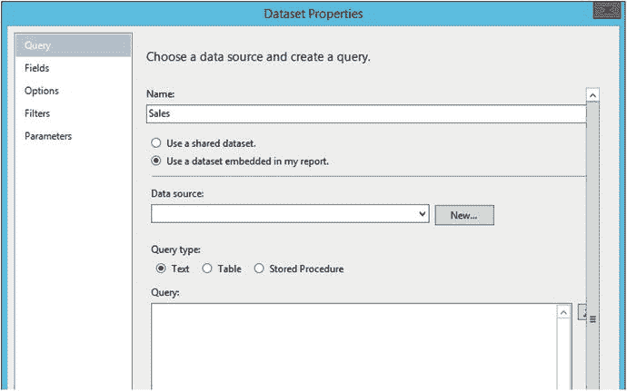
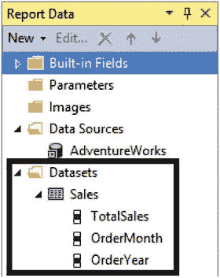
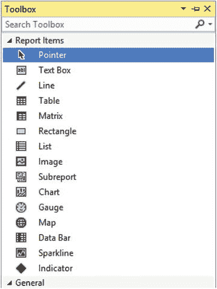
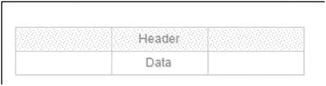
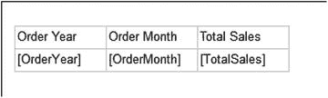
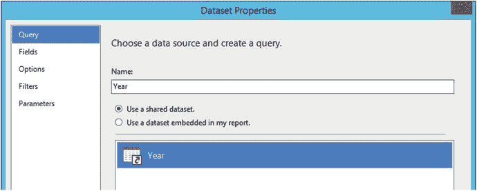
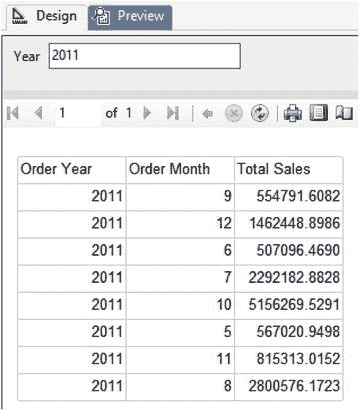
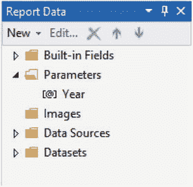
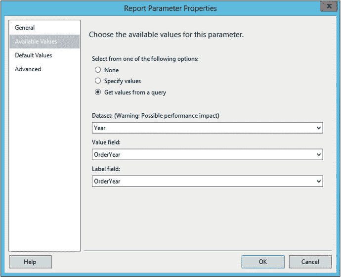
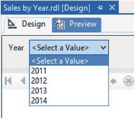

# “数据集属性”对话框

2.  在 `Name` 属性中填写 `Sales`。
3.  选择 `使用嵌入在我报表中的数据集`。操作后，对话框会发生变化。它不再显示共享数据集，而是显示嵌入数据集的属性。图 3-18 显示了更改后对话框的外观。



图 3-18. 嵌入数据集的数据集属性

4.  在 `数据源` 下的下拉框中找到 `AdventureWorks`。此列表中只显示已作为报表一部分设置好的数据源。
5.  如果尚未选择，请将 `查询` 类型选择为 `文本`。
6.  在 `查询` 属性中输入以下代码：

```sql
SELECT SUM(TotalDue) AS TotalSales, MONTH(OrderDate) AS OrderMonth, YEAR(OrderDate) AS OrderYear
FROM Sales.SalesOrderHeader
GROUP BY MONTH(OrderDate), YEAR(OrderDate);
```

7.  点击 `确定` 以创建数据集。

现在，`Sales` 数据集应该在“报表数据”窗口中可见，如图 3-19 所示。除了数据集名称外，您还将看到可用的字段。



图 3-19. Sales 数据集

现在，您可以在报表上显示来自该数据集的数据。请按照以下步骤设置一个简单的报表：

1.  显示 `工具箱` 窗口。如果不可见，请单击报表设计画布，然后从 `视图` 菜单中选择 `工具箱`。工具箱如图 3-20 所示。



图 3-20. 工具箱

2.  将一个 `表` 控件从 `工具箱` 拖到报表设计画布上。您也可以右键单击设计界面，然后选择 `插入` ➤ `表` 来添加表。图 3-21 显示了报表上的表控件。



图 3-21. 表控件

3.  填充表格有几种方式。从“报表数据”窗口中，将 `OrderYear` 字段拖到 `数据` 行最左边的单元格。`标题` 行会自动填充。
4.  将鼠标悬停在 `数据` 行中间的单元格上，直到单元格中出现一个小图标。单击该图标以显示可用字段列表。选择 `OrderMonth`。
5.  单击 `数据` 行右侧的单元格。输入以下代码：

```text
[TotalSales]
```

6.  在上方的标题行中，输入 `Total Sales`。表格网格应如图 3-22 所示。



图 3-22. 已填充单元格的表格

点击 `预览` 以查看报表。显然，此报表尚未准备好发布，但它确实演示了将报表连接到数据所需的步骤。

## 使用共享数据集

共享数据集对于将在整个项目中重用的查询非常有用。SSRS 允许您创建报表，让运行报表的用户能够动态进行筛选。通常，相同的条件将用于多个报表，这是共享数据集的绝佳用途。请按照以下步骤添加共享数据集：

1.  切换回 `设计` 视图。
2.  在“报表数据”窗口中，右键单击 `数据集` 并选择 `添加数据集`。
3.  将数据集命名为 `Year`。
4.  确保选择了 `使用共享数据集`，并从窗口中选择 `Year`。数据集属性对话框应如图 3-23 所示。

    
    图 3-23. 使用共享数据集

5.  点击 `确定` 以创建新数据集。

下一步是修改 `Sales` 数据集，使其需要参数。双击 `Sales` 数据集以打开其属性。您也可以右键单击并选择 `属性`。将 `查询` 更改为以下代码。现在，在运行报表时将需要提供年份：

```sql
SELECT SUM(TotalDue) AS TotalSales, MONTH(OrderDate) AS OrderMonth, YEAR(OrderDate) AS OrderYear
FROM Sales.SalesOrderHeader
WHERE YEAR(OrderDate) = @Year
GROUP BY MONTH(OrderDate), YEAR(OrderDate);
```

运行报表时，您现在需要先输入年份才能看到结果。预览报表。输入 `2011` 并点击 `查看报表`。显示的总计将仅针对 `2011` 年，如图 3-24 所示。



图 3-24. 按年份筛选的结果

报表已成功按年份筛选。用户必须已经知道哪些年份对报表有效。对于有效年份来说，这不是大问题，但对于部门或客户呢？为了提供有效的年份列表供用户选择，请按照以下步骤操作：

1.  切换回 `设计` 视图，并在“报表数据”窗口中展开 `参数` 文件夹。
2.  当您更改查询以按 `@Year` 筛选时，`Year` 参数已自动添加。如图 3-25 所示。

    
    图 3-25. Year 参数

3.  右键单击 `Year` 并选择 `参数属性`，这将打开“报表参数属性”对话框。
4.  在 `常规` 页上，将 `数据类型` 更改为 `整数`。
5.  切换到 `可用值` 页。
6.  将 `从以下选项中选择` 更改为 `从查询中获取值`。
7.  将 `数据集` 属性更改为 `Year`。
8.  将 `值字段` 更改为 `OrderYear`。
9.  将 `标签字段` 更改为 `OrderYear`。对话框应如图 3-26 所示。

    
    图 3-26. 参数属性

10. 点击 `确定` 以接受这些属性。

您将在第 6 章中了解更多关于参数的信息。现在，请预览报表。您将看到一个有效年份的下拉列表，如图 3-27 所示。



图 3-27. 参数列表

尝试为 `Year` 参数使用不同的值运行报表。报表数据应随所选年份的不同而改变。

## 总结

理解数据源和数据集对于报表开发至关重要。数据源是到数据库或其他数据源的连接字符串。数据集是查询。在一个项目中的报表之间共享数据源和数据集是可行的。作为最佳实践，请始终共享数据集。如果查询可以在多个报表中使用，例如用于常用参数，则应共享数据集。

当您向项目添加新报表时，请记住下一步是向报表添加数据源。然后是添加数据集。

第 4 章将介绍如何使用表、文本框以及报表中常用的其他控件。


