# 4. 处理表格、控件和报表区域

过去大约 15 年是真人秀电视节目的时代。但早在《改头换面：家庭版》和《美国偶像》之前，公共电视上就已经存在真人秀节目了。我记得小时候和青少年时期观看过关于烹饪、房屋改造和瑜伽的无剧本节目。我最喜欢的是关于艺术的节目。理论上，你可以通过观看艺术家将空白画布变成美丽的静物或风景画来学习如何创作杰作。

虽然报表可能不是艺术品，但它们有一些相似之处。你也将从一张空白的画布开始，虽然报表上的数据至关重要，但报表的外观也同样重要。

在本章中，你将学习更多关于表格以及用于构建报表的其他几种常见控件的知识。你还将学习如何添加页眉和页脚，为报表增添功能，使其更专业并准备好发布。

## 处理表格

一个报表由多个对象组成，其中一些对象与数据集链接。其他对象向查看者提供有关报表的信息，例如标题或页数。还有一些对象是为了赋予报表特定的外观和感觉，例如公司徽标。最常用的数据区域是表格控件。第 2 章和第 3 章介绍了表格。你将表格与数据链接并修改了一些属性。在本节中，你将学习更多关于表格的知识。

注意

在第 3 章中，你学习了如何创建项目、数据源和数据集。你还学习了如何向项目添加报表。从本章开始，我将不再逐步告诉你如何创建这些对象，而只会告诉你需要创建什么。记住在向项目添加新报表时点击 `添加` ➤ `新建项`，以避免启动向导。如果遇到问题，请回顾第 3 章。

请按照以下步骤开始：

1.  启动 `SQL Server Data Tools (SSDT)`。
2.  创建一个新的报表服务器项目，名称为 `Building Reports`，解决方案名称为 `Beginning SSRS Chapter 4`。
3.  添加一个指向 `AdventureWorks2016` 数据库的新的共享数据源。将其命名为 `AdventureWorks2016`。
4.  创建一个名为 `Working with Tables` 的新报表。确保你添加的是空白报表；不要启动向导。如果需要帮助，请参阅第 3 章。解决方案资源管理器应如图 4-1 所示。

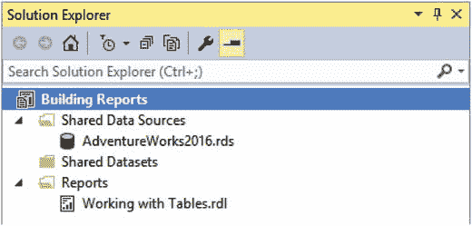

图 4-1. 解决方案资源管理器

注意

`始终显示解决方案` 属性决定当解决方案中只有一个项目时，解决方案名称是否可见。要了解如何设置此选项，请参见第 1 章中的“SSDT 导览”部分。

5.  在“报表数据”窗口中，添加一个数据源 `AdventureWorks`，指向共享数据源 `AdventureWorks2016`。
6.  为报表创建一个新的嵌入数据集，名为 `SalesSummary`，指向 `AdventureWorks` 数据源。
7.  为报表键入以下查询：

```sql
    SELECT YEAR(OrderDate) AS OrderYear, SUM(TotalDue) AS TotalSales
    FROM Sales.SalesOrderHeader
    GROUP BY YEAR(OrderDate);
```

8.  数据集属性应如图 4-2 所示。点击确定以创建数据集。

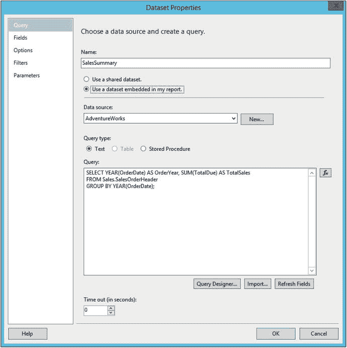

图 4-2. 数据集属性

9.  创建第二个嵌入数据集，名为 `SalesDetails`，指向 `AdventureWorks` 数据源。
10. 将此查询添加到数据集并点击确定。

```sql
    SELECT CustomerID, SalesOrderID, OrderDate, TotalDue
    FROM Sales.SalesOrderHeader;
```

“报表数据”窗口应如图 4-3 所示。

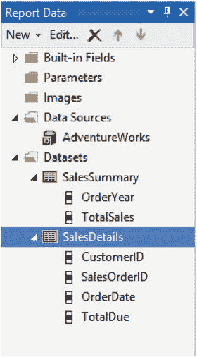

图 4-3. 报表数据窗口

现在数据集已就位，你可以开始构建报表了。向设计图面添加一个新表格。你可以通过从工具箱拖入表格控件，或者右键单击图面并选择 `插入` ➤ `表格` 来实现。

每个表格只能链接到一个数据集。在本例中，你有两个数据集。一旦添加了第一个字段，表格就会链接到该字段所属的数据集。将鼠标悬停在单元格上会显示一个小的字段列表图标。如果只有一个数据集，你将点击该图标以调出字段列表。在本例中，由于有两个数据集，请将鼠标悬停在数据源名称上以查看两个数据集，如图 4-4 所示。点击数据集名称会显示字段列表。

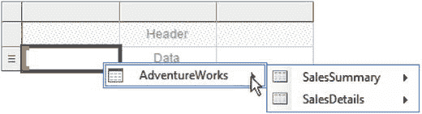

图 4-4. 表格可用的两个数据集

选择 `SalesSummary` 下的 `OrderYear`。现在，当你移动到下一个数据单元格时，只有 `SalesSummary` 的字段可用。为中间的单元格选择 `TotalSales`。你在右侧有一列多余。右键单击最右侧列上方的控制柄，选择 `删除列` 将其移除。

在第一个表格下方向报表添加第二个表格。当你在图面上拖动第二个表格时，会出现蓝色的对齐参考线，帮助你确保对象对齐。对于此表，从 `SalesDetails` 数据集将 `CustomerID`、`SalesOrderID` 和 `OrderDate` 字段添加到报表中。默认情况下，表格有三列，但你需要显示四个字段。你可以通过将字段拖到第三列的右侧来添加额外的列。当你看到出现一个蓝色括号时，放下该字段。图 4-5 显示了其外观。

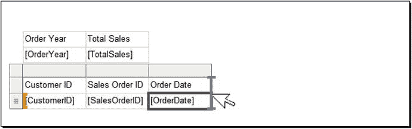

图 4-5. 将新字段拖到表格中

你也可以右键单击第三列并在其右侧插入一列。

每当字段被添加到数据单元格时，单元格的名称会更改为字段的名称。标题单元格也会填充一个值，并在大写字母前添加空格。如果需要，你始终可以编辑标题单元格。


### 属性窗口属性

一个表格有数十个属性。你可以在“属性”窗口中设置其中一部分。选中第一个表格行句柄与列句柄的交叉点以选中表格。表格被选中后，按 `F4` 键打开“属性”窗口。你也可以从菜单中点击 `视图 ➤ 属性窗口`。在图 4-6 所示窗口的顶部，你会看到表格根本就不是被称为“表格”。它是一个 `Tablix`。

图 4-6.
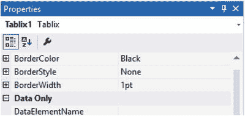

表格即 Tablix 备注

一个数据区域，例如表格、矩阵或列表，实际上被称为 `Tablix`。每一种都有其特定的数据显示布局。你可以从一个表格开始，然后通过按列分组将其转换为矩阵。

“属性”窗口中的属性可以按属性类别或按字母顺序显示。点击“属性”窗口顶部的图 4-7 所示的图标可在两者间切换。还有一个类似于扳手的图标，用于打开“属性页”窗口。你将在下一节了解更多关于属性页的内容。

图 4-7.
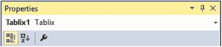

属性窗口图标

由于本章将多次引用 `Tablix1`，请给它起一个有意义的名称：`tblSalesSummary`。为此，在“属性”窗口的“常规”类别中更改 `Name` 属性。

在“常规”属性类别中找到 `DataSetName` 属性。请注意该属性已设置为 `SalesSummary`。

当你点击每个属性时，你会在“属性”窗口底部看到该属性功能的描述。“属性”窗口中的大多数属性无需更改，但你所更改的任何属性都将影响整个表格。将 `边框样式(默认)` 属性更改为 `点线`，将 `边框宽度(默认)` 属性更改为 `3 pt`。“属性”窗口应如图 4-8 所示。

图 4-8.
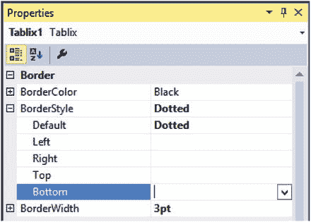

已修改的属性

预览报表。它应如图 4-9 所示。

图 4-9.
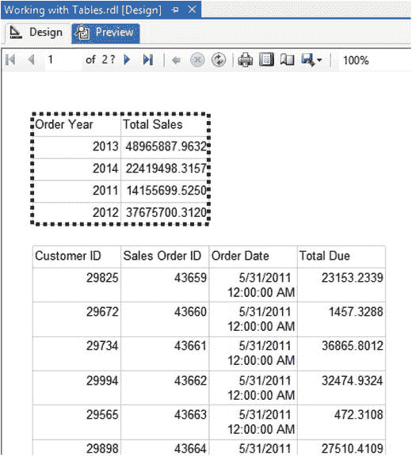

`tblSalesSummary` 带有虚线边框的报表

### 属性对话框属性

除了“属性”窗口，大多数报表对象还有一个属性对话框。两种方法之间可更改的属性有所重叠。一些更高级的属性，例如涉及与其他报表交互的属性，仅在属性对话框中可用。我个人的观点是，只要可能，在对话框中工作会容易得多。

备注

添加到报表的每个对象都有一个名称。默认情况下，名称将是对象类型加一个数字。你可能想知道是否应该为每个对象都起一个描述性的名称。我的规则是为任何将在表达式或计算中引用的对象命名。

切换回设计视图并选中第二个 `Tablix`。当控点出现时，右键单击两个控点的交叉点。选择 `Tablix 属性`，如图 4-10 所示。

图 4-10.
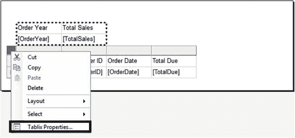

选择 `Tablix 属性`

`Tablix 属性` 对话框有多个页面。在图 4-11 所示的“常规”页面上，将 `名称` 更改为 `tblSalesDetails`。在 `工具提示` 属性中输入 `销售明细`。在 `分页符` 选项下，勾选 `在前面添加分页符`。

图 4-11.
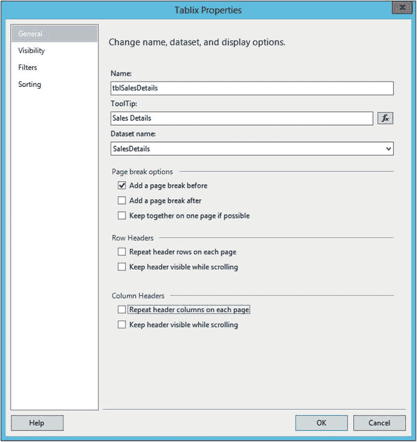

`Tablix 属性` 的“常规”页面

点击“确定”接受属性更改。预览报表。现在 `tblSalesDetails` 将出现在第二页。将鼠标悬停在报表上可查看工具提示。

再看一下图 4-11。“行标题”部分中用于控制标题的那些属性看起来很棒。然而，它们不起作用。如果你回到设计视图，选中这些属性并查看报表，你会发现它们没有任何区别。表格标题不会在每个页面上重复，并且在滚动时标题行也不可见。在第 5 章中，你将学习如何控制行标题和列标题。

图 4-12 显示了“可见性”属性页。你可以选择显示或隐藏表格，并根据表达式设置表格的可见性。参数的值可能是一个很好的表达式。

图 4-12.
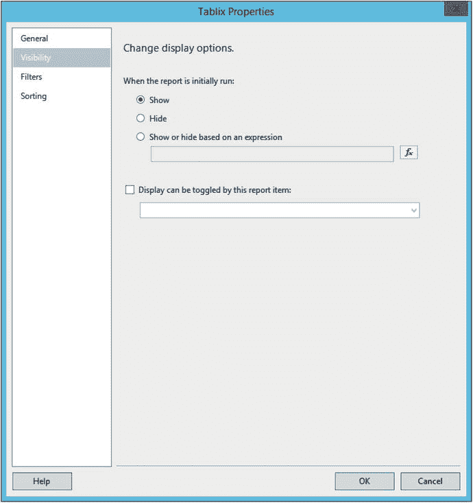

“可见性”属性

理论上，你可以通过从下拉列表中选择一个项目来切换可见性。如果你勾选“显示可以由此报表项切换”并将该属性设置为列表中的任何项目，报表在运行时将显示错误，因此在关闭对话框前请确保取消勾选此项。发生错误的原因是列表中的所有项目都是表格的一部分，它们无法在报表运行前被点击。

“筛选器”页面允许你向数据集返回的数据添加筛选器。通常，这不是一个好主意，因为你应该在数据库层面进行筛选。然而，如果数据源不可筛选（例如来自 XML 文件），此功能很有用。几年前我确实遇到过一个用例。我需要在同一个报表的几个表格中使用同一个数据集，只是应用不同的筛选器。我没有使用不同的筛选器多次提取数据，而是使用了一个数据集，并在每个表格处进行筛选。

我发现调出 `Tablix 属性` 框最常见的原因是更改数据的显示顺序。“排序”页面如图 4-13 所示。点击“添加”并选择 `CustomerID`。再次点击“添加”并选择 `SalesOrderID`。保存属性并预览报表以查看数据现在已排序。

图 4-13.
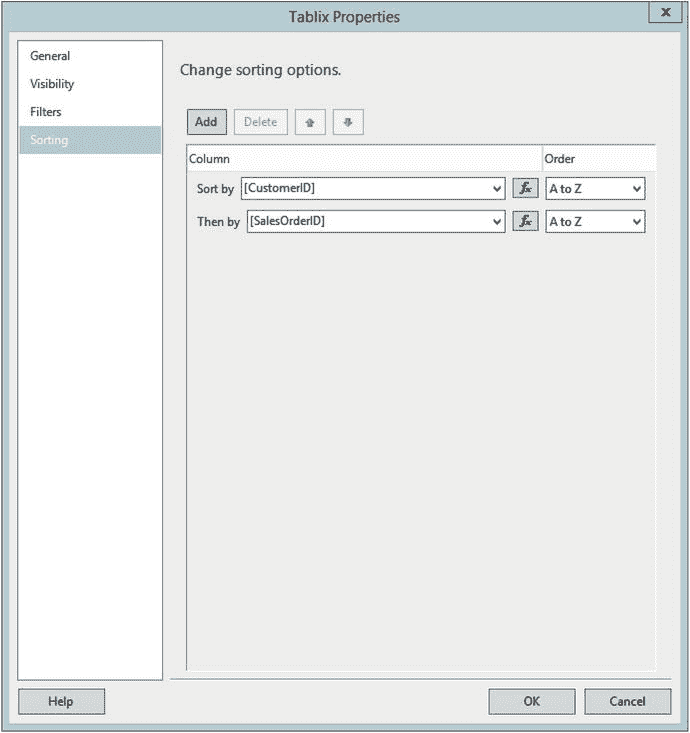

“排序”页面

## 其他报表组件

你可以向报表中添加许多其他元素，以实现附加功能或使报表看起来更具吸引力和专业性。第 7 章涵盖了图表和指标等视觉元素，但本节我们将看看你可以添加的一些更基本的对象。

有许多理由向报表添加独立的 `文本框`（例如，报表标题和页码）。大多数此类对象应在每一页上显示。如果你只是在报表正文顶部添加一个 `文本框`，它只会显示一次。要使其显示在每一页上，需将信息包含在报表页眉中。

### 页面页眉

与文本框和表格类似，页面页眉也具有可修改的属性，用于更改其外观或行为。例如，您可以添加背景色或图片。请按照以下步骤将页面页眉添加到报表中。

1.  右键单击报表画布，选择“插入” ➤ “页面页眉”。您也可以从“报表”菜单插入页面页眉。
2.  右键单击页眉并选择“插入”。如图 4-14 所示，您可以添加的控件列表非常短。它仅限于无需连接到数据的控件。选择 `文本框`。
    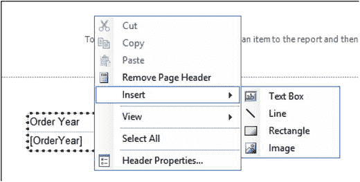
    图 4-14.
    页眉的控件列表
3.  在 `报表数据` 窗格中，展开 `内置字段`，将 `报表名称` 拖动到文本框。您也可以直接将字段拖到页眉以自动添加文本框。
4.  单击文本框的边缘，使其控制柄显示，如图 4-15 所示。
    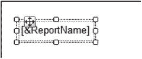
    图 4-15.
    文本框上的控制柄
5.  通过拖动控制柄，重新定位文本框，使其位于报表的左侧。
6.  展开文本框，使其宽度与画布相同。
7.  选中文本框后，将文本居中。您可以通过单击菜单中的 `居中` 图标，或在 `文本框属性` 对话框的 `对齐` 页面上更改 `水平` 属性来实现。
8.  将字体大小更改为 `16 pt`。同样，有多种方法可以做到这一点。选择您喜欢的方式：设计菜单、`属性` 窗格或属性对话框。文本框会自动垂直增长，但您也可以手动增加其高度。
9.  单击文本框，在占位符后添加此文本：`: 销售详情`
10. 选中文字 `销售详情`。如果 `属性` 窗格已打开，您会看到当前所选对象的名称是 `Selected Text`。
11. 将文字 `销售详情` 设为斜体。文本框应如图 4-16 所示。
    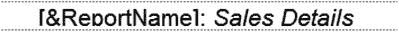
    图 4-16.
    单个文本框中的多种格式
12. 在报表页眉中、文本框下方添加一个线条控件。
13. 通过上下拖动一端来调整线条，使其变为水平。
14. 通过拖动两端来增加线条的长度。
15. 在 `属性` 窗格中将 `线条宽度` 更改为 `2pt`。`线条宽度` 属性表示线条的粗细。线条是最简单的对象。它们没有属性对话框。
16. 复制该线条并粘贴到页眉中。
17. 移动第二条线，使其靠近第一条线并位于其下方。
18. 右键单击报表页眉，选择 `页眉属性`。
19. 在 `打印` 选项部分，取消选中 `在首页打印`。
20. 单击 `确定`。

现在预览报表时，您将看到页眉从第 2 页开始显示，如图 4-17 所示。查看后续页面时，您将继续看到页面页眉。
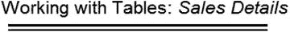
图 4-17.
报表的第 2 页

### 表格单元格格式化

显然，您还可以做很多事情来使此报表看起来更好。首先，按照以下步骤更改 `OrderDate` 和 `TotalDue` 字段的格式：

1.  切换到设计视图。
2.  右键单击 `OrderDate` 单元格，选择 `文本框属性`。
3.  选择 `数字` 选项卡，在 `类别` 下选择 `日期`。
4.  选择 `2000-01-31` 格式，然后单击 `确定`。
5.  打开 `TotalDue` 单元格的 `文本框属性`。
6.  选择 `数字` 选项卡，在 `类别` 下选择 `货币`。
7.  确保 `小数位数` 设置为 `2`。
8.  勾选 `使用千位分隔符 (,)`，然后单击 `确定`。

预览报表时，表格应如图 4-18 所示。
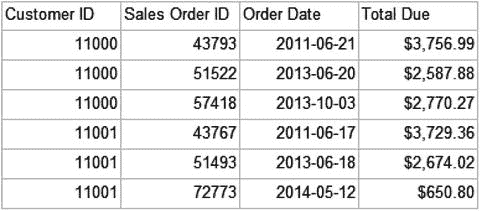
图 4-18.
格式化后的表格

下一步是格式化标题行。幸运的是，您无需单独格式化每个单元格。请按照以下步骤格式化该行：

1.  在设计视图中，单击 `tblSalesDetails` 的一个单元格。
2.  此时会出现行和列的控制柄。选择标题行旁边的控制柄。
3.  在 `属性` 窗格中，将 `背景色` 更改为 `矢车菊蓝`。
4.  将 `字体颜色` 属性更改为 `白色`。
5.  将 `字体粗细` 属性更改为 `加粗`。
6.  现在，单击 `销售订单 ID` 列。
7.  通过逐个选中各列，然后在设计菜单中单击 `右对齐` 图标，将每列右对齐。
8.  表格可能无法很好地对齐在报表页眉下方。请按照以下步骤调整报表。
9.  右键单击报表画布，选择 `视图` ➤ `标尺`。
10. 拖动报表标题的右边缘，使其宽度为 `5 英寸（12.5 厘米）`。
11. 选中两条线。按住 `CTRL` 键并按向右箭头键，直到线条排列在标题下方。
12. 将报表画布的右边缘尽可能向左拖动，直到它碰到某个控件为止。

为了使长报表更易于阅读，您可能希望交替显示行的背景色。不幸的是，没有可以直接更改的属性来实现这一点。但是，您可以使用表达式来控制 `背景色` 属性。选择数据行。在 `属性` 窗格中，将 `背景色` 更改为 `= IIf(RowNumber(Nothing) Mod 2 = 0, "浅蓝", "白色")`。

现在预览报表。报表的第 2 页应如图 4-19 所示。
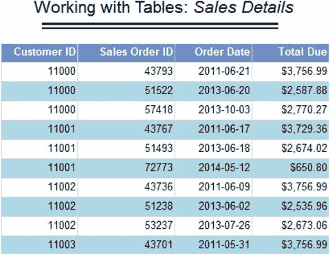
图 4-19.
格式化后的销售报表

使用表达式控制几乎任何属性的值是 SQL Server Reporting Services (SSRS) 的一个强大功能。要确定某个属性是否可以用表达式控制，请在属性列表或页面中查找 `表达式` 一词或 `fx` 符号。

### 页面页脚

页面页脚对于显示页码和查看报表的日期等信息也相当有用。要添加页面页脚，请按照以下步骤操作：

1.  切换到设计视图。
2.  右键单击报表正文，选择 `插入` ➤ `页面页脚`。
3.  右键单击页脚，选择 `页脚属性`。
4.  在 `打印` 选项部分，取消选中 `在首页打印` 属性。
5.  单击 `确定` 接受更改。
6.  从 `报表数据` 窗格的 `内置字段` 文件夹中，将 `执行时间` 拖动到页脚。
7.  增加该字段的宽度，使其约为原始宽度的两倍。
8.  在页脚中添加一个文本框。确保它在水平方向上与执行时间文本框对齐。
9.  在文本框中输入此表达式：`第 [&PageNumber] 页/共 [&TotalPages] 页`。您也可以打开 `表达式` 对话框来帮助您编写。

    **注意**
    通过添加 `总页数` 属性，报表必须在将第一页返回给用户之前完全构建完成。如果报表非常大，这可能会给人一种性能问题的印象。

10. 将文本框的宽度加倍。
11. 在页脚顶部添加一条线。
12. 将线条调平，并将其两端拖动至报表宽度。

运行报表时，第二页的报表页脚应如图 4-20 所示。

图 4-20.
报表页脚


### 报告封面页

报告的第一页可以作为封面页。你无法向设计画布添加单独的页面，但可以在表格或其他一些对象之前或之后添加分页符。在此例中，你已为 `tblSalesDetails` 表开启了分页前分页，并为第一页关闭了页眉和页脚。在此例中，你将添加一个矩形控件作为其他控件的容器。你将设置该矩形的 `PageBreak` 属性以强制分页。

要创建封面页，请按照以下步骤操作：

1.  在设计视图中，向下拖动页脚顶部以将报表体的大小增加到 7 英寸（18 厘米）。图 4-21 显示了页脚顶部（虚线）。

    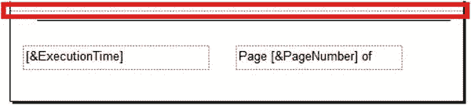

    图 4-21.
    报表页脚
2.  向下拖动 `tblSalesSummary` 表，使其刚好位于页脚上方。
3.  删除 `tblSalesSummary` 表。
4.  向报表添加一个矩形控件。
5.  展开矩形，使其顶部紧接页眉下方，底部紧接 `tblSalesDetail` 表上方，且边缘与报表画布同宽。
6.  右键单击矩形内部并选择“矩形属性”。将边框属性更改为如图 4-22 所示。

    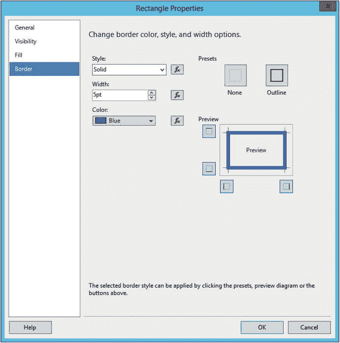

    图 4-22.
    矩形边框属性
7.  在“常规”页面上，勾选“之后添加分页符”。确保“尽可能将内容保持在单个页面上”被勾选。单击“确定”保存属性。
8.  调出 `tblSalesDetails` 表的“Tablix 属性”，取消勾选“之前添加分页符”属性，然后单击“确定”。
9.  向矩形添加一个文本框并输入 `Sales Report`。
10. 将字体大小更改为 `20 pt`。
11. 将文本框定位在顶部附近并居中，然后适当调整其大小。
12. 向矩形添加一个表格。
13. 从 `SalesSummary` 数据集填充 `OrderYear` 和 `TotalSales`。
14. 删除最右边的列。
15. 选择标题行并将字体加粗。
16. 将 `TotalSales` 单元格格式设置为货币格式，无小数位，带千位分隔符。
17. 将每列右对齐。
18. 更改表格，使其按 `OrderYear` 排序。
19. 向矩形顶部添加一个图像控件。
20. 将出现“图像属性”对话框。单击“导入”并导航到本章代码所在位置的 `AdventureWorks.jpg` 文件。
21. 单击“确定”保存属性。调整图像大小。

这个封面页相当简单。它有一个蓝色边框、一个标题和数据摘要。对于你的报表任务，你可以添加背景颜色或图形以及更多信息。图 4-23 显示了封面页的顶部。

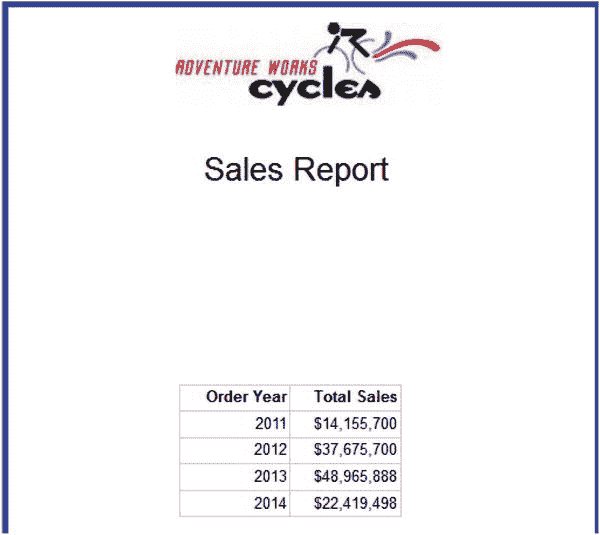

图 4-23.
封面页

页面页脚将详细信息的第一页显示为第 2 页。由于你有一个封面页，你可能希望该页显示为第 1 页。要解决此问题，请按照以下步骤操作：

1.  切换回设计视图。
2.  删除 `pages` 文本框。
3.  在页面页脚中添加一个新的文本框。
4.  右键单击新的文本框并选择“表达式”。
5.  输入此表达式：

    ```
    ="Page " & Globals!PageNumber -1 & " of " & Globals!TotalPages -1
    ```

6.  单击“确定”。

### 包含数据的文本框

你已经看到数据区域是由文本框构成的。你也看到了包含非连接信息的文本框，例如文本框中的报表名称。可以从一个数据集中填充独立的文本框。该文本框无法显示详细数据；它必须显示摘要值。要查看此操作，请将 `TotalSales` 字段从 `SalesSummary` 数据集拖到报表画布上。查看如图 4-24 所示的表达式属性。你可以通过右键单击文本框并选择“表达式”来找到它。

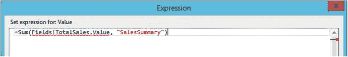

图 4-24.
文本框表达式属性

该值已使用 `Sum` 函数自动汇总。第二个参数 `SalesSummary` 是数据集上下文。

### 计算字段

报表通常需要计算字段，例如销售利润率。有许多方法可以实现这一点。如果数据源自数据库系统，通常可以将计算添加到查询本身。如果不可行（例如，数据源不支持或报表开发人员无法修改查询），则可以在单元格内创建计算。但是，如果该单元格的结果需要在另一个单元格的表达式中使用，则会出现问题。你无法将包含表达式的单元格嵌套在另一个表达式中。

如果计算需要在多个表达式中使用，你可以向数据集添加计算字段。要了解如何添加计算字段，请按照以下步骤操作：

1.  在“解决方案资源管理器”中，添加一个名为 `Calculated Field` 的新报表。
2.  向报表添加一个名为 `AdventureWorks` 的数据源，指向 `AdventureWorks2016` 共享数据源。如果需要帮助，请回顾第 3 章。
3.  添加一个名为 `Sales` 的新数据集，指向 `AdventureWorks` 数据源，并使用此嵌入查询：

    ```
    SELECT TOP(1000) SOD.SalesOrderID, SOH.OrderDate,
    SOD.OrderQty, SOD.UnitPrice,
    P.StandardCost
    FROM Sales.SalesOrderHeader AS SOH
    JOIN Sales.SalesOrderDetail AS SOD
    ON SOH.SalesOrderID = SOD.SalesOrderID
    JOIN Production.Product AS P ON P.ProductID = SOD.ProductID;
    ```

4.  保存数据集后，右键单击并选择“添加计算字段”，这将打开“数据集属性”对话框的“字段”页面。
5.  图 4-25 所示的对话框显示了现有字段，底部有一个空白行。

    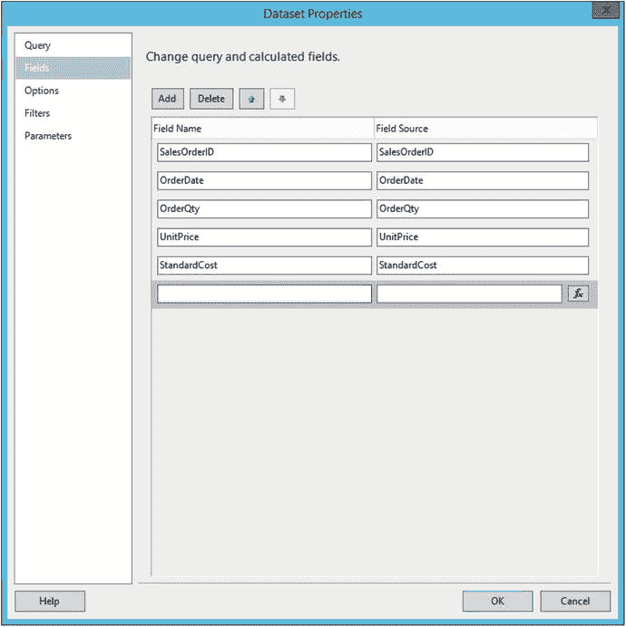

    图 4-25.
    字段页面
6.  在第一个新“字段名称”中输入 `ExtendedCost`。
7.  单击 `fx` 图标以调出表达式窗口。
8.  在“类别”列表中，选择“字段 (Sales)”。
9.  在“值”列表中，双击 `OrderQty` 字段。
10. 在字段名称后添加乘号 (`*`)。
11. 双击 `StandardCost` 字段。最终表达式为：

    ```
    =Fields!OrderQty.Value * Fields!StandardCost.Value
    ```

12. 单击“确定”接受表达式。
13. 单击“添加 ➤ 计算字段”创建另一个名为 `ExtendedPrice` 的表达式。此表达式为：

    ```
    =Fields!OrderQty.Value * Fields!UnitPrice.Value
    ```

14. 单击“确定”保存表达式。
15. 单击“确定”保存新字段。你将在 `Sales` 数据集字段列表中看到新字段，如图 4-26 所示。

    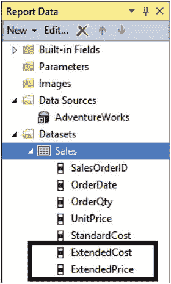

    图 4-26.
    新计算字段
16. 向报表画布添加一个表格控件。
17. 将以下字段添加到表格：`SalesOrderID`, `OrderDate`, `OrderQty`, `StandardCost`, `ExtendedCost`, `UnitPrice`, `ExtendedPrice`。
18. 向表格添加一个新列。
19. 右键单击新的数据单元格并选择“表达式”。
20. 输入此表达式：

    ```
    =Fields!ExtendedPrice.Value - Fields!ExtendedCost.Value
    ```

21. 在标题单元格中输入 `Margin`。

当你预览报表时，你会看到计算字段按预期工作。


### 列表控件

列表控件的工作方式与表格类似，但它不是使用单元格，而是为每一行数据重复一个自由格式的布局区域。在本节中，你将创建一个使用列表控件的新报告。请按照以下步骤创建报告。

1.  在项目中添加一个名为 `List Report` 的新报告。
2.  向报告中添加一个名为 `AdventureWorks` 的新数据源，该数据源链接到 `AdventureWorks2016` 共享数据源。如果此步骤需要帮助，请回顾第 3 章。
3.  创建一个名为 `ProductList` 的新数据集，指向 `AdventureWorks` 数据源，并使用以下嵌入式查询：

    ```sql
    SELECT P.ProductID, P.Name, PH.LargePhoto
    FROM Production.Product AS P
    JOIN Production.ProductProductPhoto AS PP ON P.ProductID = PP.ProductID
    JOIN Production.ProductPhoto AS PH ON PP.ProductPhotoID = PH.ProductPhotoID
    JOIN Production.ProductSubcategory AS SC ON SC.ProductSubcategoryID = P.ProductSubcategoryID
    JOIN Production.ProductCategory AS C ON C.ProductCategoryID = SC.ProductCategoryID
    WHERE PP.[Primary] = 1 AND C.ProductCategoryID IN (1,4);
    ```

4.  在报告画布上添加一个 `列表` 控件。
5.  从 `ProductList` 数据集中，将 `ProductID` 和 `Name` 拖放到列表中。系统会自动创建文本框来容纳这些字段。
6.  将列表的宽度加倍。
7.  将列表的 `BorderStyle Default` 属性更改为 `Solid`。
8.  从工具箱中，将一个 `图像` 控件拖放到列表中。
9.  这将打开 `图像属性` 对话框。按照图 4-27 所示设置属性。

    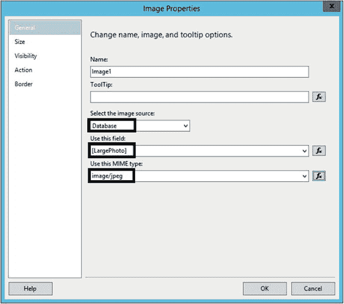
    *图 4-27. 图像属性框*

10. 点击 `确定` 接受属性设置。
11. 调整 `图像` 控件的大小以扩展。

现在，当你预览报告时（如图 4-28 所示），你将看到数据库中为每个产品存储的图像。有些产品的图像只显示“无可用图像”。这不是 SSRS 在图像缺失时的功能；它是一张真实的图片。

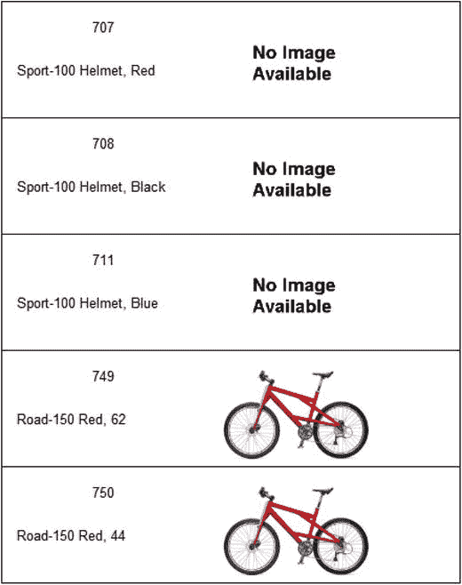
*图 4-28. 列表报告*

## 设置报告属性

在第 2 章中，我向你介绍了打印报告时可能遇到的问题。在某些情况下，报告打印出来会每隔一页是空白页。在本节中，你将看到如何解决这个问题。请按照以下步骤创建一个因过宽而无法打印的报告：

1.  在任何报告的设计视图中，通过右键单击报告画布并选择 `视图` ➤ `标尺` 来启用标尺。
2.  拖动报告的右侧，使报告宽度大约为 9 英寸（22.5 厘米）。
3.  预览报告。
4.  切换到打印布局视图。
5.  逐页滚动浏览报告。

因为报告宽度超过了默认纸张尺寸，所以它会在每个已填充页面之后打印一个空白页。如果控件放置在画布右侧过远的位置，你还会看到报告被分割到多个页面上。要解决此问题，你需要确保报告宽度不超过打印所用的纸张尺寸。

通常，在开发人员处理报告时，添加和删除对象可能会导致画布在不被注意的情况下扩展。第一步是拖动报告右侧以移除任何空白区域。

以下是你可以用来解决报告打印问题的几种方法：

*   将纸张方向从纵向更改为横向。
*   修改页边距。
*   更改纸张尺寸。确保这与你用于打印报告的纸张相匹配。
*   调整列宽。

图 4-29 显示了 `报告属性` 对话框。它可以在 `报告` 菜单中找到。

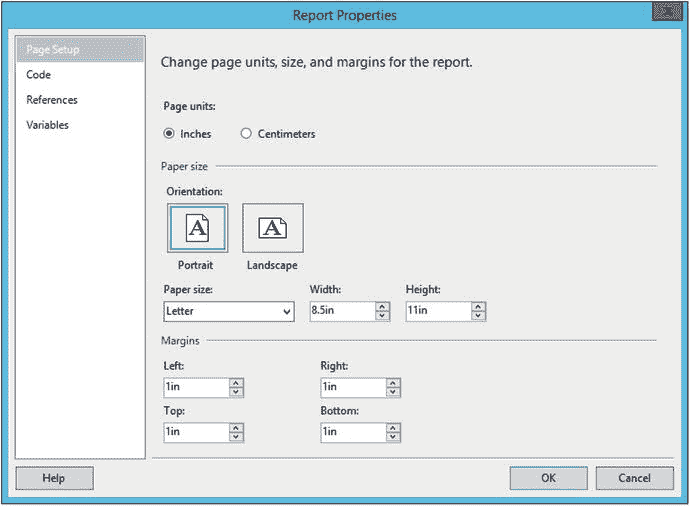
*图 4-29. 报告属性对话框*

根据经验法则，报告宽度加上左右边距不应超过纸张宽度。

## 总结

在本章中，你学习了如何从空白画布创建报告。你可以向报告添加许多组件，包括页眉和页脚。几乎所有属性的值都可以通过表达式控制，并且你可以向数据集添加计算字段。始终确保报告能适应打印页面非常重要，本章介绍了如何调整报告属性来实现这一点。

在第 5 章中，你将学习如何向报告添加分组级别。

