# 5. 向报告添加分组级别

我六岁生日时举办了一个生日派对。我记得我要求了一个巧克力蛋糕配巧克力糖霜、巧克力冰淇淋和巧克力牛奶。我还想要我的蛋糕是多层的婚礼蛋糕。直到多年后我真正的婚礼招待会上，我才得到婚礼蛋糕，而且我确信我妈妈为我六岁生日烤的蛋糕是一个单层的巧克力烤盘蛋糕。

你在第 3 和 4 章中创建的报告，每个表格只显示了一个层级，很像我生日派对上的那个简单蛋糕。在本章中，你将学习如何创建包含多个分组级别的报告，包括矩阵报告。

## 设计你的报告

任何项目，无论大小，最重要的阶段都是设计。在开始构建解决方案之前，你必须知道要尝试完成什么。SQL Server Reporting Services (SSRS) 报告本身是一个相对较小的项目，但在启动 SQL Server Data Tools (SSDT) 之前，理解需求并提出设计方案将为你节省时间和减少挫折感。

根据你公司或部门对文档的要求，你最终可能只使用白板或纸张来勾勒设计。对于需要多个分组级别、计算或任何高级功能的报告，花些时间弄清楚报告应该是什么样子。如果你幸运的话，提出报告需求的人会随需求一起提供一个设计布局。

你的公司可能有一个非常正式的新报告请求程序，需求明确。或者，也许一个报告请求可能只是通过一个电话提出。在本章中，你将经历基于一个简单请求构建报告的过程。

### 报告需求

你收到了销售部门经理的报告请求：

“我们需要一个显示按区域和年份的销售情况的报告。”

此时，你可以开始构建报告，但也许你应该在启动 `SSDT` 之前问一些问题。

我如何确定区域？报告上需要显示哪些字段？你需要看到小计或其他计算吗？报告应该先按区域分组再按年份分组，还是反过来？报告上需要显示的最低详细级别是什么？

在与经理会面时，你了解到以下信息：

*   查询将会被提供。
*   首先按年份分组，然后在年份内按区域分组。
*   对于每一年，显示总销售额和跨区域的平均销售额。
*   对于每个区域，显示区域名称、ID 和总销售额。
*   作为最低详细信息，显示商店名称、客户 ID 和总销售额。
*   按总销售额降序对详细信息排序。
*   按降序对年份排序。
*   按字母顺序对区域排序。

你现在有了更具体的需求，这些需求可能完整也可能不完整。根据我的经验，提出报告需求的人通常在看到实际的报告后，会对报告上应该包含什么以及如何组织有更好的想法。


### 报表布局

现在你有了更多细节，可以在白板或纸上开始勾画报表布局了。你设计出了如图 5-1 所示的布局。

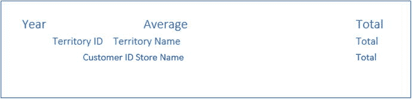

图 5-1. 报表布局

销售经理批准了该布局，你就可以开始构建实际的报表了。

## 构建具有分组级别的报表

这个报表将有三个级别，但它仍然是一个相对简单的报表。你在本章学到的技能将很容易应用于更复杂的报表。

**注意**

第 3 章涵盖了数据源和数据集的使用。第 4 章涵盖了添加控件以及如何修改属性。如果你需要这些主题的逐步指导，请参考这些章节。

请按照以下步骤开始：

1.  使用 `SSDT`，在一个名为 `Beginning SSRS Chapter` 5 的解决方案中创建一个名为 `Grouping Level Reports` 的新报表项目。
2.  创建一个指向 `AdventureWorks2016` 的共享数据源，也命名为 `AdventureWorks2016`。
3.  向项目中添加一个名为 `Sales by Territory` 的新报表。
4.  向报表中添加一个名为 `AdventureWorks` 的数据源。该数据源应指向 `AdventureWorks2016` 共享数据源。
5.  向报表中添加一个名为 `SalesByTerritory` 的嵌入数据集，该数据集使用 `AdventureWorks` 数据源。使用此查询：

    ```sql
    SELECT YEAR(OrderDate) AS OrderYear, C.CustomerID, SUM(TotalDue) AS Sales,
    T.TerritoryID, T.Name AS Territory, s.Name AS Store
    FROM sales.SalesOrderHeader AS SOH
    JOIN Sales.SalesTerritory AS T ON SOH.TerritoryID = T.TerritoryID
    JOIN Sales.Customer AS C ON SOH.CustomerID = C.CustomerID
    JOIN Sales.Store AS S ON S.BusinessEntityID = C.StoreID
    GROUP BY C.CustomerID, T.TerritoryID, T.Name,
    YEAR(OrderDate), S.Name;
    ```

6.  向报表设计画布中添加一个表格。
7.  将 `CustomerID`、`Store` 和 `Sales` 字段添加到 `Data` 行。

报表设计应如图 5-2 所示。

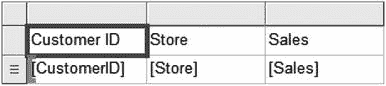

图 5-2. 报表设计

### 向表行添加分组级别

到目前为止，详细信息行已经就位。详细信息行将嵌套在基于 `TerritoryID` 的分组级别中。有两种方法可以添加分组级别，你将学习这两种方法。请按照以下步骤向表格添加分组级别：

1.  `右键单击` 数据行中的任意单元格。
2.  选择 `添加组` ➤ `行组` ➤ `父组`，如图 5-3 所示。

    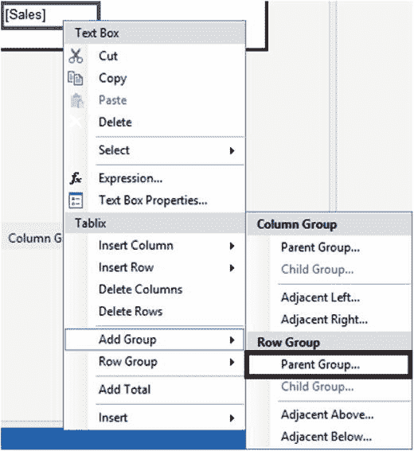

    图 5-3. 添加父组
3.  这将打开 `Tablix 组` 对话框。在 `分组依据` 下拉框中选择 `TerritoryID`。
4.  选择 `添加组头`。
5.  对话框应如图 5-4 所示。

    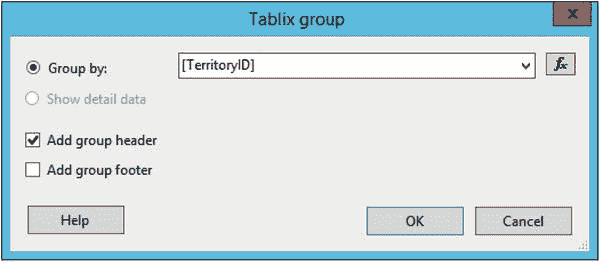

    图 5-4. Tablix 组属性
6.  `单击` `确定`。图 5-5 显示了添加了第一个分组级别的表格。

    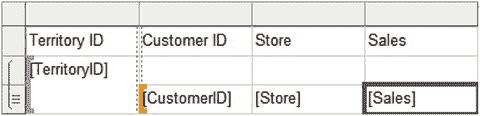

    图 5-5. 添加到表格的第一个组

在此图中，选中了 `Sales` 数据单元格。注意，`CustomerID` 单元格左侧可见一个橙色括号。这表示所选单元格的分组级别。在此情况下，它是详细信息级别。`单击` 其中一个空白单元格。现在可以在 `TerritoryID` 单元格上找到括号，如图 5-6 所示。

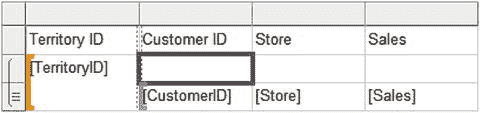

图 5-6. 括号位于 TerritoryID 上

这意味着中间行的单元格属于 `TerritoryID` 组。将 `Sales` 字段添加到右侧的空白单元格。因为这是详细信息之外的一个分组级别，该字段会自动求和，如图 5-7 所示。

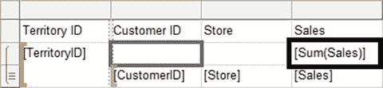

图 5-7. 销售额被自动求和

在 `CustomerID` 列中，将 `Territory` 字段添加到空白单元格。占位符没有显示它，但它是该组中找到的第一个值。由于每个 `TerritoryID` 对应一个 `Territory`，此表达式将有效。`预览` 报表；此时它应如图 5-8 所示。

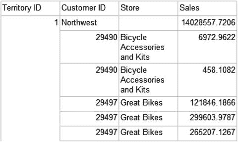

图 5-8. 报表预览

### 向分组窗口添加分组级别

报表底部的分组窗口提供了另一种添加和配置分组级别的方法。右侧的 `列组` 用于矩阵报表。你将在本章后面的“构建矩阵报表”一节中学习矩阵报表。

此时，切换回设计视图后，你应该在窗口中看到 `TerritoryID` 行组。要添加下一个分组级别，请按照以下步骤操作：

1.  如果报表画布下方没有显示 `分组` 窗口，`右键单击` 报表并选择 `视图` ➤ `分组`。
2.  在 `行组` 窗口中，`单击` `TerritoryID` 旁边的向下箭头。
3.  选择 `添加组` ➤ `父组`，如图 5-9 所示。

    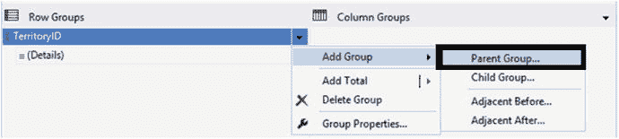

    图 5-9. 添加父组
4.  在 `Tablix 组` 对话框中，为 `分组依据` 属性选择 `OrderYear`。
5.  `勾选` `添加组头`。
6.  `单击` `确定`。`行组` 部分现在将如图 5-10 所示。

    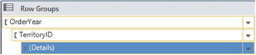

    图 5-10. 行组
7.  在 `Sales` 列的空白单元格中，添加 `Sales`。这将是年度总计。
8.  在 `Store` 列第二行的空白单元格中，创建一个表达式，公式如下：`=Sum(Fields!Sales.Value)/CountDistinct(Fields!TerritoryID.Value)`。这将给出各区域的平均销售额，换句话说，是总和的平均值。

报表设计应如图 5-11 所示。

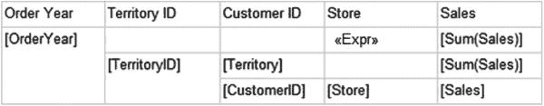

图 5-11. 报表设计

当你 `预览` 报表时，你会发现还需要做一些清理工作。此时报表如图 5-12 所示。

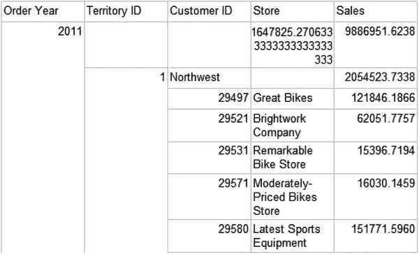

图 5-12. 预览模式下的报表


