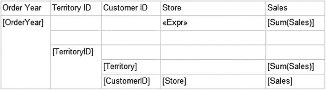
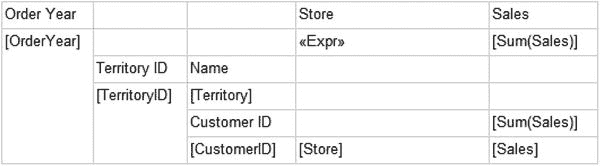
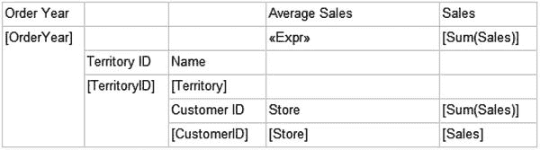
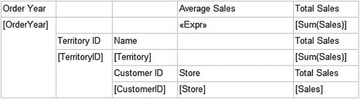
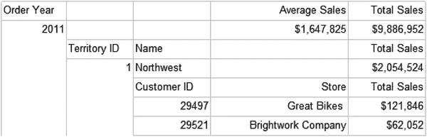
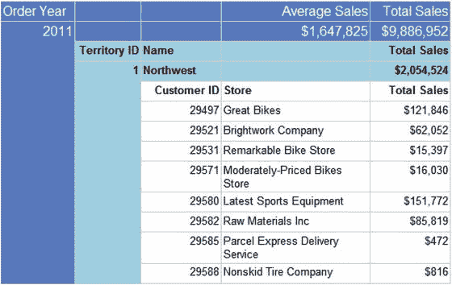
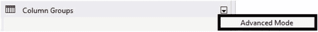
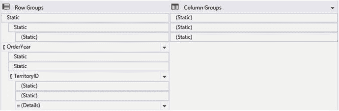

# 格式化报告

请按以下步骤开始格式化报告：

1.  切换到设计视图。
2.  将引用了 `Sales` 字段的四个单元格格式化为带千位分隔符、不带小数点的货币格式。请记住，格式化一个单元格后，你可以选择其他三个单元格并一次性粘贴该格式。
3.  减小 `Order Year` 和 `Territory ID` 列的宽度。
4.  增加 `Store` 列的宽度。

该报告采用的是为报告添加分组级别时的默认分组布局，但你始终可以重新排列它。现在，你将添加两行新行来修改布局。请按以下步骤操作：

1.  右键单击 `TerritoryID` 单元格，选择 插入行 ➤ 组内 ➤ 上方。这会为 `TerritoryID` 组添加一个新行。
2.  再次右键单击 `TerritoryID` 单元格，选择 插入行 ➤ 组外 ➤ 上方。这会为 `OrderYear` 组添加一个新行。表格布局应如图 5-13 所示。

*图 5-13. 添加了两行新行的报告布局*

3.  在第 2 列，将 `Territory ID` 标题移动到 `TerritoryID` 上方的单元格。
4.  在第 3 列，将 `Territory` 数据字段向上移动一行。
5.  将 `Customer ID` 标题移动到 `CustomerID` 数据单元格上方。
6.  在 `Territory` 数据单元格上方键入 `Name`。此时，布局应如图 5-14 所示。

*图 5-14. 重新排列单元格后的报告预览*

7.  在第 4 列，将 `Store` 标题移动到 `Store` 数据单元格上方的单元格。
8.  在顶部行，平均销售额表达式的上方，键入 `Average Sales`。此时，布局应如图 5-15 所示。

*图 5-15. 重新排列第 4 列后的布局*

9.  在第 5 列，将第 1 行的标题更改为 `Total Sales`。
10. 在第 3 行（区域标题行），键入 `Total Sales`。
11. 在第 4 行，添加将自动求和的 `Sales` 字段。
12. 将单元格格式化为不带小数、带千位分隔符的货币格式。
13. 在第 5 行（明细标题行），将 `Sales` 字段更改为文本 `Total Sales`。布局应如图 5-16 所示。

*图 5-16. 重新排列第 5 列后的布局*

14. 选择 `Average Sales` 列。将对齐方式设置为 `右对齐`。
15. 选择 `Total Sales` 列。将对齐方式设置为 `右对齐`。
16. 预览报告。它应如图 5-17 所示。

*图 5-17. 预览模式下的格式化报告*

你可以使用颜色和其他格式方面来突出显示分组级别。请按以下步骤格式化分组：

1.  切换回设计视图。
2.  选择顶部行并查看属性窗口。将 `FontSize`（字体大小）更改为 `12 pt`，将 `BackgroundColor`（背景色）更改为 `CornflowerBlue`（矢车菊蓝），并将“字体”部分中的 `Color`（颜色）属性更改为 `White`（白色）。
3.  对第二行重复此格式设置。
4.  选择第三行。将 `BackgroundColor` 更改为 `LightBlue`（浅蓝色），并将 `FontWeight`（字体粗细）更改为 `Bold`（加粗）。
5.  对第四行重复此格式设置。
6.  选择第五行。将字体加粗。

现在当你预览报告时，它看起来如图 5-18。

*图 5-18. 带格式设置的报告预览*

当你滚动浏览报告时，你会看到标题在后续页面上消失了。要使标题在每一页上重复，请按以下步骤操作：

1.  切换回设计视图。
2.  单击“列组”窗口右侧的下拉箭头，选择 `高级模式`，如图 5-19 所示。

*图 5-19. 选择高级模式*

3.  选择 `高级模式` 后，“行组”和“列组”将展开。你将看到静态节，如图 5-20 所示。

*图 5-20. 展开的分组窗口*

4.  使用属性窗口，为“行组”下找到的每个静态区域将 `RepeatOnNewPage`（在新页上重复）值更改为 `True`（真）。

现在当你预览报告时，标题将在每一页上重复。

