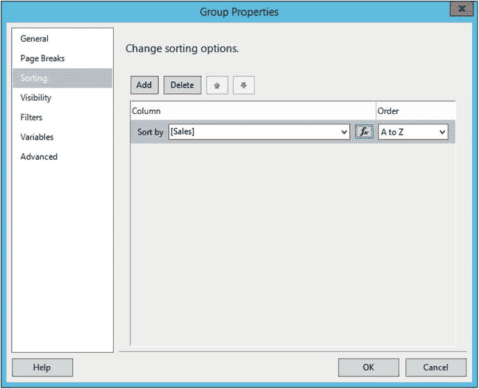

# 对分组进行排序

还有一个要求尚未解决，即排序。明细必须按销售总额降序排列。报告还必须按年份降序排列。请按以下步骤根据要求修改排序顺序。

1.  在“行组”窗口中，右键单击“明细”组并选择“组属性”。
2.  在“组属性”对话框中，选择“排序”选项卡。
3.  单击“添加”。
4.  在“排序依据”属性中选择 `Sales`。
5.  在“顺序”属性中选择 `Z 到 A`。“组属性”对话框应如图 5-21 所示。

    
    *图 5-21. 排序属性对话框*

6.  单击“确定”接受属性设置。
7.  修改 `OrderYear` 组属性，使报告按 `OrderYear` 降序排序。组会自动按分组字段排序。
8.  右键单击 `TerritoryID` 组并调出“组属性”。
9.  选择“排序”选项卡。将现有的排序顺序从 `TerritoryID` 字段更改为 `Territory` 字段。完成后单击“确定”。

