# 完成报告

报告已基本准备好向经理展示。请按以下步骤完成报告：

1.  切换到设计视图。
2.  将表格拖动到报告的顶部和左侧。
3.  拖动报告画布的底部和右侧边缘。
4.  在“报告”菜单中，单击“添加页面页眉”和“添加页面页脚”。
5.  在页面页眉中添加一个文本框。键入 `Territory Sales`。
6.  将文本框扩展到画布的宽度。
7.  居中文本。
8.  将字体大小增加到 `18 pt`。
9.  从“报告数据”窗口的“内置字段”中，将 `Execution Time`（执行时间）拖到报告页脚。
10. 将文本框的宽度加倍。
11. 在页脚添加另一个文本框。
12. 将此表达式添加到文本框中：

    ```
    ="第 " & Globals!PageNumber & " 页，共 " & Globals!TotalPages & " 页"
    ```

13. 从“报告”菜单启动“报告属性”对话框。
14. 将 `上` 和 `下` 页边距更改为 `0.25 in` 或 `0.635 cm`。
15. 查看报告。调整任何合理的设置。

现在，你已准备好将报告展示给经理以获取反馈。


## 使用备用布局构建报表

查看报表后，经理确认数字正确，但希望采用不同的布局。备用布局类似于您在第 2 章中使用向导创建的报表，如图 5-22 所示。

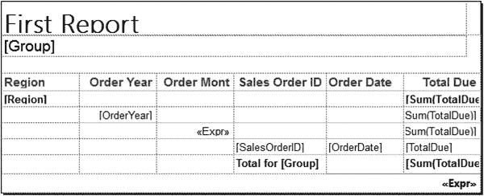

图 5-22.
备用报表布局

要创建具有此布局的报表，请按照以下步骤操作：

1.  向项目中添加一个新报表，命名为“按区域的销售额 2”。
2.  向报表添加一个名为 AdventureWorks 的数据源，指向 AdventureWorks2016 共享数据源。
3.  向报表添加一个名为 SalesByTerritory 的嵌入数据集，指向 AdventureWorks 数据源，使用以下查询：
    ```
    SELECT YEAR(OrderDate) AS OrderYear, C.CustomerID, SUM(TotalDue) AS Sales,
    T.TerritoryID, T.Name AS Territory, s.Name AS Store
    FROM sales.SalesOrderHeader AS SOH
    JOIN Sales.SalesTerritory AS T ON SOH.TerritoryID = T.TerritoryID
    JOIN Sales.Customer AS C ON SOH.CustomerID = C.CustomerID
    JOIN Sales.Store AS S ON S.BusinessEntityID = C.StoreID
    GROUP BY C.CustomerID, T.TerritoryID, T.Name,
    YEAR(OrderDate), S.Name;
    ```
4.  向报表画布添加一个表。
5.  将 CustomerID、Store 和 Sales 添加到数据行。
6.  向 CustomerID 添加一个父行组。
7.  在 Tablix 组对话框中，在“分组依据”属性中填写 TerritoryID。
8.  选中“添加组标题”。单击“确定”接受属性。
9.  向 TerritoryID 添加一个父行组。
10. 在“分组依据”属性中填写 OrderYear。
11. 选中“添加组标题”。单击“确定”接受属性。报表应如图 5-23 所示。

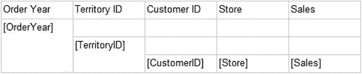

图 5-23.
具有分组级别的报表设计

12. 删除“订单年份”和“区域 ID”列。这不会删除分组。
13. 右键单击“客户 ID”列，选择“插入列” ➤ “左侧”。
14. 重复三次，使总共有四列空列。
15. 在标题行中键入以下值：订单年份、平均销售额、区域 ID、名称。报表设计应如图 5-24 所示。

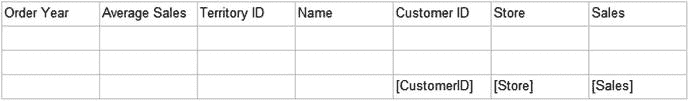

图 5-24.
添加标题后的报表布局

16. 第二行是 `OrderYear` 组的一部分，但如果您将 `OrderYear` 拖动到“订单年份”标题下方的单元格中，由于它是数字字段，它将自动求和。请改为键入 `[OrderYear]`。
17. 在“区域 ID”列的第三行中，键入 `[TerritoryID]`。同样，请确保此字段不会对值进行求和。
18. 将 Territory 字段添加到第三行“名称”下方的单元格中。
19. 使用“表达式”对话框，将以下表达式添加到第二行“平均销售额”下方的单元格：
    ```
    =Sum(Fields!Sales.Value)/CountDistinct(Fields!TerritoryID.Value)
    ```
20. 将 Sales 字段添加到“销售额”标题下的两个空单元格中。它们将自动求和，这是正确的。

现在，您就有了一个具有备用布局的分组报表。当您预览报表时，它应如图 5-25 所示。

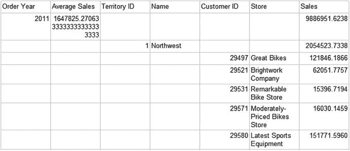

图 5-25.
格式化前的报表预览

您现在已准备好格式化报表。请按照以下步骤操作：

1.  将所有涉及 Sales 的单元格格式设置为货币，无小数点，并使用千位分隔符。
2.  选择标题行并查看“属性”窗口。将 `BackgroundColor` 更改为 CornflowerBlue。
3.  将 `FontSize` 更改为 12 pt，并将“字体”部分中的 `Color` 属性更改为 White。
4.  减小“订单年份”、“平均销售额”、“区域 ID”和“名称”列的宽度。
5.  增加“店铺”列的宽度。
6.  将第二行的 `BackgroundColor` 更改为 `#8fb3f3`。
7.  将第三行的 `BackgroundColor` 更改为 `#c7d9f9`。
8.  将“销售额”列右对齐。报表设计应如图 5-26 所示。

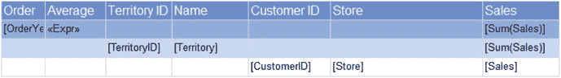

图 5-26.
格式化后的报表布局

报表对每个级别的排序有非常具体的说明。请按照以下步骤对数据进行排序：

1.  通过“组属性”对话框，将 `OrderYear` 组的排序顺序更改为降序。
2.  将详细信息行的排序顺序更改为 `Sales` 降序。
3.  将 `TerritoryID` 组的排序顺序更改为使用 `Territory` 而不是 `TerritoryID`。

最后一套任务是添加页眉和页脚并修改页眉的行为。请按照以下步骤完成报表：

1.  启用分组窗口的“高级模式”。
2.  在“属性”窗口中，为“行组”侧找到的每个“静态”级别将 `RepeatOnNewPage` 设置为 True。
3.  将“行组”侧找到的每个“静态”级别的 `KeepWithGroup` 更改为 After。
4.  为使标题行在向下滚动时保持原地不动，请选择顶部的“静态”项。
5.  将 `FixedData` 属性更改为 True。
6.  将表重新定位在左上角。
7.  通过向内拖动边缘来收紧画布。
8.  添加报表页脚和报表页眉。
9.  向页眉添加一个文本框，文本为 Territory Sales。
10. 将字体大小更改为 18 pt。将文本框居中。
11. 通过从“报表数据”窗口的“内置字段”文件夹中拖动 Execution Time 字段，将其添加到页脚。
12. 向页脚添加一个包含以下表达式的文本框：
    ```
    ="Page " & Globals!PageNumber & " of " & Globals!TotalPages
    ```
13. 将报表的上边距和下边距更改为 0.25 英寸或 0.635 厘米。

预览报表并试用滚动功能。进行任何需要的额外调整。报表应如图 5-27 所示。

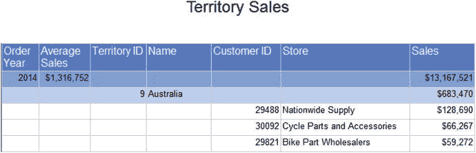

图 5-27.
具有备用布局的 Territory Sales 报表

如果向下滚动，您应该会看到标题行保持在原位。


## 使用节省空间的布局构建报表

上一节中展示的备选布局可能更受欢迎，但它比默认布局占用更多空间。不过，有一种方法可以节省一些空间。请按照以下步骤创建节省空间的布局报表：

1.  在 `Solution Explorer` 中右键单击 `Sales by Territory 2` 报表，然后选择 `Copy`。
2.  按 `CTRL + V` 创建报表的副本。
3.  将其名称更改为 `Sales by Territory 3`。
4.  双击新报表，使其在设计视图中打开。
5.  右键单击第二行，选择 `Insert Row` ➤ `Inside Group – Below`。
6.  在第三行 `Order Year` 列下的单元格中，键入 `Territory ID`。
7.  展开 `Order Year` 列。
8.  在第三行 `Average Sales` 列下的单元格中，键入 `Name`。
9.  在第四行 `Order Year` 列下的单元格中，添加 `[TerritoryID]`。输入此占位符以避免对值进行求和。
10. 在第四行 `Average Sales` 列下的单元格中，添加 `Territory` 字段。
11. 删除 `Territory ID` 和 `Name` 列。报表布局应如图 5-28 所示。
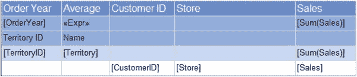
图 5-28. 节省空间的布局

现在，您可以根据需要减小报表画布的宽度或向报表中添加一些额外的字段。您可能还想修改某些格式，例如将第二行加粗。

您可以利用文本框的 `Padding` 属性来缩进单元格的内容，以创建层次结构效果。请按照以下步骤了解如何操作：

1.  将第一列向左对齐。
2.  选择与区域相关的四个单元格，如图 5-29 所示。
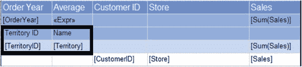
图 5-29. 选择区域单元格
3.  打开 `Properties` 窗口。
4.  在 `Alignment` 类别中找到 `Indent` 属性。
5.  将 `Left Indent` 属性更改为 `15 pt`。
6.  稍微扩展第二列的宽度。当您预览报表时，它将如图 5-30 所示。
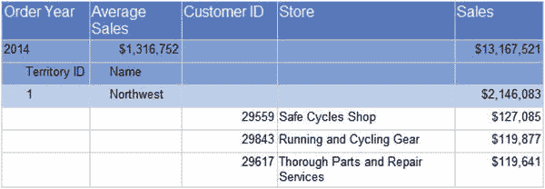
图 5-30. 区域单元格缩进后的报表

## 构建矩阵报表

经理对 `Sales by Territory 2` 报表感到满意，但有另一个请求。他希望您创建一个矩阵报表，该报表按区域汇总销售额，并按订单年份进行透视。透视意味着该字段中的数据将成为列标题。

虽然矩阵报表乍一看可能令人生畏，但创建起来其实非常容易。就像常规报表一样，花些时间弄清楚分组级别。在本例中，行级别分组将是 `TerritoryID`，列级别分组将是 `OrderYear`。您还需要确定数据字段，这是您希望聚合的值。

图 5-31 显示了在填充任何单元格之前的矩阵控件。请注意，`Data` 单元格是行组和列组的交叉点。
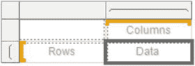
图 5-31. 矩阵控件

要创建矩阵报表，请按照以下步骤操作：

1.  向项目中添加一个名为 `Sales by Territory Matrix` 的新报表。
2.  添加一个名为 `AdventureWorks` 的数据源，指向 `AdventureWorks2016` 共享数据源。
3.  添加一个名为 `SalesByTerritory` 的嵌入数据集，指向 `AdventureWorks` 数据源，并使用以下查询：
```sql
SELECT YEAR(OrderDate) AS OrderYear, C.CustomerID, SUM(TotalDue) AS Sales,
T.TerritoryID, T.Name AS Territory, s.Name AS Store
FROM sales.SalesOrderHeader AS SOH
JOIN Sales.SalesTerritory AS T ON SOH.TerritoryID = T.TerritoryID
JOIN Sales.Customer AS C ON SOH.CustomerID = C.CustomerID
JOIN Sales.Store AS S ON S.BusinessEntityID = C.StoreID
GROUP BY C.CustomerID, T.TerritoryID, T.Name,
YEAR(OrderDate), S.Name;
```
4.  将矩阵控件拖到报表上。
5.  在 `Columns` 单元格中，添加 `OrderYear`。这是透视后的数据。
6.  在 `Rows` 单元格中，添加 `TerritoryID`。
7.  在 `Data` 单元格中，添加 `Sales`。它将自动求和，这正是您需要的。
8.  右键单击第一列，选择 `Insert Columns` ➤ `Inside Group Right`。
9.  在第二行的新单元格中添加 `Territory` 字段。
10. 在第一行，将 `Territory` 标题更改为 `Name`。矩阵布局应如图 5-32 所示。
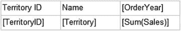
图 5-32. 矩阵报表布局
11. 将 `Data` 单元格格式设置为货币格式，不带小数位，并使用千位分隔符。
12. 将第一行加粗。
13. 预览报表。它应如图 5-33 所示。
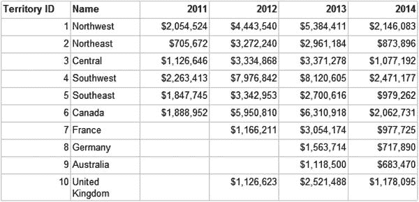
图 5-33. 矩阵报表预览
14. 切换回设计视图。
15. 右键单击 `Sum(Sales)` 单元格，选择 `Add Total` ➤ `Row`。
16. 再次右键单击该单元格，选择 `Add Total` ➤ `Column`。报表布局应如图 5-34 所示。
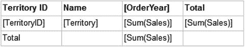
图 5-34. 添加总计后的矩阵
17. 将 `Sales` 字段添加到 `Total` 下的空单元格中。它将自动求和。
18. 该单元格不会自动应用格式，因此请将其格式设置为与其他 `Sales` 单元格相同。
19. 将底行加粗。
20. 将最右侧的列加粗。当您预览报表时，它应如图 5-35 所示。
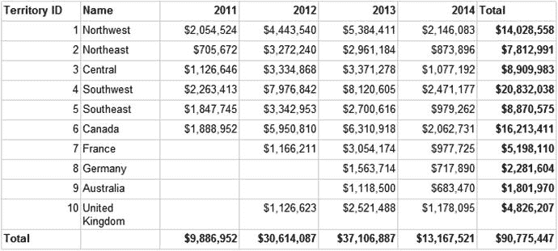
图 5-35. 格式化总计后的矩阵

表格和矩阵控件的一个有趣之处在于，您可以从一个开始，通过修改分组，切换到另一个。这就是这些控件被称为 `Tablix` 的原因。要将矩阵更改为表格，请按照以下步骤操作：

1.  切换到设计视图。
2.  选择矩阵，右键单击句柄的交叉部分。图 5-36 显示了右键单击的位置。
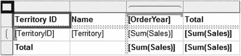
图 5-36. 右键单击句柄交叉点
3.  单击 `Copy`，然后粘贴到报表画布上以创建矩阵的副本。
4.  选择新矩阵，在列分组窗口中右键单击 `OrderYear2` 分组级别。
5.  删除该组。
6.  在 `Delete Group` 对话框上，选择 `Delete Group and Related Rows and Columns`。单击 `OK`。

该矩阵现在已变成表格，如图 5-37 所示。您也可以从表格开始，通过添加列组将其转换为矩阵。
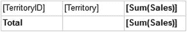
图 5-37. 矩阵现在是一个表格

## 总结

创建报表是一个迭代的过程。您可能从一个简单的请求开始，需要与请求者合作以最终确定设计。或者，您可能从一套详尽的要求（包括详细的布局）开始。无论何时，当您创建具有多个分组级别或复杂功能的报表时，如果未提供设计，请务必先勾勒出布局草图。

大多数报表需要一个或多个分组级别。本章引导您通过几种技术添加分组级别和格式化报表。您还创建了一个简单的矩阵报表。在继续下一章之前，请务必理解如何添加和配置分组。

在 `第 [6] 章` 中，您将学习如何通过添加参数、链接报表、允许用户控制排序等操作，使您的报表具有动态性。


