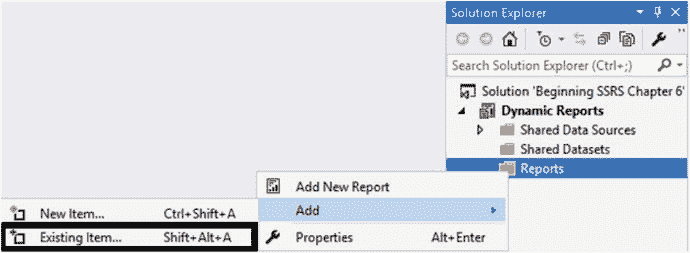
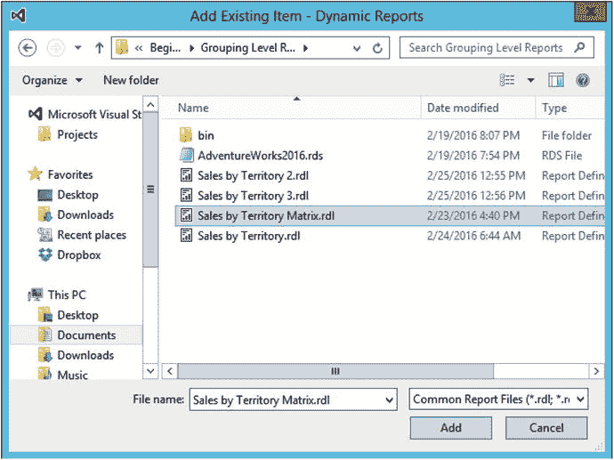
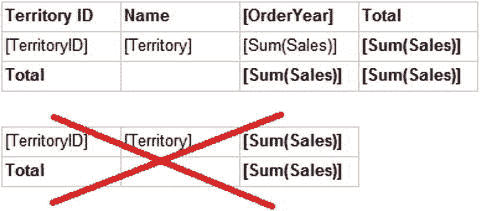
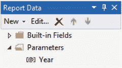
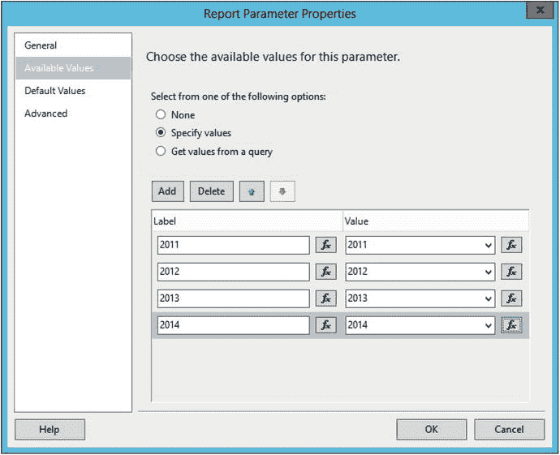
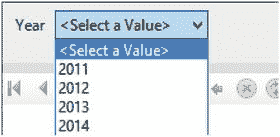

# 6. 使报表动态化

如果你一直跟着之前的演示操作，你应该已经知道如何创建具有多个分组级别的格式美观的报表了。想象一下，在第 5 章中提出报表需求的部门经理，现在希望为每个订单年份单独生成一份报表。或者，他/她可能想改变排序顺序，或者点击某一行来下钻查看详细信息。

在我担任数据库管理员的职业生涯中，我经常为公司的一些部门创建报表，像这样的场景实在太常见了。我很快就学会了提出问题并预想需求者下一步可能会问什么。我很少在不提供选项（例如参数）的情况下创建报表。

在本章中，你将学习如何使报表动态化。这将为你节省时间，并让你看起来像一位 SQL Server Reporting Services (SSRS) 的超级明星！

## 向报表添加参数

报表开发人员最常使用参数来控制报表上显示的数据。你在第 3 章看到过，向数据集中的查询添加参数会自动在报表中创建一个参数。你也可以手动创建参数。无论哪种方式，报表中的许多元素都可以随着用户运行报表而动态变化。

在本节中，你将从一个已完成的报表开始，并添加一个参数来控制显示的数据。请按照以下步骤开始：

1.  启动 SQL Server Data Tools (`SSDT`)。
2.  在名为 `Beginning SSRS Chapter 6` 的解决方案中，创建一个新的名为 `Dynamic Reports` 的 SSRS 报表项目。
3.  创建一个名为 `AdventureWorks2016` 的共享数据源，指向 `AdventureWorks2016` 数据库。
4.  在解决方案资源管理器中右键单击 `Reports` 文件夹，选择 `添加` ➤ `现有项`，如图 6-1 所示。
    
    图 6-1. 添加现有报表
5.  导航到在第 5 章创建的项目中找到的 `Sales by Territory Matrix.rdl` 文件。如果你没有创建该报表，可以使用 Apress 网站 (`Apress.com`) 的代码/下载区域中的报表文件。
6.  点击 `添加` 导入报表，如图 6-2 所示。
    
    图 6-2. 导入现有报表
7.  双击报表以在设计视图中打开。
8.  如果报表上有两个 `Tablix` 控件，请删除表格控件并保留矩阵控件。参考图 6-3。
    
    图 6-3. 删除表格控件
9.  预览报表以确保它能运行。
10. 切换回设计视图。
11. 在 `报表数据` 窗口中，打开 `SalesByTerritory` 数据集的属性。
12. 将查询更改为
    ```
    SELECT YEAR(OrderDate) AS OrderYear, C.CustomerID, SUM(TotalDue) AS Sales,
    T.TerritoryID, T.Name AS Territory, s.Name AS Store
    FROM sales.SalesOrderHeader AS SOH
    JOIN Sales.SalesTerritory AS T ON SOH.TerritoryID = T.TerritoryID
    JOIN Sales.Customer AS C ON SOH.CustomerID = C.CustomerID
    JOIN Sales.Store AS S ON S.BusinessEntityID = C.StoreID
    WHERE YEAR(OrderDate) = @Year
    GROUP BY C.CustomerID, T.TerritoryID, T.Name,
    YEAR(OrderDate), S.Name;
    ```
13. 点击 `确定` 保存更改。

此查询与原始查询的区别在于 `WHERE` 子句。该查询现在由 `@Year` 参数进行筛选。向查询添加参数会自动向报表添加一个参数。展开 `报表数据` 窗口中的 `参数` 文件夹。应该可以看到该参数，如图 6-4 所示。

图 6-4. 新参数

现在当你预览报表时，系统会提示你填写年份。尝试输入几个值进行测试。只要你输入一个介于 2011 和 2014 之间的整数，运行报表时就会看到数据。

为了确保运行报表的人提供一个有效的值，你可以提供一个下拉列表供用户选择。

### 硬编码的参数列表

参数列表可以是硬编码的列表，也可以来自数据集的查询结果。按照以下步骤创建年份列表：

1.  右键单击 `Year` 参数并选择 `参数属性`。
2.  选择 `可用值` 页。
3.  选择 `指定值`。
4.  点击 `添加`。
5.  在 `标签` 和 `值` 中都输入 `2011`。
6.  为 `2012`、`2013` 和 `2014` 年重复此操作。对话框应如图 6-5 所示。
    
    图 6-5. 向参数添加值
7.  点击 `确定`。现在当你预览报表时，将有一个列表可供选择，如图 6-6 所示。
    
    图 6-6. 参数列表

参数的 `标签` 属性是最终用户看到的内容；`值` 属性是传递给查询的内容。在本例中，它们是相同的。


