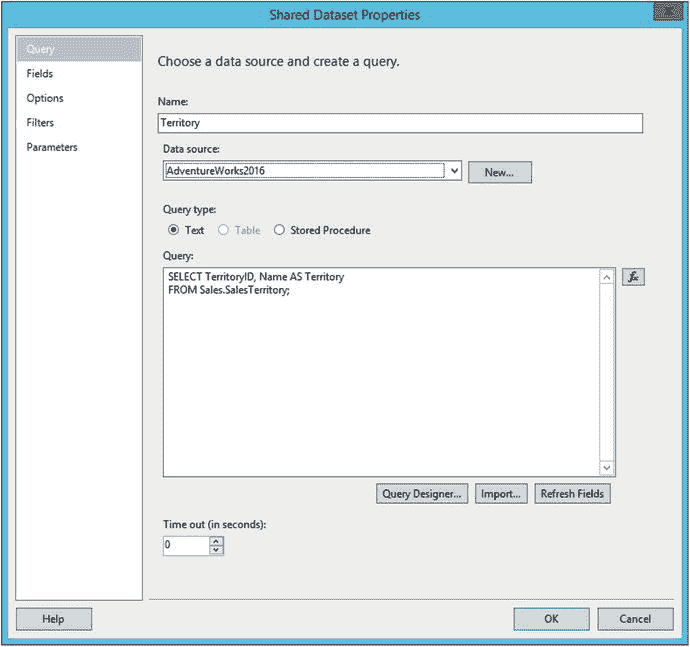
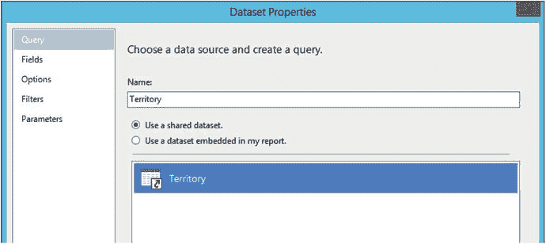
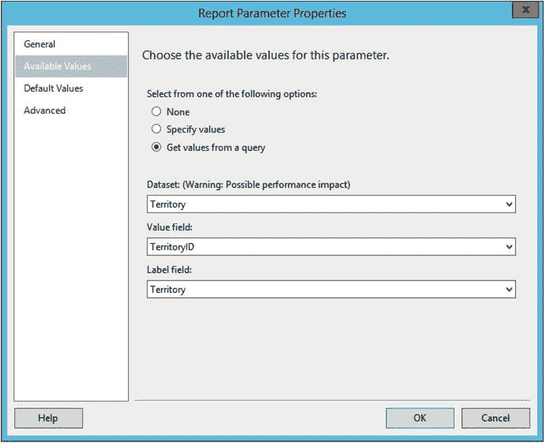
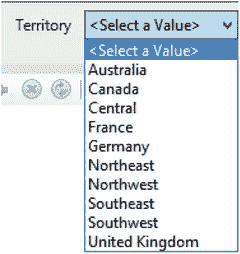

# 基于查询添加参数列表

大多数情况下，基于查询来构建参数列表是合理的。这将节省时间，因为随着数据变化，该列表无需手动维护。参数列表通常会被重用，因此创建共享数据集而非嵌入式数据集是明智之举。要基于查询创建参数列表，请按照以下步骤操作：

1.  切换回设计视图。
2.  在 `解决方案资源管理器` 中，右键单击 `共享数据集` 文件夹，选择 `添加新数据集`。
3.  将数据集命名为 `Territory`。
4.  `数据源` 属性应指向 `AdventureWorks2016`。
5.  确保 `查询` 类型设置为 `文本`。
6.  将 `查询` 设置为：

    ```sql
    SELECT TerritoryID, Name AS Territory
    FROM Sales.SalesTerritory;
    ```

7.  `共享数据集属性` 应如图 6-7 所示。单击 `确定`。

    

    图 6-7. `Territory` 数据集

8.  使用 `报表数据` 窗口向报表添加一个名为 `Territory` 的新数据集。
9.  选择 `使用共享数据集`。
10. 从对话框中选择 `Territory` 数据集，如图 6-8 所示。

    

    图 6-8. 报表中的 `Territory` 数据集

11. 单击 `确定`。
12. 打开 `SalesByTerritory` 数据集的属性，并将查询更改为：

    ```sql
    SELECT YEAR(OrderDate) AS OrderYear, C.CustomerID, SUM(TotalDue) AS Sales,
    T.TerritoryID, T.Name AS Territory, s.Name AS Store
    FROM sales.SalesOrderHeader AS SOH
    JOIN Sales.SalesTerritory AS T ON SOH.TerritoryID = T.TerritoryID
    JOIN Sales.Customer AS C ON SOH.CustomerID = C.CustomerID
    JOIN Sales.Store AS S ON S.BusinessEntityID = C.StoreID
    WHERE YEAR(OrderDate) = @Year AND T.TerritoryID = @Territory
    GROUP BY C.CustomerID, T.TerritoryID, T.Name,
    YEAR(OrderDate), S.Name;
    ```

13. 这将通过 `Year` 和 `Territory` 两个维度筛选数据集。打开 `Territory` 参数的属性。
14. 选择 `可用值` 选项卡。
15. 选择 `从查询中获取值`。
16. 在 `数据集` 属性中，选择 `Territory`。
17. 在 `值字段` 属性中，选择 `TerritoryID`。这是查询中所需要的。
18. 为 `标签字段` 属性选择 `Territory`。这是最终用户将看到的。对话框将如图 6-9 所示。

    

    图 6-9. `Territory` 列表属性

注意：`SSDT` 发布时存在一个影响共享数据集的错误。Microsoft 已承诺在后续版本中修复此问题。在此之前，要解决此问题，请关闭项目并找到 `Territory.rsd` 文件。将 `<Dataset>` 更改为 `<Dataset Name="Territory">`。保存文件并重新启动项目。

单击 `确定` 接受参数后，预览报表。新参数应如图 6-10 所示。



图 6-10. `Territory` 参数列表

多次运行报表并选择不同的参数集。您将看到每次显示的数据如何变化。

