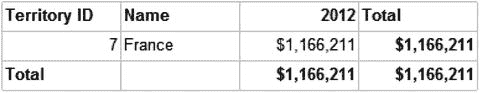
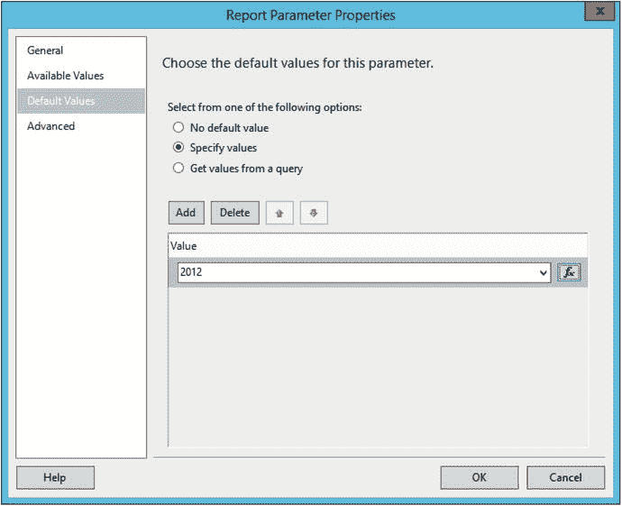

# 默认参数

通常，有一组参数是最可能被选中的。为了节省用户时间，您可以为每个参数添加一个默认值。启动报表时，它将使用默认参数运行一次。然后，用户如果需要，可以选择不同的参数集再次运行。要演示这一点，请按照以下步骤操作：

1.  单击 `确定` 接受属性设置。
2.  使用相同方法为 `Territory` 参数添加默认值。
3.  提供值 `7`。这些值必须来自 `TerritoryID` 字段，因为这是传递给查询的值。
4.  单击 `确定` 接受属性并预览报表。它应该在不提供参数值的情况下运行，并如图 6-12 所示。

    

    图 6-12. 使用默认参数运行后的报表

5.  切换回设计视图。
6.  打开 `Year` 参数的属性，选择 `默认值` 选项卡。
7.  选择 `指定值`。
8.  单击 `添加`。
9.  填入 `2012`。对话框应如图 6-11 所示。

    

    图 6-11. `默认值` 属性

