# 多值参数

到目前为止，您创建的参数允许用户从列表中选择一个值。也可以创建允许多选的参数。为此，必须修改查询以选择一个值列表。不再使用 `ColumnName = @Parameter`，而是使用 `ColumnName IN (@Parameter)`。按照以下步骤创建多值参数：

1.  切换回设计视图。
2.  打开 `Year` 参数的属性。
3.  在 `常规` 选项卡上，勾选 `允许多个值`。
4.  在 `默认值` 选项卡上，切换回 `无默认值`。
5.  单击 `确定` 保存更改。
6.  打开 `SalesByTerritory` 数据集。
7.  为使 `WHERE` 子句中的表达式能够接受值列表，必须将运算符从等于 (`=`) 改为 `IN`。将 `查询` 属性更改为：

    ```sql
    SELECT YEAR(OrderDate) AS OrderYear, C.CustomerID, SUM(TotalDue) AS Sales,
    T.TerritoryID, T.Name AS Territory, s.Name AS Store
    FROM sales.SalesOrderHeader AS SOH
    JOIN Sales.SalesTerritory AS T ON SOH.TerritoryID = T.TerritoryID
    JOIN Sales.Customer AS C ON SOH.CustomerID = C.CustomerID
    JOIN Sales.Store AS S ON S.BusinessEntityID = C.StoreID
    WHERE YEAR(OrderDate) IN (@Year) AND T.TerritoryID = @Territory
    GROUP BY C.CustomerID, T.TerritoryID, T.Name,
    YEAR(OrderDate), S.Name;
    ```

8.  运行报表。`Year` 参数应如图 6-13 所示。

    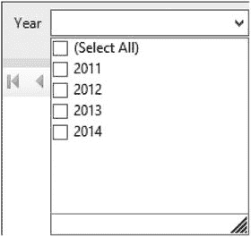

    图 6-13. 多值参数

您现在可以选择一个或多个年份。多次运行报表，看看选择不同参数集时数据如何变化。


### 级联参数

您可能已经注意到，某些区域在 2011 年没有销售数据。如果您选择了 2011 年，所有区域仍然会显示在参数列表中。您可以设计一个参数，使其基于另一个参数的值。请按照以下步骤，根据 `Year` 参数调整 `Territory` 参数列表。

1.  切换到设计视图。
2.  打开 `Territory` 数据集的属性。
3.  切换到“使用嵌入在报表中的数据集”。
4.  将“数据源”属性设置为 `AdventureWorks`。
5.  将“查询”属性设置为

    ```sql
    SELECT DISTINCT T.TerritoryID, T.Name AS Territory
    FROM sales.SalesOrderHeader AS SOH
    JOIN Sales.SalesTerritory AS T ON SOH.TerritoryID = T.TerritoryID
    JOIN Sales.Customer AS C ON SOH.CustomerID = C.CustomerID
    JOIN Sales.Store AS S ON S.BusinessEntityID = C.StoreID
    WHERE YEAR(OrderDate) IN (@Year);
    ```

6.  单击“确定”保存更改。
7.  打开 `Territory` 参数属性。
8.  在“默认值”页面上，更改为“无默认值”。
9.  单击“确定”保存更改。

现在，当您预览报表时，在选定年份之前，`Territory` 参数将显示为灰色。选择 2011 年。`Territory` 参数列表将如图 6-14 所示。

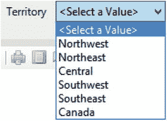

图 6-14. 基于 2011 年销售数据的区域参数列表

您可能已经注意到，`Territory` 参数的查询与 `SalesByTerritory` 查询类似。它没有查询报表所需的值，而是生成了一个区域的唯一列表。查询中使用的表是相同的。`WHERE` 子句中的表达式 `YEAR(OrderDate) IN (@Year)` 用于根据所选的 `Year` 参数值进行筛选。

您可以级联更多参数，每个参数都基于前一个参数的值。但是，请注意不要对性能产生负面影响。例如，从 `Sales.SalesTerritory` 表显示区域列表比用于仅显示特定年份有销售数据的区域的查询效率高得多。顺便说一句，您也可以选择所有年份，级联仍然有效。

### 参数位置

在设计视图中，您可能注意到报表上方有一个参数区域。如果看不到，请右键单击设计画布并选择“视图” ➤ “参数”。参数区域应如图 6-15 所示。

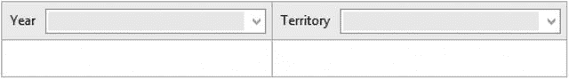

图 6-15. 参数区域

此功能是 SQL Server 2016 的新增功能，提供了更灵活的参数布局。在 SQL Server 的早期版本中，您可以通过从 `Parameters` 文件夹中选择一个参数并单击向上或向下箭头来更改参数的顺序，如图 6-16 所示。

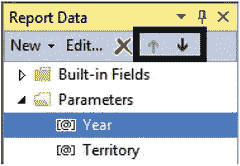

图 6-16. 用于移动参数的箭头

使用 SSRS 早期版本中的方法更改位置并不总能产生最佳的放置效果。无法控制哪些参数最终位于同一行。如果您有一个包含开始和结束日期的报表，您可能希望将日期保持在同一行，但这并非总是可行。

从 SQL Server 2016 开始，最多可以显示六个参数。您现在可以通过将参数拖动到不同的单元格来控制参数的放置。例如，将 `Territory` 参数拖到 `Year` 参数下方。参数窗格应如图 6-17 所示。

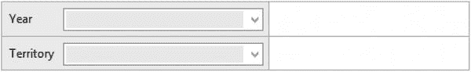

图 6-17. 重新排列后的参数

当您预览报表时，参数显示如图 6-18 所示。

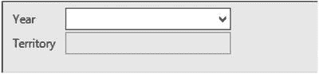

图 6-18. 预览模式下的参数

默认情况下，有两行参数。要增加行数，请在设计视图中右键单击参数区域，然后选择“在上方插入行”或“在下方插入行”。但是，如果您正在使用级联功能，在移动参数时要小心。确保需要首先使用的参数也首先显示，以避免依赖错误。

### 参数数据类型

到目前为止，您一直在使用数值参数，尽管默认类型是文本。您也可以使用其他数据类型的参数，控件将根据类型发生变化。请按照以下说明查看其他数据类型：

1.  确保已保存对“按区域矩阵销售”报表的最新更改。您可以单击“保存”图标或运行报表。
2.  右键单击“按区域矩阵销售”报表，然后选择“复制”。
3.  右键单击项目名称 `Dynamic Reports`，然后选择“粘贴”。
4.  将新报表的名称更改为 `Data Types`。
5.  在设计视图中，右键单击 `Parameters` 文件夹，然后选择“添加参数”。
6.  这将打开“报表参数属性”对话框。将参数命名为 `DateParameter`。
7.  在“提示”中填写 `Date Parameter`。提示是用户在运行报表时将看到的内容。
8.  将“数据类型”更改为“日期/时间”。“常规”页面将如图 6-19 所示。

    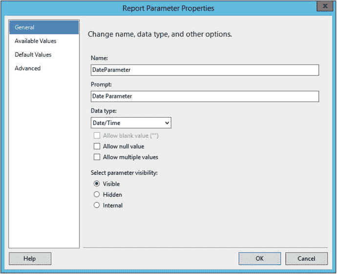

    图 6-19. 参数的常规属性
9.  单击“默认值”页面。
10. 选择“指定值”。
11. 单击“添加”。
12. 不要键入值，而是单击如图 6-20 所示的 `fx` 符号以打开表达式对话框。

    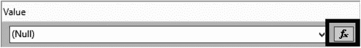

    图 6-20. 表达式按钮
13. 在表达式中填写 `=Today()` 并单击“确定”。
14. 单击“确定”接受属性。
15. 您现在应该在网格中看到带有日历图标的 `Date Parameter`，如图 6-21 所示。

    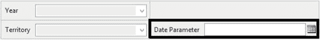

    图 6-21. 新的日期参数
16. 预览报表。
17. 如果 `Date Parameter` 显示为灰色，请为 `Year` 和 `Territory` 选择值。当前日期应自动被选中。您可以键入或使用日历选取器控件选择其他日期。至少在我使用的版本中，`Date/Time` 参数必须位于第一个位置，才能在其他参数被选定之前可用。
18. 切换回设计视图并添加另一个参数。
19. 将此参数命名为 `TrueFalse`，提示为 `True or False`。
20. 将“数据类型”更改为“布尔值”并单击“确定”。
21. 这将添加一组单选按钮，如图 6-22 所示。

    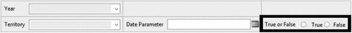

    图 6-22. 新的“真或假”参数

您还可以通过在“默认值”页面上添加 `True` 或 `False` 来为布尔数据类型设置默认值。

默认数据类型是“文本”，允许用户输入任何内容。如果您希望将输入限制为数字，可以选择 `Integer` 或 `Float` 数据类型。该控件看起来像一个常规文本框，但将分别只接受整数或小数。


## 使用存储过程

SQL Server 存储过程（也称为 stored procs 或 sprocs）是包含 T-SQL 脚本的对象。这些存储过程可能包含循环等编程逻辑，可能更新数据，或者仅包含一个 `SELECT` 查询。存储过程常用于 SSRS 数据集中，并且根据定义可能需要参数。如果您使用的是网络 SQL Server，您可能需要联系数据库管理员以获取创建存储过程的权限。否则，要创建存储过程，请按照以下步骤操作。

1.  使用 SQL Server Management Studio（SSMS）连接到您的 SQL Server。
2.  单击“新建查询”，这将打开一个查询窗口。
3.  在查询窗口中输入此代码，可以手动键入或从本书在 Apress 网站（`www.Apress.com`）上的源代码/下载区域复制。该代码创建一个需要一个参数 `TerritoryID` 的存储过程，然后返回按该 `TerritoryID` 筛选的结果。

```
USE AdventureWorks2016;
GO
IF OBJECT_ID('usp_SalesByTerritory') IS NOT NULL
    DROP PROC usp_SalesByTerritory;
GO
CREATE PROC usp_SalesByTerritory @Year INT, @TerritoryID INT AS
SELECT YEAR(OrderDate) AS OrderYear, C.CustomerID,
       SUM(TotalDue) AS Sales,
       T.TerritoryID, T.Name AS Territory, s.Name AS Store
FROM sales.SalesOrderHeader AS SOH
    JOIN Sales.SalesTerritory AS T ON SOH.TerritoryID = T.TerritoryID
    JOIN Sales.Customer AS C ON SOH.CustomerID = C.CustomerID
    JOIN Sales.Store AS S ON S.BusinessEntityID = C.StoreID
WHERE YEAR(OrderDate) = @Year AND T.TerritoryID = @TerritoryID
GROUP BY C.CustomerID, T.TerritoryID, T.Name,
         YEAR(OrderDate), S.Name;
```

4.  单击菜单栏中的“执行”或按 F5 来创建该过程，如图 6-23 所示。

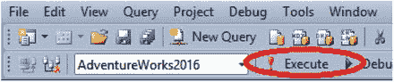

图 6-23. “执行”图标。

5.  单击“新建查询”。在新的查询窗口中，通过运行以下代码测试该过程：

```
usp_SalesByTerritory @Year = 2011, @TerritoryID = 6;
```

在数据集中使用存储过程与使用查询没有太大区别。请按照以下步骤创建一个使用新存储过程的报表。

1.  向项目添加一个名为“Stored Proc”的新报表。
2.  添加一个指向 `AdventureWorks2016` 的数据源，并将其命名为 `AdventureWorks`。
3.  向报表添加一个名为 `SalesByTerritory` 的嵌入数据集。使用 `AdventureWorks` 数据源。
4.  将查询类型更改为“存储过程”。
5.  执行此操作后，对话框会发生变化。您将看到一个下拉框，列出了数据库中的存储过程。选择 `usp_SalesByTerritory`。对话框应如图 6-24 所示。

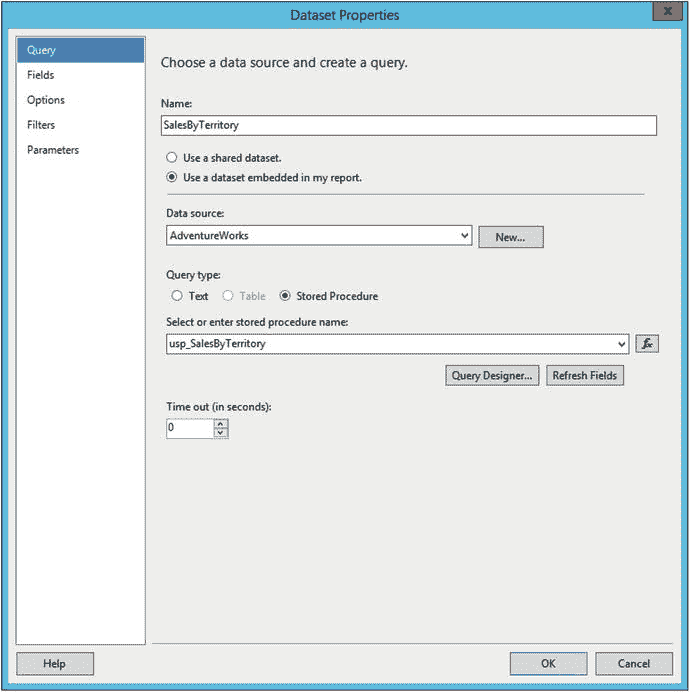

图 6-24. 在数据集中使用存储过程。

6.  单击“确定”以创建数据集。它也会自动将参数添加到报表中。
7.  将一个矩阵控件拖到报表画布上。
8.  将 `OrderYear` 添加到“列”单元格。
9.  将 `Sales` 添加到“数据”单元格。它将自动求和。
10. 将 `TerritoryID` 添加到“行”单元格。布局应如图 6-25 所示。

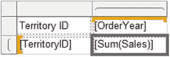

图 6-25. 矩阵设计。

当您预览报表时，系统将提示您输入 `OrderYear` 和 `TerritoryID`。填入 2012 和 7 以查看数据。

然而，使用存储过程存在一个问题。如果您将参数切换为接受多个值，报表将不再工作。这是因为存储过程期望每个参数接收一个整数值，而不是一个变量列表。要查看问题，请按照以下步骤操作。

1.  切换回设计视图。
2.  修改 `Year` 参数，使其允许多个值。
3.  在“可用值”页面上，选择“指定值”并添加 2011 到 2014。
4.  单击“确定”保存更改。
5.  预览报表。
6.  选择一个以上的年份。为 `TerritoryID` 输入 7。
7.  当您单击“查看报表”时，您将看到一条错误消息，如图 6-26 所示。

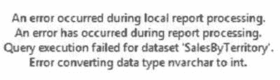

图 6-26. 当为 `OrderYear` 选择多个值时出现的错误。

作为解决方法，必须修改存储过程的参数以接受字符串值，而不仅仅是整数。然后，必须向过程中添加逻辑以处理逗号分隔的列表，而不是每个参数的一个值。通常使用一个函数来解析列表并将值保存到临时表中。请按照以下步骤修改存储过程，使其能够接受多个值。

1.  在 SSMS 中，运行此代码创建一个函数，用于将值列表转换为表。您可以从本书在 Apress 网站（`www.Apress.com`）上的源代码/下载区域复制代码。

```
USE AdventureWorks2016;
GO
IF OBJECT_ID('udf_ListToTable') IS NOT NULL
    DROP FUNCTION dbo.udf_ListToTable;
GO
CREATE FUNCTION dbo.udf_ListToTable(@List NVARCHAR(4000),
    @Delimiter NCHAR(1))
RETURNS @ValueList TABLE (ListItem NVARCHAR(50)) AS
BEGIN
    DECLARE @Pos INT;
    DECLARE @Item NVARCHAR(50);
    --Find the first delimiter
    SET @Pos = CHARINDEX(@Delimiter,@List);
    --loop until all items are processed
    WHILE @Pos > 0 BEGIN
        --insert the current item
        INSERT INTO @ValueList(ListItem)
            SELECT LEFT(@List,@Pos-1);
        --remove current item from the string
        SET @List = SUBSTRING(@List,@Pos+1,4000);
        --find the next delimiter
        SET @Pos = CHARINDEX(@Delimiter,@List);
    END;
    --add the last item
    INSERT INTO @ValueList(ListItem)
        SELECT @List;
    RETURN;
END;
GO
```

2.  单击“执行”来运行代码并创建该函数。
3.  单击“新建查询”以打开另一个查询窗口。
4.  在 SSMS 中运行此代码以修改存储过程。

```
USE AdventureWorks2016;
GO
IF OBJECT_ID('usp_SalesByTerritory') IS NOT NULL
    DROP PROC usp_SalesByTerritory;
GO
CREATE PROC usp_SalesByTerritory
    @YearList NVARCHAR(4000), @TerritoryIDList NVARCHAR(4000) AS
    DECLARE @Years TABLE (OrderYear INT);
    DECLARE @Territories TABLE(TerritoryID INT);
    --Save the lists into table variables
    INSERT INTO @Years(OrderYear)
        SELECT ListItem
        FROM dbo.udf_ListToTable(@YearList,',');
    INSERT INTO @Territories(TerritoryID)
        SELECT ListItem
        FROM dbo.udf_ListToTable(@TerritoryIDList,',');
    --Change the query to use IN lists in the WHERE clause
    SELECT YEAR(OrderDate) AS OrderYear, C.CustomerID,
           SUM(TotalDue) AS Sales,
           T.TerritoryID, T.Name AS Territory, s.Name AS Store
    FROM sales.SalesOrderHeader AS SOH
        JOIN Sales.SalesTerritory AS T ON SOH.TerritoryID = T.TerritoryID
        JOIN Sales.Customer AS C ON SOH.CustomerID = C.CustomerID
        JOIN Sales.Store AS S ON S.BusinessEntityID = C.StoreID
    WHERE YEAR(OrderDate) IN (SELECT OrderYear FROM @Years)
      AND T.TerritoryID IN (SELECT TerritoryID FROM @Territories)
    GROUP BY C.CustomerID, T.TerritoryID, T.Name,
             YEAR(OrderDate), S.Name;
GO
```

5.  单击“执行”来运行代码。

现在，每当您遇到此问题时，都可以使用这个函数。该存储过程使用新函数将每个列表插入到一个表变量中。然后，在 `WHERE` 子句中，这些表变量被用作 `IN` 列表。如果您的数据源托管在 SQL Server 2016 上，您可以使用一个新的内置函数 `STRING_SPLIT()` 来代替本示例中使用的自定义函数。

## 修改报告以配合存储过程的更改

现在需要对报告进行一些更改，以适应存储过程的变更。请遵循以下步骤：

1.  切换到“存储过程报告”的设计视图。
2.  打开 `SalesByTerritory` 数据集的属性。
3.  在“查询”选项卡上，单击“刷新字段”。这将创建与更新后的存储过程匹配的新参数：`@YearList` 和 `@TerritoryIDList`。
4.  单击“确定”。
5.  展开“参数”文件夹。
6.  删除 `Year` 和 `TerritoryID` 参数。对于修改后的存储过程，它们不再需要。
7.  创建一个名为 `Territory` 的新数据集。它应指向共享的 `Territory` 数据集。
8.  打开 `TerritoryIDList` 参数的属性。
9.  勾选“允许多个值”。
10. 在“可用值”页面上，选择“从查询中获取值”。
11. 从“数据集”列表中选择 `Territory`。
12. 从“值字段”列表中选择 `TerritoryID`。
13. 从“标签字段”列表中选择 `Territory`。
14. 单击“确定”接受更改。
15. 打开 `YearList` 参数的属性。
16. 勾选“允许多个值”。
17. 在“可用值”页面上，输入 2011 至 2014 作为硬编码值。
18. 单击“确定”保存属性。
19. 在参数窗格中将参数向左拖动。被删除的两个参数留下了空位。
20. 预览报告；当选择多个值时，它现在应按预期工作。

在 SSRS 中工作时，存储过程通常是首选的命令类型。它们允许代码重用，并且可以创建得比仅允许用户对表运行查询更安全。主要缺点是报表开发人员可能没有在数据库中创建或修改存储过程的权限。

## 控制属性

虽然筛选数据是使报表动态化的常见原因，但你也可以动态控制几乎任何属性。为此，你将利用基于数据或参数的表达式。你在第 [4] 章中看到了一个这样的例子，在那里设置了交替的背景颜色。

你可以控制任何属性为“表达式”作为属性选择，或属性旁边带有 `fx` 图标的属性。本节涵盖几个示例。

### 可见性

你可以使用表达式来显示或隐藏表格或行等对象，但表达式的值必须在报表实际显示之前已知。请遵循以下步骤，使用参数控制可见性。

1.  在项目中添加一个名为 `Visibility` 的新报表。
2.  向报表添加两个矩形控件。
3.  将两个矩形的“填充颜色”更改为深色，例如蓝色。
4.  调整大小，使一个为大矩形，一个为小正方形。报表布局应如图 [6-27] 所示。
5.  向报表添加一个名为 `ShowRectangle` 的参数，其“提示”属性设置为 `Show Rectangle`。
6.  将“数据类型”更改为“布尔值”。
7.  单击“确定”创建参数。
8.  添加第二个名为 `ShowSquare` 的参数，其“提示”属性设置为 `Show Square`。
9.  将“数据类型”更改为“布尔值”。
10. 单击“确定”创建第二个参数。
11. 右键单击矩形形状，选择“矩形属性”。
12. 切换到“可见性”页面。
13. 将“报表最初运行时”属性更改为“基于表达式显示或隐藏”。
14. 单击 `fx` 图标以打开“表达式”对话框。请注意，你将设置一个表达式来隐藏矩形，如图 [6-28] 所示。这可能看起来违反直觉，因此在为此属性创建表达式时请务必牢记。
15. 在“类别”列表中，选择“参数”。你将在“值”列表中看到列出的两个参数，如图 [6-29] 所示。
16. 双击 `ShowRectangle`。
17. 如果表达式的计算结果为 `True`，矩形将被隐藏。将表达式更改为：
    ```
    =Not Parameters!ShowRectangle.Value
    ```
18. 单击“确定”关闭“表达式”对话框，然后单击“确定”关闭“矩形属性”对话框。
19. 对小正方形形状重复此过程，选择 `ShowSquare` 参数。
20. 预览报表进行测试。图 [6-30] 显示了一个示例。

另一种控制可见性的方法通常与组一起使用。这在 [2] 章的向导报告中已演示，你可以单击加号展开详细信息。

你将在组上设置一个属性，以根据在父组中找到的单元格切换可见性。要手动执行此操作，请按照以下步骤操作：

1.  通过右键单击“报告”并选择“添加”➤“现有项”，从 [5] 章项目中导入 `Sales by Territory 2.rdl` 文件。
2.  双击报表在设计视图中打开它。
3.  右键单击 `TerritoryID` 单元格，选择“文本框属性”。
4.  如果尚未设置，则将“名称”属性更改为 `TerritoryID`。
5.  单击“确定”接受更改。
6.  在“行组”窗口中，右键单击“详细信息”组。这是最内层的子组。
7.  选择“组属性”。
8.  选择“可见性”页面。
9.  选择“隐藏”，并勾选“可以通过此报表项切换显示”。
10. 在下拉列表中，选择 `TerritoryID`。属性应如图 [6-31] 所示。


## 可见性设置

11. 单击 **确定** 接受属性。
12. 确保 `OrderYear` 单元格被命名为 `OrderYear`，就像处理 `TerritoryID` 时那样。
13. 右键单击 `TerritoryID` 组，选择 **组属性**。
14. 在 **可见性** 页面上，选择 **隐藏** 并使此组由 `OrderYear` 切换。
15. 单击 **确定** 接受属性。您无需在 `OrderYear` 组上设置属性，因为它是最高级别的父级。
16. 预览报表。它应如图 6-32 所示。

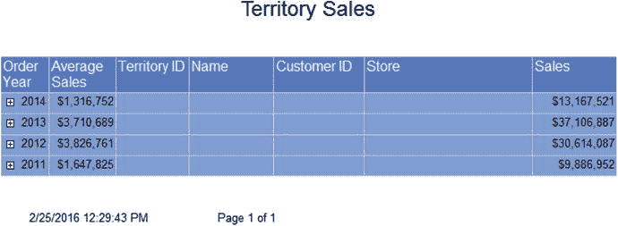

图 6-32. 带有折叠部分的报表

当您单击年份旁边的加号时，您将看到该年份的地区。当您单击 `TerritoryID` 旁边的加号时，您将看到该地区的详细信息，如图 6-33 所示。

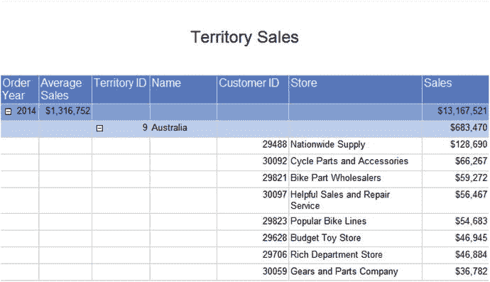

图 6-33. 展开的报表

此方法的主要缺点是您一次只能展开一个组。要显示所有详细信息需要点击很多次。更好的解决方案是向报表添加参数以控制组的可见性。为此，请遵循以下步骤：

1. 在 **解决方案资源管理器** 中，创建 `Sales by Territory 2` 报表的副本。将新报表命名为 `Visibility by Parameters`。
2. 添加一个名为 `DisplayTerritories` 的参数。提示应为 `Display Territories`，数据类型应为 **布尔值**。将默认值设置为 **False**。
3. 添加另一个名为 `DisplayDetailRows` 的参数。提示应为 `Display Detail Rows`。它也应是一个默认值为 **False** 的 **布尔值**。
4. 打开 **详细信息** 组的 **组属性**。
5. 在 **可见性** 页面上，取消选中 **可以通过此报表项切换显示**。
6. 选择 **根据表达式显示或隐藏**。对话框应如图 6-34 所示。`TerritoryID` 字段可能仍作为报表项可见，但已禁用。

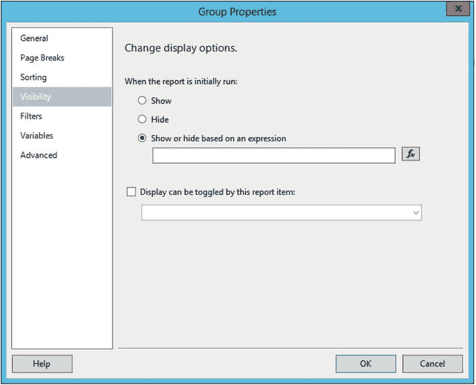

图 6-34. 组属性对话框
7. 单击 **fx** 图标以打开 **表达式** 对话框。
8. 添加此表达式：

```
=NOT Parameters!DisplayDetailRows.Value
```

9. 单击 **确定** 接受表达式，然后再次单击 **确定** 关闭 **组属性** 对话框。
10. 对 `TerritoryID` 组重复此过程。这次表达式为：

```
=NOT Parameters!DisplayTerritories.Value
```

11. 预览报表。在更改参数之前，它应如图 6-35 所示。

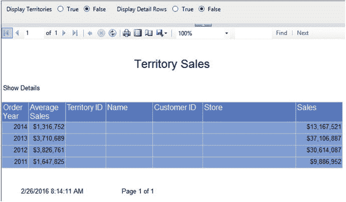

图 6-35. 仅显示摘要的报表

请注意，年份旁边的加号消失了。如果将 `Display Territories` 更改为 **True** 并再次运行报表，这次所有地区都将显示。要查看详细信息，必须将两个参数都设置为 **true**。

### 格式化

几乎任何属性都可以由表达式控制。该表达式可以包含数据集中的字段。为了演示，您将把销售额超过 $2,000,000 的地区行的字体加粗。请遵循以下步骤：

1. 切换到 `Sales by Territory 2` 报表的设计视图。
2. 选择地区行。
3. 在 **属性** 窗口中，找到 `FontWeight` 属性。
4. 从下拉列表中，选择 `<表达式>`，这将打开 **表达式** 对话框。
5. 添加此表达式：

```
=Iif(SUM(Fields!Sales.Value)>=2000000,"Bold","Default")
```

6. 单击 **确定** 保存更改。
7. 预览报表并展开以查看地区。报表将如图 6-36 所示。

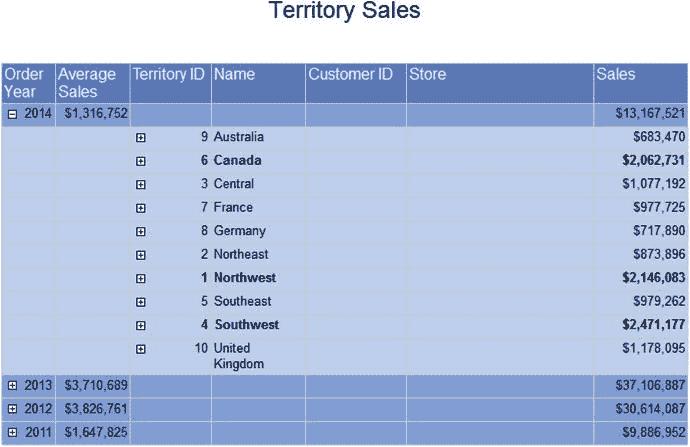

图 6-36. 销售额达到或超过 $2,000,000 的地区以粗体显示

`Iif` 函数，也称为内联 if，接受三个参数。第一个是要测试的表达式。如果表达式返回 true，则返回第二个参数。如果表达式返回 false，则返回第三个值。表达式返回的值用作属性值。在此示例中，当销售额至少为 $2,000,000 时，返回单词 **Bold**。

### 交互排序

可以使用标题行中单元格的属性来控制排序。根据我的经验，它与折叠部分配合得不太好。请遵循以下步骤启用交互排序：

1. 创建 `Sales by Territory 2` 的副本。将其名称更改为 `Interactive Sort`。
2. 在 **解决方案资源管理器** 中双击新报表以在设计视图中打开它。
3. 清除 `TerritoryID` 和 `详细信息` 组的可见性设置。将两者都设置回 **显示** 并取消选中 **可以通过此报表项切换显示**。
4. 预览报表以确保组和详细信息均可见。
5. 切换回设计视图。
6. 右键单击 `Order Year` 标题单元格，选择 **文本框属性**。
7. 选择 **交互排序** 页面。
8. 选中 **在此文本框上启用交互排序**。
9. 在 **选择要排序的内容** 下，选择 **组**。
10. 从下拉框中，选择 `OrderYear`。这是要排序的部分。
11. 从 **排序依据** 列表中，选择 `[OrderYear]`。对话框应如图 6-37 所示。

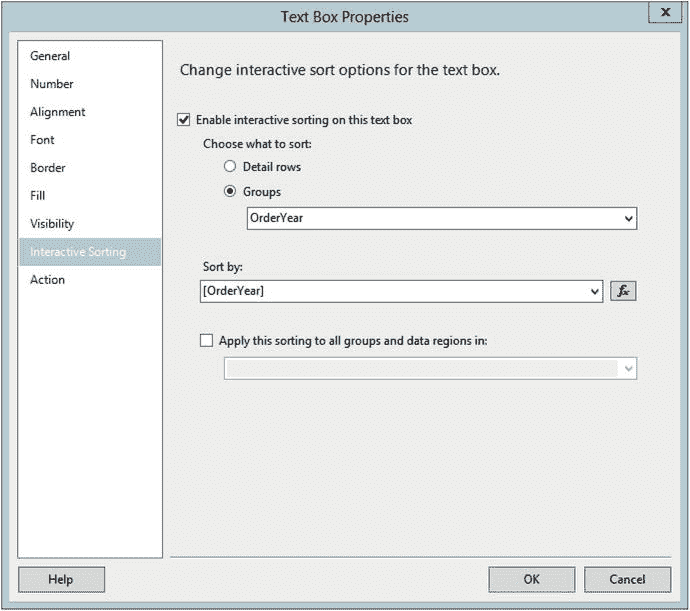

图 6-37. 交互排序属性
12. 单击 **确定** 接受属性。
13. 为 `Territory ID` 标题单元格设置交互排序属性。排序应应用于 `TerritoryID` 组并按 `TerritoryID` 排序。
14. 为 `Customer ID` 标题单元格设置交互排序属性。排序应应用于 **详细信息** 行。按 `CustomerID` 排序。
15. 为 `Store` 标题单元格设置交互排序属性。排序应应用于 **详细信息** 行。按 `Store` 排序。
16. 预览报表。您将在每个可排序列旁边看到箭头图标，如图 6-38 所示。

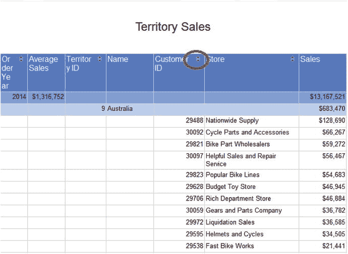

图 6-38. 排序图标

单击图标可更改报表的排序顺序。第一次单击时，排序将变为升序。再次单击可更改为降序。您可以将 `Order Year` 列从降序更改为升序。您可以在 `Customer ID` 和 `Store` 之间切换详细信息的排序。


## 创建钻取报告

本章介绍了许多让报告动态化的绝佳方法，可能性无限。还有一个经常被要求的功能要向你展示：即能够点击报告中的某个单元格，自动导航至包含明细行的另一份报告。

请按照以下步骤创建明细报告：
1.  在项目中新建一个名为 `Sales Details` 的报告。
2.  向报告添加一个名为 `AdventureWorks` 的数据源，该数据源指向 `AdventureWorks2016` 共享数据源。
3.  向报告添加一个名为 `SalesDetails` 的嵌入式数据集。它应指向 `AdventureWorks` 数据源。
4.  查询语句应为：
    ```
    SELECT C.CustomerID, SalesOrderID, OrderDate, TotalDue,
    T.TerritoryID, T.Name AS Territory, s.Name AS Store
    FROM sales.SalesOrderHeader AS SOH
    JOIN Sales.SalesTerritory AS T ON SOH.TerritoryID = T.TerritoryID
    JOIN Sales.Customer AS C ON SOH.CustomerID = C.CustomerID
    JOIN Sales.Store AS S ON S.BusinessEntityID = C.StoreID
    WHERE YEAR(OrderDate) = @Year AND T.TerritoryID = @Territory;
    ```
5.  向报告添加一个表格控件。
6.  用以下字段填充表格控件：`CustomerID`、`Store`、`SalesOrderID`、`OrderDate` 和 `TotalDue`。
7.  将标题行加粗，并将 `TotalDue` 单元格格式设置为货币。设计应类似于图 6-39。
    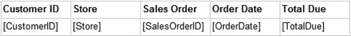
    图 6-39. 明细布局
8.  将表格拖动到左上角，并收紧报告画布。
9.  向报告添加一个报告页眉。
10. 从“内置字段”文件夹中将“报告名称”拖入页眉。
11. 将字体大小更改为 14 磅，并展开文本框的宽度。
12. 将 `Year` 参数拖动到页眉。
13. 将 `SalesDetails` 数据集中的 `Territory` 字段拖动到页眉。由于这在表格外部，它将从数据集中提取第一个值。这是可行的，因为报告已按 `TerritoryID` 筛选，因此只有一个 `Territory` 值可用。报告布局应类似于图 6-40。
    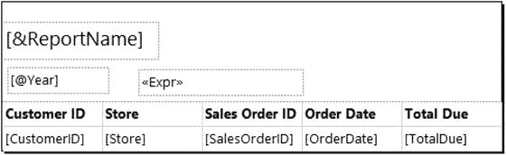
    图 6-40. 报告布局

此时，运行报告以确保其正常运行是合理的。运行时，只需为参数输入 `2011` 和 `3`。此报告不会显示参数列表，而是将从另一份报告接收值。最终用户将始终通过点击汇总报告来运行报告，且应永远不需要看到参数。请按照以下步骤隐藏参数：
1.  切换回明细报告的设计视图。
2.  打开 `Year` 参数的属性。
3.  将 `选择参数可见性` 属性更改为 `隐藏`，并点击“确定”接受更改。
4.  对 `Territory` 参数重复此过程。

下一步是向汇总报告中的某个单元格添加操作。请按照以下步骤添加操作：
1.  创建 `Sales by Territory Matrix` 报告的副本。将其命名为 `Sales Summary`。
2.  双击 `Sales Summary` 报告以在设计视图中打开它。
3.  右键单击位于 `TerritoryID` 和 `OrderYear` 交叉处的单元格，调出“文本框属性”。图 6-41 显示了要选择的单元格。
    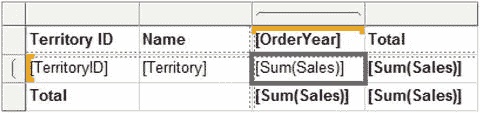
    图 6-41. 要选择的单元格
4.  选择“操作”页面。
5.  选择 `转到报告`。
6.  在 `指定报告` 中，选择 `Sales Details`。
7.  点击 `添加`。这将从 `Sales Details` 报告添加一个参数以映射到 `Sales Summary` 报告。`名称` 属性是 `Sales Details` 报告所需的参数。在 `值` 属性中，你将映射汇总报告中的某些内容以传递到明细报告。
8.  在 `名称` 列中选择 `Year` 参数。
9.  从 `值` 列表中选择 `OrderYear`。
10. 再次点击 `添加`。这次，将 `Territory` 映射到 `TerritoryID` 字段。对话框应类似于图 6-42。
    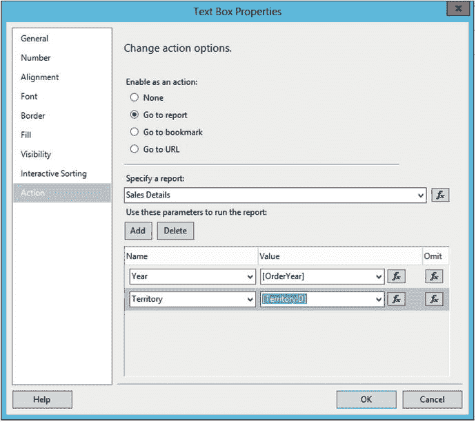
    图 6-42. 操作属性
11. 点击“确定”接受属性设置。

现在，当你运行报告时，点击 `Territory` 行上的任何总销售额值。`Sales Details` 报告将打开，并已根据你选择的值进行筛选。要导航回 `Sales Summary` 报告，请点击 `返回父报告` 按钮。

## 总结

在本章中，你看到了许多方法，可以根据用户交互性或数据本身使报告动态化。你可以让用户能够使用参数筛选数据或修改属性。文本框和其他控件可以通过基于数据的表达式进行格式化。你可以做的事情没有限制。

在第 7 章中，你将了解可以添加到报告中的视觉元素。这些元素可用于让报告仅凭一眼就能传达更多信息，或者用于创建仪表板。

