# 向报表添加图表和图形

SQL Server Reporting Services (SSRS) 使您能够通过图表控件向报表添加图表和图形。图表（chart）和图形（graph）有什么区别？严格来说，图形（graph）展示的是数据随时间变化的关系，而图表（chart）则用于比较不同类别。例如，图形可能显示按月统计的全年销售情况，而图表可能比较特定年份内不同区域的销售业绩。您可以在图 7-1 中看到区别。

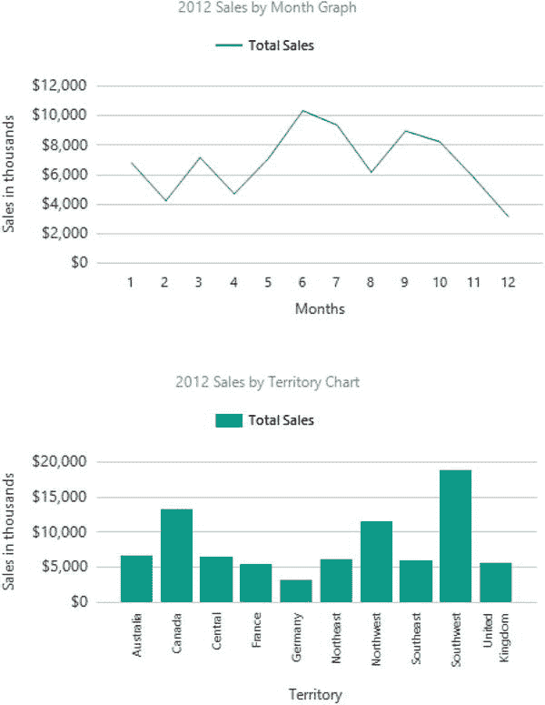

图 7-1. 比较图形与图表

如果您想查看这些数据元素所使用的设计，请在本书的 Apress 网站 ([`www.Apress.com`](http://www.Apress.com)) 的 Code/Download 区域查找一个名为 Chart and Graph 的报表。在开始创建图表和图形之前，请先看一下图 7-2，以便了解构成这些可视化元素的各个部分。

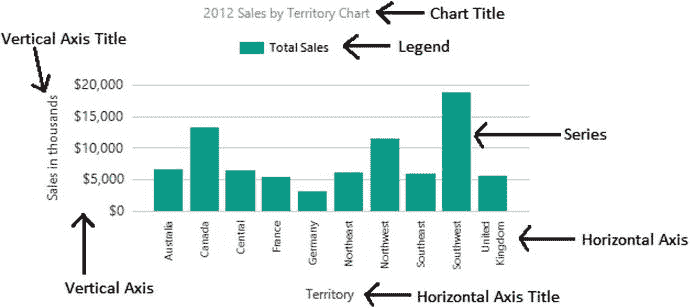

图 7-2. 图表的组成部分

SSRS 提供了丰富的图表类型。其中一些是 3-D 的；但是，应谨慎且有节制地使用 3-D 效果。将可视化元素设为 3-D 并不会增加其价值，反而可能扭曲尺寸，使理解控件所表示的数据变得更加困难。在本节中，您将学习如何向报表添加图表和图形。请按照以下步骤开始：

1.  创建一个新的 SSRS 项目，命名为 Visual Reports。解决方案名称应为 Beginning SSRS Chapter 7。
2.  向项目添加一个新的共享数据源，指向 `AdventureWorks2016` 数据库，命名为 `AdventureWorks2016`。如果需要回顾如何添加数据源和数据集，请参阅第 3 章。
3.  向项目添加一个新的共享数据集，命名为 `Year`。它应指向 `AdventureWorks` 共享数据源。此数据集将在多个报表中使用，因此能够重用它是有意义的。查询如下：
    ```sql
    SELECT YEAR(OrderDate) AS OrderYear
    FROM Sales.SalesOrderHeader
    GROUP BY YEAR(OrderDate)
    ORDER BY YEAR(OrderDate);
    ```
4.  如果 Microsoft 的修复程序尚未发布，请务必修正共享数据集文件。更多信息请参见第 6 章。
5.  向项目添加一个新报表，命名为 Charts。
6.  向报表添加一个数据源，命名为 `AdventureWorks`，指向该共享数据源。
7.  向报表添加一个新数据集，命名为 `Year`。选择“使用共享数据集”，并选择项目中的 `Year` 数据集。对话框应如图 7-3 所示。
    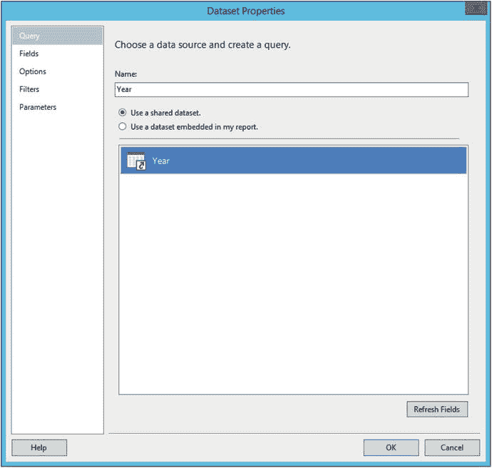
    图 7-3. Year 数据集
8.  添加一个嵌入数据集，命名为 `Sales`，指向 `AdventureWorks` 数据源，并使用以下查询：
    ```sql
    SELECT SUM(TotalDue) AS TotalSales, MONTH(OrderDate) AS OrderMonth,
    T.TerritoryID, T.Name AS TerritoryName,
    Sum(Sum(TotalDue)) OVER(PARTITION BY T.TerritoryID) AS TerritoryTotal
    FROM Sales.SalesOrderHeader AS SOH
    JOIN Sales.SalesTerritory AS T ON T.TerritoryID = SOH.TerritoryID
    WHERE YEAR(OrderDate) = @Year
    GROUP BY MONTH(OrderDate), T.TerritoryID, T.Name;
    ```
9.  该查询通过 `@Year` 进行筛选。数据集将自动创建一个参数。展开“参数”文件夹，打开 `Year` 参数的属性。
10. 选择“可用值”页面，并选择“从查询中获取值”。
11. 将“数据集”设置为 `Year`。将“值字段”和“标签字段”设置为 `OrderYear`。“可用值”页面应如图 7-4 所示。
    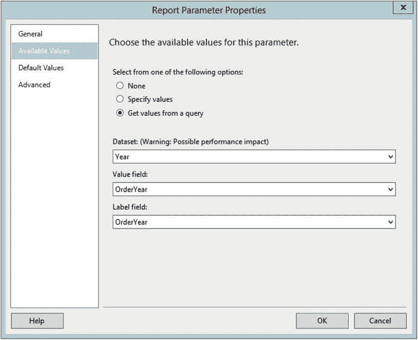
    图 7-4. 可用值属性
12. 设置一个默认值 `2012`。“默认值”页面应如图 7-5 所示。
    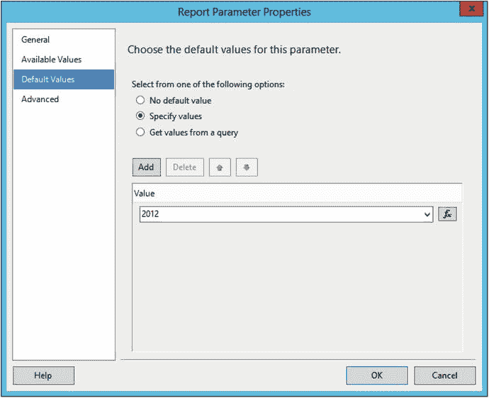
    图 7-5. 默认值属性
13. 单击“确定”接受更改。
14. “报表数据”窗口现在应如图 7-6 所示。
    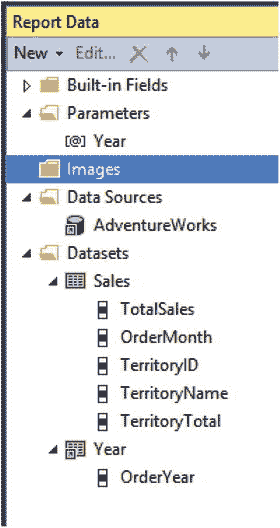
    图 7-6. 添加完所有报表对象后的报表数据窗口

看一下如图 7-7 所示的“工具箱”。图表、仪表和地图通常作为独立对象添加到报表中。数据栏、迷你图和指示器通常添加到 Tablix 的单元格中。在本节中，您将学习图表控件。

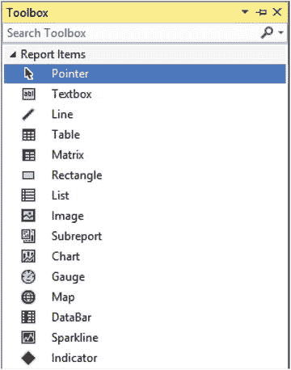

图 7-7. 工具箱

请按照以下步骤向报表添加图表：

1.  在设计视图中，将图表拖到设计画布上。
2.  这将打开如图 7-8 所示的“选择图表类型”对话框，您可以在其中选择多种图表类型中的一种。
    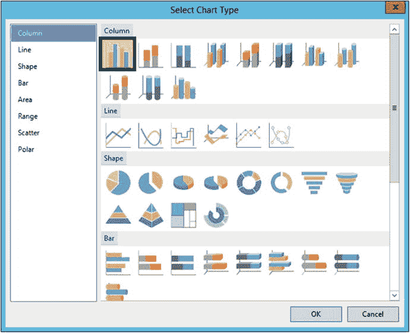
    图 7-8. “选择图表类型”对话框
3.  默认类型是柱形图。单击“确定”将其添加到报表中。
4.  在进行任何修改之前，图表将如图 7-9 所示。
    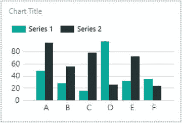
    图 7-9. 图表控件
5.  要将数据连接到图表，请双击图表。这将打开如图 7-10 所示的“图表数据”窗口。
    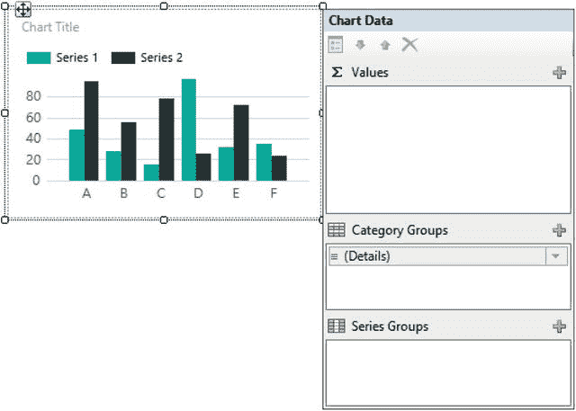
    图 7-10. 图表数据窗口
6.  “图表数据”窗口分为三个部分。∑ 值窗口包含您想要度量的字段，由柱形的高度表示。单击加号并导航到 `AdventureWorks` ➤ `Sales` 下的 `TotalSales` 字段以添加它。它将自动求和。
7.  “类别组”部分包含用于横轴的值。将默认的“详细信息”更改为 `TerritoryName`。如果保持默认值，它将为数据集中的每一行显示一个柱形。在我们的例子中，我们希望每个区域一个柱形。
8.  “系列组”允许您将类别分解为多个更小的项目。您将在后面的示例中了解这一点。目前，“图表数据”窗口应如图 7-11 所示。
    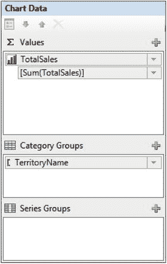
    图 7-11. 填写属性后的图表数据窗口
9.  增加图表大小，使其宽度约为五英寸（13 厘米），高度约为四英寸（10 厘米）。为了辅助调整图表大小，您可以通过右键单击报表并选择“视图” ➤ “标尺”来添加标尺。
10. 预览报表。图表应如图 7-12 所示。
    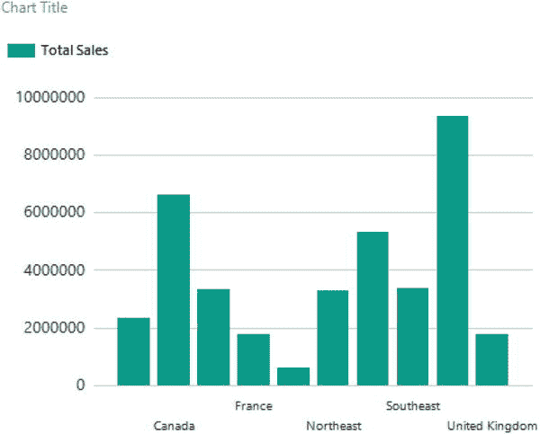
    图 7-12. 格式化前的图表

此时，您可以看到柱形高度不同，并且横轴上显示了一些区域名称。显然，这个图表还需要大量调整，而且幸运的是，它的可定制性很高。图表的每个部分都有自己的属性窗口，可用于控制格式和位置。以下是需要修正的项目列表：

*   显示所有区域名称。
*   添加两个坐标轴标题。
*   将图表标题更改为 `按区域统计的销售总额` 以及年份。
*   删除图例。
*   格式化纵轴。
*   添加一个工具提示，显示每个区域的精确金额。

请按照以下步骤格式化图表：


