# 图表格式化与高级类型

## 柱状图格式化

1.  切换回设计视图。
2.  右键单击水平轴并选择“水平轴属性”。
3.  这将打开“水平轴属性”对话框。在“轴选项”页面上，将`Interval`属性更改为`1`并点击“确定”。这将使所有区域都在图表上显示。
4.  右键单击水平轴并选择“显示轴标题”。
5.  右键单击水平“轴标题”并选择“轴标题属性”。
6.  这将打开“轴标题属性”对话框。将文本标题更改为`Territory`并点击“确定”。
7.  右键单击垂直轴并选择“显示轴标题”。
8.  除了通过打开“轴标题属性”对话框来更改轴标题，你也可以通过点击它并输入来更改。将垂直“轴标题”更改为`Sales in thousands`。
9.  右键单击“图表标题”并打开其属性。
10. 在“标题文本”旁边，点击`fx`以打开“表达式”对话框。
11. 要将年份参数添加到标题中，表达式应为：

    ```
    ="Total Sales by Territory for " & Parameters!Year.Value
    ```

12. 点击“确定”两次以接受属性设置。
13. 选择图例“Total Sales”并按`Delete`键。在这种情况下，图表图例对报表没有增加任何价值。
14. 右键单击垂直轴并选择“垂直轴属性”。
15. 在“垂直轴属性”对话框的“数字”页面上，在“类别”下选择“货币”。
16. 将“小数位数”更改为`0`。
17. 勾选“使用千位分隔符 (,)”并勾选“以千为单位显示值”。“数字”页面应如图 7-13 所示。

    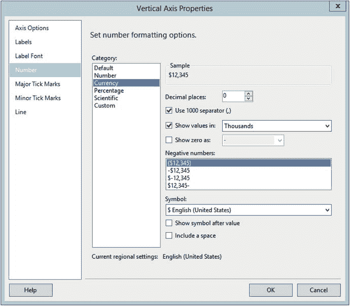

    图 7-13. 垂直轴的数字属性

18. 点击“确定”以接受属性设置。
19. 右键单击其中一个数据条并选择“系列属性”。
20. 在“系列属性”对话框的“系列数据”页面上，点击“工具提示”旁边的`fx`符号。
21. 表达式应为：

    ```
    =FormatCurrency(Sum(Fields!TotalSales.Value),0)
    ```

22. 点击“确定”两次以接受更改。

现在当你预览报表时，图表应该类似于图 7-14。务必在一个或多个数据条上悬停光标以查看工具提示。

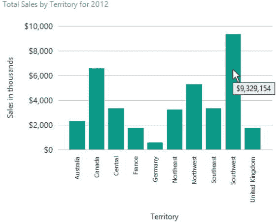

图 7-14. 格式化后的图表

## 按销售额排序

报表看起来相当不错，但你还可以做更多。比如，按总销售额对数据条排序，而不是按字母顺序？要执行此操作，请遵循以下步骤：

1.  切换到设计视图并双击图表以打开“图表数据”窗口。
2.  点击`TerritoryName`旁边的向下箭头，并选择“类别组属性”，如图 7-15 所示。

    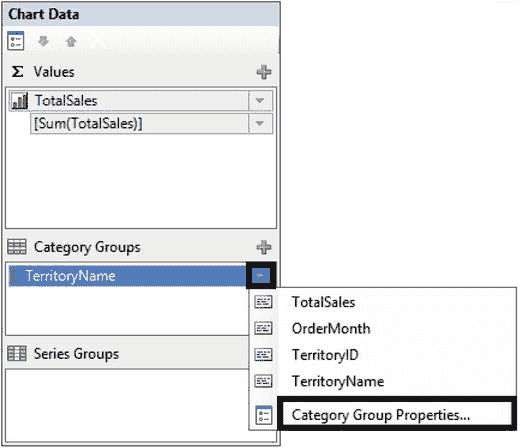

    图 7-15. 选择“类别组属性”

3.  选择“排序”页面，并将“排序依据”属性从`TerritoryName`更改为`TerritoryTotal`。此字段已作为每个区域的和进行了预聚合。你不能使用`Sum(TotalDue)`表达式进行排序。
4.  点击“确定”并预览报表。报表应如图 7-16 所示。

    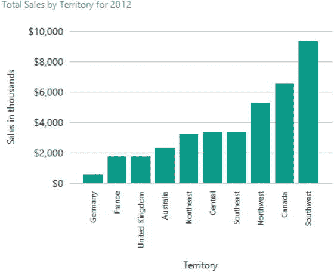

    图 7-16. 按总销售额排序的图表

## 树状图

这种图表类型可能是显示此信息的最佳方式，但你还可以使用其他几种类型。可以使用饼图，但由于类别数量多，用户可能难以理解。漏斗图或金字塔图也可能适用，但你也可以选择树状图控件。这种图表类型是 SSRS 2016 的新功能。

按照以下步骤学习如何使用新的树状图：

1.  切换回设计视图。
2.  增加报表画布的长度，为下一个图表腾出空间。
3.  向报表添加一个图表。
4.  在“选择图表类型”对话框中，选择“树状图”，如图 7-17 所示，然后点击“确定”。

    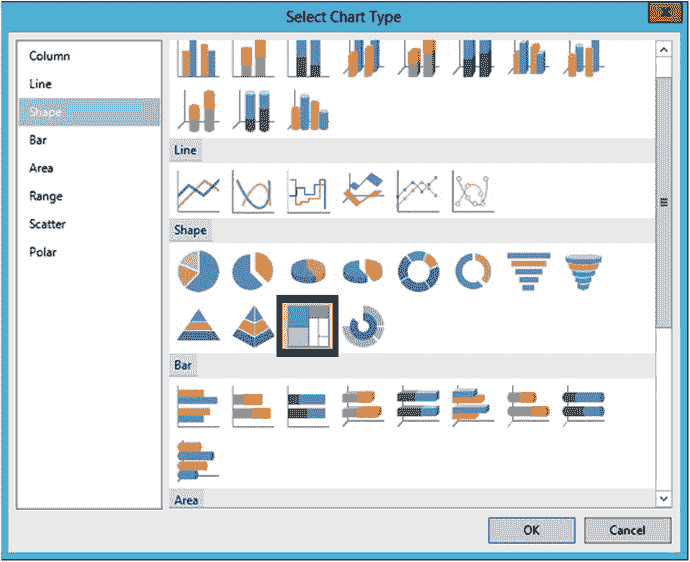

    图 7-17. 选择新的“树状图”图表

5.  增大图表的尺寸。
6.  通过双击图表打开“图表数据”窗口。
7.  将`TotalSales`添加到`∑`值部分。
8.  将“类别组”值设置为`TerritoryName`。这将为每个区域创建一个部分，但它们的颜色将相同。
9.  为使每个区域颜色不同，同时将“序列组”也设置为`TerritoryName`。
10. 预览报表。此时，图表将如图 7-18 所示。

    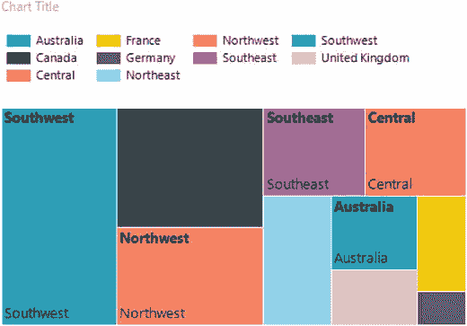

    图 7-18. 格式化前的树状图图表

注意，某些单元格显示了两次区域，而有些则没有任何显示。为了解决这个问题，使用工具提示来显示信息。按照以下步骤添加工具提示并完成格式化：

1.  切换回设计视图。
2.  右键单击一个序列单元格并点击“显示数据标签”，如图 7-19 所示。这实际上会将底部的标签切换为总销售额。

    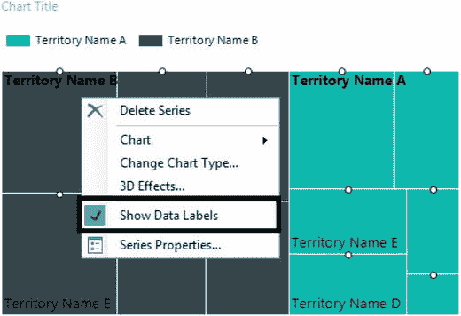

    图 7-19. 显示数据标签

3.  右键单击其中一个数字并选择“序列标签属性”。
4.  选择“序列标签属性”对话框的“数字”页面，格式化为货币，无小数位，并使用千位分隔符。
5.  点击“确定”接受更改。
6.  右键单击一个序列单元格并选择“序列属性”。
7.  点击“工具提示”属性旁边的`fx`，使用以下表达式：

    ```
    =Fields!TerritoryName.Value & " " &
    FormatCurrency(Sum(Fields!TotalSales.Value),0)
    ```

8.  点击“确定”两次以关闭对话框。
9.  将“图表标题”更改为以下表达式：

    ```
    ="Sales by Territory for " & Parameters!Year.Value
    ```

10. 预览报表。图表应类似于图 7-20。

    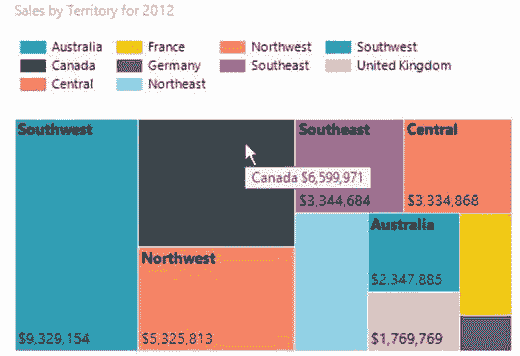

    图 7-20. 格式化后的树状图图表

## 折线图

折线图类型也很有趣。使用它，你可以创建一个图表，比较多个类别随时间的变化。在这种情况下，你将创建一个图表，显示一年内每个月各区域的销售情况。按照以下步骤创建该图表：

1.  切换回设计视图。
2.  扩大报表画布的尺寸。
3.  向报表添加一个新图表，如图 7-21 所示。

    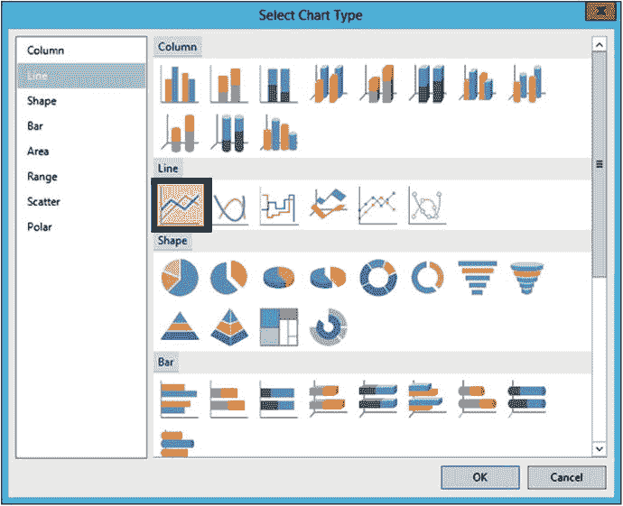

    图 7-21. 选择折线图

4.  增大图表的尺寸。
5.  按照图 7-22 所示设置“图表数据”属性。“序列组”属性会将折线分割为各个区域。

    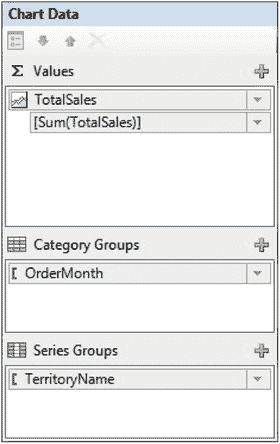

    图 7-22. 图表数据属性

6.  将水平轴的`Interval`属性更改为`1`，以便显示所有月份。
7.  要将水平轴中的月份从数字更改为月份名称，请点击“图表数据”窗口中`OrderMonth`旁边的向下箭头，并选择“类别组属性”，如图 7-23 所示。

    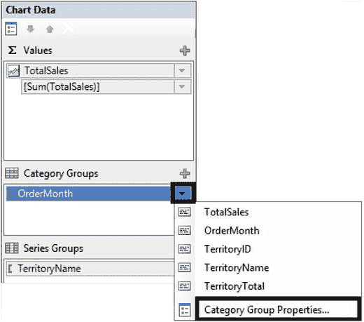

    图 7-23. 选择“类别组属性”

8.  点击“标签”旁边的`fx`图标并添加此表达式：

    ```
    =MonthName(Fields!OrderMonth.Value)
    ```

9.  点击“确定”两次以关闭两个对话框。
10. 选择其中一个序列线并选择“序列属性”。
11. 将工具提示属性更改为以下表达式：


