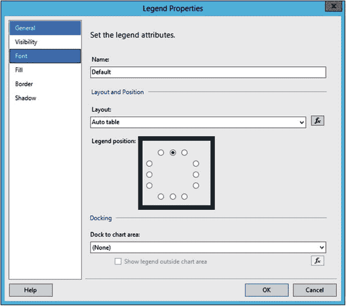
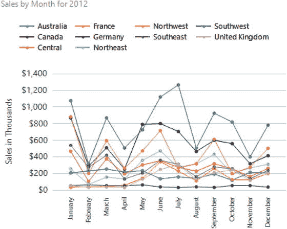

# 配置图表

```
=Fields!TerritoryName.Value & " " & FormatCurrency(Fields!TotalSales.Value,0)
```

12. 单击 **OK** 关闭 **Expressions** 对话框，然后选择 **Markers** 页面。
13. 将 **Marker Type** 更改为 **Circle** 并单击 **OK**。
14. 右键单击图例并打开其属性。
15. 将图例位置更改为顶部，如图 7-24 所示。
    
    **图 7-24. 图例位置**
16. 单击 **OK** 接受更改。
17. 将图表标题更改为
    ```
    ="Sales by Month for " & Parameters!Year.Value
    ```
18. 打开垂直轴属性并设置垂直轴格式，使其显示为货币格式，无小数位，并包含千位分隔符。
19. 仅以千为单位显示数值，然后单击 **OK** 保存更改。
20. 右键单击垂直轴并选择 **Show Axis Title**。标题应为 **Sales in Thousands**。
21. 将水平轴的 **Interval** 属性设置为 `1`，以显示所有月份。
22. 预览报表。它应类似于图 7-25。
    
    **图 7-25. 销售图表**

