# 向报表添加仪表

图表和图形用于在类别、时间或两者上比较值。仪表可用于显示单个目标是否达成。达到销售配额就是一个很好的例子。仪表看起来像温度计和表盘，它们的配置比图表更复杂。

在深入细节之前，先了解一下构成仪表的不同部分，如图 7-26 所示。
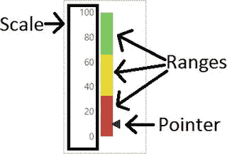
**图 7-26. 仪表的组成部分**

**刻度** 代表您预期的值范围。它可以是数值（如美元）或百分比。刻度的最高值可以是目标或配额。但是，如果可能超过目标，您可能希望将最高值设置得比目标高，例如目标加上 25%。

**范围** 突出显示刻度上的某些区域。例如，您可能希望突出显示目标。您可以自定义范围的颜色，一种方法是将范围的颜色从红色渐变到绿色。可以添加多个范围以对颜色进行更精细的控制。

**指针** 代表已实现的值。一眼就能看出目标是否达成，这取决于指针距离目标有多近。有几种类型的仪表可供选择，包括带有两个表盘的仪表和带有对数刻度的仪表。要了解如何使用仪表，请按照以下步骤操作：

1.  向项目添加一个名为 `Gauges` 的新报表。
2.  设置一个指向 `AdventureWorks2016` 的数据源，命名为 `AdventureWorks`。
3.  添加一个名为 `Year` 的数据集，指向 `Year` 共享数据集。
4.  `AdventureWorks` 数据库中有一个包含配额的表，但与销售相比，这些值不太合理。因此，创建一个名为 `SalesQuota` 的数据集，使用此包含硬编码值的查询：
    ```
    SELECT * FROM
    (VALUES(2011,1000, 899),
    (2012,1000,1010),
    (2013,1200,1100),
    (2014,1200,1220))
    AS Quota ([Year],[Target],Sales)
    WHERE [Year] = @Year;
    ```
5.  将自动创建一个 `Year` 参数。将 **Available Values** 更改为 **Get values from a query**。**Dataset** 为 `Year`。**Value field** 和 **Label field** 应设置为 `OrderYear`。
6.  向报表添加一个仪表。选择 **Radial graph**，如图 7-27 所示。
    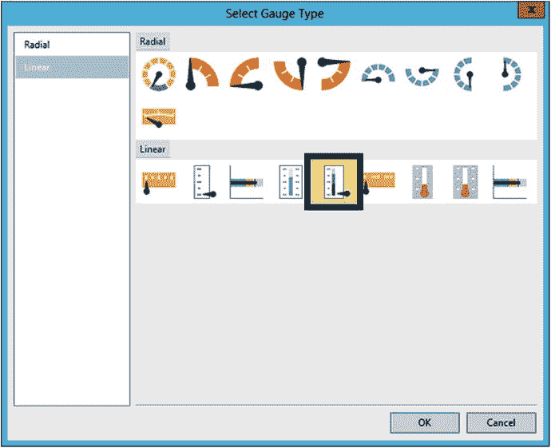
    **图 7-27. 向报表添加径向仪表**
7.  单击仪表时，将打开 **Gauge Data** 窗口。在 `LinearPointer1` 下，将 `Unspecified` 更改为 `Sales`。它将自动求和，如图 7-28 所示。
    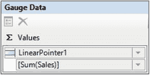
    **图 7-28. 仪表数据属性**
8.  右键单击仪表内部。选择 **Gauge Panel** ➤ **Scale Properties**。
9.  默认情况下，刻度范围是 0 到 100。要将其更改为与数据中的值匹配，请在 **General** 页面上单击 **Maximum** 属性的 `fx` 符号。
10. 将表达式更改为
    ```
    =Fields!Target.Value * 1.25
    ```
11. 切换到 **Number** 页面并格式化为 **Currency**，无小数位。
12. 单击 **OK** 接受属性。
13. 通过右键单击仪表并选择 **Gauge Panel** ➤ **Range (LinearRange3) Properties**，打开最顶部范围的属性。
14. 在 **General** 页面上，将 **Start range at scale value** 属性更改为以下表达式：
    ```
    =Fields!Target.Value * .95
    ```
15. 将 **End range at scale value** 更改为以下表达式：
    ```
    =Fields!Target.Value * 1.25
    ```
16. 单击 **OK** 接受属性。
17. 打开中间范围 `LinearRange2` 的属性。
18. 将 **Start range at scale value** 设置为
    ```
    =Fields!Target.Value * .75
    ```
19. 将 **End Range at Scale Value** 设置为
    ```
    =Fields!Target.Value * .95
    ```
20. 单击 **OK**。
21. 打开最底部范围 `LinearRange1` 的属性。
22. 将 **End range at scale value** 设置为
    ```
    =Fields!Target.Value * .75
    ```


## 仪表盘配置与表格集成

1.  切换到设计视图。
2.  要在一个报表中显示所有年份，请添加一个名为 `SalesAllYears` 的新数据集，其查询如下：

    ```sql
    SELECT * FROM
    (VALUES(2011,1000, 899),
    (2012,1000,1010),
    (2013,1200,1100),
    (2014,1200,1220))
    AS Quota ([Year],[Target],Sales);
    ```

3.  向报表添加一个表格。
4.  从 `SalesAllYears` 数据集向表格添加字段 `Year`、`Target` 和 `Sales`。
5.  在右侧添加一个新列。
6.  将一个仪表盘拖到新的数据单元格中。
7.  选择线性水平仪表盘，如图 7-30 所示。

    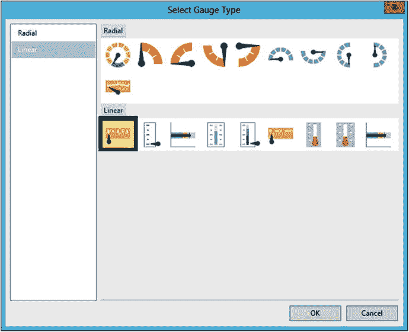

    **图 7-30.**

    线性水平仪表盘

8.  调整单元格的高度和宽度，使表格设计看起来如图 7-31。

    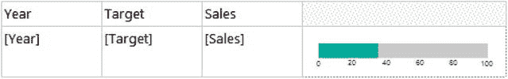

    **图 7-31.**

    表格设计

9.  双击仪表盘，调出“仪表盘数据”窗口。将 `LinearPointer1` 下的值更改为 `Sales`。它将自动求和。
10. 调出“刻度属性”，将“最大值”更改为以下表达式：

    ```sql
    =Fields!Target.Value * 1.25
    ```

11. 将“间隔”属性更改为 `200`。
12. 在“数字”页面，将“类别”更改为“货币”。
13. 更改为 0 位小数，并选中“使用千位分隔符 (,)”。
14. 在“标签”页面，取消选中“在刻度末端显示标签”。
15. 单击“确定”接受更改。
16. 右键单击仪表盘并选择“添加范围”。
17. 调出“范围属性”。
18. 将“范围起始刻度值”和“范围结束刻度值”都更改为 `Sum(Target)`。
19. 在“边框”页面，将“线宽”更改为 `5 pt`。
20. 单击“确定”接受更改。
21. 选择包含仪表盘的单元格。
22. 在“属性”窗口中，将 `BorderStyle Default` 属性更改为 `Solid`，将 `BorderColor` 属性更改为 `LightGray`。

当您预览报表时，表格应如图 7-32 所示。

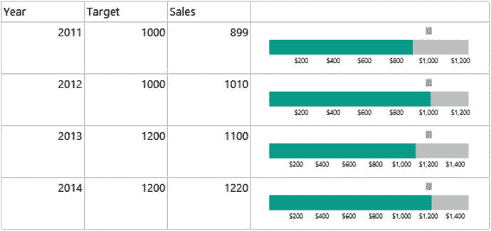

**图 7-32.**

带有嵌入式仪表盘的表格

## 向表格添加数据条、迷你图和指示器

您在上一节中看到了可以向表格单元格添加仪表盘。有三种可视化控件——数据条、迷你图和指示器——设计用于在单元格内使用。指示器是简化的仪表盘。数据条和迷你图是简化的图表。要了解如何添加指示器，请按照以下步骤操作：

1.  向项目添加一个名为 `SmallControls` 的新报表。
2.  添加指向共享 `AdventureWorks2016` 数据集的 `AdventureWorks` 数据源。
3.  添加一个名为 `Sales` 的嵌入数据集，其查询如下：

    ```sql
    SELECT YEAR(OrderDate) AS OrderYear, MONTH(OrderDate) AS OrderMonth,
    SUM(TotalDue) AS Sales
    FROM Sales.SalesOrderHeader
    GROUP BY YEAR(OrderDate), MONTH(OrderDate);
    ```

4.  向报表添加一个表格。
5.  向详细信息行添加 `Sales` 字段。
6.  右键单击详细信息行并选择“添加组”➤“父组”。
7.  在“Tablix 组”对话框中，为“分组依据”属性选择 `OrderYear`。
8.  选中“添加组标题”。对话框应如图 7-33 所示。

    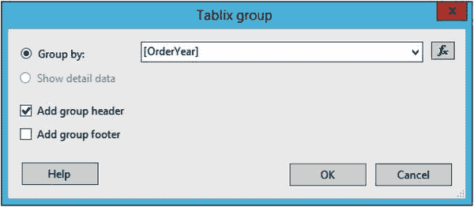

    **图 7-33.**

    `OrderYear` 组

9.  单击“确定”。
10. 通过右键单击行并选择“删除行”来删除详细信息行。
11. 当询问是否要删除行和组时，单击“确定”。
12. 在 `Sales` 下的数据单元格中，选择 `Sales`。它将自动求和。
13. 将一个“指示器”从工具箱拖到该行的第三个数据单元格中。
14. 选择默认的“方向”样式并单击“确定”。
15. 删除空列。
16. 单击带有指示器的单元格。您将在“属性”窗口中看到 `GaugePanel1`。将 `BorderStyle Default` 属性更改为 `Solid`。
17. 双击保存指示器的单元格。将“仪表盘数据”值更改为 `Sales`。它将自动求和，如图 7-34 所示。

    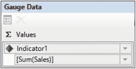

    **图 7-34.**

    仪表盘数据属性

当您运行报表时，它将如图 7-35 所示。

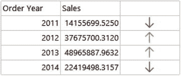

**图 7-35.**

带有指示器的报表

默认情况下，指示器设置为根据销售百分比显示三个可能的图标。在设计视图中，右键单击单元格并选择“指示器属性”。您可以在“值和状态”页面上更改指示器的行为，如图 7-36 所示。

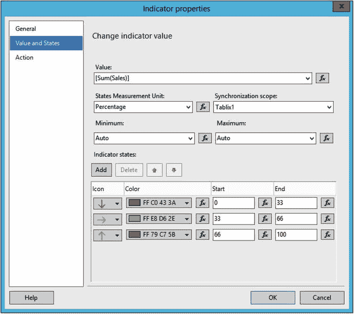

**图 7-36.**

“值和状态”页面

更改“起始值”和“结束值”以匹配图 7-37。

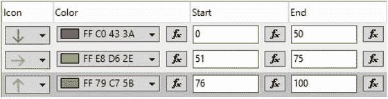

**图 7-37.**

新的指示器属性

单击“确定”接受更改。现在当您运行报表时，处于第 50 个百分位数的所有销售指示器都将是红色的向下箭头，如图 7-38 所示。

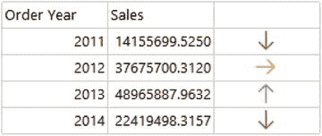

**图 7-38.**

指示器更改后的结果

此报表在年份级别显示数据。您可以使用迷你图来显示各月的销售情况。请按照以下步骤了解如何操作：

1.  切换到设计视图。
2.  在指示器右侧添加一个新列。
3.  将一个迷你图控件拖到新的数据单元格中。
4.  选择“带标记的折线图”迷你图类型，如图 7-39 所示，然后单击“确定”。

    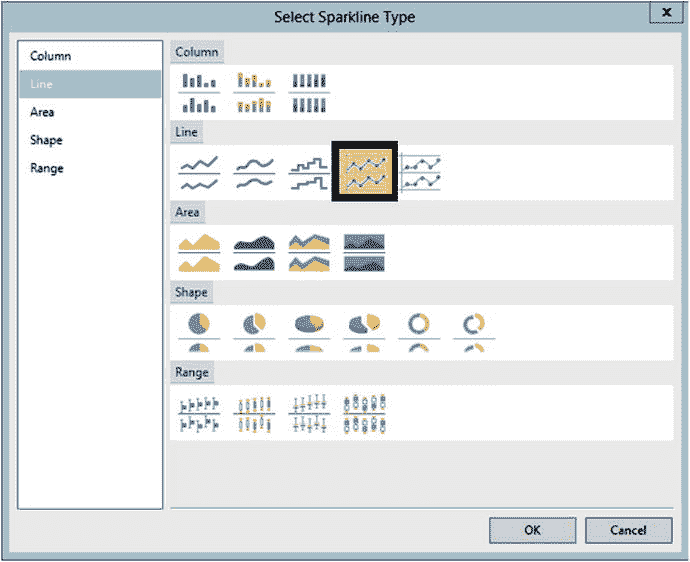

    **图 7-39.**


## 带标记的折线图
5.  双倍调整包含折线图的表格单元格的宽度。
6.  双击该单元格以打开“图表数据”属性。
7.  将 ∑ 值更改为 `Sales`，并将“类别组”更改为 `OrderMonth`。
8.  单击折线图，直到标记亮起。
9.  右键单击折线图，然后选择“系列属性”。
10. 将 `ToolTip` 属性更改为以下表达式，然后单击“确定”：
```
=MonthName(Fields!OrderMonth.Value) & " "
& FormatCurrency(Fields!Sales.Value,0)
```
11. 选择包含折线图的单元格。在“属性”窗口中，将 `BorderStyle` 的默认属性更改为 `Solid`。

现在，当您运行报表时，可以将光标悬停在线上以查看月份名称和该月的销售总额。图 7-40 显示了报表应有的外观：
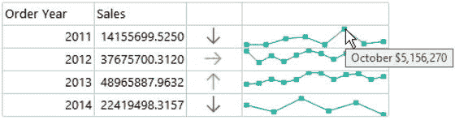
图 7-40.
带有折线图的报表

可以像添加和配置折线图一样添加和配置数据条。区别在于，每个数据点将对应一个单独的条形，而不是一条线。请按照以下步骤添加数据条：
1.  切换到设计视图。
2.  向表格添加一个新列。
3.  将数据条拖到新单元格中。
4.  如图 7-41 所示，选择“数据列”类型。
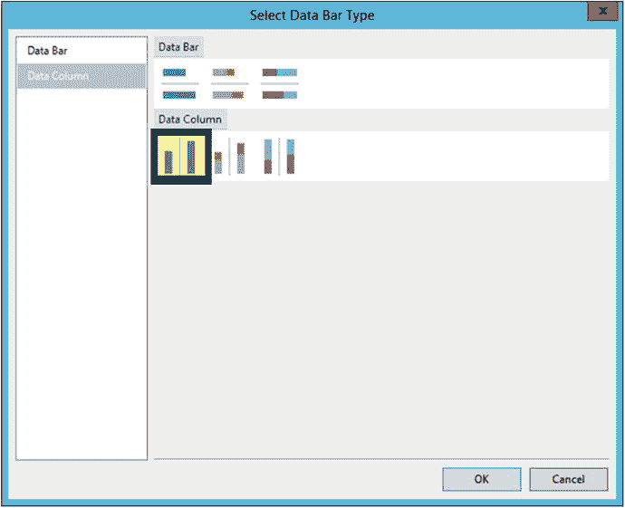
图 7-41.
添加数据条
5.  扩展单元格的宽度。
6.  在“图表数据”窗口中，在 ∑ 值属性下选择 `Sales`。
7.  将 `OrderMonth` 添加到“类别组”部分。
8.  在这种情况下，您将按值而非月份排序。单击“类别组”部分中 `OrderMonth` 旁边的箭头。
9.  选择“类别组属性”。
10. 在“排序”页面上，将 `OrderMonth` 替换为 `Sales`。
11. 单击“确定”。
12. 单击单元格。在“属性”窗口中，将 `BorderStyle` 的默认属性更改为 `Solid`。
13. 单击其中一个数据条，直到每个数据条上方出现一个小圆圈。
14. 右键单击并打开“系列属性”。
15. 将以下表达式添加到“工具提示”属性：
```
=MonthName(Fields!OrderMonth.Value) & " "
& FormatCurrency(Fields!Sales.Value,0)
```
预览报表时，其外观应如图 7-42 所示。
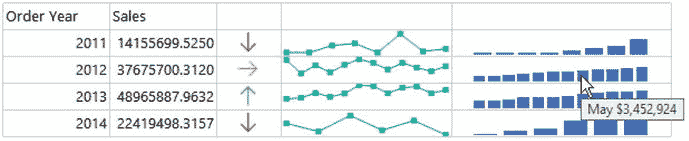
图 7-42.
带有数据条的报表

## 向报表添加地图
可以说，SSRS 最引人入胜的功能是能够向报表添加地图。在本节中，您将学习如何添加一个连接到来自 AdventureWorks 地理数据的地图。这只是地图功能所能实现的冰山一角。事实上，整个主题可以写成一本书。请按照以下步骤学习如何向报表添加一个简单的地图：
1.  向项目添加一个名为 `Map` 的新报表。
2.  添加一个名为 `AdventureWorks` 的数据源，指向共享的 `AdventureWorks2016` 数据源。
3.  添加一个名为 `Year` 的数据集，指向共享的 `Year` 数据集。
4.  添加一个名为 `MapData` 的嵌入数据集，使用以下查询：
```
DECLARE @Year INT = 2013;
SELECT SUM(TotalDue) AS Sales, vS.CountryRegionName, vS.StateProvinceName
FROM Sales.SalesOrderHeader AS SOH
JOIN Person.BusinessEntityAddress AS BEA
ON BEA.BusinessEntityID = SOH.CustomerID
JOIN Person.Address AS A ON BEA.AddressID = A.AddressID
JOIN Person.vStateProvinceCountryRegion AS vS
ON A.StateProvinceID = vS.StateProvinceID
WHERE CountryRegionName = 'United States'
AND YEAR(OrderDate) = @Year
GROUP BY A.City, vS.CountryRegionName, vS.StateProvinceName;
```
5.  `Year` 参数将自动添加。将可用值连接到 `Year` 数据集。此时，`MapData` 数据集是硬编码为 2013 年的，这是使地图向导工作所必需的。地图完成后，您将使报表动态化。
6.  向报表添加一个地图控件，这将启动一个向导。
7.  在“选择空间数据源”页面上，选择“地图库”并选择“美国（按州）”，如图 7-43 所示。
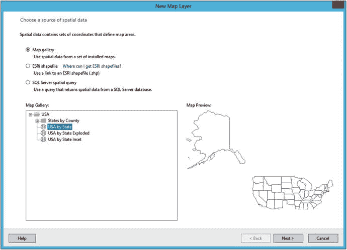
图 7-43.
选择地图数据源
8.  单击“下一步”。
9.  在“选择空间数据和地图视图选项”页面上，您可以修改地图的分辨率、位置和缩放级别。通过向下拖动左侧的指针使地图稍微小一些。通过抓取地图并移动它来调整位置，使阿拉斯加、夏威夷和美国大陆都可见。单击“下一步”。
10. 在“选择地图可视化效果”页面上，选择“颜色分析地图”，然后单击“下一步”。
11. 在“选择分析数据集”页面上，选择 `MapData`，然后单击“下一步”。
12. “指定空间数据和分析数据的匹配字段”页面用于将地图属性连接到数据中的字段。勾选 `STATENAME` 旁边的框。
13. 在“分析数据集字段”下拉框中，选择 `StateProvinceName`。您可以通过比较底部两个部分中突出显示的列来验证是否做出了正确的选择，如图 7-44 所示。
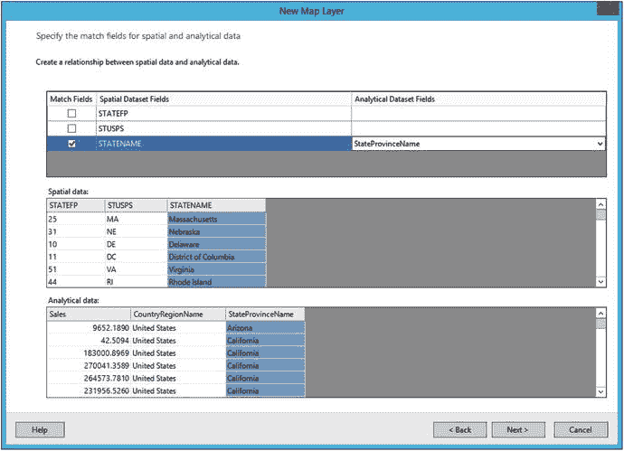
图 7-44.
地图数据连接到数据集列
14. 单击“下一步”。
15. 在“选择颜色主题和数据可视化效果”页面上，从“要可视化的字段”列表中选择 `Sum(Sales)`。
16. 在“颜色规则”列表中，选择“红-黄-绿”。
17. 该页面应如图 7-45 所示。
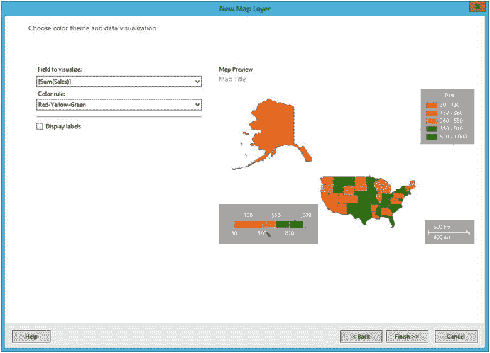
图 7-45.
“选择颜色主题和数据可视化效果”页面
18. 单击“完成”。
19. 打开 `MapData` 数据集属性。
20. 从以下查询中删除此文本：
```
DECLARE @Year INT = 2013;
```
21. 单击“确定”以接受更改。为了将数据连接到地图，必须提供参数的值。现在地图已完成，可以删除此行。

当您预览报表并选择 2012 年时，应该会看到已填充的地图，如图 7-46 所示。
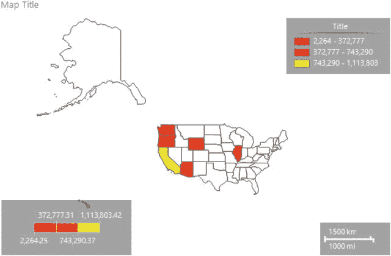
图 7-46.
已填充的地图

要向地图添加工具提示，请按照以下步骤操作：
1.  切换回设计视图。
2.  单击地图以打开“地图图层”窗口。
3.  单击 `PolygonLayer` 中的向下箭头，然后选择“多边形属性”，如图 7-47 所示。
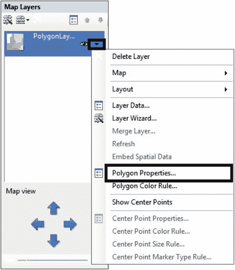
图 7-47.
打开多边形属性
4.  将 `Tooltip` 属性更改为以下表达式：
```
=Fields!StateProvinceName.Value & " " &  FormatCurrency(Fields!Sales.Value,0)
```
5.  将地图标题更改为以下表达式：
```
="US Sales by State " & Parameters!Year.Value
```
6.  右键单击地图图例并打开属性。将“图例位置”更改为地图底部。
7.  勾选“在视区外部显示图例”，如图 7-48 所示。
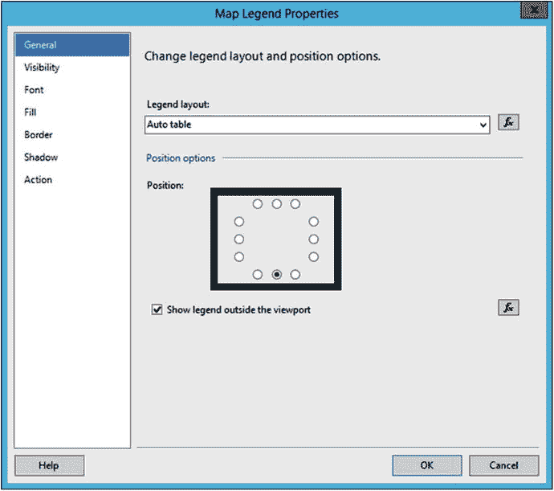
图 7-48.
更改地图图例位置
8.  单击“确定”。
9.  将地图图例标题从“标题”更改为“Sales”。
10. 删除“颜色比例尺”。
11. 删除“距离比例尺”。

当您运行报表并选择 2012 年时，报表应如图 7-49 所示。
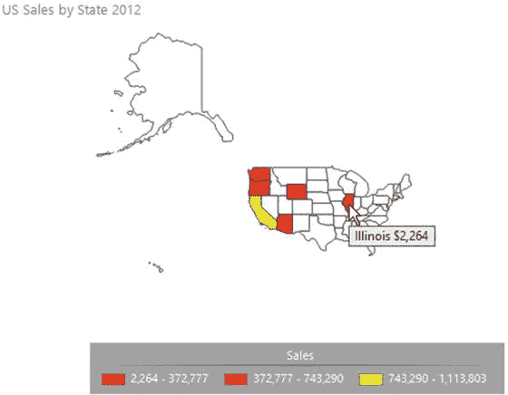
图 7-49.
最终的地图报表


