# 第三部分
部署报表

## 构建仪表板

仪表板让繁忙的高管只需一瞥就能看到业务的当前状况。他们可以看到随时间变化的趋势以及关键绩效指标的达成情况。在本节中，您将把创建的多个可视化元素组合到一份报表中。

请按照以下步骤开始：

1.  添加一个名为 `Dashboard` 的新报表。
2.  从“报表”菜单中打开“报表属性”。
3.  将报表的布局更改为“横向”。
4.  将所有页边距更改为 0.25 英寸或 0.625 厘米，如图 7-50 所示。

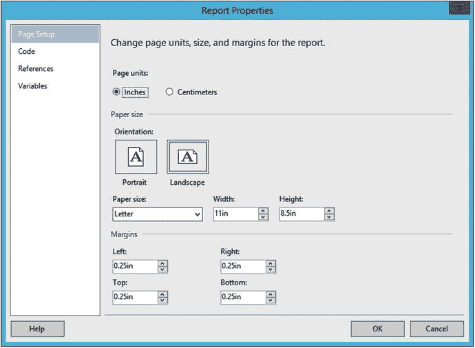

图 7-50. 报表属性页面

5.  单击“确定”保存更改。
6.  向报表添加一个名为 `AdventureWorks` 的数据源，该数据源指向共享数据源 `AdventureWorks2016`。
7.  添加一个名为 `Year` 的数据集，该数据集指向共享数据集 `Year`。
8.  添加一个名为 `Year` 的参数，数据类型为整数。“常规”页面应如图 7-51 所示。

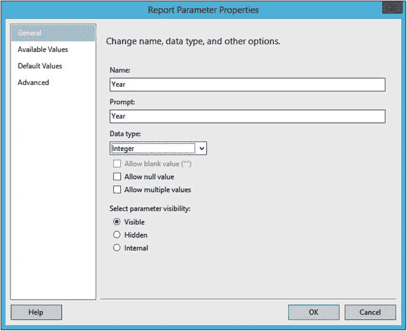

图 7-51. Year 参数属性

9.  将可用值连接到 `Year` 数据集。
10. 为参数添加一个默认值 `2014`。
11. 单击“确定”。
12. 创建一个新的嵌入数据集 `Sales`，指向 `AdventureWorks`，并使用以下查询：

```sql
    SELECT SUM(TotalDue) AS TotalSales, MONTH(OrderDate) AS OrderMonth,
    T.TerritoryID, T.Name AS TerritoryName,
    Sum(Sum(TotalDue)) OVER(PARTITION BY T.TerritoryID) AS TerritoryTotal
    FROM Sales.SalesOrderHeader AS SOH
    JOIN Sales.SalesTerritory AS T ON T.TerritoryID = SOH.TerritoryID
    WHERE YEAR(OrderDate) = @Year
    GROUP BY MONTH(OrderDate), T.TerritoryID, T.Name;
```

13. 向报表添加一个页面页眉。
14. 在页眉中添加一个文本框，使用以下表达式：

```expression
    ="Sales Dashboard for " & Parameters!Year.Value
```

15. 将文本框的字体大小增加到 16 磅。
16. 扩展文本框的宽度。
17. 在设计视图中打开 `Charts` 报表。
18. 使用 `CTRL+C` 快捷键从该报表中复制条形图，并将其粘贴到 `Dashboard` 报表中。

当您运行报表时，它应如图 7-52 所示。


图 7-52. 包含第一个可视化元素的仪表板

您可以继续向仪表板添加嵌入式可视化元素，但也可以添加包含表格或可视化元素的子报表。请按照以下步骤添加子报表：

1.  切换到 `Map` 报表的设计视图。
2.  将地图拖动到报表的左上角。
3.  尽可能向内拖动报表的边距。
4.  保存报表。
5.  在 `Dashboard` 报表的设计视图中，在条形图右侧添加一个子报表控件。
6.  调整子报表的大小，使其与条形图的大小大致相同。
7.  右键单击子报表，选择“子报表属性”。
8.  将“将此报表用作子报表”属性设置为 `Map`。
9.  在“参数”页面上，您可以将子报表所需的任何参数映射到父报表中的值。单击“添加”以添加第一个参数。
10. 在“名称”下选择 `Year`。这是子报表所需的参数。
11. 在“值”下，选择 `fx` 图标以打开表达式生成器。
12. 将表达式更改为 `=Parameters!Year.Value`，然后单击“确定”两次。
13. 预览报表。您可以根据需要调整 `Map` 报表中地图和子报表的大小。报表应如图 7-53 所示。

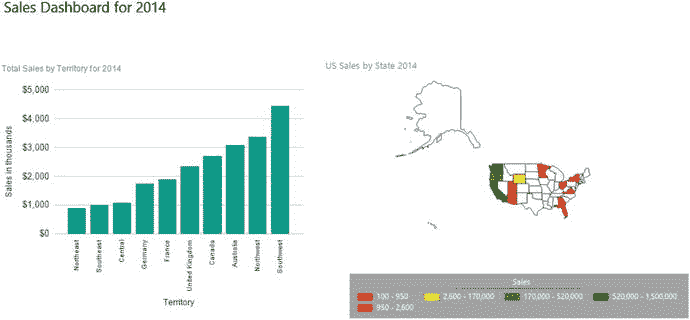

图 7-53. 包含两个可视化元素的仪表板

14. 在设计视图中打开 `SmallControls` 报表。
15. 将表格拖动到左上角。
16. 向内拖动报表边缘。
17. 如果之前未操作，请将 `sales` 字段格式化为货币，无小数位，并使用千位分隔符。
18. 保存 `SmallControls` 报表。
19. 将 `SmallControls` 报表作为子报表添加到 `Dashboard` 报表中条形图的下方。此子报表没有需要映射的参数。

当您查看报表时，它应类似于图 7-54。

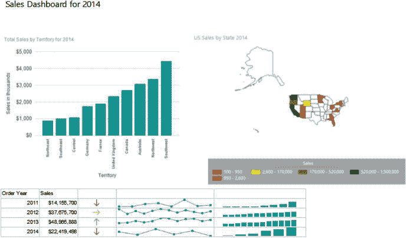

图 7-54. 完成的仪表板

## 小结

SSRS 提供了多种连接到数据集的可视化元素。这些对象还具有许多可配置属性，可以增强报表和仪表板的视觉吸引力。本章向您介绍了所有的图表、仪表和地图，包括几种旨在放入 Tablix 单元格中的图表。

在第 8 章中，您将学习如何将报表发布到新的 Reporting Services Web 门户。

## 8. 发布报表

我撰写文章、博客帖子、书籍和每月的通讯。在它们发布之前，它们只存在于我的笔记本电脑上，只有我能看到。我写作的目的是让其他人也能阅读。我的目标是向全世界的人们传授 SQL Server 知识，为了实现这一点，我的作品必须被发布。

您可以在计算机上使用 SQL Server Data Tools (`SSDT`) 创建出色的报表，但在这些报表发布之前，对于请求它们的人来说它们是没有用的。在本章中，您将学习如何发布您在本书中创建的报表。


## 在 Web 门户中导航

在 SQL Server Reporting Services (SSRS) 的所有历史版本中，当其以本机模式安装时，SSRS 报表的默认用户界面一直是 `报表管理器`，如图 8-1 所示。

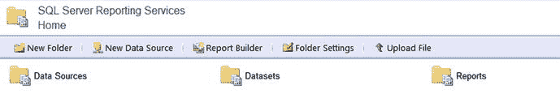
图 8-1. `报表管理器`

从 `SSRS` 2016 版本开始，`报表管理器` 已被新的 `SSRS Web 门户` 所取代。这一变化不仅代表了一次升级，还使 `SSRS` 能够适应新的移动世界，提供了旨在用于智能手机和平板电脑的新报表类型。如果你在过去几年中管理过 `SSRS` 报表，很可能收到过关于 Web 浏览器兼容性的投诉。从 2016 版本开始，现代 Web 浏览器得到了支持！

在过去几个版本中，许多新的 `SSRS` 功能仅在 `SSRS` 以 SharePoint 集成模式安装时才可用。本次发布则很好地偏离了这一趋势。那些仅限 SharePoint 的功能，例如数据驱动报表，并未向后移植到本机模式，但有几个新功能仅在本机模式下可用。图 8-2 展示了新的门户。

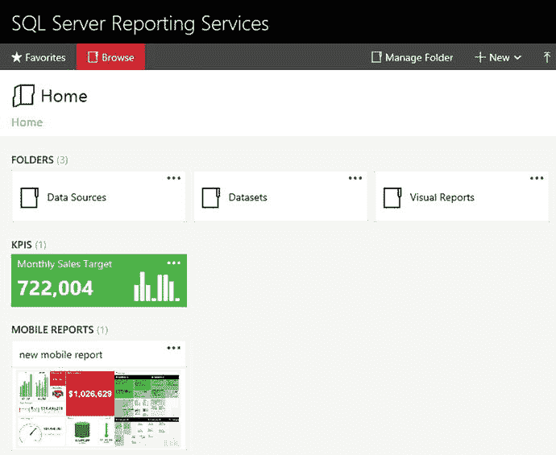
图 8-2. 新的 `Web 门户`

除了承载传统的分页报表外，`Web 门户` 还承载独立的 `KPI`（关键绩效指标）以及可在平板电脑和智能手机上运行的移动报表。你将在第 10 章学习如何构建 `KPI` 和移动报表。

`Web 门户` 有两个页面或模式：`收藏夹` 和 `浏览`。`浏览` 页面看起来更像传统的视图。你可以在那里看到存储报表和其他对象的文件夹，如图 8-3 所示。

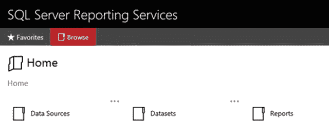
图 8-3. `浏览` 页面

当你点击一个文件夹，例如 `报表` 文件夹时，你将看到该文件夹内的对象。图 8-4 显示了 `报表` 文件夹的内容。

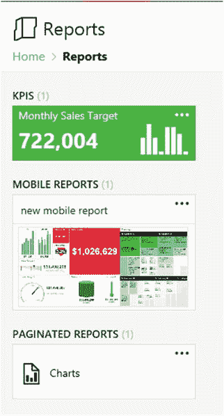
图 8-4. `报表` 文件夹

在每个文件夹内部，你可以存储 `KPI`、移动报表和分页报表。你还会看到文件夹，通常位于 `主目录` 文件夹中，用于存放数据源和其他可以发布的对象。在文件夹顶部，你可以看到一条返回 `主目录` 文件夹的路径。要运行分页报表，你只需导航到该报表并点击它即可。

`收藏夹` 页面是由每个用户专门填充的。要将报表添加到 `收藏夹` 页面，只需点击对象旁边的省略号，然后点击 `添加到收藏夹`，如图 8-5 所示。

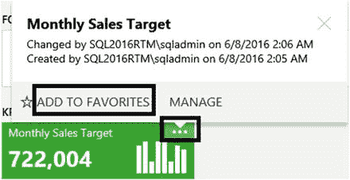
图 8-5. 将报表添加到 `收藏夹` 页面

要在 `Web 门户` 中完成许多管理任务，你将需要从页面右上角的菜单开始，如图 8-6 所示。

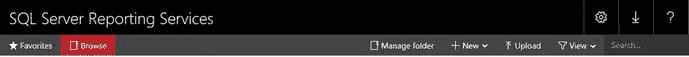
图 8-6. 菜单

最终用户只需知道在哪里找到他们想要运行的报表。他们可以通过利用 `收藏夹` 页面来让操作对自己更方便。`SSRS` 开发人员和管理员则需要了解更多。本章的其余部分将介绍开发人员和管理员为提供便捷的报表体验所执行的任务。

## 从 SSDT 部署报表

报表可以直接从 `SSDT` 部署，也可以在 `Web 门户` 内直接上传。从 `SSDT` 部署时，任何需要的文件夹也会被创建。要开始，请按照以下步骤配置项目以进行部署：

1.  要查看 `SSRS` Web 服务 URL（统一资源定位符），请打开 `Reporting Services 配置管理器`，这是随 SQL Server 安装的一个实用程序。
2.  连接到你的 `SSRS` 实例，如图 8-7 所示。如果它不是命名实例，那么 `报表服务器实例` 将是 `MSSQLSERVICE`。

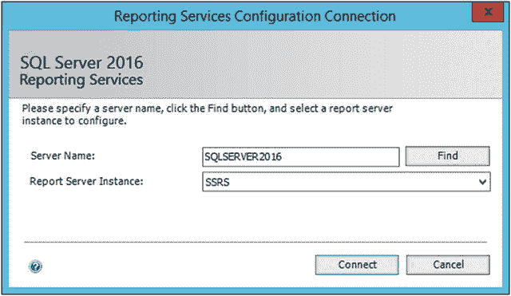
图 8-7. `Reporting Services 配置连接` 对话框连接到命名实例

3.  在 `Reporting Services 配置管理器` 上，点击左侧菜单中的 `Web 服务 URL`。
4.  记录图 8-8 中显示的 URL。后续步骤将需要此信息。

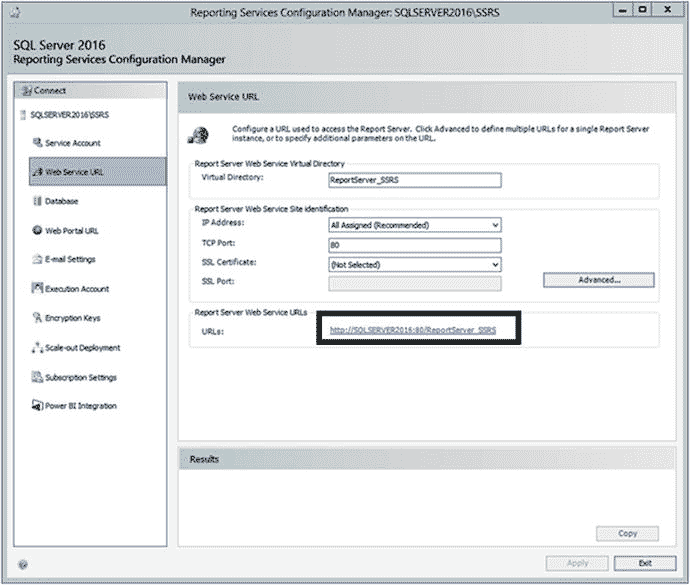
图 8-8. `Web 服务 URL`

5.  点击 `退出` 关闭 `Reporting Services 配置管理器`。
6.  启动 `SSDT`。
7.  通过 `文件` 菜单下的 `最近的项目和解决方案` 找到并打开在第 7 章创建的解决方案。如果你没有跟随第 7 章的操作，可以在本书的 Apress 网站 ( [`www.Apress.com`](http://www.Apress.com) ) 的代码/下载区域找到该解决方案。
8.  在 `解决方案资源管理器` 中，右键单击项目名称 `可视化报表`，然后选择 `属性`。
9.  在 `部署` 部分，你将看到几个已填充默认值的配置项。如果尚未填充，请将你在步骤 4 中记录的 URL 输入到 `TargetServerURL` 属性中，如图 8-9 所示。

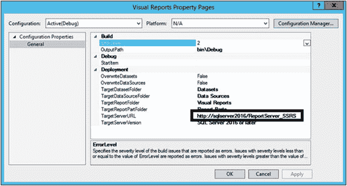
图 8-9. 配置 `TargetServerURL`

10. 点击 `确定` 保存更改。你可能已经注意到，如果端口号是默认的 80，它会自动消失。

看一下图 8-10。`OverwriteDatasets` 和 `OverwriteDataSources` 属性默认设置为 `False`。这可以防止你覆盖已部署的数据集和数据源。如果你的数据源指向开发或测试数据库服务器，这将非常方便。当你将项目部署到生产环境时，你不会用开发连接字符串覆盖现有的数据源。

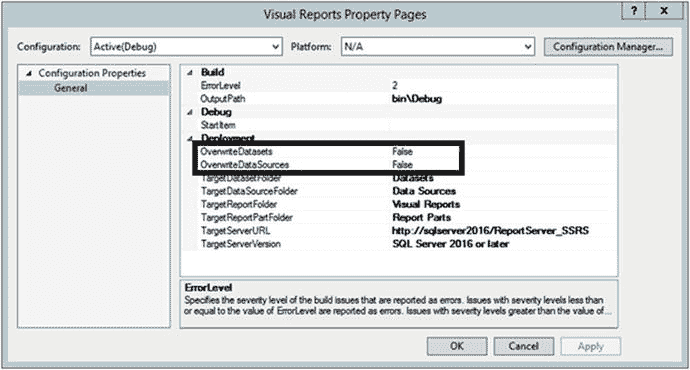
图 8-10. `OverwriteDatasets` 和 `OverwriteDataSources` 属性

现在你的项目已配置完毕，可以部署项目了。请按照以下步骤操作：

1.  右键单击项目名称并选择 `部署`，如图 8-11 所示。

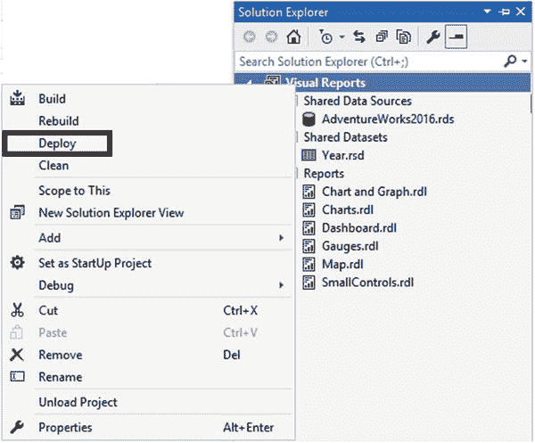
图 8-11. 部署项目

**注意**
如果你的 `SSRS` 安装是本地的，在部署项目和查看 `Web 门户` 时可能会遇到权限问题。请参见第 1 章中的“配置本地 SSRS 设置”部分。

1.  查看 `输出` 窗口，确认部署是否成功，如图 8-12 所示。

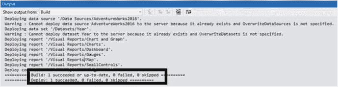
图 8-12. `输出` 窗口

2.  现在项目已部署，你可以在 `Web 门户` 中查看报表了。要找到要使用的 URL，请返回 `SSRS 配置管理器`。这次选择 `Web 门户 URL`。要打开 `Web 门户`，请点击该 URL，如图 8-13 所示。

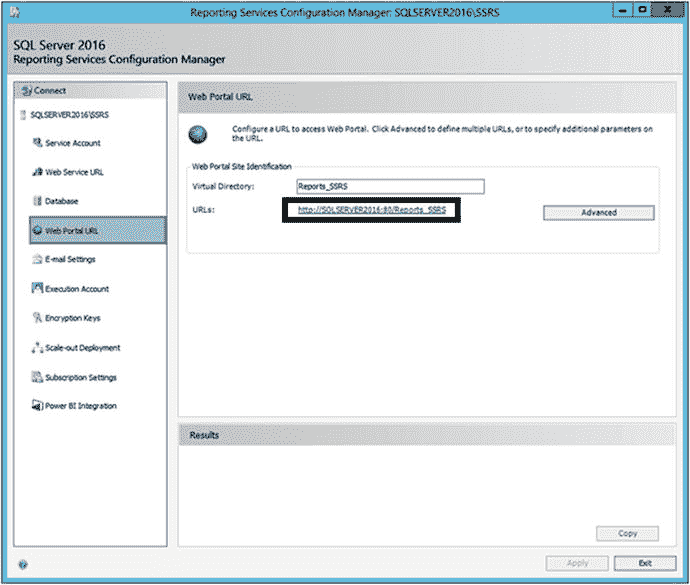
图 8-13. `报表管理器 URL`

`可视化报表` 文件夹现在应该可以在 `Web 门户` 的 `主目录` 文件夹中找到，如图 8-14 所示。


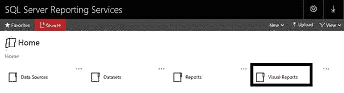
图 8-14.

新的文件夹"笔记"

在 SQL Server 2016 发布时，Web 门户有时会在服务器重启后无法运行。如果您看到“服务不可用”错误，您应该使用 `Reporting Services 配置管理器` 来停止并启动服务。

如果您点击 `可视化报表` 文件夹，您将看到在第 7 章中创建的所有报表。您可以点击一个报表来查看它。任何参数都会显示在顶部。图 8-15 显示了图表报表。

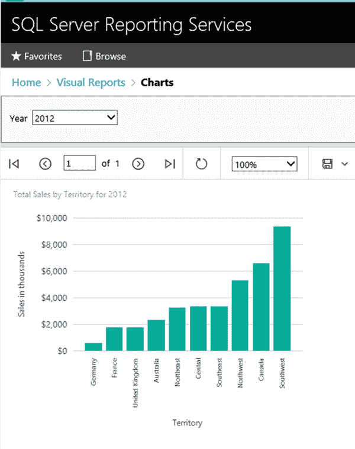
图 8-15.

图表报表

如果出于某种原因需要单独部署某个报表、数据集或数据源，您只需在 `SSDT` 的解决方案资源管理器中右键单击该对象，然后选择 `部署`。

与从 `SSDT` 一样，您可以打印或导出报表。旧版本的 `SSRS` 使用 ActiveX 控件进行打印，这导致与现代 Web 浏览器存在许多兼容性问题。目前，打印机图标允许您将报表另存为 PDF，然后进行打印。保存图标允许您以包括 PowerPoint 在内的多种格式导出报表。

## 上传报表

除了从 `SSDT` 部署，您还可以通过上传到 Web 门户来发布报表。请按照以下步骤上传报表：

1.  启动 Web 门户。
2.  在主文件夹中，点击 `新建` ➤ `文件夹` 以创建一个新文件夹，如图 8-16 所示。
    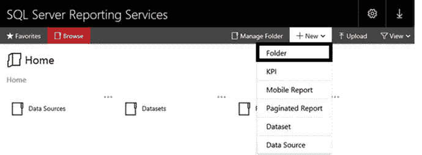
    图 8-16.
    创建新文件夹。
3.  将文件夹命名为 `上传示例` 并点击 `创建`。
4.  文件夹创建后，点击它将其打开。
5.  点击 `上传` 并导航到一个报表文件。报表文件的扩展名为 `rdl`，可以在项目文件夹中找到，如图 8-17 所示。
    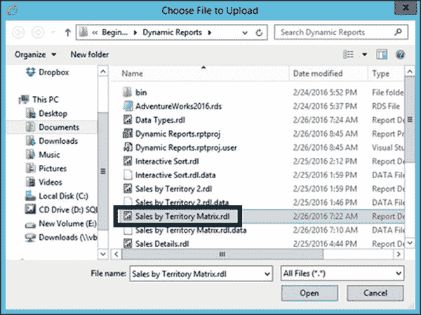
    图 8-17.
    导航到报表文件。
6.  选择报表文件后，点击 `打开`。
7.  您现在应该能在文件夹中看到该报表。点击报表以查看它。

您将不会打开报表，而是会看到如图 8-18 所示的错误消息。

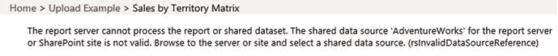
图 8-18.
错误消息

当您上传报表时，它不会自动链接到数据源。您可以按照以下步骤轻松更正：

1.  在路径中点击 `上传示例` 以离开错误消息页面。
2.  点击报表名称旁边的省略号，然后选择 `管理`。
3.  这将打开一个包含许多选项的页面。选择 `数据源`。您将看到一条关于数据源错误的消息。
4.  点击 `连接到` 下方的省略号，如图 8-19 所示。
    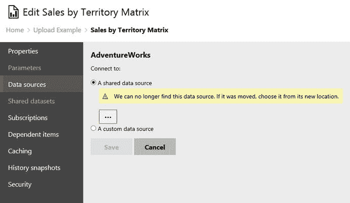
    图 8-19.
    数据源属性。
5.  这会在主文件夹中打开一个窗口。点击 `数据源`。
6.  选择 `AdventureWorks2016` 数据源，如图 8-20 所示。
    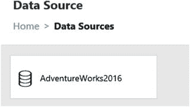
    图 8-20.
    数据源文件夹。
7.  您现在应该能看到正确映射的数据源，如图 8-21 所示。
    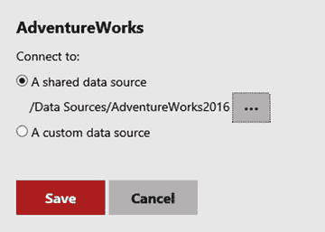
    图 8-21.
    修正后的数据源。
8.  点击 `保存`。
9.  导航回 `上传示例` 文件夹并尝试运行报表。现在它应该能按预期运行了。

显然，从 `SSDT` 部署更容易，但如果您确实需要上传单个报表，这些信息将会很有帮助。

## 创建数据源

`AdventureWorks2016` 数据源是在项目部署时自动创建的。您也可以通过 Web 门户手动创建数据源。请按照以下步骤创建数据源：

1.  启动 Web 门户。
2.  点击 `数据源` 文件夹。
3.  点击 `AdventureWorks2016` 旁边的省略号，然后点击 `管理` 以打开属性。
4.  选择 `连接字符串` 属性并将其复制到剪贴板，如图 8-22 所示。
    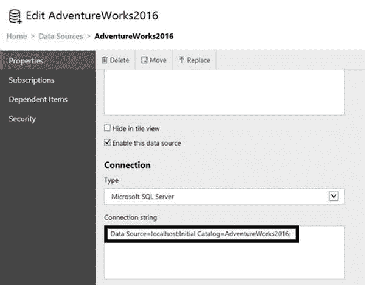
    图 8-22.
    连接字符串属性。
5.  向下滚动并点击 `取消` 以关闭属性。
6.  点击 `新建` ➤ `数据源` 以打开“新建数据源”页面。
7.  在名称中填写 `TestDataSource`。
8.  将之前复制的连接字符串粘贴到 `连接字符串` 属性中。
9.  向下滚动并点击 `测试连接`。
10. 点击 `创建`。
11. 您现在应该能在文件夹中看到这两个数据源。

虽然您可能不需要通过此界面创建许多数据源，但您将需要使用它来管理数据源。每当数据库迁移到新服务器时，您都需要在此处为报表进行更改。在第 9 章中，您将了解数据源属性的“凭据”部分。

## 部署报表部件

除了数据源、数据集和报表外，您还可以部署报表部件。报表部件是构成报表的对象，如图表、表格和仪表。已发布的报表部件随后可以与 `报表生成器` 工具一起使用，该工具将在第 10 章中介绍。

要在报表上发布对象，您必须将各个项标记为可发布。请按照以下步骤部署报表的部件：

1.  如果尚未打开，请启动 `SSDT` 以及来自第 7 章的项目。
2.  在解决方案资源管理器中，双击图表报表以在设计视图中打开它。
3.  如果“报表”菜单不可见，请单击报表的设计画布。
4.  选择 `报表` ➤ `发布报表部件`，这将打开一个对话框，显示可以发布的对象，如图 8-23 所示。
    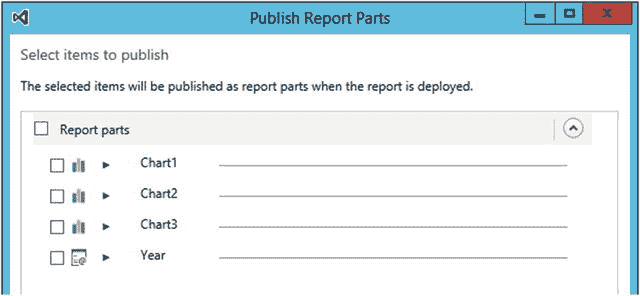
    图 8-23.
    “发布报表部件”对话框。
5.  勾选 `报表部件` 以选择每个项。
6.  点击第一个图表旁边的箭头。这允许您查看图表的图片并填写描述。
7.  每个项都有默认名称，这在 Web 门户中可能没有帮助。将每个名称更改为与图 8-24 匹配。
    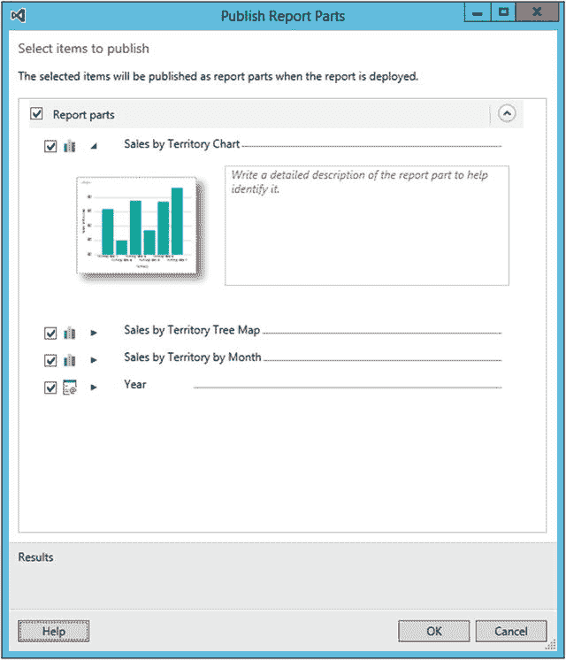
    图 8-24.
    每个图表的新名称。
8.  点击 `确定`。
9.  在解决方案资源管理器中，右键单击图表报表并部署它。
10. 打开 Web 门户。
11. 导航到主文件夹。
12. 您应该会看到一个新的 `报表部件` 文件夹。
13. 点击该文件夹以查看已发布的报表部件，如图 8-25 所示。您将在第 10 章中使用它们。
    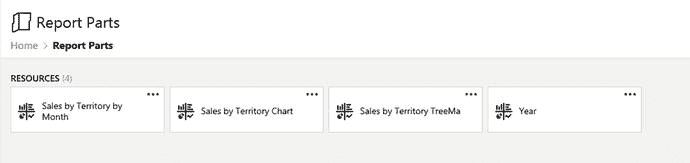
    图 8-25.
    报表部件文件夹。


