# 将报表部署到 SharePoint

在 SharePoint 模式下安装和配置 SSRS 超出了本书的范围。但我确实认为，如果您需要将报表部署到现有的 SharePoint 场，可以回到本章学习如何操作。就像本机模式 SSRS 一样，您可以通过上传或从 SSDT 发布来发布报表。本节假设您使用的是 SharePoint 2013 或更高版本，并且 SSRS 文档库已正确配置。

请按照以下步骤学习如何将 SSRS 报表上传到 SharePoint 报表库：

1.  启动 SharePoint 并导航到报表库。图 8-26 展示了一个典型的报表文件夹。
    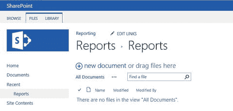
    图 8-26. SharePoint 报表文件夹
2.  单击 **文件**。
3.  单击 **上传文档**，如图 8-27 所示。
    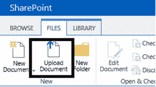
    图 8-27. “上传文档”图标
4.  在“添加文档”对话框中，单击 **浏览** 导航到 SSRS 报表 `rdl` 文件。
5.  单击 **确定**。
6.  在“报表”对话框中，将内容类型选择为 **报表生成器报表**，如图 8-28 所示。
    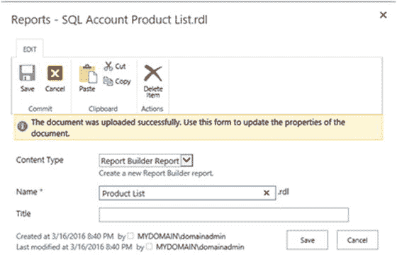
    图 8-28. “报表”对话框
7.  单击 **保存**。报表现在应该会显示在文件夹中。
8.  由于您上传了文件，因此需要配置数据源。单击报表名称旁边的省略号 (…)。
9.  这将打开一个菜单对话框；单击此对话框上的省略号 (…)。
10. 选择 **管理数据源**，如图 8-29 所示。
    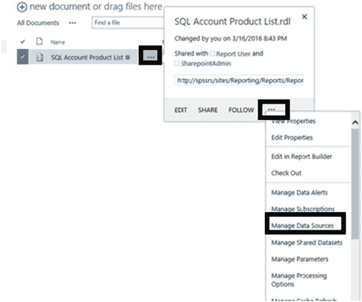
    图 8-29. 报表属性菜单
11. 在“管理数据源”页面上，单击数据源名称。
12. 在数据源的属性页上，单击省略号 (…)，如图 8-30 所示。
    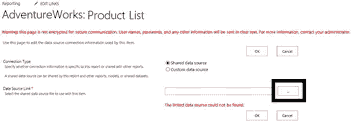
    图 8-30. 数据源属性
13. 在“选择项”对话框中，导航到正确的数据源，如图 8-31 所示。单击 **向上** 按钮进行导航。
    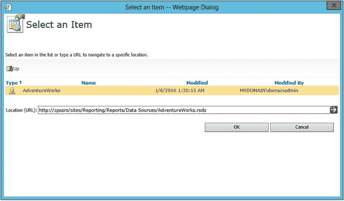
    图 8-31. “选择项”对话框
14. 单击 **确定** 以保存数据源名称并关闭对话框。
15. 在报表的数据源属性上单击 **确定** 以保存更改。
16. 导航到报表并测试它。

您也可以上传数据源文件 (`rds`) 或创建它们。要创建新数据源，请按照以下步骤操作：

1.  启动 SharePoint 并导航到“数据源”文件夹。
2.  单击 **文件** ➤ **新建文档**，如图 8-32 所示。
    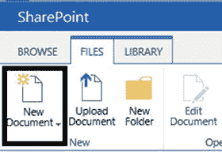
    图 8-32. “新建文档”图标
3.  选择 **报表数据源**，如图 8-33 所示。
    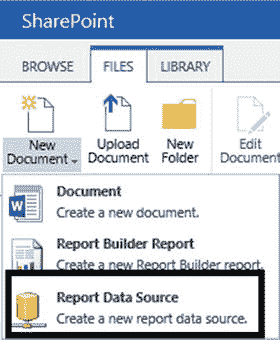
    图 8-33. “报表数据源”菜单项
4.  在“数据源属性”页面上填写属性，如图 8-34 所示。
    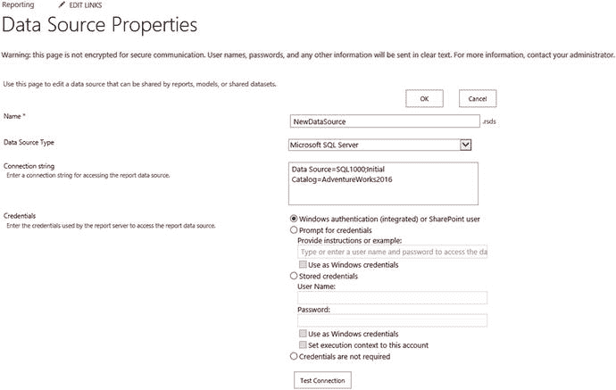
    图 8-34. 数据源属性
5.  单击 **确定** 以保存新数据源。

要从 SSDT 部署报表和其他对象，您需要在项目属性中为每种类型的项配置 SharePoint 库文件夹的确切路径。否则，该过程与部署到本机模式实例相同。图 8-35 展示了如何为我的 SharePoint 站点进行配置。
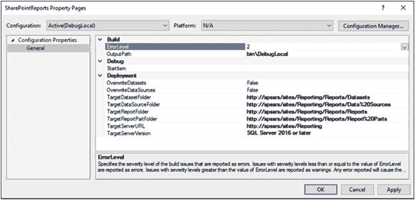
图 8-35. 部署到 SharePoint 时的属性

## 总结

除非 SSRS 报表发布到最终用户可以访问的地方，否则它们没有太大价值。在本章中，您认识了新的 Web 门户。您通过 SSDT 和上传的方式部署了报表。如果您安装了 SharePoint 模式的 SSRS 实例，您也看到了如何将报表部署到 SharePoint。

只要涉及数据，安全就至关重要。在第 9 章中，您将了解 SSRS 的安全方面。

## 9. 保护您的报表

几乎每周都有重大的数据泄露事件被报道。最先引起我注意的之一是 2012 年南卡罗来纳州纳税人数据库失窃事件。2015 年，黑客窃取了数百万美国联邦政府雇员的电子记录。报表开发人员可能不需要配置安全，但他或她应该能够理解 SQL Server Reporting Services (SSRS) 安全的工作原理，以便在管理员请求时提供协助。

部署 SSRS 报表时，需要考虑两层安全：数据源处的权限和 SSRS 内部的权限。在本章中，您将学习 SSRS 的安全特性以及 SSRS 如何与 SQL Server 安全交互。

## 理解 SQL Server 安全

即使允许最终用户运行报表，SQL Server 实例也可能不会返回请求的数据。数据源中的设置决定了发送到 SQL Server 的凭据。

**注意**

全面回顾 SQL Server 安全超出了本书的范围。报表的数据也可能来自许多其他来源，例如 Oracle 数据库和 Analysis Services 多维数据集。请查阅供应商文档以了解任何特定产品的安全性。

对于 SQL Server，将使用两种类型的帐户进行连接：Windows 登录名和在 SQL Server 实例内定义的登录名。这两种登录名都映射到在数据库内具有特定权限的数据库用户。SQL Server 的另一个功能称为 **包含数据库**，允许您直接在数据库中创建用户。图 9-1 说明了这些概念。
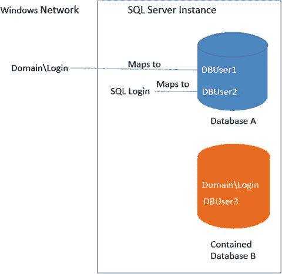
图 9-1. SQL Server 内的身份验证


### 设置 SQL 账户

默认情况下，SQL Server 仅接受 Windows 身份验证。可以在安装期间启用 SQL Server 身份验证，也可以在事后进行配置。要使用本章中的所有示例，必须启用 SQL Server 身份验证。如果你是在本地安装的 SQL Server 实例，你将能够修改身份验证属性。否则，你需要与数据库管理员合作，在你网络上的开发实例中配置安全性。要更改 SQL Server 的身份验证属性，请按照以下步骤操作：

1.  启动 `SQL Server Management Studio (SSMS)`。
2.  输入如图 9-2 所示的 SQL Server 名称属性和身份验证方法。如果不确定这些属性，请参阅第 1 章中的“确定 SQL Server 名称”部分。
    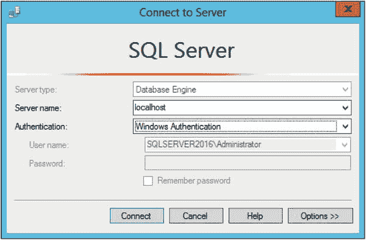
    图 9-2. 连接到服务器对话框
    **注意** 修改服务器身份验证属性需要重启 SQL Server。
3.  单击“连接”。
4.  在 SSMS 的“对象资源管理器”中，右键单击服务器名称并选择 `属性`。
5.  选择 `安全性` 页。
6.  如果 `服务器身份验证` 设置为 `Windows 身份验证模式`，请将其切换为 `SQL Server 和 Windows 身份验证模式`，如图 9-3 所示。
    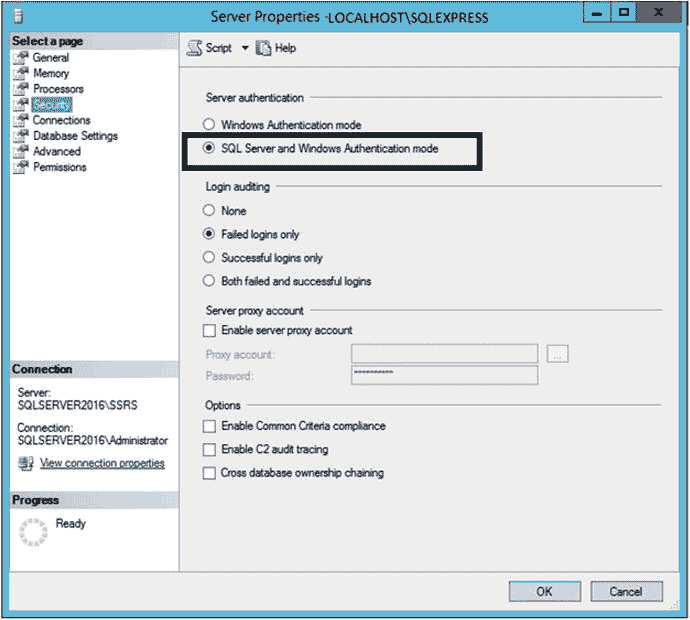
    图 9-3. SQL Server 和 Windows 身份验证模式
7.  单击“确定”接受更改。
8.  右键单击服务器名称并选择 `重启` 来重启 SQL Server。

现在 SQL Server 已配置为接受 SQL Server 身份验证，你需要创建一个登录名并授予其权限。按照以下步骤设置登录名：

1.  在“对象资源管理器”中，展开 `安全性`。
2.  右键单击 `登录名` 并选择 `新建登录名`。
3.  这将打开 `登录名 - 新建` 对话框。
4.  在 `登录名` 中填写 `SQLReportUser`。
5.  选择 `SQL Server 身份验证`。
6.  输入并确认一个你能记住的密码。
7.  由于这只是一个示例，请取消选中 `强制实施密码策略`，如图 9-4 所示。
    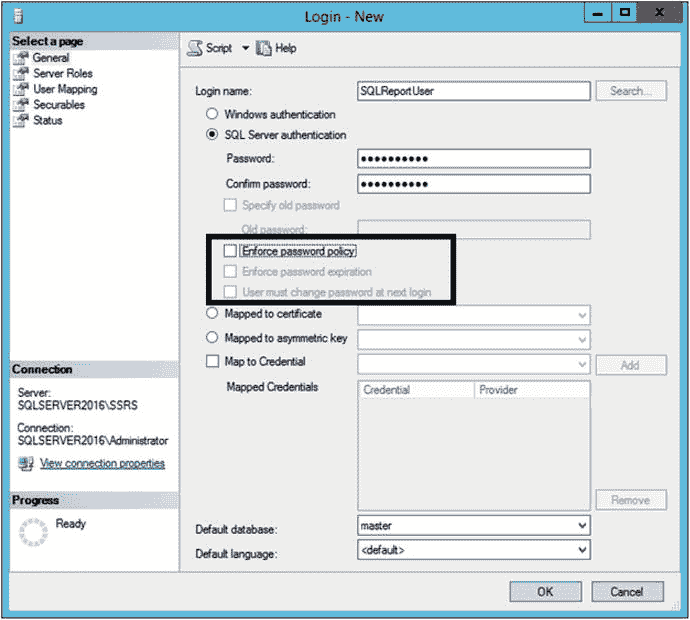
    图 9-4. `SQLReportUser` 账户属性
8.  单击“确定”创建账户。
9.  右键单击该账户并选择 `属性`。
10. 切换到 `用户映射` 页。
11. 在 `AdventureWorks2016` 旁边打勾，如图 9-5 所示。
    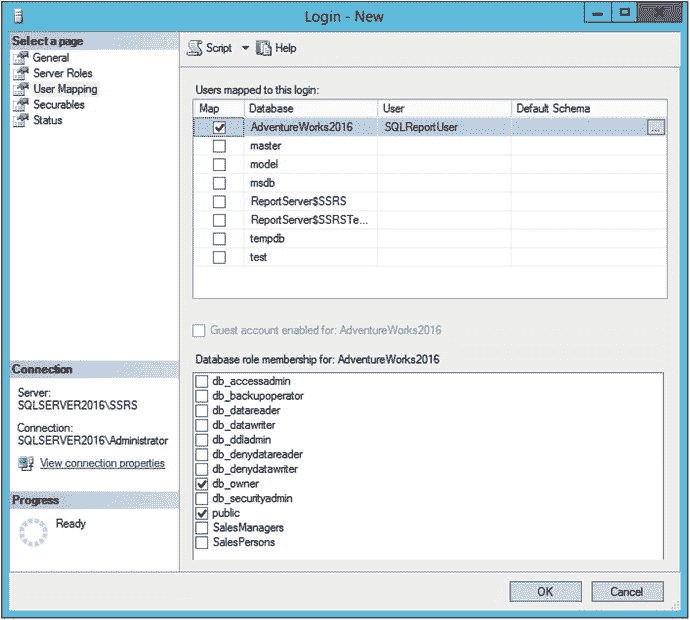
    图 9-5. 用户映射页面
12. 勾选 `db_owner` 角色。在生产数据库中，只授予所需的权限。我注意到在 AdventureWorks 中，有时新用户会自动选中 `db_owner`，但这不会持久生效。如果需要，请返回查看属性并重新设置。
13. 单击“确定”保存权限。

### 连接到 SQL Server

在第 3 章中，你学习了如何创建数据源，并且很可能使用了你的 Windows 凭据来连接 SQL Server。在本节中，你将创建一个使用 SQL Server 账户的新数据源。按照以下步骤在项目中创建一个接受 SQL Server 凭据的新数据源：

1.  启动 `SQL Server Data Tools (SSDT)` 并打开第 6 章的解决方案。
2.  右键单击 `共享数据源` 并选择 `添加新数据源`。
3.  在“常规”页上，将 `名称` 属性设置为 `AdventureWorks2016SQL`，如图 9-6 所示。
    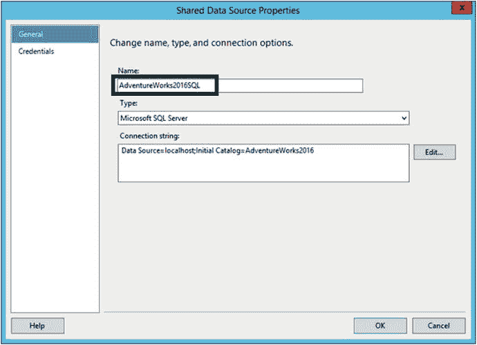
    图 9-6. 名称属性
4.  如你在本书中一直所做的那样，单击 `编辑` 按钮来设置 `连接字符串` 属性。
5.  在 `凭据` 页上，选择 `使用此用户名和密码`。
6.  输入你先前创建的账户的 `用户名` 和 `密码`。“凭据”页应如图 9-7 所示。
    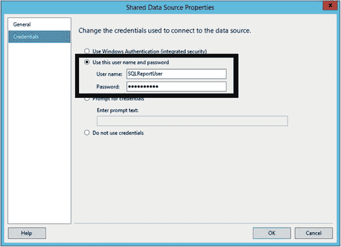
    图 9-7. 新凭据
7.  单击“确定”保存更改。
8.  双击 `按区域销售矩阵` 报表以在设计视图中打开它。
9.  在 `报表数据` 窗口中，打开 `AdventureWorks` 数据源的属性。
10. 在 `常规` 页上，为 `使用共享数据源引用` 属性选择 `AdventureWorks2016SQL`，如图 9-8 所示。
    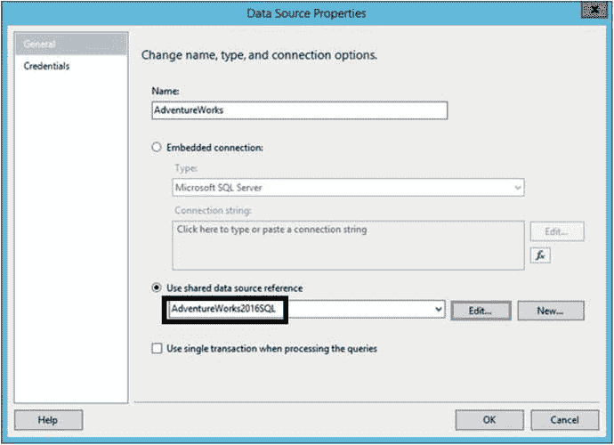
    图 9-8. 新的共享数据源引用
11. 单击“确定”保存更改。
12. 预览报表以确保其正常工作。

现在报表已配置为使用 SQL Server 账户检索数据。当项目部署后，最终用户将使用其 Windows 账户连接到 Web 门户。然后，SSRS 将使用存储在数据源属性中的账户凭据连接到 SQL Server。按照以下步骤部署项目并在 Web 门户中查看新数据源：

1.  在“解决方案资源管理器”中，右键单击项目名称并选择 `属性`。
2.  将 `TargetServerURL` 设置为你的 Web 服务 URL（统一资源定位符），如果尚未设置的话。如果不确定如何操作，请参阅第 8 章中的“从 SSDT 部署报表”部分。
3.  单击“确定”保存更改。
4.  右键单击项目名称并选择 `部署`。
5.  如果部署成功，请启动 Web 门户。如果需要帮助，请参阅第 8 章中的“从 SSDT 部署报表”部分。
6.  单击 `数据源` 文件夹。
7.  单击 `AdventureWorks2016SQL` 数据源旁边的省略号，并选择 `管理`。
8.  这将打开数据源的属性。向下滚动到 `凭据` 部分并查看属性。请注意，你也可以指定一个硬编码的 Windows 账户。图 9-9 显示了“凭据”部分。
    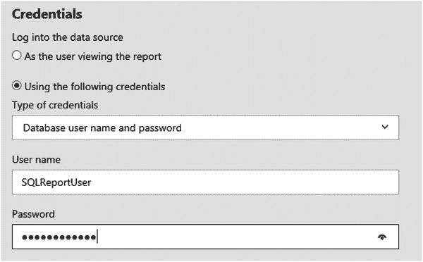
    图 9-9. 数据源凭据

你可能想知道为什么不能总是指定 `作为查看报表的用户`。在某些情况下，这是不可能的。以下是在数据源中保存硬编码凭据的一些可能原因：

*   最终用户或设备可能不属于 Windows 域。
*   最终用户可能未被允许在数据库中拥有直接权限。
*   订阅功能需要硬编码的凭据。
*   数据库服务器可能与 SSRS 不在同一台服务器上。

**注意** 必须配置 `Kerberos` 委派才能在服务器之间转发凭据。这是一个高级安全主题，超出了本书的范围。要了解有关 `Kerberos` 委派的更多信息，请参见 Pluralsight 课程“为 SSRS 配置 Kerberos”。


## 配置站点安全

SSRS 安全性基于角色。角色具有某些预定义的权限。将帐户或组添加到角色即可让该帐户或组拥有该角色所定义的权限。安全性的某些方面可以在站点级别配置，而其他方面则基于位置或对象。在本节中，你将了解站点安全性。

注意

对于这些示例，我将使用在独立 Windows Server 2012 R2 上创建的几个 Windows 帐户。在你的环境中，你可能在域内运行，或者在运行多种最终用户版本 Windows 的独立笔记本电脑上运行。由于存在多种可能的变化，我不会逐步指导你创建这些帐户。

我已经创建了一个信息技术（IT）组，并将以下本地 Windows 帐户添加到我的服务器上的该组中：
- `CIO`
- `Director`
- `Manager`
- `TeamLeader`
- `TeamMember`

在 Web 门户的站点级别，有两个可能的角色：`System Administrator`（系统管理员）和 `System User`（系统用户）。任何属于 `System Administrator` 角色的帐户或组成员都拥有对站点的完全控制权，包括控制安全性。对于将要使用 `Report Builder`（报表生成器）的任何人，`System User` 属性都很重要，你将在第 10 章中了解相关内容。要将帐户添加到站点级别的角色，请按照以下步骤操作：
1.  启动 Web 门户。
2.  单击齿轮图标并选择 `Site Settings`（站点设置），如图 9-10 所示。
    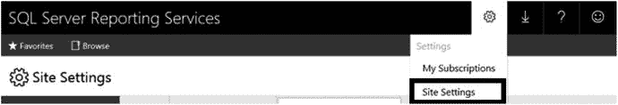
    图 9-10. 选择 `Site settings`（站点设置）
3.  这将打开站点属性。单击 `Security`（安全性）。
4.  单击 `Add group or user`（添加组或用户），如图 9-11 所示。
    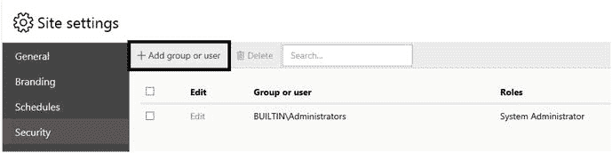
    图 9-11. 单击 `Add group or user`（添加组或用户）
5.  对于 `Group or user`（组或用户），输入 `CIO`。
6.  选择 `System Administrator`（系统管理员），如图 9-12 所示。
    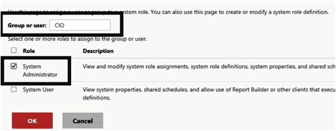
    图 9-12. 添加帐户
7.  单击 `OK`（确定）以创建角色成员身份。
8.  重复该过程，将 `Manager` 帐户添加到 `System User`（系统用户）角色。

你还可以在此页面上从站点级别的角色中移除帐户。

## 配置文件夹和报表安全性

在公司中发布第一份报表之前，你应该规划 Web 门户内的文件夹结构，以简化安全管理。最终用户只能查看他们有权查看的那些文件夹和报表。作为最佳实践，仅在文件夹级别配置安全性。安全性可以在单个报表上配置，但这会使长期管理变得非常困难。

要访问特定文件夹，最终用户应拥有其上层文件夹的权限。默认情况下，文件夹从父文件夹继承权限，报表从其所在文件夹继承权限。随着路径向下延伸，权限应设置为限制性更强。例如，你可能希望在 `Home`（主文件夹）级别授予域中每个人的权限。然后在 `Home` 下为每个部门创建文件夹。在每个部门文件夹内，为经理创建文件夹。

在文件夹和对象级别定义了几种角色。表 9-1 列出了 `Security`（安全性）页面上显示的角色和定义。

表 9-1. 文件夹和对象级别的角色
| 角色 | 用途 |
| --- | --- |
| `Browser`（浏览器用户） | 可以查看文件夹和报表，并订阅报表。 |
| `Content Manager`（内容经理） | 可以管理报表服务器中的内容。包括文件夹、报表和资源。 |
| `My Reports`（我的报表） | 可以发布报表和链接报表；管理用户 `My Reports`（我的报表）文件夹中的文件夹、报表和资源。 |
| `Publisher`（发布者） | 可以向报表服务器发布报表和链接报表。 |
| `Report Builder`（报表生成器） | 可以查看报表定义。 |

按照以下步骤为 IT 部门创建和配置文件夹：
1.  在 Web 门户中，导航到 `Home`（主文件夹）。如果你在 `Site Settings`（站点设置）中，请单击页面顶部的 `SQL Server Reporting Services`。
2.  单击 `Manage Folder`（管理文件夹），如图 9-13 所示。
    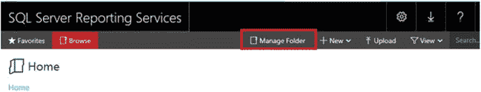
    图 9-13. `Manage Folder`（管理文件夹）图标
3.  这将打开 `Home`（主文件夹）的 `Security`（安全性）页面。单击 `New Role Assignment`（新建角色分配）。
4.  输入 `Users`（用户）。对于域环境，这将是 `Everyone`（所有人）组。
5.  勾选 `Browser`（浏览器用户），如图 9-14 所示。这将授予所有用户在站点中运行任何报表的权限，除非文件夹中的安全性已被覆盖。
    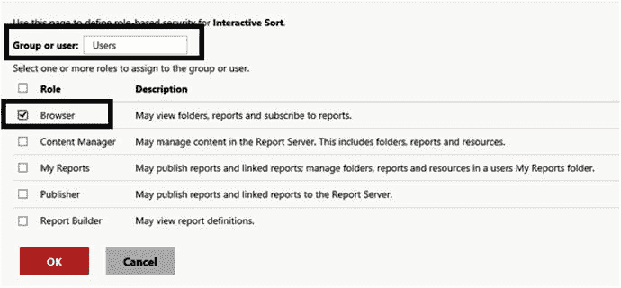
    图 9-14. 将 `Users`（用户）添加到 `Browser`（浏览器用户）角色
6.  单击 `OK`（确定）保存更改。
7.  单击 `Home`（主页）链接导航回文件夹视图。
8.  单击 `New Folder`（新建文件夹）。
9.  在名称中填写 `IT`，然后单击 `Create`（创建）。
10. 单击新 `IT` 文件夹旁边的省略号，然后选择 `Manage`（管理）。
11. 这将打开文件夹属性。单击 `Security`（安全性）。
12. 单击 `Customize security`（自定义安全性），如图 9-15 所示。
    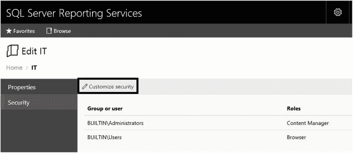
    图 9-15. 文件夹的安全性页面
13. 这会显示一个关于中断从父项继承权限的警告，如图 9-16 所示。单击 `OK`（确定）。
    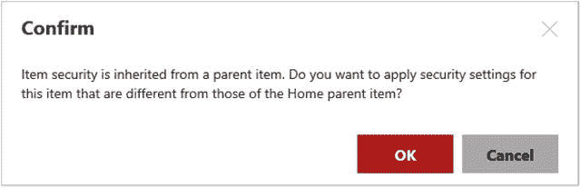
    图 9-16. 确认安全性将不同
14. 单击 `Add group or user`（添加组或用户）。
15. 将 `IT` 组以 `Browser`（浏览器用户）角色添加到该文件夹，然后单击 `OK`（确定）。
16. 勾选 `Builtin\Users`（内置\用户）旁边的框。如果你在域环境中工作，请移除 `Everyone`（所有人）组。
17. 单击 `Delete`（删除），然后单击 `OK`（确定）进行确认。
18. 导航回 `Home`（主文件夹）。

现在你有了一个只能由 `IT` 组成员查看的文件夹。根据表 9-2，继续使用前面步骤中学到的技能添加文件夹并修改权限，以设置站点的安全性。

表 9-2. 站点的安全性配置
| 文件夹 | 帐户或组 | 角色成员身份 |
| --- | --- | --- |
| `Home/IT` | `IT` | `Browser`（浏览器用户） |
| `Home/IT` | `Manager` | `Content Manager`（内容经理） |
| `Home/IT` | `Manager` | `Report Builder`（报表生成器） |
| `Home/IT/Management` | `CIO`, `Director` | `Browser`（浏览器用户） |
| `Home/IT/Management` | `Manager` | `Content Manager`（内容经理） |
| `Home/IT/Management` | `Manager` | `Report Builder`（报表生成器） |
| `Home/IT/Management/Confidential` | `CIO` | `Content Manager`（内容经理） |

显然，这是一个简化的例子，但它应该说明了应如何配置安全性。图 9-17 演示了随着路径向下延伸，帐户数量如何减少。
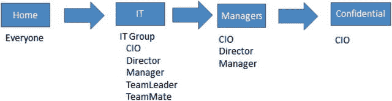
图 9-17. 文件夹权限

要进行测试，以任何帐户运行浏览器，确保该帐户只能看到预期的文件夹。图 9-18 显示了 `Director` 和 `TeamLeader` 在查看 `IT` 文件夹时所看到的差异。
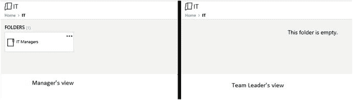
图 9-18. `Manager` 和 `TeamLeader` 的文件夹视图

此时，`Manager` 帐户已控制大多数文件夹的内容，并拥有使用 `Report Builder`（报表生成器）的权限。你将在第 10 章中看到 `Report Builder`（报表生成器）的实际应用。


## 使用订阅自动发送报表

SQL Server Reporting Services (SSRS) 最实用的功能之一就是可以调度报表自动运行并通过订阅发送。报表可以通过电子邮件发送，也可以传送到网络共享文件夹。通过电子邮件发送时，报表可以直接嵌入邮件正文，也可以发送一个链接。

> **注意**
>
> 订阅功能需要 SQL Server Standard Edition 或更高版本支持。

由于订阅传递不涉及人工操作，因此为特定报表创建订阅必须满足两个条件：报表使用的所有数据源必须包含硬编码的凭据；必须在订阅中确定并配置默认参数。

在早期版本的 SSRS 中，需要通过域内的 SMTP（简单邮件传输协议）服务器来发送邮件报表。从 SSRS 2016 开始，现在可以使用域外的电子邮件服务器（如 Gmail）来发送报表。要将报表发送到网络共享，必须先创建该共享文件夹。需要有 Windows 账户拥有在该共享中创建报表的权限，并且最终用户必须有打开文件的权限。对于两种类型的订阅，托管 ReportServer 数据库的服务器上还必须运行 `SQL Server Agent`。

要通过电子邮件发送报表，必须先配置 SMTP 账户设置。选择“电子邮件设置”页面来填写 SMTP 属性。有关如何配置多种服务设置的信息，请参阅 Reporting Services 团队博客，网址为：[`https://blogs.msdn.microsoft.com/sqlrsteamblog/2016/07/15/deliver-reports-via-emailusing-an-email-server-outside-your-network/`](https://blogs.msdn.microsoft.com/sqlrsteamblog/2016/07/15/deliver-reports-via-emailusing-an-email-server-outside-your-network/)。

将报表传送到网络共享的设置比通过电子邮件配置要简单得多。本节示例将涵盖如何将报表传送到共享文件夹。当你配置订阅将报表传送到共享时，你需要指定一个拥有创建文件权限的“文件共享账户”。你可以为整个 SSRS 实例设置一个账户，也可以为单个订阅指定一个账户。图 9-19 显示了可用于传递到网络共享订阅的“文件共享账户”的属性。

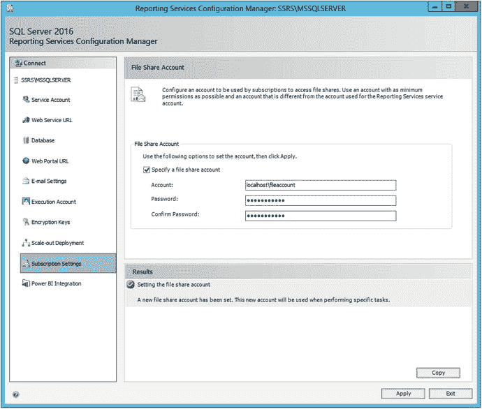

图 9-19. 文件共享账户属性

你还需要创建将用来存放报表的共享文件夹。要配置网络共享，请按照以下步骤操作：

1.  导航到你计算机上的 `C:\` 驱动器或其他驱动器。
2.  创建一个名为 `Reports` 的新文件夹。
3.  右键单击该文件夹并选择“属性”。
4.  选择“共享”选项卡。
5.  单击“共享”，这将打开“文件共享”对话框。
6.  添加共享所需的账户和权限，如图 9-20 所示。

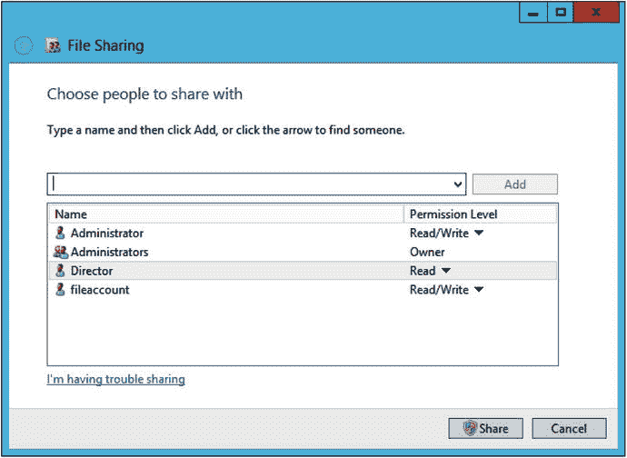

图 9-20. “文件共享”对话框
7.  单击“共享”、“完成”和“关闭”以创建共享并关闭对话框。

一旦网络共享创建完毕，启动 `SSMS` 并确保 `SQL Server Agent` 正在运行。`SQL Server Agent` 是为 `SQL Server` 运行计划作业的服务。就 `SQL Server` 而言，`SSRS` 订阅只不过是一种作业类型。

现在基础设施已经就绪，你可以创建订阅了。请按照以下步骤配置订阅：

1.  在 Web 门户中，导航到 `Dynamic Reports` 文件夹。
2.  `Sales by Territory Matrix` 报表应该连接到使用存储凭据的 `AdventureWorks2016SQL` 数据源。如果不是，请重新配置数据源。
3.  测试 `Sales by Territory Matrix` 报表。
4.  导航回 `Dynamic Reports` 文件夹。
5.  单击 `Sales by Territory Matrix` 旁边的省略号（...），然后选择“管理”。
6.  单击“订阅”。
7.  单击“新建订阅”。
8.  在“订阅”属性页上，在“描述”属性中输入 `Sales by Territory`。
9.  “所有者”属性应自动默认为你的账户。
10. 对于此示例，接受默认计划。对于生产订阅，务必创建一个计划。图 9-21 显示了到目前为止的属性。

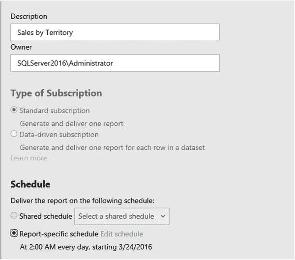

图 9-21. 订阅属性
11. 向下滚动到“目标”属性并选择“Windows 文件共享”。
12. 键入网络共享的路径。
13. 为“呈现格式”选择 `PDF`。
14. 如果你想覆盖“文件共享账户”，请选择“使用以下 Windows 用户凭据”。填写特定账户的“用户名”和“密码”。
15. 根据你的要求修改“覆盖选项”。这部分属性应类似于图 9-22。

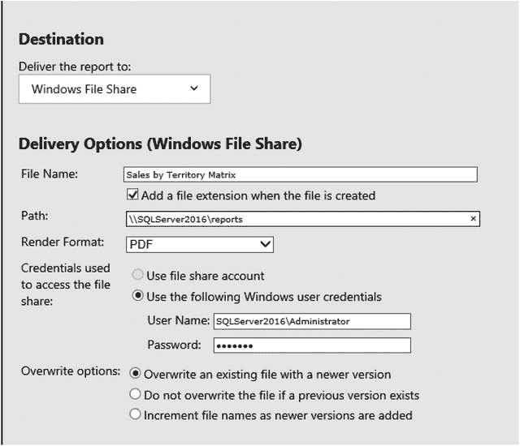

图 9-22. 订阅的传递选项
16. 向下滚动到“报表参数”部分。
17. 为 `Year` 参数选择一个值。
18. 设置好 `Year` 值后，`Territory` 的值将会填充。选择一个区域。参数属性应类似于图 9-23。

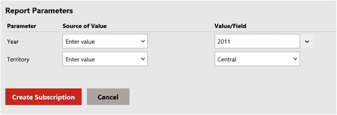

图 9-23. 订阅的报表参数
19. 单击“创建订阅”。
20. 订阅现在应该显示在列表中，如图 9-24 所示。

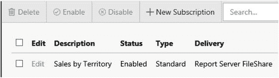

图 9-24. 新订阅

每个订阅都会创建一个 `SQL Server Agent` 作业。不幸的是，作业的名称是一个全局唯一标识符（GUID），你无法通过查看来分辨哪个作业对应哪个订阅。要弄清楚哪个订阅映射到哪个作业，你需要在你的 `ReportServer` 数据库中运行类似下面的查询：

```sql
SELECT Name AS ReportName, ScheduleID AS JobName, s.[Description]
FROM [Catalog] c
JOIN Subscriptions s ON c.ItemID = s.Report_OID
JOIN ReportSchedule rs ON c.ItemID = rs.ReportID
AND rs.SubscriptionID = s.SubscriptionID;
```

图 9-25 显示了该查询的结果。

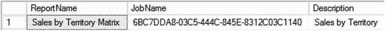

图 9-25. 报表名称映射到作业名称

要测试订阅，运行该作业。作业一旦启动订阅就会报告成功。即使报表没有传递成功，它也会报告成功。你可以通过检查共享文件夹中是否有报表，或者刷新“订阅”页面查看状态来确认结果。

在早期版本的 SSRS 中，你必须导航到每个文件夹和报表才能找到和管理订阅。Web 门户有一个名为“我的订阅”的新功能。单击菜单中的齿轮图标，你会看到一个指向“我的订阅”的链接。在这里，你可以看到你所用账户拥有的订阅列表及其位置。你还可以启用、禁用或删除你的订阅。图 9-26 显示了该链接和列表。

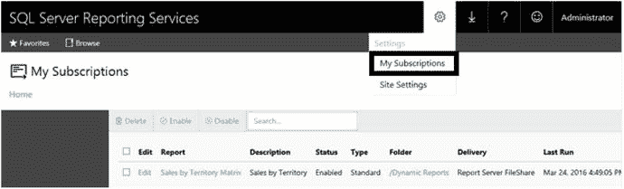

图 9-26. 新的“我的订阅”功能


## 确保交付安全

默认情况下，报表数据在网络上以未加密方式传输。在您的环境中，这可能构成安全风险。您可以配置 `SSRS` 使用安全套接层 (`SSL`) 协议。这是您在进行网上购物或访问银行网站时看到的、用于建立安全连接的网络协议。要正确配置 `SSL`，您需要从受信任的证书颁发机构购买证书。

获取证书并将其安装在服务器上后，可以通过启动 `Reporting Service Configuration Manager` 来进行配置。在 `Web Portal URL` 页面上，点击 `Advanced`。通过点击 `Advanced Multiple Web Site Configuration` 对话框底部的 `Add`，可以将 `SSL` 证书绑定到 `SSRS`。图 9-27 显示了您将用于配置 `SSL` 的对话框。

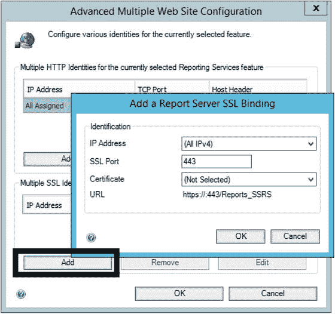

图 9-27. 用于配置 `SSL` 的对话框

## 总结

保护您的报表安全非常重要，但如果您在开始发布报表之前没有制定策略，可能会变得非常复杂且难以管理。请务必规划好文件夹的布局，并且切勿直接在报表上配置安全设置，只应在文件夹上进行配置。

安全配置在两个层面进行：数据源层面和 `SSRS` 层面。预定义的服务器和文件夹角色使安全管理更加简单。您还可以通过订阅配置报表自动交付。

第 10 章将介绍如何直接使用 `Report Builder` 通过 `web portal` 创建报表。同时也会涵盖 2016 版新增的两种报表类型：`KPIs` 和 `Mobile Reports`。

