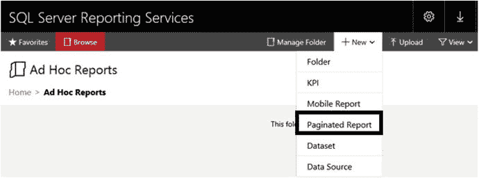
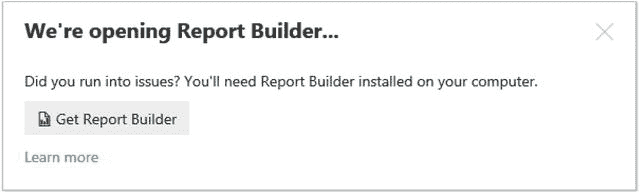
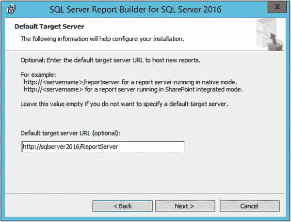
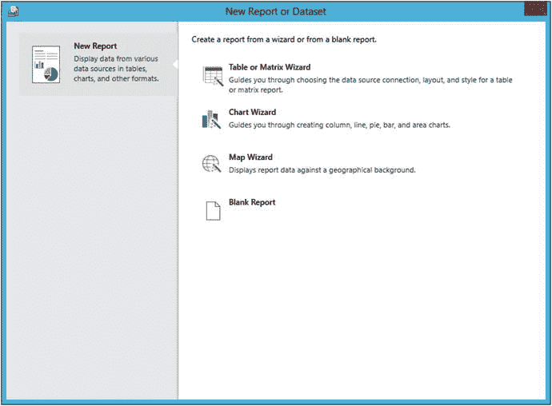
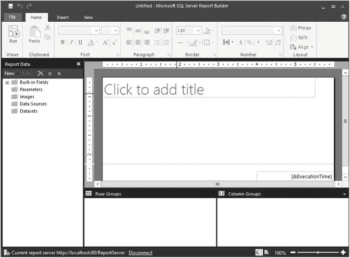

# 10. 创建自助式和移动报表

不久前，我和我四岁的孙女以及即将满两岁的孙子在桌边玩游戏。当我的智能手机在够不着的地方发出收到几条短信的提示音时，我的孙子抓起设备递给我，一边说：“你的电话！你的电话！”当我让他看手机上的照片时，他立刻开始滑动屏幕。我知道他是在模仿周围大人的行为，但今天的孩子们从出生起就接触科技了。

过去几年世界变化如此之大。我们要求能够立即从任何所在位置访问我们的数据。当我们持续连接到社交媒体和工作岗位时，工作和娱乐常常交融在一起。无论好坏，这都是新的现实。

在本书中，您一直使用 `Visual Studio` 内的 `SQL Server Data Tools (SSDT)` 来创建报表。`Visual Studio` 是一款开发工具，但终端用户常常希望创建自己的报表和仪表板。他们也要求在公司内网之外使用平板电脑和手机时能跟上数据更新。在本章中，您将学习如何使用终端用户工具 `Report Builder` 创建报表。您还将创建 `mobile reports` 和 `key performance indicators (KPIs)`，这是 `SQL Server 2016` 的 `Enterprise` 和 `Developer Editions` 中提供的两个新功能。

## 使用 Report Builder

自首次随 `SQL Server 2005` 发布以来，`Report Builder` 已经历了数次迭代。当前版本利用已发布的数据集和报表部件，使得构建报表比在 `SSDT` 中容易得多。不过，也可以从头开始构建报表，其方式与使用 `SSDT` 非常相似。`Report Builder` 还包含 `SSDT` 中没有的附加向导。本书中您学到的功能仍然存在，例如属性页和表达式。表 10-1 列出了 `SSDT` 和 `Report Builder` 之间的区别。

表 10-1. `SSDT` 和 `Report Builder` 之间的区别

| 功能 | SSDT | Report Builder |
| --- | --- | --- |
| 目标受众 | 报表开发人员 | 高级用户 |
| 外观和感觉 | Visual Studio | Microsoft Office |
| 组织方式 | 基于项目 | 单个报表 |
| 部署方式 | 部署或上传 | 保存 |
| 报表部件 | 部署报表部件 | 使用和部署报表部件 |

组织中希望创建自己报表的高级用户和其他人将受益于可使用的预构建报表部件、参数列表和数据集。这仍然会给报表开发人员带来工作，但有助于确保高级用户无需成为专业的 `T-SQL` 程序员或完全理解源数据库，就能高效使用 `Report Builder`。

第 8 章描述了如何部署报表，包括报表部件。如果您没有跟随第 8 章的操作，请返回并完成“从 `SSDT` 部署报表”和“部署报表部件”小节中的步骤。要开始使用 `Report Builder`，请按照以下步骤操作：

1.  启动 `web portal`。
2.  通过从菜单中选择 `New` ➤ `Folder` 创建一个新文件夹。
3.  输入 `Ad Hoc Reports` 作为名称，然后单击 `Create`。
4.  创建文件夹后，单击它以导航进入其中。
5.  单击 `New` ➤ `Paginated Report`，如图 10-1 所示。

图 10-1. 创建新的分页报表
6.  您可能会看到一条消息，询问是否允许浏览器启动应用程序。单击 `Allow`。
7.  如果这是您第一次启动 `Report Builder`，您将看到一条消息，提示您下载并安装它，如图 10-2 所示。

图 10-2. 安装 `Report Builder` 的链接
8.  `Get Report Builder` 链接将带您到 `Microsoft.com` 上的一个页面，您可以在那里下载该应用程序。请按照页面上的说明操作。即使在安装了 `Report Builder` 后，我仍然会看到该消息，但我只是将其关闭。
9.  运行安装向导时，系统将提示您输入目标服务器 `URL`（统一资源定位符）。输入您在第 8 章“从 `SSDT` 部署报表”小节中确定的 `web service URL`。图 10-3 显示了一个示例 `URL`。

图 10-3. `Default Target Server` 属性
10.  安装后，您可能需要再次从菜单中选择 `New` ➤ `Paginated Report` 才能实际启动 `Report Builder` 工具。
11.  同意可能出现的任何警告。
12.  `Report Builder` 启动后，您将看到 `New Report or Dataset` 对话框，如图 10-4 所示。

图 10-4. `New Report or Dataset` 对话框
13.  选择 `Blank Report`。
14.  您将看到报表设计区域，如图 10-5 所示。

图 10-5. 报表设计区域

