# Report Builder 使用指南

## 界面概览

你会注意到设计区域与你在 SSDT 中开发报表时看到的设计区域非常相似。不过，其菜单风格更类似于 Microsoft Office 中的功能区菜单。这里没有工具箱；你需要从如图 10-6 所示的“插入”功能区中添加控件。

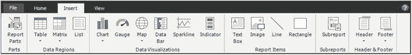
*图 10-6. 插入功能区*

如图 10-7 所示的“视图”功能区用于切换应用程序中窗口的可见性。

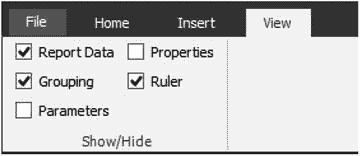
*图 10-7. 视图功能区*

## 构建报表与使用报表部件

你可以运用本书中学到的技能来构建报表，也可以使用 Report Builder 附带的各种向导。在本节中，你将学习一项在 SSDT 中无法完成的操作：将现有的报表部件整合到报表中。要使用报表部件，你必须连接到正在运行的 SQL Server Reporting Services (`SSRS`) 实例。请遵循以下步骤：

1.  在“插入”功能区上，点击“报表部件”。
2.  这将打开右侧的“报表部件库”窗口，如图 10-8 所示。

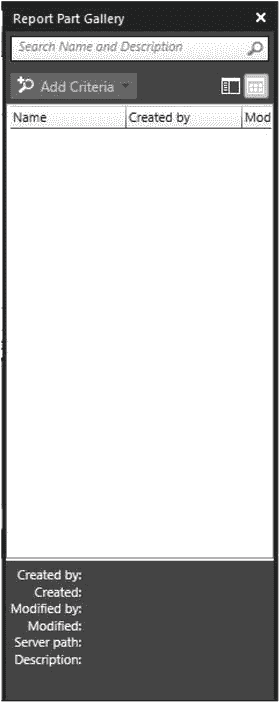
*图 10-8. 报表部件库*

3.  默认情况下，你根据名称搜索报表部件。你可以通过选择“添加条件”并选择一个项目来搜索更多条件，如图 10-9 所示。选择“类型”。

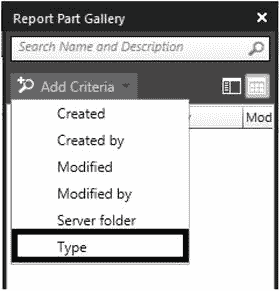
*图 10-9. 添加条件菜单*

4.  这将导致“类型”菜单显示，如图 10-10 所示。选择“图表”。

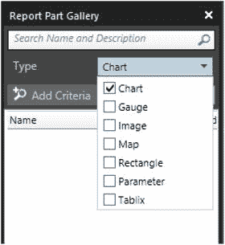
*图 10-10. 类型菜单*

5.  你可以在“搜索名称和描述”框中键入名称，但如果只点击放大镜图标，所有图表项目都会显示，如图 10-11 所示。只要发布的部件不多，这没问题。

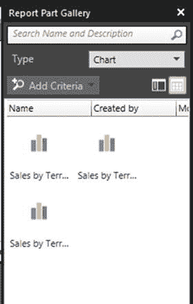
*图 10-11. 报表部件搜索结果*

6.  要移除“类型”条件，点击“类型”标签并选择“移除”，如图 10-12 所示。

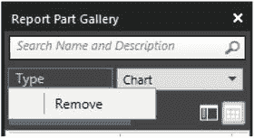
*图 10-12. 移除一个条件*

7.  将一个或多个图表拖放到报表上。你会看到报表数据对象被自动创建，如图 10-13 所示。

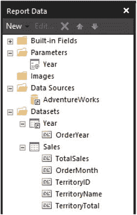
*图 10-13. 报表数据窗口*

8.  要在 Report Builder 内查看报表，点击“主页”功能区上的“运行”图标，如图 10-14 所示。

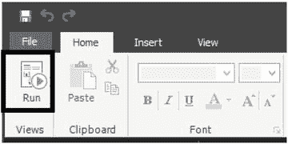
*图 10-14. 运行图标*

9.  要返回设计视图，点击“运行”功能区中的“设计”图标，如图 10-15 所示。

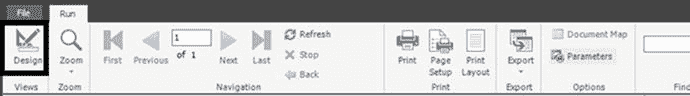
*图 10-15. 设计图标*

## 保存与发布报表

一旦报表完成，你可以将其保存到文件系统或发布。请按照以下步骤发布报表：

1.  从“文件”菜单中，点击“保存”。这将打开一个类似于文件保存对话框的窗口，如图 10-16 所示。

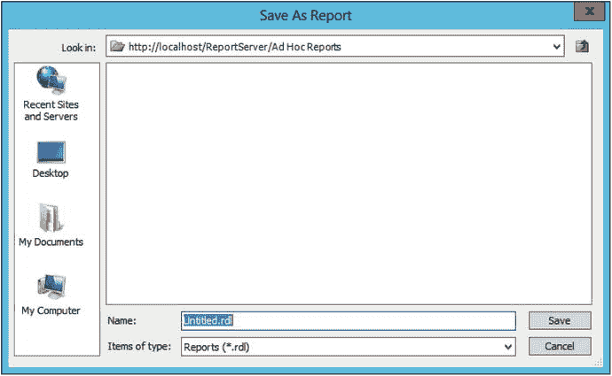
*图 10-16. 另存为报表对话框*

2.  为你的报表键入一个名称，然后点击“保存”。默认情况下，它保存在你启动 Report Builder 的文件夹中。你也可以根据需要导航到其他文件夹。

从图 10-16 所示的对话框中，你也可以将报表定义本地保存。如图 10-17 所示的“文件”菜单可以让你如预期般从各种位置保存和打开报表。你还可以发布你创建的报表部件。“检查更新”项会更新你的报表所使用的报表部件，以防原始发布的报表部件已被更改。

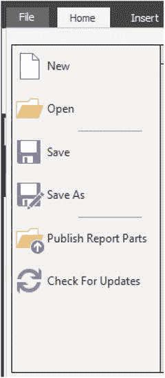
*图 10-17. 文件菜单*

## 其他功能与注意事项

在 Web 门户中，通过报表上的“管理”菜单，你可以启动 Report Builder 进行编辑，如图 10-18 所示。你也可以创建 Report Builder 的快捷方式或将其固定到任务栏。

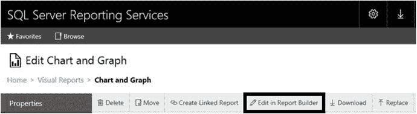
*图 10-18. 在 Report Builder 中编辑图标*

Report Builder 可用于创建数据集以及报表。在本章后续部分，你将使用 Report Builder 创建几个数据集。

Report Builder 是一个极好的工具。事实上，一些公司完全使用它来进行报表开发。我看到的唯一缺点是它没有与源代码控制软件集成。你可以使用源代码控制，但这将是一个手动过程。

要赋予高级用户使用 Report Builder 和发布报表的能力，请确保他们位于站点范围的“系统用户”组中，并且在任何允许他们创建报表的文件夹中具有“浏览器”、“发布者”和“Report Builder”角色。


## 创建 KPI

在 SSRS 的早期版本中，您已经能够向报表添加 KPI 或关键绩效指标。从 2008 R2 版本开始，您可以将 `Indicator` 控件添加到 `Tablix` 单元格中。在此之前，您可以通过使用表达式来动态控制单元格颜色或显示图像以实现相同目的，但这需要做更多工作。SSRS 2016 让您能够在 `web portal` 中创建和显示独立的 KPI。这些 KPI 可以一目了然地提供有关目标和重要指标的即时信息，而无需运行报表。它们依赖于已就位的 `shared datasets`。

KPI 可以非常简单，也可以相当复杂，这取决于您定义的属性。您可以仅显示一个数字，将值与目标进行比较，显示状态，显示趋势，或显示这些的某种组合。

### 创建 KPI 数据集

请按照以下步骤创建将用于 KPI 的数据集：

1.  在 `web portal` 中，导航到 `Datasets` 文件夹。
2.  点击 `New` ➤ `Dataset`，这将启动 `Report Builder`。如果您看到关于运行程序的警告，请点击 `Allow`。`Report Builder` 将打开，准备创建数据集。
3.  在 `Choose a data source connection or model to create a shared dataset` 页面上，如果 `AdventureWorks2016` 数据源在对话框中可见，请选择它。
4.  如果您没有看到所需的数据源，请点击 `Browse other data sources` 并导航到 `Data Sources` 文件夹以找到它，如图 10-19 所示。

    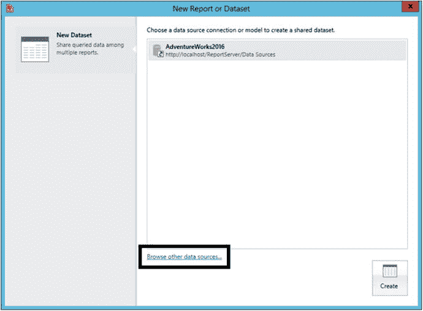

    *图 10-19. 选择或定位数据源*

5.  点击 `Create`。
6.  这将打开 `Query Designer`，您可以通过选择表和列来构建查询，如图 10-20 所示。

    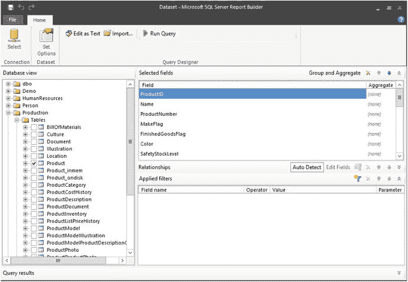

    *图 10-20. 查询设计器*

7.  在本例中，您将粘贴一个查询。点击图 10-21 所示的 `Edit as Text`，从可视化的查询构建器切换到基于文本的查询设计器窗口。

    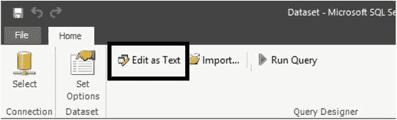

    *图 10-21. 点击 Edit as Text*

8.  粘贴以下查询：

    ```sql
    WITH
    Sales AS (
    SELECT SUM(TotalDue) AS Sales, MONTH(OrderDate) AS OrderMonth,
    YEAR(OrderDate) AS OrderYear,
    LAG(SUM(TotalDue),12) OVER(ORDER BY YEAR(OrderDate),
    MONTH(OrderDate)) * 1.10 AS Quota
    FROM Sales.SalesOrderHeader
    GROUP BY MONTH(OrderDate), YEAR(OrderDate)
    ),
    Comparison AS (
    SELECT OrderYear, Sales, OrderMonth, Quota,SUM(Sales)
    OVER(PARTITION BY OrderYear)/SUM(Quota)
    OVER(PARTITION BY OrderYear) AS PercentOfGoal
    FROM Sales)
    SELECT Sales, OrderMonth, Quota,
    CASE WHEN PercentOfGoal >= .98 THEN 1
    WHEN PercentOfGoal > .9 THEN 0
    ELSE -1 END AS Status
    FROM Comparison
    WHERE OrderYear = 2014;
    ```

9.  点击感叹号图标运行查询。结果应如图 10-22 所示。

    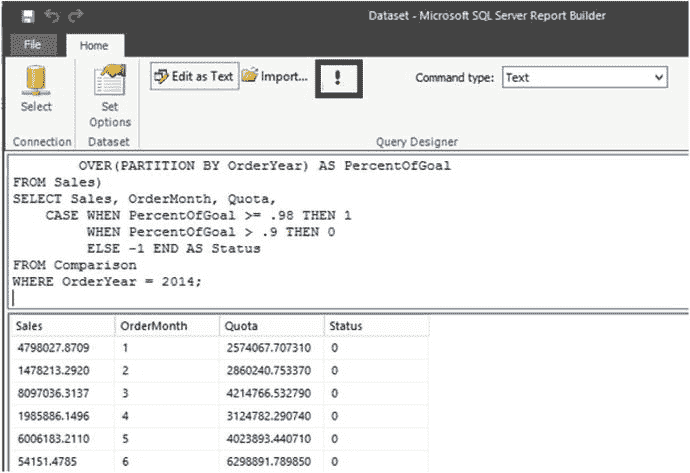

    *图 10-22. 查询结果*

10. 从 `File` 菜单中，点击 `Save`。
11. `Save as Dataset` 对话框打开后，导航到 `Datasets` 文件夹。
12. 将数据集命名为 `2014 Sales` 并点击 `OK`。
13. 关闭 `Report Builder`。

### 创建 KPI

现在数据集已发布到 `web portal`，您可以创建使用它的 KPI。KPI 设计页面一个非常有趣的方面是，您可以在连接数据之前设计 KPI 的外观。实际上，当您最初创建 KPI 时，它将填充一个随机值和可视化效果。请按照以下步骤创建新的 KPI：

1.  导航到 `Ad Hoc Reports` 文件夹，如果您之前没有跟随“使用 Report Builder”部分操作，请创建它。
2.  从菜单中点击 `New` ➤ `KPI`。
3.  这将打开如图 10-23 所示的页面，您可以在其中看到 KPI 的所有属性，包括已填充的随机值。

    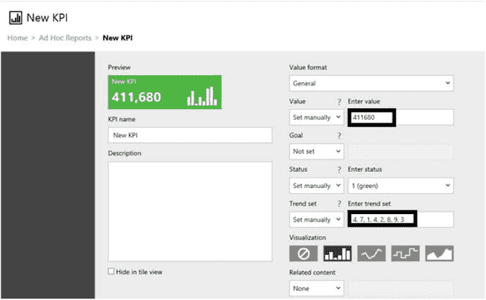

    *图 10-23. KPI 设计页面*

4.  将 `KPI Name` 更改为 `2014 Sales`。
5.  将 `Value format` 更改为 `Abbreviated currency`。
6.  将 `Value` 设置更改为 `Dataset field`。
7.  点击 `Pick dataset field` 下的省略号，如图 10-24 所示。

    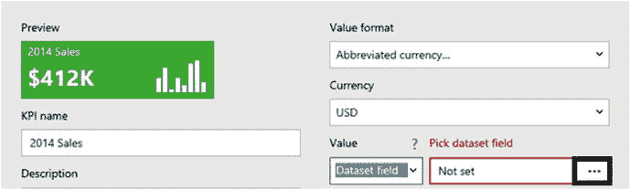

    *图 10-24. 点击省略号*

8.  这将打开 `Pick a Dataset` 对话框。导航到 `Datasets` 文件夹。
9.  选择 `2014 Sales` 数据集，如图 10-25 所示。

    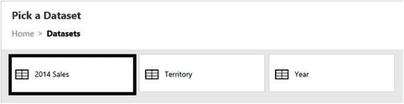

    *图 10-25. 选择 Sales 数据集*

10. 这将打开一个允许您选择字段和聚合的对话框。为 `Aggregation` 选择 `Sum`。
11. 选择 `Sales` 作为字段，如图 10-26 所示。

    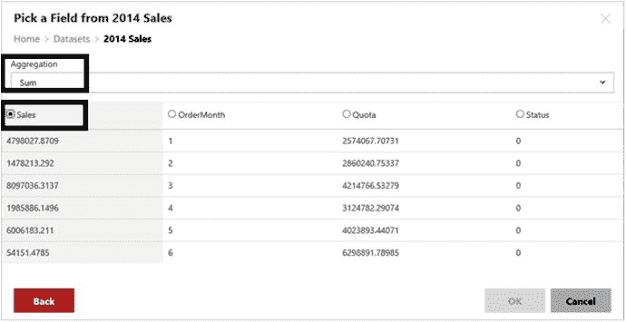

    *图 10-26. 值属性*

12. 点击 `OK`。
13. 按照相同步骤填充 `Goal`。选择 `Quota` 字段和 `Sum` 聚合。
14. 对 `Status` 使用相同的数据集。选择 `First` 聚合和 `Status` 字段。
15. 对 `Trend Set` 使用相同的数据集。本例中没有聚合。选择 `Sales` 字段。
16. 如果尚未选择，请选择 `Bar` 可视化。属性应如图 10-27 所示。

    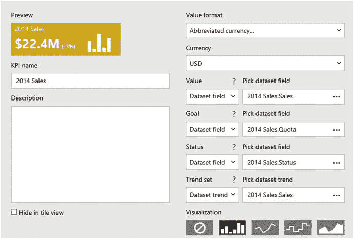

    *图 10-27. KPI 属性*

17. 点击屏幕底部的 `Create`。

现在，当您导航到 `Ad Hoc Reports` 文件夹时，您应该会看到新的 KPI，如图 10-28 所示。2014 年的销售额为 2240 万美元，比配额低 3%。您还可以在小图表中看到各月的趋势。

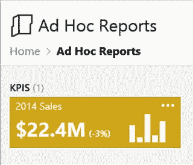

*图 10-28. 新的 KPI*

### 添加相关资源

KPI 可以链接到其他报表或网页。通过点击矩形内的省略号并选择 `Manage` 返回编辑器。要添加到分页报表的链接，请在编辑器底部找到的 `Related content` 属性中选择 `Custom URL`。粘贴从您的一个报表复制的 URL，如图 10-29 所示。您也可以通过选择 `Mobile Report` 来添加到移动报表的链接。本例中，您将浏览到报表以填写 URL。

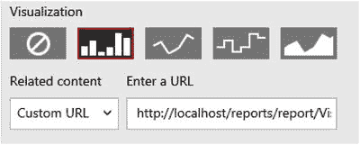

*图 10-29. 相关资源属性*

如果填充了 `Related content`，则在点击 KPI 时链接将可见，如图 10-30 所示。

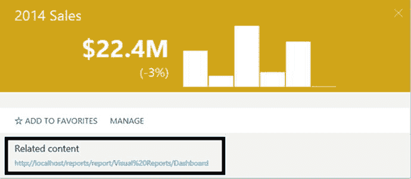

*图 10-30. 相关资源链接*

## 创建移动报表

新的移动报表功能无疑是 SSRS 2016 中最受期待的增强功能。在 2015 年 10 月西雅图 PASS 峰会上宣布此功能之前，我可能会猜测此功能仅在 SharePoint 集成模式下可用。我很高兴微软正在原生模式 SSRS 上进行此项投资。在我看来，原生模式配置和管理起来要容易得多。我很高兴这个强大的功能既可用又易于管理。

在创建 KPI 时，系统会创建示例数据，以便您可以在将其连接到实际数据之前查看 KPI 的外观。移动报表也是如此。要开始使用，您需要下载并安装新的 `Mobile Report Publisher` 应用程序。您可以通过点击下拉箭头并选择 `Mobile Report Publisher` 来找到链接，如图 10-31 所示。

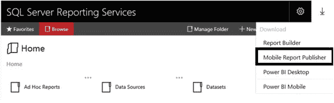
*图 10-31. `Mobile Report Publisher` 链接*

请按照链接页面上的说明下载并安装该应用程序。安装后，您可以从 Web 门户启动它，或创建快捷方式。

> **注意**
>
> 在 SQL Server 2016 发布时，`Mobile Report Publisher` 还需要一个 Visual C++ 组件的补丁。如果该更新未安装，您将在安装过程中收到提示。请务必下载 `x86` 版本。

与 KPI 一样，您需要创建共享数据集来构建移动报表。移动报表也可以使用从 Excel 导入的数据。Excel 数据的缺点是它必须手动刷新。

> **注意**
>
> 从 2016 版本开始，您可以将 Excel 电子表格存储在 SSRS 中。但至少在撰写本文时可用的版本中，存储在 SSRS 中的文件无法用于移动报表。

要开始使用，您将按照以下步骤使用模拟数据构建移动报表：

1.  在 Web 门户中，点击 **新建** ➤ **移动报表**。
2.  确认任何关于运行应用程序的警告。为了避免以后再看到此消息，请创建应用程序的快捷方式，而不是通过 Web 门户启动。
3.  您现在应该看到 `SQL Server Mobile Report Publisher`，您将在此构建移动报表，如图 10-32 所示。

    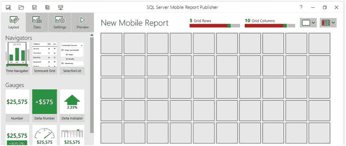
    *图 10-32. 移动报表设计画布*

4.  从左侧，将一个 `选择列表` 拖到网格的顶部和左侧部分。向右拖动右侧边框，使其扩展覆盖四个方格。`选择列表` 将用于筛选报表。
5.  在 `选择列表` 下方拖放一个 `半圆图`。扩展它使其覆盖两个乘两个方格的区域。
6.  在 `半圆图` 旁边拖放一个 `渐变热图`。扩展它使其也覆盖一个两乘两方格的区域。
7.  在底部的方格中填充一个 `类别图`。布局应如图 10-33 所示。

    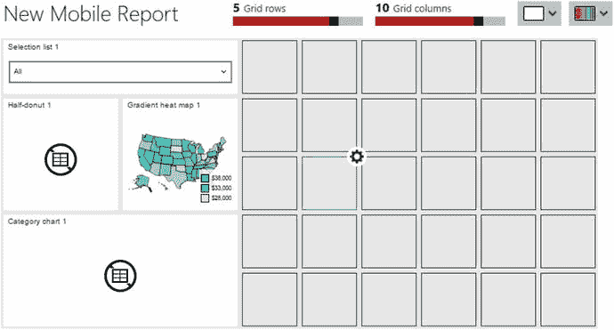
    *图 10-33. 移动报表布局*

8.  点击 **预览** 按钮。报表应如图 10-34 所示。

    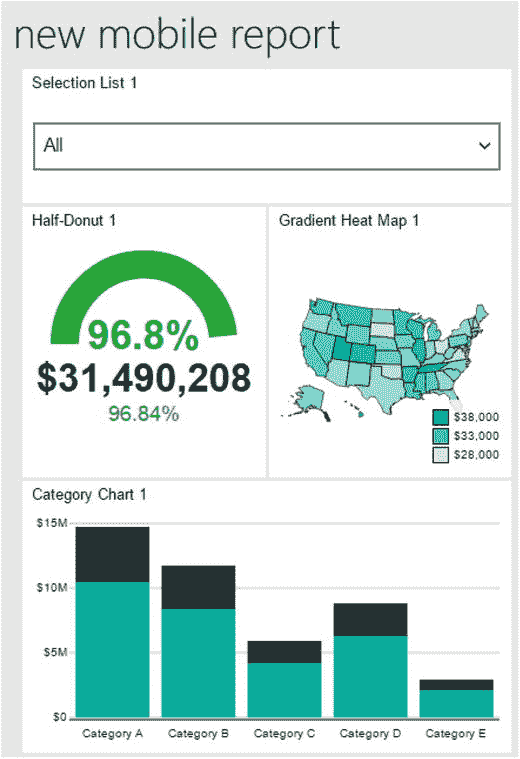
    *图 10-34. 移动报表预览*

9.  从 `选择列表 1` 中，选择其中一个项目。您将看到数据自动更改。
10. 点击 `类别图 1` 的标题。图表将展开以填充屏幕。
11. 如果您点击其中一个柱形并按住光标，该柱形的数据将显示出来，如图 10-35 所示。

    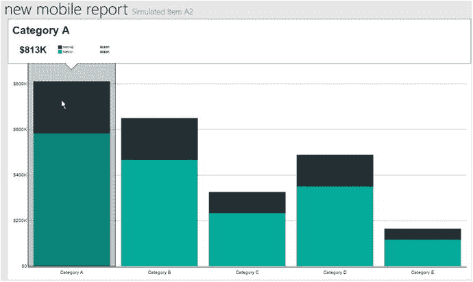
    *图 10-35. 单个柱形的数据*

12. 点击 `类别图` 标题可返回报表。
13. 点击报表标题左侧的返回箭头可返回到设计视图。

希望您此刻能对制作报表原型的便捷性及其交互性留下深刻印象。下一步是为每个报表项指定一个标题。表 10-2 显示了每个项目的标题。

*表 10-2. 报表项标题*

| 项目 | 标题 |
| --- | --- |
| `选择列表` | 年份 |
| `半圆图` | 配额 |
| `渐变热图` | 按州划分的美国销售额 |
| `类别图` | 按月份划分的销售额 |

请按照以下步骤设置标题：

1.  在 `移动报表发布工具` 的设计视图中，确保选中了 **布局** 视图。
2.  从设计网格中选择一个项目。
3.  在 **可视化** 属性部分中填写 `标题`，如图 10-36 所示。

    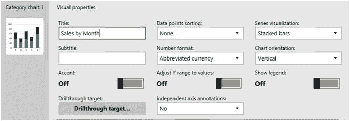
    *图 10-36. `标题` 属性*

4.  为每个项目重复此过程。
5.  为确保不会丢失工作，请将报表定义作为 `rsmobile` 文件保存在本地计算机上。

至此，您已经有了一个设计，但它连接的是模拟数据。下一步是将报表连接到 SSRS 服务器。请按照以下步骤操作。

1.  点击图 10-37 所示的 **服务器连接** 图标。

    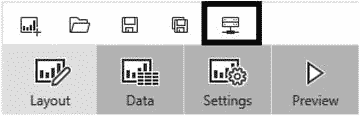
    *图 10-37. **服务器连接** 图标*

2.  填写 **服务器地址**，如图 10-38 所示。

    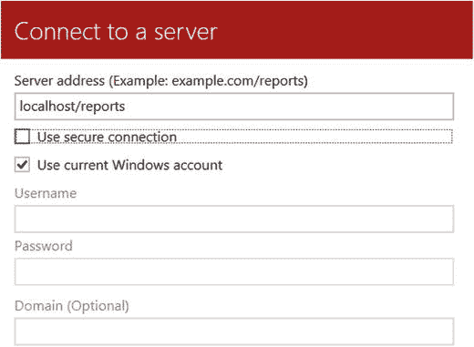
    *图 10-38. **连接到服务器** 属性*

3.  除非您正在使用安全套接字层 (`SSL`)，否则请取消选中 **使用安全连接**。如果 SSRS 安装在您的本地工作站上，您很可能没有使用 `SSL`。
4.  点击 **连接**。`移动报表发布工具` 将记住此连接。

下一步是向 Web 门户添加数据集，这些数据集将用于填充移动报表，而不是使用模拟数据。请按照以下步骤创建数据集：

1.  最小化 `移动报表发布工具`。
2.  在 Web 门户中，选择 **新建** ➤ **数据集** 以启动 `报表生成器`。
3.  使用此查询和 `AdventureWorks2016` 数据源创建一个新的名为 `SalesByState` 的共享数据集。如果您需要帮助，"使用报表生成器" 部分提供了创建数据集的说明。

    ```sql
    SELECT SUM(TotalDue) AS Sales, vS.CountryRegionName, vS.StateProvinceName,
        YEAR(OrderDate) AS OrderYear
    FROM Sales.SalesOrderHeader AS SOH
        JOIN Person.BusinessEntityAddress AS BEA
            ON BEA.BusinessEntityID = SOH.CustomerID
        JOIN Person.Address AS A ON BEA.AddressID = A.AddressID
        JOIN Person.vStateProvinceCountryRegion AS vS
            ON A.StateProvinceID = vS.StateProvinceID
    WHERE CountryRegionName = 'United States'
    GROUP BY A.City, vS.CountryRegionName, vS.StateProvinceName,
        YEAR(OrderDate);
    ```

4.  将新数据集保存在 **数据集** 文件夹中。
5.  创建一个名为 `Sales` 的数据集，使用以下查询，并将其保存到 **数据集** 文件夹中：

    ```sql
    WITH
    Sales AS (
        SELECT SUM(TotalDue) AS Sales, MONTH(OrderDate) AS OrderMonth,
            YEAR(OrderDate) AS OrderYear,
            LAG(SUM(TotalDue),12,600000) OVER(ORDER BY YEAR(OrderDate),
            MONTH(OrderDate)) * 1.10 AS Quota
        FROM Sales.SalesOrderHeader
        GROUP BY MONTH(OrderDate), YEAR(OrderDate)
    ),
    Comparison AS (
        SELECT OrderYear, Sales, OrderMonth, Quota,
            Sales/Quota AS PercentOfGoal
        FROM Sales)
    SELECT OrderYear, Sales, 'M' + RIGHT('0' + CAST(OrderMonth AS VARCHAR(2)),2) AS OrderMonth, Quota,
        PercentOfGoal, DATEFROMPARTS(OrderYear,OrderMonth, 1) AS OrderDate,
        CASE WHEN PercentOfGoal >= 0.98 THEN 1
            WHEN PercentOfGoal >= 0.9 THEN 0
            ELSE -1 END AS Status
    FROM Comparison;
    ```

6.  关闭 `报表生成器`。

您现在应该有两个可用于新移动报表的数据集。您将通过以下步骤将数据集连接到报表对象：


1. 最大化 Mobile Report Publisher。如果尚未打开，请打开你刚创建的 rsmobile 文件。
2. 切换到 `Data` 视图。你将看到连接到每个对象的模拟表，如图 10-39 所示。
    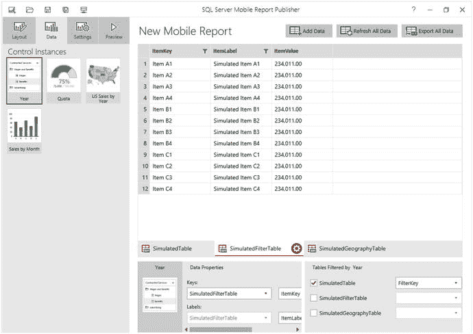
    图 10-39. `Data` 视图
3. 点击 `Add Data`，如图 10-40 所示。
    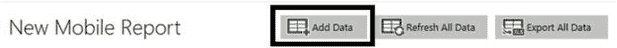
    图 10-40. 点击 `Add Data`
4. 你将可以选择从 `Excel` 或 `Report Server` 导入，如图 10-41 所示。选择 `Report Server`。
    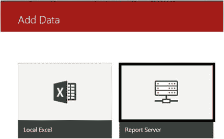
    图 10-41. 选择 `Report Server`
5. 在如图 10-42 所示的 `Add Data from Server` 屏幕上，选择你的 `SSRS` 实例。
    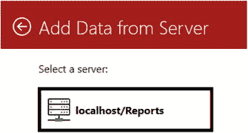
    图 10-42. 选择服务器
6. 接着你将看到直接位于 Web 门户 `Home` 文件夹下的所有文件夹。点击 `Datasets`。
7. 你现在应该能看到所有已创建的数据集列表，如图 10-43 所示。点击 `SalesByState`。
    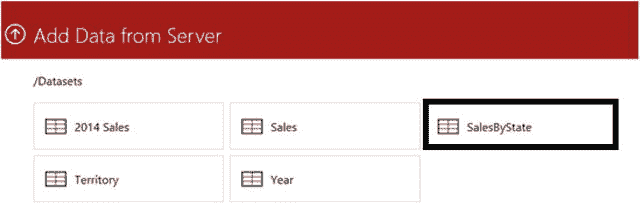
    图 10-43. 数据集
8. 现在，`SalesByState` 数据集将显示在 Mobile Report Publisher 数据页中，代替模拟数据。
9. 重复该过程以添加 `Sales` 数据集。
10. 在 `Data` 视图中，选择 `Year` 控件。
11. 在 `Year` 控件的 `Data Properties` 中，为 `Keys` 属性选择 `Sales`，为旁边的字段选择 `OrderYear`。
12. 为旁边的字段选择 `OrderYear`。`Data Properties` 应如图 10-44 所示。
    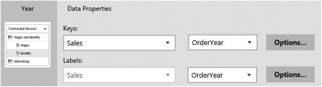
    图 10-44. `Year` 控件的 `Data Properties`
13. 在右侧，你将看到 `Filter these datasets when a selection is made` 部分。勾选 `SalesByState` 和 `Sales`。
14. 为每个数据集选择 `OrderYear` 字段，如图 10-45 所示。
    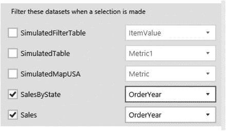
    图 10-45. 按年份筛选的表
15. 切换到 `Layout` 视图。确保 `Year` 列表仍处于选中状态，然后关闭 `Allow select all`，如图 10-46 所示。这将强制该控件一次只允许选择一个值，而不是全部。
    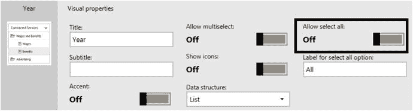
    图 10-46. 关闭 `Allow select all`
16. 切换回 `Data` 视图。
17. 选择 `Quota` 控件。对于 `Main Value`，填写 `Sales` 数据集和 `Sales` 字段。
18. 对于 `Comparison Value`，填写 `Sales` 数据集和 `Quota` 字段。
19. 点击其中一个 `Options` 按钮，你应该会看到数据已按 `Year` 控件筛选，并且数据将被求和，如图 10-47 所示。
    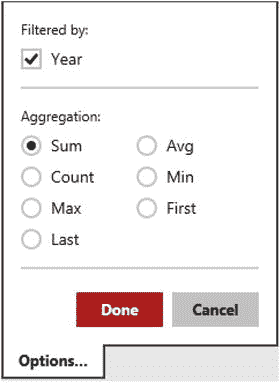
    图 10-47. `Quota` 的数据选项
20. 点击 `Cancel`。
21. 对于 `US Sales by State` 控件，为 `Keys` 属性选择 `SalesByState` 数据集和 `StateProvinceName` 字段。如果你检查 `Options`，`Keys` 属性应该已按 `Year` 筛选。如果未筛选，请务必在此处选择它并点击 `Done`。
22. 为 `Values` 属性选择 `Sales` 字段。`US Sales by State` 控件数据属性应如图 10-48 所示。
    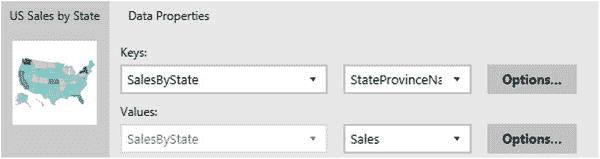
    图 10-48. `US Sales by State` 数据属性
23. 对于 `Sales by Month` 控件，为 `Series name` 字段属性选择 `Sales` 数据集和 `Order Month`。
24. `Main series` 字段是 `Sales`。此控件也按 `Year` 筛选，因此请务必确认这一点。数据属性应如图 10-49 所示。
    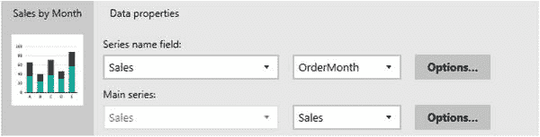
    图 10-49. `Sales by Month` 数据属性
25. 现在你已将控件连接到实际数据，可以移除模拟表了。点击模拟表名称上的齿轮图标，然后点击 `Remove`。报表名称仍设置为默认值；你可以点击设计视图中的名称，或点击 `Settings` 页面来更改 `Report Title` 属性。将标题设置为 `Sales by Month and State`。当你预览报表时，它应类似于图 10-50。
    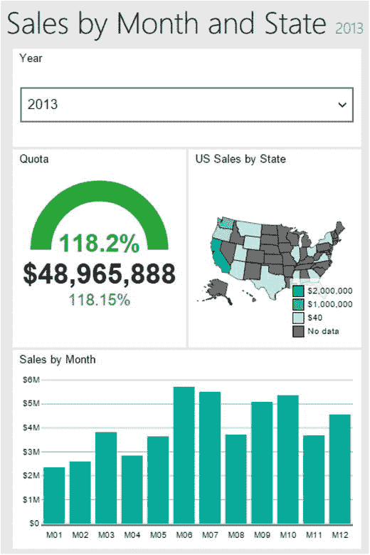
    图 10-50. 已填充的报表
26. 点击后退箭头切换回设计视图。

移动报表有三种可能的视图：`Master`、`Tablet` 和 `Phone`。选择控件的初始工作必须在 `Master` 视图中完成。然后，你可以基于 `Master` 报表设计 `Tablet` 和 `Phone` 报表。在右上角，从 `Master` 切换到 `Phone`，如图 10-51 所示。
    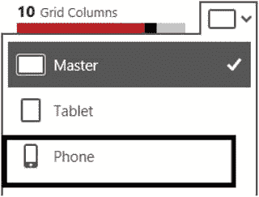
    图 10-51. 切换到 `Phone`

切换到 `Phone` 视图会将设计网格显示为更小的尺寸且没有控件。在左侧，你将看到在 `Master` 视图中配置的所有控件。你将拖入并调整希望在 `Phone` 视图中看到的控件的大小。图 10-52 显示了手机在预览模式下的一种可能布局。
    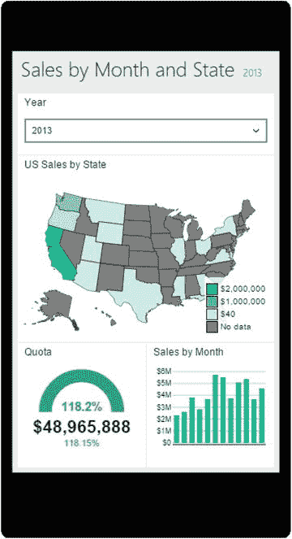
    图 10-52. 手机预览

在查看报表时，尝试一下动态功能。它仍然有效！要发布报表，你只需按照以下步骤保存到 `SSRS` 服务器：
1. 切换回设计视图。
2. 点击 `Save` 按钮。
3. 选择 `Save to Server`。
4. 在 `Save mobile report as` 屏幕上，将填写名称以及服务器名称。点击 `Browse`，如图 10-53 所示。
    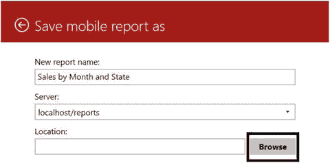
    图 10-53. `Save mobile report as` 屏幕
5. 如果需要，点击如图 10-54 所示的向上箭头以导航到正确的文件夹位置。
    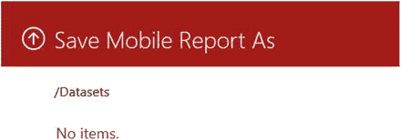
    图 10-54. 点击向上箭头
6. 导航到 `Ad Hoc Reports` 文件夹并点击 `Choose Folder`。
7. 点击 `Save` 以发布报表。

现在，当你在 Web 门户中导航到 `Ad Hoc Reports` 文件夹时，就可以运行该报表了。如果你调整浏览器大小，报表也会相应调整，如图 10-55 所示。
    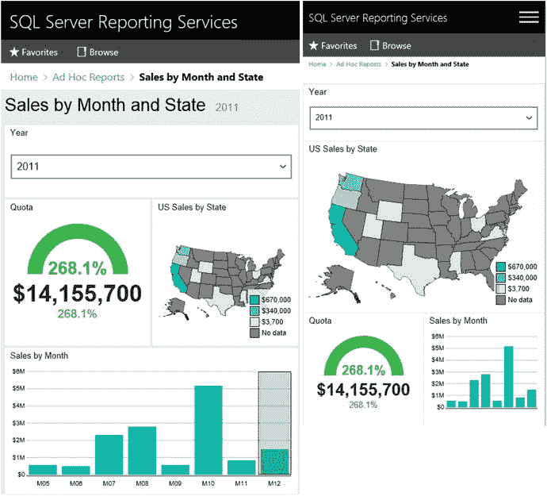
    图 10-55. 报表自动调整

每个控件还有一个 `Drill-Through Target` 属性，你可以将其设置为导航到另一个移动报表或任何 URL。用于在移动设备上运行报表的新应用程序包括 `Power BI for iOS`、`Power BI for Android` 和 `Power BI for Windows`。


## 概述

借助企业版中新增的移动报表功能，Microsoft 发布了一款能够随时随地向多种设备交付数据的产品。构建报表非常简单，并且内置了交互性，无需特殊编码。报表生成器自 2005 年起就已存在。从那时起，它作为一款帮助高级用户构建自有报表和仪表板的工具，已经取得了显著的改进。新的关键绩效指标（KPI）也能让高管们只需瞥一眼，经过少量的开发时间，就能获取信息。

本书面向初学者，但仍有更多内容值得学习。第 11 章讨论了一些随着您经验积累可能希望探索的高级主题。

