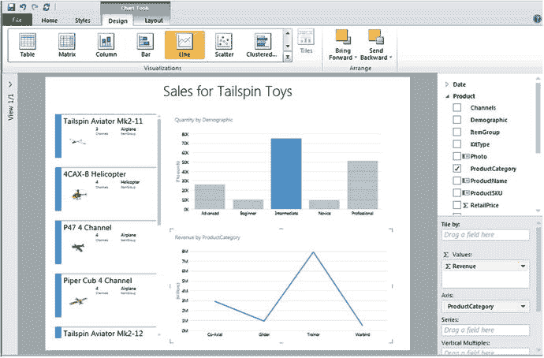
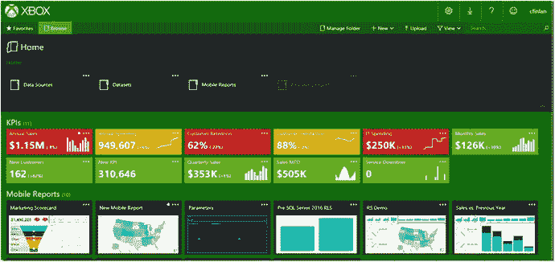
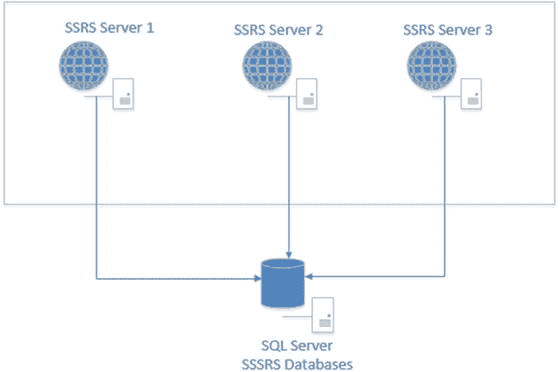

# 11. 后续学习路径

为任何技术领域的初学者撰写书籍都面临着独特的挑战。哪些主题是合适的？哪些超出了范围？如何包含足够的内容让读者打好基础，又不至于使书籍过于庞大和昂贵？在每一章中，我都从开发人员和管理员的角度，思考了 SQL Server Reporting Services（SSRS）新手可能会提出的问题。我试图用简单的方式解释，并涵盖足够的内容帮助您入门。为了避免增加不必要的复杂性，我没有提及某些功能。我希望本书能激发您学习更多知识的兴趣，并且它仅仅标志着您旅程的开始。

当我撰写第 10 章时，我已经在思考本章将涵盖哪些内容。我意识到可以将高级信息分为五个领域：安装、架构与配置、开发、管理，以及与其他报告工具的集成。在本章中，我将在不深入细节的情况下，向您介绍这些领域中的一些高级功能。

## SSRS 安装

在第 1 章中，您学习了如何在本机模式下将 SSRS 安装到您自己的计算机上，以便学习如何部署和管理报表。该章没有涵盖在 SharePoint 集成模式下安装 SSRS。在过去几个版本的 SQL Server 和 SharePoint 中，在 SharePoint 模式下安装和配置 SSRS 变得更容易了，但仍然需要几个步骤。您还需要有一个 SharePoint 场，而许多初学者可能无法获得。

在 SharePoint 集成模式下运行 SSRS 有几个优点。您可以将报表开发添加到 SharePoint 内置的工作流功能中。例如，您可以要求新报表获得批准，并在发生更改时发送电子邮件通知。 SharePoint 还具有文档版本管理功能，这是 Web 门户所不具备的。

SharePoint 模式提供两个本机模式所不具备的功能。其一是 Power View 报表。这些报表旨在通过拖放操作供最终用户进行即席报告。报表基于预定义的数据模型，创建报表的人可以在构建报表的同时探索数据。报表具有高度交互性。例如，通过单击图表中的某个条形，整个报表就会被筛选。只需单击即可快速将可视化效果更改为不同类型。图 11-1 是我根据预定义的数据模型，通过大约 30 次鼠标点击创建的 Power View 报表设计视图图片。其中的可视化反映的是实际数据。



图 11-1. Power View 报表

另一个仅在部署到 SharePoint 的报表中可用的功能是数据警报。根据数据警报中定义的条件，当报表的数据发生变化时，将触发一封电子邮件。这样，只有当数据发生重要变化时，才查看报表。

如果您喜欢新的 Web 门户，但希望能自定义其外观和感觉，那么您很幸运。从 SSRS 2016 开始，您可以利用自定义品牌功能来调整 Web 门户的外观。图 11-2 是来自 SSRS 团队博客（网址为 [`https://blogs.msdn.microsoft.com/sqlrsteamblog/2016/03/20/how-to-create-a-custom-brand-package-for-reporting-services-with-sql-server-2016/`](https://blogs.msdn.microsoft.com/sqlrsteamblog/2016/03/20/how-to-create-a-custom-brand-package-for-reporting-services-with-sql-server-2016/) ）的一个带有 Xbox 品牌的 Web 门户图片。



图 11-2. 自定义 Web 门户

## 架构与配置

在您学习 SSRS 的过程中，您可能将所有需要的东西都安装在一台计算机上：一个包含源数据库和 Reporting Services 数据库的 SQL Server 实例、装有 SQL Server Data Tools（SSDT）的 Visual Studio，以及一个 SSRS 实例。这是最简单的配置。大多数时候，开发人员可能只在本地安装了带有 SSDT 的 Visual Studio，而 SSRS 和 SQL Server 实例则托管在其他服务器上。比这更复杂的是横向扩展配置，其中 SSRS 实例部署在两个或更多服务器上。此配置允许在任何给定时间运行更大量的报表。图 11-3 展示了横向扩展架构的样貌。



图 11-3. 横向扩展架构

即使是典型的 SSRS 部署，也可能需要根据您的具体情况更改一些无法通过 Reporting Services 配置管理器获得的设置。请务必查阅在线文档，了解您可能需要在 Program Files 的 SQL Server 部分中找到的 `rsreportserver.config` 文件中配置的设置。

## 开发

本书有几章专门介绍报表开发。您学习了分组、可视化、表达式等内容。我曾见过一个演示，其中使用地图可视化，根据数据库中的值“种植”一朵虚拟花朵。显然，在设计报表时，尤其是对于我们当中更有创造力的人来说，可能性是无限的。

几乎每个对象的每个属性都可以通过表达式动态控制。本书演示了如何创建少量表达式。我鼓励您学习书中未使用的所有函数。一些开发人员会向其报表添加自定义函数，甚至是用 C# 编写的自定义程序集。

如果您对编写代码不太熟练，另一个有趣的练习是创建一个包含公司徽标、颜色和页脚的模板。创建报表后，使用描述性名称将 rdl 文件保存在此文件夹中：

```
C:\Program Files (x86)\Microsoft Visual Studio 4.0\Common7\IDE\PrivateAssemblies\ProjectItems\ReportProject
```

然后，当您向项目添加新报表时，该模板将成为选项之一，并且默认具有模板中定义的所有属性。


