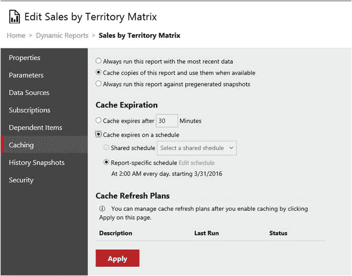

# 管理

在第 8 章和第 9 章中，你学习了如何部署报表和控制安全性。你还学习了如何设置订阅。已部署报表有一些属性你尚未了解，例如缓存和快照。

## 缓存

缓存是一项用于保存和重复使用报表的功能，适用于数据不常变化的情况，以提升性能。例如，想象一下有多人将要运行基于上月销售数据的报表。数据不会变化，因此你可以利用缓存来保存该报表，以便在第二次及后续运行时能快速执行。

我曾参与一个项目，该项目需要比较从旧系统迁移的数据与来自新系统的数据。业务分析师会从报表的多个参数中选择数值，然后在报表之间来回切换，进行数据钻取并以不同方式查看数据。有些必要的查询执行起来极其缓慢，我们对此无能为力。分析师们花在等待上的时间比实际查看数据的时间还要长。由于数据变化并不频繁，我设置了缓存，并设定了 30 分钟的过期时间。分析师们只需要在给定参数集的第一次运行时忍受一次缓慢的查询。这使得解决方案变得可行，分析师们也能够完成他们的工作。图 11-4 展示了缓存功能。

图 11-4. 缓存功能

## 历史快照

另一个有趣的功能是历史快照。历史快照与订阅类似，必须定义默认参数值，并且数据源必须存储凭据。你可以手动创建快照，也可以设置计划。无论哪种方式，你都可以稍后返回查看快照，报表将显示快照拍摄时的数据状态。

