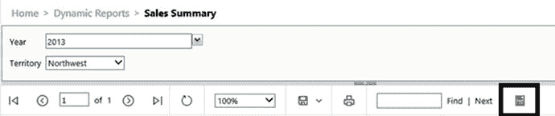

# 集成

自从引入`SSRS`以来，就一直存在一个报表管理器，现在则有一个用于托管报表的 Web 门户。最终，还增加了与 SharePoint 的集成。开发人员已通过报表查看器控件将报表嵌入到应用程序中。你也可以使用特殊 URL（`统一资源定位符`）在 Web 门户之外显示报表。如果你在 Web 门户中报表的 URL 末尾添加`rs:Embed=true`，它将在浏览器中显示，而不带 Web 门户的标题和菜单。

你可能没有注意到的一个图标（如图 11-5 所示，位于报表菜单中）允许你导出数据提要。该数据提要可用作`Power Pivot`（`Excel`的高级功能）的数据源。`Power Pivot`可用于合并来自一个或多个来源的大量数据。生成的工作簿可用作`Power View`报表的基础。`SSRS`不仅是查看数据的一种方式，它还可以作为另一个报表工具的数据来源。

图 11-5. 导出到数据提要图标

`SSRS`是微软的几种报表工具之一，其中包括历史悠久的`Excel`和新的云端解决方案`Power BI`。`SSRS`被视为本地报表解决方案，尤其适用于分页报表。然而，随着 2016 版`SSRS`的发布，`SSRS`已无边界。`SSRS`与云解决方案`Power BI`和 SharePoint Web 集成，并且你已经看到了可以传输到移动设备的新型移动报表。过去几年，有些人曾预测`SSRS`将消亡。随着 2016 年的改版，`SSRS`依然充满活力，并为未来做好了准备。

