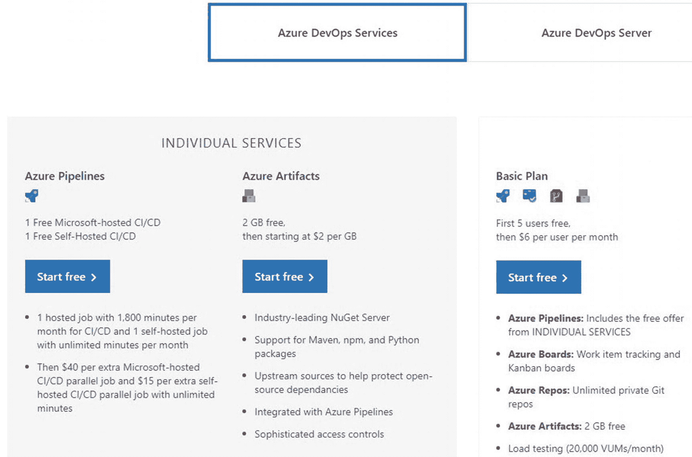
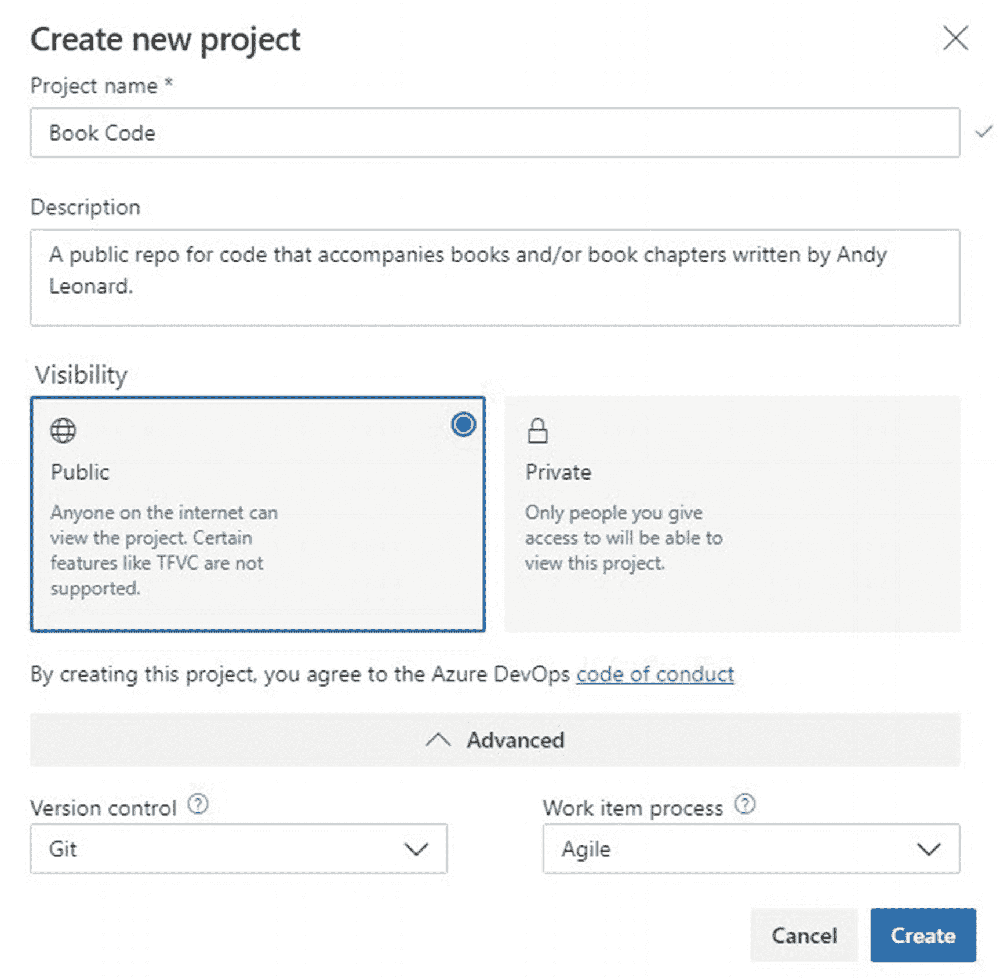
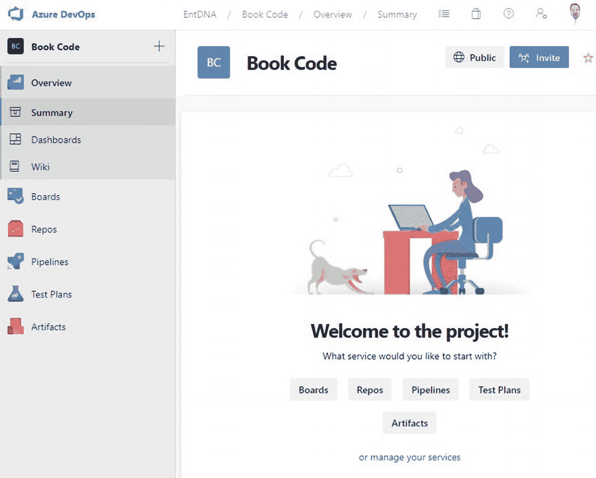
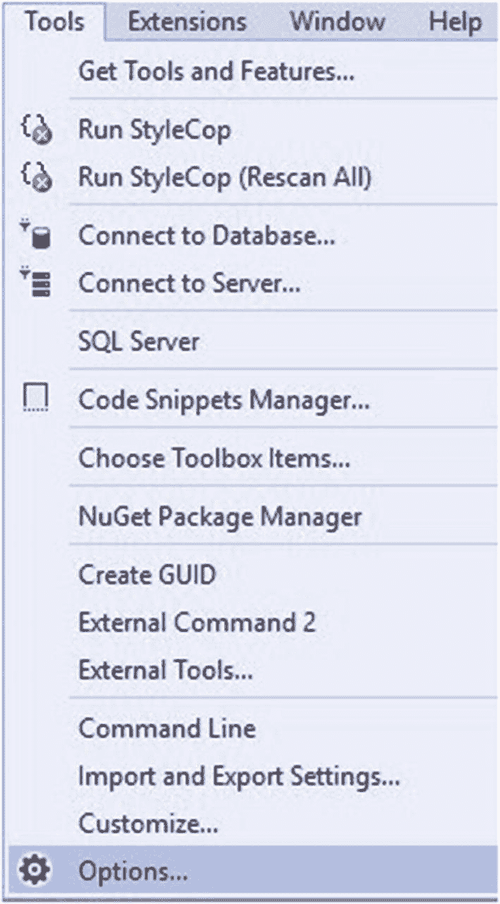
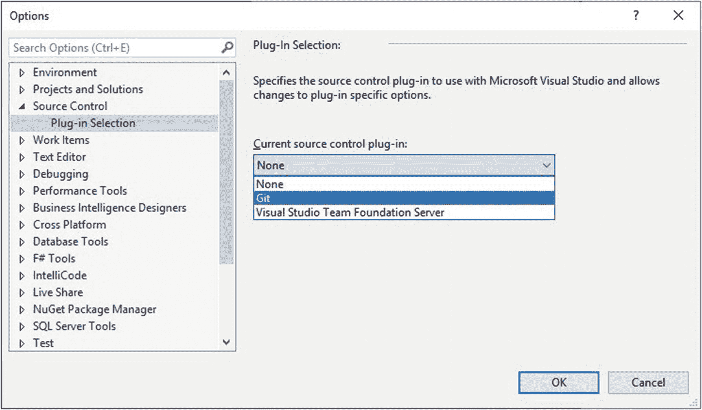
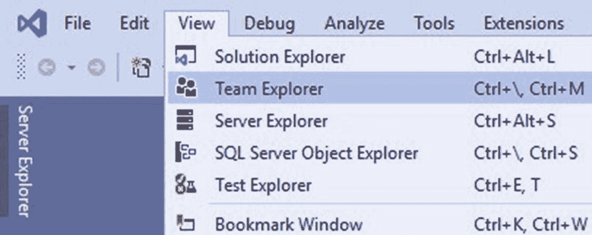
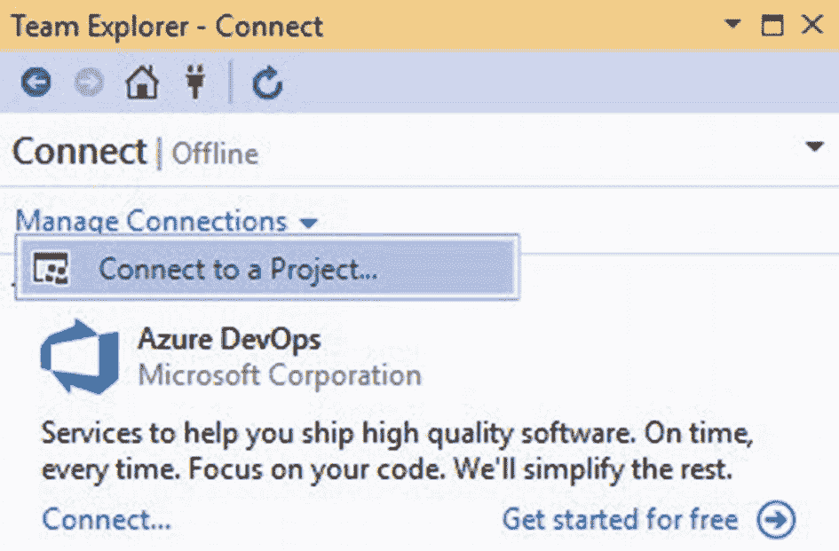
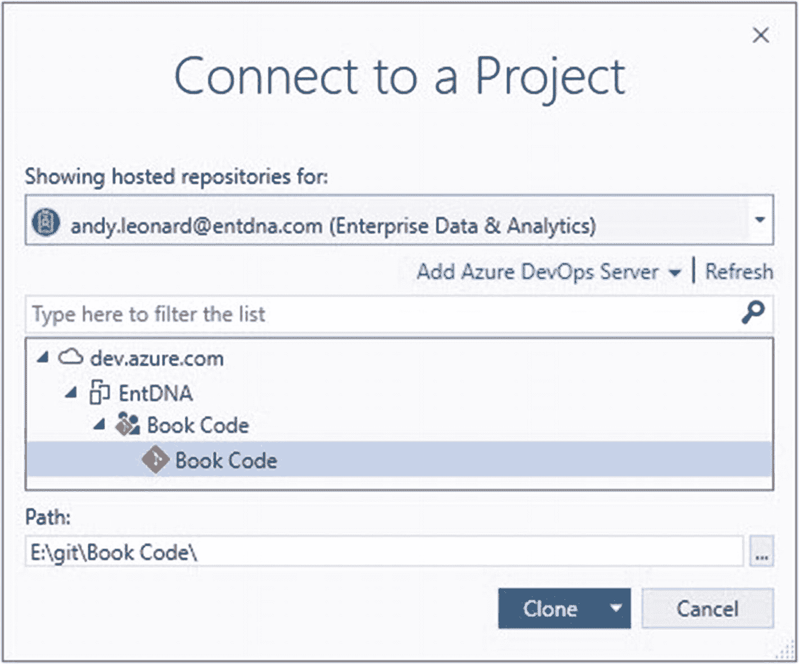
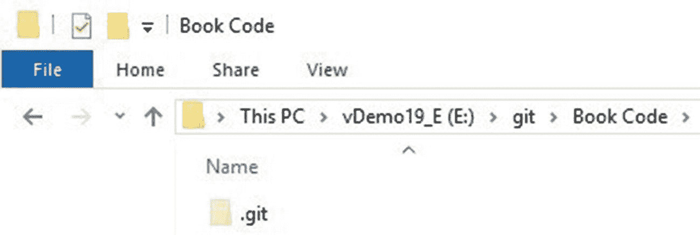
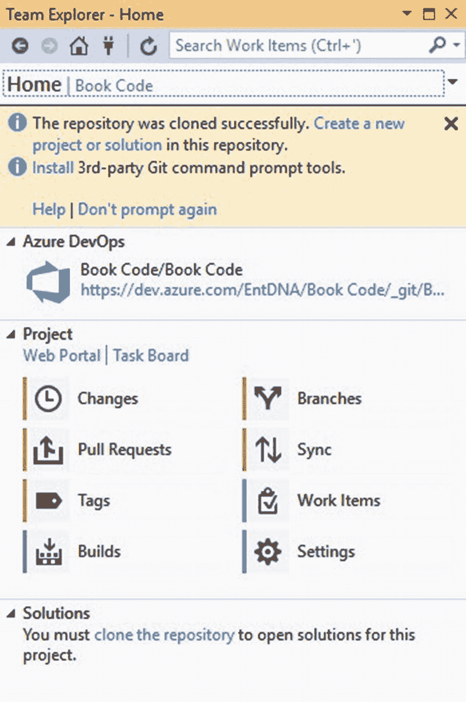

# 2. 准备环境

武术学生首先学到的事情之一是如何摔倒。为什么？这样他们就不会伤到自己。在我们开始开发这个任务之前，我想让你知道：你将会经历失败。测试会失败，代码不会按预期运行，事情会出错。当它们发生时，我希望你接受软件开发的几个普遍真理：

1.  失败是正常的。
2.  如何恢复。

我无法过分强调生命周期管理的必要性，而源代码控制是其中的核心。我使用 [`Microsoft Azure DevOps`](https://dev.azure.com)，但请随意使用任何可用的优秀源代码控制解决方案。在撰写本文时，对于五人或以下的团队，`Azure DevOps` 是免费的。源代码控制是你进行代码恢复的头号方法。请务必使用它。（你已经被警告过。）

## 创建 Azure DevOps 帐户

在创建 `Azure DevOps` 项目之前，你需要一个 `Azure DevOps` 帐户。你可以通过访问 [`dev.​azure.​com`](https://dev.azure.com) 来创建 `Azure DevOps` 帐户。在撰写本文时，基本的 `Azure DevOps Services` 对个人是免费的——有一些限制——最多支持五个用户，如图 2-1 所示：

图 2-1

个人服务的 `Azure DevOps` 定价（在撰写本文时）

一旦你创建了 `Azure DevOps` 帐户并配置了一个组织，你就可以创建一个 `Azure DevOps` 项目。

## 创建 Azure DevOps 项目

在 `Azure DevOps` 中有多个位置可以开始创建 `Azure DevOps` 项目。在撰写本文时，每个位置都显示一个“+ 新建项目”（`+ New project`）按钮，如图 2-2 所示：

图 2-2

新建项目按钮

点击新建项目按钮会打开“创建新项目”（`Create new project`）面板，如图 2-3 所示：

图 2-3

创建新项目面板

在这个例子中，我创建了一个名为“Book Code”的公共项目，使用 `Git Version Control` 和 `Agile Work item process`。项目创建后，会显示一个仪表板，如图 2-4 所示：

图 2-4

`Azure DevOps` 项目仪表板

一旦 `Azure DevOps` 项目创建完毕，我们就可以配置并连接 `Visual Studio` 来使用这个新项目。

## 为源代码管理配置 Visual Studio

打开 `Tools ➤ Options` 以配置 Visual Studio 源代码管理选项，如图 2-5 所示：

图 2-5：打开 `Tools ➤ Options`

当“选项”窗口显示时，展开“源代码管理”节点，然后选择“插件选择”。从“当前源代码管理插件”下拉列表中选择您的源代码管理插件，如图 2-6 所示：

图 2-6：选择当前源代码管理插件

如果您是 Git 新手，请访问 [`git-scm.com/doc`](https://git-scm.com/doc) 以了解更多信息。

如果您像我一样使用 Git，请点击 `View ➤ Team Explorer`，如图 2-7 所示：

图 2-7：打开 `Team Explorer`

当 `Team Explorer` 显示时，点击“管理连接”链接，然后点击“连接到项目…”按钮，如图 2-8 所示：

图 2-8：连接到 Azure DevOps 项目

在此步骤中，您可能需要配置新的服务器和到团队项目的新连接。配置完成后，使用 `Team Explorer` 选择团队项目。我的团队项目名为“Book Code”，如图 2-9 所示：

图 2-9：连接到名为 Book Code 的 Azure DevOps 项目

点击 `Clone` 按钮，将 Azure DevOps 项目中的代码复制到对话框中列出的 `Path` 中。

如果您是第一次连接到 Azure DevOps Git 仓库（或“repo”），您可能会惊讶地发现，此时 Book Code Git 仓库的目录几乎是空的，如图 2-10 所示：

图 2-10：查看本地仓库内容

如果您是第一次建立 Git 和 Visual Studio 之间的连接，`Team Explorer` 会提供一些有用的链接来安装第三方 Git 命令行工具。还有一个链接用于在此仓库中创建新项目或解决方案，如图 2-11 所示：

图 2-11：`Team Explorer`

请注意 `Team Explorer` 中的消息：“The repository was cloned successfully.” 下一条消息是：“Create a new project or solution in this repository.”

### 结论

到此开发阶段，我们已经：

*   创建并配置了一个 Azure DevOps 项目
*   将 Visual Studio 连接到 Azure DevOps 项目
*   在本地克隆了 Azure DevOps Git 仓库

现在，Visual Studio 已配置并连接到新的 Git 仓库，并准备好创建一个新的 Visual Studio 项目。

