# 3. 创建程序集项目

如果您遵循了前一章并为您的项目设置了 Azure DevOps 或其他源代码控制，很好！如果没有，您可以稍后将我们在本节中构建的程序集添加到源代码控制中，*但是*，如果您计划使用 Git，跳过上一章可能会让您后悔。

创建一个自定义的 SSIS 任务始于创建一个 .Net 程序集。我们实践的方式与许多 .Net 开发项目不同，因为我们正在创建一个将在其他 Visual Studio 项目（具体来说是 SSIS 项目）中使用的控件。

在本章中，我们采取步骤为项目奠定基础，同时考虑后续步骤。第一步是如何打开 Visual Studio IDE。如果 Visual Studio 已打开，请在继续之前将其关闭。

## 打开 Visual Studio IDE

我能猜到你在想：“等等，安迪。你是要从教我们如何打开 Visual Studio 开始讲起吗？”是的，没错。“为什么呢？”很高兴你这么问。如果你是 .Net 开发的新手，并且在寻找有关开发自定义 SSIS 任务（或类似代码）的问题答案，这正是真正的软件开发人员常常忘记告诉你的一件棘手事。他们并非故意遗漏这些内容来给你设置障碍，也不是因为他们人不好；他们只是不记得自己当初为了支持这类开发而对开发环境所做的更改。

当你打开 Visual Studio 时，请在 Windows 开始菜单中右键单击 Visual Studio，将鼠标悬停在“更多”上，然后单击“以管理员身份运行”，如图 3-1 所示：

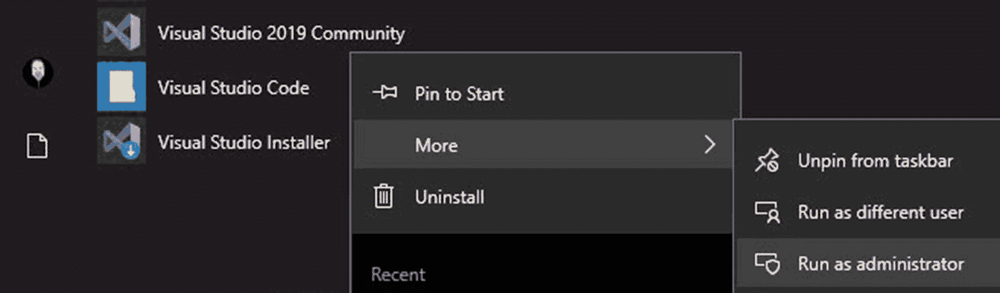

图 3-1：以管理员身份运行 Visual Studio

你并非必须执行此步骤。但执行此步骤将为你省去日后的时间和精力。为什么？稍后我们将配置“生成”操作，以将输出文件复制到全局程序集缓存（GAC），这将需要提升的权限。

当你点击“以管理员身份运行 Visual Studio”时，系统将提示你确认是否希望运行 Visual Studio，如图 3-2 所示：

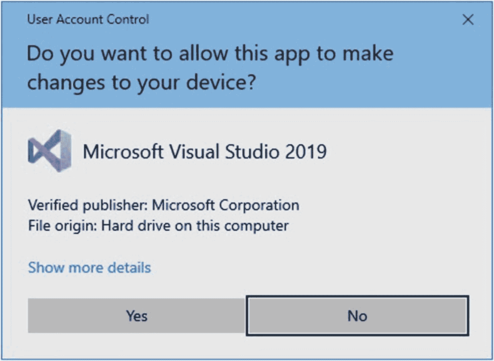

图 3-2：确认你确实要以管理员身份运行 Visual Studio

一旦 Visual Studio 启动屏幕显示，点击“创建新项目”磁贴以开始一个新项目，如图 3-3 所示：

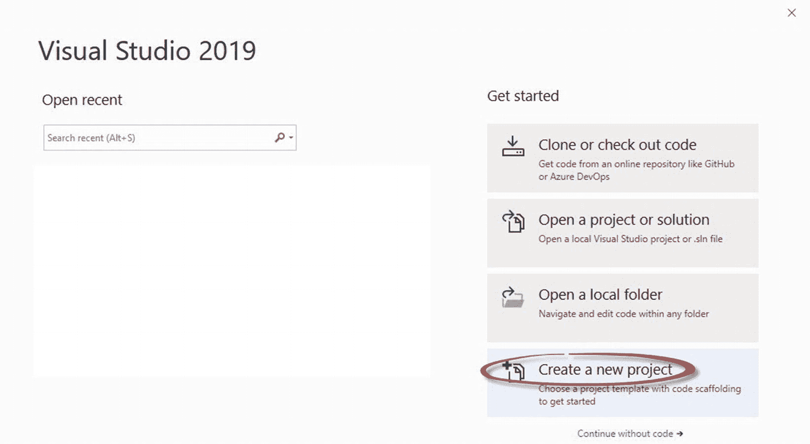

图 3-3：启动新项目

当“创建新项目”窗口显示时，搜索并选择一个 C# 类库（.Net Framework）项目类型，或者你选择的 .Net 语言项目。我选择了 C# 作为语言，并将项目命名为 `ExecuteCatalogPackageTask`，如图 3-4 所示：

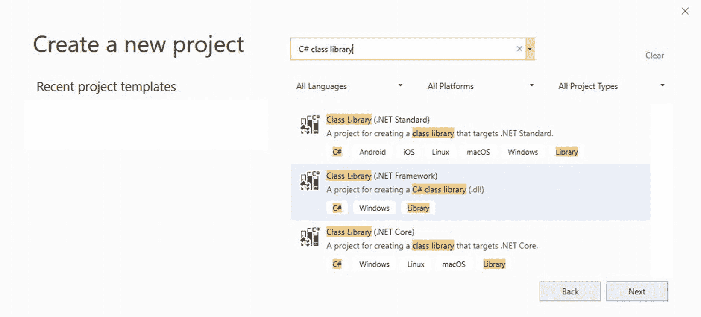

图 3-4：选择项目类型

选择“类库（.NET Framework）”并点击“下一步”按钮。

当“配置新项目”窗口显示时，输入项目名称并设置项目文件位置，如图 3-5 所示：

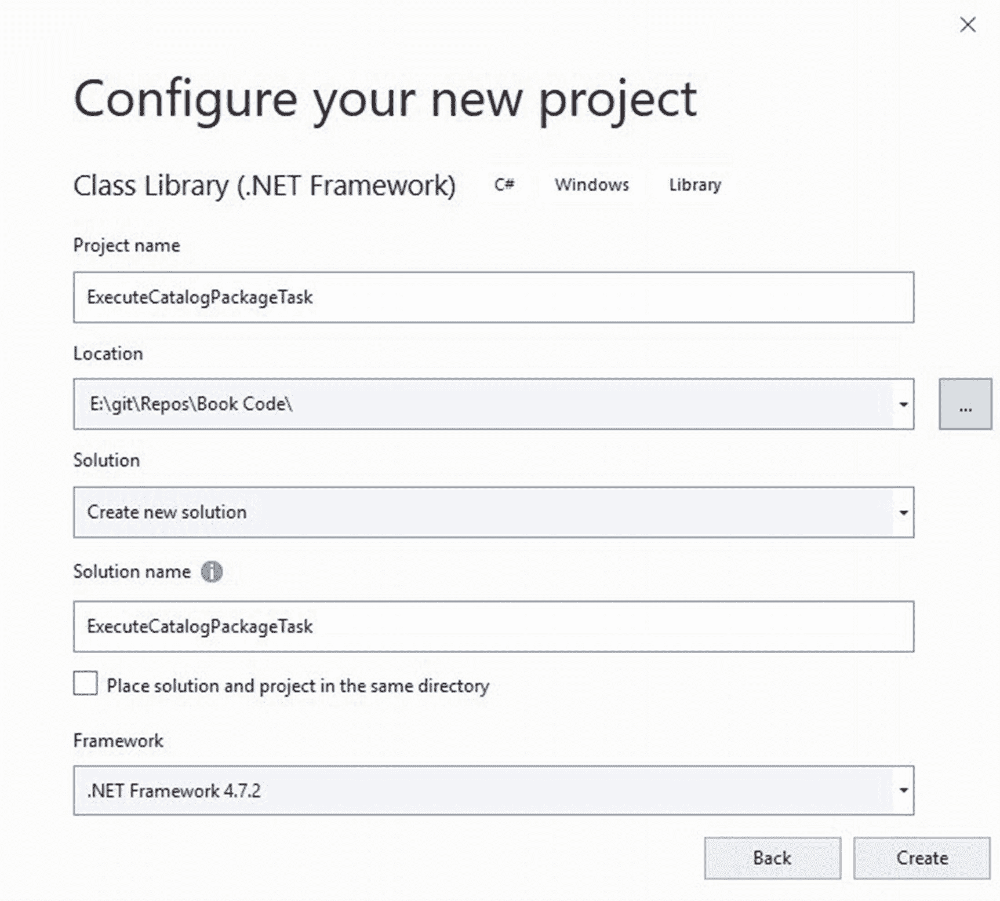

图 3-5：配置并命名新项目

将项目命名为 `ExecuteCatalogPackageTask`。

将项目存储在克隆 Azure DevOps Git 仓库时创建的路径中。

点击“创建”按钮以创建项目。

请注意，`ExecuteCatalogPackageTask` 文件夹现在已存在于 `git\Repos\Book Code\` 文件夹中，如图 3-6 所示：

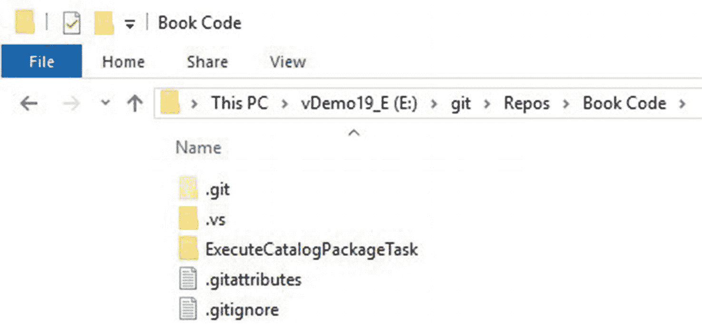

图 3-6：本地仓库中的新 Visual Studio 项目

下一步是重命名在 Visual Studio 项目中创建的、默认名为 `Class1` 的类。在“解决方案资源管理器”中，双击（慢一点）`Class1.cs` 类，`Class1` 将进入重命名编辑模式。将其名称更改为 `ExecuteCatalogPackageTask`，如图 3-7 所示：

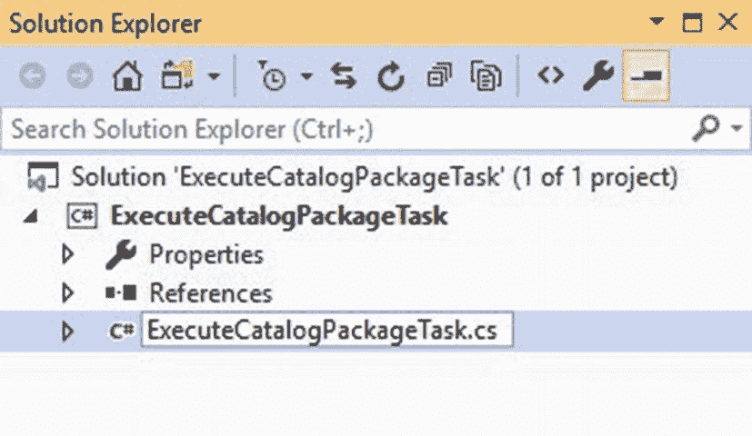

图 3-7：将 Class1 重命名为 ExecuteCatalogPackageTask

当你按下 Enter 键时，系统会提示你将所有对 `Class1` 的引用更改为 `ExecuteCatalogPackageTask`。点击“是”按钮，如图 3-8 所示：

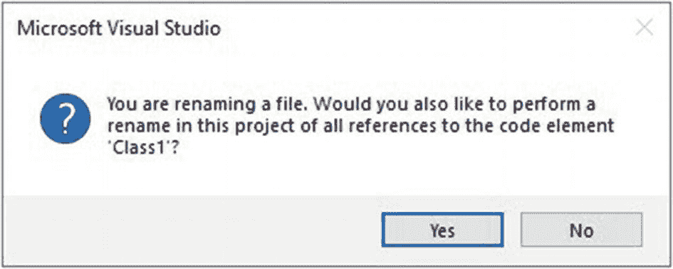

图 3-8：重命名所有引用

这些是使用 Visual Studio 2019 创建自定义 SSIS 任务的第一步。经验丰富的开发人员可能会觉得这些信息微不足道——本书并非为经验丰富的开发人员而写。

本节的关键要点是：记住以管理员身份启动 Visual Studio。

## 添加引用

.Net Framework 的发明是为了让开发人员能多睡几个小时。它封装了许多开发人员可以在应用程序中使用的通用函数。这已经很酷了，但更酷的是许多平台和应用程序通过 .Net 程序集公开其功能。而最酷的是（就我们的目的而言），SSIS 程序集允许我们创建自定义任务！

我们首先必须引用这些 .Net Framework 程序集。要引用程序集，请打开 `ExecuteCatalogPackageTask` Visual Studio 解决方案（如果尚未打开）。在“解决方案资源管理器”中，点击 `ExecuteCatalogPackageTask` 项目，然后展开“引用”虚拟文件夹，如图 3-9 所示：

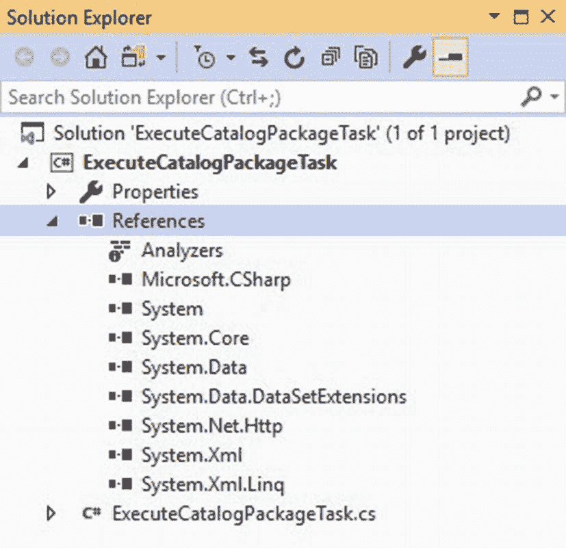

图 3-9：解决方案资源管理器中的项目引用

让我们添加对一个 SSIS 程序集的引用。右键单击“引用”虚拟文件夹，然后单击“添加引用”，如图 3-10 所示：

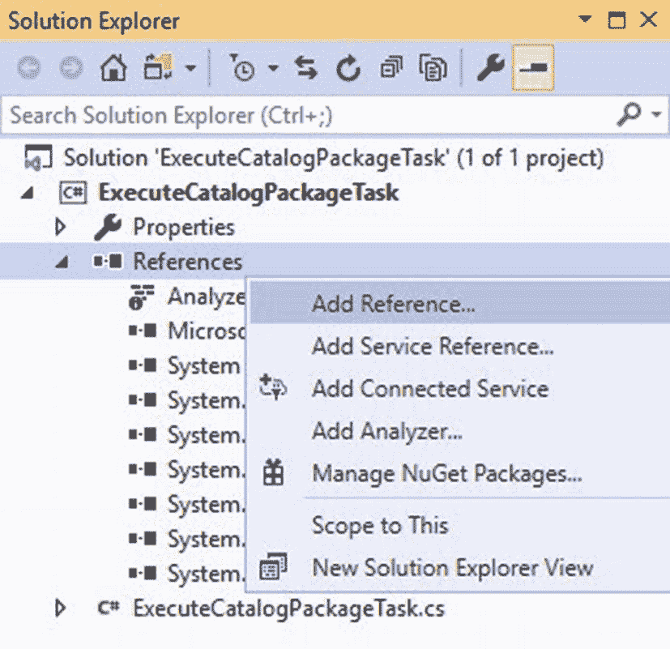

图 3-10：准备添加引用

这将打开“引用管理器”窗口。展开左侧“引用类型”列表中的“程序集”项。在“程序集”列表中点击“扩展”。滚动直到找到 `Microsoft.SqlServer.ManagedDTS` 程序集，并勾选其复选框，如图 3-11 所示：

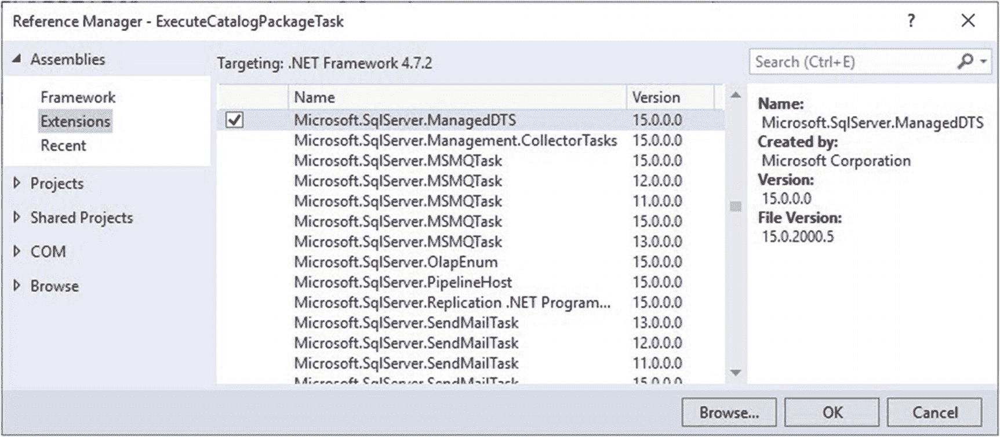

图 3-11：从“程序集\扩展”添加 Microsoft.SqlServer.ManagedDTS 程序集引用

如果该程序集不在“程序集\扩展”列表中，你将需要浏览查找 `Microsoft.SqlServer.ManagedDTS` 程序集。在我的虚拟机上，我在以下文件夹中找到了该文件：

`C:\Windows\Microsoft.NET\assembly\GAC_MSIL\Microsoft.SqlServer.ManagedDTS\v4.0_15.0.0.0__89845dcd8080cc91\`

添加对 `Microsoft.SqlServer.ManagedDTS` 程序集的引用，如图 3-12 所示：

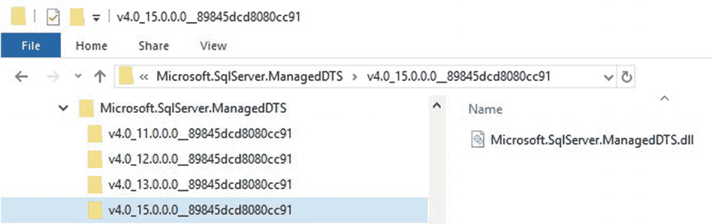

图 3-12：从文件系统添加 Microsoft.SqlServer.ManagedDTS 程序集引用

当你点击“确定”按钮后，“引用”虚拟文件夹显示如下，如图 3-13 所示：

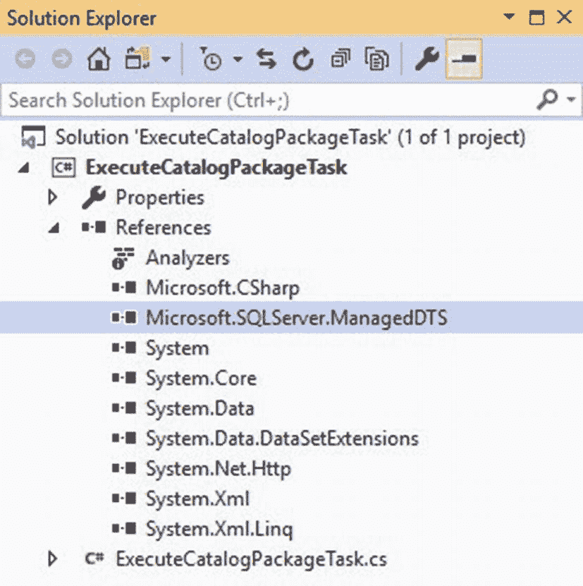

图 3-13：引用已成功添加

### 结论

在开发的这个阶段，我们已经

*   创建并配置了一个 Azure DevOps 项目
*   将 Visual Studio 连接到 Azure DevOps 项目
*   在本地克隆了 Azure DevOps Git 仓库
*   创建了一个 Visual Studio 项目
*   为 Visual Studio 项目添加了一个引用

是时候签入我们的代码了。

