# 4. 在项目代码中签入

我刚看了看手表……没错……现在是 2020 年。**早就该**所有开发者都使用某种形式的源代码控制（或版本控制）了。根据我的经验，开发者有两种类型：

1.  使用源代码控制的开发者
2.  *最终会* 使用源代码控制的开发者

为什么这么说？如果你不使用源代码控制，就会丢失代码。丢失代码会让你心碎，然后你就会开始使用源代码控制了。

## 在 Azure DevOps 中初始化源代码控制

让我们检查一下项目在 Azure DevOps 中的当前状态。点击左侧菜单中的 `Repos` 项，如图 4-1 所示：

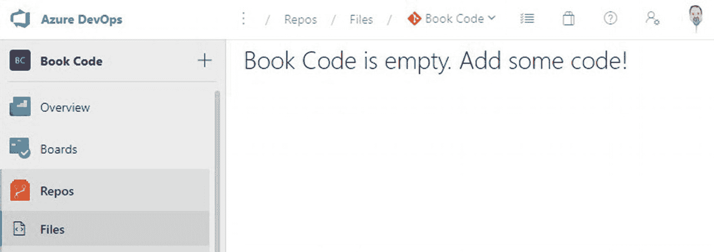

图 4-1：Azure DevOps 当前没有代码

让我们检查一下本地 Git 仓库，如图 4-2 所示：

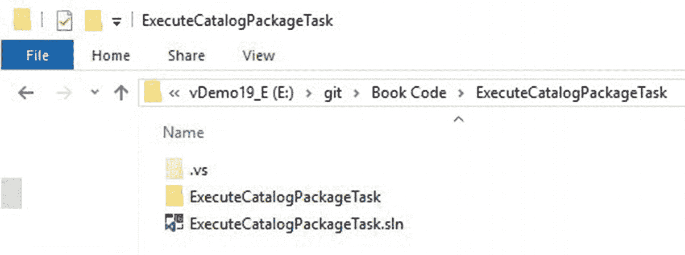

图 4-2：本地仓库中的 `ExecuteCatalogPackageTask`

接下来就是本章要解决的核心问题：如何将我们最新的 Visual Studio 项目代码导入 Azure DevOps？继续阅读以了解方法。

首先，打开 Visual Studio 团队资源管理器（如果已关闭，请点击 `View` ➤ `Team Explorer`）。点击 `Team Explorer Home` 按钮，然后点击 `Changes` 磁贴，如图 4-3 所示：

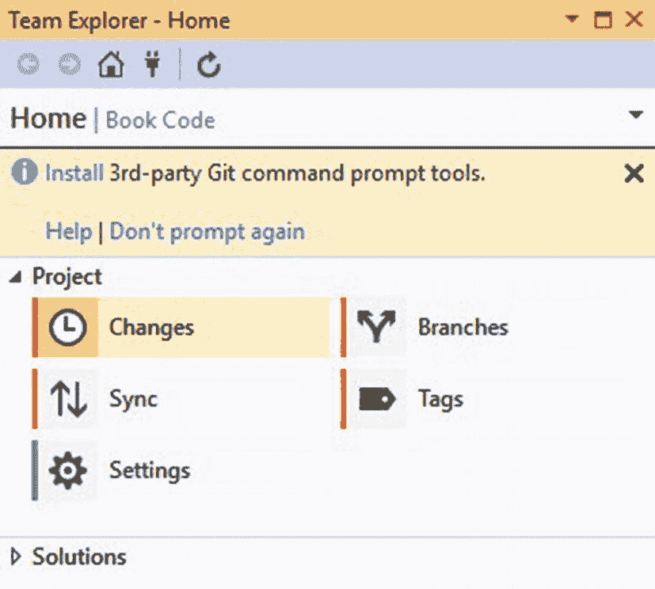

图 4-3：点击团队资源管理器“更改”磁贴

当你点击 `Changes` 按钮时，名为 `Team Explorer – Changes` 的对话框将显示，如图 4-4 所示：

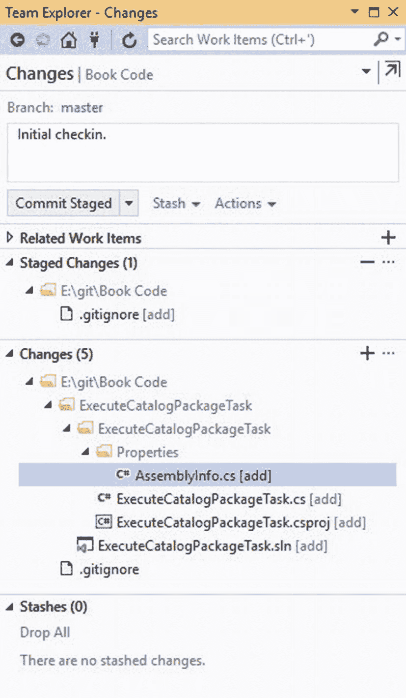

图 4-4：团队资源管理器 – 更改

添加一条提交消息。为什么？提交注释是为了“未来的你”和/或将来可能查看你代码的其他团队成员。如果你在几个月——甚至几年后——回顾这段代码，“未来的你”会感谢这个提醒。将来审查你代码的新成员或其他团队成员也会从有用的提交消息中受益。

如果 `Commit Message` 文本框下方的按钮标签是“`Commit Staged`”，那么点击 `Commit Staged` 按钮。团队资源管理器会显示一个结果消息，如图 4-5 所示：

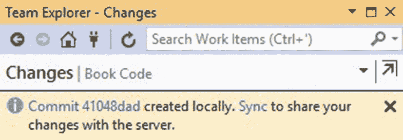

图 4-5：查看本地已提交的暂存更改消息

为项目代码的初始签入添加一条提交消息，然后点击 `Commit All` 按钮，用项目代码的最新版本更新本地仓库，如图 4-6 所示：

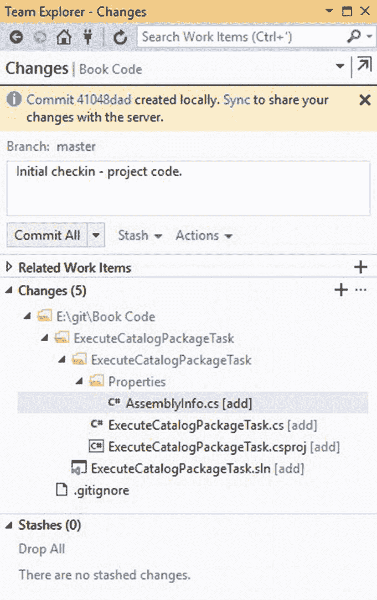

图 4-6：准备提交所有项目代码

团队资源管理器会显示一个结果消息，如图 4-7 所示：

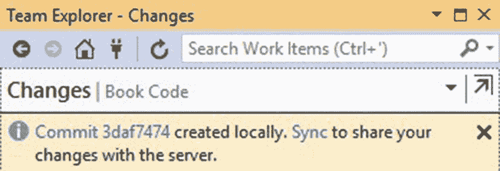

图 4-7：项目代码已本地提交的消息

此示例适用于单个开发者。这个例子并未穷尽 Git 或 Azure DevOps 的全部功能。

此时，Azure DevOps Book Code 项目仍然是空的。点击本地已提交消息中的 `Sync` 链接，以将项目代码更新到本地 Git 仓库。同步后，团队资源管理器准备将本地仓库的更改推送到 Azure DevOps Book Code 项目，如图 4-8 所示：

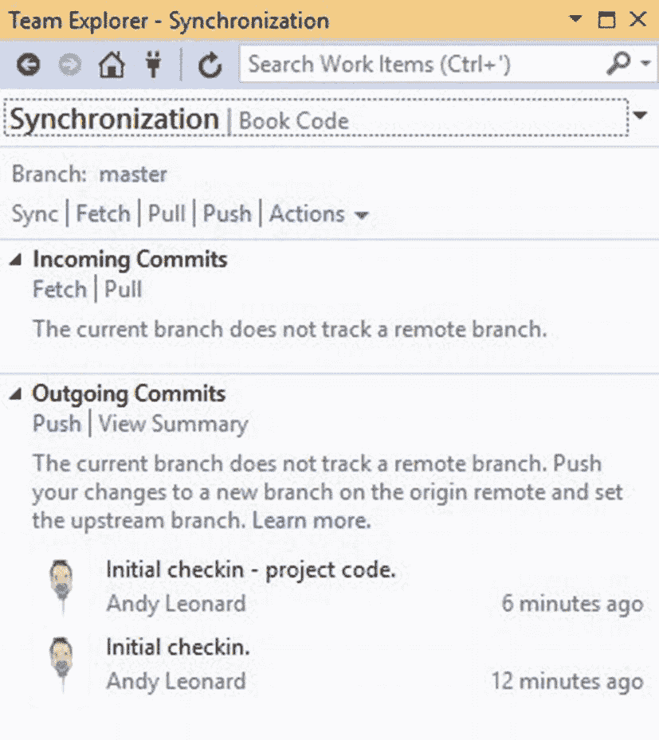

图 4-8：团队资源管理器准备推送

在 `Outgoing Commits` 部分，点击 `Push` 链接，将项目代码从本地仓库复制到 Azure DevOps Book Code 仓库。如果推送成功，团队资源管理器会显示类似于图 4-9 所示的通知：

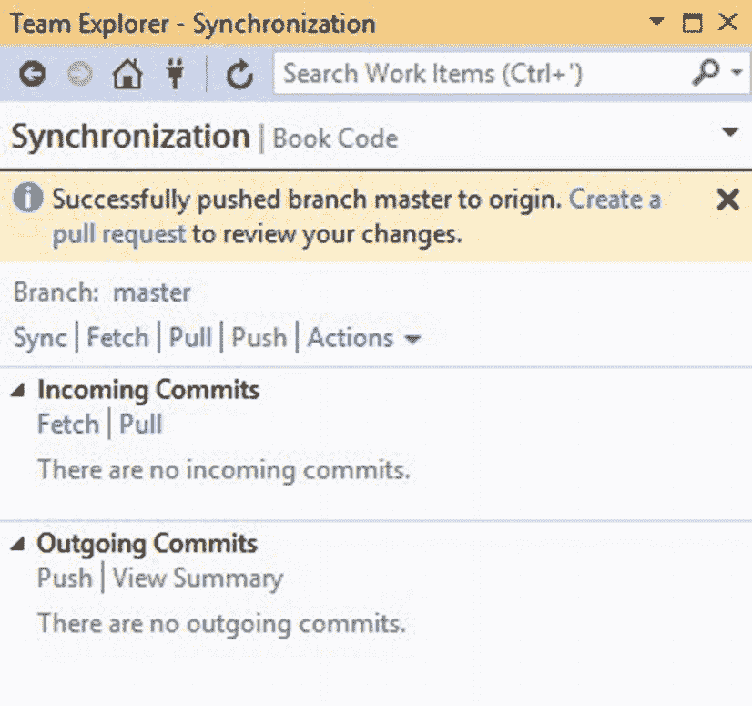

图 4-9：团队资源管理器显示推送成功消息

Azure DevOps Book Code 仓库现在包含了我们最新项目代码的副本，如图 4-10 所示：

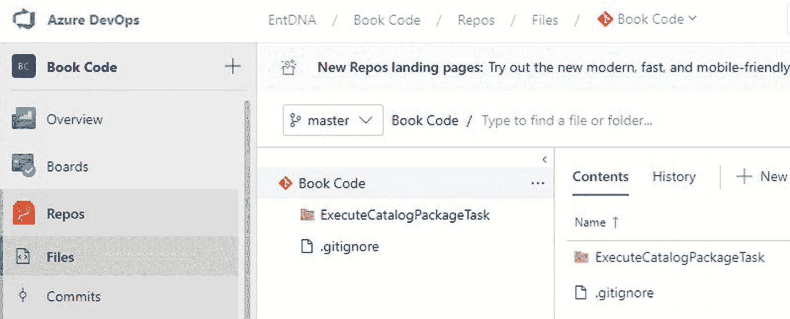

图 4-10：Azure DevOps Book Code 仓库

在我们单开发者的场景中，此时我们*仅* 使用 Azure DevOps Book Code 仓库进行源代码控制。

蓝色的锁图标标记了已签入源代码控制的项，如图 4-11 所示：

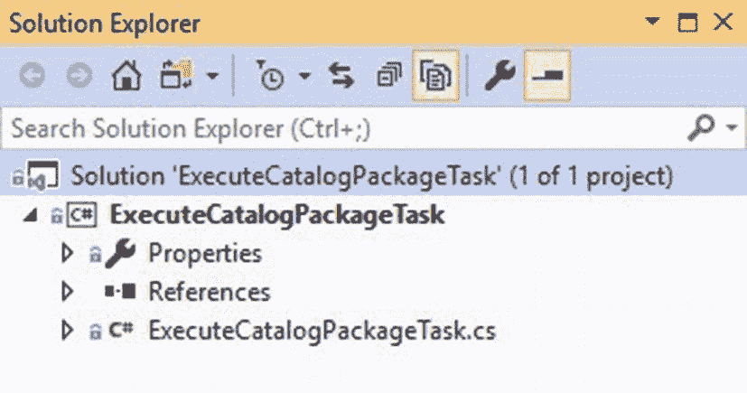

图 4-11：观察已签入的项目代码

### 结论

至此，在开发过程中，我们已经：

-   创建并配置了一个 Azure DevOps 项目
-   将 Visual Studio 连接到 Azure DevOps 项目
-   在本地克隆了 Azure DevOps Git 仓库
-   创建了一个 Visual Studio 项目
-   向 Visual Studio 项目添加了引用
-   执行了项目代码的初始签入

接下来，我们要对程序集进行签名。

