# 5. 对程序集进行签名

为了能在 SSIS 项目中被 Visual Studio 使用，一个 SSIS 自定义任务程序集*必须* 被签名。.Net 框架包含了用于创建和管理“密钥”文件的工具，这些文件用于对程序集进行签名。


## 准备添加密钥

我建议首先以管理员身份打开命令窗口。打开 Windows 开始菜单并找到命令提示符。右键单击命令提示符，将鼠标悬停在“更多”上，然后单击“以管理员身份运行”，如图 5-1 所示：
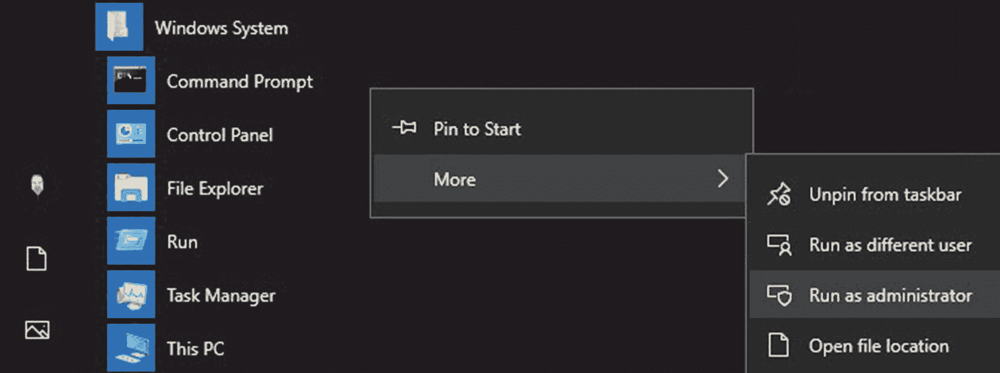
图 5-1 以管理员身份打开命令窗口

出现提示时，单击“是”按钮，如图 5-2 所示：
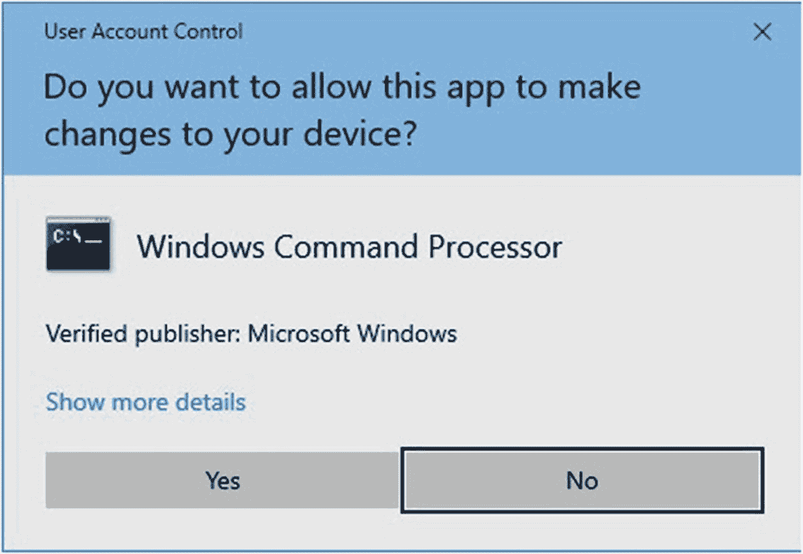
图 5-2 允许命令提示符以管理员身份执行

打开后，管理员命令窗口如图 5-3 所示：
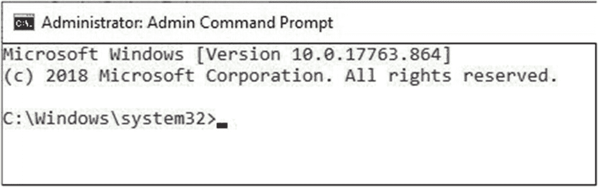
图 5-3 管理员命令窗口

我们正在创建一个程序集（实际上是几个程序集），它将驻留在全局程序集缓存（GAC）中。为了能存在于 GAC 中，程序集必须被签名。我们使用强名称密钥文件来签名程序集。在当前项目配置阶段，我们需要生成一个适合为我们程序集签名的密钥。对此，有好消息也有坏消息：
*   好消息：微软提供了强名称工具（`sn.exe`）来创建密钥。
*   坏消息：强名称工具会随着 .Net Framework 的新版本而变动。

如果你在 Windows Server 2019 上开发，可以在 `C:\Program Files (x86)\Microsoft SDKs\Windows\v10.0A\bin\NETFX 4.8 Tools\` 文件夹中找到强名称工具。该工具名为 `sn.exe`，因此完整路径是 `C:\Program Files (x86)\Microsoft SDKs\Windows\v10.0A\bin\NETFX 4.8 Tools\sn.exe`。如果你是在遥远的未来读到这些文字并嘲笑 Windows Server 2019 有多么过时，请搜索 `sn.exe` 并使用你找到的最新版本（聪明人）。

提示
你可以用任何喜欢的方式管理此过程。我建议你创建一个文本文件来保存与密钥相关的命令行。我坚信未来的你会感谢现在的你。

我首先向项目添加一个新项，如图 5-4 所示：
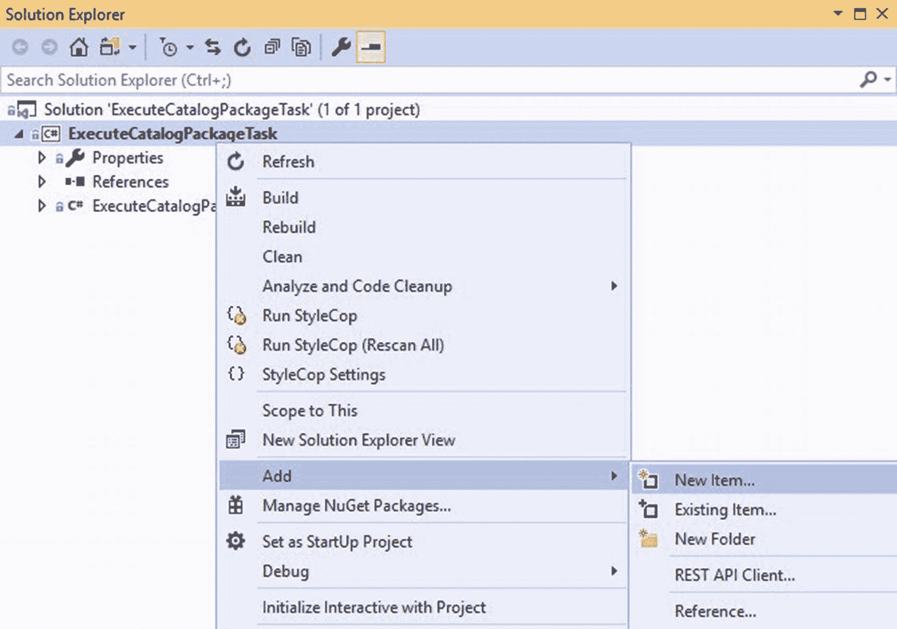
图 5-4 向项目添加新项

我选择一个文本文件，并将我的笔记文件命名为 `Notes.txt`（因为我感觉特别有创意），如图 5-5 所示：
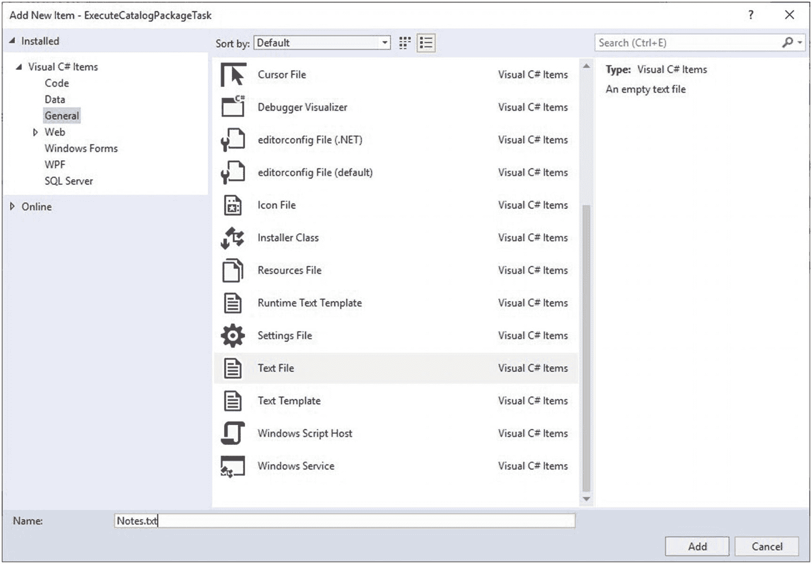
图 5-5 命名笔记文件

接下来我粘贴以下几行：
```
-- key generation
"C:\Program Files (x86)\Microsoft SDKs\Windows\v10.0A\bin\NETFX 4.8 ➥ Tools\sn.exe" -k key.snk
"C:\Program Files (x86)\Microsoft SDKs\Windows\v10.0A\bin\NETFX 4.8 ➥ Tools\sn.exe" -p key.snk public.out
"C:\Program Files (x86)\Microsoft SDKs\Windows\v10.0A\bin\NETFX 4.8 ➥ Tools\sn.exe" -t public.out
```

第一行创建公钥/私钥对并将它们放入名为 `key.snk` 的文件中。
第二行将密钥对的公共部分提取到名为 `public.out` 的文件中。
第三行从 `public.out` 文件中读取公钥。

注意
`➥` 符号表示这应该都在一行上，但 Microsoft Word 无法创建足够宽的行来完整呈现此代码。

`Notes.txt` 现在出现在解决方案资源管理器中，如图 5-6 所示：
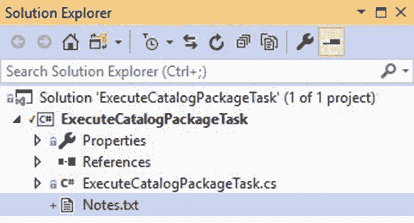
图 5-6 解决方案资源管理器中的 Notes.txt

`Notes.txt` 文件也被添加到项目文件夹中，如图 5-7 所示：
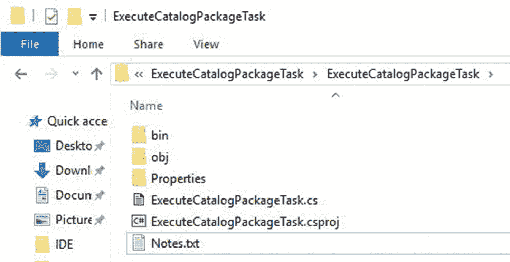
图 5-7 项目文件夹中的 Notes.txt

### 创建密钥

在命令窗口中，导航到 `ExecuteCatalogPackageTask` 项目目录。该项目目录将包含 `ExecuteCatalogPackageTask.cs`、`ExecuteCatalogPackageTask.csproj` 以及 `Notes.txt` 文件，如图 5-8 所示：
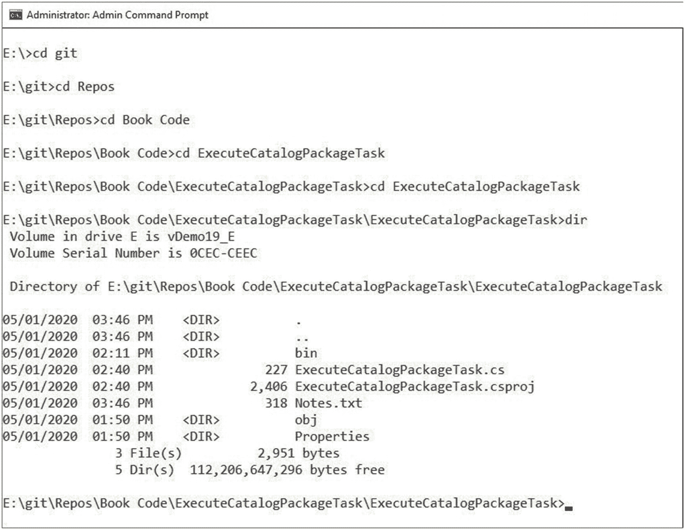
图 5-8 导航到 ExecuteCatalogPackageTask 项目目录

如果尚未打开，请在 Visual Studio 的解决方案资源管理器中打开 `Notes.txt`。选择第一行，复制它，然后粘贴到命令窗口中，如图 5-9 所示：
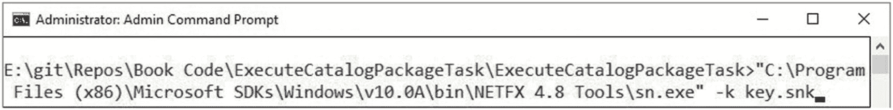
图 5-9 粘贴到命令窗口

按 Enter 键执行 `sn.exe` 命令，在 `ExecuteCatalogPackageTask` 项目目录中创建密钥文件，如图 5-10 所示：
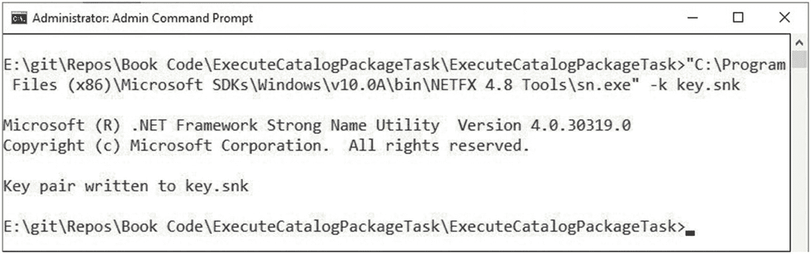
图 5-10 Key.snk 文件已创建

我们需要从 `key.snk` 文件中获取公钥的公钥/私钥对。首先，使用 `Notes.txt` 中存储的第二行将公钥提取到名为 `public.out` 的文件中，如图 5-11 所示：
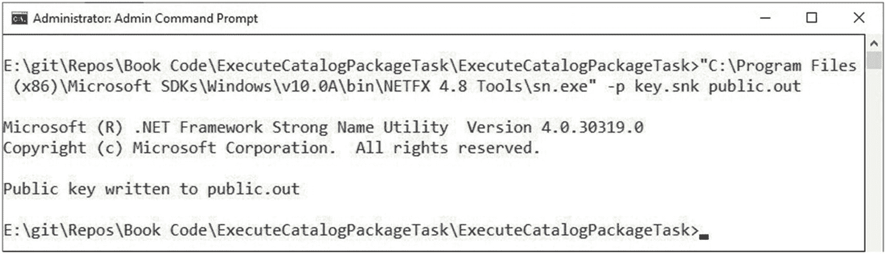
图 5-11 公钥提取

最后，我们需要从提取到的文件中读取公钥值，如图 5-12 所示：
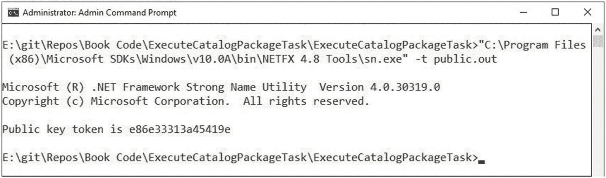
图 5-12 读取公钥

使用鼠标左键高亮显示公钥值，如图 5-13 所示：
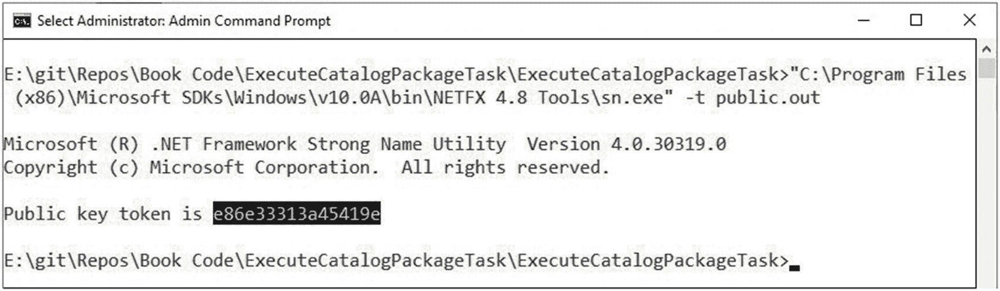
图 5-13 在命令窗口中选择公钥

右键单击高亮显示的文本。请注意，不会出现上下文菜单。文本已复制到剪贴板的迹象是高亮显示和标题栏中的“选择”文本消失，如图 5-14 所示：
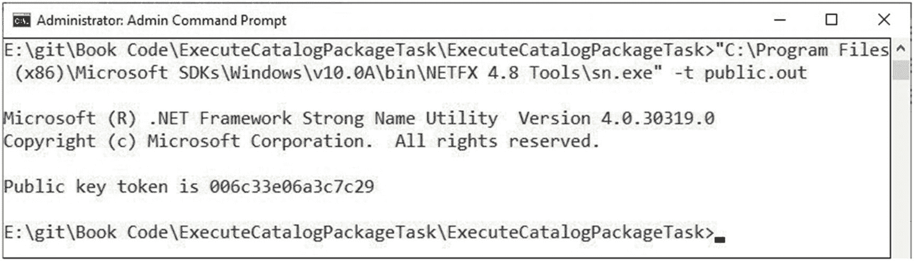
图 5-14 文本已选定到剪贴板

将公钥存储在 Visual Studio 中 `ExecuteCatalogPackageTask.cs` 类的注释中。我们稍后将在后面用到它，如图 5-15 所示：
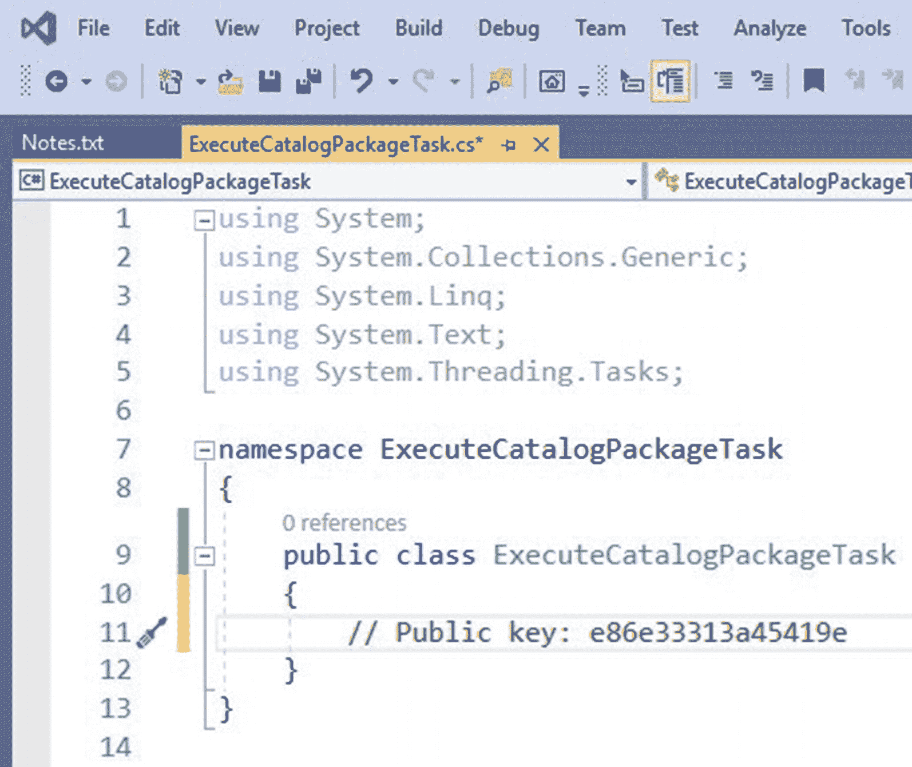
图 5-15 公钥已存储


### 应用密钥与版本控制

## 应用密钥

密钥已经创建完毕，我们也已提取了所需的元数据。现在是时候将密钥文件应用到解决方案中了。在 `解决方案资源管理器` 中，打开 `属性`，如图 5-16 所示：

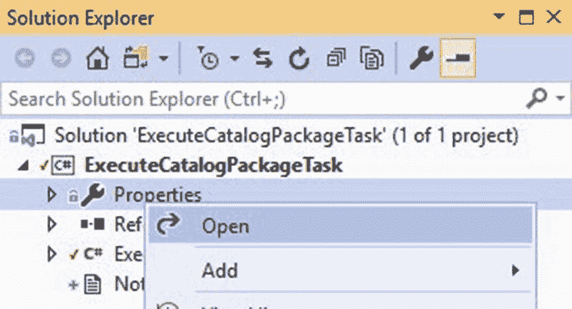

图 5-16 打开属性

`属性` 页面打开后，导航到 `签名` 页。勾选 `为程序集签名` 复选框。点击 `选择强名称密钥文件` 下拉菜单并选择 `<浏览...>`，如图 5-17 所示：

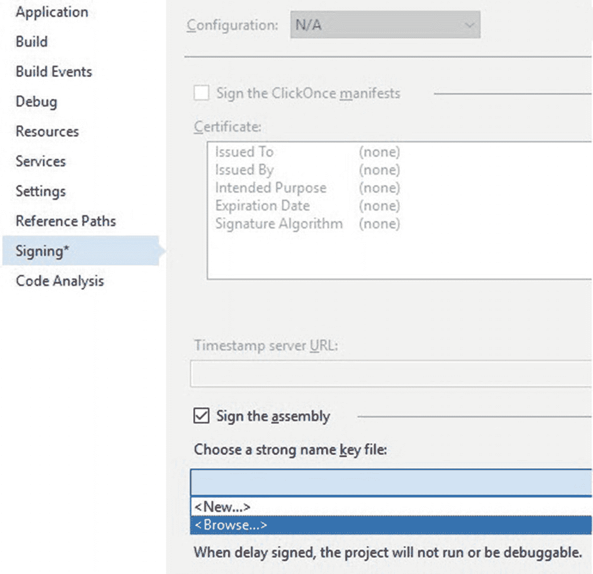

图 5-17 为程序集签名

浏览到 `ExecuteCatalogPackageTask` 项目文件夹中的 `key.snk` 文件，如图 5-18 所示：

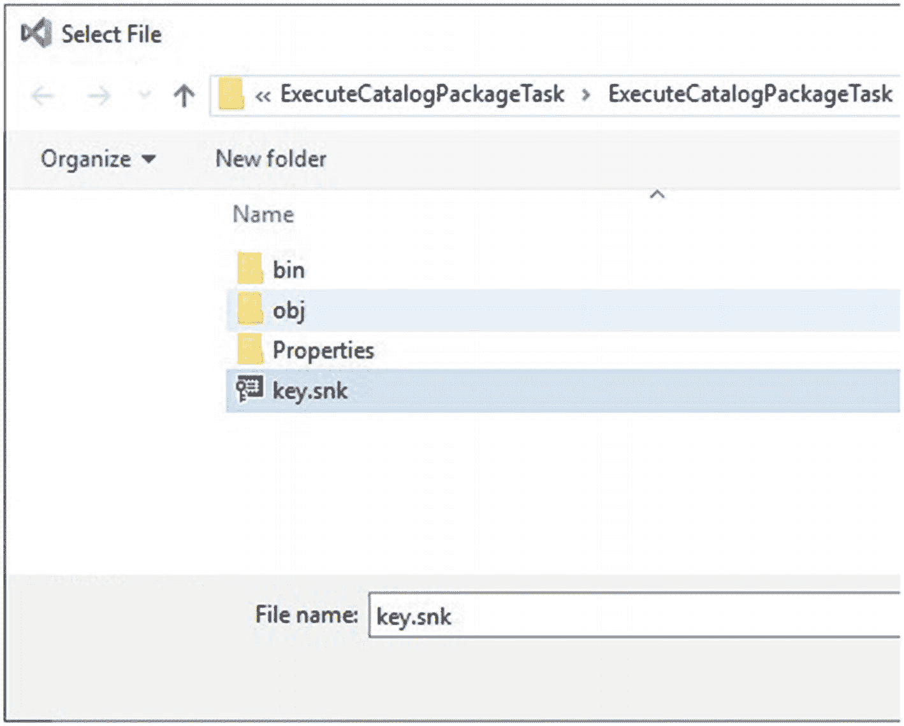

图 5-18 导航至 `key.snk` 文件

点击 `打开` 按钮以使用 `key.snk` 文件为程序集签名，如图 5-19 所示：

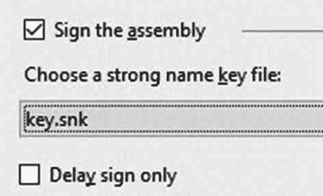

图 5-19 已签名的程序集

点击 `全部保存` 按钮（或点击 `文件` > `全部保存`）以保存你的 Visual Studio 解决方案。

## 签入变更

在我们签入最新变更之前，请注意这是一个单开发者项目。Git 支持多种版本控制场景，尤其适用于分布式开发团队。此时发起拉取请求没有意义，因为我是代码的唯一审阅者。因此，下一步操作与我们初始的签入步骤相同。

打开 `团队资源管理器`，如图 5-20 所示：

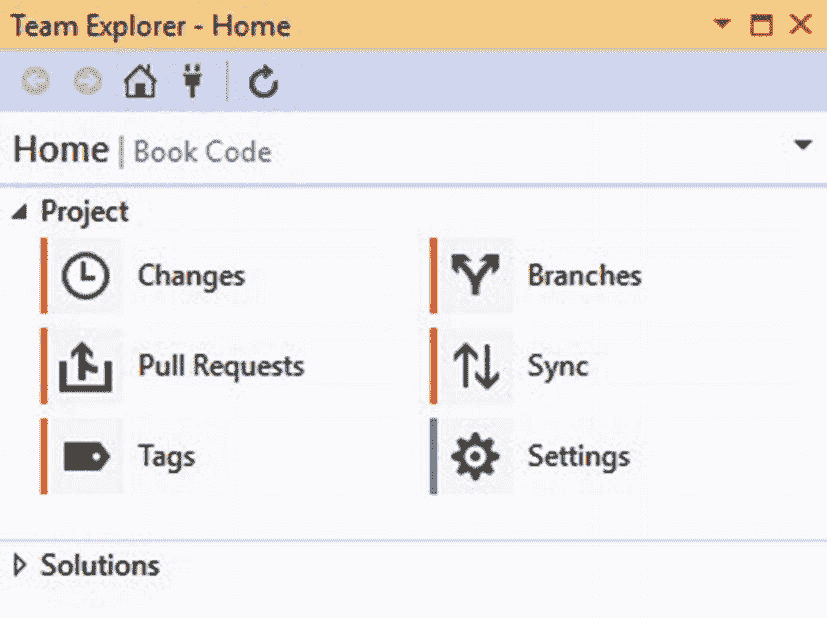

图 5-20 查看团队资源管理器

点击 `更改` 磁贴并添加提交信息，如图 5-21 所示：

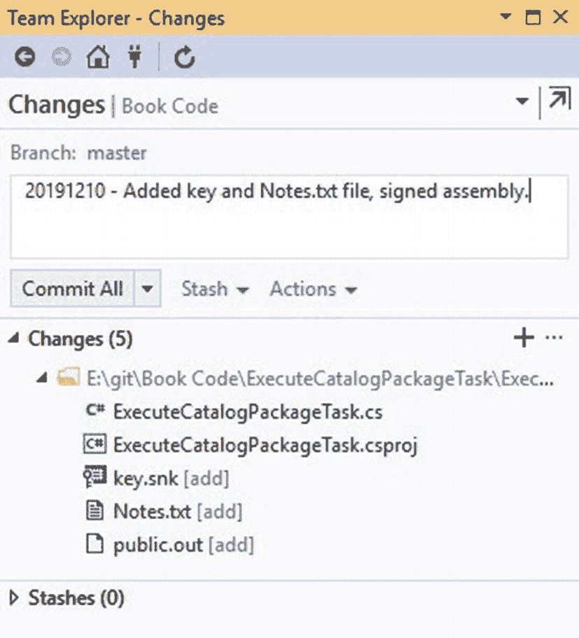

图 5-21 添加提交信息

我可以通过点击 `全部提交` 按钮上的下拉箭头来节省一个步骤。点击 `全部提交并推送` 可以按顺序完成这两个步骤，如图 5-22 所示：

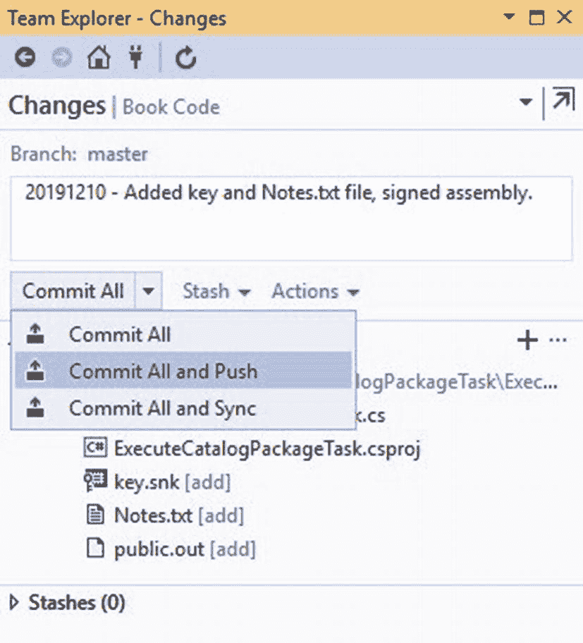

图 5-22 准备 `全部提交并推送`

操作完成后，`团队资源管理器` 界面如图 5-23 所示：

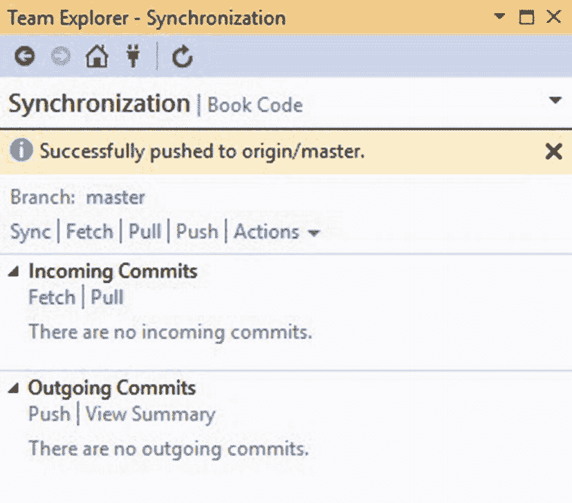

图 5-23 更改已签入并推送到 Azure DevOps 仓库

`解决方案资源管理器` 反映出新的工件已经签入，如图 5-24 所示：

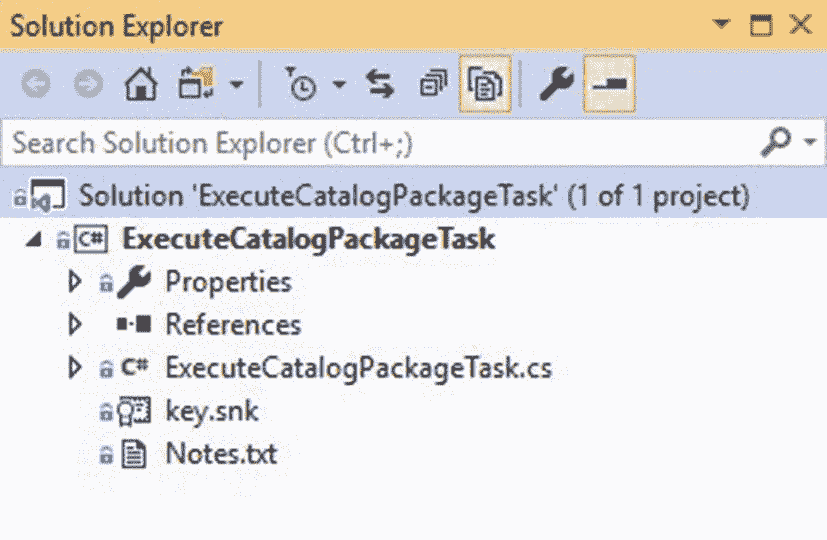

图 5-24 签入后的解决方案资源管理器

新的项目工件 `key.snk` 和 `Notes.txt` 现在可以在 Azure DevOps 仓库中找到，如图 5-25 所示：

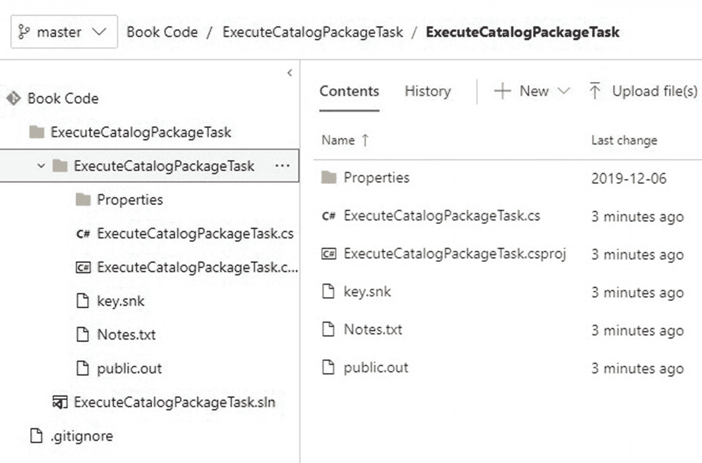

图 5-25 Azure DevOps 仓库中的新项目工件

## 总结

至此，在开发过程中我们已经：

*   创建并配置了一个 Azure DevOps 项目
*   将 Visual Studio 连接到 Azure DevOps 项目
*   在本地克隆了 Azure DevOps Git 仓库
*   创建了一个 Visual Studio 项目
*   向 Visual Studio 项目添加了引用
*   对项目代码进行了初始签入
*   为程序集签名
*   签入了一次更新

下一步，我们将为程序集签名。

