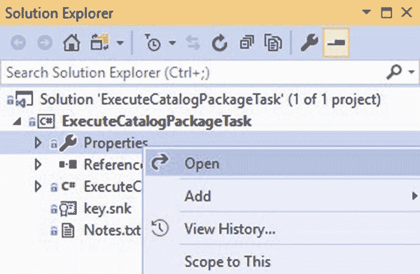
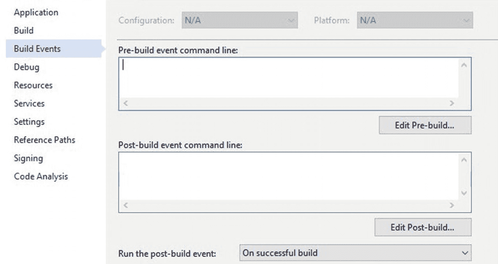
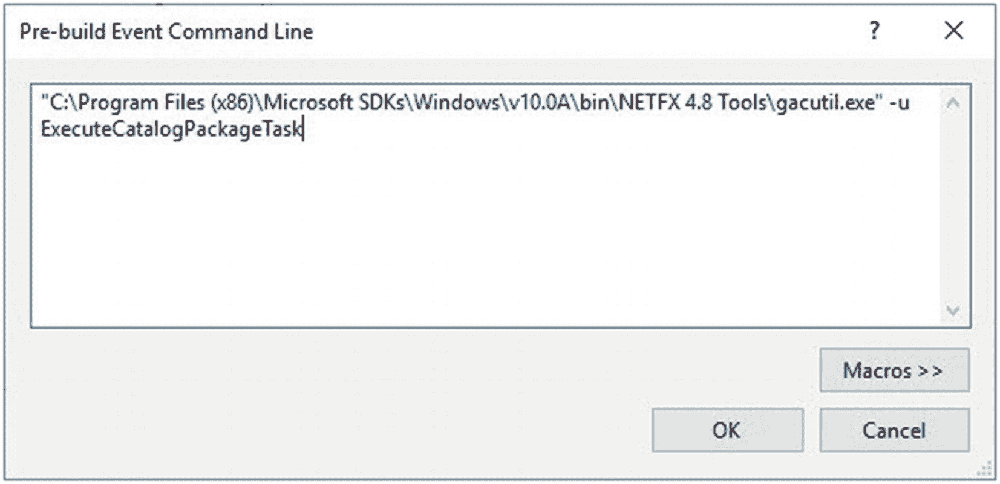
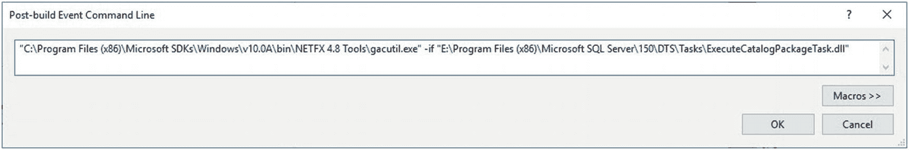
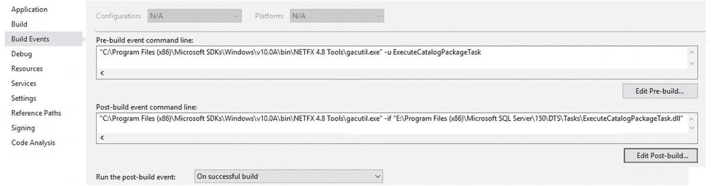
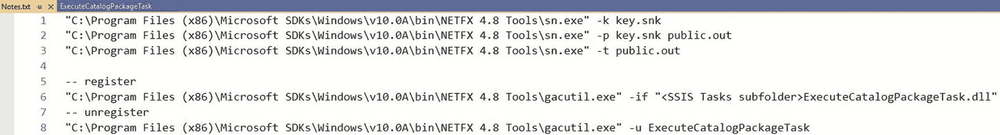
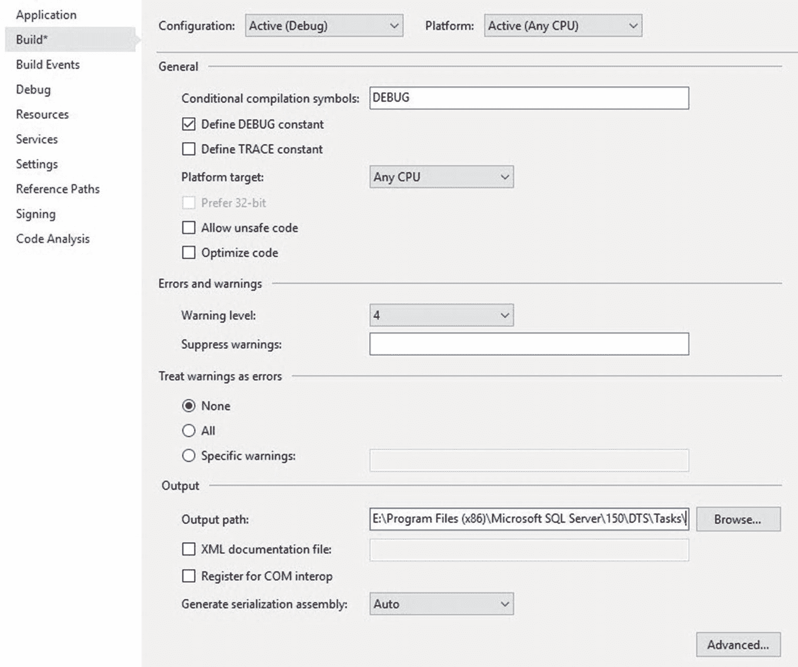
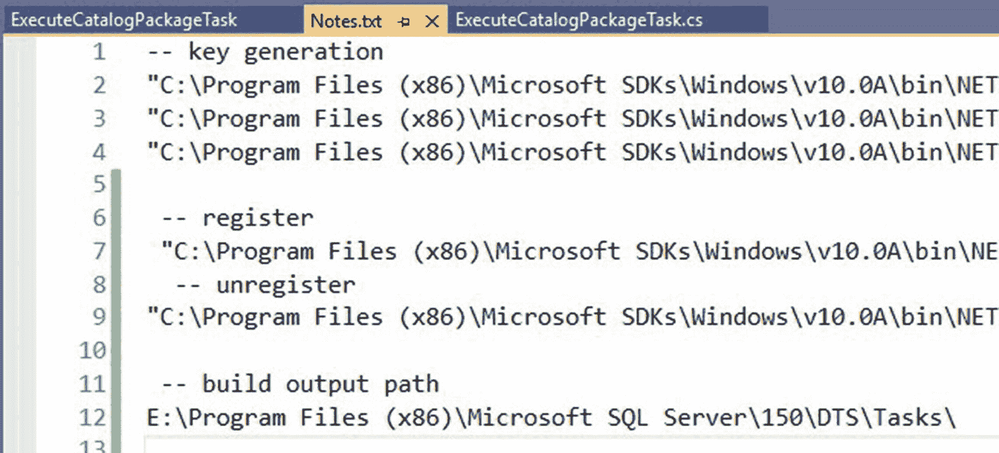

# 准备构建

构建自定义 SSIS 任务既不简单也不容易。你正在构建用于构造软件的组件。也许你以前做过这个。但很多人没有。

构建程序集是直接的，包括两个步骤：

1.  构建程序集。
2.  在全局程序集缓存 (`GAC`) 中注册该程序集。

当代码未按预期执行时，能够优雅地恢复是关键。如果构建/注册过程未能达到预期结果，开发者可以采取以下步骤恢复：

*   从 `GAC` 中注销程序集。
*   清理 Visual Studio 解决方案。
*   在 Visual Studio 解决方案中构建程序集。
*   在 `GAC` 中注册程序集。

上述步骤几乎能像我们陷入麻烦一样快地让开发者摆脱困境，这是一件好事。

## 使用生成事件进行注册/注销

`Gacutil` 是用于在全局程序集缓存 (`GAC`) 中 `注册` 和 `注销` 程序集的实用工具。如果你正在按照描述构建示例代码，有个好消息：C# 支持生成事件——这允许开发者自动化在 `GAC` 中注册和注销程序集的过程。

### 查找 `gacutil.exe`

就像第 5 章提到的 `sn.exe`（强名称）实用工具一样，`gacutil.exe` 随每个 .Net Framework 版本发布而移动。在撰写本文时，该版本位于 `C:\Program Files (x86)\Microsoft SDKs\Windows\v10.0A\bin\NETFX 4.8 Tools\` 文件夹中。


### 添加构建事件

Visual Studio 必须以管理员身份启动的原因之一，是为了支持在全局程序集缓存（即 `GAC`）中取消注册和注册构建输出文件。大多数非管理员帐户缺乏在 `GAC` 中取消注册和注册程序集的权限。

打开 `ExecuteCatalogPackageTask` 解决方案，然后打开其属性，如图 6-1 所示：



图 6-1：打开项目属性

当属性窗口显示时，点击“生成事件”页面，如图 6-2 所示：



图 6-2：生成事件页面

点击“编辑 pre-build”按钮，并添加 `gacutil` 取消注册命令，如清单 6-1 和图 6-3 所示：



图 6-3：Pre-build 事件命令行

```
"C:\Program Files (x86)\Microsoft SDKs\Windows\v10.0A\bin\NETFX 4.8 ➥ Tools\gacutil.exe" -u ExecuteCatalogPackageTask
清单 6-1：gacutil 取消注册命令语法
```

点击“编辑 post-build”按钮，并添加 `gacutil` 注册命令，如清单 6-2 和图 6-4 所示：



图 6-4：Post-build 事件命令行

```
"C:\Program Files (x86)\Microsoft SDKs\Windows\v10.0A\bin\NETFX 4.8 ➥ Tools\gacutil.exe" -if "E:\Program Files (x86)\Microsoft SQL ➥ Server\150\DTS\Tasks\ExecuteCatalogPackageTask.dll"
清单 6-2：gacutil 注册命令语法
```

`gacutil` 的“register”（注册）命令将 `ExecuteCatalogPackageTask` 动态链接库（`DLL`）文件注册到全局程序集缓存（`GAC`）。`gacutil` 的“unregister”（取消注册）命令则取消注册同一个程序集——实际上是从 `GAC` 中移除它。

注意：上面清单中的 `➥` 字符是续行符。请`不要`将其表示为 `CRLF`（回车换行符）换行。请在整个命令字符串输入完毕之前不要按 Enter 键。

配置完成后，“生成事件”页面将如图 6-5 所示：



图 6-5：已配置的生成事件

上面列出的 `gacutil` 取消注册和注册命令分别是故障恢复的第一步和最后一步。除了配置 Pre-build 和 Post-build 事件外，开发者也可以在以“以管理员身份运行”权限打开的命令窗口中手动执行 `gacutil` 取消注册和注册命令——类似于第 5 章讨论和演示的密钥生成过程。因此，请将 `gacutil` 取消注册和注册命令添加到 `Notes.txt` 文件中，如图 6-6 所示：



图 6-6：将 gacutil 取消注册和注册命令添加到 Notes.txt

开发者可以添加 Pre-build 和 Post-build 事件来自动执行 `gacutil` 取消注册和注册命令。

执行此步骤——即执行 `gacutil` 以取消注册和注册程序集——是需要以管理员身份启动 Visual Studio 社区版的原因之一。

### 设置输出路径

Visual Studio 必须以管理员身份启动的另一个原因，是为了支持将系统目录路径——`Program Files (x86)`——用作生成输出目标。与生成事件一样，大多数非管理员帐户缺乏将生成输出配置到系统目录的权限。

找到 SQL Server Data Tools (`SSDT`) 用来构建 SSIS 包的 `SSIS Tasks` 子文件夹。它通常位于 `<安装驱动器>:\Program Files (x86)\Microsoft SQL Server\<版本>\DTS\Tasks`。我将 SQL Server 2019 安装到了 `E:` 盘，因此我的 `SSIS Tasks` 文件夹路径如下：`E:\Program Files (x86)\Microsoft SQL Server\150\DTS\Tasks\`。请将“register”命令（上面列出的以及你的 `Notes.txt` 文件中的）里的 `<SSIS Tasks subfolder>` 占位符替换为你的 `SSIS Tasks` 子文件夹的实际路径。

在项目属性窗口中，点击“生成”页面。将 `SSIS Tasks` 子文件夹路径复制到“生成输出路径”文本框中，如图 6-7 所示：



图 6-7：配置项目生成输出

将项目生成输出路径指向 `DTS\Tasks` 文件夹，意味着程序集将被构建并交付到 `SSDT` 用来填充 SSIS 工具箱的文件夹。注意：这`不是`任务在运行时执行的位置。运行时可执行文件必须注册在 `GAC` 中，因为 SSIS 可执行文件是在运行时从 `GAC` 执行的。

为了稳妥起见，将生成输出路径也添加到 `Notes.txt` 文件中，如图 6-8 所示：



图 6-8：将项目生成输出路径添加到 Notes.txt

### 结论

现在，项目已具备坚实的基础，并通过源代码控制得到保护。我们已将所有必要的组件准备就绪，可以开始编写自定义任务的功能代码了。

现在是执行提交并推送到 Azure DevOps 的好时机。

至此，在开发过程中，我们已经：
*   创建并配置了一个 Azure DevOps 项目
*   将 Visual Studio 连接到 Azure DevOps 项目
*   在本地克隆了 Azure DevOps Git 仓库
*   创建了一个 Visual Studio 项目
*   向 Visual Studio 项目添加了引用
*   对项目代码执行了初始签入
*   对程序集进行了签名
*   签入了一个更新
*   配置了生成输出路径和生成事件

我们现在已准备好开始任务编码。

