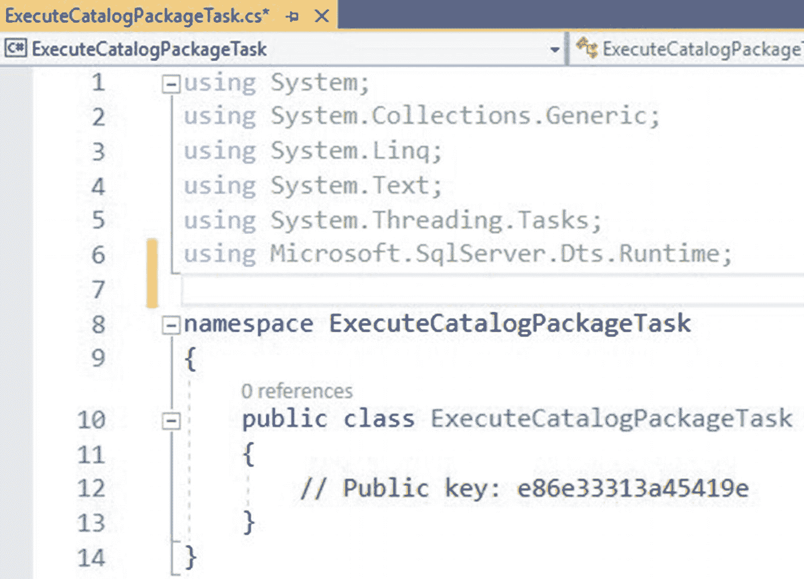
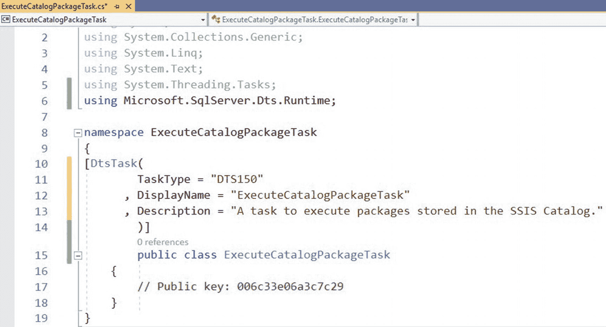
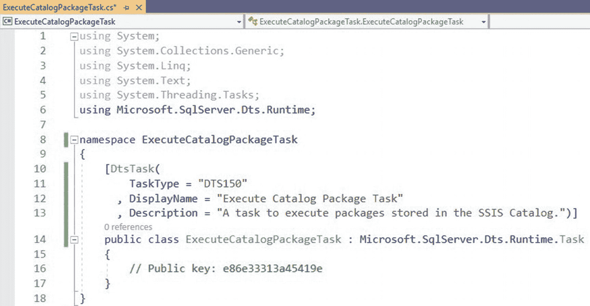
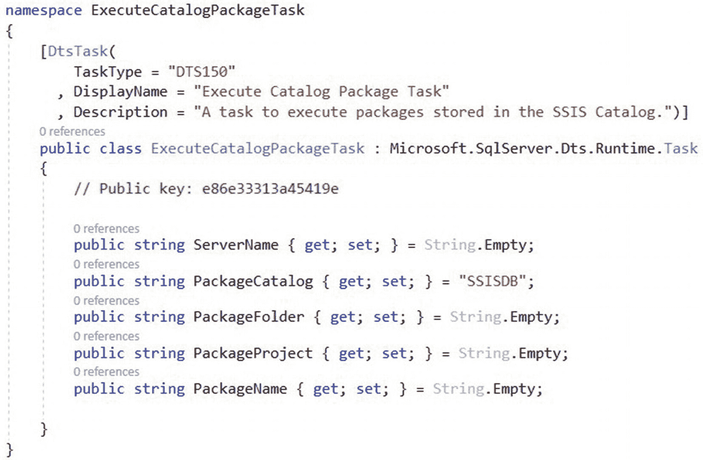
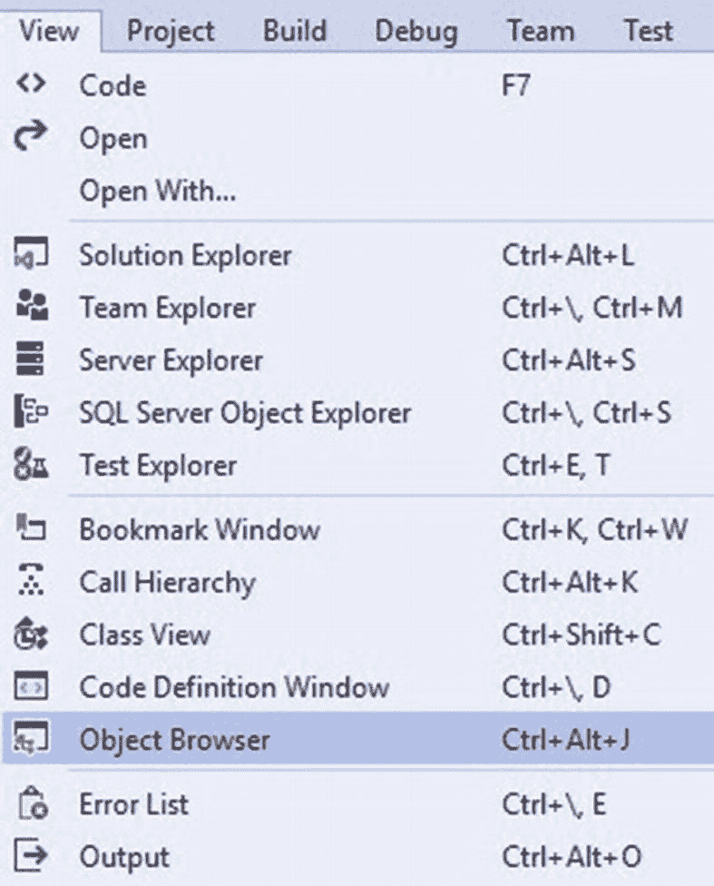
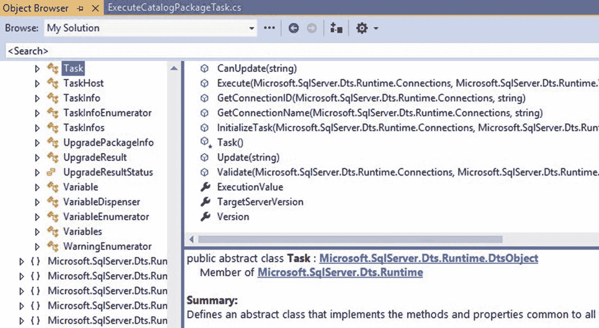
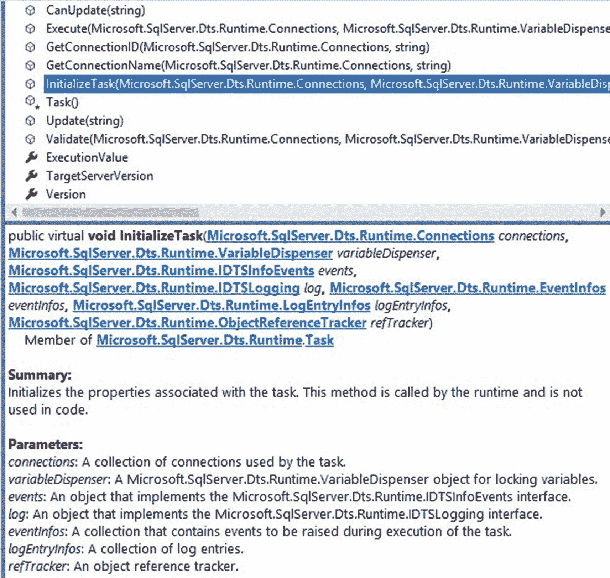
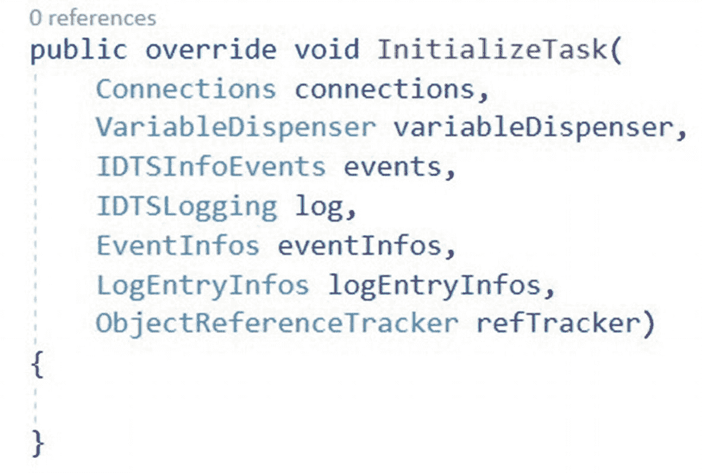

# 7. 任务编码

我们已经通过前几章的准备来到了这一章，但我们终于准备好正式开始编写自定义任务的代码了。我们首先向项目添加引用、修饰类、从基类继承并添加一个属性。

## 使用引用

打开 Visual Studio 解决方案 `ExecuteCatalogPackageTask`。在解决方案资源管理器中，打开类 `ExecuteCatalogPackageTask.cs`。在类的顶部区域，添加代码行 `using Microsoft.SqlServer.Dts.Runtime;`

你的类现在如图 7-1 所示：



图 7-1：使用引用

这行代码允许你使用程序集 `Microsoft.SqlServer.ManagedDTS` 中包含的对象、方法和属性——该引用在第 3 章中已添加。


### 装饰类

如果你在假期临近时读到本文，我猜你在想：“Andy，假期都快结束了，我们现在为什么还要装饰？”但这里说的不是那种装饰。

我们进行“装饰”是为了告知 Visual Studio，这个类是*不同*的。在此例中，这个类之所以不同，是因为它是 SSIS 任务的一部分。我们的装饰代码就放在类定义之前，由清单 7-1 中的代码组成。我们添加这段代码是为了更详细地告诉 Visual Studio 我们正在构建的内容，如图 7-2 所示：



图 7-2：装饰类

```csharp
[DtsTask(
TaskType = "DTS"
, DisplayName = "执行目录包任务"
, Description = "一个用于执行存储在 SSIS 目录中的包的任务。"
)]
```

*清单 7-1：装饰类*

`TaskType` 属性是可选的。SSIS 2019 是版本 150。由于 SSIS 目录是随 SSIS 2012 引入的，有人可能会主张在 `DtsTask` 装饰中允许使用 SSIS 2012（版本 110）作为 `TaskType` 属性的值。因为本项目是使用 Visual Studio 2019 构建的，并采用了撰写本文时的默认 .NET Framework 4.7.2，作者选择针对 SSIS 2019 及更高版本编写此任务。

### 继承 Microsoft.SqlServer.Dts.Runtime.Task

一旦引用和装饰就位，下一步就是配置继承自 `Microsoft.SqlServer.Dts.Runtime.Task` 对象。继承 `Microsoft.SqlServer.Dts.Runtime.Task` 为后续的大量工作（包括代码将要重写的方法）提供了一个框架。

修改类定义以继承自 `Task` 对象，如清单 7-2 所示：

```csharp
public class ExecuteCatalogPackageTask : Microsoft.SqlServer.Dts.Runtime.Task
```

*清单 7-2：继承 Task*

此时，你的类应该如图 7-3 所示：



图 7-3：继承 Task

到目前为止采取的这些操作，共同在我们的代码与之前引用的 `ManagedDTS` 程序集中包含并使用 `using` 语句引入的`基础代码`之间建立了联系。现在，是时候通过添加我们希望任务执行的功能来建立在这个关系之上了。

我们希望我们的任务做什么？我们希望启动一个已部署到 SSIS 目录中的 SSIS 包。为此，我们需要提供承载 SSIS 目录的 SQL Server 实例的名称、包含 SSIS 项目的 SSIS 目录文件夹的名称、包含 SSIS 包的 SSIS 项目的名称，以及 SSIS 包的名称。

### 添加属性

属性提供了一种将内部变量的值暴露给类外部对象的机制。在类中，属性可以使用一个内部私有变量和一个公共可访问的属性来编码。属性也可以在声明时使用 `get`/`set` 来编码。

在类声明之后添加以下代码行来创建属性：

```csharp
public string ServerName { get; set; } = String.Empty;
public string PackageCatalog { get; set; } = "SSISDB ";
public string PackageFolder { get; set; } = String.Empty;
public string PackageProject { get; set; } = String.Empty;
public string PackageName { get; set; } = String.Empty;
```

*清单 7-3：声明任务属性*

此时，类应该如图 7-4 所示：



图 7-4：添加属性

任务属性将包含 `string` 类型的值，我们将在任务内部使用这些 `string` 值。例如，名为 `ServerName` 的属性将显示承载 SSIS 目录的 SQL Server 实例的名称。执行目录包任务将连接到此 SQL Server 实例，以执行存储在该实例 SSIS 目录中的 SSIS 包。

请注意，`PackageCatalog` 属性默认为 “SSISDB”，其他属性默认为 `String.Empty`。在撰写本文时，Microsoft 限制每个 SQL Server 实例只能有一个 SSIS 目录，并将其默认名称设为 “SSISDB”。尽管 `PackageCatalog` 默认为 “SSISDB”，但如果需要，可以覆盖此值。以这种方式编码任务是 `面向未来` 的一个例子，这意味着允许未来情况发生变化。

未赋默认值的属性值为 `null`。`Null` 属性值无法被写入（`set`）或读取（`get`）。未能初始化属性值可能会带来故障排查的挑战。

属性可以是只读、只写的，并且受许多其他条件约束。大多数属性是读写的，就像我们构建的这些属性。例如，如果我们希望将 `PackageCatalog` 属性设为只读，我们会按清单 7-4 所示修改声明代码：

```csharp
public string PackageCatalog { get; } = "SSISDB";
```

*清单 7-4：声明任务属性*

我倾向于保留属性为读写，并建议不要从声明中移除 `set;` 代码。

### 探究任务方法

之前，我们为 `ExecuteCatalogPackageTask` 类添加了继承——`public class ExecuteCatalogPackageTask : Microsoft.SqlServer.Dts.Runtime.Task`——还记得吗？当一个类继承自另一个类时，被继承的类被标识为基类。在 Visual Basic 中，可以使用关键字 `MyBase` 直接访问基类；在 C# 中，是 `base`。

你可以通过单击“视图” ➤ “对象浏览器”来查看关于基类的大量信息，如图 7-5 所示：



图 7-5：打开对象浏览器

打开后，在对象浏览器中导航到 `Microsoft.SqlServer.ManagedDTS\ Microsoft.SqlServer.ManagedDTS.Runtime\Task` 基类，如图 7-6 所示：



图 7-6：在对象浏览器中查看 Task 类

此类中包含的方法列在右侧。如果我们选择一个方法，可以在描述窗格中查看详细信息，如图 7-7 所示：



图 7-7：在对象资源管理器中查看 InitializeTask 方法的描述

`InitializeTask` 方法被声明为“虚方法”（virtual）。虚方法、抽象方法（abstract）和重写方法（override）都可以被重写。由于我们继承了 `Task` 类，我们将在我们的派生类中重写 `InitializeTask` 方法。我们还将重写另外两个声明为虚的方法：`Validate` 和 `Execute`。用清单 7-5 中的代码重写 `InitializeTask` 方法：

```csharp
public override void InitializeTask(
Connections connections,
VariableDispenser variableDispenser,
IDTSInfoEvents events,
IDTSLogging log,
EventInfos eventInfos,
LogEntryInfos logEntryInfos,
ObjectReferenceTracker refTracker)
{ }
```

*清单 7-5：重写 InitializeTask 方法*

当你将此方法添加到 `ExecuteCatalogPackageTask` 类时，你的代码应如图 7-8 所示：



图 7-8：重写 InitializeTask

`InitializeTask` 方法在任务被添加到 SSIS 控制流时执行。


