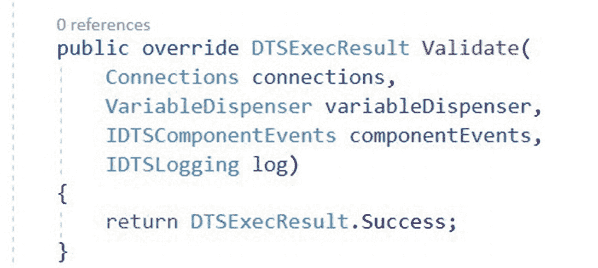
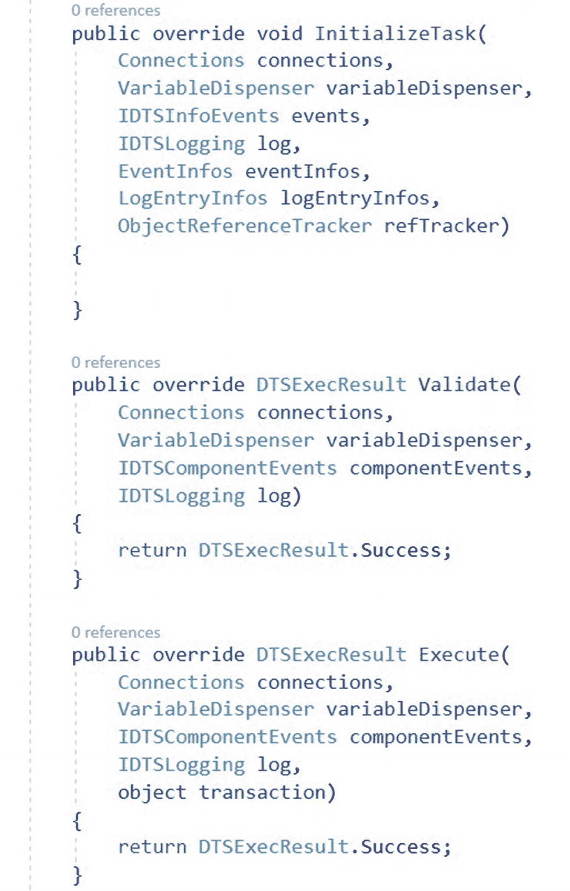

# 7. 自定义任务基础

## 重写 Validate 方法

我们需要在类中重写 `Validate` 方法。本书后续内容将在此方法中实现验证代码。目前，这个自定义任务尚非**生产就绪**。一个**生产就绪**的自定义 SSIS 任务**必须始终**实现验证功能。现在，请用一个返回 `DTSExecResult.Success` 值的代码来临时实现此方法。

通过向我们的类添加以下函数来重写 `Validate` 方法：

```
public override DTSExecResult Validate(
Connections connections,
VariableDispenser variableDispenser,
IDTSComponentEvents componentEvents,
IDTSLogging log)
{
return DTSExecResult.Success;
}
```

添加此代码后，您的类应类似于图 7-9 所示：



图 7-9

重写 Validate [函数](http://1z049idasr93tofo34pmrt233.wpengine.netdna-cdn.com/wp-content/uploads/2012/12/OverridingValidate.jpg)

当任务被添加到 SSIS 控制流、某个属性发生更改或任务执行时，会调用 `Validate` 方法。`return DTSExecResult.Success` 这一行代码指示该方法在调用时向控制流返回 Success——用 `任务语言` 来说，就是“我认为我已准备好运行”。

## 重写 Execute 方法

与 `Validate` 方法类似，我们以最基本的功能来重写继承的 `Execute` 方法。再次强调，这`仍然`不是生产就绪的代码。

通过向 `ExecuteCatalogPackageTask` 类添加以下代码来添加 `Execute` 方法重写：

```
public override DTSExecResult Execute(
Connections connections,
VariableDispenser variableDispenser,
IDTSComponentEvents componentEvents,
IDTSLogging log,
object transaction)
{
return DTSExecResult.Success
}
```

现在，您的类总共应包含三个方法，并类似于图 7-10 所示：



图 7-10

重写 Execute

这就是我们目前在此任务中要编写的全部代码。本书后续内容将向这些方法添加更多代码。额外的代码将使这个自定义 SSIS 任务更加**生产就绪**。

## 总结

该项目现在包含了自定义任务功能的雏形。

现在是执行提交并推送到 Azure DevOps 的好时机。

到目前为止的开发中，我们已经：

*   创建并配置了一个 Azure DevOps 项目
*   将 Visual Studio 连接到 Azure DevOps 项目
*   将 Azure DevOps Git 仓库克隆到本地
*   创建了一个 Visual Studio 项目
*   向 Visual Studio 项目添加了引用
*   对项目代码执行了首次签入
*   对程序集进行了签名
*   签入了一次更新
*   配置了构建输出路径和生成事件
*   重写了来自 `Task` 基类的三个方法

我们现在已准备好开始编写任务界面的代码。

