# 8. 编码一个简单的任务编辑器

SSIS 任务需要一个编辑器。我们通过向 `ExecuteCatalogPackageTask` 解决方案添加一个项目来开始为其创建一个简单的编辑器。

## 添加任务编辑器

打开 Visual Studio 解决方案 `ExecuteCatalogPackageTask.sln`。在解决方案资源管理器中，右键单击解决方案，将鼠标悬停在“添加”上，然后单击“新建项目”，如图 8-1 所示：

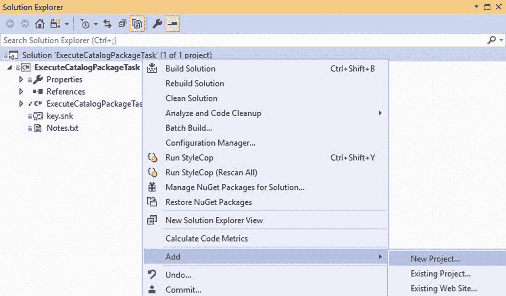

图 8-1

添加新项目

选择 C# 类库（.NET Framework），如图 8-2 所示：

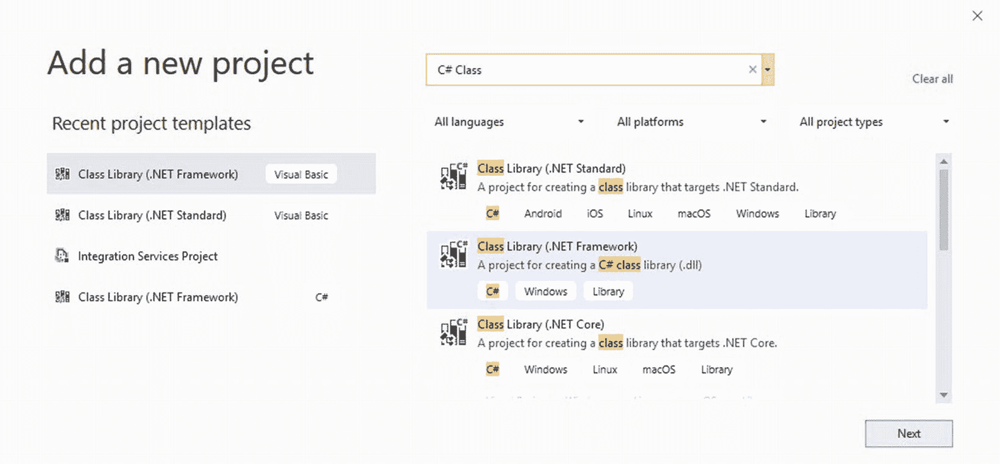

图 8-2

选择项目模板

将项目命名为 `ExecuteCatalogPackageTaskUI`，如图 8-3 所示：

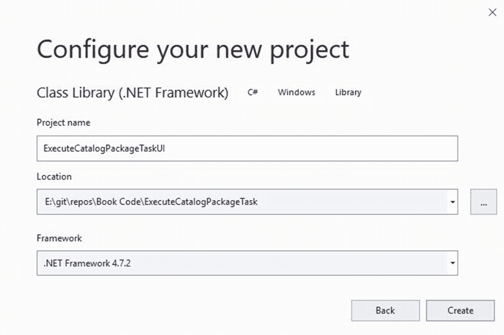

图 8-3

命名项目

单击“创建”按钮，并将 `Class1.cs` 重命名为 `ExecuteCatalogPackageTaskUI.cs`，如图 8-4 所示：

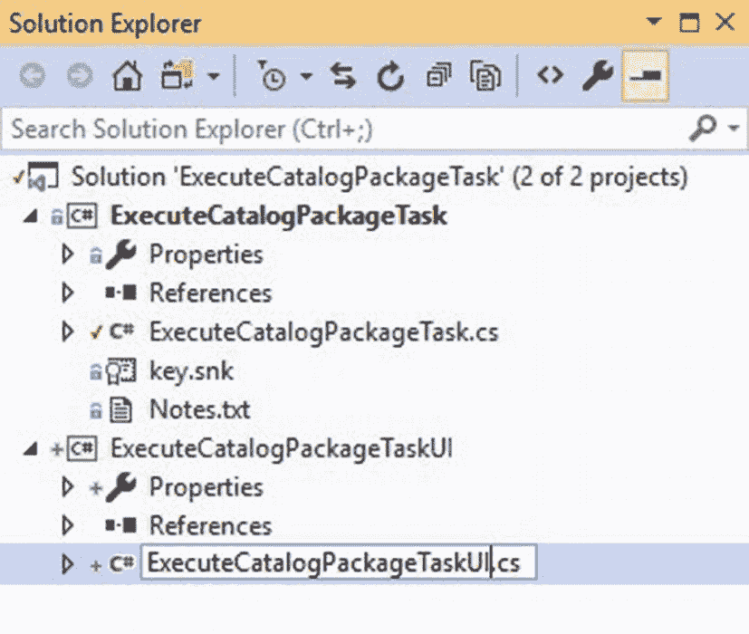

图 8-4

将 Class1 重命名为 ExecuteCatalogPackageTaskUI

当提示时，单击“是”以将所有 `Class1` 引用重命名为 `ExecuteCatalogPackageTaskUI` 引用，如图 8-5 所示：

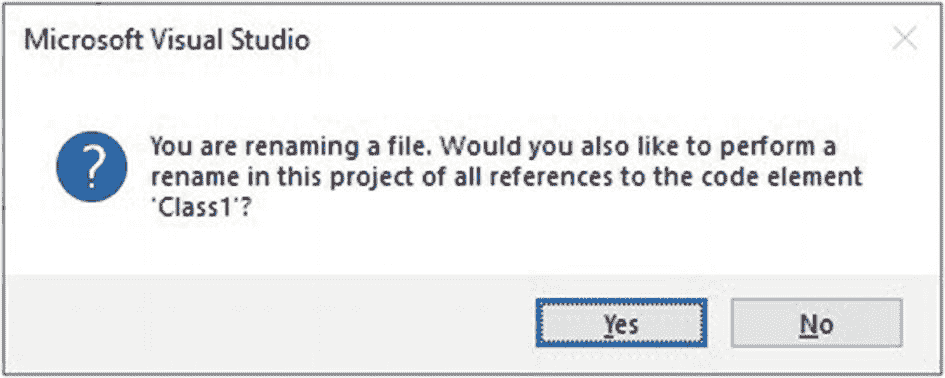

图 8-5

确认 Class1 重命名操作


## 部分实现

接下来，我们将通过修改类声明语句 `public class ExecuteCatalogPackageTaskUI` 来实现 `IDtsTaskUI` 接口，如清单 8-2 所示：

```
public class ExecuteCatalogPackageTaskUI : IDtsTaskUI
清单 8-2
实现 IDtsTaskUI
```

你的类将显示为图 8-8 所示：

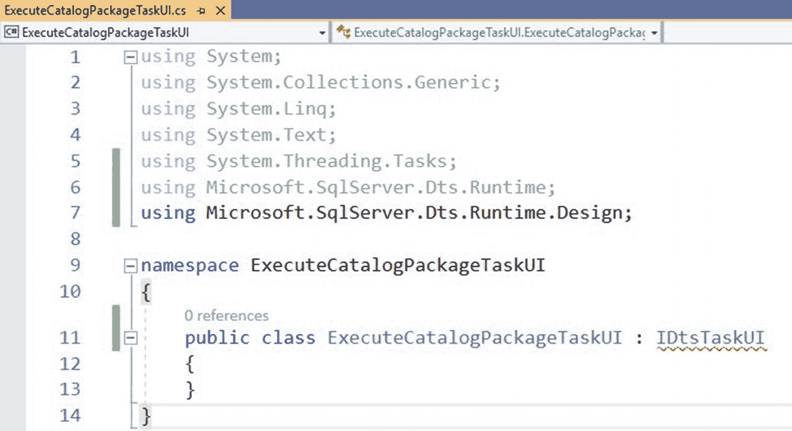

图 8-8

实现 IDtsTaskUI

接口名称下方的波浪线（`IDtsTaskUI` 是一个 .Net 接口）提示我们存在一个问题。将鼠标悬停在波浪线上会显示一个工具提示，如图 8-9 所示：

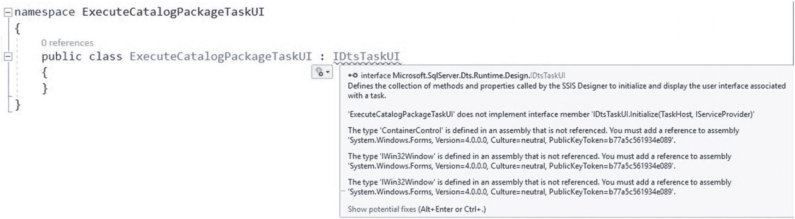

图 8-9

接口实现要求

我们正在实现的 `IDtsTaskUI` 接口要求我们实现一个 `Initialize` “接口成员”。该消息还提供了满足 `IDtsTaskUI` 接口合规性所需的其他要求的信息。

第一条消息告知我们需要实现一个 `Initialize` 接口成员，以使 `ExecuteCatalogPackageTaskUI` 符合我们正在实现的 `IDtsTaskUI` 接口。错误列表（`视图–>错误列表`）显示了有关实现 `IDtsTaskUI` 接口所需的其他接口成员的信息，如图 8-10 所示：

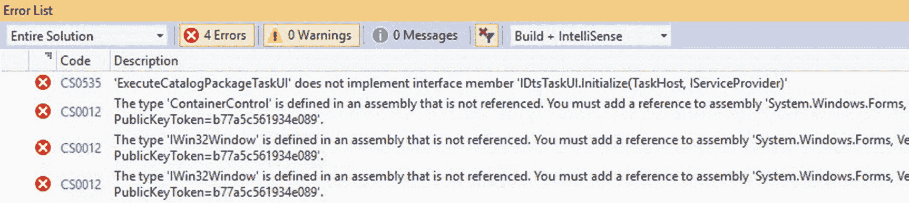

图 8-10

错误列表显示 IDtsTaskUI 实现所需的方法

实现部分功能需要一个 `TaskHost` 对象变量，因此让我们在 `Implements` 语句之后添加一个新的 `TaskHost` 变量，如清单 8-3 和图 8-11 所示：

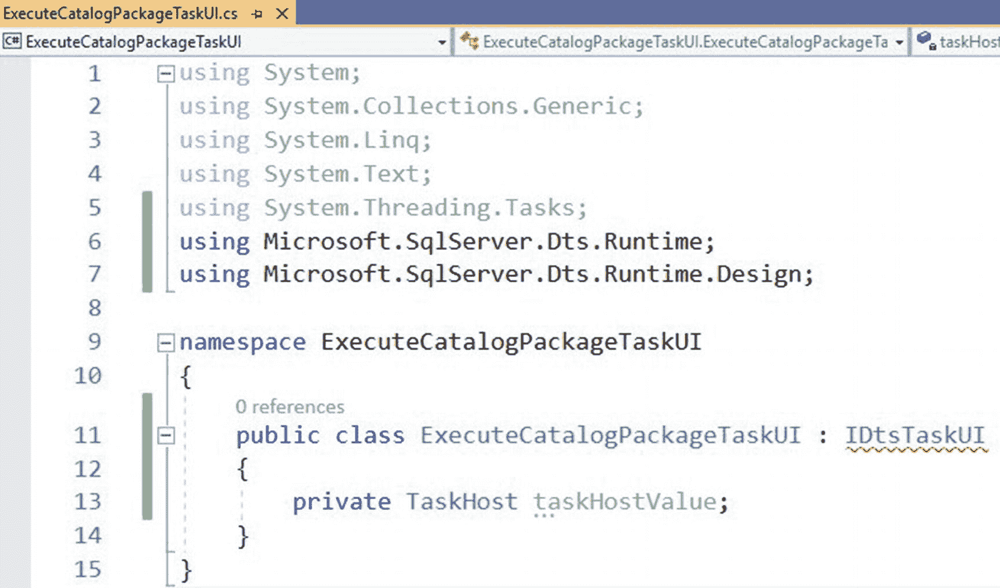

图 8-11

声明 taskHostValue 变量

```
private TaskHost taskHostValue;
清单 8-3
声明 taskHostValue 变量
```

为准备添加一个将用作任务编辑器的 Windows 窗体，我们必须首先在 `ExecuteCatalogPackageTaskUI.cs` 类中添加对名为 `System.Windows.Forms` 的 .Net Framework 程序集的引用，如图 8-12 所示：

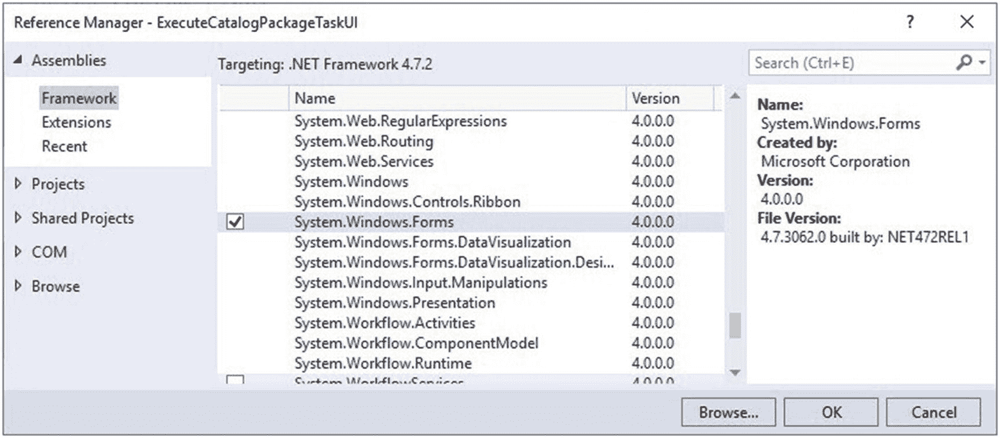

图 8-12

添加对 System.Windows.Forms 的引用

在清单 8-4 和图 8-13 中，我们通过向 `ExecuteCatalogPackageTaskUI.cs` 类添加一个 `using` 语句来使用新引用：

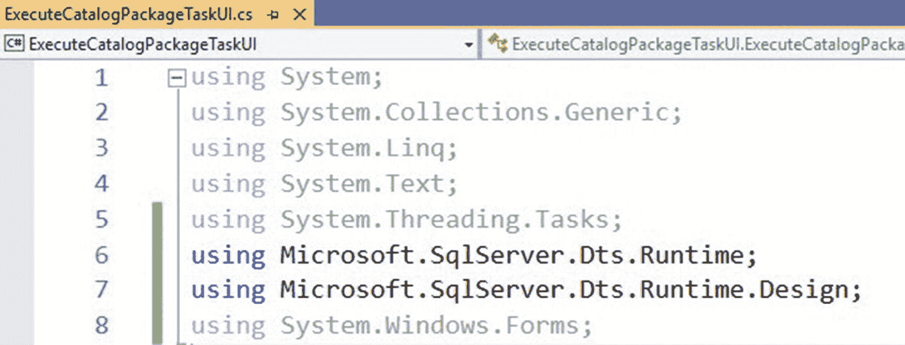

图 8-13

在 ExecuteCatalogPackageTaskUI.cs 类中使用 System.Windows.Forms

```
using System.Windows.Forms;
清单 8-4
使用 System.Windows.Forms
```

为 `ExecuteCatalogPackageTaskUI.cs` 类添加一个通用构造函数（`public void New`），通过添加清单 8-5 所示的代码：

```
public void New(System.Windows.Forms.IWin32Window form) { }
清单 8-5
添加构造函数
```

`ExecuteCatalogPackageTaskUI.cs` 类现在应显示为图 8-14 所示：

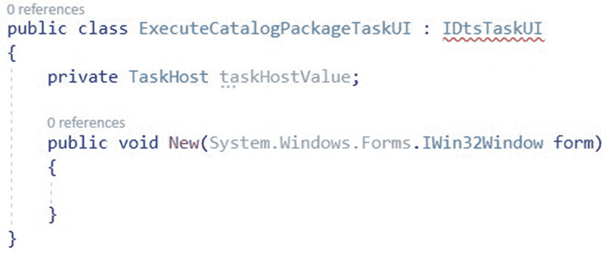

图 8-14

向 ExecuteCatalogPackageTaskUI.cs 类添加构造函数

## 添加用户界面窗体

我们现在准备向项目添加一个窗体。在解决方案资源管理器中，右键单击项目名称（`ExecuteCatalogPackageTaskUI`），将鼠标悬停在“添加”上，然后单击“Windows 窗体”，如图 8-15 所示：

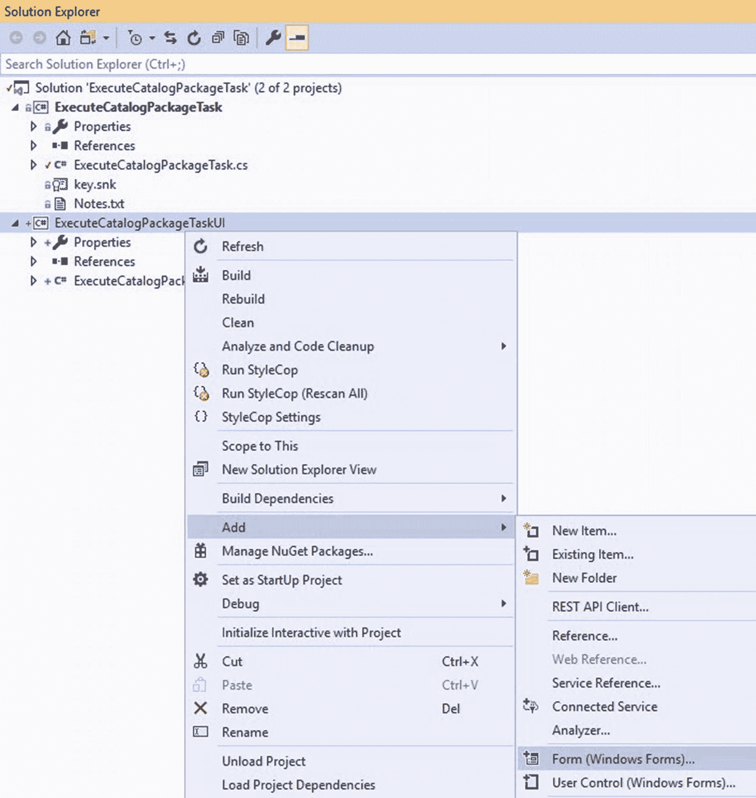

图 8-15

添加新窗体

将新窗体命名为 `ExecuteCatalogPackageTaskUIForm.cs`，如图 8-16 所示：

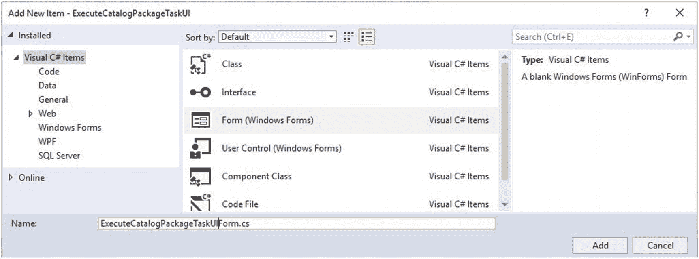

图 8-16

重命名新窗体

在 Visual Studio 中，返回到 `ExecuteCatalogPackageTaskUI` 类。通过在 `New` 方法下方添加清单 8-6 所示的代码，实现 `IDtsTaskUI` 接口的 `GetView` 方法：

```
public ContainerControl GetView()
{
    return new ExecuteCatalogPackageTaskUIForm(taskHostValue);
}
清单 8-6
实现 GetView 方法
```

你的类现在应显示为图 8-17 所示：

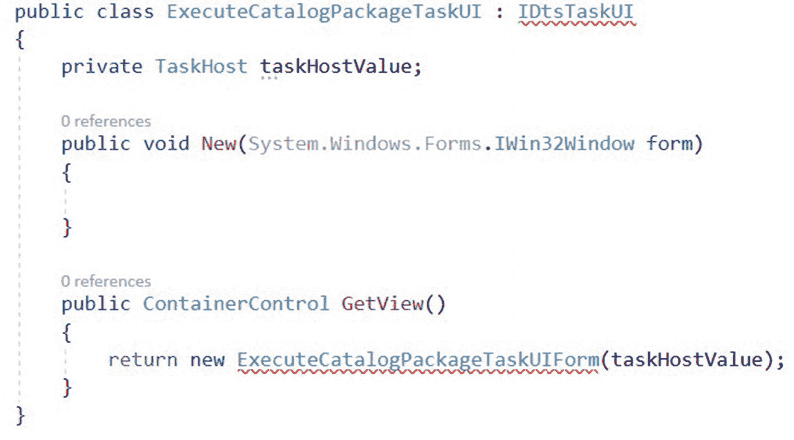

图 8-17

实现 GetView

波浪线表明 `ExecuteCatalogPackageTaskUIForm` 没有接受 `TaskHost` 类型单个参数的构造函数（`New` 方法）。我们将在不久的将来添加一个带有 `TaskHost` 参数的 `New` 方法。

接下来，让我们添加代码来实现 `IDtsTaskUI Initialize` 方法，将清单 8-7 中的代码添加到 `ExecuteCatalogPackageTaskUI` 类中：

```
public void Initialize(Microsoft.SqlServer.Dts.Runtime.TaskHost taskHost
, System.IServiceProvider serviceProvider)
{
    taskHostValue = taskHost;
}
清单 8-7
添加 Initialize 方法
```

`ExecuteCatalogPackageTaskUI` 类现在应显示为图 8-18 所示：

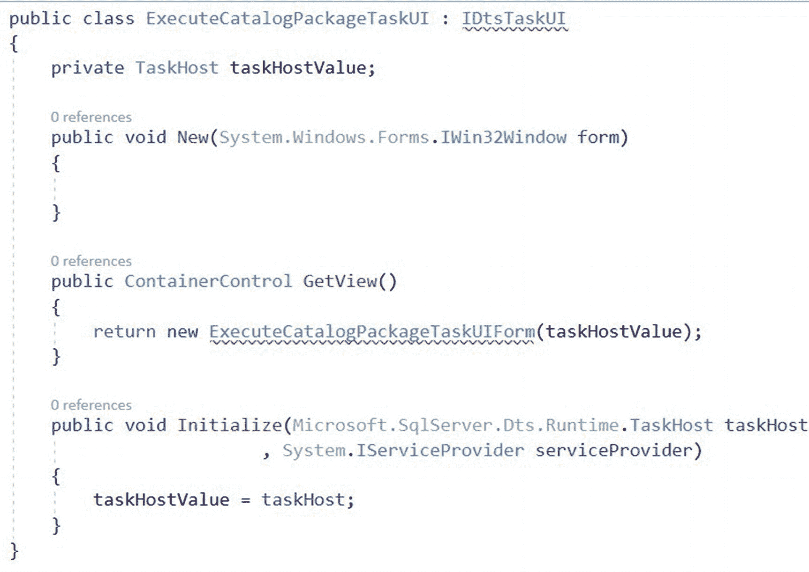

图 8-18

添加 Initialize 方法

最后，通过将清单 8-8 所示的代码添加到 `ExecuteCatalogPackageTaskUI` 类中，实现 `IDtsTaskUI Delete` 方法：

```
public void Delete(System.Windows.Forms.IWin32Window form) { }
清单 8-8
添加 Delete 方法
```

你的类现在应显示为图 8-19 所示：

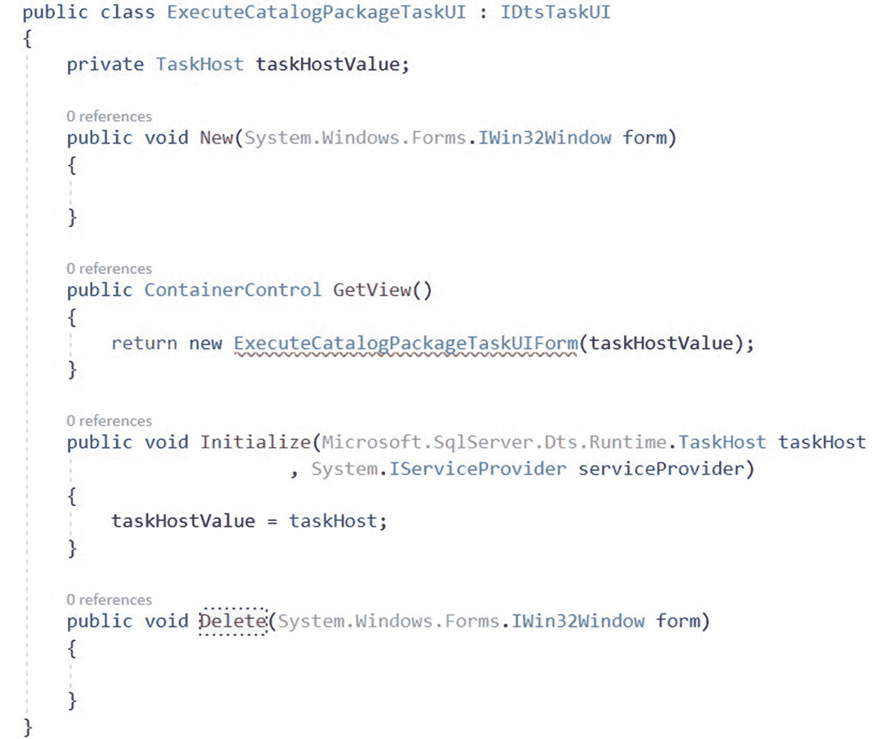

图 8-19

实现 IDtsTaskUI.Delete

请注意，类声明 `public class ExecuteCatalogPackageTaskUI : IDtsTaskUI` 中 `IDtsTaskUI` 部分下方的波浪线已经消失，因为我们已经完成了所需接口成员的实现。

`GetView()` 方法包含波浪线。我们将在开始编写 `ExecuteCatalogPackageTaskUI.ExecuteCatalogPackageTaskUIForm` 的代码时解决此错误。

我们已经完成了 `ExecuteCatalogPackageTaskUI` 类的构建。在继续之前保存此类，并记得定期将代码签入源代码管理。


## 编写表单代码

打开 `ExecuteCatalogPackageTaskUIForm` 表单。向表单添加一个标签和一个文本框。将标签的文本更改为“实例：”，并将文本框命名为 `txtInstance`，如图 8-20 所示：

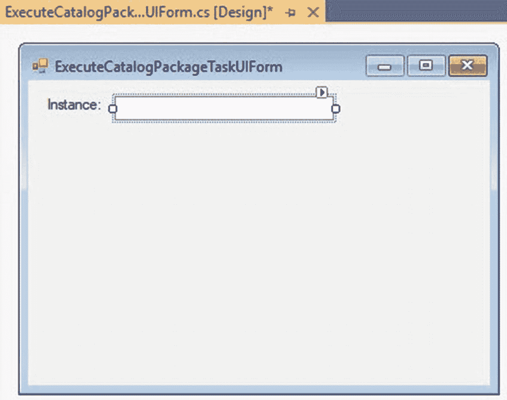

图 8-20 添加标签和文本框

为 Folder、Project 和 Package 属性添加标签和文本框控件，如图 8-21 所示：

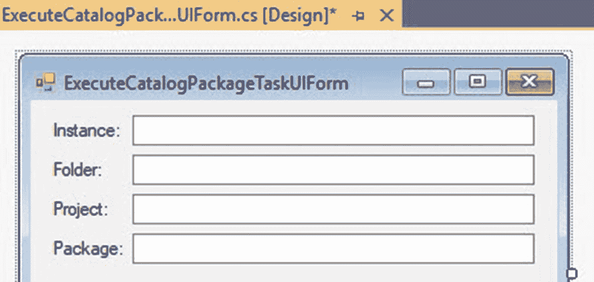

图 8-21 为 Folder、Project 和 Package 属性添加控件

将新的文本框分别命名为 `txtFolder`、`txtProject` 和 `txtPackage`。

接下来，添加一个名为 `btnDone` 的按钮，并将其 `Text` 属性设置为“完成”，如图 8-22 所示：

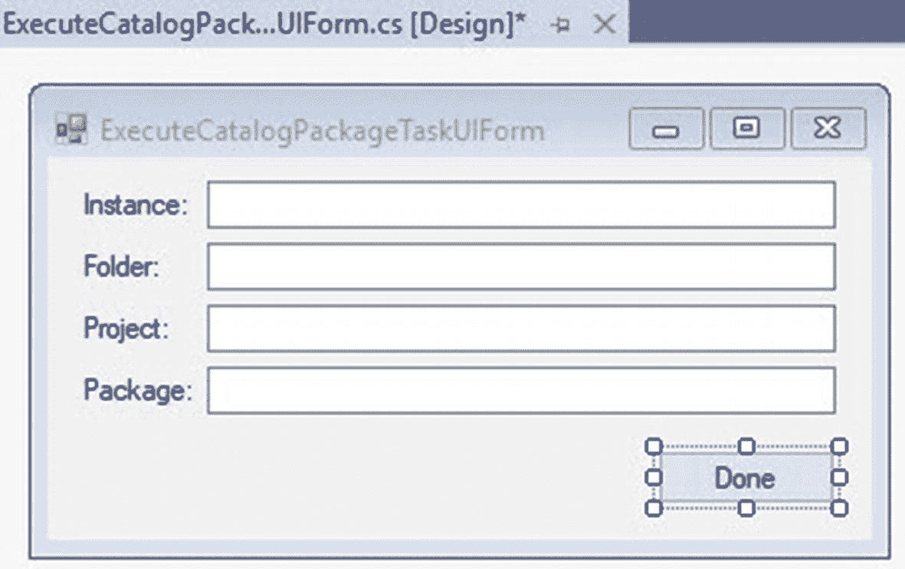

图 8-22 添加完成按钮

最后，将 `btnDone` 的 `DialogResult` 属性更改为“OK”，如图 8-23 所示：

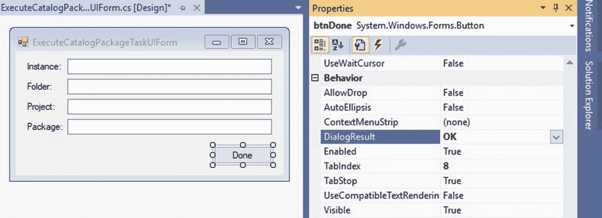

图 8-23 更改完成按钮的 DialogResult 属性

我们将使用按钮的 `Click` 事件来设置 `ExecuteCatalogPackageTask` 的目录包路径属性（Instance、Folder、Project 和 Package）。将 `Done` 按钮的 `DialogResult` 属性设置为 `OK` 非常重要，因为它自动完成了两个功能：
*   关闭编辑器表单。
*   发送 `OK` 作为 `DialogResult` 会触发任务的 `Validate` 方法。

## 编写 Click 事件和表单的代码

我特意选择从讨论在 `btnDone` 的 `Click` 事件中编写表单代码开始。我能听到你在想：“为什么，Andy？”很高兴你问了。上一节末尾的两个要点代表了一个“陷阱”——在编写自定义 SSIS 任务编辑器时很容易出错的地方。如果构建不正确，你很难通过搜索“Validate method doesn’t fire”来找到自定义 SSIS 任务的答案。

我们稍后会讲到 `Click` 事件的实际代码。首先，让我们构建 `ExecuteCatalogPackageTaskUIForm` 类。首先双击 `btnDone` 以在编辑器中打开 `Click` 事件。在直接向 `btnDone` 的 `Click` 事件添加代码之前，请将以下 `using` 语句添加到窗体类的最顶部，如清单 8-9 所示：
```
using System.Globalization;
using Microsoft.SqlServer.Dts.Runtime;
```
清单 8-9 添加 Using 语句

你的窗体现在代码应如图 8-24 所示：

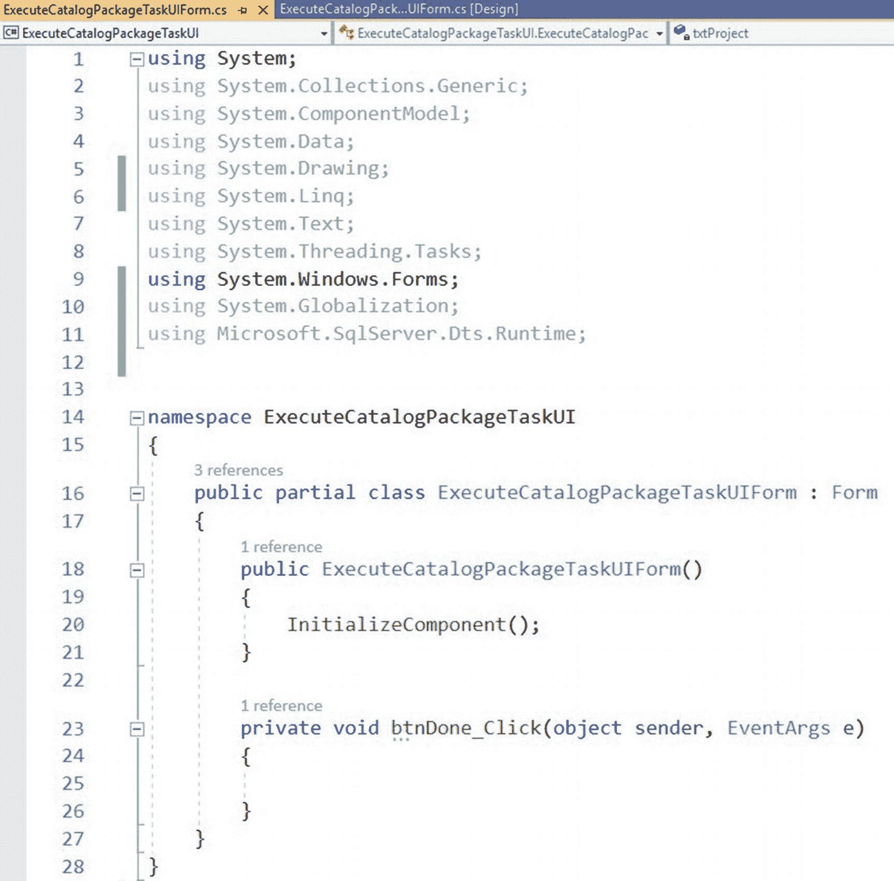

图 8-24 将导入语句添加到 ExecuteCatalogPackageTaskUIForm 类

通过添加清单 8-10 中的代码，声明一个新的名为 `TaskHostValue` 的 `TaskHost` 变量：
```
private TaskHost taskHost;
```
清单 8-10 声明 TaskHost

你的窗体现在类应如图 8-25 所示：

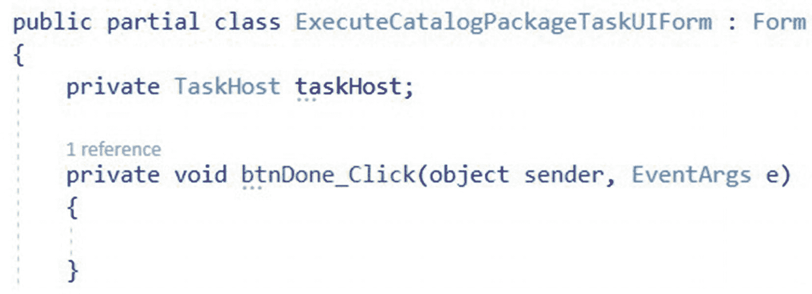

图 8-25 声明 TaskHost 变量

要开始编写 `Click` 事件的代码，我们需要通过一个托管 SSIS 自定义任务类的类来处理任务类，添加清单 8-11 中的代码：
```
taskHost.Properties["ServerName"].SetValue(taskHost,  txtInstance.Text);
```
清单 8-11 添加 ServerName 属性的值

你的窗体现在类应如图 8-26 所示：

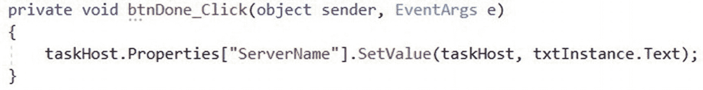

图 8-26 添加 ServerName 属性的值

在此方法中——当数据集成开发人员在 `ExecuteCatalogPackageTask` 编辑器上单击 `Done` 按钮时触发——与此表单关联的 `TaskHost` 的 `ServerName` 属性被设置为名为 `txtInstance` 的表单文本框的 `Text` 属性值。我们编写了大量代码才到达这里，但这就是我们这样做的原因，以便我们可以从任务编辑器表单编辑属性。

在继续之前，添加清单 8-12 中所示的控制到属性映射，用于 `PackageFolder`、`PackageProject` 和 `PackageName` 属性：
```
taskHost.Properties["PackageFolder"].SetValue(taskHost, txtFolder.Text);
taskHost.Properties["PackageProject"].SetValue(taskHost, txtProject.Text);
taskHost.Properties["PackageName"].SetValue(taskHost, txtPackage.Text);
```
清单 8-12 添加属性映射

一旦你为 `Click` 事件方法添加了额外属性的代码，`ExecuteCatalogPackageTaskUIForm` 类应如图 8-27 所示：

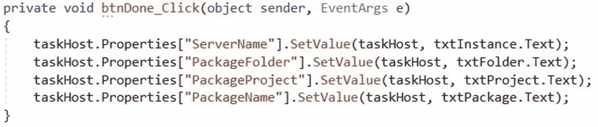

图 8-27 完成 Click 事件属性编码

下一步是前面编码的补充。当表单显示时，我们希望检索任务对象属性（`ServerName`、`PackageFolder`、`PackageProject` 和 `PackageName`）的值，并将它们显示在编辑器（表单）上的 `txtInstance`、`txtFolder`、`txtProject` 和 `txtPackage` 文本框中。要实现此功能，请编辑现有的 `ExecuteCatalogPackageTaskUIForm` 构造函数以匹配清单 8-13：
```
public ExecuteCatalogPackageTaskUIForm (TaskHost taskHostValue)
{
InitializeComponent();
taskHost = taskHostValue;
txtInstance.Text = ➥ taskHost.Properties["ServerName"].GetValue(taskHost).ToString();
txtFolder.Text = ➥ taskHost.Properties["PackageFolder"].GetValue(taskHost).ToString();
txtProject.Text = ➥ taskHost.Properties["PackageProject"].GetValue(taskHost).ToString();
txtPackage.Text = ➥ taskHost.Properties["PackageName"].GetValue(taskHost).ToString();
}
```
清单 8-13 ExecuteCatalogPackageTaskUIForm 构造函数

完成后，`ExecuteCatalogPackageTaskUIForm` 类应如图 8-28 所示：

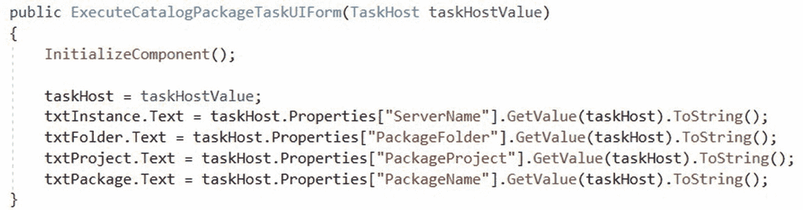

图 8-28 添加表单构造函数

表单构造函数接受一个名为 `taskHost` 的 `TaskHost` 参数，这消除了在 `ExecuteCatalogPackageTaskUI` 类的 `GetView` 函数代码中的错误，如图 8-29 所示：

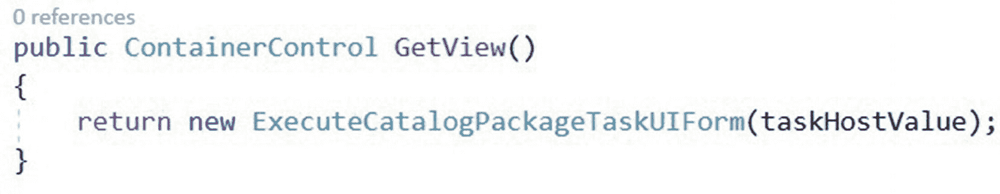

图 8-29 ExecuteCatalogPackageTaskUI.GetView() 中不再有波浪线


### 结论

在本章中，我们为自定义 SSIS 任务开发了一个简单的编辑器。我们向窗体添加了多个控件，并准备好了窗体以便将编辑器绑定到自定义 SSIS 任务对象。该项目现在包含了自定义任务的大部分功能。

现在是执行一次提交并推送到 Azure DevOps 的好时机。

在开发的这个阶段，我们已经：

*   创建并配置了一个 Azure DevOps 项目
*   将 Visual Studio 连接到该 Azure DevOps 项目
*   在本地克隆了 Azure DevOps Git 仓库
*   创建了一个 Visual Studio 项目
*   向 Visual Studio 项目添加了引用
*   对项目代码执行了初始签入
*   对程序集进行了签名
*   签入了一次更新
*   配置了构建输出路径和生成事件
*   重写了来自`Task`基类的三个方法
*   为`Task`编辑器添加并编写了大部分项目代码

接下来，我们将把任务和编辑器组合起来！

