# 9. 签名与绑定

本书以一段散漫的引言开始，揭示了我的部分思维过程。我提出了一个问题：“你认为使用 Visual Studio 社区版创建自定义 SSIS 任务是否可能？”

接着，我们配置了开发机器和 Visual Studio，然后创建了一个新项目。我们对项目进行了签名，以便它能在全局程序集缓存中被接受，并准备好了 Visual Studio 环境，包含了构建自定义 SSIS 任务所需的所有附属物和引用。我们编写了任务及其编辑器的代码。所有这些工作将我们带到了这里。

在本章中，我们将对任务编辑器项目进行签名，并将任务绑定到编辑器。然后我们将编写任务的功能代码，添加一个图标，并构建和测试该任务。

## 创建新的公钥令牌值

本书的第一版写于 2017 年。请将本章视为任务编辑器设计的“重启”。为了确保无误，让我们重新生成一个密钥并重新提取公钥。

在将任务编辑器绑定到任务之前，让我们先创建一个新密钥。

以管理员身份打开命令提示符，如图 9-1 所示：

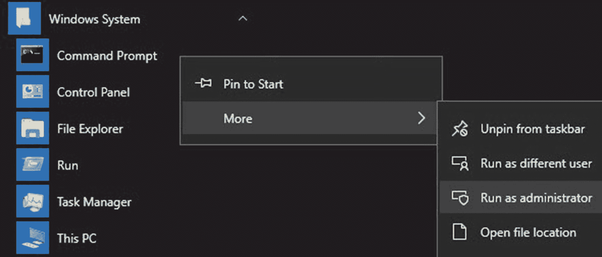

图 9-1：打开管理员命令提示符

在命令提示符窗口中，导航到`ExecuteCatalogPackageTaskUI`文件夹，如图 9-2 所示：

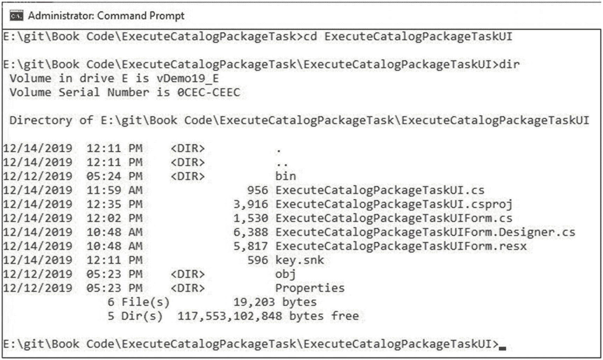

图 9-2：导航到`ExecuteCatalogPackageTaskUI`文件夹

打开之前保存在`ExecuteCatalogPackageTask`项目中的`Notes.txt`文件，复制如清单 9-1 和图 9-7 所示的密钥创建和检索命令：

```
"C:\Program Files (x86)\Microsoft SDKs\Windows\v10.0A\bin\NETFX 4.8 Tools\sn.exe" -k key.snk
"C:\Program Files (x86)\Microsoft SDKs\Windows\v10.0A\bin\NETFX 4.8 Tools\sn.exe" -p key.snk public.out
"C:\Program Files (x86)\Microsoft SDKs\Windows\v10.0A\bin\NETFX 4.8 Tools\sn.exe" -t public.out
```

清单 9-1：强名称命令

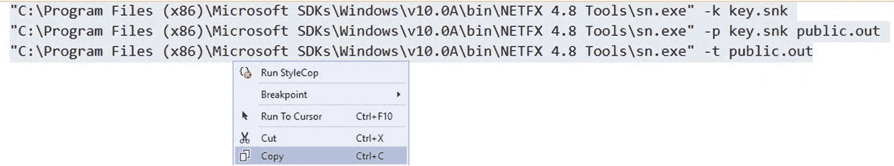

图 9-3：复制公钥创建和检索命令

将公钥创建和检索命令粘贴到管理员命令提示符窗口中，如图 9-4 所示：

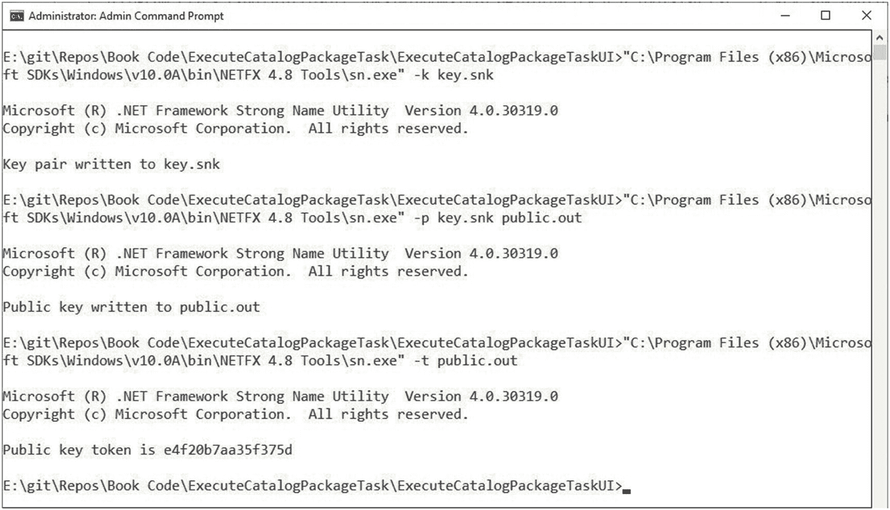

图 9-4：创建并检索公钥令牌

高亮显示公钥令牌值，如图 9-5 所示：

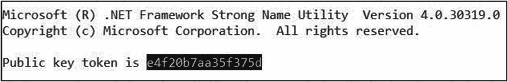

图 9-5：高亮显示公钥令牌值

右键单击所选内容以将其复制到剪贴板。将剪贴板内容粘贴到`ExecuteCatalogPackageTask.cs`文件中原始`Public`密钥值附近进行比较，如图 9-6 所示：

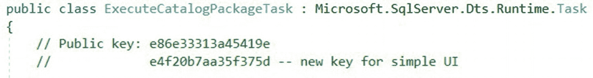

图 9-6：比较原始和新的公钥值

注意

签名 UI 程序集需要一个新的公钥。

## 对任务编辑器项目进行签名

我们尚未对`Task`编辑器项目进行签名。现在让我们来完成它。

在解决方案资源管理器中，双击`ExecuteCatalogPackageTaskUI`项目下的`Properties`以打开项目属性。

点击`签名`页面，勾选“为程序集签名”复选框，点击“选择强名称密钥文件”下拉菜单，点击`浏览`，浏览到`ExecuteCatalogPackageTaskUI`项目文件夹中的`key.snk`文件——也就是我们刚刚创建的`key.snk`文件——并选择该文件，如图 9-7 所示：

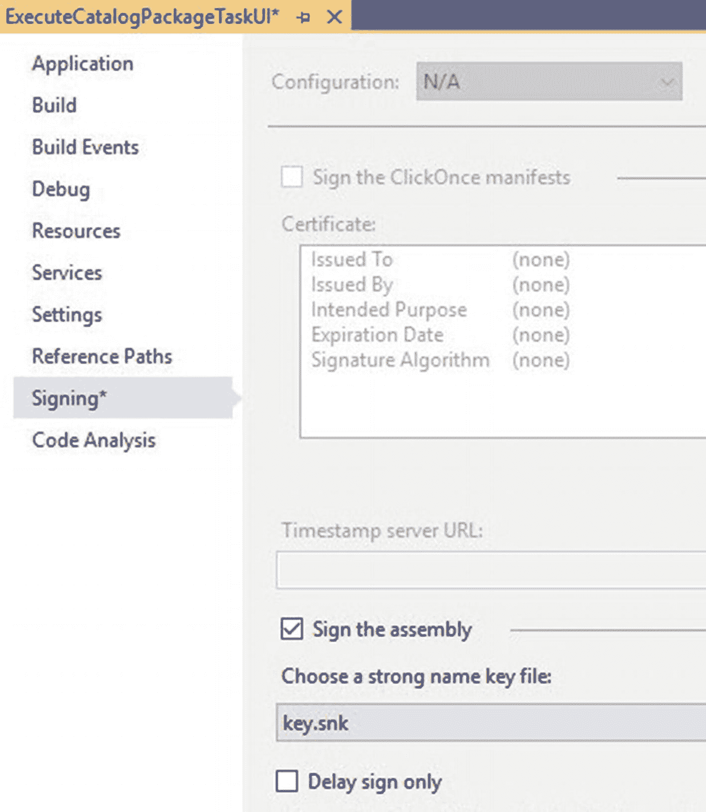

图 9-7：对 UI 项目进行签名

与`Task`项目属性类似，点击`生成`页面，并将`生成输出路径`设置为`<drive>:\Program Files (x86)\Microsoft SQL Server\<version>\DTS\Tasks`，其中`<drive>`代表 SQL Server 的安装驱动器，`<version>`代表您正在为其构建此任务的 SQL Server 的数值版本号，如图 9-8 所示：

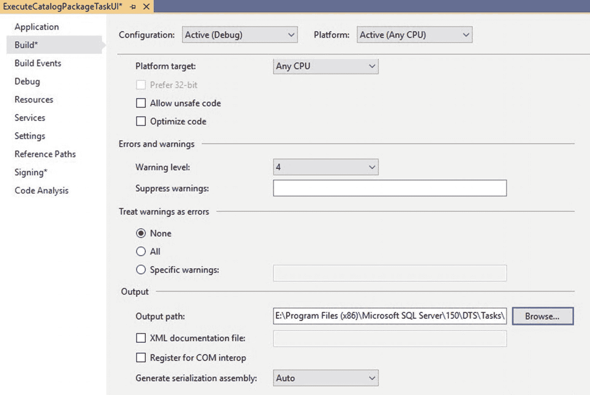

图 9-8：为`ExecuteCatalogPackageTaskUI`项目设置`生成输出路径`

与`Task`项目一样，我们可以自动化`gacutil`注销和注册功能。点击`生成事件`页面，点击`编辑预先生成...`按钮，然后添加如清单 9-2 和图 9-9 所示的代码：

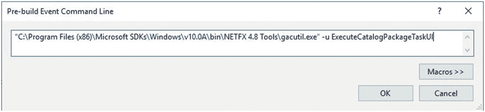

图 9-9：将`gacutil`注销命令添加到预先生成生成事件

```
"C:\Program Files (x86)\Microsoft SDKs\Windows\v10.0A\bin\NETFX 4.8 Tools\gacutil.exe" -u ExecuteCatalogPackageTask
```

清单 9-2：`gacutil`注销命令

点击`编辑后期生成...`按钮，并添加如清单 9-3 和图 9-10 所示的代码：

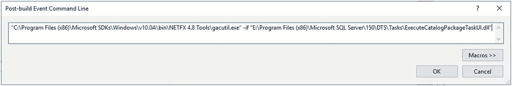

图 9-10：将`gacutil`注册命令添加到后期生成生成事件

```
"C:\Program Files (x86)\Microsoft SDKs\Windows\v10.0A\bin\NETFX 4.8 Tools\gacutil.exe" -if "E:\Program Files (x86)\Microsoft SQL Server\150\DTS\Tasks\ExecuteCatalogPackageTaskUI.dll"
```

清单 9-3：`gacutil`注册命令

完成后，保存并关闭项目属性。


## 将任务编辑器绑定到任务

接下来，我们需要告知任务它拥有一个编辑器。在 Visual Studio 中打开 `ExecuteCatalogPackageTask` 解决方案和 `ExecuteCatalogPackageTask` 项目。打开 `ExecuteCatalogPackageTask` 类，如图 9-11 所示：

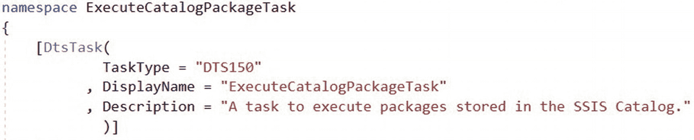

图 9-11：`ExecuteCatalogPackageTask`，修改前

`DtsTask` 属性（装饰器）的展示和文档记录在[此处](http://msdn.microsoft.com/en-us/library/ms212188.aspx)。目前，我们的任务装饰器定义了三个值：`TaskType`、`DisplayName` 和 `Description`。为了将编辑器（UI）与任务耦合，我们通过向现有装饰器添加代码清单 9-4 中的代码，来添加多部分属性 `UITypeName`：

```
, UITypeName= "ExecuteCatalogPackageTaskUI.ExecuteCatalogPackageTaskUI ➥
",ExecuteCatalogPackageTaskUI,Version=1.0.0.0,Culture=Neutral ➥
,PublicKeyToken="
, TaskContact = "ExecuteCatalogPackageTask; Building Custom Tasks for ➥
SQL Server Integration Services, 2019 Edition; © 2020 Andy Leonard; ➥ https://dilmsuite.com/ExecuteCatalogPackageTaskBookCode"
清单 9-4：更新 DtsTask 装饰器
```

一旦添加到 `DtsTask` 属性装饰器中，装饰器将如图 9-12 所示：

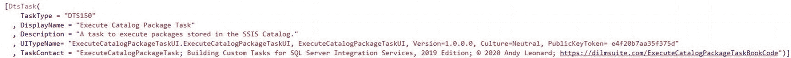

图 9-12：向 `DtsTask` 装饰器添加 `UITypeName` 和 `TaskContact` 属性

你可以在 [docs.microsoft.com/en-us/dotnet/api/microsoft.sqlserver.dts.runtime.dtstaskattribute.uitypename?view=sqlserver-2017](http://msdn.microsoft.com/en-us/library/microsoft.sqlserver.dts.runtime.dtstaskattribute.uitypename.aspx) 找到（部分）关于 `UITypeName` 属性的文档。其属性/值对是：

*   类型名称：`ExecuteCatalogPackageTaskUI.ExecuteCatalogPackageTaskUI`
*   程序集名称：`ExecuteCatalogPackageTaskUI`
*   版本：`1.0.0.0`
*   区域性：`Neutral`
*   公钥：`<*您的公钥*>`

## 为任务功能编写代码

我们的任务*几乎*准备好构建和测试了。剩下什么？SSIS 目录包执行功能。查看图 9-13 所示的 `Execute` 方法：

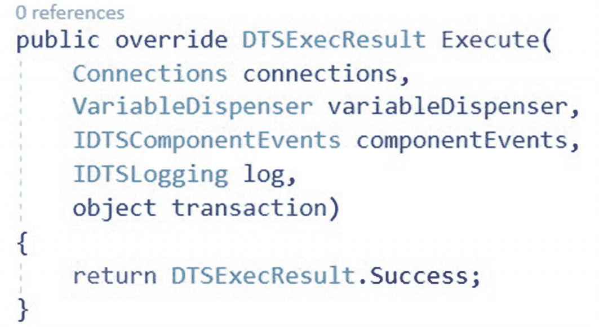

图 9-13：`Execute` 方法

我们将在这里添加 SSIS 目录包执行功能。有几篇很好的文章指导如何通过 .Net 执行 SSIS 目录包。关于以编程方式执行 SSIS 2019 包过程的简明总结可在 `docs.microsoft.com/en-us/sql/integration-services/run-manage-packages-programmatically/running-and-managing-packages-programmatically?view=sql-server-ver15` 找到。

**注意**

在继续之前，我想提醒您，我们并非在构建一个可用于生产的执行目录包任务。我们正在构建最少的功能，以演示编码自定义 SSIS 任务所需的步骤。一个可用于生产的自定义 SSIS 任务将包含更多我们在此未涉及的功能。

我们首先需要更多的 .NET Framework 引用。向 `ExecuteCatalogPackageTask` 项目添加以下引用：

*   `Microsoft.SqlServer.ConnectionInfo`
*   `Microsoft.SqlServer.Management.IntegrationServices`
*   `Microsoft.SqlServer.Management.Sdk.Sfc`
*   `Microsoft.SqlServer.Smo`

我在开发虚拟机的 `C:\Windows\Microsoft.NET\assembly\GAC_MSIL\Microsoft.SqlServer.ConnectionInfo\v4.0_15.0.0.0__89845dcd8080cc91\` 文件夹中找到了 `Microsoft.SqlServer.ConnectionInfo`，如图 9-14 所示：

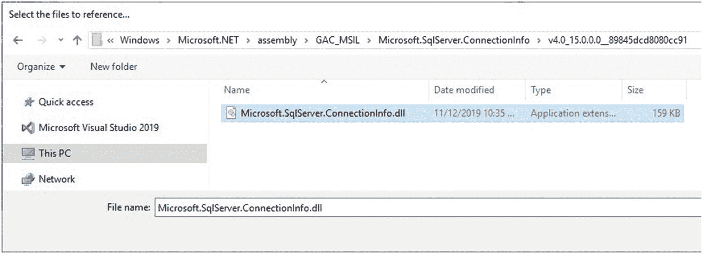

图 9-14：为 `Microsoft.SqlServer.ConnectionInfo` 添加引用

我也在 `C:\Windows\Microsoft.NET\assembly\GAC_MSIL\` 路径下找到了 `Microsoft.SqlServer.Management.IntegrationServices`、`Microsoft.SqlServer.Management.Sdk.Sfc` 和 `Microsoft.SqlServer.Smo`，如图 9-15 所示：

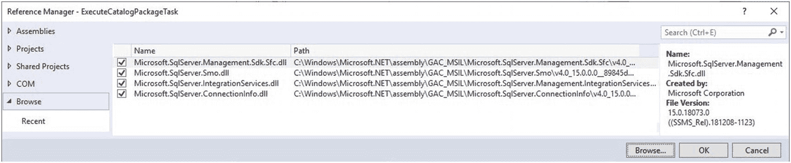

图 9-15：浏览以引用其他程序集

现在，`ExecuteCatalogPackageTask` 项目的解决方案资源管理器“引用”虚拟文件夹应如图 9-16 所示：

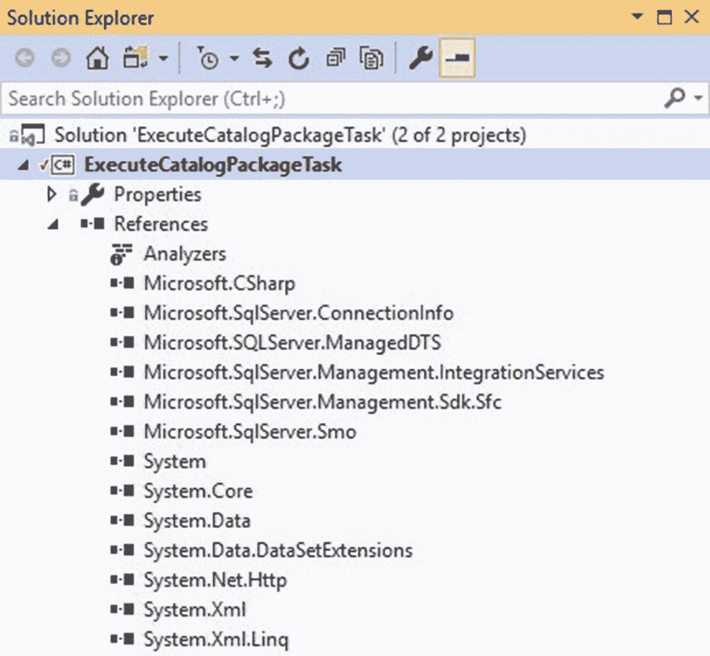

图 9-16：查看 `ExecuteCatalogPackageTask` 项目的引用

接下来，我们需要在 `ExecuteCatalogPackageTask.cs` 中声明要在项目中使用的引用程序集，如清单 9-5 所示：

```
using Microsoft.SqlServer.Management.IntegrationServices;
using Microsoft.SqlServer.Management.Smo;
清单 9-5：使用引用的程序集
```

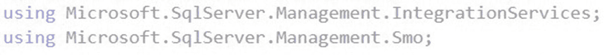

图 9-17：导入引用的程序集

现在我们准备为 `Execute` 函数添加功能。使用清单 9-6 所示的代码声明并初始化一些变量：

```
Server catalogServer = new Server(ServerName);
IntegrationServices integrationServices = new ➥ IntegrationServices(catalogServer);
Catalog catalog = integrationServices.Catalogs[PackageCatalog];
CatalogFolder catalogFolder = catalog.Folders[PackageFolder];
ProjectInfo catalogProject = catalogFolder.Projects[PackageProject];
Microsoft.SqlServer.Management.IntegrationServices.PackageInfo ➥ catalogPackage = catalogProject.Packages[PackageName];
清单 9-6：编写 Execute 方法代码，第一部分
```

你的 `Execute` 方法应该类似于图 9-18 所示：

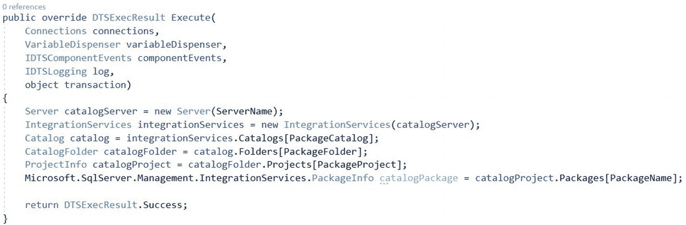

图 9-18：执行 SSIS 目录包方法部分编码

最后，添加对执行 SSIS 包对象 (`catalogPackage`) 的调用，如清单 9-7 和图 9-19 所示：

```
catalogPackage.Execute(False, Nothing)
清单 9-7：添加包执行代码
```

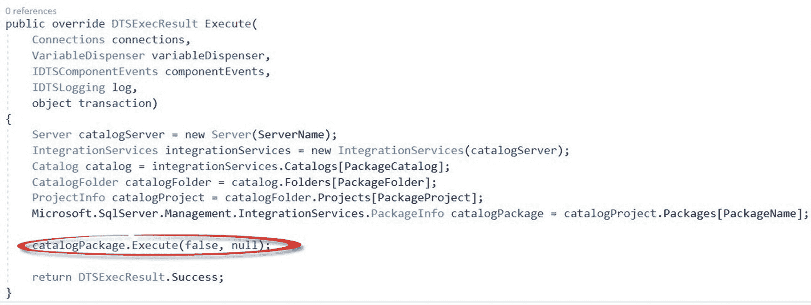

图 9-19：调用 `CatalogPackage.Execute` 方法

我不想对此小题大做，但我们*做了所有这些工作*，就是为了添加那一行代码…


## 添加图标

在使用图标前，必须先将其导入到您的项目中。在**解决方案资源管理器**中右键单击 `ExecuteCatalogPackageTask` 项目，将鼠标悬停在 `添加` 上，然后单击 `现有项`，如图 9-20 所示：

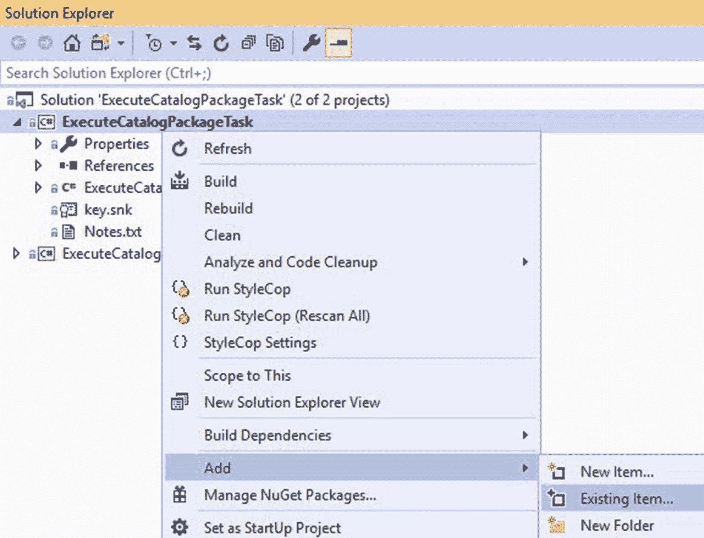

图 9-20：向 `ExecuteCatalogPackageTask` 项目添加现有项

导航到您想使用的图标文件，如图 9-21 所示：

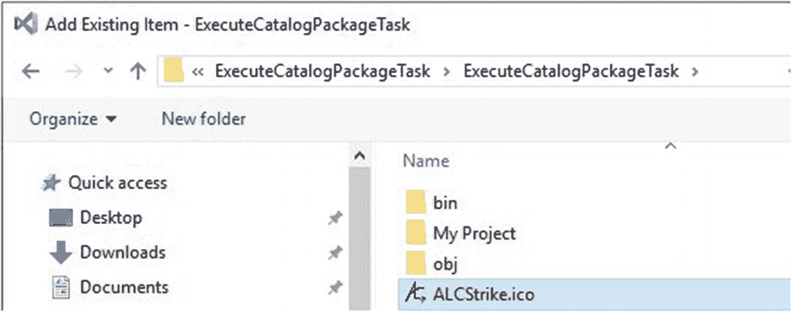

图 9-21：选择图标

图标文件将出现在**解决方案资源管理器**中，如图 9-22 所示：

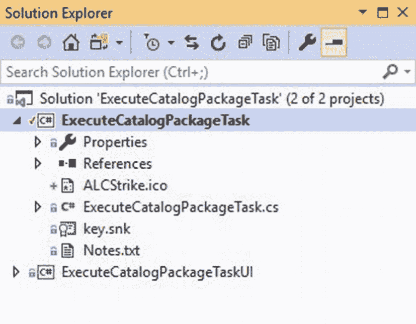

图 9-22：查看图标文件

在**解决方案资源管理器**中选中图标文件后，按下 `F4` 键以显示**属性**。将图标文件的 `生成操作` 属性从 `内容` 更改为 `嵌入的资源`，如图 9-23 所示：

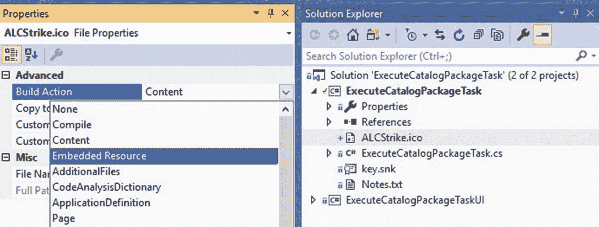

图 9-23：更改图标文件的 `生成操作` 属性

现在，让我们将图标添加到 `ExecuteCatalogPackageTaskUI` 窗体。打开窗体并查看其**属性**。单击 `图标` 属性旁边的省略号以打开图标选择对话框，如图 9-24 所示：

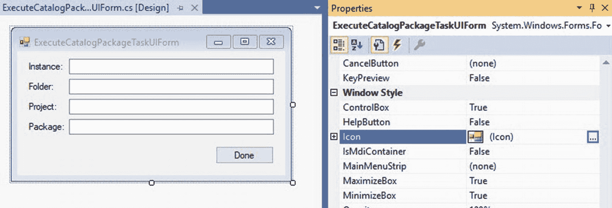

图 9-24：打开窗体图标选择对话框

选择图标，如图 9-25 所示：

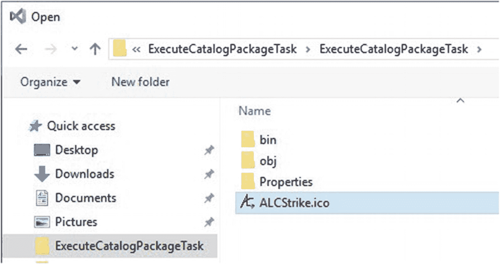

图 9-25：选择窗体图标

选定的图标现在显示为 `ExecuteCatalogPackageTaskForm` 窗体的图标，如图 9-26 所示：

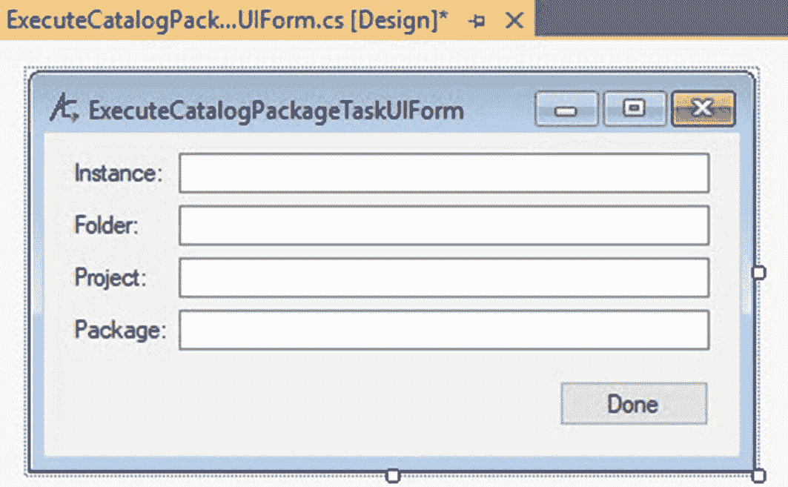

图 9-26：查看窗体图标

趁此机会，让我们将窗体的 `文本` 属性更新为 `"执行目录包任务编辑器"`，如图 9-27 所示：

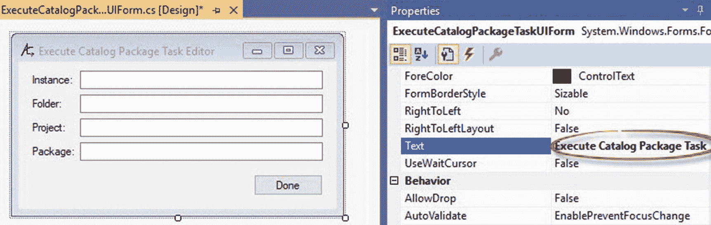

图 9-27：更新窗体的文本属性

在更新 `ExecuteCatalogPackageTask` 的 `DtsTask` 装饰之前，`SSIS` 不知道要显示哪个图标。打开 `ExecuteCatalogPackageTask.cs` 并向装饰中添加清单 9-8 所示的行：

```
, IconResource = "ExecuteCatalogPackageTask.ALCStrike.ico"
```

清单 9-8：将图标添加到 `DtsTask` 装饰中

您的装饰现在应该类似于图 9-28 所示：

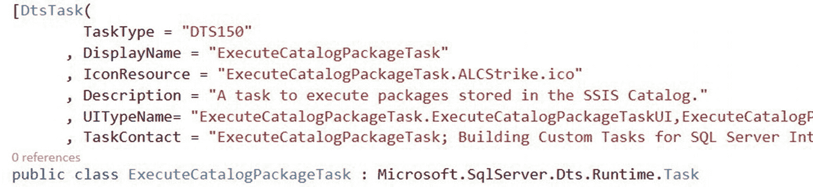

图 9-28：查看更新后的 `DtsTask` 装饰

现在正是将代码签入源代码管理的绝佳时机。

## 构建任务

现在我们代码已完成！是时候构建我们的解决方案了，这会将代码编译成可执行文件。从 `生成` 下拉菜单中，单击 `生成解决方案`，如图 9-29 所示：

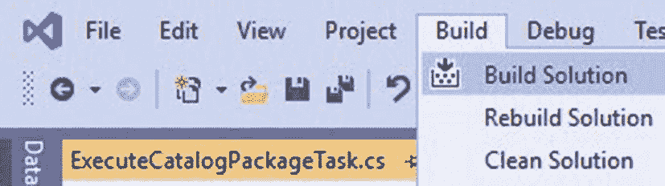

图 9-29：生成解决方案

如果一切顺利，您应该在**输出**窗口中看到类似于图 9-30 所示的信息：

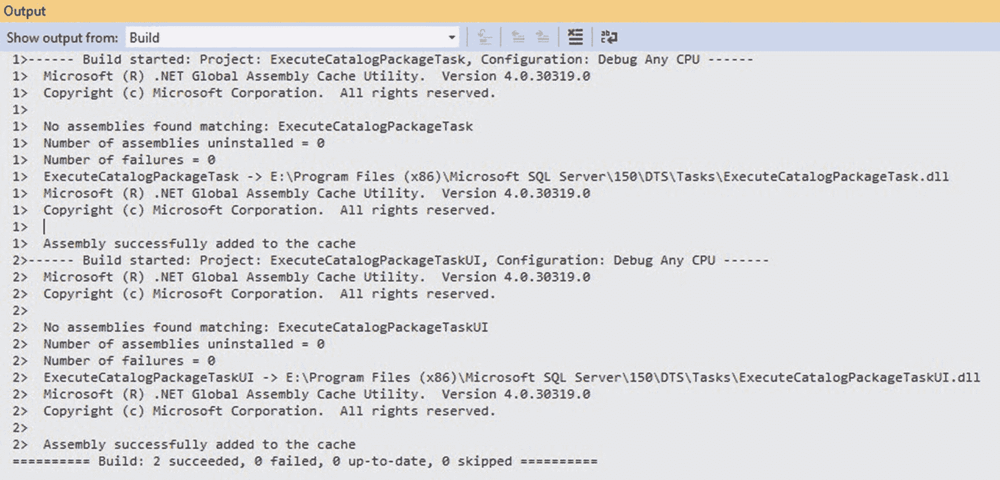

图 9-30：生成输出

如果一切如预期进行，您应该有两个程序集成功生成到 `DTS\Tasks\` 文件夹中，如图 9-31 所示：

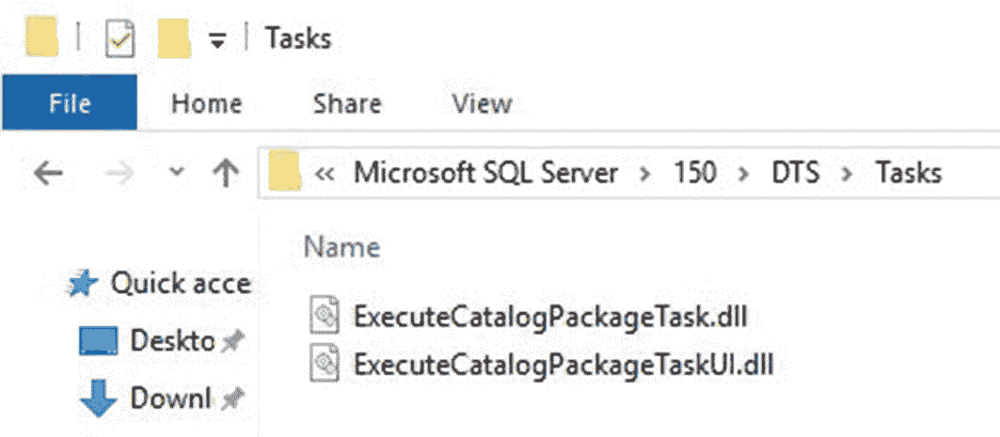

图 9-31：`DTS\Tasks\` 文件夹中的 `ExecuteCatalogPackageTask` 和 `ExecuteCatalogPackageTaskUI` 程序集

您还应该能在**全局程序集缓存 (GAC)** 中找到这些程序集，如图 9-32 所示：

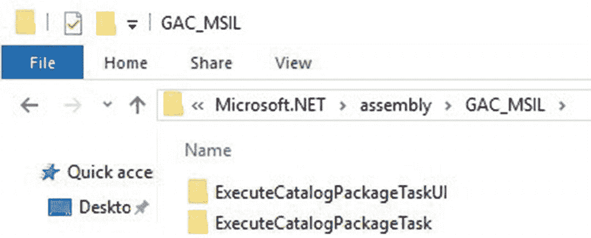

图 9-32：**GAC** 中的 `ExecuteCatalogPackageTask` 和 `ExecuteCatalogPackageTaskUI` 程序集

## 测试任务

关键时刻到了。这个任务能正常工作吗？它甚至会在 **SSIS 工具箱**中显示吗？让我们打开 **SQL Server Data Tools (SSDT)** 一探究竟！如果一切按计划进行，您将能够打开一个测试 **SSIS** 项目，并在 **SSIS 工具箱**中看到如图 9-33 所示的内容：

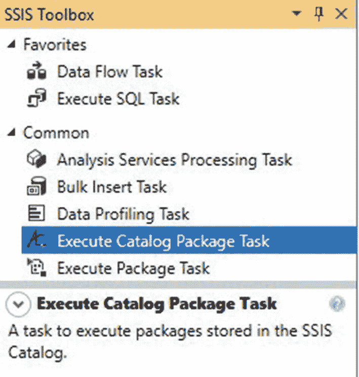

图 9-33：**SSIS 工具箱**中的“执行目录包任务”

将其拖放到**控制流**表面上，如图 9-34 所示：


图 9-34：**SSIS** 控制流上的“执行目录包任务”

双击该任务以打开编辑器并进行配置，如图 9-35 所示：

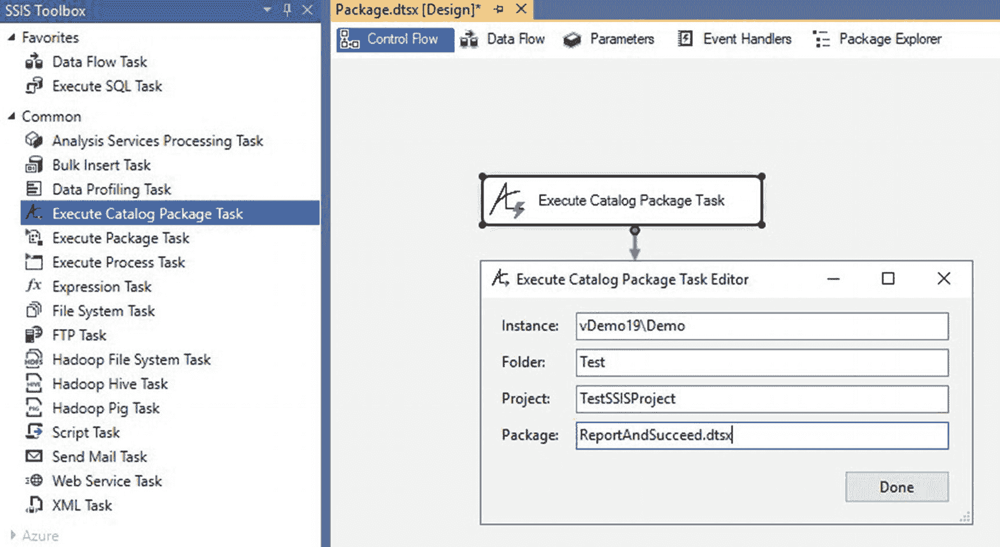

图 9-35：编辑任务

单击 `完成` 按钮，并在调试器中执行该包。如果一切顺利，我们的`执行目录包任务`将会成功，如图 9-36 所示：

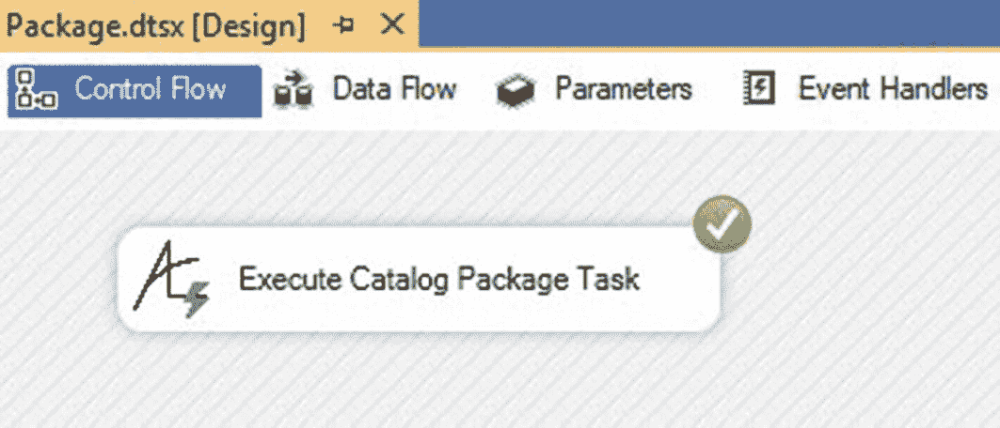

图 9-36：任务执行

任务是*真的*成功了，还是仅仅报告了成功？我们可以通过检查**SQL Server Management Studio (SSMS)** 中内置的 **SSIS 目录报告**来验证。打开 **SSMS** 并连接到承载您的 **SSIS 目录**的实例。展开 `Integration Services 目录`节点，右键单击 `SSISDB`，将鼠标悬停在 `报告` 上，再悬停在 `标准报告` 上，然后单击 `所有执行`，如图 9-37 所示：

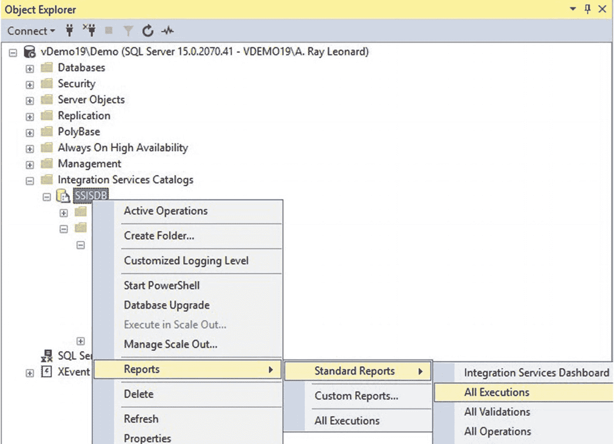

图 9-37：在 **SSMS** 中打开 **SSIS 目录所有执行报告**

**所有执行报告**默认显示过去 7 天的 **SSIS 包**执行情况。我承认，我执行了两次，如图 9-38 所示：

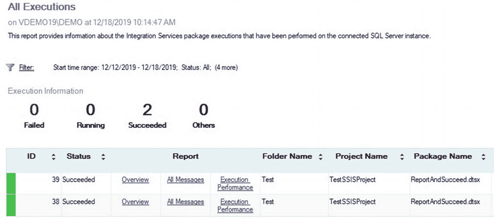

图 9-38：查看 **SSIS 目录所有执行报告**

非常好！


### 结论

代码与编辑器现已作为一个整体运作。

此时是执行提交并推送到 Azure DevOps 的好时机。

在当前的开发阶段，我们已经：

*   创建并配置了一个 Azure DevOps 项目
*   将 Visual Studio 连接到 Azure DevOps 项目
*   在本地克隆了 Azure DevOps Git 仓库
*   创建了一个 Visual Studio 项目
*   向 Visual Studio 项目添加了引用
*   对项目代码执行了初始签入
*   对程序集进行了签名
*   签入了一次更新
*   配置了生成输出路径和生成事件
*   重写了 Task 基类中的三个方法
*   为 Task 编辑器添加了大部分项目并编写了代码
*   将 Task 编辑器与 Task 连接起来

但如果事情不按这样发展呢？如果出现错误怎么办？

我们接下来扩展编辑器功能。

