# 10. 扩展编辑器功能

《为 SQL Server 集成服务构建自定义任务》的第一版于 2017 年出版。第 10 章涵盖了故障排除技巧。第 11 章包含了我根据经验总结的笔记。本版将包含这些章节……但会稍后放入。

本书的这一部分是第二版新增的。本章及后续章节的目标是扩展“执行目录包任务”的功能，具体包括：

*   为任务用户提供更“SSIS 风格”的体验，包括一个带有“常规”和“设置”页面视图的“漂亮”编辑器
*   启用 SSIS 表达式的使用
*   添加对任务设置的运行时验证
*   在编辑器中展示更多 SSIS 目录执行属性

我们在本章开始这些工作，重构现有的 `ExecuteCatalogPackageTask` 代码，并用一个新版本替换现有的任务编辑器项目。

## 重构

开发者有时会有机会重写或更新他们代码的旧版本。代码使用的时间越长，开发者积累的经验就越多。*重构* 有几种定义方式，包括清理、简化和重组现有代码。

在本章中，我们从重构 `ExecuteCatalogPackageTask` 代码开始，首先管理变量的作用域。

### 添加和更新任务属性

有一项改动将直接解决上述要点之一，并使我们更接近解决其他几个：将 SSIS 目录、服务器和其他 SSIS 包相关对象作为私有属性添加到 `ExecuteCatalogPackageTask` 对象中。

检查 `ExecuteCatalogPackageTask` 项目中的 `ExecuteCatalogPackageTask` 类，我们在 `PackageCatalog` 属性中发现了 SSIS 目录对象的 *开头*，如图 10-1 所示：

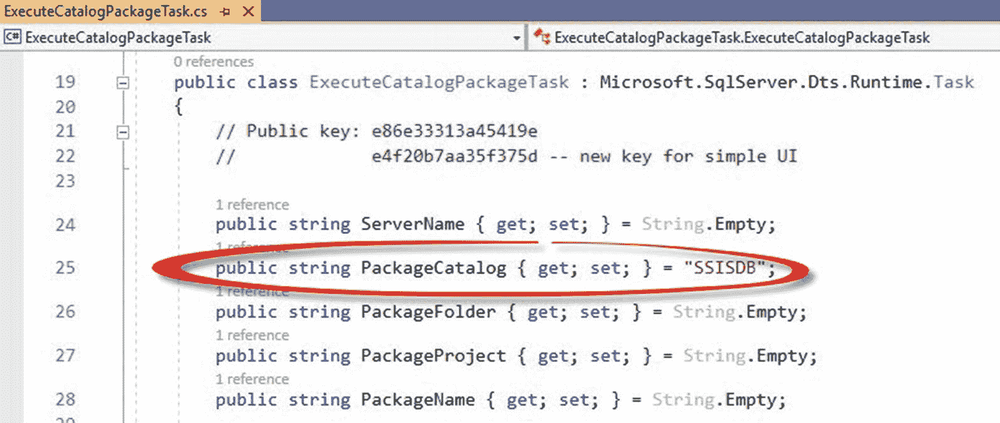
*图 10-1：`PackageCatalog` 属性*

`PackageCatalog` 属性是一个字符串，包含 SSIS 目录的名称。在撰写本文时，SSIS 目录名称一直保持一致且未变，即 “SSISDB”。包含此属性是为未来的“执行目录包任务”做准备，以防将来 SSIS 目录的版本允许编辑 SSIS 目录名称，但我不喜欢“执行目录包任务”的 `PackageCatalog` 属性名称。

将“执行目录包任务”的 `PackageCatalog` 属性重命名为 “`PackageCatalogName`”，点击左侧边栏中的“快速操作”螺丝刀图标，然后点击“将‘`PackageCatalog`’重命名为‘`PackageCatalogName`’”，如图 10-2 所示：

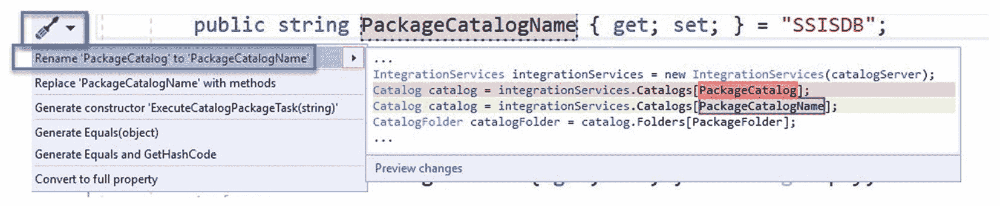
*图 10-2：将 `PackageCatalog` 属性重命名为 “`PackageCatalogName`”*

`PackageCatalogName` 是对先前名为 `PackageCatalog` 的属性更准确的名称。

当前版本的“执行目录包任务”在 `Execute` 方法中包含一个类型为 `Microsoft.SqlServer.Management.IntegrationServices.Catalog` 的变量，如图 10-3 所示：

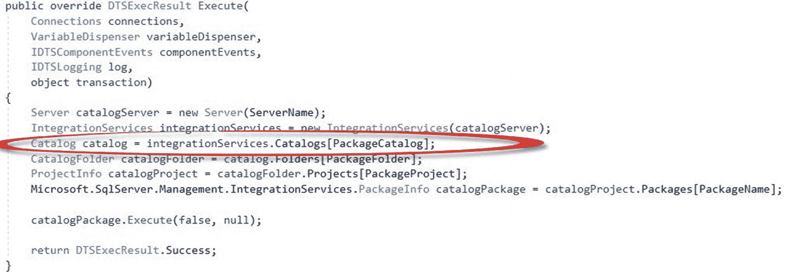
*图 10-3：一个类型为 `Microsoft.SqlServer.Management.IntegrationServices.Catalog` 的变量*

将此属性从 `Execute` 方法中剪切出来，并为类作用域中的任务使用一个新的、类型为 `Microsoft.SqlServer.Management.IntegrationServices.Catalog` 的私有属性，这有多困难？一旦在任务配置期间有足够的信息可用，我们就可以为 `catalog` 属性赋值。毕竟，“执行目录包任务”将连接到一个且仅一个 SSIS 目录。

首先，在 `ExecuteCatalogPackageTask` 属性列表中添加一个名为 `catalog`、类型为 `Microsoft.SqlServer.Management.IntegrationServices` 的新属性，如清单 10-1 和图 10-4 所示：

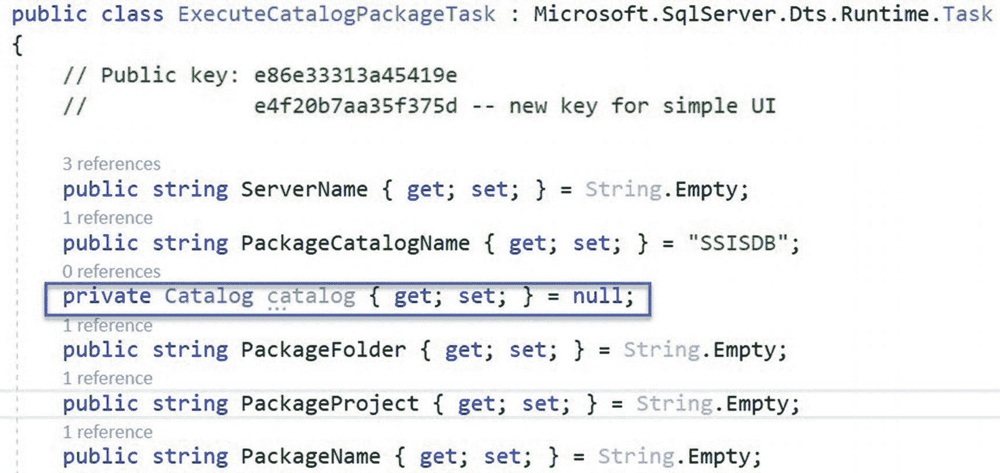
*图 10-4：声明一个 `Catalog` 属性*

```csharp
public Catalog catalog { get; set; } = null;
```
*清单 10-1：添加 `Catalog` 属性的代码*

> **注意**
> 此属性的名称首字母不大写。这是有意为之。此属性将是任务内部的。此外，对象类型不需要包含 “`Microsoft.SqlServer.Management.IntegrationServices`”，因为代码在类代码顶部包含了 `using Microsoft.SqlServer.Management.IntegrationServices`。

因为 `catalog` 属性是 `ExecuteCatalogPackageTask` 类内部的，所以它被声明为 `private`。

趁此机会，让我们将其他变量从 `Execute` 方法迁移到私有属性，例如 `catalogServer`（`Microsoft.SqlServer.Management.Smo.Server` 类型）、`integrationServices`（`Microsoft.SqlServer.Management.IntegrationServices` 类型）、`catalogFolder`（`Microsoft.SqlServer.Management.IntegrationServices.CatalogFolder` 类型）、`catalogProject`（`Microsoft.SqlServer.Management.IntegrationServices.ProjectInfo` 类型）、`catalogPackage`（`Microsoft.SqlServer.Management.IntegrationServices.PackageInfo` 类型），如清单 10-2 和图 10-5 所示：

```csharp
private Server catalogServer { get; set; } = null;
private IntegrationServices integrationServices { get; set; } = null;
private CatalogFolder catalogFolder { get; set; } = null;
private ProjectInfo catalogProject { get; set; } = null;
private Microsoft.SqlServer.Management.IntegrationServices.PackageInfo catalogPackage { get; set; } = null;
```
*清单 10-2：添加其他属性*

请注意 `catalogPackage` 私有属性的完整数据类型说明。必须声明变量类型的全名，因为在 `Microsoft.SqlServer.Dts.Runtime` 程序集中存在另一个不同的 `PackageInfo` 类型。如果不具体说明，Visual Studio 会报错，因为它无法确定我们希望使用哪个 `PackageInfo` 类型。

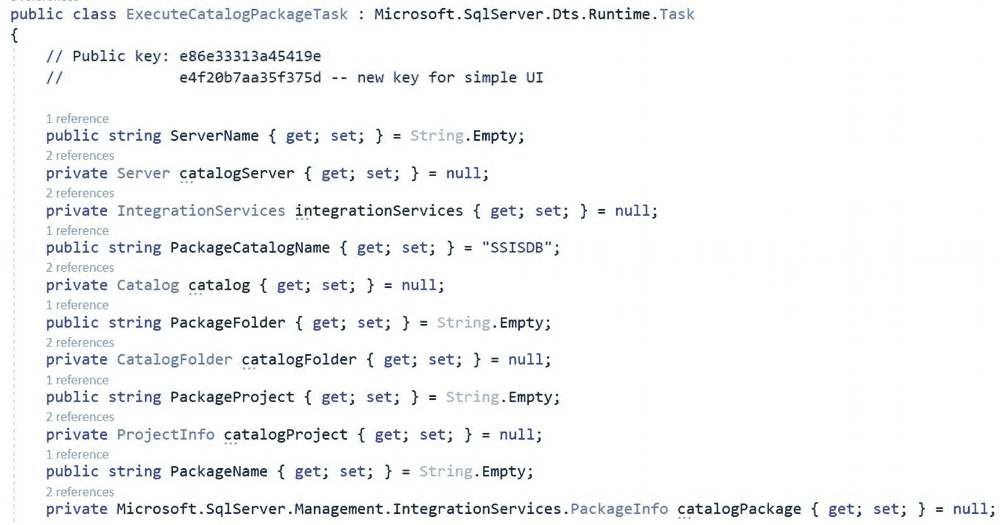
*图 10-5：添加的其他属性*

接下来让我们更新 `Execute` 方法，以初始化我们刚刚添加的类作用域变量。

### 更新 Execute 方法

为了继续我们的重构工作，请更新`Execute`方法中声明的变量，以使用并初始化新的内部任务属性。

`Execute`方法的当前状态列于代码清单 10-3，并如图 10-6 所示：

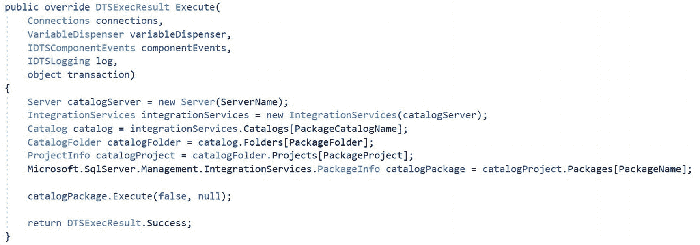
*图 10-6：Execute 方法的当前版本*

```
public override DTSExecResult Execute(
    Connections connections,
    VariableDispenser variableDispenser,
    IDTSComponentEvents componentEvents,
    IDTSLogging log,
    object transaction)
{
    Server catalogServer = new Server(ServerName);
    IntegrationServices integrationServices = new IntegrationServices(catalogServer);
    Catalog catalog = integrationServices.Catalogs[PackageCatalogName];
    CatalogFolder catalogFolder = catalog.Folders[PackageFolder];
    ProjectInfo catalogProject = catalogFolder.Projects[PackageProject];
    Microsoft.SqlServer.Management.IntegrationServices.PackageInfo catalogPackage = catalogProject.Packages[PackageName];
    catalogPackage.Execute(false, null);
    return DTSExecResult.Success;
}
```
*代码清单 10-3：当前的 Execute 方法*

我们希望在`Execute`方法中初始化新的类作用域变量，因此需要移除类型声明。更新类型声明和初始化代码以*移除*类型声明，如代码清单 10-4 所示：

```
catalogServer = new Server(ServerName);
integrationServices = new IntegrationServices(catalogServer);
catalog = integrationServices.Catalogs[PackageCatalogName];
catalogFolder = catalog.Folders[PackageFolder];
catalogProject = catalogFolder.Projects[PackageProject];
catalogPackage = catalogProject.Packages[PackageName];
```
*代码清单 10-4：移除 Execute 方法中的变量类型声明*

在我们扩展 Execute Catalog Package Task 功能的努力中，此刻可以通过构建解决方案并测试任务来进行验证（参见第 9 章，“构建任务”和“测试任务”部分）。这是对我们修改`Execution`方法的一个良好测试。

## 添加新的编辑器

本章引言中的两个要点是：

*   为任务用户提供更“SSIS 风格”的体验，包括一个带有“常规”和“设置”页面“视图”的“漂亮”编辑器。
*   支持使用 SSIS 表达式。

在继续本节内容之前，作者要向 Kirk Haselden 致以谢意，感谢他出色的早期 SSIS 著作《Microsoft SQL Server 2005 Integration Services》（amazon.com/Microsoft-Server-2005-Integration-Services-dp-0672327813/dp-0672327813），Sams 出版社，2006 年。

我认识许多人都是通过 Kirk 的书学习自定义 SSIS 任务的。

谢谢你，Kirk！

### 复杂用户界面概述

本书的这一部分内容难度较高且深入。复杂 UI 的核心是`Microsoft.DataTransformationServices.Controls`程序集。继承自`Microsoft.DataTransformationServices.Controls`程序集具有挑战性，并且可能不够直观。尽管如此，`Microsoft.DataTransformationServices.Controls`程序集所呈现的功能，绝对值得花费时间去克服任何挑战并应对其非直观性。

`Microsoft.DataTransformationServices.Controls`程序集要求开发*视图*，当我们打开任务编辑器时，SSIS 开发者就会遇到这些视图。每个视图代表一组高级别的任务属性集合。视图列在编辑器的左侧，如图 10-7 中绿色框所示：

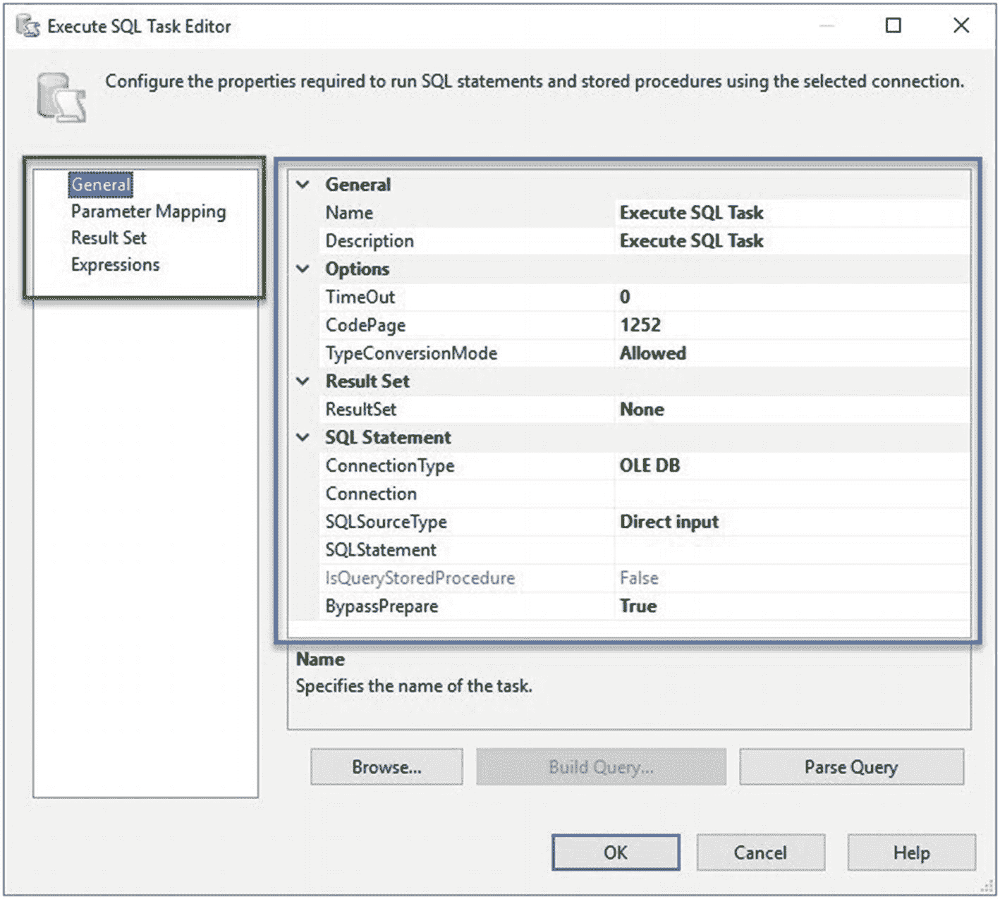
*图 10-7：执行 SQL 任务的“常规”页面*

每个视图的底层是一个*节点*，定义为一个内部的 C#类，为每个视图实例化。每个节点呈现一个`PropertyGrid`控件，如图 10-7 中蓝色框内所示。

一个节点管理按属性类别组织的任务属性集合。每个任务属性都是节点类中的一个 C#属性。我们稍后将构建的一个例子是常规视图（General view）中常规节点（General node）的`Name`属性。这段代码代表了一种 视图 ➤ 节点 ➤ 属性类别 ➤ 属性 的层次结构。代码流程如代码清单 10-5 所示：

```
namespace ExecuteCatalogPackageTaskComplexUI
{
    public partial class GeneralView
    {
        private GeneralNode generalNode = null;
    }
    internal class GeneralNode
    {
        [
            Category("General"),
            Description("Specifies the name of the task.")
        ]
        public string Name
        {
            get { return taskHost.Name; }
            set { taskHost.Name = value; }
        }
    }
}
```
*代码清单 10-5：常规视图、常规节点、Name 属性的部分代码列表*

代码清单 10-5 部分列表中所示的 视图 ➤ 节点 ➤ 属性类别 ➤ 属性 层次结构，始于名为`GeneralView`的视图。`GeneralView`声明了一个`GeneralNode`类型的私有成员，名为`generalNode`。`GeneralNode`类包含一个名为`Name`的字符串类型属性。`Name`属性使用`Category`和`Description`特性进行修饰，其中`Category`特性包含了属性类别的名称（"General"）。

图 10-8 展示了执行 SQL 任务编辑器的层次结构。如前所述，常规视图（左侧绿框中）显示常规节点——由`propertygrid`控件（右侧蓝框中）表示。名为“General”的属性类别显示在红框中。`Name`属性显示在黄框内，如图 10-8 所示：

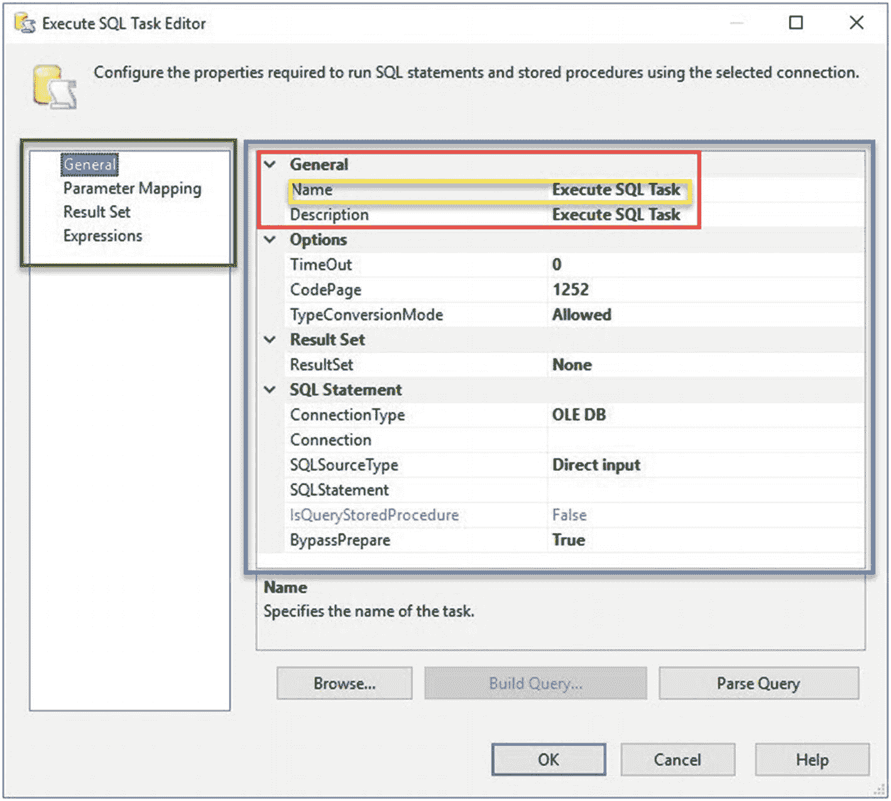
*图 10-8：可视化 视图 ➤ 节点 ➤ 属性类别 ➤ 属性*

应用到 视图 ➤ 节点 ➤ 属性类别 ➤ 属性 层次结构中，执行 SQL 任务编辑器（如图 10-8 所示）的实体名称如下：常规（视图） ➤ 常规（节点） ➤ 常规（属性类别） ➤ 名称（属性）。这里有很多“常规”——其中一个（常规节点）隐藏在`propertygrid`控件之下。

## 10. 添加编辑器项目

### 添加编辑器项目

要开始添加一个新的编辑器，请通过在解决方案资源管理器中右键单击解决方案，将鼠标悬停在“添加”上，然后单击“新建项目…”，向 `ExecuteCatalogPackageTask` Visual Studio 解决方案添加一个新项目，如图 10-9 所示：

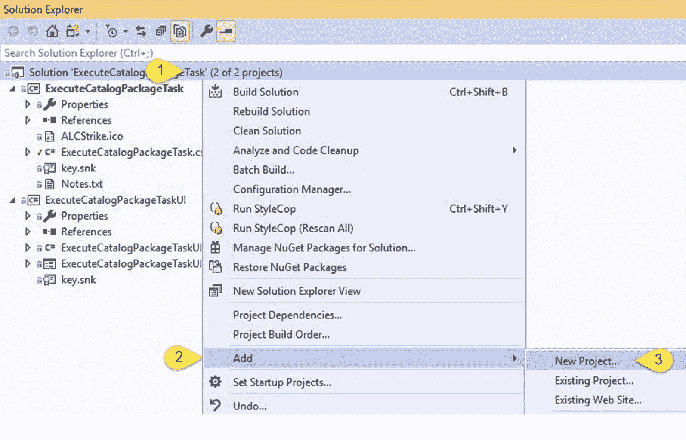

图 10-9: 添加新项目

当“创建新项目”窗口显示时，搜索并选择一个 C# 类库（.NET Framework）项目类型，或选择你选择的 .NET 语言。我选择了 C# 作为语言，并将项目命名为 `ExecuteCatalogPackageTask`，如图 10-10 所示：

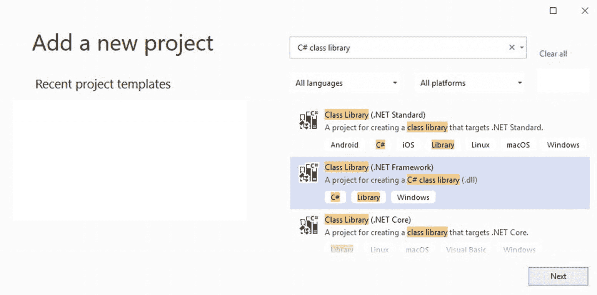

图 10-10: 选择项目类型

选择“类库（.NET Framework）”并单击下一步按钮。

当“配置新项目”窗口显示时，输入“`ExecuteCatalogPackageTaskComplexUI` ”作为新项目的名称，并设置项目文件位置，如图 10-11 所示：

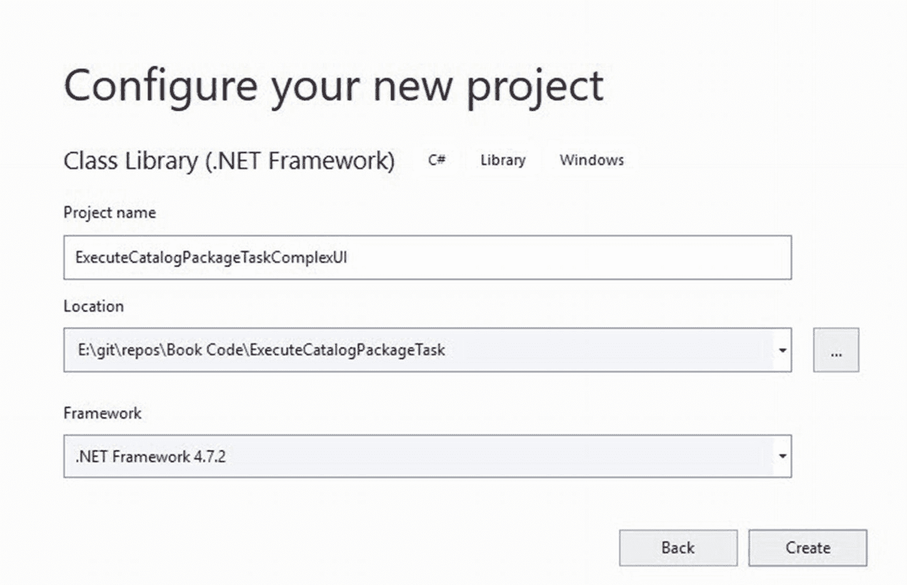

图 10-11: 配置并命名新项目

单击创建按钮以添加新的 `ExecuteCatalogPackageTaskComplexUI` 项目。

要移除现有的 `ExecuteCatalogPackageTaskUI` 项目，请在解决方案资源管理器中右键单击 `ExecuteCatalogPackageTaskUI` 项目，然后单击“移除”，如图 10-12 所示：

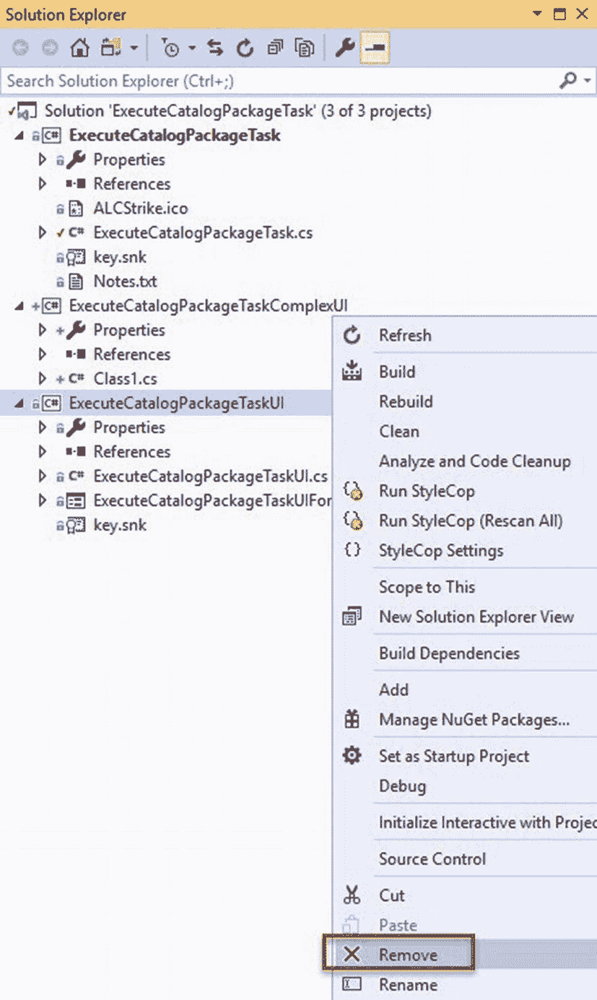

图 10-12: 移除 `ExecuteCatalogPackageTaskUI` 项目

在解决方案资源管理器中，将 `ExecuteCatalogPackageTaskComplexUI` 项目的 `Class1.cs` 文件重命名为“`ExecuteCatalogPackageTaskComplexUI`”，如图 10-13 所示：

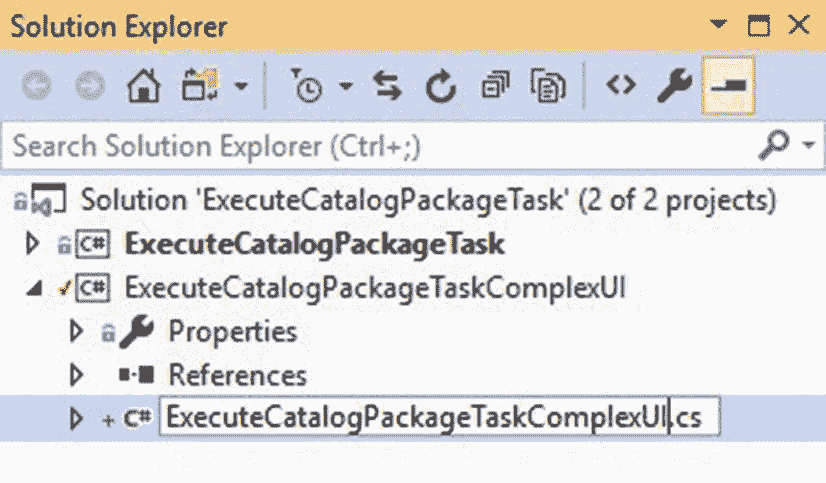

图 10-13: 将 `Class1.cs` 重命名为 `ExecuteCatalogPackageTaskComplexUI.cs`

Visual Studio 将提示询问你是否也要重命名项目中对“`Class1`”的所有引用，如图 10-14 所示：

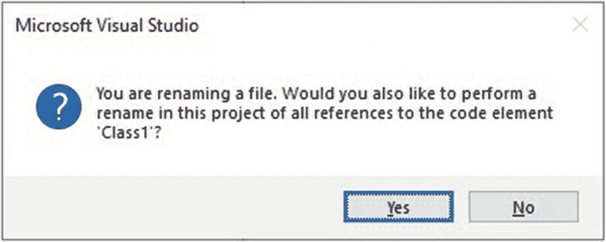

图 10-14: 提示将所有 `Class1` 引用重命名为 `ExecuteCatalogPackageTaskComplexUI`

单击是按钮。请注意，`ExecuteCatalogPackageTaskComplexUI.cs` 文件中的 `public class Class1` 声明现在变为 `public class ExecuteCatalogPackageTaskComplexUI`，如图 10-15 所示：

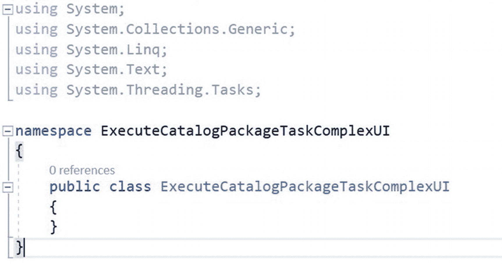

图 10-15: `Class1` 现在是 `ExecuteCatalogPackageTaskComplexUI`

`ExecuteCatalogPackageTaskComplexUI` 类现在已准备好用于引用和额外的编码。

### 使用引用的程序集

要访问上一节中引用的程序集，请在 `ExecuteCatalogPackageTaskComplexUI` 类中靠近现有 using 语句的位置添加如代码清单 10-6 所示的 `using` 语句：

```
using Microsoft.SqlServer.Dts.Runtime;
using Microsoft.SqlServer.Dts.Runtime.Design;
using System.Windows.Forms;
代码清单 10-6: 使用引用的程序集
```

添加后，`ExecuteCatalogPackageTaskComplexUI` 类应如图 10-20 所示：

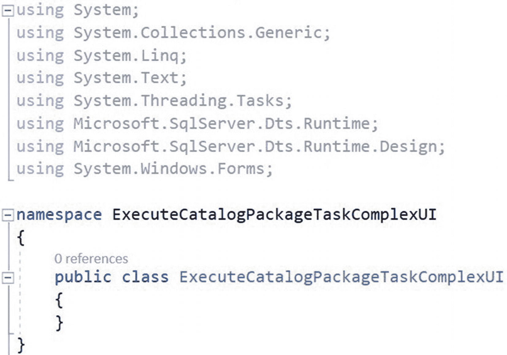

图 10-20: 添加额外 using 语句后的 `ExecuteCatalogPackageTaskComplexUI` 类

接下来，通过编辑 `ExecuteCatalogPackageTaskComplexUI` 类声明来继承 `IDtsTaskUI` 接口，使其如代码清单 10-7 和图 10-21 所示：

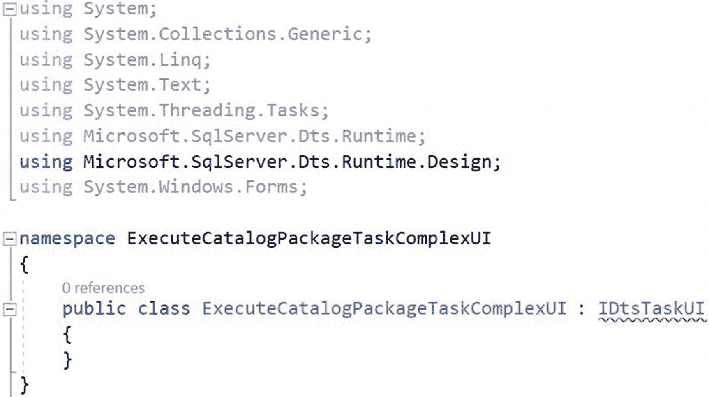

图 10-21: `ExecuteCatalogPackageTaskComplexUI` 继承 `IDtsTaskUI`

```
public class ExecuteCatalogPackageTaskComplexUI : IDtsTaskUI
代码清单 10-7: `ExecuteCatalogPackageTaskComplexUI` 继承 `IDtsTaskUI`
```

实现后，该类应如图 10-21 所示。

图 10-21 中 `IDtsTaskUI` 下方的红色波浪线表示继承的接口未正确——或者说，在本例中是*完全地*——实现。单击该行，然后展开快速操作以查看问题，如图 10-22 所示：

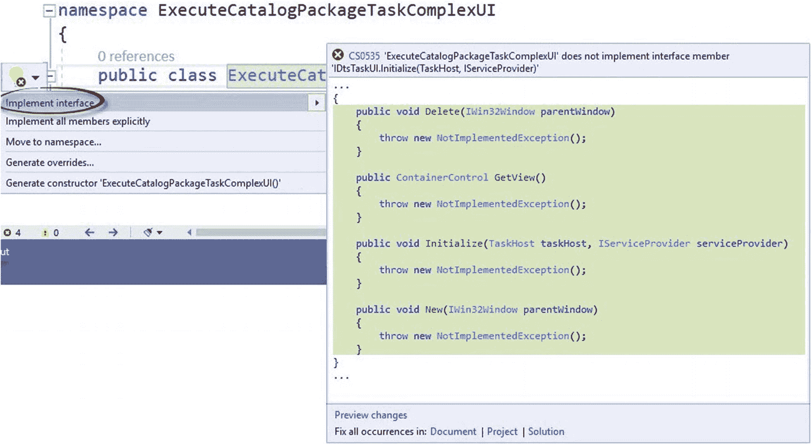

图 10-22: `IDtsTaskUI` 实现问题

单击“实现接口”选项将实现所需接口成员的骨架版本，如图 10-23 所示：

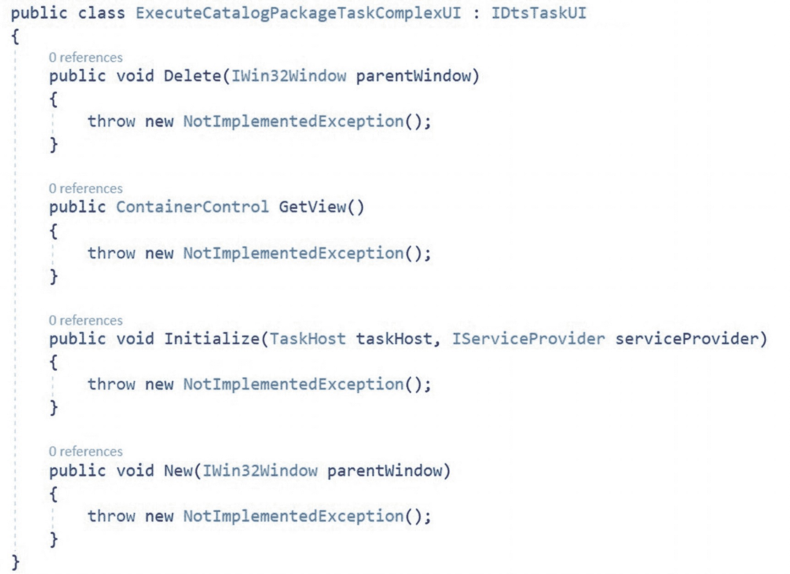

图 10-23: 已实现成员的 `IDtsTaskUI` 接口

每个成员默认实现为抛出异常。请注意，`IDtsTaskUI` 下方的红色波浪线已不复存在。

### 结论

在本章中，我们开始了开发新任务编辑器的过程。我们首先重构了现有的 `ExecuteCatalogPackageTask` 代码，并用新版本替换了现有的任务编辑器项目。

现在将是签入此解决方案的最佳时机。

