# 11. 复杂编辑器的最小化编码

本章继续本书本部分的目标，这些目标是：

*   为任务用户提供更“SSIS 风格”的体验，包括一个带有“常规”和“设置”页面“视图”的“漂亮”编辑器
*   启用 SSIS 表达式的使用
*   添加任务设置的设计时验证
*   在编辑器中显示更多 SSIS 目录执行属性

在第 10 章中，我们通过重构现有的 `ExecuteCatalogPackageTask` 代码并用新版本替换现有的任务编辑器项目，开始了开发新任务编辑器的过程。

在本章中，我们开始对 `ExecuteCatalogPackageTaskComplexUI` 进行最小化编码，通过创建编辑器窗体并向 SSIS 任务的“视图 ➤ 节点 ➤ 属性类别 ➤ 属性”层次结构添加“常规”和“设置”视图。

## 更新 DtsTask 接口成员

`ExecuteCatalogPackageTaskComplexUI` 类中当前的代码（已重新排序）如代码清单 11-1 所示：

```
public class ExecuteCatalogPackageTaskComplexUI : IDtsTaskUI
{
    public void Initialize(TaskHost taskHost, IServiceProvider serviceProvider)
    {
        throw new NotImplementedException();
    }

    public ContainerControl GetView()
    {
        throw new NotImplementedException();
    }

    public void New(IWin32Window parentWindow)
    {
        throw new NotImplementedException();
    }

    public void Delete(IWin32Window parentWindow)
    {
        throw new NotImplementedException();
    }
}
代码清单 11-1: `ExecuteCatalogPackageTaskComplexUI` 当前代码，已重新排序
```

新的顺序很符合我的 CDO（那是“OCD”，字母顺序正确）。

在接下来的章节中，我们通过添加成员（内部变量）、接口成员方法和视图（将在编辑器中转换为“页面”）来构建“SSIS 风格”的编辑器。


## 添加内部变量

开始编码，在声明 `ExecuteCatalogPackageTaskComplexUI` 类之后立即添加两个变量，如代码清单 11-2 所列：

```
private TaskHost taskHost = null;
private IDtsConnectionService connectionService = null;
代码清单 11-2
声明 taskHost 和 connectionService 内部变量
```

添加后，你的代码应如图 11-1 所示：

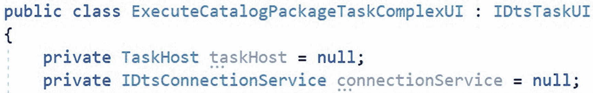

图 11-1

添加内部变量：`taskHost` 和 `connectionService`

`taskHost` 和 `connectionService` 变量用于在 `ExecuteCatalogPackageTaskComplexUI` 编辑器类和 `ExecuteCatalogPackageTask` 类之间传递值。

## 编写接口成员方法

在 `Initialize` 方法中，将上一章自动生成的代码行 `throw new NotImplementedException();` 替换为代码清单 11-3 中列出的代码：

```
this.taskHost = taskHost;
this.connectionService =
serviceProvider.GetService(typeof(IDtsConnectionService))
as IDtsConnectionService;
代码清单 11-3
初始化 taskHost 和 connectionService
```

完成后，你的代码应如图 11-2 所示：

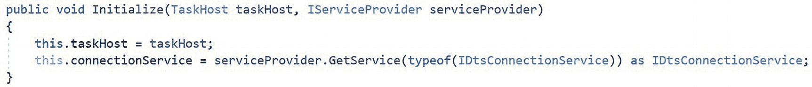

图 11-2

`taskHost` 和 `connectionService` 变量已初始化

在 `GetView` 方法中，将上一章自动生成的代码行 `throw new NotImplementedException();` 替换为实例化编辑器窗体新实例的代码，如代码清单 11-4 所列：

```
return new ExecuteCatalogPackageTaskComplexUIForm(taskHost, connectionService);
代码清单 11-4
用于实例化编辑器窗体新实例的代码
```

完成后，你的代码应如图 11-3 所示：

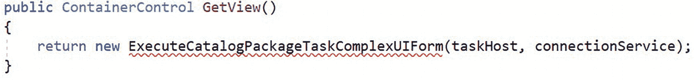

图 11-3

实例化编辑器窗体的新实例

`ExecuteCatalogPackageTaskComplexUIForm` 下方的红色波浪线提示我们这行代码存在问题。点击“快速操作”可获取更多信息，如图 11-4 所示：

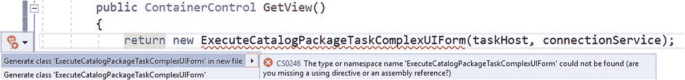

图 11-4

`ExecuteCatalogPackageTaskComplexUIForm` 尚不存在

将 `New` 和 `Delete` 接口成员方法中的 `throw` 语句注释掉，编辑每个方法中的代码使其与代码清单 11-5 匹配：

```
// throw new NotImplementedException();
代码清单 11-5
Throw 语句，已注释掉
```

`New` 和 `Delete` 接口成员方法应如图 11-5 所示：

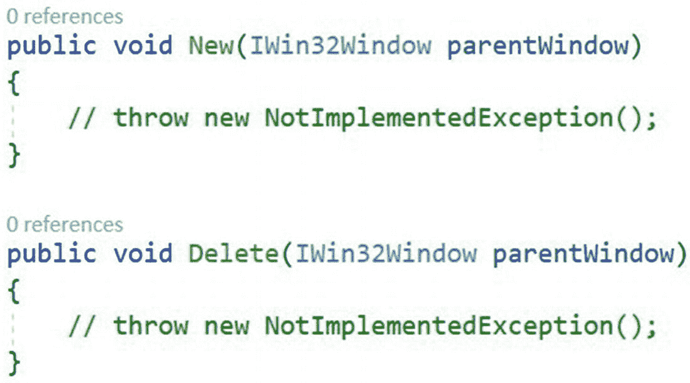

图 11-5

New 和 Delete 成员方法

下一步是为编辑器创建一个窗体。

## 创建编辑器窗体

编辑器窗体为开发者提供了一个查看和配置任务属性的界面。本书前面，我们构建了一个自定义编辑器。在本节中，我们将添加一个更具“SSIS 风格”的编辑器。

通过添加一个新类来开始添加编辑器窗体。要添加新类，请在解决方案资源管理器中右键单击 `ExecuteCatalogPackageTaskComplexUI` 项目，将鼠标悬停在“添加”菜单项上，然后单击“类”，如图 11-6 所示：

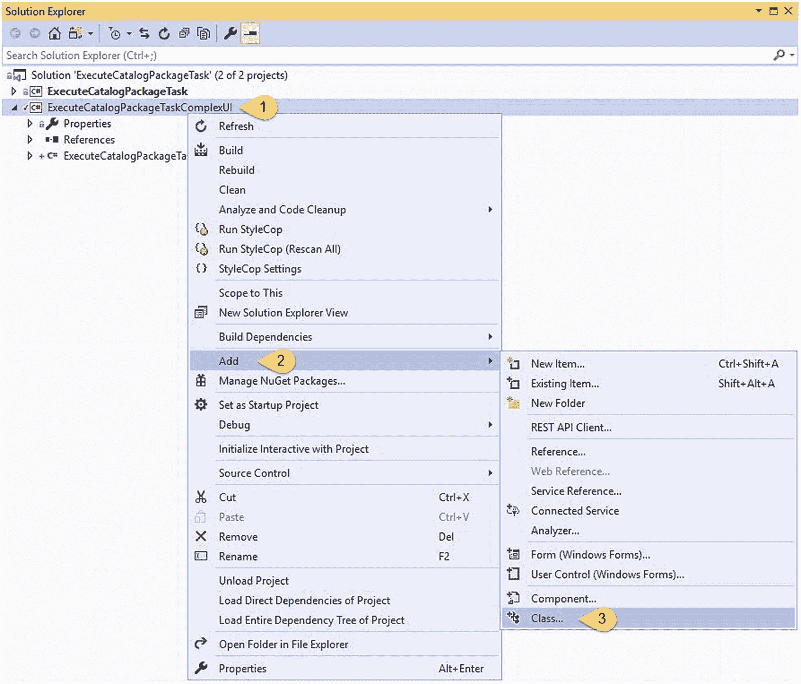

图 11-6

添加新类

当“添加新项”对话框显示时，将新类命名为“ExecuteCatalogPackageTaskComplexUIForm”，如图 11-7 所示：

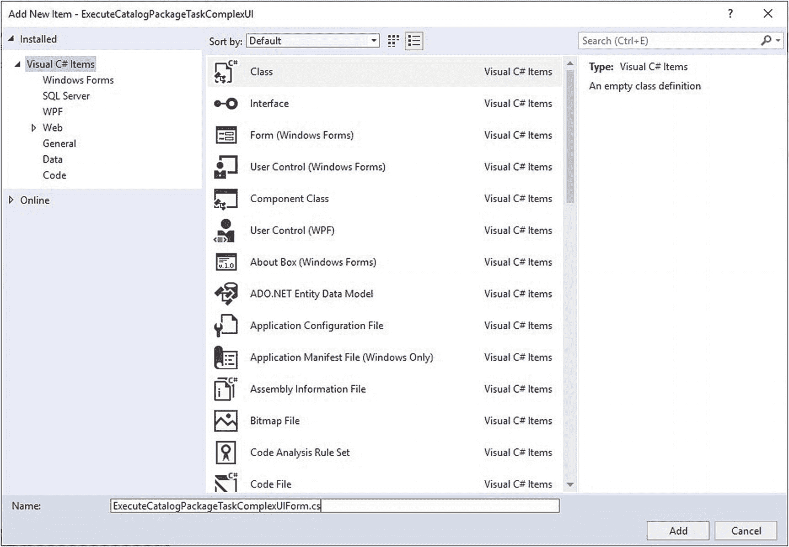

图 11-7

添加 `ExecuteCatalogPackageTaskComplexUIForm` 类

`ExecuteCatalogPackageTaskComplexUIForm` 类将如图 11-8 所示：

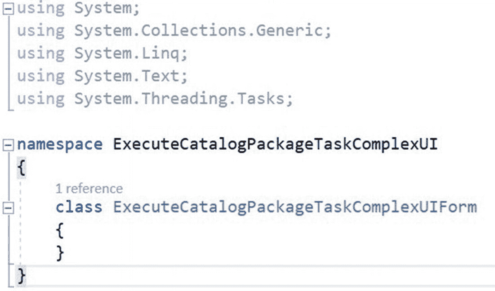

图 11-8

`ExecuteCatalogPackageTaskComplexUIForm` 类

修改 `ExecuteCatalogPackageTaskComplexUIForm` 类声明，使其如代码清单 11-6 所示：

```
public partial class ExecuteCatalogPackageTaskComplexUIForm : DTSBaseTaskUI
代码清单 11-6
修改 ExecuteCatalogPackageTaskComplexUIForm 类声明
```

类声明应如图 11-9 所示：

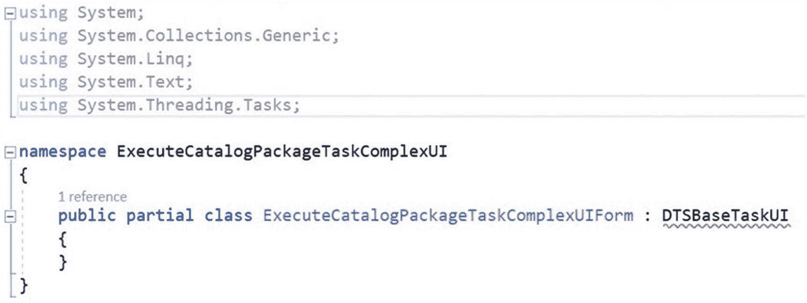

图 11-9

`ExecuteCatalogPackageTaskComplexUIForm` 声明，已修改

`ExecuteCatalogPackageTaskComplexUIForm` 类继承自 `DTSBaseTaskUI`，这是一个定义在 `Microsoft.DataTransformationServices.Controls` 程序集中的接口。虽然 `ExecuteCatalogPackageTaskComplexUI` 项目中引用了 `Microsoft.DataTransformationServices.Controls` 程序集，但它并未列在 `ExecuteCatalogPackageTaskComplexUIForm` 类正在*使用*的程序集集合中。通过添加代码清单 11-7 中列出的 `using` 语句来解决此问题（并消除 `DTSBaseTaskUI` 继承实现下方的红色波浪线）：

```
using Microsoft.DataTransformationServices.Controls;
代码清单 11-7
添加 using 语句
```

`ExecuteCatalogPackageTaskComplexUIForm` 类现在应如图 11-10 所示：

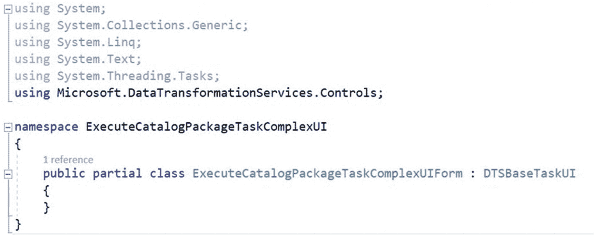

图 11-10

`Microsoft.DataTransformationServices.Controls` 已添加

下一步是为 `Title` 和 `Description` 添加私有成员（作为字符串常量），以及一个公共静态 `taskIcon`。`Title`、`Description` 和 `taskIcon` 将在下一步用于配置基类。

`继承`、`封装`和`多态`构成了面向对象编程（OOP）的基础。`继承`允许开发者设计一个更通用的`基类`，然后在一个称为`派生类`的更具体的类中`继承`其成员。更多信息请参见 docs.microsoft.com/en-us/dotnet/csharp/programming-guide/classes-and-structs/inheritance。

通过在分部类声明之后添加代码清单 11-8 中的代码，来为 `Title` 和 `Description` 添加私有成员，以及一个公共静态 `taskIcon` 声明：

```
private const string Title = "Execute Catalog Package Complex Task Editor";
private const string Description = "This task executes an SSIS package in an SSIS Catalog.";
public static Icon taskIcon = new Icon(typeof(ExecuteCatalogPackageTask.ExecuteCatalogPackageTask), "ALCStrike.ico");
代码清单 11-8
添加 Title、Description 和 Icon
```

如果`基类`允许，可以从`派生类`设置`基类`中的成员（或属性）。


### 编写表单构造函数

当对象被加载到内存中——或者说*实例化*时，一个*构造函数*会通过加载和初始化对象成员（属性）来初始化对象的状态。图 11-12（最初显示在图 11-3 中）中记录的截图包含一个对`ExecuteCatalogPackageTaskComplexUIForm`类的调用，该调用会触发`ExecuteCatalogPackageTaskComplexUIForm`类的构造函数。此调用显示了一个错误，如图 11-12 所示：

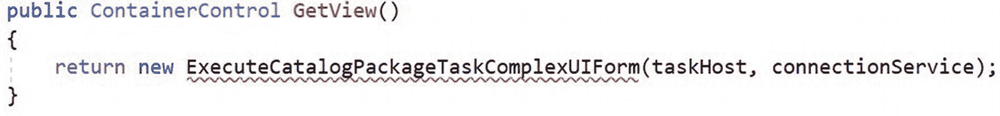

图 11-12

调用 `ExecuteCatalogPackageTaskComplexUIForm`

错误依然存在，因为没有接受两个参数的`ExecuteCatalogPackageTaskComplexUIForm`类的构造函数。在清单 11-9 中添加代码，为`ExecuteCatalogPackageTaskComplexUIForm`类创建一个接受两个参数的构造函数：

```
public ExecuteCatalogPackageTaskComplexUIForm(TaskHost taskHost, object connections) :
base(Title, taskIcon, Description, taskHost, connections)
{ }
清单 11-9
编写 ExecuteCatalogPackageTaskComplexUIForm 构造函数
```

添加后，`ExecuteCatalogPackageTaskComplexUIForm`构造函数应如图 11-13 所示：

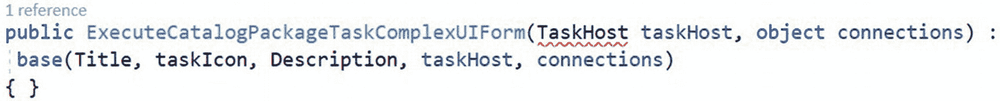

图 11-13

添加 `ExecuteCatalogPackageTaskComplexUIForm` 构造函数代码

`TaskHost`对象未被初始化，因为类头缺少对`Microsoft.SqlServer.Dts.Runtime`程序集的`using`语句。添加清单 11-10 中所示的`using`语句：

```
using Microsoft.SqlServer.Dts.Runtime;
清单 11-10
添加 using Microsoft.SqlServer.Dts.Runtime
```

`TaskHost` 不再报错

使用清单 11-11 中的代码添加两个常量来初始化任务的`Title`和`Description`属性，以及一个静态的`Icon`以供编辑器窗体使用：

```
private const string Title = "Execute Catalog Package Task Editor";
private const string Description = "This task executes an SSIS package in an SSIS Catalog.";
public static Icon taskIcon = new Icon(typeof(ExecuteCatalogPackageTask.ExecuteCatalogPackageTask), "ALCStrike.ico");
清单 11-11
添加 Title, Description, 和 taskIcon
```

添加后，代码如图 11-14 所示：

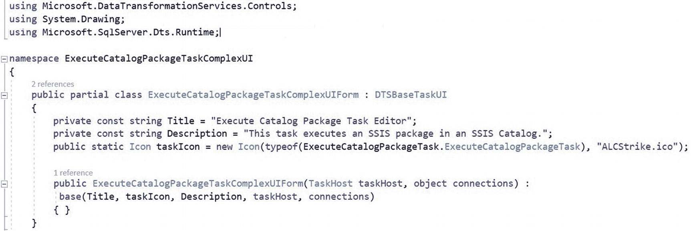

图 11-14

`TaskHost` 不再报错

此外，位于`ExecuteCatalogPackageTaskComplexUI.GetView`方法中对`ExecuteCatalogPackageTaskComplexUIForm`构造函数的调用也不再报错，如图 11-15 所示：

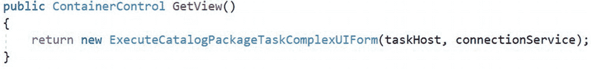

图 11-15

`ExecuteCatalogPackageTaskComplexUI.GetView` 方法中没有错误

下一步是向`ExecuteCatalogPackageTaskComplexUIForm`类添加视图。

### 调用视图

SSIS 任务编辑器以层次结构展示属性：视图 ➤ 节点 ➤ 属性类别 ➤ 属性。*视图*是 SSIS 任务编辑器上的“页面”。以下部分出现在第 10 章。我们在此处再次呈现以作复习。

图 11-16 可视化了“执行 SQL 任务编辑器”的层次结构。如前所述，“常规”视图（左侧绿色框中）显示“常规”节点——由`propertygrid`控件（右侧蓝色框中）表示。名为“General”的属性类别显示在红色框中。`Name`属性显示在黄色框内，如图 11-16 所示：

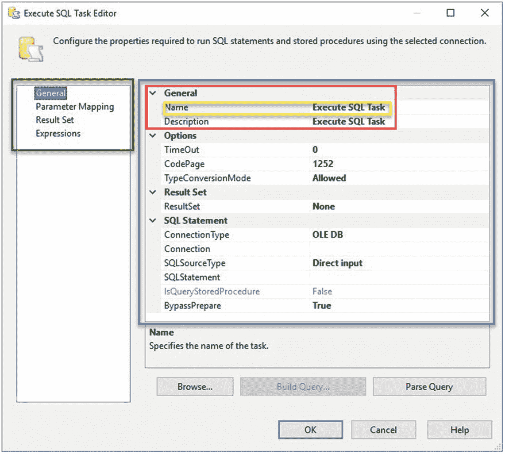

图 11-16

可视化 视图 ➤ 节点 ➤ 属性类别 ➤ 属性

应用于视图 ➤ 节点 ➤ 属性类别 ➤ 属性层次结构，图 11-16 中所示的“执行 SQL 任务编辑器”的实体名称如下：General (视图) ➤ General (节点) ➤ General (属性类别) ➤ Name (属性)。这里有很多“General”，其中一个——General 节点——隐藏在`propertygrid`控件之下。

将清单 11-12 中的代码添加到`ExecuteCatalogPackageTaskComplexUIForm`类的构造函数中，以调用“常规”和“设置”视图：

```
// Add General view
GeneralView generalView = new GeneralView();
this.DTSTaskUIHost.AddView("General", generalView, null);
// Add Settings view
SettingsView settingsView = new SettingsView();
this.DTSTaskUIHost.AddView("Settings", settingsView, null);
清单 11-12
添加对“常规”和“设置”视图的调用
```

添加后，代码应如图 11-17 所示：

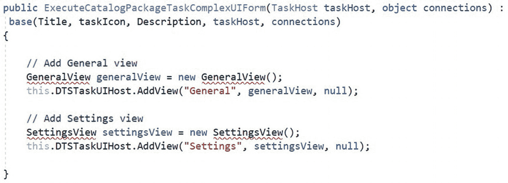

图 11-17

包含对“常规”和“设置”视图调用的 `ExecuteCatalogPackageTaskComplexUIForm` 类构造函数

`GeneralView`和`SettingsView`类尚不存在，因此它们下方有红色波浪线。下一步是创建并编写视图类的代码，从`GeneralView`开始。


### 编写 GeneralView 类

本节代码构建了“视图 ➤ 节点 ➤ 属性类别 ➤ 属性”层级结构中的 `View` 部分。需要注意的是，`GeneralView` 类实际上是一个 `System.Windows.Forms` 对象，这就是为什么实现过程中会自动添加 `using System.Windows.Forms;` 这一语句。在本章后续部分，我们将手动添加标准和典型的 `Form` 方法。为什么不直接将 `GeneralView` 作为一个窗体添加呢？本书是为非专业软件开发人员编写的。通过添加类而不是窗体，是一种强调窗体*就是*类这一事实的方式。

在“解决方案资源管理器”中，右键单击 `ExecuteCatalogPackageTaskComplexUI` 项目，将鼠标悬停在 **添加** 上，然后单击 **类…**。当 **添加新项** 对话框显示时，将 `Class1.cs` 更改为 `GeneralView.cs`，如图 11-18 所示：

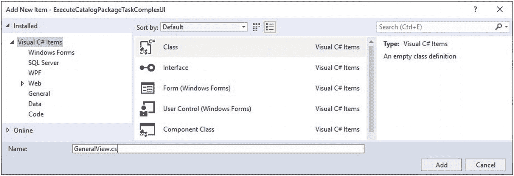

图 11-18
添加 `GeneralView` 类

单击 **添加** 按钮以添加新的 `GeneralView` 类。

使用清单 11-13 中的代码编辑类声明：

```
public partial class GeneralView : System.Windows.Forms.UserControl, IDTSTaskUIView
```

清单 11-13
`GeneralView` 类声明

编辑后，代码应如图 11-19 所示：

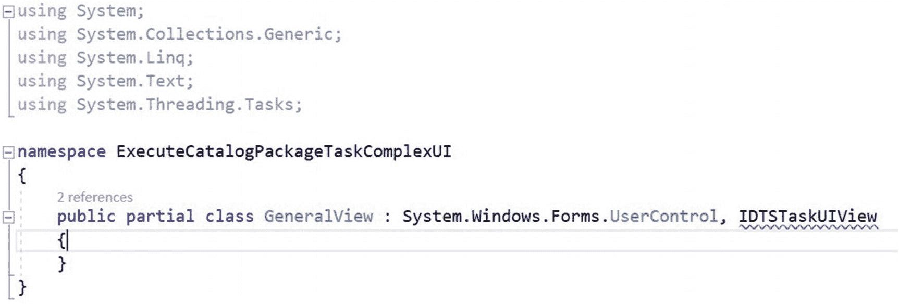

图 11-19
`GeneralView` 类声明，已编辑

`GeneralView` 被声明为继承自两个接口：
*   `System.Windows.Forms.UserControl`
*   `IDTSTaskUIView`

添加一个 `using` 语句引用 `Microsoft.DataTransformationServices.Controls` 程序集 —— 如清单 11-14 所示 —— 以实现 `IDTSTaskUIView` 接口：

```
using Microsoft.DataTransformationServices.Controls;
```

清单 11-14
`IDTSTaskUIView` 的 `using` 语句

添加 `using` 语句消除了 `GeneralView` 类中的直接错误，但还存在另一个错误。将鼠标悬停在带有红色波浪下划线的 `IDTSTaskUIView` 文本上，会显示潜在的修复“助手”图标，如图 11-20 所示：

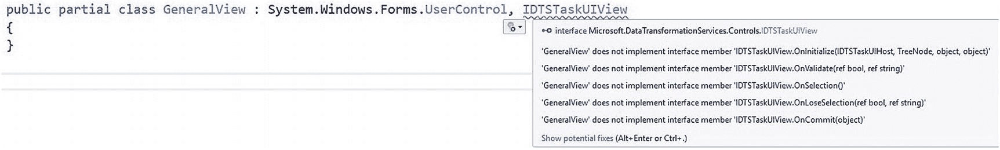

图 11-20
`IDTSTaskUIView` 接口已被识别但尚未实现

单击下拉菜单，然后单击 **实现接口**，如图 11-21 所示：

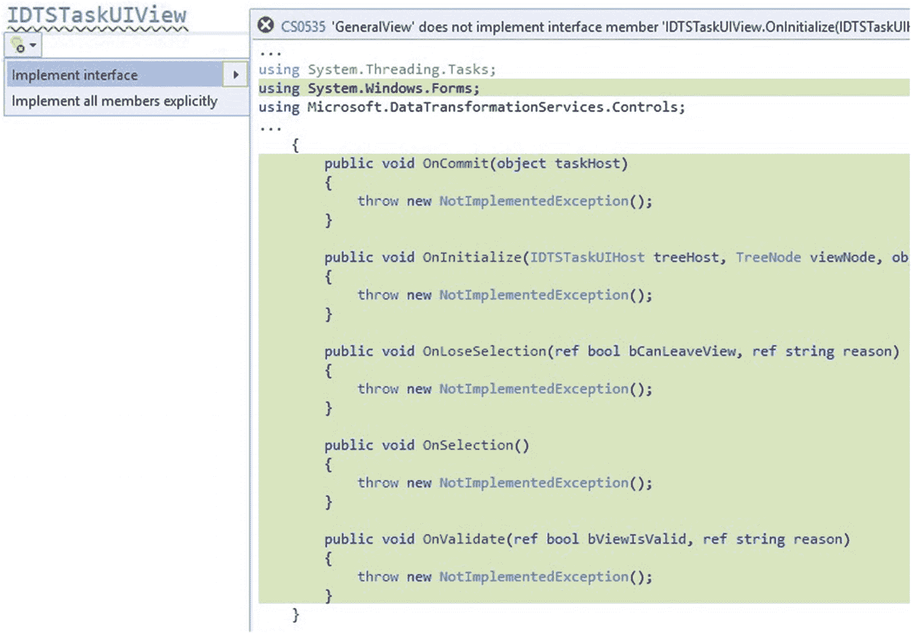

图 11-21
显示潜在的修复

实现接口会添加清单 11-15 中的代码，如图 11-22 所示：

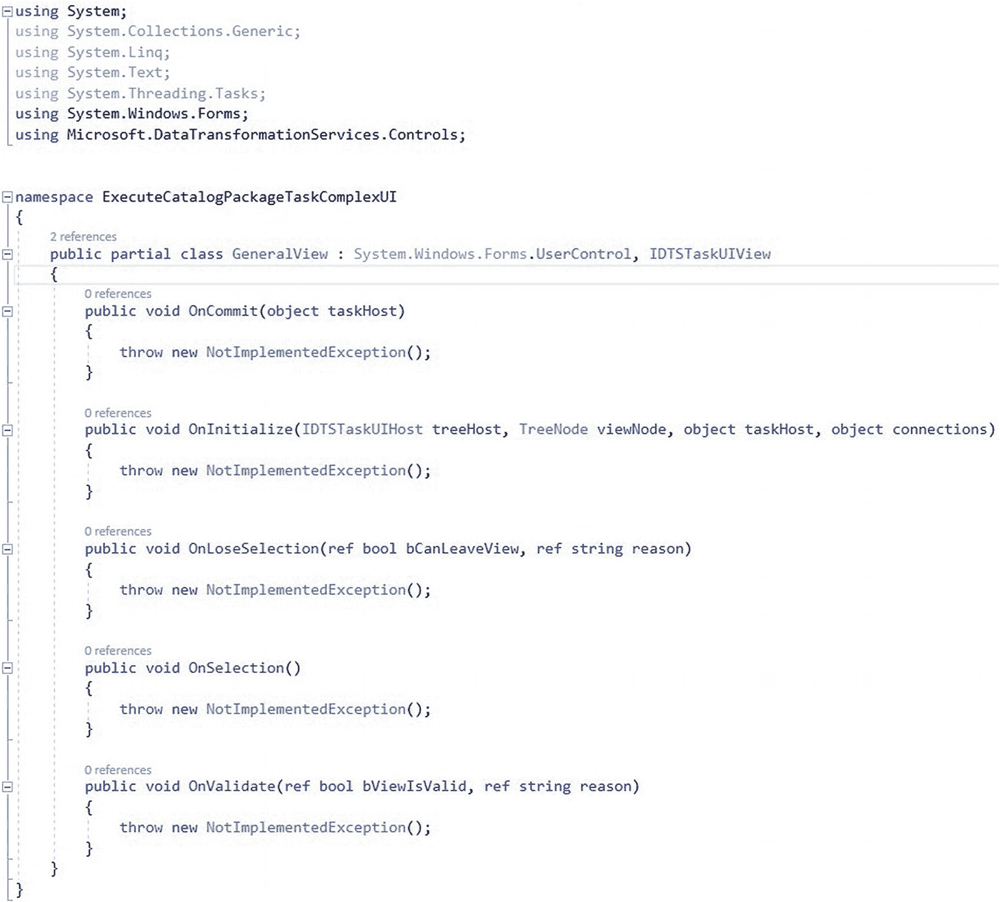

图 11-22
`IDTSTaskUIView` 接口，已为 `GeneralView` 实现

```
using System.Windows.Forms;
.
.
.
namespace ExecuteCatalogPackageTaskComplexUI
{
    public partial class GeneralView : System.Windows.Forms.UserControl, IDTSTaskUIView
    {
        public void OnCommit(object taskHost)
        {
            throw new NotImplementedException();
        }
        public void OnInitialize(IDTSTaskUIHost treeHost, TreeNode viewNode, object taskHost, object connections)
        {
            throw new NotImplementedException();
        }
        public void OnLoseSelection(ref bool bCanLeaveView, ref string reason)
        {
            throw new NotImplementedException();
        }
        public void OnSelection()
        {
            throw new NotImplementedException();
        }
        public void OnValidate(ref bool bViewIsValid, ref string reason)
        {
            throw new NotImplementedException();
        }
    }
}
```

清单 11-15
`IDTSTaskUIView` 实现代码

下一步是构建一个 `GeneralView` *节点*（`Node`），添加几个内部成员（属性）、一个构造函数，并覆盖默认的接口实现代码。

在设计 `GeneralNode` 类时有多种选择。你可以在单独的 ".cs" 文件中实现该类，也可以在 `GeneralView.cs` 文件中声明该类。出于本示例的目的，我们通过添加清单 11-16 中的代码将 `GeneralNode` 类添加到 `GeneralView.cs` 文件中：

```
internal class GeneralNode { }
```

清单 11-16
声明 `GeneralNode` 类

添加后，代码应如图 11-23 所示：


图 11-23
声明 `GeneralNode` 类

一旦声明了 `GeneralNode` 类，就使用清单 11-17 中的代码向 `GeneralView` 类添加并初始化一个私有成员：

```
private GeneralNode generalNode = null;
```

清单 11-17
在 `GeneralView` 中声明私有 `GeneralNode` 成员

添加后，代码应如图 11-24 所示：

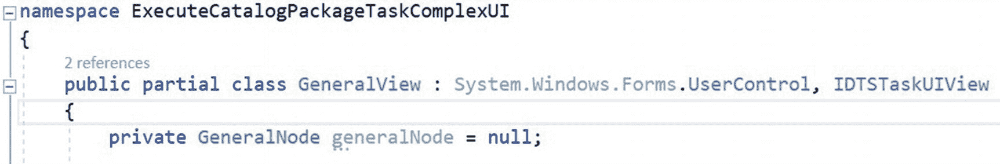

图 11-24
声明并初始化 `GeneralNode` 成员

使用清单 11-18 中的代码在 `GeneralView` 中声明另外三个成员：

```
private System.Windows.Forms.PropertyGrid generalPropertyGrid;
private ExecuteCatalogPackageTask.ExecuteCatalogPackageTask theTask = null;
private System.ComponentModel.Container components = null;
```

清单 11-18
声明 `PropertyGrid`、`ExecuteCatalogPackageTask` 和 `Container` 成员

`GeneralView` 应如图 11-25 所示：

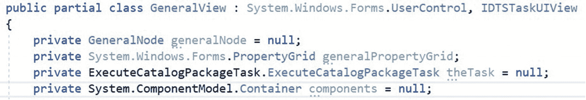

图 11-25
`PropertyGrid`、`ExecuteCatalogPackageTask` 和 `Container` 成员

下一步是使用清单 11-19 中的代码向 `GeneralView` 类添加构造函数和 `Dispose` 方法：

```
public GeneralView()
{
    InitializeComponent();
}
protected override void Dispose(bool disposing)
{
    if (disposing)
    {
        if (components != null)
        {
            components.Dispose();
        }
    }
    base.Dispose(disposing);
}
```

清单 11-19
`GeneralView` 构造函数和 `Dispose`

添加后，代码应如图 11-26 所示：

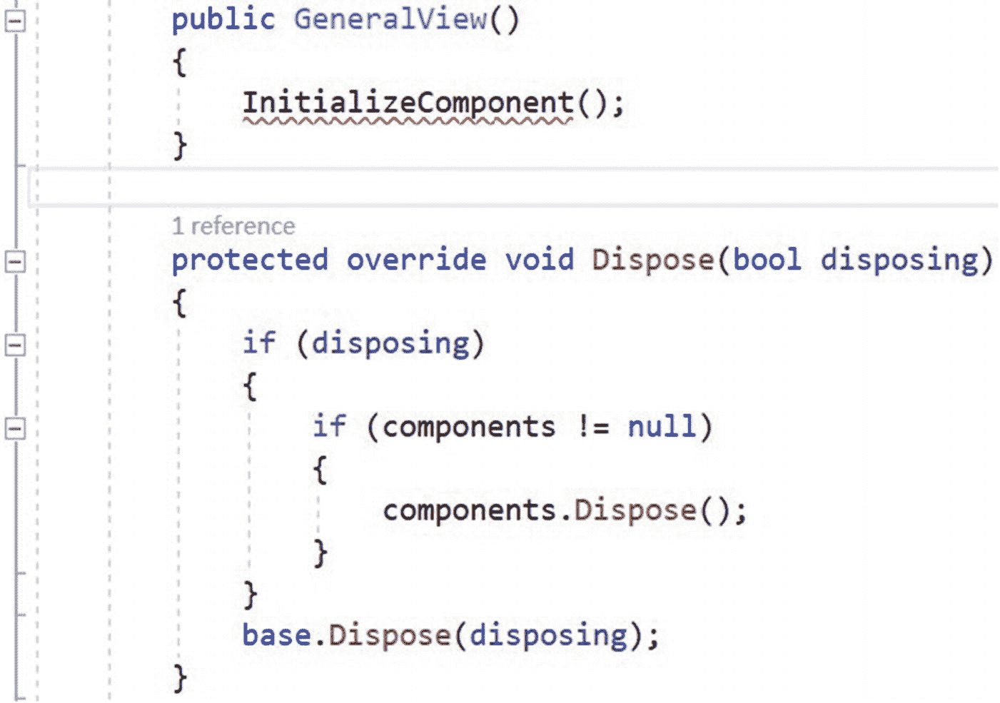

图 11-26
向 `GeneralView` 添加构造函数和 `Dispose` 方法

构造函数（与类名 `GeneralView` 相同）调用 `InitializeComponent`，该方法尚未实现。`Dispose` 方法覆盖了 `base.Dispose` 方法，在处置基对象之前清理任何残留的 `components` 对象。

`InitializeComponent` 方法包含有关在窗体上实现的控件和对象的信息。如果向 .Net Framework 解决方案添加一个新窗体，则会自动包含一个 `InitializeComponent` 方法。

下一步是使用清单 11-20 中的代码实现 `InitializeComponent` 方法：


### 清单 11-20：InitializeComponent 代码
```csharp
private void InitializeComponent()
{
    // generalPropertyGrid
    this.generalPropertyGrid = new System.Windows.Forms.PropertyGrid();
    this.SuspendLayout();
    this.generalPropertyGrid.Anchor = ((System.Windows.Forms.AnchorStyles)((((System.Windows.Forms.AnchorStyles.Top
        | System.Windows.Forms.AnchorStyles.Bottom)
        | System.Windows.Forms.AnchorStyles.Left)
        | System.Windows.Forms.AnchorStyles.Right)));
    this.generalPropertyGrid.Location = new System.Drawing.Point(3, 0);
    this.generalPropertyGrid.Name = "generalPropertyGrid";
    this.generalPropertyGrid.PropertySort = System.Windows.Forms.PropertySort.Categorized;
    this.generalPropertyGrid.Size = new System.Drawing.Size(387, 360);
    this.generalPropertyGrid.TabIndex = 0;
    this.generalPropertyGrid.ToolbarVisible = false;
    // GeneralView
    this.Controls.Add(this.generalPropertyGrid);
    this.Name = "GeneralView";
    this.Size = new System.Drawing.Size(390, 360);
    this.ResumeLayout(false);
}
```

添加后，`InitializeComponent` 方法如图 11-27 所示：

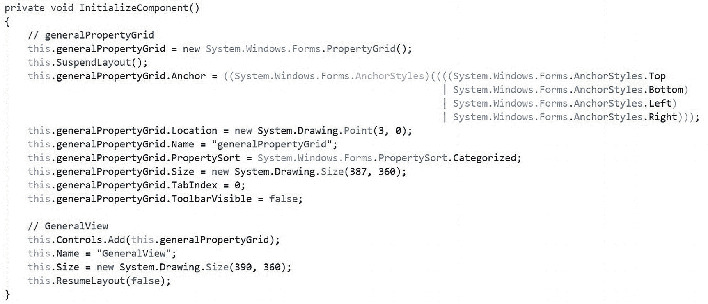

**图 11-27：将 InitializeComponent 方法添加到 GeneralView**

在 `InitializeComponent` 方法中，我们的代码初始化并配置了 `GeneralView` 的 `generalPropertyGrid` 成员，然后将 `generalPropertyGrid` 成员（这是一个 `PropertyGrid` 控件）添加到 `GeneralView` 类（窗体）中。

下一步是开始编写 `SettingsView` 的代码。

### 编写 `SettingsView` 的代码

在解决方案资源管理器中，右键单击 `ExecuteCatalogPackageTaskComplexUI` 项目，悬停在**添加**上，然后单击**“类…”。** 当**添加新项**对话框显示时，将 `"Class1.cs"` 更改为 `"SettingsView.cs"`，如图 11-28 所示：

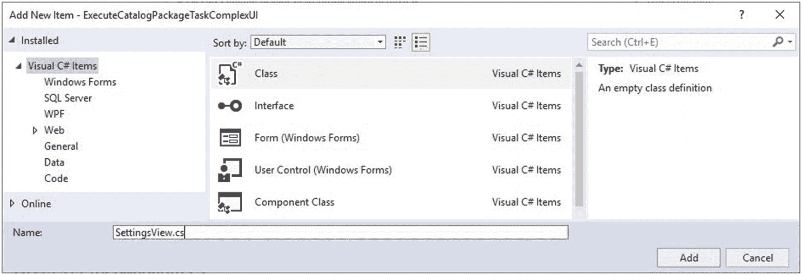

**图 11-28：添加 SettingsView 类**

单击**添加**按钮以添加新的 `SettingsView` 类。

使用清单 11-21 中的代码编辑类声明：

```csharp
public partial class SettingsView: System.Windows.Forms.UserControl, IDTSTaskUIView
```

**清单 11-21：SettingsView 类声明**

编辑后，代码应如图 11-29 所示：

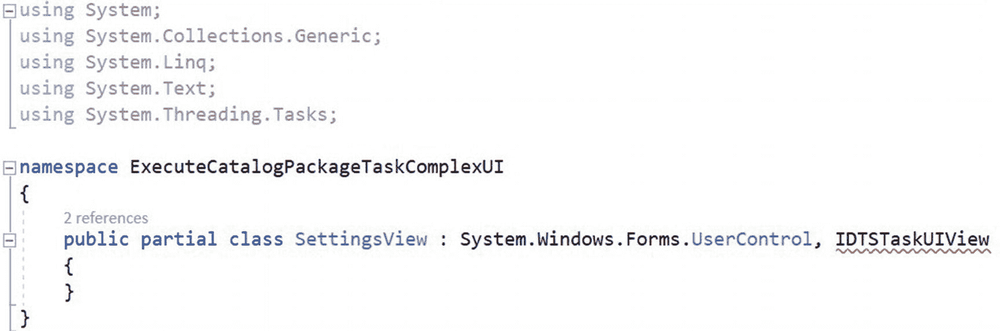

**图 11-29：已编辑的 GeneralView 类声明**

与 `GeneralView` 一样，`SettingsView` 被声明为继承两个接口：

- `System.Windows.Forms.UserControl`
- `IDTSTaskUIView`

添加一个用于 `Microsoft.DataTransformationServices.Controls` 程序集的 `using` 语句——在清单 11-22 中——以为 `SettingsView` 实现 `IDTSTaskUIView` 接口：

```csharp
using Microsoft.DataTransformationServices.Controls;
```

**清单 11-22：用于 IDTSTaskUIView 的 using 语句**

和之前一样，添加 `using` 语句消除了 `SettingsView` 类中的直接错误，但仍存在另一个错误。将鼠标悬停在带有红色波浪下划线的 `IDTSTaskUIView` 文本上，会显示潜在的修复“助手”图标，如图 11-30 所示：

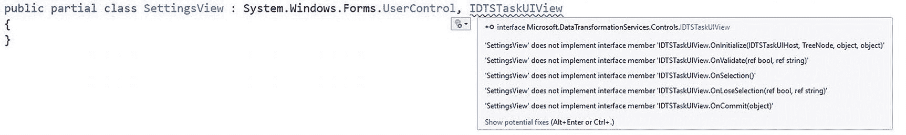

**图 11-30：IDTSTaskUIView 接口已被识别但尚未实现**

单击下拉菜单，然后单击**“实现接口”**，如图 11-31 所示：

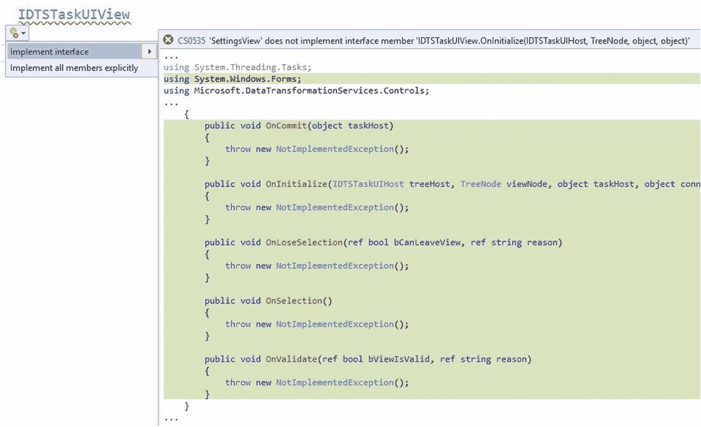

**图 11-31：显示潜在的修复**

实现接口会添加清单 11-23 中的代码，如图 11-32 所示：

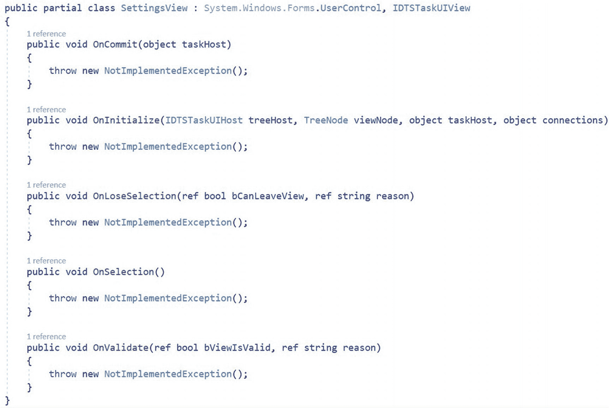

**图 11-32：为 SettingsView 实现的 IDTSTaskUIView 接口**

```csharp
using System.Windows.Forms;
.
.
.
namespace ExecuteCatalogPackageTaskComplexUI
{
    public partial class SettingsView : System.Windows.Forms.UserControl, IDTSTaskUIView
    {
        public void OnCommit(object taskHost)
        {
            throw new NotImplementedException();
        }
        public void OnInitialize(IDTSTaskUIHost treeHost, TreeNode viewNode, object taskHost, object connections)
        {
            throw new NotImplementedException();
        }
        public void OnLoseSelection(ref bool bCanLeaveView, ref string reason)
        {
            throw new NotImplementedException();
        }
        public void OnSelection()
        {
            throw new NotImplementedException();
        }
        public void OnValidate(ref bool bViewIsValid, ref string reason)
        {
            throw new NotImplementedException();
        }
    }
}
```

**清单 11-23：IDTSTaskUIView 实现代码**

下一步是构建一个 `SettingsView` `Node`，这是第一个内部成员（属性）、一个构造函数，以及覆盖默认接口实现代码。

与 `GeneralNode` 类一样，在设计 `SettingsNode` 类时有多种选择。你可以在单独的 ".cs" 文件中实现该类，也可以在 `SettingsView.cs` 文件中声明该类。出于本示例的目的，我们通过添加清单 11-24 中的代码将 `SettingsNode` 类添加到 `SettingsView.cs` 文件中：

```csharp
internal class SettingsNode { }
```

**清单 11-24：声明 GeneralNode 类**


添加后，代码应如图 11-33 所示：

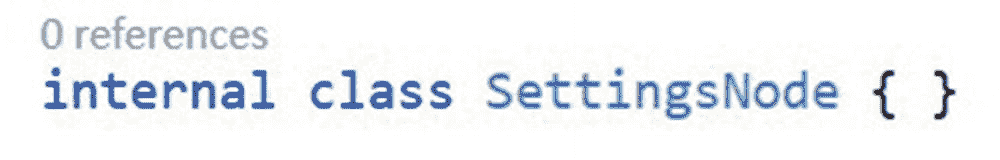

图 11-33

声明 `SettingsNode` 类

声明 `SettingsNode` 类后，使用清单 11-25 中的代码向 `SettingsView` 类添加并初始化一个私有成员：

```
private SettingsNode settingsNode = null;
清单 11-25
在 SettingsView 中声明私有 SettingsNode 成员
```

添加后，代码应如图 11-34 所示：

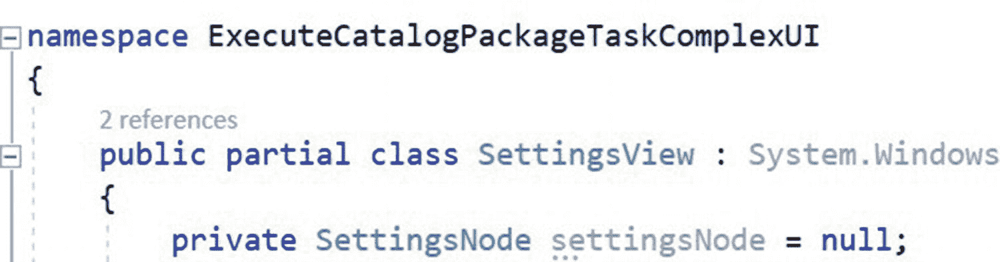

图 11-34

声明并初始化 `SettingsNode` 成员

使用清单 11-26 中的代码在 `SettingsView` 中声明另外三个成员：

```
private System.Windows.Forms.PropertyGrid settingsPropertyGrid;
private ExecuteCatalogPackageTask.ExecuteCatalogPackageTask theTask = null;
private System.ComponentModel.Container components = null;
清单 11-26
声明 PropertyGrid、ExecuteCatalogPackageTask 和 Container 成员
```

`GeneralView` 应如图 11-35 所示：

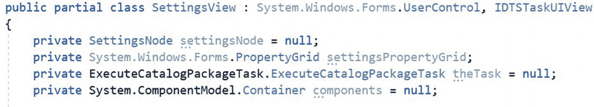

图 11-35

`PropertyGrid`、`ExecuteCatalogPackageTask` 和 `Container` 成员

下一步是使用清单 11-27 中的代码向 `SettingsView` 类添加一个构造函数和一个 `Dispose` 方法：

```
public SettingsView()
{
InitializeComponent();
}
protected override void Dispose(bool disposing)
{
if (disposing)
{
if (components != null)
{
components.Dispose();
}
}
base.Dispose(disposing);
}
清单 11-27
SettingsView 构造函数和 Dispose
```

添加后，代码应如图 11-36 所示：

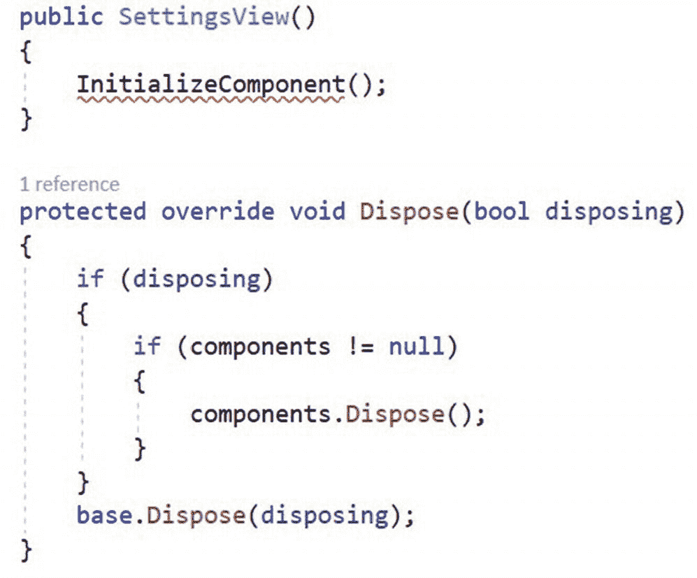

图 11-36

向 `SettingsView` 添加构造函数和 `Dispose` 方法

与之前的 `GeneralView` 一样，与类同名的构造函数 (`SettingsView`) 会调用 `InitializeComponent`，而该方法尚未在 `SettingsView` 中实现。`Dispose` 方法重写了 `base.Dispose` 方法，在处置基对象之前清理任何残留的 `components` 对象。

下一步是使用清单 11-28 中的代码实现 `InitializeComponent` 方法：

```
private void InitializeComponent()
{
this.settingsPropertyGrid = new System.Windows.Forms.PropertyGrid();
this.SuspendLayout();
// settingsPropertyGrid
this.settingsPropertyGrid.Anchor = ((System.Windows.Forms.AnchorStyles)((((System.Windows.Forms.AnchorStyles.Top
| System.Windows.Forms.AnchorStyles.Bottom)
| System.Windows.Forms.AnchorStyles.Left)
| System.Windows.Forms.AnchorStyles.Right)));
this.settingsPropertyGrid.Location = new System.Drawing.Point(3, 0);
this.settingsPropertyGrid.Name = "settingsPropertyGrid";
this.settingsPropertyGrid.PropertySort = System.Windows.Forms.PropertySort.Categorized;
this.settingsPropertyGrid.Size = new System.Drawing.Size(387, 400);
this.settingsPropertyGrid.TabIndex = 0;
this.settingsPropertyGrid.ToolbarVisible = false;
// SettingsView
this.Controls.Add(this.settingsPropertyGrid);
this.Name = "SettingsView";
this.Size = new System.Drawing.Size(390, 400);
this.ResumeLayout(false);
}
清单 11-28
InitializeComponent 代码
```

添加后，`InitializeComponent` 方法如图 11-37 所示：

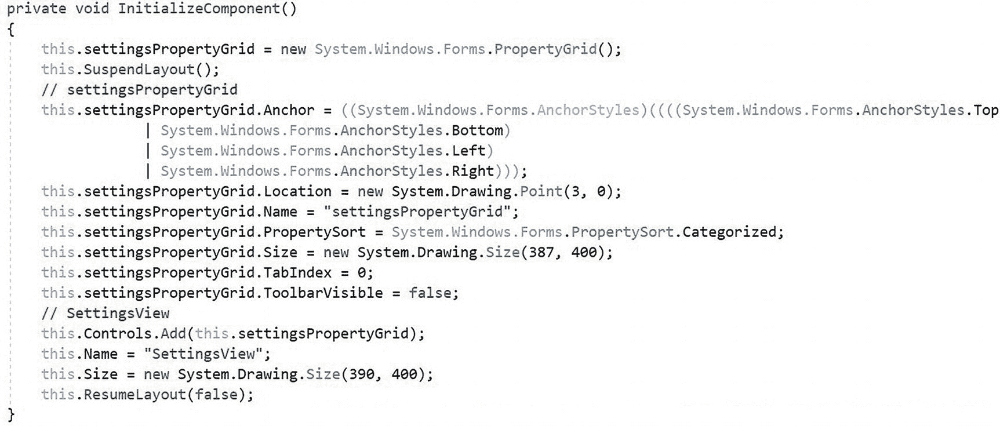

图 11-37

向 `SettingsView` 添加 `InitializeComponent` 方法

在 `InitializeComponent` 方法中，我们的代码初始化并配置 `SettingsView` 的 `settingsPropertyGrid` 成员，然后将该成员（这是一个 `PropertyGrid` 控件）添加到 `SettingsView` 类（窗体）中。

## 注释掉异常

通过注释掉视图（`GeneralView` 和 `SettingsView`）中的 `throw` 语句，为最小化编码的编辑器准备构建操作，如图 11-38 所示：

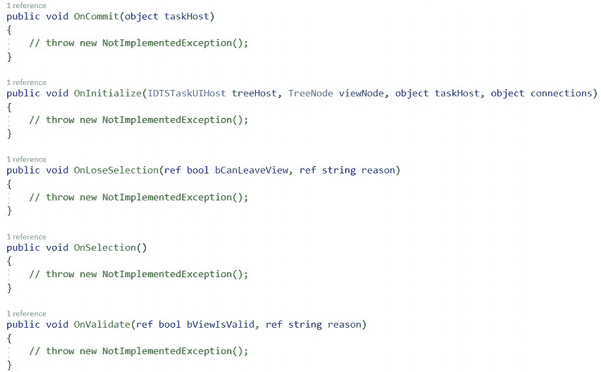

图 11-38

视图方法中被注释掉的 `throw` 语句

### 结论

在本章中，我们开始对 `ExecuteCatalogPackageTaskComplexUI` 进行最小化编码，通过创建编辑器窗体并将（最小化编码的）`General` 和 `Settings` 视图添加到 `ExecuteCatalogPackageTask` 的 View ➤ Node ➤ Property Category ➤ Property 层次结构中。

现在是签入代码的好时机。

下一步是准备程序集以进行构建。

