# 12. 编辑器集成

在第 11 章中，我们对 `ExecuteCatalogPackageTaskComplexUI` 进行了最小化编码。本章重点介绍将新的复杂编辑器 (`ExecuteCatalogPackageTaskComplexUI`) 与 `ExecuteCatalogPackageTask` 耦合所需的操作，类似于我们在第 5 章和第 6 章中与之前编辑器实现的耦合。耦合后，我们将在测试 SSIS 包中测试最小化编码的 `ExecuteCatalogPackageTask`。

## 签署程序集

第 5 章详细介绍了签署程序集的过程。为了在全局程序集缓存 (GAC) 中使用程序集，必须签署该程序集。本节描述的过程与第 5 章中描述的过程几乎相同。

首先向 `ExecuteCatalogPackageTaskComplexUI` 项目添加一个名为 `Notes.txt` 的新文本文件。在解决方案资源管理器中右键单击 `ExecuteCatalogPackageTaskComplexUI` 项目，将鼠标悬停在“添加”上，然后单击“新建项...”。当“添加新项”对话框显示时，单击“常规”类别，然后单击“文本文件”。将“TextFile1.txt”重命名为“Notes.txt”，如图 12-1 所示：

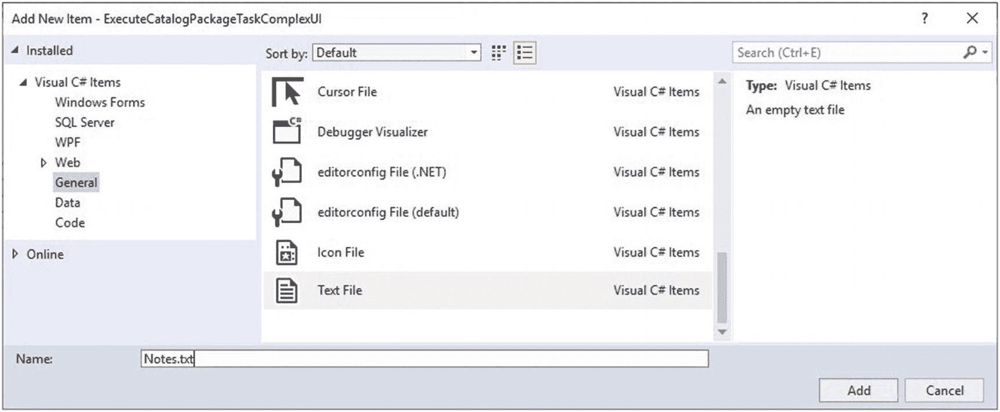

图 12-1

添加 `Notes.txt` 文件

单击“添加”按钮将 `Notes.txt` 文件添加到 `ExecuteCatalogPackageTaskComplexUI` 项目中。在我的解决方案中，我在解决方案资源管理器中展开了 `ExecuteCatalogPackageTask` 项目，打开了其中包含的 `Notes.txt` 文件，选中所有内容，复制内容，然后将剪贴板内容粘贴到 `ExecuteCatalogPackageTaskComplexUI` 项目的新 `Notes.txt` 文件中。然后我编辑了粘贴的内容，将“ExecuteCatalogPackageTask”替换为“ExecuteCatalogPackageTaskComplexUI”，如图 12-2 所示：

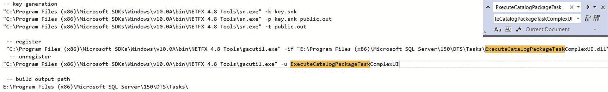

图 12-2

从 `ExecuteCatalogPackageTask` 项目复制、粘贴、编辑 `Notes.txt`


### 创建密钥

您需要在服务器上找到 `sn.exe` 来完成接下来的三个步骤。

打开命令提示符窗口，输入清单 12-1 中的代码（该代码应出现在您的 `Notes.txt` 文件顶部附近）：

```
"C:\Program Files (x86)\Microsoft SDKs\Windows\v10.0A\bin\NETFX 4.8 Tools\sn.exe" -k key.snk
清单 12-1
创建 key.snk 文件
```

执行后，结果应与图 12-3 所示类似：

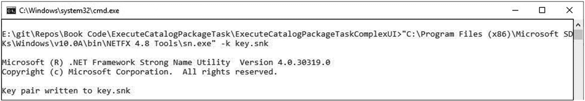

图 12-3
创建 key.snk 文件

要将公钥写入名为 `public.out` 的文件，请从 `Notes.txt` 文件中粘贴下一行代码，即清单 12-2：

```
"C:\Program Files (x86)\Microsoft SDKs\Windows\v10.0A\bin\NETFX 4.8 Tools\sn.exe" -p key.snk public.out
清单 12-2
将公钥写入 public.out
```

输出应如图 12-4 所示：

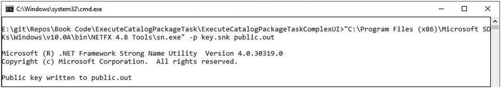

图 12-4
将公钥写入 public.out

通过执行清单 12-3 中的代码，从 `public.out` 文件中提取公钥令牌：

```
"C:\Program Files (x86)\Microsoft SDKs\Windows\v10.0A\bin\NETFX 4.8 Tools\sn.exe" -t public.out
清单 12-3
提取公钥令牌
```

输出应与图 12-5 类似：

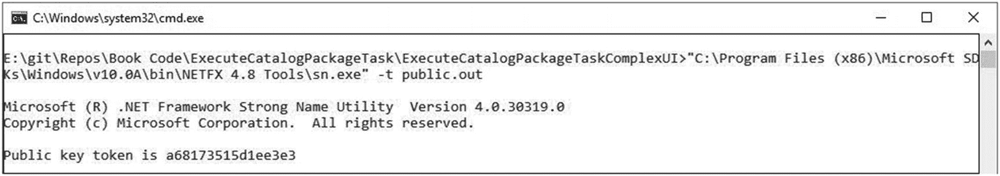

图 12-5
已提取的公钥令牌

选择公钥令牌并将所选内容复制到剪贴板。将剪贴板结果——连同一些有助于识别公钥令牌的文本——粘贴到 `ExecuteCatalogPackageTaskComplexUI` 类中，如图 12-6 所示：

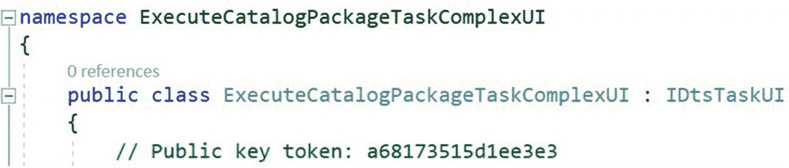

图 12-6
将公钥令牌存储在代码注释中

下一步是签名 `ExecuteCatalogPackageTaskComplexUI` 程序集。

### 签名 `ExecuteCatalogPackageTaskComplexUI` 程序集

在解决方案资源管理器中，双击 `ExecuteCatalogPackageTaskComplexUI` 属性文件夹。单击“签名”选项卡，勾选“为程序集签名”复选框，然后浏览找到 `key.snk` 文件，如图 12-7 所示：

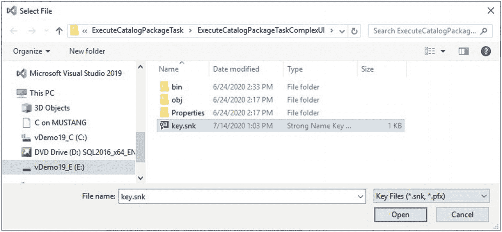

图 12-7
浏览 key.snk 文件

单击“打开”按钮，使用 `key.snk` 文件签名 `ExecuteCatalogPackageTaskComplexUI` 程序集。

下一步是配置生成输出路径位置。

### 配置生成输出路径

返回 `Notes.txt` 文件，将 `build output path` 位置复制到剪贴板。单击 `ExecuteCatalogPackageTaskComplexUI` 属性页面上的“生成”选项卡，然后将剪贴板内容粘贴到“输出路径”文本框中，如图 12-8 所示：

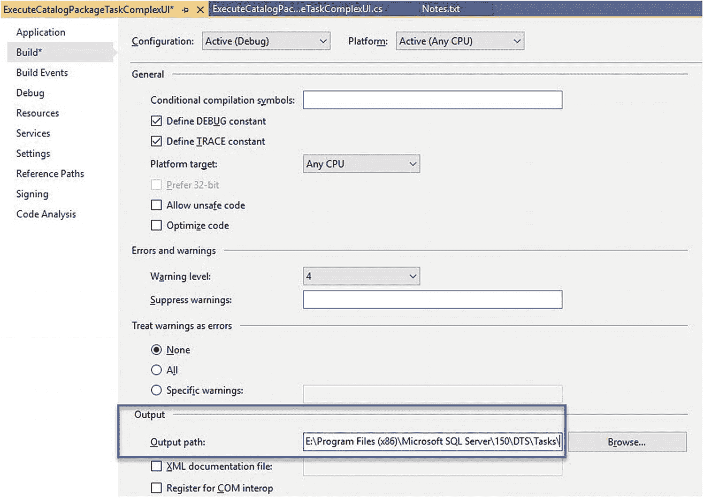

图 12-8
配置“生成输出路径”属性

下一步是为 `ExecuteCatalogPackageTaskComplexUI` 程序集配置生成事件。

### 配置生成事件

您需要在服务器上找到 `gacutil.exe` 来完成接下来的两个步骤。

返回 `Notes.txt` 文件，将 `unregister` 命令复制到剪贴板。单击 `ExecuteCatalogPackageTaskComplexUI` 属性页面上的“生成事件”选项卡，然后单击“编辑预生成事件…”按钮以打开“预生成事件命令行”对话框。将剪贴板内容粘贴到“预生成事件命令行”文本框中，如图 12-9 所示：

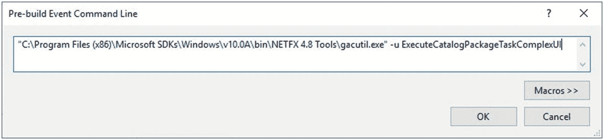

图 12-9
预生成事件命令行

单击“确定”按钮关闭“预生成事件命令行”对话框。返回 `Notes.txt` 文件，将 `register` 命令复制到剪贴板。单击 `ExecuteCatalogPackageTaskComplexUI` 属性页面上的“生成事件”选项卡，然后单击“编辑后期生成事件…”按钮以打开“后期生成事件命令行”对话框。将剪贴板内容粘贴到“后期生成事件命令行”文本框中，如图 12-10 所示：

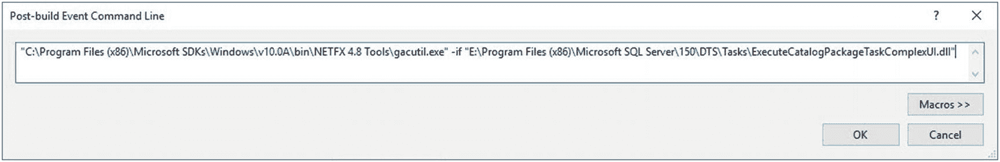

图 12-10
后期生成事件命令行

下一步是编辑 `ExecuteCatalogPackageTask` 以使用新签名的程序集。

### 编辑 `ExecuteCatalogPackageTask`

将 `ExecuteCatalogPackageTaskComplexUI` 程序集的公钥令牌复制到剪贴板。在解决方案资源管理器中，展开 `ExecuteCatalogPackageTask` 并打开 `ExecuteCatalogPackageTask.cs` 程序集文件。编辑 `ExecuteCatalogPackageTask` 构造函数的 `DtsTask` 装饰，用我在清单 12-4 中显示的公钥令牌替换您的公钥令牌：

```
[DtsTask(
TaskType = "DTS150"
, DisplayName = "Execute Catalog Package Task"
, IconResource = "ExecuteCatalogPackageTask.ALCStrike.ico"
, Description = "A task to execute packages stored in the SSIS Catalog."
, UITypeName = "ExecuteCatalogPackageTaskComplexUI.ExecuteCatalogPackageTaskComplexUI, ExecuteCatalogPackageTaskComplexUI, Version=1.0.0.0, Culture=Neutral, PublicKeyToken=a68173515d1ee3e3"
, TaskContact = "ExecuteCatalogPackageTask; Building Custom Tasks for SQL Server Integration Services, 2019 Edition; © 2020 Andy Leonard; https://dilmsuite.com/ExecuteCatalogPackageTaskBookCode")]
清单 12-4
编辑 ExecuteCatalogPackageTask 构造函数的 DtsTask 装饰
```

编辑后，`ExecuteCatalogPackageTask` 构造函数的 `DtsTask` 装饰应与图 12-11 类似：

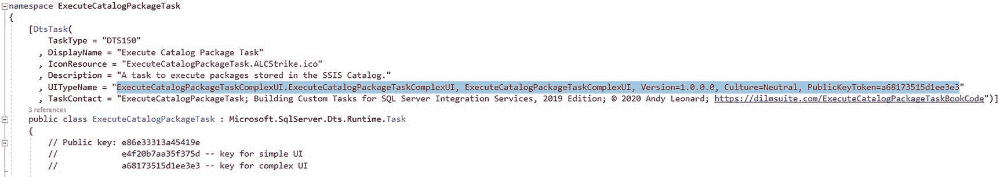

图 12-11
编辑 ExecuteCatalogPackageTask 构造函数的 DtsTask 装饰

下一步是生成并测试自定义任务解决方案。

### 生成解决方案

单击 Visual Studio 中的“生成”菜单，然后单击“生成解决方案”，如图 12-12 所示：

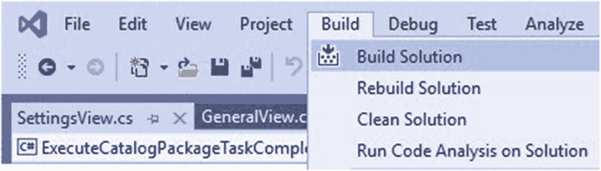

图 12-12
生成 ExecuteCatalogPackageTask 解决方案

如果一切按计划进行，Visual Studio 的“输出”窗口应显示类似图 12-13 的内容：

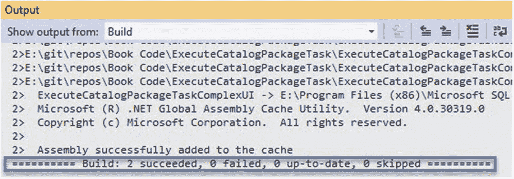

图 12-13
生成成功

对 .Net 解决方案的第一个测试是：它能生成吗？这个解决方案可以生成。

## 测试自定义 SSIS 任务

通过创建（或打开）一个测试 SSIS 项目来测试解决方案。测试内容如下：

1.  自定义 SSIS 任务是否出现在 SSIS 工具箱中？
2.  SSIS 开发人员是否能在不报错的情况下将自定义任务添加到包中？

当 SSIS 包在 Visual Studio IDE（集成开发环境）中打开时，可以打开 SSIS 工具箱来检查条件 1，如图 12-14 所示：

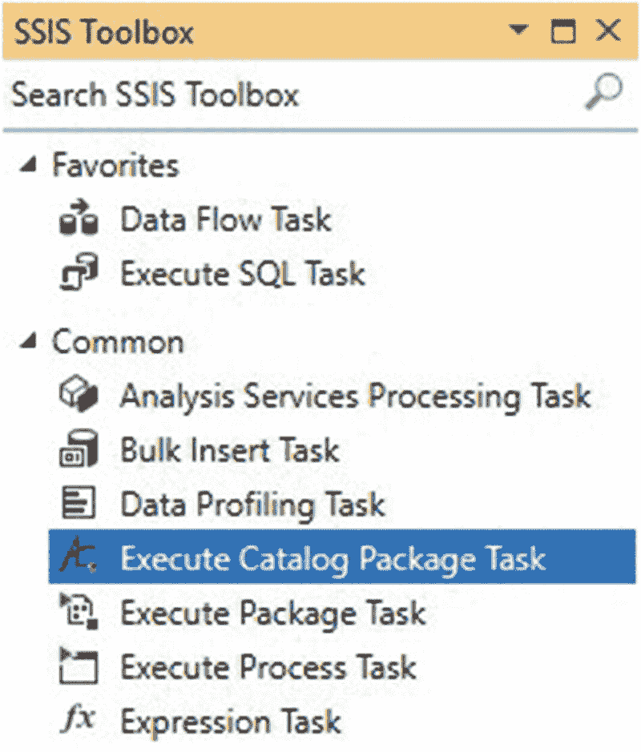
**图 12-14** 在 SSIS 工具箱中显示的 执行目录包任务

将 执行目录包任务 拖放到 SSIS 包的控制流上，以查看是否可以无错误地将 执行目录包任务 添加到 SSIS 包中，如图 12-15 所示：

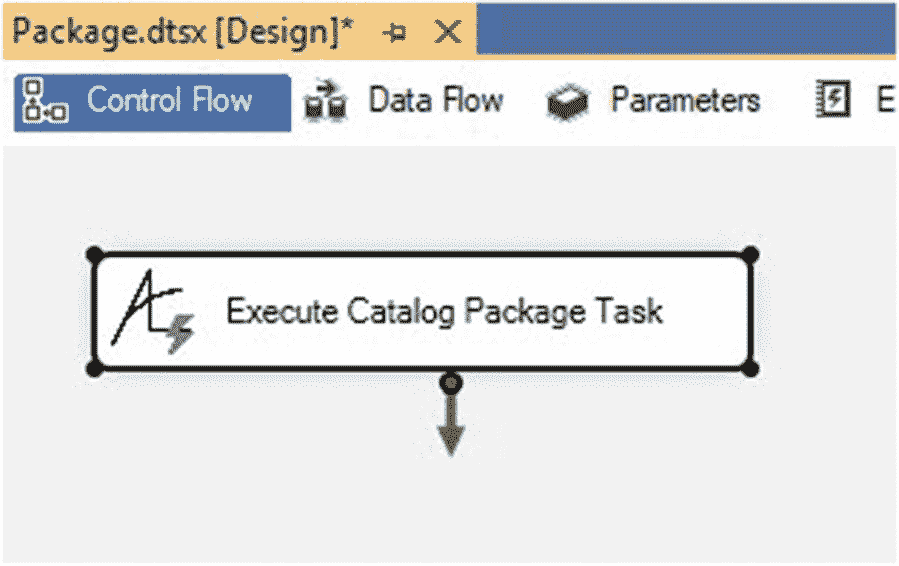
**图 12-15** 可以无错误地将 执行目录包任务 添加到 SSIS 包

最后，双击 执行目录包任务 以查看是否可以无错误地打开其编辑器，如图 12-16 所示：

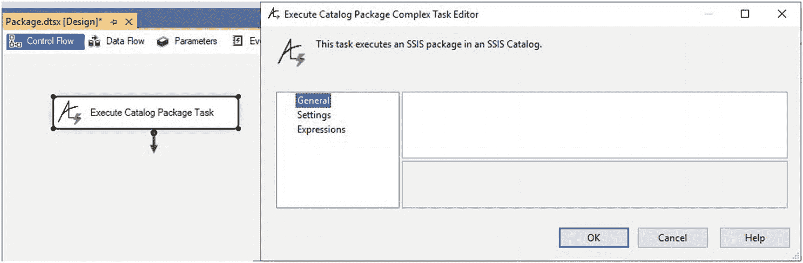
**图 12-16** 可以无错误地打开 执行目录包任务 编辑器

测试通过！现在我们有了一个代码量最少的 执行目录包任务 和一个闪亮的新编辑器。

如 12-16 和 12-17 图所示，`GeneralView` 和 `SettingsView` 是空的：

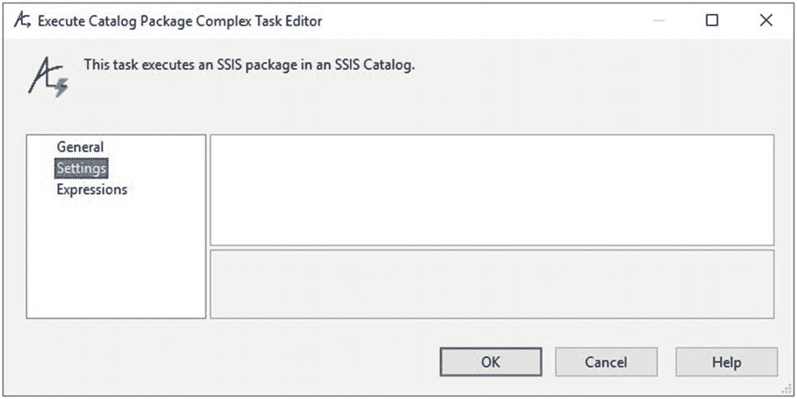
**图 12-17** SettingsView 为空

单击 `Expressions` 页，单击 `Expressions` 属性值文本框内部，然后单击省略号以打开 `Property Expressions Editor`，如图 12-18 所示：

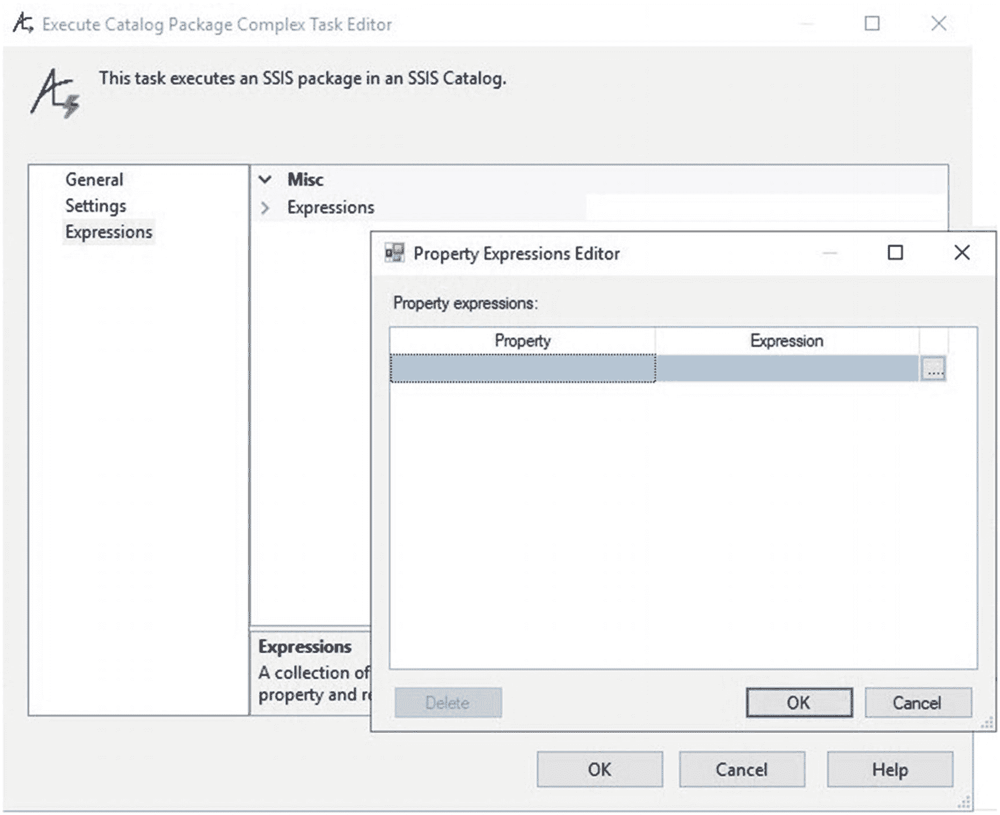
**图 12-18** Expressions

回顾本书此部分的目标：

*   为任务用户提供更“SSIS 化”的体验，包括一个带有“常规”和“设置”页“视图”的“漂亮”编辑器。
*   启用 SSIS 表达式的使用。
*   添加任务设置的设计时验证。
*   在编辑器中显示更多 SSIS 目录执行属性。

在本节中，我们开始看到第二个要点（启用 SSIS 表达式的使用）得以实现——如图 12-18 所示。

我们没有添加任何代码来创建 `ExpressionsView`，那么这个编辑器页面是从哪里来的呢？`ExpressionsView` 是从 `Microsoft.DataTransformationServices.Controls` 程序集继承而来的。此时您可能不相信，但使用 SSIS 表达式操作自定义任务属性的能力，值得为添加一个“SSIS 化”编辑器所付出的所有努力。

### 结论

在本章中，我们重点介绍了将新的复杂编辑器（`ExecuteCatalogPackageTaskComplexUI`）与 `ExecuteCatalogPackageTask` 耦合所需的操作。一旦耦合，我们就能够在测试 SSIS 包中测试这个代码量最少的 `ExecuteCatalogPackageTask`。

现在正是签入代码的绝佳时机。

在下一章中，我们将添加属性。

