# 13. 实现视图和属性

在第 12 章中，我们构建并测试了一个代码量最少的 `ExecuteCatalogPackageTask`，它拥有一个名为 `ExecuteCatalogPackageTaskComplexUI` 的新“SSIS 化”编辑器。在本章中，我们将为 `GeneralView` 和 `SettingsView` 实现 `IDTSTaskUIView` 编辑器接口，添加编辑器属性，并进行更多测试。

## 实现 GeneralView 的 IDTSTaskUIView 接口

在第 11 章中，我们使用了 Visual Studio 2019 中的一些巧妙功能，通过单击为 `GeneralView` 实现了所需的 `IDTSTaskUIView` 接口方法，如图 13-1 所示：

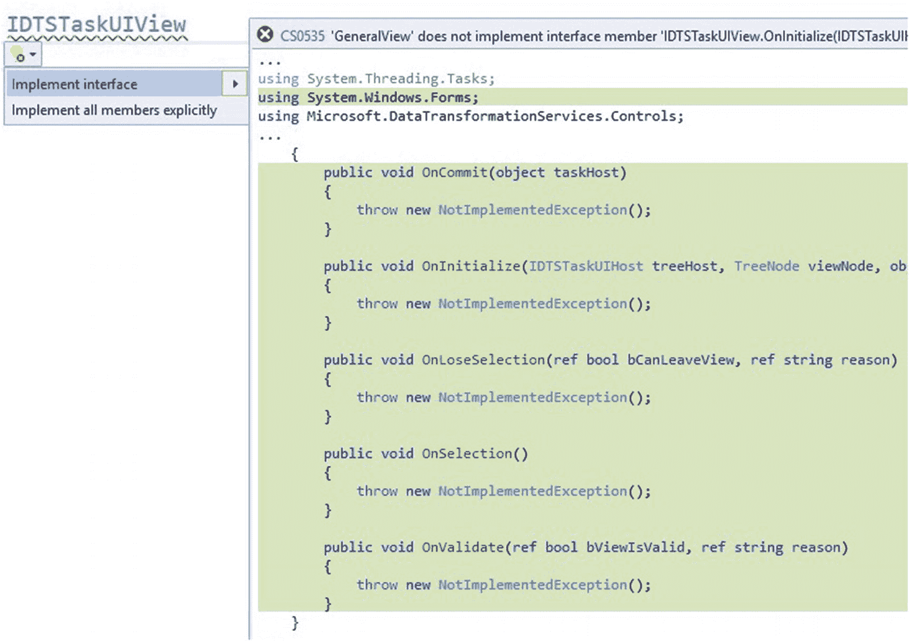
**图 13-1** 为 GeneralView 实现所需的 IDTSTaskUIView 接口方法

在本章接近尾声时，我们注释掉了 `throw` 语句，以便 `ExecuteCatalogPackageTaskComplexUI` 项目能够构建并通过一些基本测试。代码现在如清单 13-1 所示：

```
public void OnInitialize(IDTSTaskUIHost treeHost, TreeNode viewNode, object taskHost, object connections)
{
    // throw new NotImplementedException();
}
public void OnValidate(ref bool bViewIsValid, ref string reason)
{
    // throw new NotImplementedException();
}
public void OnCommit(object taskHost)
{
    // throw new NotImplementedException();
}
public void OnSelection()
{
    // throw new NotImplementedException();
}
public void OnLoseSelection(ref bool bCanLeaveView, ref string reason)
{
    // throw new NotImplementedException();
}
```
**清单 13-1** GeneralView 的 IDTSTaskUIView 接口方法（已注释掉）

上面的代码也已重新排列，以更接近我喜欢的顺序（参见前面关于“CDO”的说明）。

下一步是实现 `GeneralView` 的 `OnInitialize` 方法。

## 实现 GeneralView 的 OnInitialize 方法

通过使用清单 13-2 中的代码替换当前的 `OnInitialize` 方法代码，来实现 `GeneralView OnInitialize` 方法：

```
public virtual void OnInitialize(IDTSTaskUIHost treeHost
, System.Windows.Forms.TreeNode viewNode
, object taskHost
, object connections)
{
if (taskHost == null)
{
throw new ArgumentNullException("Attempting to initialize the ExecuteCatalogPackageTask UI with a null TaskHost");
}
if (!(((TaskHost)taskHost).InnerObject is ExecuteCatalogPackageTask.ExecuteCatalogPackageTask))
{
throw new ArgumentException("Attempting to initialize the ExecuteCatalogPackageTask UI with a task that is not an ExecuteCatalogPackageTask.");
}
theTask = ((TaskHost)taskHost).InnerObject as ExecuteCatalogPackageTask.ExecuteCatalogPackageTask;
this.generalNode = new GeneralNode(taskHost as TaskHost);
generalPropertyGrid.SelectedObject = this.generalNode;
generalNode.Name = ((TaskHost)taskHost).Name;
}
清单 13-2
实现 GeneralView 的 OnInitialize 方法
```

`GeneralView OnInitialize` 方法如图 13-2 所示：

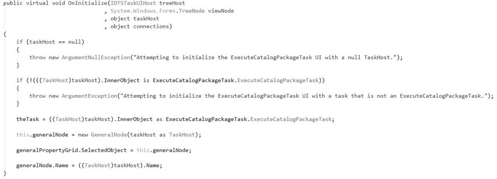

图 13-2

GeneralView 的 OnInitialize 方法

请注意 `TaskHost` 和 `GeneralNode` 被标记了红色波浪线，表示各自存在问题。将鼠标悬停在 `TaskHost` 上，点击下拉菜单，然后点击 “using Microsoft.SqlServer.Dts.Runtime;”，如图 13-3 所示：

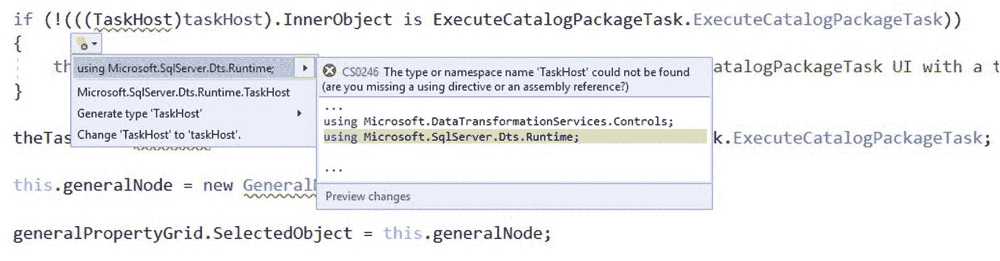

图 13-3

添加 “using Microsoft.SqlServer.Dts.Runtime;”

这个 Visual Studio 自动化功能为 `Microsoft.SqlServer.Dts.Runtime` 程序集引用添加了一个 `using` 指令，清除了 `GeneralView OnInitialize` 方法中的多条红色波浪线，如图 13-4 所示：

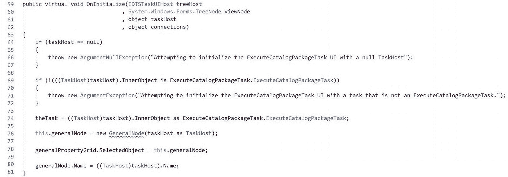

图 13-4

using 指令解决了大部分设计时问题

图 13-4 中包含了 Visual Studio 的行号，以辅助讨论代码功能。第 59-63 行是 `GeneralView OnInitialize` 方法的声明和参数。

第 64-67 行检查 `taskHost` 成员是否为 null，如果 `taskHost` 为 null，则抛出 `ArgumentNullException`，其中包含消息：“Attempting to initialize the ExecuteCatalogPackageTask UI with a null TaskHost.”

第 69-72 行测试 `GeneralView` 的 `taskHost` 成员的 `InnerObject` 是*否可以*转换为 `ExecuteCatalogPackageTask` 类型的实例。如果 `GeneralView` 的 `taskHost` 成员的 `InnerObject` 无法转换为 `ExecuteCatalogPackageTask`，则代码抛出 `ArgumentException`，其中包含消息：“Attempting to initialize the ExecuteCatalogPackageTask UI with a task that is not an ExecuteCatalogPackageTask.”

如果前述“类型测试”成功，则在第 74 行将 `GeneralView` 的 `theTask` 成员的 `InnerObject` 赋值给 `ExecuteCatalogPackageTask` 对象。

在第 76 行，初始化 `GeneralView` 的 `generalNode` 成员（此处的代码目前有问题，但我们很快会修复它）。

在第 78 行，将 `GeneralView` 的 `generalPropertyGrid` 成员初始化为 `generalNode`。

最后，在第 80 行，将 `generalNode.Name` 初始化为 `taskHost.Name` 属性的值。`taskHost` 可以被认为是“SSIS 包控制流上的任务”。这行代码有助于在关闭 Execute Catalog Package Task 编辑器时，保持 ExecuteCatalogPackageTask 的名称与 SSIS 包控制流上显示的 `taskHost.Name` 属性值同步。

`GeneralView OnInitialize` 方法中有很多活动部件。`OnInitialize` 方法中发生的很多事情，是我们最初在第 10 章讨论的 SSIS 任务编辑器 视图 ➤ 节点 ➤ 属性类别 ➤ 属性 层次结构的*编织整合*。

SSIS 任务编辑器以层次结构呈现属性：视图 ➤ 节点 ➤ 属性类别 ➤ 属性。*视图* 是 SSIS 任务编辑器上的“页面”。以下内容出现在第 10 章。我们在此处再次呈现，作为复习。

图 13-5 可视化了执行 SQL 任务编辑器的层次结构。如前所述，常规视图（左侧绿框中）显示常规节点 – 由 propertygrid 控件（右侧蓝框中）表示。名为 “General” 的属性类别显示在红框中。Name 属性显示在黄框中，如图 13-5 所示：

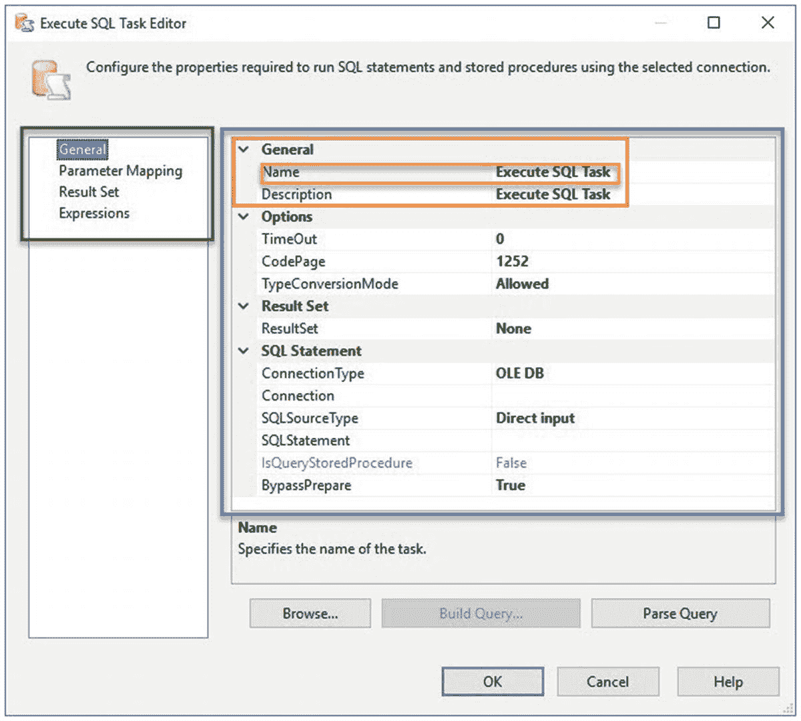

图 13-5

可视化 视图 ➤ 节点 ➤ 属性类别 ➤ 属性 层次结构

应用于 视图 ➤ 节点 ➤ 属性类别 ➤ 属性 层次结构，图 13-5 中显示的执行 SQL 任务编辑器的实体名称如下：常规（视图） ➤ 常规（节点） ➤ 常规（属性类别） ➤ 名称（属性）。这里有很多“常规”，其中一个 – 常规节点 – 隐藏在 propertygrid 控件之下。

新的 `GeneralView OnInitialize` 方法使用 `GeneralView` 的 `taskHost` 成员，将 `ExecuteCatalogPackageTaskComplexUI` 与 `ExecuteCatalogPackageTask` 耦合起来。一旦成功 – 如果无法耦合，代码将抛出异常 – `GeneralView` 的 `generalNode` 成员就被初始化（为一个新的 `GeneralNode` 对象），并且 `GeneralView` 的 `generalPropertyGrid` 相应地被初始化为这个（新的）`generalNode`。

再次强调，`GeneralView OnInitialize` 方法中有很多活动部件。

## 实现 GeneralView 的 OnCommit 方法

通过使用清单 13-3 中的代码替换当前的 `OnCommit` 方法代码，来实现 `GeneralView OnCommit` 方法：

```
public virtual void OnCommit(object taskHost)
{
TaskHost th = (TaskHost)taskHost;
th.Name = generalNode.Name.Trim();
th.Description = generalNode.Description.Trim();
theTask.TaskName = generalNode.Name.Trim();
theTask.TaskDescription = generalNode.Description.Trim();
}
清单 13-3
实现 GeneralView 的 OnCommit 方法
```

`GeneralView OnCommit` 方法如图 13-6 所示：

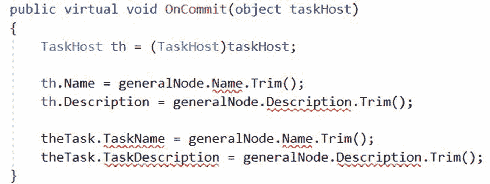

图 13-6

GeneralView 的 OnCommit 方法

当将 `Name` 和 `Description` 成员添加到 `GeneralNode` 类后，图 13-6 中的红色波浪线 – 以及它们所指示的错误 – 将会解决。使用清单 13-4 中的代码将 `TaskName` 和 `TaskDescription` 属性添加到 ExecuteCatalogPackageTask，以解决 `TaskName` 和 `TaskDescription` 属性下方的红色波浪线：

```
public string TaskName { get; set; } = "Execute Catalog Package Task";
public string TaskDescription { get; set; } = "Execute Catalog Package Task";
清单 13-4
向 ExecuteCatalogPackageTask 添加 TaskName 和 TaskDescription 属性
```

添加后，代码如图 13-7 所示：

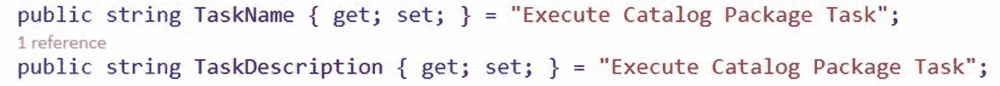

图 13-7

添加 TaskName 和 TaskDescription 属性


## 编写 GeneralNode 代码

`GeneralNode`包含在 Execute Catalog Package Task（复杂）编辑器的 General 页面上公开的 `ExecuteCatalogPackageTask` 属性。首先使用代码清单 13-5 添加成员：

```
internal TaskHost taskHost = null;
private ExecuteCatalogPackageTask.ExecuteCatalogPackageTask task = null;
Listing 13-5
为 GeneralNode 添加 taskHost 和 task 成员
```

`GeneralNode`类如图 13-8 所示：

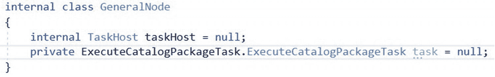

图 13-8

GeneralNode 类成员

使用代码清单 13-6 的代码为 `GeneralNode`类添加构造函数：

```
public GeneralNode(TaskHost taskHost)
{
this.taskHost = taskHost;
this.task = taskHost.InnerObject as ExecuteCatalogPackageTask.ExecuteCatalogPackageTask;
}
Listing 13-6
添加 GeneralNode 类构造函数
```

添加构造函数后，`GeneralNode`类如图 13-9 所示：

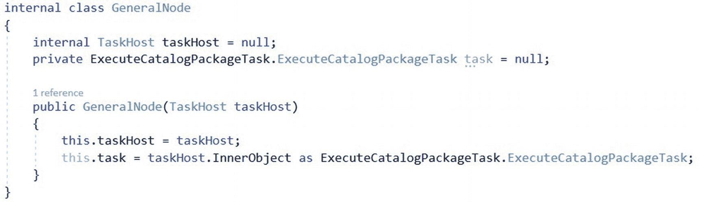

图 13-9

GeneralNode 类构造函数

实现 `GeneralNode`构造函数后，第 76 行的设计时错误被清除，如图 13-10 所示：


图 13-10

错误消失

下一步是编写 GeneralNode 属性代码。

### 编写 GeneralNode 属性代码

在本节中，我们接触到 View ➤ Node ➤ Property Category ➤ Property 层次结构中的 Property Category ➤ Property 部分。节点的属性被修饰以指示属性类别和描述。在编辑器中，属性的值与属性名配对，该值被传递给任务的实例化。可以将此配对视为类似于键值映射，其中键由 View ➤ Node ➤ Property Category ➤ Property 层次结构组成，值是 SSIS 开发人员在任务（实例）编辑期间提供的值。图 13-11 中圈出了一个值的示例：

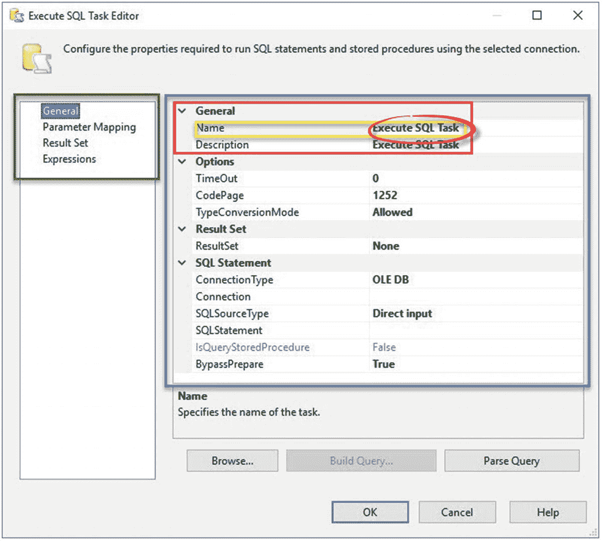

图 13-11

键值对的值

在 SSIS 包中，该值由 SSIS 开发人员在编辑时配置。当 SSIS 开发人员单击编辑器上的“确定”按钮时，`OnCommit`方法触发，并将键值属性配置存储在 SSIS 包的 XML 中，如图 13-12 所示：

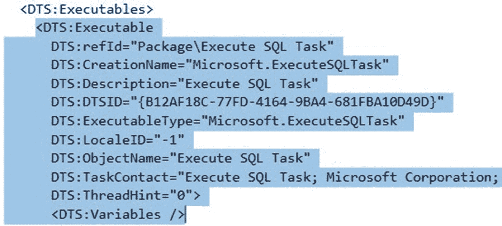

图 13-12

SSIS Execute SQL 任务的 XML

在我们的示例 Execute SQL 任务中，`Name`属性值为“Execute SQL Task”。该属性值存储在名为 `DTS:ObjectName` 的属性中。在运行时，SSIS XML 被加载、解释和执行，但一切都始于 SSIS 开发人员打开任务编辑器，然后配置键值对的值部分，其中键在构成 View ➤ Node ➤ Property Category ➤ Property 层次结构的编辑器视图中直观地显示。

要为我们的自定义 SSIS 任务添加 Name 属性，请将代码清单 13-7 中的代码添加到 GeneralNode：

```
[
Category("General"),
Description("Specifies the name of the task.")
]
public string Name {
get { return taskHost.Name; }
set {
if ((value == null) || (value.Trim().Length == 0))
{
throw new ApplicationException("Task name cannot be empty");
}
taskHost.Name = value;
}
}
Listing 13-7
将 Name 属性添加到 GeneralNode
```

添加后，代码如图 13-13 所示：

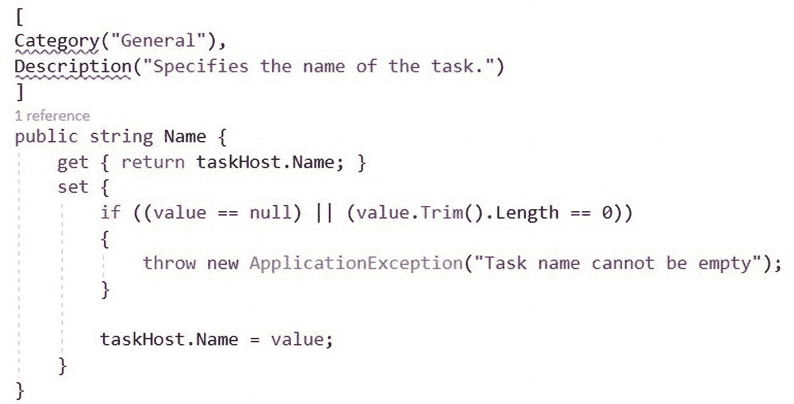

图 13-13

添加 Name 属性

装饰下方的红色波浪线表示存在问题。将鼠标悬停在代码上会显示解决问题的选项，如图 13-14 所示：

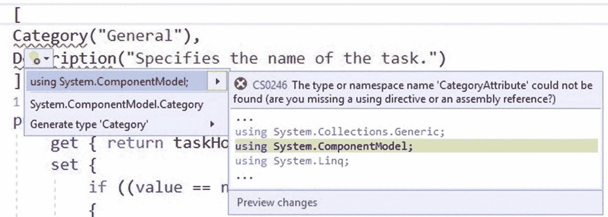

图 13-14

解决装饰问题

添加 `using` 指令可解决该问题（你不得不喜欢 Visual Studio 2019！），如图 13-15 所示：

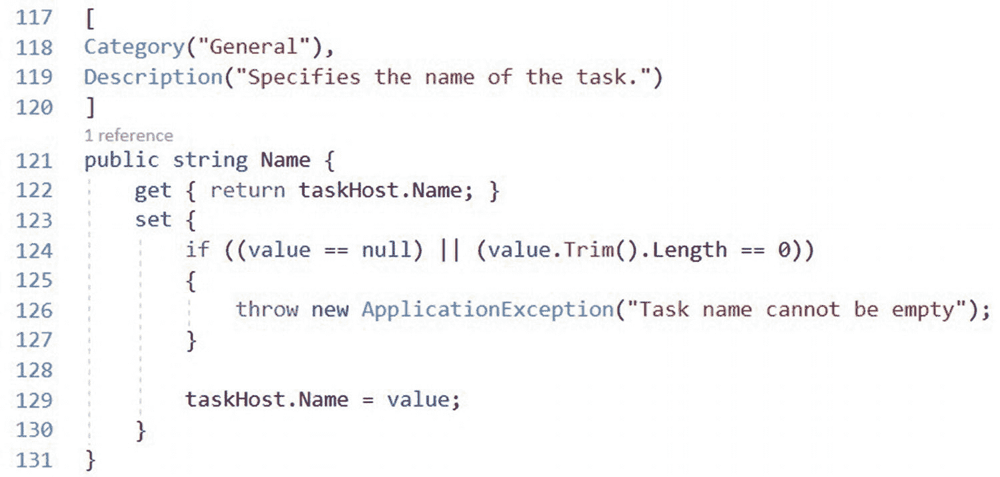

图 13-15

问题已解决的 Name 属性

第 117-120 行所示的 `Category` 和 `Description` 装饰由 propertygrid 控件用于 Property Category（可能包含一个或多个属性）以及在编辑期间选择属性时显示在编辑器底部的 Property Description。本例中 Property Category 设置为 `General`；Property Description 设置为 `Specifies the name of the task`。Property Name 源自视图成员的名称——本例中为 `Name`。

第 122 行包含一个 `get` 语句，该语句从 `taskHost.Name` 属性（或 `taskHost` 的 `Name` 属性）返回 `Name` 属性的值。虽然该语句相对简短，但有几个活动部分。`GeneralNode taskHost` 成员指向回 `ExecuteCatalogPackageTask` 类。这里 `GeneralNode Name` 属性正在 `get` 的 `taskHost.Name` 属性值就是 `ExecuteCatalogPackageTask.Name` 属性值。`ExecuteCatalogPackageTask.Name` 属性值存储在哪里？在 SSIS 包 XML 中。

第 123-130 行包含该属性的 `set` 功能。第 124-127 行检查属性值是否为 null 或空，如果是，则抛出 `ApplicationException`，返回消息“`Task name cannot be empty`”。

如果没有异常，则在第 129 行设置 `taskHost.Name` 的值。

使用代码清单 13-8 的代码向 `GeneralNode` 添加 Description 属性：

```
[
Category("General"),
Description("Specifies the description for this task.")
]
public string Description {
get { return taskHost.Description; }
set { taskHost.Description = value; }
}
Listing 13-8
添加 GeneralNode Description 属性
```

添加后，代码如图 13-16 所示：

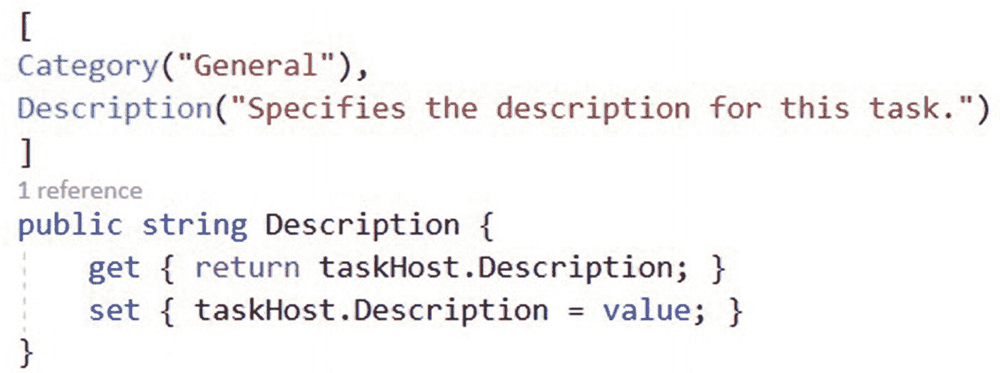

图 13-16

Description 属性

添加 Name 和 Description 属性后，OnCommit 方法中的错误被清除（与图 13-6 对比），如图 13-17 所示：

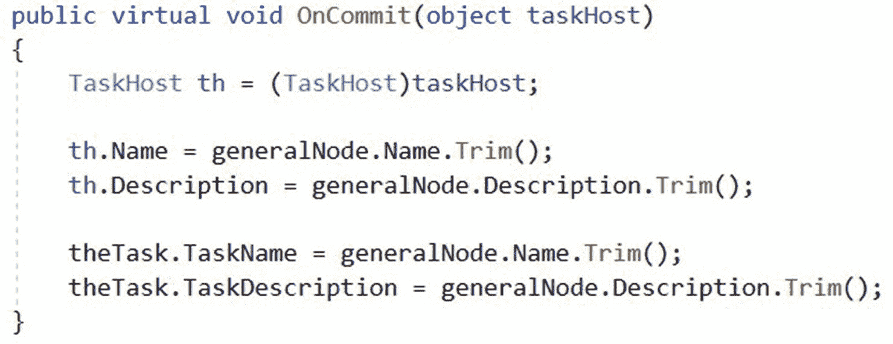

图 13-17

OnCommit 错误已清除

### 测试 GeneralView

生成解决方案，然后打开一个测试 SSIS 项目。将 Execute Catalog Package Task 添加到控制流并打开编辑器。观察 General 页面，如图 13-18 所示：

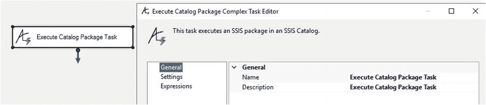

图 13-18

运行中的 GeneralView

下一步是编写 SettingsView 代码。


## 实现 `SettingsView` 的 `IDTSTaskUIView` 接口

在章节 11 中，我们使用了 Visual Studio 2019 内置的相同便捷功能，为 `SettingsView` 实现了所需的 `IDTSTaskUIView` 接口方法，就像我们实现 `GeneralView` 接口时一样，如图 13-19 所示：

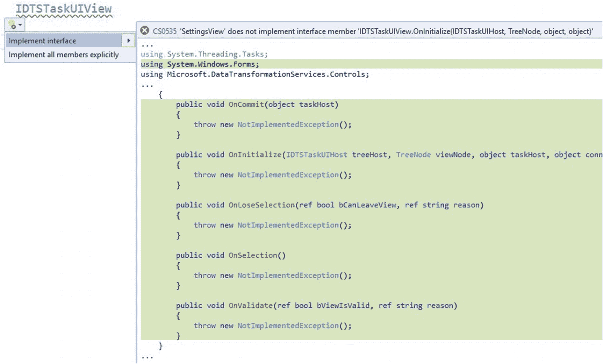
*图 13-19. 为 `SettingsView` 实现所需的 `IDTSTaskUIView` 接口方法*

在本章接近尾声时，我们注释掉了 `throw` 语句，以便 `ExecuteCatalogPackageTaskComplexUI` 项目能够构建并通过一些基本测试。代码——经过重新排列以适应我的 CDO——现在如清单 13-9 所示：

```
public void OnInitialize(IDTSTaskUIHost treeHost, TreeNode viewNode, object taskHost, object connections)
{
    // throw new NotImplementedException();
}
public void OnValidate(ref bool bViewIsValid, ref string reason)
{
    // throw new NotImplementedException();
}
public void OnCommit(object taskHost)
{
    // throw new NotImplementedException();
}
public void OnSelection()
{
    // throw new NotImplementedException();
}
public void OnLoseSelection(ref bool bCanLeaveView, ref string reason)
{
    // throw new NotImplementedException();
}
// 清单 13-9
// SettingsView 的 IDTSTaskUIView 接口方法，已注释掉
```

下一步是实现 `SettingsView OnInitialize` 方法。

### 实现 `SettingsView OnInitialize`

通过用清单 13-10 中的代码替换当前的 `OnInitialize` 方法代码，来实现 `SettingsView OnInitialize` 方法：

```
public virtual void OnInitialize(IDTSTaskUIHost treeHost
, System.Windows.Forms.TreeNode viewNode
, object taskHost
, object connections)
{
    if (taskHost == null)
    {
        throw new ArgumentNullException("Attempting to initialize the ExecuteCatalogPackageTask UI with a null TaskHost");
    }
    if (!(((TaskHost)taskHost).InnerObject is ExecuteCatalogPackageTask.ExecuteCatalogPackageTask))
    {
        throw new ArgumentException("Attempting to initialize the ExecuteCatalogPackageTask UI with a task that is not a ExecuteCatalogPackageTask.");
    }
    theTask = ((TaskHost)taskHost).InnerObject as ExecuteCatalogPackageTask.ExecuteCatalogPackageTask;
    this.settingsNode = new SettingsNode(taskHost as TaskHost, connections);
    settingsPropertyGrid.SelectedObject = this.settingsNode;
}
// 清单 13-10
// 为 SettingsView 实现 OnInitialize
```

与编写 `GeneralView` 代码时一样，修复缺失的 `using` 指令以清除 `TaskHost` 设计时警告（参见图 13-3）。我们稍后会清除 `SettingsNode` 设计时警告——即红色波浪线。

现在，`SettingsView OnInitialize` 方法应如图 13-20 所示：

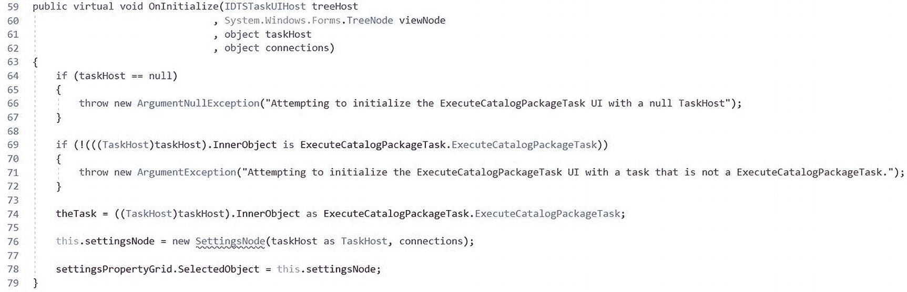
*图 13-20. `SettingsView OnInitialize` 方法*

图 13-20 中包含了 Visual Studio 行号，以辅助讨论代码功能。第 59-63 行是 `SettingsView OnInitialize` 方法的声明和参数。

第 64-67 行检查 `taskHost` 成员是否为 null，如果 `taskHost` 为 null，则抛出一条包含以下消息的 `ArgumentNullException`：“Attempting to initialize the `ExecuteCatalogPackageTask` UI with a null `TaskHost`。”

第 69-72 行测试 `SettingsView taskHost` 成员的 `InnerObject` 是否*不能*强制转换为 `ExecuteCatalogPackageTask` 类型的实例。如果 `SettingsView taskHost` 成员的 `InnerObject` 无法强制转换为 `ExecuteCatalogPackageTask`，则代码会抛出一条包含以下消息的 `ArgumentException`：“Attempting to initialize the `ExecuteCatalogPackageTask` UI with a task that is not an `ExecuteCatalogPackageTask`。”

如果前面的“类型测试”成功，则在第 74 行将 `SettingsView theTask` 成员的 `InnerObject` 赋值给 `ExecuteCatalogPackageTask` 对象。

在第 76 行，`SettingsView generalNode` 成员被初始化（此处的代码目前有问题，但我们很快会修复它）。

最后，`SettingsView settingsPropertyGrid` 成员被初始化为 `settingsNode`。

与 `GeneralView` 类似，`SettingsView OnInitialize` 方法中有很多活动部件。新的 `SettingsView OnInitialize` 方法正在使用 `SettingsView taskHost` 成员将 `ExecuteCatalogPackageTaskComplexUI` 与 `ExecuteCatalogPackageTask` 耦合。一旦成功——如果无法耦合，代码将抛出异常——`SettingsView` 的 `settingsNode` 成员就被初始化（为一个新的 `SettingsNode` 对象），并且 `SettingsView` 的 `settingsPropertyGrid` 接着被初始化为（新的）`settingsNode`。

### 添加 `ExecuteCatalogPackageTask` 属性

在实现 `SettingsView OnCommit` 之前，我们需要向 `ExecuteCatalogPackageTask` 类添加几个属性。在 `ExecuteCatalogPackageTask` 项目中打开 `ExecuteCatalogPackageTask.cs` 文件，然后添加清单 13-11 中的成员声明：

```
public string ConnectionManagerName { get; set; } = String.Empty;
public bool Synchronized { get; set; } = false;
public bool Use32bit { get; set; } = false;
public string LoggingLevel { get; set; } = "Basic";
// 清单 13-11
// 添加 ExecuteCatalogPackageTask 成员
```

添加后，新的 `ExecuteCatalogPackageTask` 成员如图 13-21 所示：

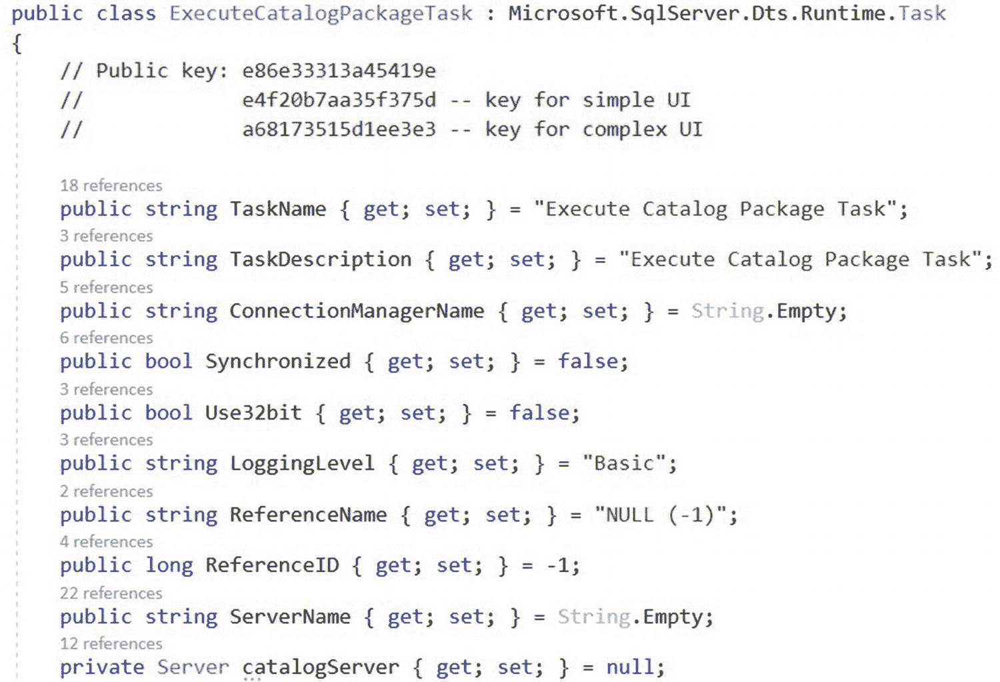
*图 13-21. 新的 `ExecuteCatalogPackageTask` 成员*

`SettingsView` 展示了在“执行目录包任务（复杂）”编辑器的“设置”页面上配置的 `ExecuteCatalogPackageTask` 属性。在本节中，我们向复杂编辑器引入了复杂性，因此我们将采取增量方法进行编码、构建和测试。我们首先添加 `FolderName`、`ProjectName` 和 `PackageName` 属性。

### 为 `FolderName`、`ProjectName` 和 `PackageName` 属性实现 `SettingsView OnCommit`

回到 `ExecuteCatalogPackageTaskComplexUI` 项目，并用清单 13-12 中的代码替换当前的 `OnCommit` 方法代码，来实现 `SettingsView OnCommit` 方法：

```
public virtual void OnCommit(object taskHost)
{
    theTask.PackageFolder = settingsNode.FolderName;
    theTask.PackageProject = settingsNode.ProjectName;
    theTask.PackageName = settingsNode.PackageName;
}
// 清单 13-12
// 为 SettingsView 实现 OnCommit
```

`SettingsView OnCommit` 方法如图 13-22 所示：

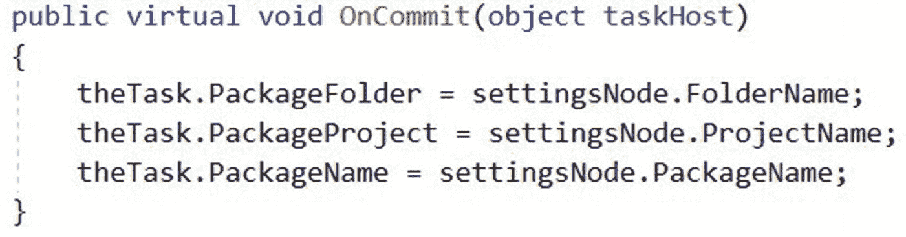
*图 13-22. 用于 `FolderName`、`ProjectName` 和 `PackageName` 属性的 `SettingsView OnCommit` 方法*

下一步是为 `FolderName`、`ProjectName` 和 `PackageName` 属性编写 `SettingsNode` 代码。


### 为 FolderName、ProjectName 和 PackageName 属性编写 SettingsNode 代码

首先，使用 `清单 13-13` 中的代码向 `SettingsNode` 添加 `FolderName`、`ProjectName` 和 `PackageName` 成员：

```
internal ExecuteCatalogPackageTask.ExecuteCatalogPackageTask _task = null;
private TaskHost _taskHost = null;
清单 13-13
向 SettingsNode 添加成员
```

`SettingsNode` 类如 `图 13-23` 所示：

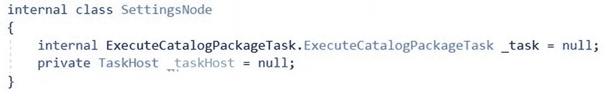

`图 13-23` `SettingsNode` 类成员

通过添加 `清单 13-14` 中的代码为 `SettingsNode` 类添加一个构造函数：

```
public SettingsNode(TaskHost taskHost
, object connections)
{
_taskHost = taskHost;
_task = taskHost.InnerObject as ExecuteCatalogPackageTask.ExecuteCatalogPackageTask;
}
清单 13-14
添加 SettingsNode 类构造函数
```

添加构造函数后，`SettingsNode` 类如 `图 13-24` 所示：

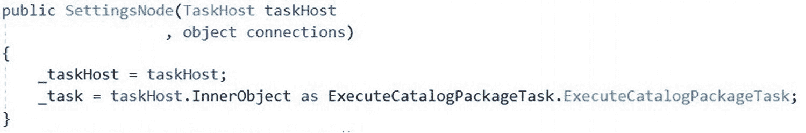

`图 13-24` `SettingsNode` 类构造函数

在实现 `SettingsNode` 构造函数后，第 78 行的设计时警告被清除，如 `图 13-25` 所示：


`图 13-25` 错误消失

下一步是编写 `SettingsNode` 的 `FolderName`、`ProjectName` 和 `PackageName` 属性代码。

## 编写 SettingsNode FolderName、ProjectName 和 PackageName 属性

让我们从 `SettingsNode` 成员（属性）开始，这些属性用于标识我们要在 SSIS 目录中执行的包：

*   文件夹名称

*   项目名称

*   包名称

要为我们自定义的 SSIS 任务添加 `FolderName`、`ProjectName` 和 `PackageName` 属性，请将 `清单 13-15` 中的代码添加到 `SettingsNode`：

```
[
Category("SSIS Catalog Package Properties"),
Description("Enter SSIS Catalog Package folder name.")
]
public string FolderName {
get { return _task.PackageFolder; }
set {
if (value == null)
{
throw new ApplicationException("Folder name cannot be empty");
}
_task.PackageFolder = value;
}
}
[
Category("SSIS Catalog Package Properties"),
Description("Enter SSIS Catalog Package project name.")
]
public string ProjectName {
get { return _task.PackageProject; }
set {
if (value == null)
{
throw new ApplicationException("Project name cannot be empty");
}
_task. PackageProject = value;
}
}
[
Category("SSIS Catalog Package Properties"),
Description("Enter SSIS Catalog Package name.")
]
public string PackageName {
get { return _task.PackageName; }
set {
if (value == null)
{
throw new ApplicationException("Package name cannot be empty");
}
_task. PackageName = value;
}
}
清单 13-15
向 SettingsNode 添加 FolderName、ProjectName 和 PackageName 属性
```

添加后，代码如 `图 13-26` 所示：

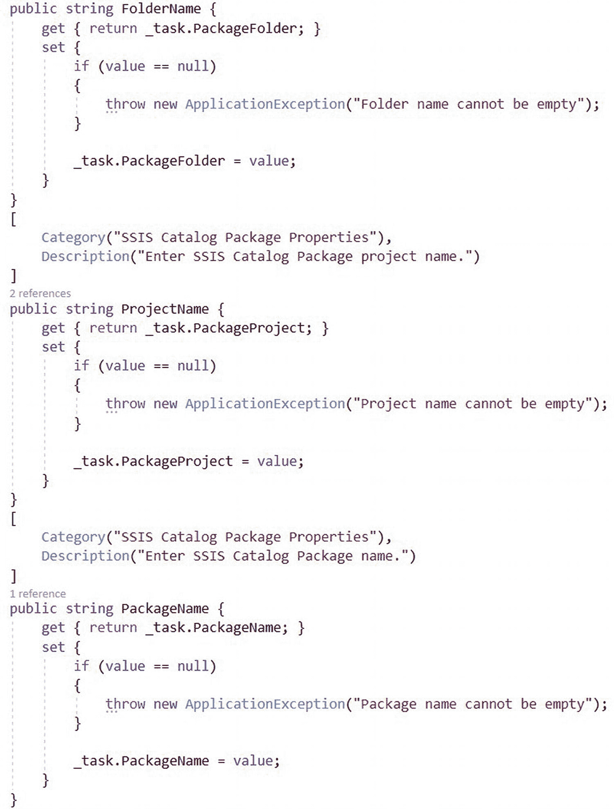

`图 13-26` 添加 `FolderName`、`ProjectName` 和 `PackageName` 属性

请注意，这里检查了值是否为 null，但没有检查长度是否为 0。省略长度为 0 的字符串检查的原因是，当编辑器中更新“父级”属性时，代码最终会将 `FolderName`、`ProjectName` 和 `PackageName` 属性的值设置为空字符串。例如，如果 SSIS 开发人员选择了新的 `ProjectName` 属性值，代码需要将当前的 `PackageName` 属性值设置为空字符串。此功能将在后面的几章中编写。

与向 `GeneralNode` 添加初始属性类似，添加特性（decorations）需要在 `SettingsView.cs` 文件中添加 `using System.ComponentModel;` 指令。

`FolderName`、`ProjectName` 和 `PackageName` 这些 `SettingsNode` 成员的设计时验证方式与 `GeneralNode` 成员的验证方式大致相同。

## 测试 SettingsView FolderName、ProjectName 和 PackageName 属性

生成解决方案，然后打开一个测试 SSIS 项目。向控制流添加一个“执行目录包任务”(Execute Catalog Package Task)并打开编辑器。观察“设置”(Settings)页，如 `图 13-27` 所示：

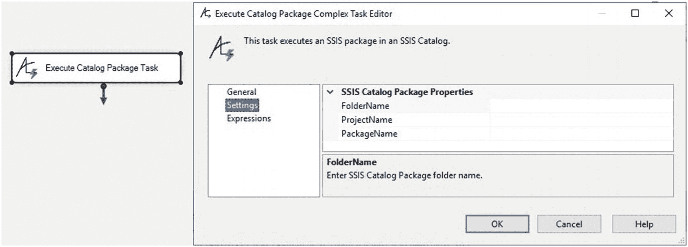

`图 13-27` `SettingsView` 的 `FolderName`、`ProjectName` 和 `PackageName` 属性实际运行效果

下一步是向 `SettingsNode` 添加连接相关的属性。

### 为连接相关成员编写 SettingsNode 代码

要开始向 `SettingsNode` 添加连接相关成员，使用 `清单 13-16` 中的代码向 `SettingsNode` 类添加一个名为 `_connections`（对象类型）的私有成员：

```
private object _connections = null;
清单 13-16
将 _connections 对象添加到 SettingsNode
```

添加后，`SettingsNode` 成员应如 `图 13-28` 所示：

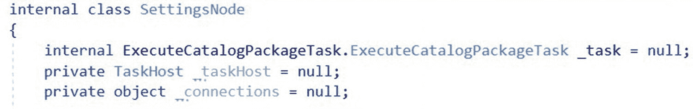

`图 13-28` 添加 `_connections`

在 `SettingsNode` 构造函数中，通过添加 `清单 13-17` 中的代码，将 `_connections` 对象初始化为传递给构造函数的 `connections` 对象：

```
_connections = connections;
清单 13-17
初始化 _connections 成员
```

`SettingsNode` 构造函数如 `图 13-29` 所示：

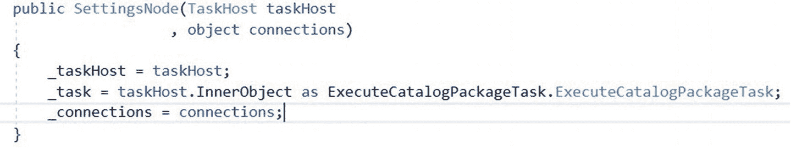

`图 13-29` 连接已初始化

下一步是隔离 SSIS 包中包含的 ADO.Net 连接。

## 关于 SSIS 包连接

接下来的几段文字并非意在迷惑你，但如果你是第一次阅读 SSIS 包如何向 SSIS 任务公开集合的内容，它们可能会让你感到困惑。关于 SSIS，以下陈述是真实的：

*   SSIS 包和容器都是容器。

*   SSIS 包、容器和任务都是可执行文件。

*   一个 SSIS 包将始终包含一个容器集合——并且容器集合将始终至少有一个成员，因为包本身就是一个容器。

*   一个 SSIS 包将始终包含一个可执行文件集合——并且可执行文件集合将始终至少有一个成员，因为包本身就是一个可执行文件。

*   一个 SSIS 包将始终包含一个连接管理器集合——而连接集合可能包含 0、1 或多个连接管理器。

SSIS 包连接集合对可执行文件是可用的，以防任何给定的可执行文件需要使用 SSIS 包连接管理器。SSIS 项目连接管理器也是 SSIS 包连接集合的成员。

当实例化 `ExecuteCatalogPackageTaskComplexUIForm` 时，会调用 `ExecuteCatalogPackageTaskComplexUI` 的 `GetView` 方法，并将一个名为 `connectionService`（`IDtsConnectionService` 类型）的成员传递给 `SettingsView OnInitialize` 方法。连接集合被传递给 `SettingsNode` 构造函数，在那里它可用于填充某些连接类型的列表。


### 隔离 SSIS 包的 ADO.Net 连接

首先，使用清单 13-18 中的代码，向`SettingsNode`添加一个`Connections`成员：

```
[
Browsable(false)
]
internal object Connections {
get { return _connections; }
set { _connections = value; }
}
清单 13-18
向 SettingsNode 添加一个 Connections 对象
```

`SettingsNode`的`Connections`属性在以下两个方面与之前的属性不同：

*   `Connections`是一个对象类型。
*   该成员的装饰属性是`Browsable(false)`，这意味着`Connections`成员是一个属性，但`Connections`属性不会在`SettingsNode`的属性网格中显示。

当添加到`SettingsNode`后，`Connections`属性如图 13-30 所示：

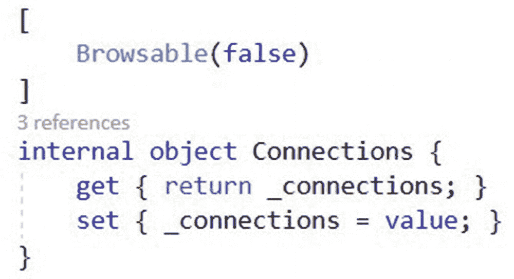

图 13-30 Connections 属性

我们希望仅使用 ADO.Net 连接来连接到 SSIS 目录。为了获取 SSIS 包中包含的 ADO.Net 连接管理器列表，请将清单 13-19 中的代码添加到`SettingsNode`构造函数中：

```
_connections = ((IDtsConnectionService)connections).GetConnectionsOfType("ADO.Net");
清单 13-19
获取 ADO.Net 连接管理器列表
```

将代码添加到项目后，其外观如图 13-31 所示：

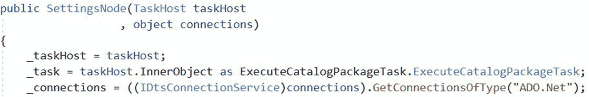

图 13-31 将 ADO.Net 连接管理器列表添加到 `_connections`

现在，我们已将一个 ADO.Net 连接管理器列表存储在`_connections`对象中，这是一个名为`Connections`的、隐藏的（非`Browsable`）、内部的`SettingsNode`属性（成员）。

下一步是构建一个`TypeConverter`，用于生成 ADO.Net 连接管理器名称的列表。

### 构建 ADONetConnections TypeConverter

根据微软的`TypeConverter`类文档（docs.microsoft.com/en-us/dotnet/api/system.componentmodel.typeconverter?view=netframework-4.7.2），`TypeConverter`“提供了一种统一的方式来将值类型转换为其他类型，以及访问标准值和子属性。”`TypeConverter`用于从集合中创建对象的枚举或列表。应用到`ExecuteCatalogPackageTaskComplexUI`中的 ADO.Net 连接管理器列表，我们将构建一个字符串值的`ArrayList`，其中包含存储在`Connections`（`object`类型）集合中的 ADO.Net 连接管理器的名称。

首先，使用清单 13-20 中的代码，在`SettingsView.cs`文件中添加一个名为`ADONetConnections`的新类：

```
internal class ADONetConnections : StringConverter { }
清单 13-20
添加 ADONetConnections 类
```

添加后，代码将如图 13-32 所示：

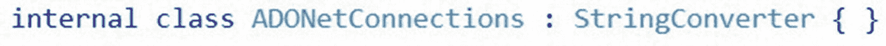

图 13-32 新的 `ADONetConnections` `StringConverter` 类

`StringConverter`是`TypeConverter`的一个接口实现。

使用清单 13-21 中的代码，向`ADONetConnections`类声明并初始化一个名为`NEW_CONNECTION`的`常量字符串`成员：

```
private const string NEW_CONNECTION = "";
清单 13-21
向 ADONetConnections 添加 NEW_CONNECTION
```

声明新成员后，`ADONetConnections`应如图 13-33 所示：

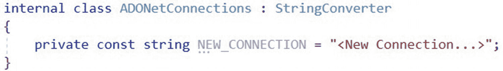

图 13-33 声明 `ADONetConnections.NEW_CONNECTION`

`TypeConverter`遵循一个通用模式，包含一个对象和三个可重写的方法：

*   `GetSpecializedObject` (`object`)
*   `GetStandardValues` (`StandardValuesCollection`)
*   `GetStandardValuesExclusive` (`bool`)
*   `GetStandardValuesSupported` (`bool`)

通过将清单 13-22 中的代码添加到`ADONetConnections`类来实现这些方法：

```
private object GetSpecializedObject(object contextInstance)
{
DTSLocalizableTypeDescriptor typeDescr = contextInstance as DTSLocalizableTypeDescriptor;
if (typeDescr == null)
{
return contextInstance;
}
return typeDescr.SelectedObject;
}
public override StandardValuesCollection GetStandardValues(ITypeDescriptorContext context)
{
object retrievalObject = GetSpecializedObject(context.Instance) as object;
return new StandardValuesCollection(getADONetConnections(retrievalObject));
}
public override bool GetStandardValuesExclusive(ITypeDescriptorContext context)
{
return true;
}
public override bool GetStandardValuesSupported(ITypeDescriptorContext context)
{
return true;
}
清单 13-22
向 ADONetConnections 添加 TypeConverter 方法
```

添加后，代码如图 13-34 所示：

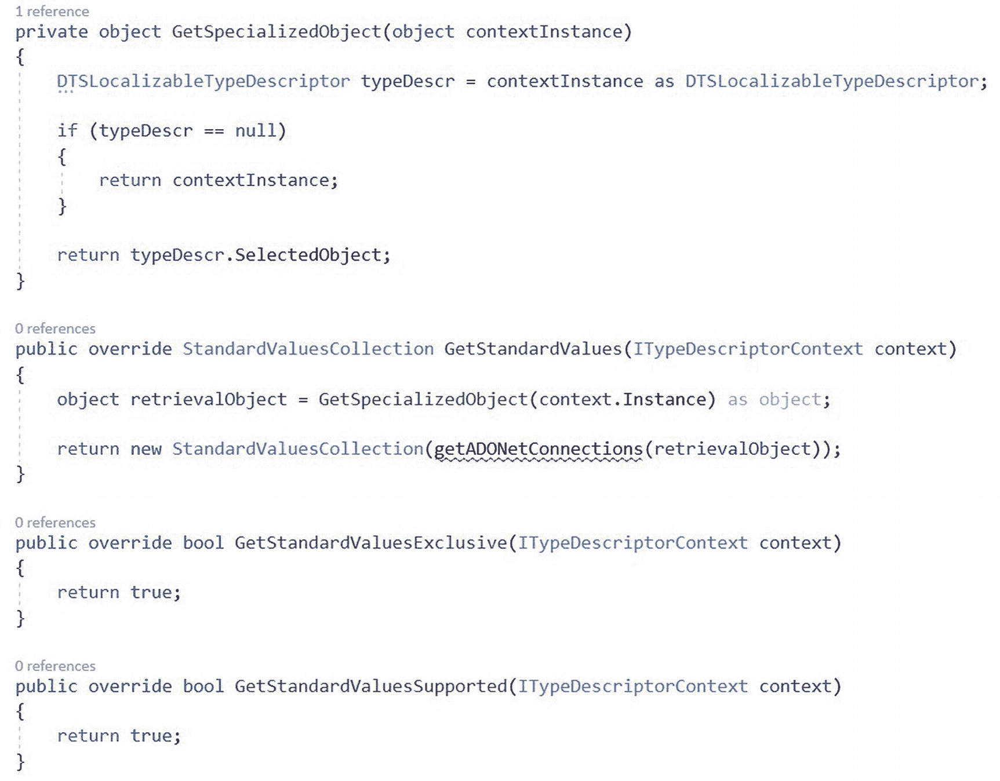

图 13-34 添加 `ADONetConnections` 方法

对`TypeConverter`方法的讨论是一个深入的话题，作者选择不在此示例中包含。在`ADONetConnections StringConverter`中实现的`TypeConverter`的结果将是一个`ArrayList`，其中包含 SSIS 包中配置的 ADO.Net 连接管理器的名称，外加一个创建新 ADO.Net 连接管理器的选项。

`ADONetConnections StringConverter`的`GetStandardValues`方法调用`getADONetConnections`，该方法使用清单 13-23 中的代码构建并返回`ArrayList`：

```
private ArrayList getADONetConnections(object retrievalObject)
{
SettingsNode node = (SettingsNode)retrievalObject;
ArrayList list = new ArrayList();
ArrayList listConnections = new ArrayList();
listConnections = (ArrayList)node.Connections;
// adds the new connection item
list.Add(NEW_CONNECTION);
// adds each ADO.Net connection manager
foreach (ConnectionManager cm in listConnections)
{
list.Add(cm.Name);
}
// sorts the connection manager list
if ((list != null) && (list.Count > 0))
{
list.Sort();
}
return list;
}
清单 13-23
getADONetConnections
```

通过将指令`using System.Collections;`添加到`SettingsView.cs`文件，可以清除`ArrayList`类型错误。

添加后，代码将如图 13-35 所示：

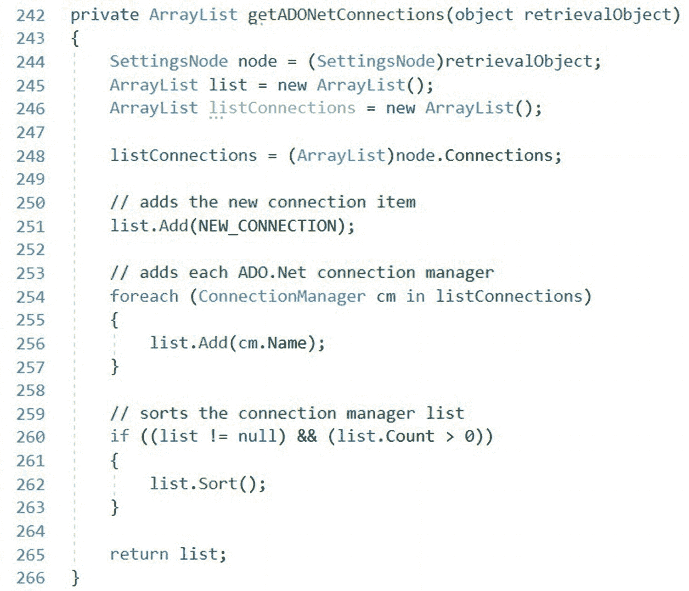

图 13-35 `getADONetConnections` 已添加

下面简要描述`getADONetConnections`中的代码。一个`settingsNode`实例通过`retrievalObject`(`object`)参数传递给`getADONetConnections`方法。声明并初始化了一个新的内部`SettingsNode`变量`node`和两个`ArrayList`变量——`list`和`listConnections`。`listConnections`被赋值为`SettingsNode`变量(`node`)的`Connections`对象。`NEW_CONNECTION`被添加到`list`(`ArrayList`)中。

一个`foreach`循环枚举`listConnections`中的每个连接，并将每个连接管理器的名称添加到`list ArrayList`中。请记住，根据`SettingsNode`构造函数，`Connections`仅包含 ADO.Net 连接管理器。

如果`list ArrayList`包含值，代码会对`list ArrayList`中包含的值进行排序。

最后，`list ArrayList`被返回给调用者。

### SourceConnection 属性的实现与应用

## 暴露 SourceConnection 属性

此前在“为连接相关成员编码 SettingsNode”章节中的所有工作，都是为了最终能够将 `SourceConnection` 属性添加到 `SettingsView` 中。

要暴露 `SourceConnection` 属性，请将代码清单 13-24 添加到 `SettingsNode` 类中：

```
[
Category("Connections"),
Description("The SSIS Catalog connection"),
TypeConverter(typeof(ADONetConnections))
]
public string SourceConnection {
get { return _task.ConnectionManagerName; }
set { _task.ConnectionManagerName = value; }
}
```
*代码清单 13-24 添加 SourceConnection 属性*

添加后，代码如图 13-36 所示：

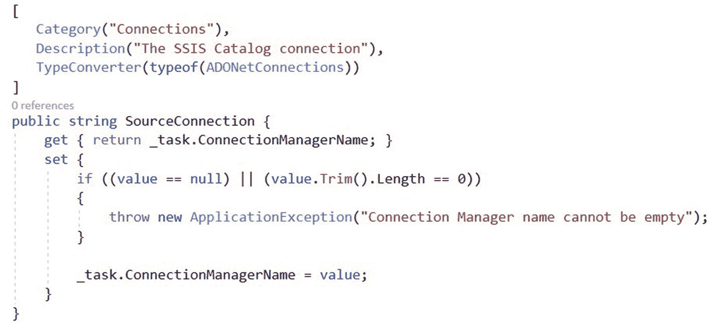
*图 13-36 已向 SettingsNode 添加 SourceConnection 成员*

## 测试 SourceConnection 属性

生成解决方案。如果一切顺利，解决方案应成功生成。打开一个测试 SSIS 项目，将“执行目录包任务”添加到测试 SSIS 包的控制流中。打开编辑器并单击“设置”选项卡。`SourceConnection` 属性将出现在“连接”类别中，并包含 SSIS 包中 ADO.Net 连接管理器名称的列表，以及创建新连接的选项，如图 13-37 所示：

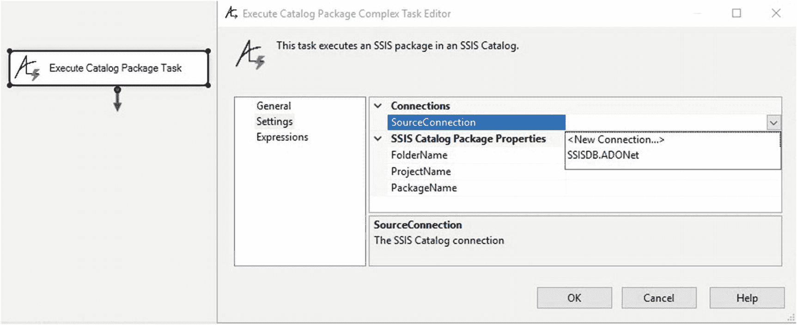
*图 13-37 SourceConnection 属性可见且已填充*

`SourceConnection` 显示为下拉列表，是因为 `SettingsNode SourceConnection` 属性装饰包含了 `TypeConverter` 特性，告知 `SettingsView` 的 PropertyGrid，`SourceConnection` 属性中的值属于 `ADONetConnections` 类型。`ADONetConnections` 类型是一个 `StringConverter`，其中包含一个 `ArrayList` 字符串列表，而 `ArrayList` 中的字符串列表就是 SSIS 包的 `connections` 集合中所有 ADO.Net 连接管理器的名称。

开发至此真是**太棒了**：我们已经成功暴露了 `SourceConnection` 属性！这是个好消息。坏消息是，`SourceConnection` 属性目前还**没有任何作用**。不过，我们已经**非常接近**了。

下一步是添加代码，使“执行目录包任务”能够使用 `SourceConnection` 属性。

现在是个绝佳的时机来签入你的代码。

## 使用 SourceConnection 属性

通过将代码清单 13-25 添加到 `SettingsView OnCommit` 方法，更新该方法，将 `SettingsNode SourceConnection` 成员的值发送给 `ExecuteCatalogPackageTask` 的 `ConnectionManagerName` 属性：

```
theTask.ConnectionManagerName = settingsNode.SourceConnection;
```
*代码清单 13-25 为 ExecuteCatalogPackageTask 的 ConnectionManagerName 属性赋值*

添加后，`OnCommit` 方法如图 13-38 所示：

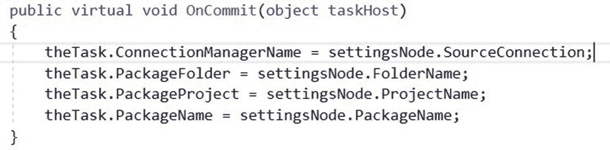
*图 13-38 ConnectionManagerName 属性已赋值*

`OnCommit` 方法在视图提交时触发。对于当前开发阶段的 `SettingsView` 来说，由 `settingsNode` 管理的 `SourceConnection`、`FolderName`、`ProjectName` 和 `PackageName` 属性，将分别设置 `ExecuteCatalogPackageTask` 的 `ConnectionManagerName`、`PackageFolder`、`PackageProject` 和 `PackageName` 属性的值。

## 从 SourceConnection 提取 ServerName

`SourceConnection` 包含一个 SSIS 包连接管理器（一个 ADO.Net 连接管理器）的名称。我们可以使用代码清单 13-26 中的 `returnSelectedConnectionManagerDataSourceValue` 函数代码，从连接管理器的连接字符串中提取其中包含的 SQL Server 实例名称：

```
private string returnSelectedConnectionManagerDataSourceValue(string connectionManagerName, string connectionString = "")
{
string ret = String.Empty;
ArrayList listConnections = (ArrayList)settingsNode.Connections;
string connString = String.Empty;
// match the selected ADO.Net connection manager
if (listConnections.Count > 0)
{
foreach (ConnectionManager cm in listConnections)
{
if (cm.Name == connectionManagerName)
{
connString = cm.ConnectionString;
}
}
}
else
{
connString = connectionString;
}
// parse if a match is found
if (connString!= String.Empty)
{
string dataSourceStartText = "Data Source=";
string dataSourceEndText = ";";
int dataSourceTagStart = connString.IndexOf(dataSourceStartText) + dataSourceStartText.Length;
int dataSourceTagEnd = 0;
int dataSourceTagLength = 0;
if (dataSourceTagStart > 0)
{
dataSourceTagEnd = connString.IndexOf(dataSourceEndText, dataSourceTagStart);
if (dataSourceTagEnd > dataSourceTagStart)
{
dataSourceTagLength = dataSourceTagEnd - dataSourceTagStart;
ret = connString.Substring(dataSourceTagStart, dataSourceTagLength);
}
}
}
return ret;
}
```
*代码清单 13-26 returnSelectedConnectionManagerDataSourceValue 函数*

添加到 `SettingsView.cs` 文件后，代码如图 13-39 所示：

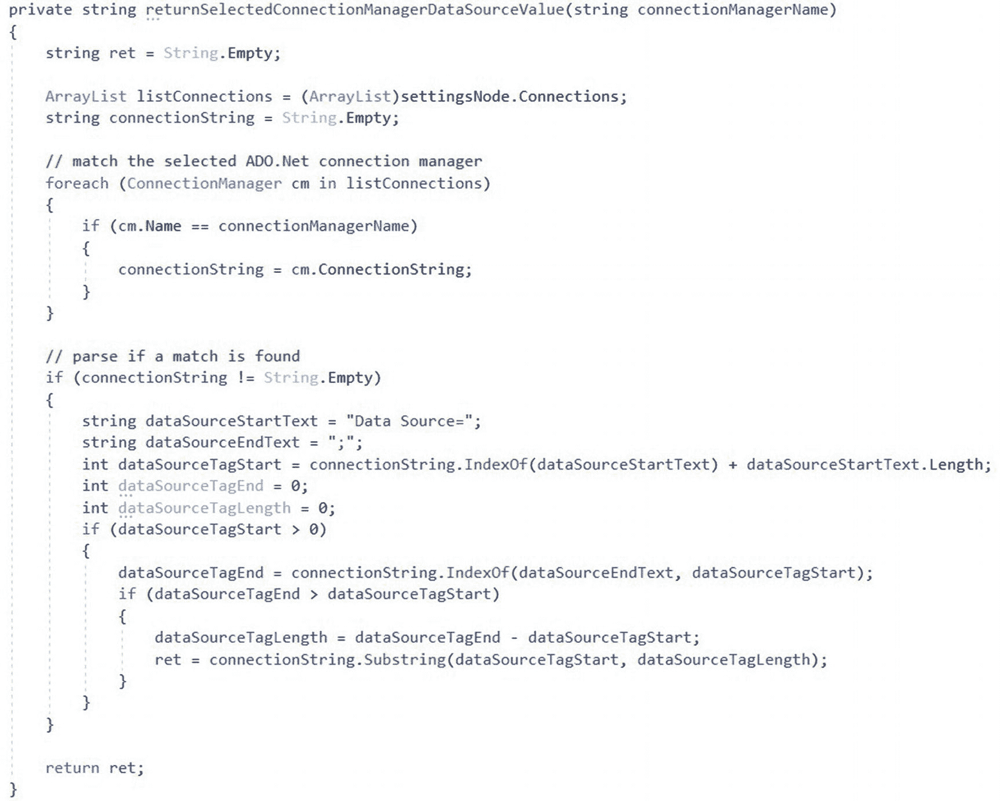
*图 13-39 returnSelectedConnectionManagerDataSourceValue 函数*

还有其他方法可以从连接字符串中提取数据源属性值。你可以在代码中实现更好的方式。

通过将代码清单 13-27 添加到 `SettingsView OnCommit` 方法，更新该方法，将 `SettingsNode SourceConnection ConnectionString` 的数据源属性值中包含的服务器名称值发送给 `ExecuteCatalogPackageTask` 的 `ServerName` 属性：

```
theTask.ServerName = returnSelectedConnectionManagerDataSourceValue(settingsNode.SourceConnection);
```
*代码清单 13-27 为 ExecuteCatalogPackageTask 的 ServerName 属性赋值*

添加后，`OnCommit` 方法如图 13-40 所示：

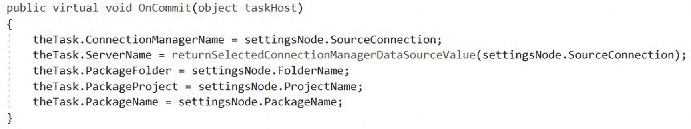
*图 13-40 ServerName 属性已赋值*

最后，编辑 `SettingsView.propertyGridSettings_PropertyValueChanged` 方法，使得对 `SourceConnection` 属性的更改**也**触发对 `returnSelectedConnectionManagerDataSourceValue` 函数的调用——需要在两个地方进行修改（第一处，在“新建连接”功能内部，在赋值 `SettingsNode.SourceConnection` 之后；第二处，为 `if (e.ChangedItem.Value.Equals(NEW_CONNECTION))` 添加一个 `else` 块，并在那里放置一个调用）——使用代码清单 13-28 中的代码。

