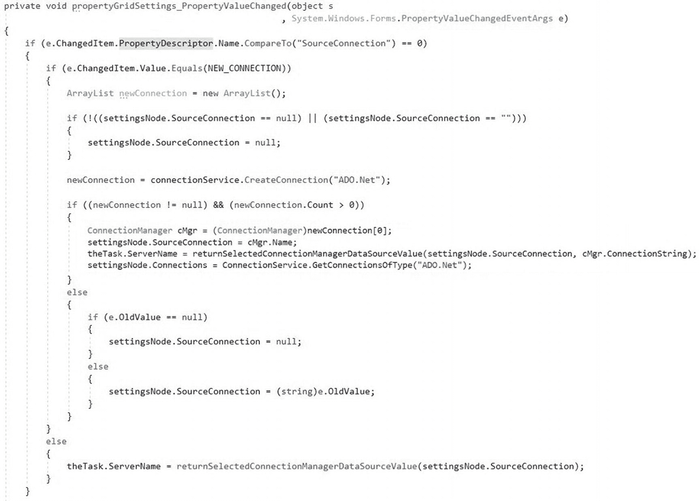
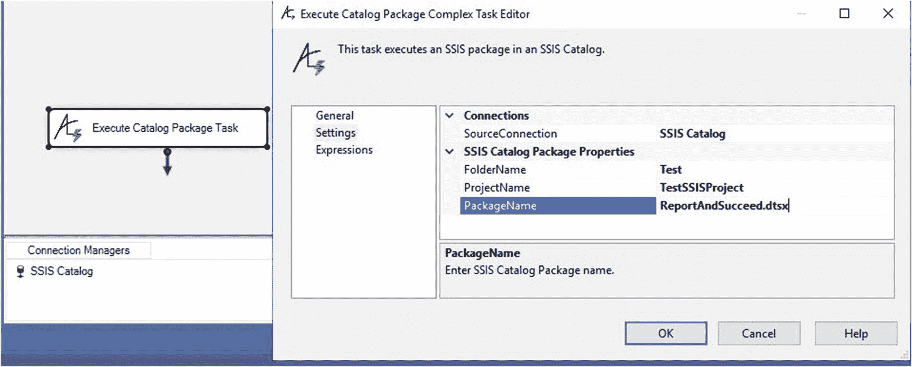
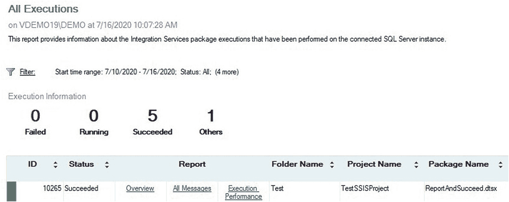

# 13. 实现执行目录包任务（续）

## 13. 实现设置视图（续）

```csharp
if (e.ChangedItem.PropertyDescriptor.Name.CompareTo("SourceConnection") == 0)
{
    if (e.ChangedItem.Value.Equals(NEW_CONNECTION))
    {
        ArrayList newConnection = new ArrayList();
        if (!((settingsNode.SourceConnection == null)
            || (settingsNode.SourceConnection == "")))
        {
            settingsNode.SourceConnection = null;
        }
        newConnection = connectionService.CreateConnection("ADO.Net");
        if ((newConnection != null) && (newConnection.Count > 0))
        {
            ConnectionManager cMgr = (ConnectionManager)newConnection[0];
            settingsNode.SourceConnection = cMgr.Name;
            theTask.ServerName = returnSelectedConnectionManagerDataSourceValue(settingsNode.SourceConnection , cMgr.ConnectionString);
            settingsNode.Connections = connectionService.GetConnectionsOfType("ADO.Net");
        }
        else
        {
            if (e.OldValue == null)
            {
                settingsNode.SourceConnection = null;
            }
            else
            {
                settingsNode.SourceConnection = (string)e.OldValue;
            }
        }
    }
    else
    {
        theTask.ServerName = returnSelectedConnectionManagerDataSourceValue(settingsNode.SourceConnection);
    }
}
```

**清单 13-28** 编辑对`SourceConnection`属性值更改的响应

添加后，代码如图 13-41 所示：



**图 13-41** 更新后的对`SourceConnection`属性值更改的响应

## 测试一下！

生成解决方案。如果一切顺利，解决方案应成功生成。打开一个测试 SSIS 项目，并添加一个指向 SSIS 目录的 `ADO.Net` 连接管理器。将“执行目录包任务”添加到测试 SSIS 包的控制流中。打开编辑器并单击“设置”页面。从 `SourceConnection` 属性下拉菜单中选择 SSIS 目录的 `Ado.Net` 连接管理器。

配置 SSIS 目录的 `FolderName`、`ProjectName` 和 `PackageName` 属性 – 将它们设置为与 SSIS 目录中的文件夹、项目和包匹配，如图 13-42 所示：



**图 13-42** 配置执行目录包任务

单击“确定”按钮关闭编辑器，然后执行 SSIS 包。如果一切按计划进行，SSIS 包执行成功。打开 SQL Server Management Studio (`SSMS`) 并连接到 SSIS 目录的“所有执行报告”。验证 SSIS 包已执行，如图 13-43 所示：



**图 13-43** 成功执行

我们还没有完成 `SourceConnection` 功能的编码，但我们已经达到了先前编辑器的功能水平。

### 结论

在本章中，我们为 `GeneralView` 和 `SettingsView` 实现了 `IDTSTaskUIView` 编辑器接口，向每个视图添加了属性（成员），并在可能的情况下对每一步进行了测试。

接下来的步骤是完成 `SourceConnection` 属性功能并向 `SettingsView` 添加更多成员。

现在是签入代码的好时机。

