# 14. 实现新建连接

在第 13 章中，我们实现了 `GeneralView`，并在实现 `SettingsView` 方面取得了良好开端。本章将完成 `SettingsView` 的 `SourceConnection` 属性实现，这是构建“执行目录包任务”复杂编辑器（至少到目前为止）最复杂的部分。

## 实现新建连接功能

要在 `SourceConnection` 下拉列表中实现“<新建连接…>”功能，我们首先需要添加一个事件处理程序来管理和响应 `PropertyGrid` 值的更改。

首先，将清单 14-1 中的代码添加到 `SettingsView` 类：

```csharp
private void propertyGridSettings_PropertyValueChanged(object s, System.Windows.Forms.PropertyValueChangedEventArgs e) { }
```

**清单 14-1** 添加 `propertyGridSettings_PropertyValueChanged` 事件处理程序方法

添加后，代码如图 14-1 所示：

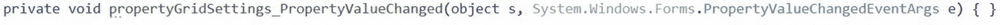

**图 14-1** 添加的 `propertyGridSettings_PropertyValueChanged` 事件处理程序方法

添加了处理 `propertyGridSettings_PropertyValueChanged` 事件的方法后，下一步是更新 `SettingsView` 的 `InitializeComponent` 方法，将事件处理程序分配给以响应 `propertyGridSettings` 的 `PropertyValueChanged` 事件，添加清单 14-2 中的代码：

```csharp
this.settingsPropertyGrid.PropertyValueChanged += new System.Windows.Forms.PropertyValueChangedEventHandler(this.propertyGridSettings_PropertyValueChanged);
```

**清单 14-2** 将 `propertyGridSettings_PropertyValueChanged` 分配给 `propertyGridSettings.PropertyValueChanged`

添加后，代码如图 14-2 所示：

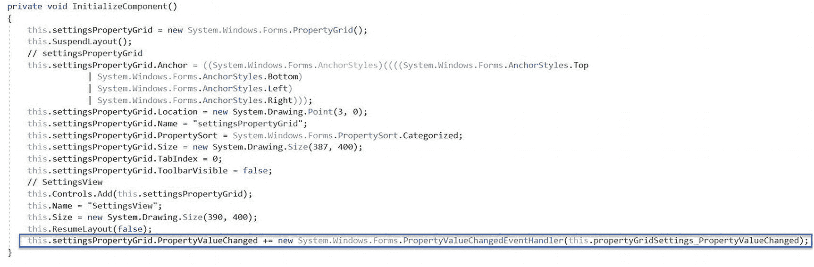

**图 14-2** 分配给 `propertyGridSettings.PropertyValueChanged` 事件的 `propertyGridSettings_PropertyValueChanged` 事件处理程序方法

现在，每当 `propertyGridSettings` 属性网格中*任何*属性值发生变化时，都会调用 `propertyGridSettings_PropertyValueChanged` 事件处理程序方法。

下一步是调整 `propertyGridSettings_PropertyValueChanged` 事件处理程序方法的逻辑，使其能够按照我们期望的方式响*每个* `propertyGridSettings` 属性值的变化。我们从检测并响应 `SourceConnection` 属性的更改开始。


## SourceConnection 属性值变更

检测并响应 `SourceConnection` 属性变化的第一步是检测其属性值的变化。请将清单 14-3 中的代码添加到 `propertyGridSettings_PropertyValueChanged` 事件处理方法中：

```
if (e.ChangedItem.PropertyDescriptor.Name.CompareTo("SourceConnection") == 0) { }
清单 14-3
响应 SourceConnection 属性变更
```

添加后，`propertyGridSettings_PropertyValueChanged` 事件处理方法如图 14-3 所示：

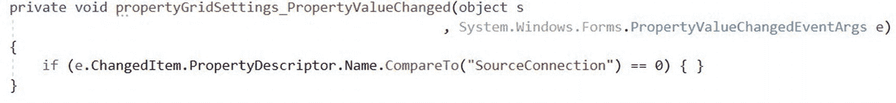

图 14-3

仅响应 SourceConnection 属性变更

下一步是检查是否选择了“新建连接”。然而，在继续之前，请先将清单 14-4 中的代码添加到 `SettingsView` 中，以定义 `NEW_CONNECTION` 字符串常量：

```
private const string NEW_CONNECTION = "";
清单 14-4
向 SettingsView 添加 NEW_CONNECTION 字符串常量
```

添加后，`SettingsView` 中的声明如图 14-4 所示：

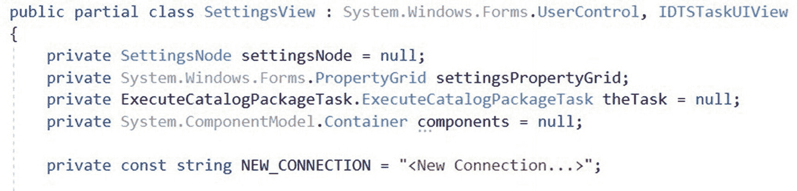

图 14-4

在 `SettingsView` 中声明 `NEW_CONNECTION` 常量

将清单 14-5 中的代码添加到 `propertyGridSettings_PropertyValueChanged` 方法中先前的 `if` 条件语句内部，以确定是否点击了“新建连接”：

```
if (e.ChangedItem.Value.Equals(NEW_CONNECTION)) { }
清单 14-5
检查是否点击了“新建连接”
```

添加了对“新建连接”点击的检查后，`propertyGridSettings_PropertyValueChanged` 方法如图 14-5 所示：


图 14-5

检查新建连接点击

在我们添加代码来创建新的 ADO.Net 连接管理器之前，必须首先向 `SettingsView` 类添加并（稍后）初始化一个名为 `connectionService` 的 `IDtsConnectionService` 成员。将清单 14-6 中的代码添加进来以声明 `connectionService` 成员：

```
private IDtsConnectionService connectionService;
清单 14-6
向 SettingsView 添加 connectionService
```

添加清单 14-6 中的代码后，`SettingsView` 的声明如图 14-6 所示：

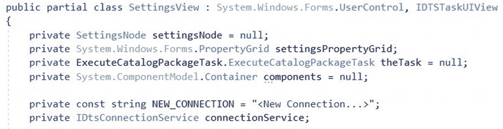

图 14-6

已将 `connectionService` 添加到 `SettingsView`

下一步是初始化 `connectionService IDtsConnectionService` 成员。将清单 14-7 中的代码添加到 `SettingsView OnInitialize` 方法中：

```
connectionService = (IDtsConnectionService)connections;
清单 14-7
在 OnInitialize 中初始化 connectionService
```

添加清单 14-7 中的代码后，`SettingsView OnInitialize` 方法如图 14-7 所示：

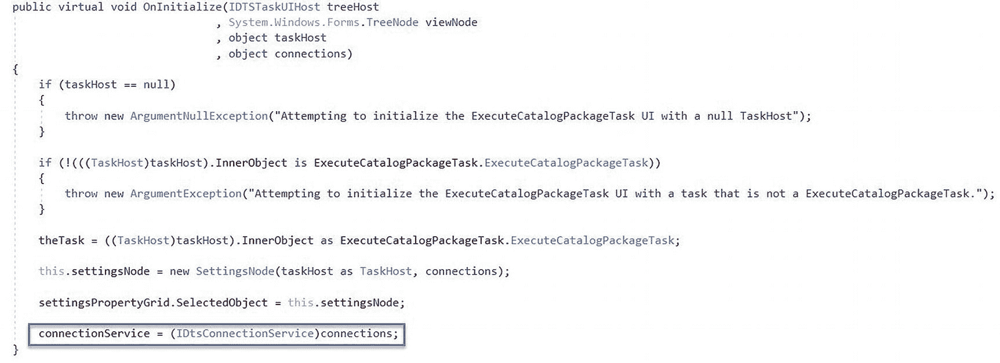

图 14-7

在 `SettingsView OnInitialize` 中初始化了 `connectionService`

将清单 14-8 中的代码添加到 `propertyGridSettings_PropertyValueChanged` 方法中先前的 `if` 条件语句（`if (e.ChangedItem.Value.Equals(NEW_CONNECTION))`）内部，以响应“新建连接”点击：

```
ArrayList newConnection = new ArrayList();
if (!((settingsNode.SourceConnection == null) || (settingsNode.SourceConnection == "")))
{
settingsNode.SourceConnection = null;
}
newConnection = connectionService.CreateConnection("ADO.Net");
if ((newConnection != null) && (newConnection.Count > 0))
{
ConnectionManager cMgr = (ConnectionManager)newConnection[0];
settingsNode.SourceConnection = cMgr.Name;
settingsNode.Connections = connectionService.GetConnectionsOfType("ADO.Net");
}
else
{
if (e.OldValue == null)
{
settingsNode.SourceConnection = null;
}
else
{
settingsNode.SourceConnection = (string)e.OldValue;
}
}
清单 14-8
响应“新建连接”点击
```

添加清单 14-8 中的代码后，`propertyGridSettings_PropertyValueChanged` 方法如图 14-8 所示：

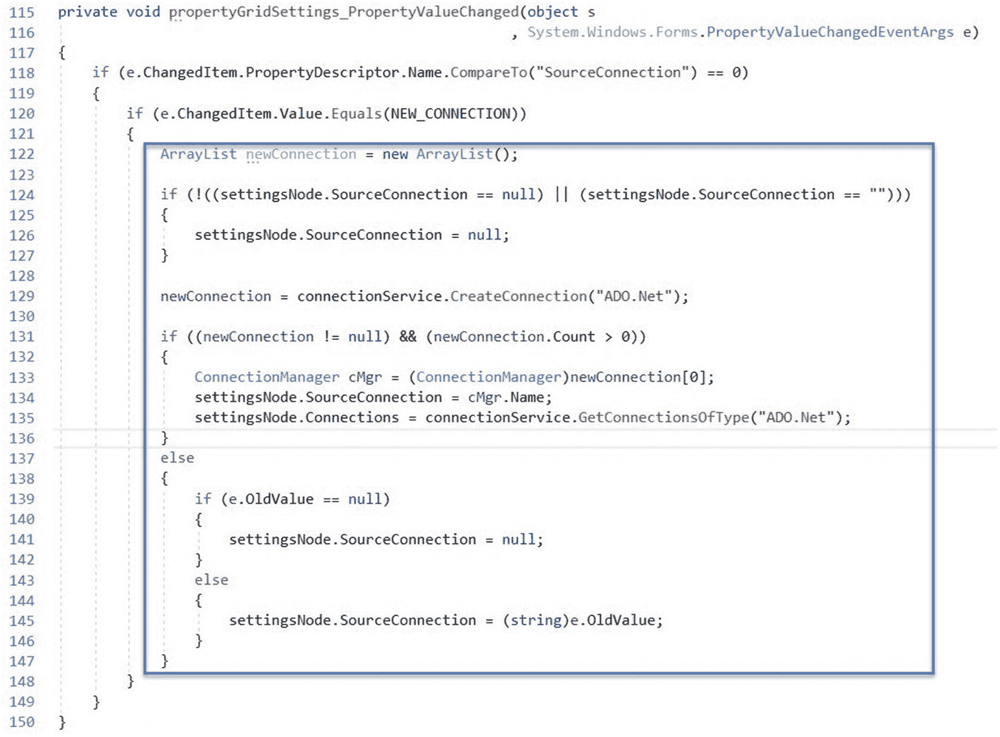

图 14-8

响应新建连接点击

在第 118 行，代码检查触发对 `propertyGridSettings_PropertyValueChanged` 方法调用的变化是否是对 `SourceConnection` 属性的更改。第 120 行检查开发人员是否点击了 `SourceConnection` 属性下拉列表中的“<新建连接>”项。如果开发人员点击了 `SourceConnection` 属性下拉列表中的“<新建连接>”项，则会在第 122 行声明一个名为 `newConnection` 的新 `ArrayList` 变量。

在第 124–127 行，当且仅当当前的 `settingsNode SourceConnection` 值*不*为 null 或空时，才将其设置为 null。

在第 129 行，创建一个新的 ADO.Net 连接管理器。创建新的 ADO.Net 连接管理器涉及：

*   创建一个新的通用 ADO.Net 连接管理器
*   将新的通用 ADO.Net 连接管理器添加到 SSIS 包的连接集合中
*   打开新的 ADO.Net 连接管理器的编辑器，以便 SSIS 开发人员可以配置该连接管理器

在第 131–136 行，如果 `newConnection ArrayList` 不为 null 且至少包含一个值，则将 `settingsNode SourceConnection` 值赋给这个新连接。`settingsView.Connections` 属性被重新加载以添加新的连接管理器。如果 `newConnection ArrayList` 为 null 或不包含任何值，则第 139–146 行的代码会将先前的值恢复为 `settingsNode SourceConnection` 值。

下一步是测试代码。

### 让我们测试一下！

在测试之前，让我们先定义几个用例：

*   用例 1：和之前一样，我们可以将执行目录包任务配置为使用先前在测试 SSIS 包中配置的 ADO.Net 连接管理器。我们可以在“设置”页面上将 `FolderName`、`ProjectName` 和 `PackageName` 属性配置为已部署到 SSIS 目录的 SSIS 包。

   断言：测试 SSIS 包调试执行成功，并且已部署到 SSIS 目录的 SSIS 包执行成功。

*   用例 2：我们可以通过点击“设置”页面 `SourceConnection` 属性下拉列表中的“<新建连接…>”来配置执行目录包任务使用一个*新的* ADO.Net 连接管理器。“配置新建 ADO.Net 连接”对话框将显示，允许开发人员配置新的 ADO.Net 连接管理器。与用例 1 类似，我们在“设置”页面上将 `FolderName`、`ProjectName` 和 `PackageName` 属性配置为已部署到 SSIS 目录的 SSIS 包。

   断言：一个新的 ADO.Net 连接管理器被添加到测试 SSIS 包中。测试 SSIS 包调试执行成功，并且已部署到 SSIS 目录的 SSIS 包执行成功。


### 用例 1

构建解决方案，然后打开测试 SSIS 项目。要测试用例 1，请向控制流中添加一个 `执行目录包任务`，打开编辑器，然后将任务配置为执行 SSIS 目录中的 SSIS 包，如图 14-9 所示：

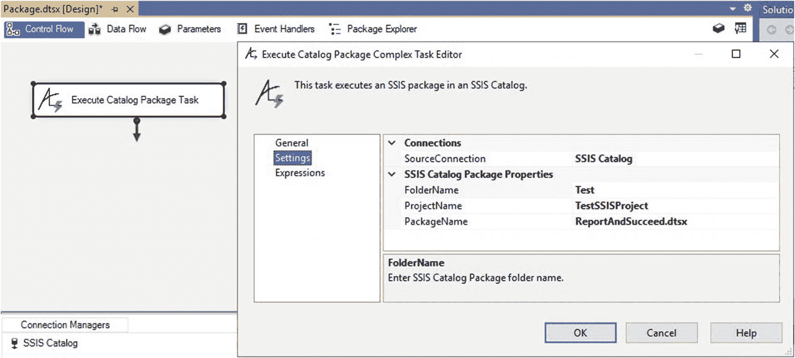

图 14-9：为用例 1 配置的 `执行目录包任务`

在调试器中执行测试 SSIS 包。如果一切按计划进行，测试 SSIS 包应该会成功，如图 14-10 所示：

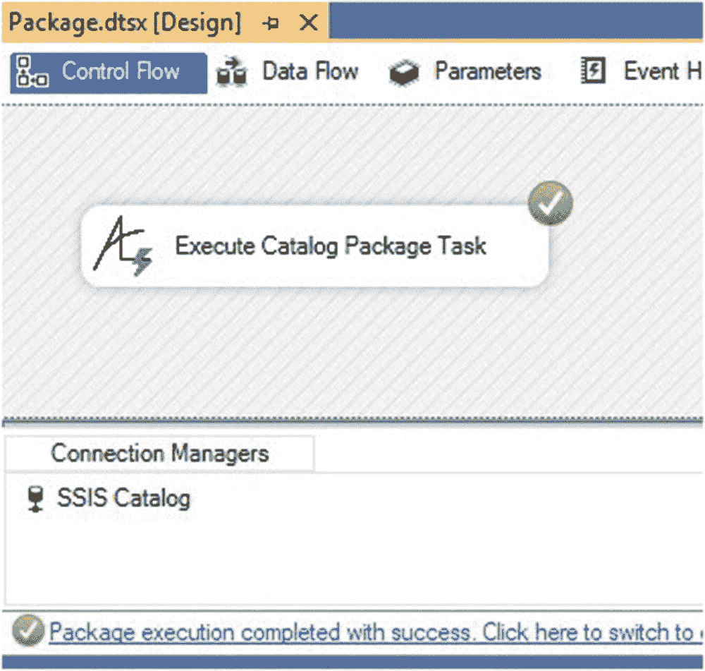

图 14-10：用例 1 测试 SSIS 包执行成功

检查 `SSIS 目录所有执行情况` 报告，确认包已在 SSIS 目录中执行，如图 14-11 所示：

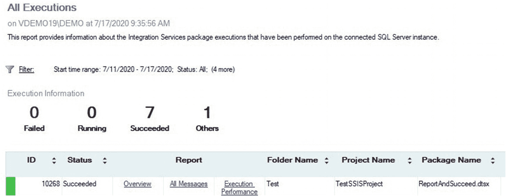

图 14-11：用例 1 配置包执行成功

成功。它的意义远不止于早餐时光。

### 用例 2

要测试用例 2，请向控制流中添加一个 `执行目录包任务`，打开编辑器，然后从 `SourceConnection` 属性下拉菜单中选择“<新建连接…>”，如图 14-12 所示：

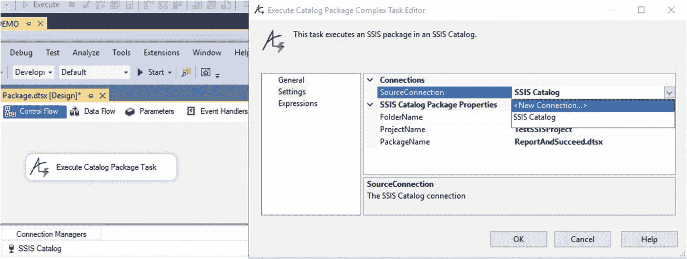

图 14-12：为用例 2 配置的 `执行目录包任务`

将创建一个新的 `ASO.Net` 连接管理器并显示在 SSIS 包的 `连接管理器` 窗格中，同时会显示“配置 ADO.NET 连接管理器”对话框，如图 14-13 所示：

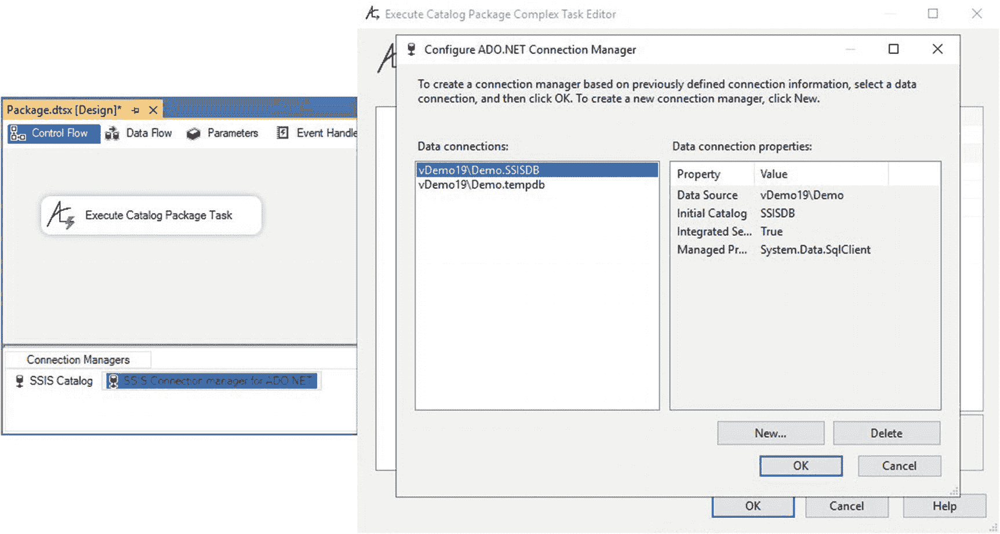

图 14-13：为用例 2 创建新连接

配置一个指向 `SSISDB` 数据库的 `ADO.Net` 连接，然后单击确定按钮。当在 `SourceConnection` 属性中选择了新连接时，编辑器将如图 14-14 所示：

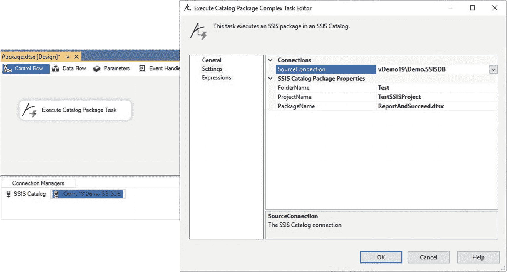

图 14-14：为用例 2 配置的新连接

单击确定按钮关闭编辑器。

在调试器中执行测试 SSIS 包。如果一切按计划进行，测试 SSIS 包应该会成功，如图 14-15 所示：

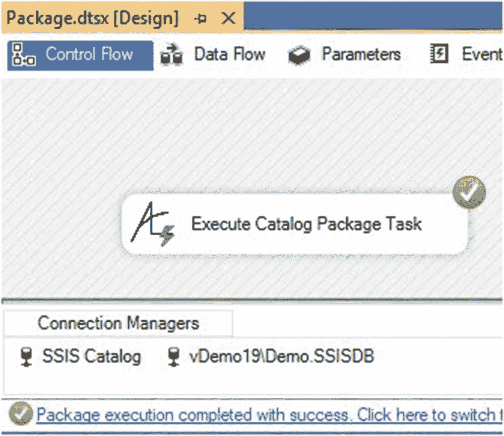

图 14-15：用例 2 测试 SSIS 包执行成功

检查 `SSIS 目录所有执行情况` 报告，确认包已在 SSIS 目录中执行，如图 14-16 所示：

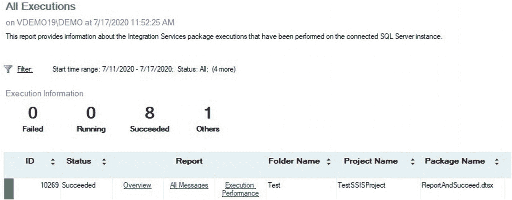

图 14-16：用例 2 配置包执行成功

### 结论

`新建连接` 选项使得构建 `设置视图 SourceConnection` 属性成为构建 `执行目录包任务` 复杂编辑器的复杂部分，这就是为什么作者将这个自定义任务项目的这部分单独列为一章的原因。

下一步是向 `设置视图` 添加更多属性。

现在是签入代码的绝佳时机。

