# 15. 实现 Use32bit、Synchronized 和 LoggingLevel 设置视图属性

在第 13 章和第 14 章中，我们实现了 `常规视图` 和 `设置视图`。在本章中，我们将实现额外的 `设置节点` 属性——`Use32bit`、`Synchronized` 和 `LoggingLevel`。添加 `SourceConnection` 属性的过程很紧张，因此我们本章首先添加一个直接且简单的属性实现：`Use32bit`。请注意，强度将会增加。

## 指定 32 位接口

SSIS 与供应商无关，这意味着 SSIS 可以连接到服务器上安装的几乎任何数据提供程序。如果 SSIS 能够连接到提供程序，它就可以通过该提供程序读写该提供程序提供接口的资源。

### 添加 Use32bit 属性

有些提供程序公开 32 位接口。少数提供程序*仅*公开 32 位接口。因此，SSIS 目录允许开发人员和操作员通过在执行时将“使用 32 位”布尔值设置为 true，以 32 位模式执行 SSIS 包。

要将 `Use32bit` 属性添加到 `设置节点`，我们首先将清单 15-1 中的代码添加到 `设置节点` 类：

```
[
Category("SSIS 包执行属性"),
Description("输入 SSIS 目录包 Use32bit 执行属性值。")
]
public bool Use32bit {
get { return _task.Use32bit; }
set { _task.Use32bit = value; }
}
清单 15-1：将 `Use32bit` 属性添加到 `设置节点`
```

添加后，`设置节点 Use32bit` 属性代码如图 15-1 所示：

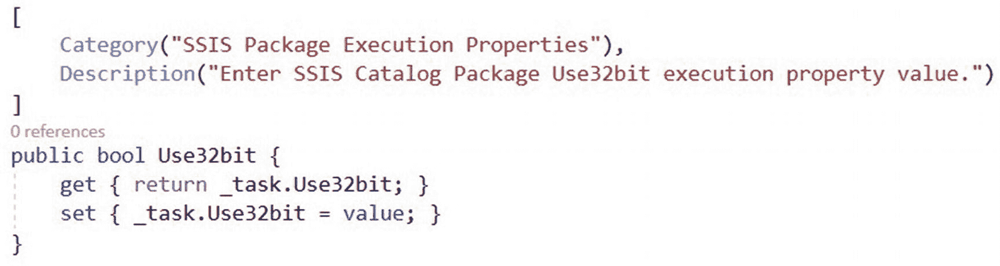

图 15-1：已实现的 `设置节点 Use32bit` 属性

下一步是更新 `执行目录包任务执行` 方法，以使用在 `Use32bit` 属性中设置的值。将 `catalogPackage.Execute(false, null);` 语句编辑为与清单 15-2 中的代码匹配：

```
catalogPackage.Execute(Use32bit, null);
清单 15-2：配置 `执行目录包任务执行` 方法以使用 `Use32bit` 属性
```

编辑后，`执行目录包任务执行` 方法如图 15-2 所示：

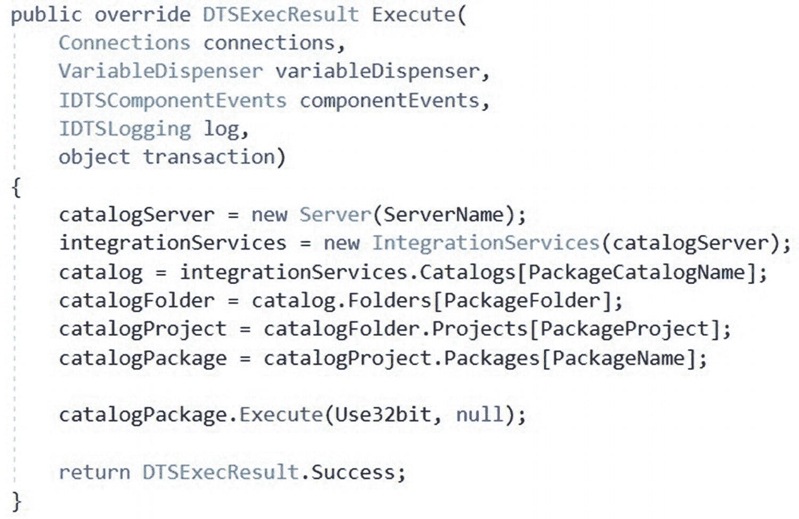

图 15-2：`执行目录包任务执行` 方法现在使用 `Use32bit` 属性

就是这样。`Use32bit` 属性已经实现。这并不那么困难，对吧？

### 测试 Use32bit

要测试 `Use32bit` 属性，请构建 `执行目录包任务` 解决方案，打开一个测试 SSIS 包，并将 `执行目录包任务` 配置为执行已部署到 SSIS 目录的 SSIS 包。将 `Use32bit` 属性设置为 True，如图 15-3 所示：

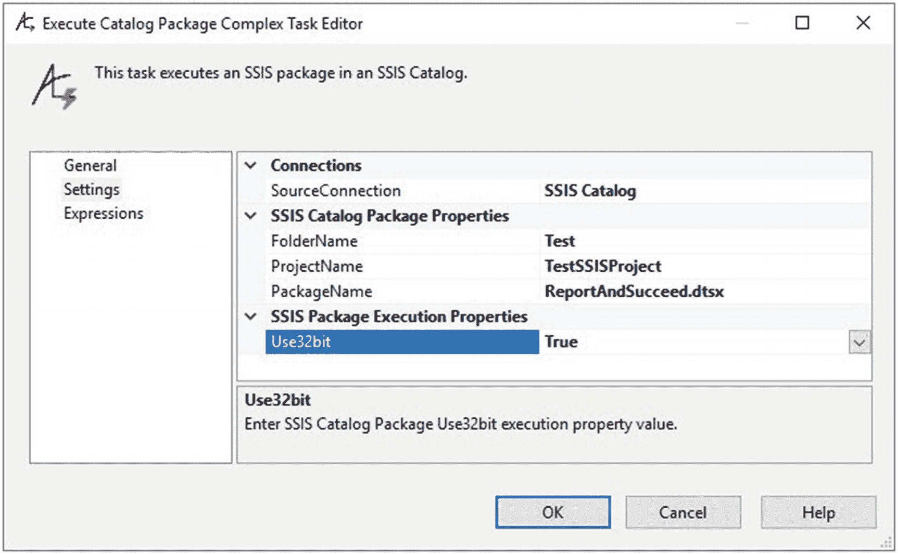

图 15-3：将 `Use32bit` 属性设置为 True

单击确定按钮，然后执行测试 SSIS 包。如果一切按计划进行，包执行将在 SSIS 目录中成功。检查是否设置了 `Use32bit` 属性的一种方法是执行清单 15-3 中的 T-SQL 查询：

```
Select folder_name
, project_name
, package_name
, use32bitruntime
From SSISDB.catalog.executions
Order by execution_id DESC
清单 15-3：检查是否设置了 `Use32bit`
```

执行清单 15-3 中的 T-SQL 会返回确认 `Use32bit` 属性有效的结果，如图 15-4 所示：

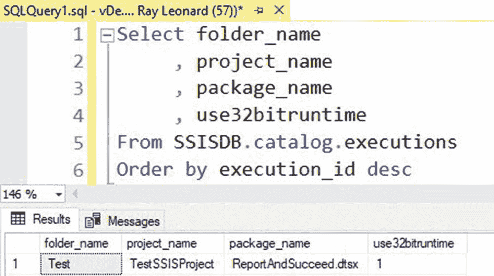

图 15-4：运行中的 `Use32bit` 属性

下一个属性是 `Synchronized`，其实现与 `Use32bit` 属性的实现一样简单。


## 添加同步属性

默认情况下，在 SSIS 目录中执行的 SSIS 包，其 **Synchronized**（同步）执行参数设置为 `false`。`false` 的 Synchronized 执行参数意味着 SSIS 目录执行引擎会查找并启动 SSIS 包，然后立即返回。SSIS 包可能会继续执行——持续数小时或数天——之后才失败。监控 SSIS 执行的人员必须检查 SSIS 包执行的状态，以确定执行实例的当前状态。一个监控 SSIS 包执行实例状态的好方法是，查看 SQL Server Management Studio (SSMS) 内置的 SSIS 目录“所有执行”和“概览”报告。

如果希望 SSIS 包执行过程保持“进程内”，或者持续显示为正在运行状态直到执行实例完成，可以将 **Synchronized** 执行参数设置为 `true`。为了将 **Synchronized** 属性添加到 `SettingsNode`，我们首先将清单 15-4 中的代码添加到 `SettingsNode` 类中：

```
[
Category("SSIS 包执行属性"),
Description("输入 SSIS 目录包 SYNCHRONIZED 执行参数值。")
]
public bool Synchronized {
get { return _task.Synchronized; }
set { _task.Synchronized = value; }
}
```
**清单 15-4** 将 Synchronized 属性添加到 SettingsNode

添加后，`SettingsNode Synchronized` 属性代码如图 15-5 所示：

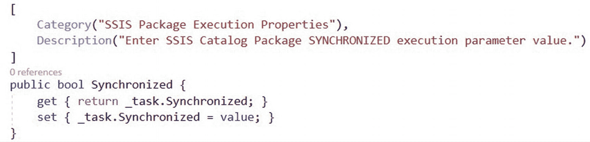

**图 15-5** 已实现的 SettingsNode Synchronized 属性

下一步是更新 `ExecuteCatalogPackageTask Execute` 方法，以使用 **Synchronized** 属性中设置的值。编辑 `Execute` 方法不像实现 `Use32bit` 属性那样简单直接；它稍微复杂一些。首先，我们需要查看 `ExecuteCatalogPackageTask Execute` 方法中的 `Execute` 重载。

### 检查 Execute() 重载

要查看 SSIS 包 `Execute` 方法的可用重载，请在 `ExecuteCatalogPackageTask` 代码中找到 `Execute` 方法。定位调用执行 SSIS 包的那行代码——即我们刚才在添加 `Use32bit` 属性时更新过的那一行。此时，该行代码为 `catalogPackage.Execute(Use32bit, null);`。选择左括号并再次键入一个左括号，以打开重载选项，如图 15-6 所示：

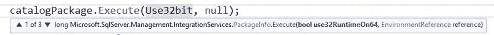

**图 15-6** 查看重载 1/3

通过查看重载列表，我们知道 `Execute` 函数有三个重载，因为重载工具提示显示“1/3”。我们还知道第一个重载接受两个参数：

*   一个名为 `use32RuntimeOn64` 的 `Boolean` 值——我们已提供了名为 `Use32bit` 的 `Boolean` 属性作为其值。
*   一个名为 `reference` 的 `EnvironmentReference` 值。

如果我们点击“1/3”右侧的“下箭头”，可以查看第二个重载（2/3），如图 15-7 所示：

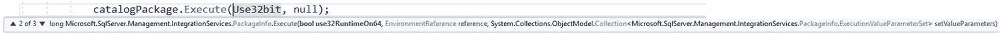

**图 15-7** 查看重载 2/3

查看第二个重载（2/3）的参数列表，我们知道此 `Execute` 重载接受三个参数，前两个参数与第一个重载（1/3）相同：

*   一个名为 `use32RuntimeOn64` 的 `Boolean` 值——我们已提供了名为 `Use32bit` 的 `Boolean` 属性作为其值。
*   一个名为 `reference` 的 `EnvironmentReference` 值。
*   一个或多个 `Microsoft.SqlServer.Management.IntegrationServices.PackageInfo.ExecutionValueParameterSet` 值的 `Collection`，名为 `setValueParameters`。

这第三个参数——名为 `setValueParameters` 的 `ExecutionValueParameterSet` 参数集合——将是存放我们现在正在编码的 `Synchronized` 属性值的参数。但首先，让我们看看第三个重载。

如果我们点击“2/3”右侧的“下箭头”，可以查看第三个重载（3/3），如图 15-8 所示：

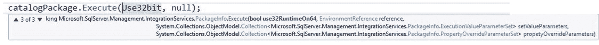

**图 15-8** 查看重载 3/3

查看第三个重载（3/3）的参数列表，我们知道此 `Execute` 重载接受四个参数，前三个参数与第二个重载（2/3）相同：

*   一个名为 `use32RuntimeOn64` 的 `Boolean` 值——我们已提供了名为 `Use32bit` 的 `Boolean` 属性作为其值。
*   一个名为 `reference` 的 `EnvironmentReference` 值。
*   一个或多个 `Microsoft.SqlServer.Management.IntegrationServices.PackageInfo.ExecutionValueParameterSet` 值的 `Collection`，名为 `setValueParameters`。
*   一个或多个 `Microsoft.SqlServer.Management.IntegrationServices.PackageInfo.PropertyOverrideParameterSet` 值的 `Collection`，名为 `propertyOverrideParameters`。

我们将在此版本的 `ExecuteCatalogPackageTask` 中使用第二个重载（2/3）。

添加 `ExecutionValueParameterSet` 有两个步骤：

1.  构建 `ExecutionValueParameterSet`。
2.  将 `ExecutionValueParameterSet` 添加到对 `package.Execute()` 的调用中。

### 构建 ExecutionValueParameterSet

`ExecutionValueParameterSet` 是 `Microsoft.SqlServer.Management.IntegrationServices.PackageInfo.ExecutionValueParameterSet` 类型的一个集合。第一步是创建一个函数来构建并返回 `ExecutionValueParameterSet`，使用清单 15-5 中的代码：

```
using System.Collections.ObjectModel;
.
.
.
private Collection<Microsoft.SqlServer.Management.IntegrationServices.PackageInfo.ExecutionValueParameterSet> returnExecutionValueParameterSet(Microsoft.SqlServer.Management.IntegrationServices.PackageInfo catalogPackage)
{
    // 初始化参数集合
    Collection<Microsoft.SqlServer.Management.IntegrationServices.PackageInfo.ExecutionValueParameterSet> executionValueParameterSet = new Collection<Microsoft.SqlServer.Management.IntegrationServices.PackageInfo.ExecutionValueParameterSet>();
    // 设置 SYNCHRONIZED 执行参数
    executionValueParameterSet.Add(new Microsoft.SqlServer.Management.IntegrationServices.PackageInfo.ExecutionValueParameterSet { ObjectType = 50, ParameterName = "SYNCHRONIZED", ParameterValue = Synchronized });
    return executionValueParameterSet;
}
```
**清单 15-5** 构建 returnExecutionValueParameterSet 函数

将 `using System.Collections.ObjectModel;` 指令添加到 `ExecuteCatalogPackageTask.cs` 文件头部，与其他 `using` 指令放在一起。

添加后，`returnExecutionValueParameterSet` 函数如图 15-9 所示：

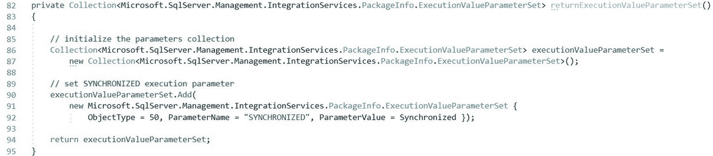

**图 15-9** returnExecutionValueParameterSet 函数

第 82 行声明 `returnExecutionValueParameterSet` 函数返回类型为 `Collection<Microsoft.SqlServer.Management.IntegrationServices.PackageInfo.ExecutionValueParameterSet>` 的值。

第 86-87 行创建了一个名为 `executionValueParameterSet` 的 `Collection<Microsoft.SqlServer.Management.IntegrationServices.PackageInfo.ExecutionValueParameterSet>` 类型的新变量。

第 90-92 行，初始化了一个新的 `Collection<Microsoft.SqlServer.Management.IntegrationServices.PackageInfo.ExecutionValueParameterSet>` 对象并将其添加到 `executionValueParameterSet` 集合中。

第 94 行，`executionValueParameterSet` 集合被返回给调用者，现在我们将注意力转向调用者。


### 调用 `returnExecutionValueParameterSet` 函数

回到 `ExecuteCatalogPackageTask Execute` 方法，用清单 15-6 中的代码覆盖 `catalogPackage.Execute(Use32bit, null);` 语句：

```
Collection executionValueParameterSet = returnExecutionValueParameterSet();
catalogPackage.Execute(Use32bit, null, executionValueParameterSet);
Listing 15-6
Updating package.Execute()
```

编辑完成后，`ExecuteCatalogPackageTask Execute` 方法末尾附近的代码如图 15-10 所示：

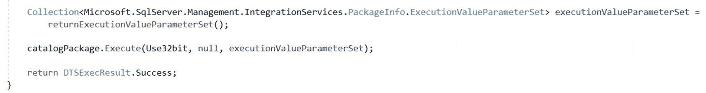

图 15-10
`Package.Execute()`，更新后用于配置和使用执行参数

下一步是向 `SettingsNode` 添加 `Synchronized` 属性。

### 向 `SettingsView` 添加 `Synchronized` 属性

要向 `SettingsNode` 添加 `Synchronized` 属性，首先将清单 15-7 中的代码添加到 `SettingsNode` 类：

```
[
Category("SSIS Package Execution Properties"),
Description("Enter SSIS Catalog Package SYNCHRONIZED execution parameter value.")
]
public bool Synchronized {
get { return _task.Synchronized; }
set { _task.Synchronized = value; }
}
Listing 15-7
Adding the Synchronized property to SettingsNode
```

添加后，`SettingsNode Synchronized` 属性代码如图 15-11 所示：

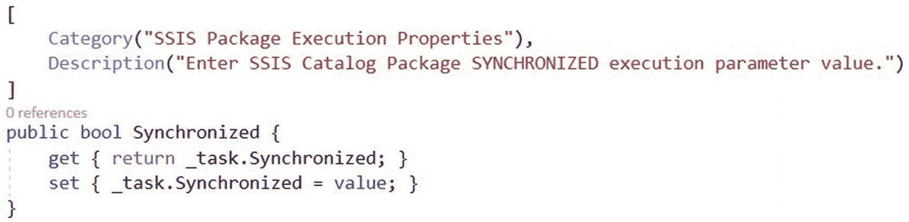

图 15-11
已实现的 `SettingsNode Synchronized` 属性

下一步是测试 `SettingsNode Synchronized` 属性。

### 测试 `Synchronized`

要测试 `Synchronized` 属性，构建 `ExecuteCatalogPackageTask` 解决方案，打开一个测试 SSIS 包，并将执行目录包任务配置为执行已部署到 SSIS 目录的 SSIS 包。将 `Synchronized` 属性设置为 True，如图 15-12 所示：

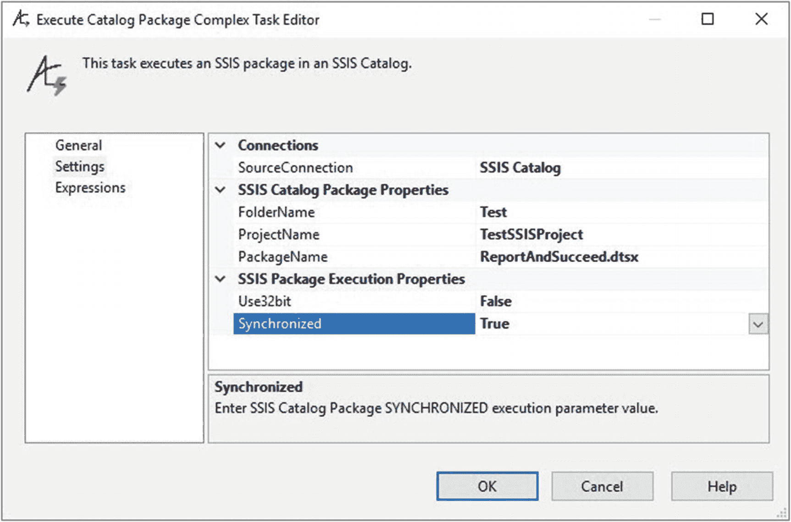

图 15-12
将 `Synchronized` 属性设置为 True

单击“确定”按钮，并在调试模式下执行测试 SSIS 包。如果一切按计划进行，测试 SSIS 包的调试执行将成功，如图 15-13 所示：

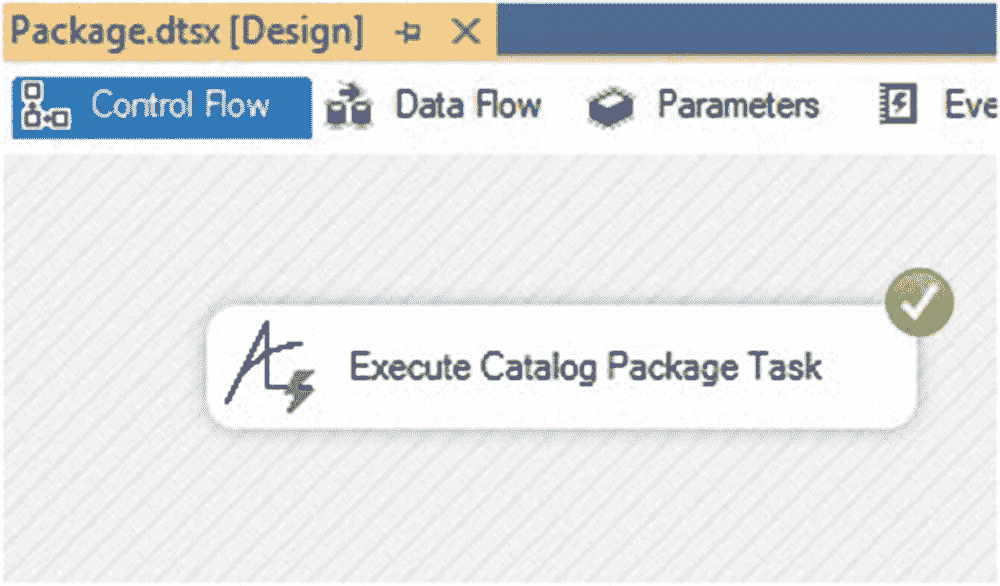

图 15-13
成功的测试执行

在 SSMS 的目录报告中，浏览到此测试执行的概览报告。在“使用的参数”子报告中，SYNCHRONIZED 执行参数应显示为 True，如图 15-14 所示：

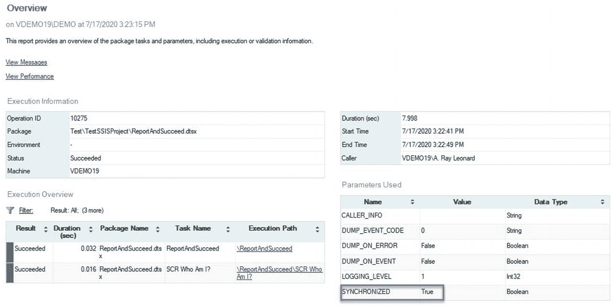

图 15-14
`Synchronized` 执行参数为 True

你是否注意到每个实现都变得越来越复杂？我们要实现的下一个属性是 Logging Level。

### 添加 `LoggingLevel` 属性

默认情况下，在 SSIS 目录中执行的 SSIS 包，其日志级别执行参数设置为 `1`（基本）。日志级别是一个日志级别名称值的枚举，映射到一个整数列表。你是否察觉到了什么？我察觉到了。我闻到另一个 `TypeConverter` 正在酝酿……

根据所使用的 SSIS 目录版本，SSIS 开发人员可能会遇到四到五个内置的日志级别设置，以及可能更多的自定义日志级别。日志级别可以配置为 SSIS 目录的默认日志级别，但几乎所有 SSIS 开发人员都认为将默认目录日志级别设置为“基本”是一种最佳实践。日志级别可以针对任何 SSIS 包执行进行更改。

### 构建 `LoggingLevel` TypeConverter

在向 `SettingsNode` 添加 `LoggingLevel` 属性之前，我们需要添加另一个 `TypeConverter` 类。`TypeConverter` 遵循一个模式，包括一个类型特定的函数 `GetSpecializedObject` 和三个重写函数：`GetStandardValues`、`GetStandardValuesExclusive` 和 `GetStandardValuesSupported`。首先将清单 15-8 中的代码添加到 `SettingsNode` 类：

```
internal class LoggingLevels : StringConverter
{
private object GetSpecializedObject(object contextInstance)
{
DTSLocalizableTypeDescriptor typeDescr = contextInstance as DTSLocalizableTypeDescriptor;
if (typeDescr == null)
{
return contextInstance;
}
return typeDescr.SelectedObject;
}
public override StandardValuesCollection GetStandardValues(ITypeDescriptorContext context)
{
object retrievalObject = GetSpecializedObject(context.Instance) as object;
return new StandardValuesCollection(getLoggingLevels(retrievalObject));
}
public override bool GetStandardValuesExclusive(ITypeDescriptorContext context)
{
return true;
}
public override bool GetStandardValuesSupported(ITypeDescriptorContext context)
{
return true;
}
}
Listing 15-8
Adding the LoggingLevel TypeConverter (StringConverter)
```

添加后，`SettingsNode LoggingLevel` `StringConverter` 代码如图 15-15 所示：

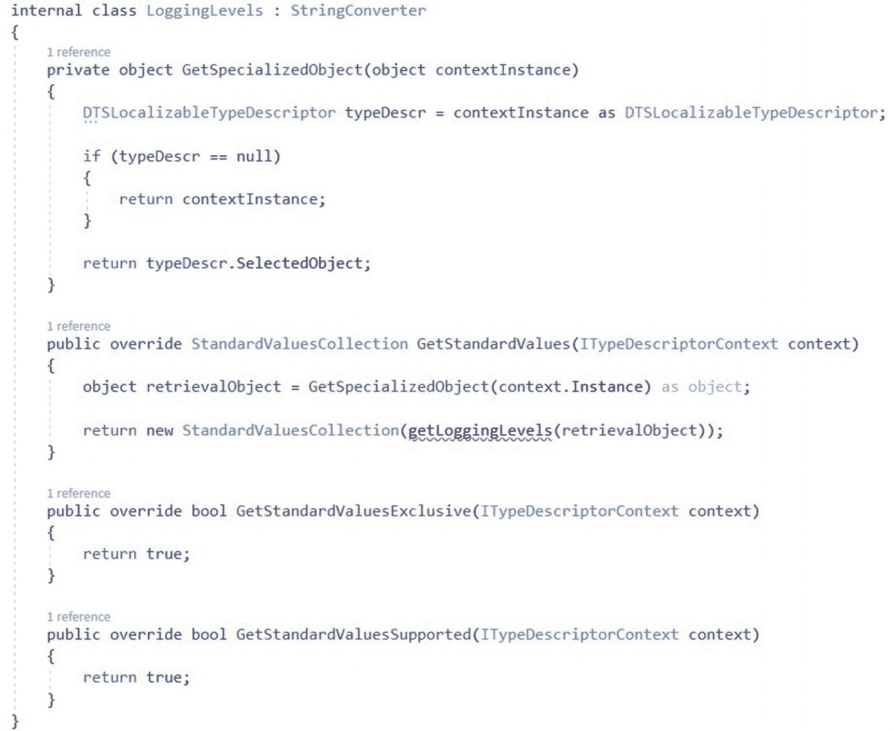

图 15-15
`LoggingLevels` `StringConverter` 类

所有 SSIS 目录版本都提供四种日志级别：
*   无 (0)
*   基本 (1)
*   性能 (2)
*   详细 (3)

在所有版本的 SSIS 目录中，基本 (1) 是默认日志级别。通过添加清单 15-9 中的 `getLoggingLevels` 函数代码来完成 `LoggingLevels StringConverter` 类：

```
private ArrayList getLoggingLevels(object retrievalObject)
{
ArrayList logLevelsArray = new ArrayList();
logLevelsArray.Add("None");
logLevelsArray.Add("Basic");
logLevelsArray.Add("Performance");
logLevelsArray.Add("Verbose");
return logLevelsArray;
}
Listing 15-9
Adding the getLoggingLevels function
```


### 使用 LoggingLevel 扩展 ExecutionValueParameterSet

正如我们在添加 `Synchronized` 执行参数时提到的，`ExecutionValueParameterSet` 是 `Microsoft.SqlServer.Management.IntegrationServices.PackageInfo.ExecutionValuearameterSet` 类型的集合。与 `Synchronized` 执行参数类似，`LoggingLevel` 也是一个执行参数。

在将 `LoggingLevel` 整数值添加到执行参数集合之前，必须使用清单 15-10 中的代码对其进行解码：

```
private int decodeLoggingLevel(string loggingLevel)
{
    int ret = 1;
    switch (loggingLevel)
    {
        default:
            break;
        case "None":
            ret = 0;
            break;
        case "Performance":
            ret = 2;
            break;
        case "Verbose":
            ret = 3;
            break;
    }
    return ret;
}
清单 15-10
添加 DecodeLoggingLevel 函数
```

将 `decodeLoggingLevel` 函数添加到 `ExecuteCatalogPackageTask` 类后，代码如图 15-16 所示：

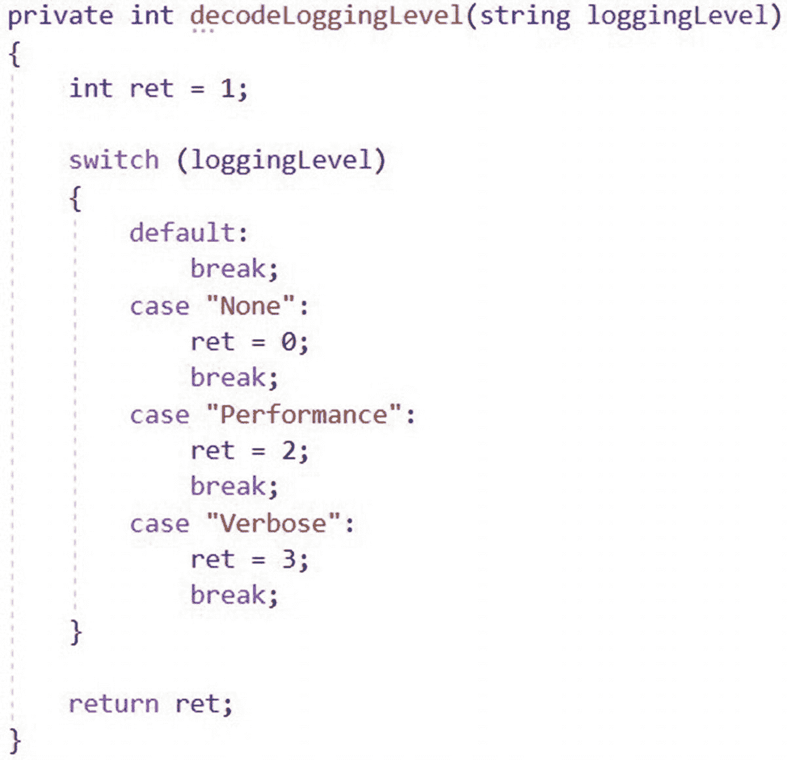
图 15-16
`decodeLoggingLevel` 函数

要将 `LoggingLevel` 值添加到 `returnExecutionValueParameterSet` 函数，请编辑该函数以匹配清单 15-11 中的代码：

```
private Collection returnExecutionValueParameterSet(
    Microsoft.SqlServer.Management.IntegrationServices.PackageInfo catalogPackage)
{
    // 初始化参数集合
    Collection executionValueParameterSet = new Collection();
    // 设置 SYNCHRONIZED 执行参数
    executionValueParameterSet.Add(new Microsoft.SqlServer.Management.IntegrationServices.PackageInfo.ExecutionValueParameterSet { ObjectType = 50, ParameterName = "SYNCHRONIZED", ParameterValue = Synchronized });
    // 设置 LOGGING_LEVEL 执行参数
    int LoggingLevelValue = decodeLoggingLevel(LoggingLevel);
    executionValueParameterSet.Add(new Microsoft.SqlServer.Management.IntegrationServices.PackageInfo.ExecutionValueParameterSet { ObjectType = 50, ParameterName = "LOGGING_LEVEL", ParameterValue = LoggingLevelValue });
    return executionValueParameterSet;
}
清单 15-11
编辑 returnExecutionValueParameterSet 函数
```

添加完成后，`returnExecutionValueParameterSet` 函数如图 15-17 所示：

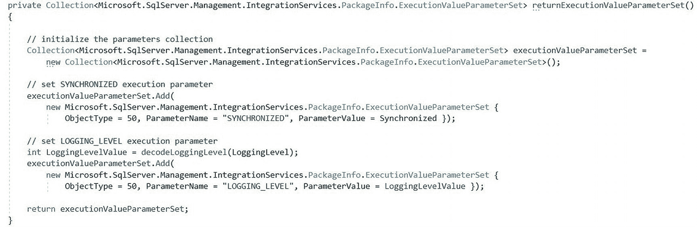
图 15-17
编辑后的 `returnExecutionValueParameterSet` 函数

下一步是添加 `SettingsView.LoggingLevel` 属性。

### 向 SettingsView 添加 LoggingLevel 属性

要将 `LoggingLevel` 属性添加到 `SettingsNode`，首先将清单 15-12 中的代码添加到 `SettingsNode` 类：

```
[
Category("SSIS 包执行属性"),
Description("输入 SSIS 目录包 LOGGING_LEVEL 执行参数值。"),
TypeConverter(typeof(LoggingLevels))
]
public string LoggingLevel {
    get { return _task.LoggingLevel; }
    set { _task.LoggingLevel = value; }
}
清单 15-12
向 SettingsNode 添加 LoggingLevel 属性
```

添加完成后，`SettingsNode.LoggingLevel` 属性代码如图 15-18 所示：

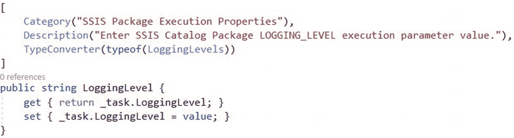
图 15-18
已实现的 `SettingsNode.LoggingLevel` 属性

下一步是测试 `SettingsNode.LoggingLevel` 属性。

### 测试 LoggingLevel

要测试 `LoggingLevel` 属性，请生成 `ExecuteCatalogPackageTask` 解决方案，打开一个测试 SSIS 包，并配置“执行目录包任务”以执行已部署到 SSIS 目录的 SSIS 包。将 `LoggingLevel` 属性设置为 `Verbose`，如图 15-19 所示：

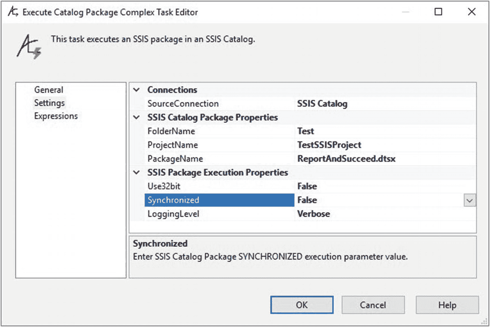
图 15-19
将 `LoggingLevel` 属性设置为 `Verbose`

单击“确定”按钮并在调试模式下执行测试 SSIS 包。如果一切按计划进行，测试 SSIS 包的调试执行将成功，如图 15-20 所示：

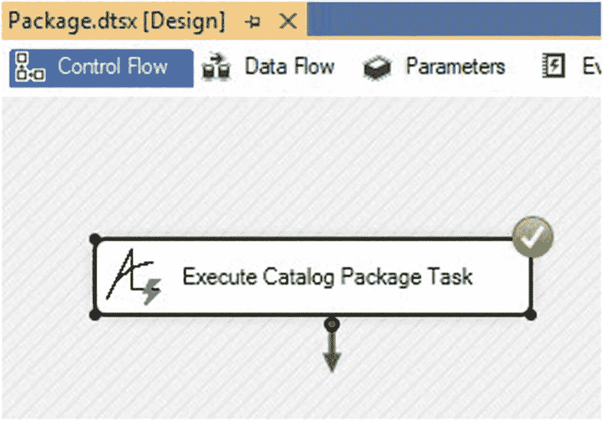
图 15-20
成功的测试执行

在 SSMS 的目录报告中，浏览到此测试执行的概览报告。“使用的参数”子报告中的 `LOGGING_LEVEL` 执行参数应指示 `LoggingLevel` 执行参数设置为 `3` (`Verbose`)，如图 15-21 所示：

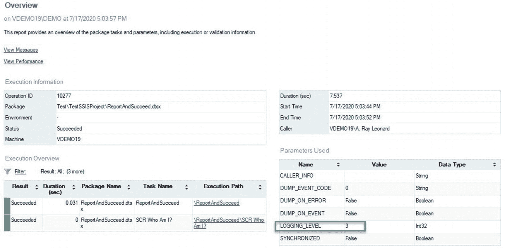
图 15-21
`LoggingLevel` 执行参数设置为 `3` (`Verbose`)

下一个要实现的属性是 `Reference`，这是下一章的主题。

## 总结

在本章中，我们实现了 `SettingsView` 的 `Use32bit`、`Synchronized` 和 `LoggingLevel` 属性。

现在是签入代码的好时机。

