# 16. 重构 SourceConnection

本章的目标是重构与 `SourceConnection` 属性相关的 `ExecuteCatalogPackageTask` 方法。目标包括：

*   从 SSIS 2019 降级到 SSIS 2017，以便在 Azure 平台上运行。
*   重构连接标识，以支持“服务器 ➤ Integration Services ➤ SSIS 目录 ➤ 文件夹 ➤ 项目 ➤ 包”的层次结构。
*   重构 `SettingsView.SourceConnection` 属性。
*   识别“服务器 ➤ Integration Services ➤ SSIS 目录 ➤ 文件夹 ➤ 项目 ➤ 包”层次结构中的目录、文件夹、项目和包对象。

我们还为了另外两个目标重构了“执行目录包任务”：

1.  使用表达式——这是本书此版本的主要目标之一。
2.  在 Azure-SSIS 集成运行时中执行“执行目录包任务”。


## 思考 Azure-SSIS

在撰写本文时（2020 年 10 月），Azure-SSIS 尚不支持 SSIS 2019。它支持 SSIS 2017，因此我们必须将任务和 Visual Studio 解决方案降级，以作为 SSIS 2017 自定义任务运行。Azure-SSIS 未来很可能会支持 SSIS 2019（我无法得知，也无法影响微软内部的决策和优先级）。

我建议你将开发工作迁移到配置了 Microsoft SQL Server 2017 且未配置 Microsoft SQL Server 2019 的机器上，以避免与 Microsoft .Net Framework 中的程序集发生冲突。

首先，通过展开解决方案资源管理器中的“引用”虚拟文件夹来更新 `ExecuteCatalogPackageTask` 项目的引用，如图 16-1 所示：
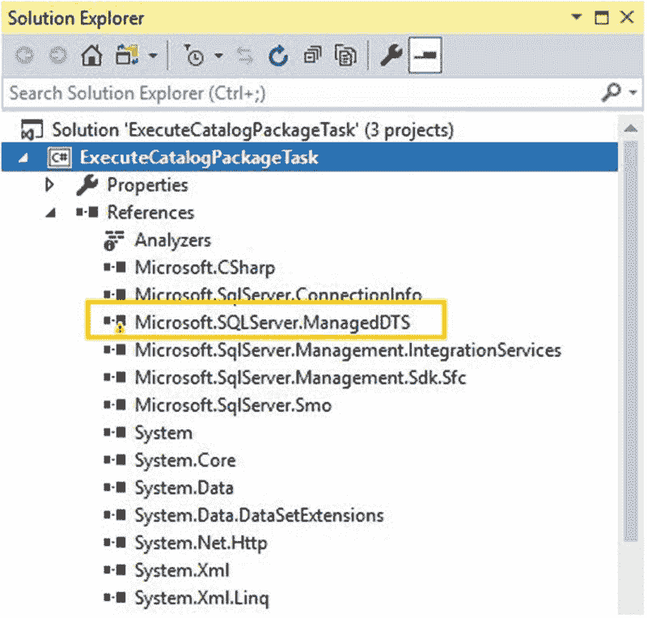
图 16-1：`ExecuteCatalogPackageTask` 引用

对某些程序集（例如图 16-1 中概述的 `Micrsoft.SQLServer.ManagedDTS` 程序集）的引用可能会显示警告图标。警告图标表示该程序集存在问题。此问题在于，`Micrsoft.SQLServer.ManagedDTS` 程序集的 SSIS 2019 版本未在仅安装了 SQL Server 2017 的开发服务器上注册。

必须特别注意，你的开发服务器配置可能与我使用的开发服务器配置不同。具体情况可能有所差异。

单击对 `Micrsoft.SQLServer.ManagedDTS` 程序集的引用，然后按 `F4` 键显示其属性，如图 16-2 所示：
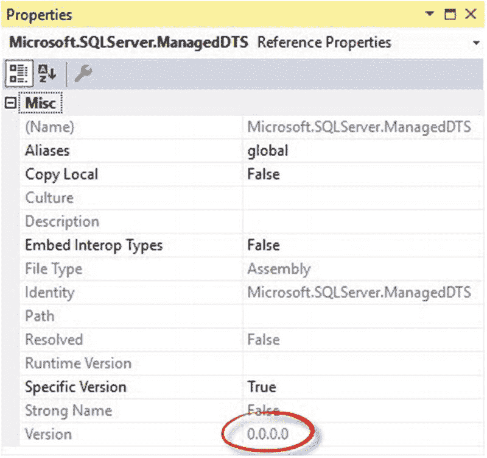
图 16-2：`Micrsoft.SQLServer.ManagedDTS` 程序集属性

请注意，`Micrsoft.SQLServer.ManagedDTS` 程序集的 Version 属性显示值为 "`0.0.0.0`"，因为在此开发服务器上找不到更高版本的 `Micrsoft.SQLServer.ManagedDTS` 程序集。

通过右键单击该程序集，然后单击“删除”，从 `ExecuteCatalogPackageTask` 引用集合中删除 `Micrsoft.SQLServer.ManagedDTS` 程序集，如图 16-3 所示：
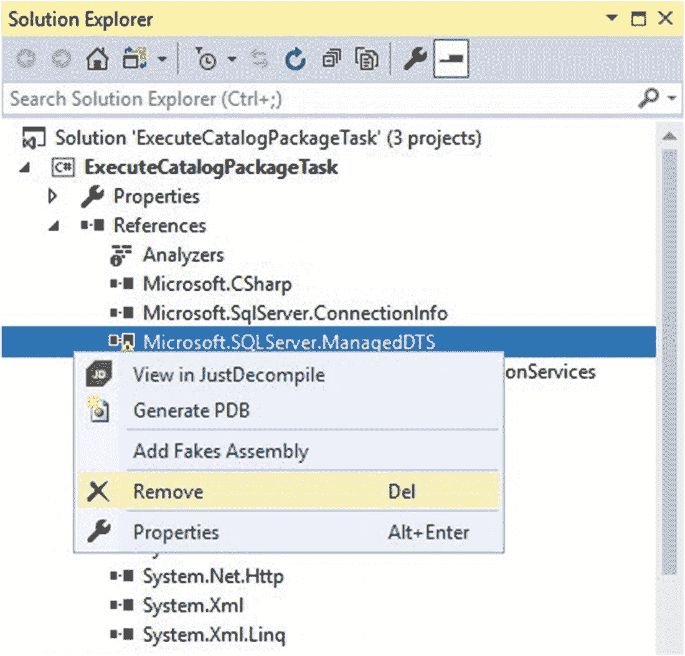
图 16-3：删除当前版本的 `Micrsoft.SQLServer.ManagedDTS` 程序集

与之前一样，右键单击“引用”虚拟文件夹，然后单击“添加引用”以添加新引用（或者，在此例中，添加一个新版本的引用），如图 16-4 所示：
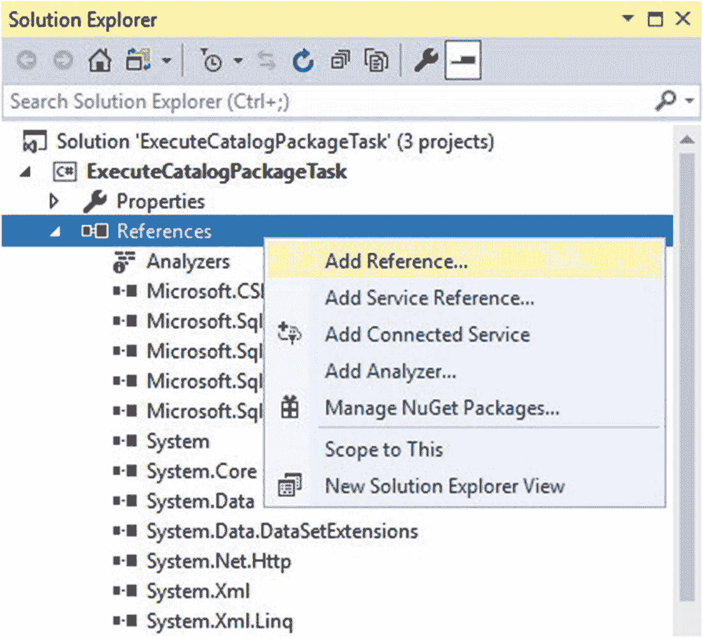
图 16-4：添加——实际上是替换——一个新引用

展开“程序集”并选择“扩展”。在程序集列表中导航到 `Micrsoft.SQLServer.ManagedDTS` 程序集，并选中 `Micrsoft.SQLServer.ManagedDTS` 程序集，如图 16-5 所示：
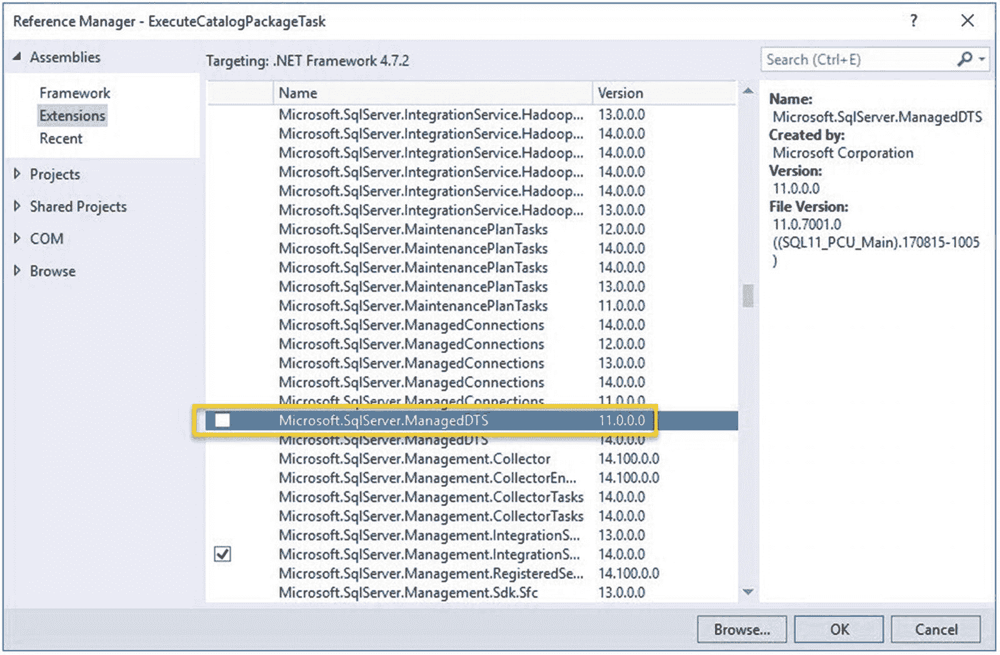
图 16-5：选择 `Micrsoft.SQLServer.ManagedDTS`

请非常仔细地注意“引用管理器”右侧窗格中的“版本”列和详细信息。SSIS 2017 是版本 14。所选 `Micrsoft.SQLServer.ManagedDTS` 版本是 11.0.0.0——即版本 11。版本 11 对应的是 SSIS 2012。

单击“浏览”按钮并导航到程序集文件的位置。在我的服务器上，位置是 `C:\Windows\Microsoft.NET\assembly\GAC_MSIL\Microsoft.SqlServer.ManagedDTS\v4.0_14.0.0.0__89845dcd8080cc91`。请注意 `Micrsoft.SQLServer.ManagedDTS` 程序集的版本是 `v4.0_14.0.0.0__89845dcd8080cc91`。我们知道版本是因为包含 `Micrsoft.SQLServer.ManagedDTS` 程序集的文件夹被命名为 `v4.0_14.0.0.0__89845dcd8080cc91`，如图 16-6 所示：
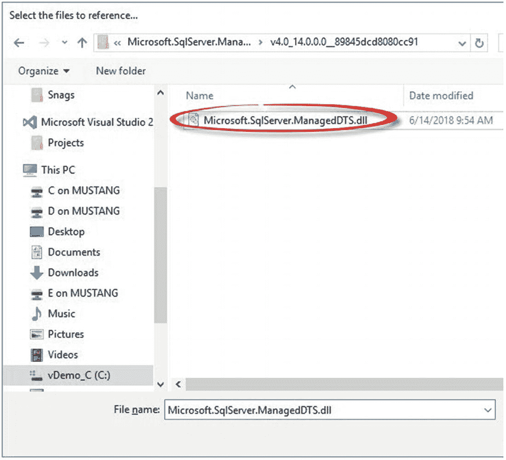
图 16-6：选择 SSIS 2017 版本的 `Micrsoft.SQLServer.ManagedDTS` 程序集

添加对 `Micrsoft.SQLServer.ManagedDTS` 程序集的引用，并查看属性以确认是 SSIS 2017（版本 14），如图 16-7 所示：
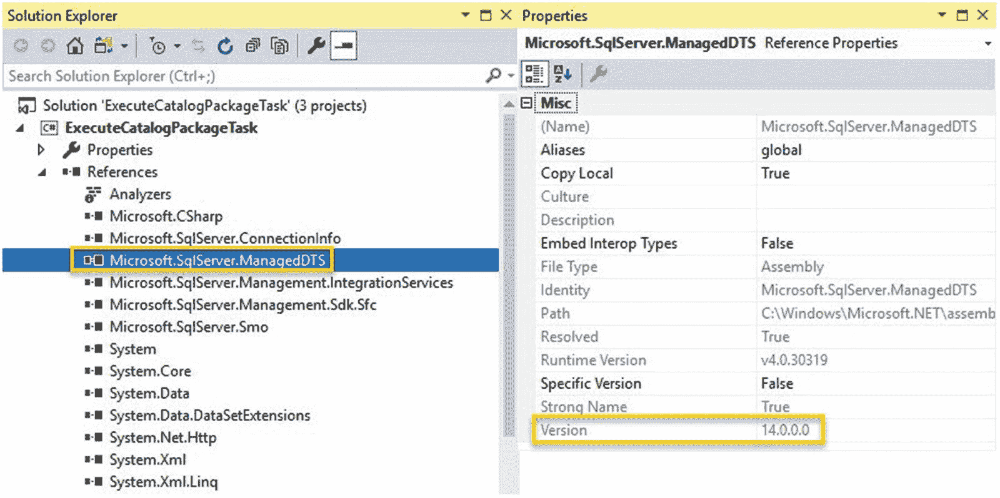
图 16-7：`Micrsoft.SQLServer.ManagedDTS` 程序集的 SSIS 2017 版本

对 *`ExecuteCatalogPackageTask`* 和 *`ExecuteCatalogPackageTaskComplexUI`* 两个项目中的每一个引用的每个版本重复此过程，验证其版本，如图 16-8 所示：
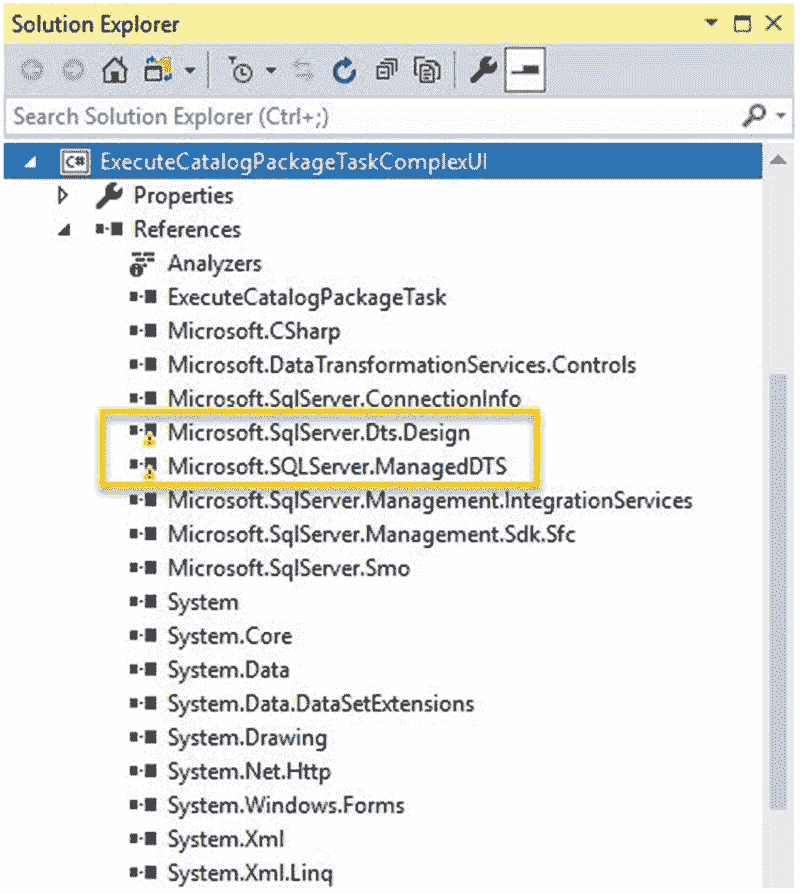
图 16-8：重复此过程

引用降级完成后，打开 `ExecuteCatalogPackageTask` 项目的 `ExecuteCatalogPackageTask.cs` 文件。更新 `ExecuteCatalogPackageTask` 类的 `DtsTask` 装饰中的 `TaskType` 属性，将 `TaskType` 从 `DTS150` 设置为 `DTS140`，如图 16-9 所示：
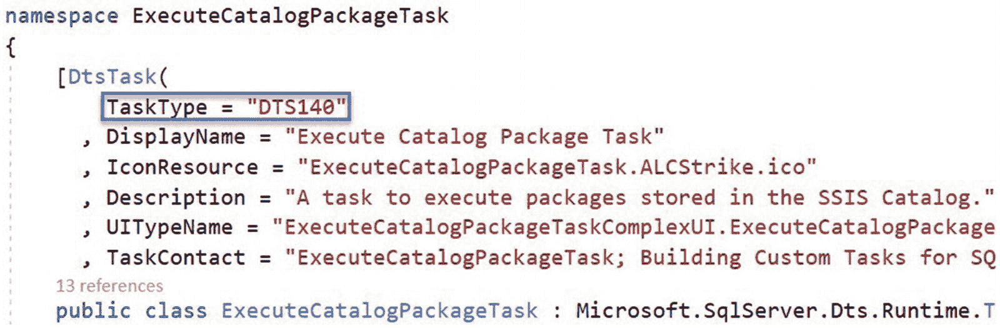
图 16-9：更新 `TaskType` 属性

`ExecuteCatalogPackageTask` 解决方案已降级完成，`ExecuteCatalogPackageTask` 现已为 Azure-SSIS 做好准备。


## 重构连接识别

### 添加连接属性
连接管理器识别至关重要——尤其是在连接字符串属性被动态管理或在执行时被覆盖的情况下。重构连接识别的第一步是使用清单 16-1 中的代码，向 `ExecuteCatalogPackageTask` 代码添加与连接相关的属性：

```csharp
public Connections Connections;
public string ConnectionManagerId { get; set; } = String.Empty;
public int ConnectionManagerIndex { get; set; } = -1;
// Listing 16-1
// 向 ExecuteCatalogPackageTask 类添加 Connections、ConnectionManagerIndex 和 ConnectionManagerId
```

添加后，代码如图 16-10 所示：

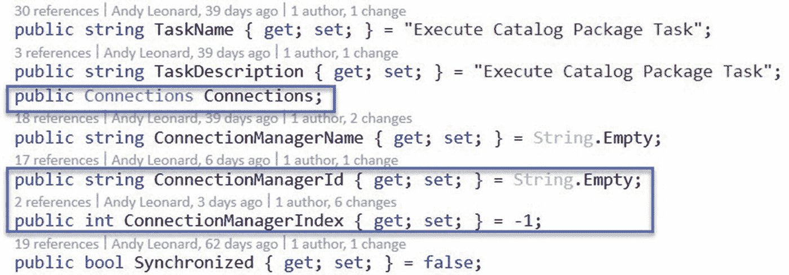

*图 16-10：已添加到 ExecuteCatalogPackageTask 类的 Connections、ConnectionManagerId 和 ConnectionManagerIndex*

### 初始化 Connections 变量
通过向 `ExecuteCatalogPackageTask.InitializeTask` 方法添加清单 16-2 中的代码来初始化 `Connections` 变量：

```csharp
// init Connections
Connections = connections;
// Listing 16-2
// 初始化 Connections
```

添加后，`ExecuteCatalogPackageTask.InitializeTask` 方法如图 16-11 所示：

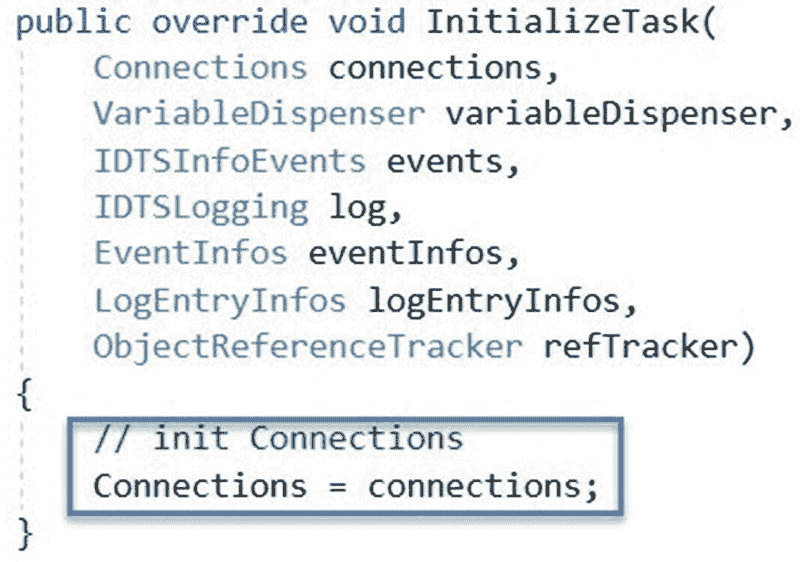

*图 16-11：更新后的 ExecuteCatalogPackageTask.InitializeTask 方法*

### 创建 returnConnectionManagerIndex 方法
使用清单 16-3 中的代码创建 `returnConnectionManagerIndex` 方法，来初始化 `ConnectionManagerIndex` 属性值：

```csharp
private int returnConnectionManagerIndex(Connections connections
, string connectionManagerName)
{
    int ret = -1;
    try
    {
        ConnectionManagerId = GetConnectionID(connections, ConnectionManagerName);
        Microsoft.SqlServer.Dts.Runtime.ConnectionManager connectionManager = connections[ConnectionManagerId];
        ConnectionManagerName = connectionManager.Name;
        if (connectionManager != null)
        {
            for (int i = 0; i <= connections.Count; i++)
            {
                if (connections[i].Name == connectionManager.Name)
                {
                    ret = i;
                    break;
                }
            }
        }
    }
    catch (Exception ex)
    {
        string message = "Unable to locate connection manager: " + ConnectionManagerName;
        throw new Exception(message, ex.InnerException);
    }
    return ret;
}
// Listing 16-3
// returnConnectionManagerIndex 方法
```

添加后，`returnConnectionManagerIndex` 方法如图 16-12 所示：

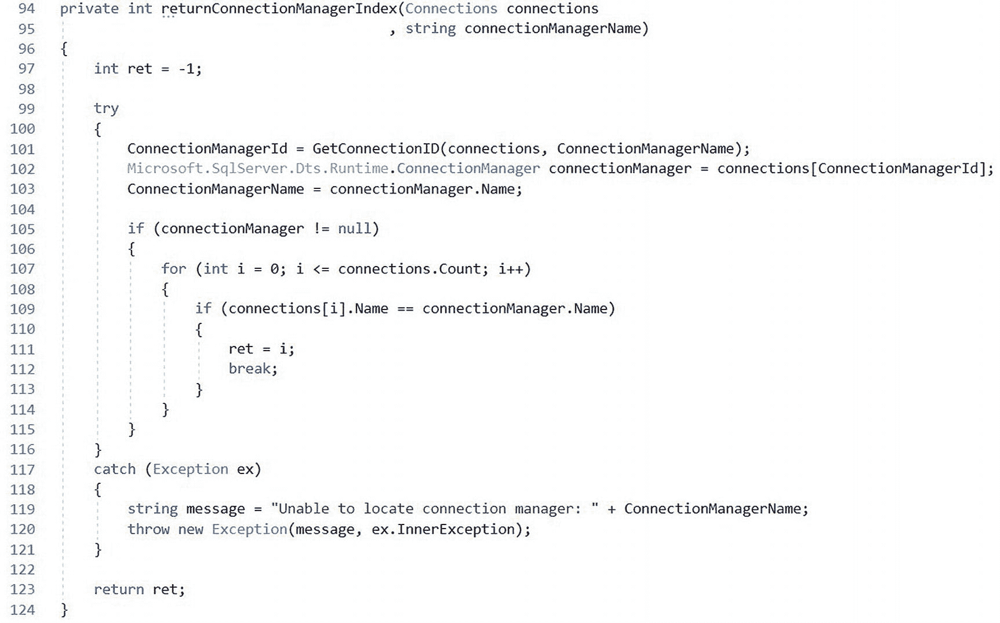

*图 16-12：returnConnectionManagerIndex 方法*

检查图 16-12 所示的代码，在第 97 行声明并初始化了一个名为 `ret` 的 `int` 类型返回变量。一个 `try`-`catch` 块跨越第 99 至 121 行，随后在第 123 行，`ret` 变量的值从 `returnConnectionManagerIndex` 方法中返回。在第 101 行，代码尝试通过调用 `Microsoft.SqlServer.Dts.Runtime.Task` 对象方法中包含的 `GetConnectionID` 方法来设置 `ExecuteCatalogPackageTask.ConnectionManagerId` 字符串类型属性的值。在第 102 行，声明并初始化了一个名为 `connectionManager` 的变量（类型为 `Microsoft.SqlServer.Dts.Runtime.ConnectionManager`），使用 `ConnectionManagerId` 属性的值来标识 `connections` 集合的一个成员。在第 103 行，使用 `connectionManager.Name` 将 `ConnectionManagerName` 属性的值设置（或重置）为 `connectionManager` 对象的名称。一个 `if` 条件始于第 105 行，用于验证 `connectionManager` 对象是否不为 `null`。如果 `connectionManager` 对象不为 `null`，则从第 107 行开始一个 `for` 循环。该 `for` 循环对 `connections` 的数量进行迭代。在第 109 行，一个 `if` 条件使用迭代器 `i` 将当前正在迭代的连接的 `Name` 属性值——`connection(i).Name`——与 `connectionManager.Name` 属性的值进行比较。如果 `connection(i).Name` 的值等于 `connectionManager.Name` 属性的值，则将 `ret` 变量的值设置为迭代器 `i` 的当前值。

### 设置 ConnectionManagerIndex 属性
要设置 `ConnectionManagerIndex` 属性的值，请使用清单 16-4 中的代码，在 `ExecuteCatalogPackageTask.Execute` 方法中添加对 `returnConnectionManagerIndex` 方法的调用：

```csharp
ConnectionManagerIndex = returnConnectionManagerIndex(connections, ConnectionManagerName);
// Listing 16-4
// 调用 returnConnectionManagerIndex 方法
```

添加后，代码如图 16-13 所示：

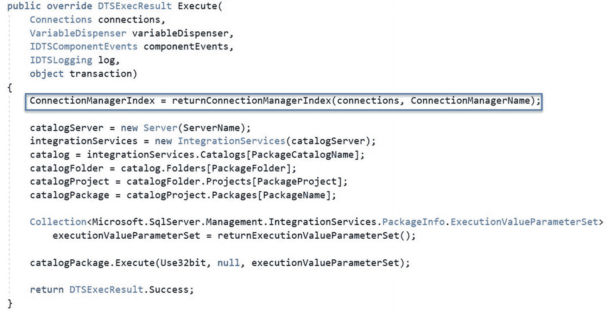

*图 16-13：在 ExecuteCatalogPackageTask.Execute 方法中调用 returnConnectionManagerIndex*

以这种方式设置 `ConnectionManagerIndex` 属性值，支持通过表达式进行属性管理，我们将在后面介绍。


## 重构 `SettingsView.SourceConnection` 属性

由于连接管理器属性可能在执行时被覆盖，因此连接管理器的标识至关重要。首先开始重构 `SettingsView.SourceConnection` 属性，用代码清单 16-5 中的代码替换 `SettingsView` 中声明的 `IDtsConnectionService` 类型变量 `connectionService`：

```csharp
protected IDtsConnectionService ConnectionService { get; set; }
代码清单 16-5
用 ConnectionService 属性替换 connectionService 变量
```

替换 `connectionService` 变量后，代码如图 16-14 所示：

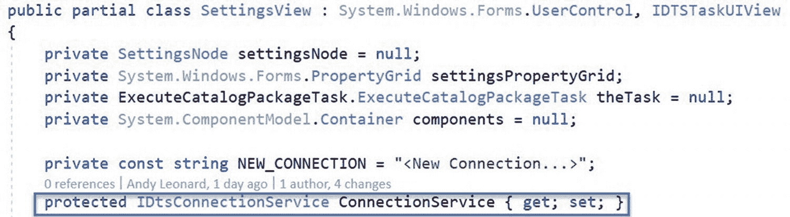
图 16-14
更新为 ConnectionService 属性

将 `connectionService` 变量更改为 `ConnectionService` 属性会导致 `SettingsView` 类中出现错误。在 `SettingsView.OnInitialize` 方法中修复第一个错误，使用代码清单 16-6 中的代码更新行 `connectionService = (IDtsConnectionService)connections;`：

```csharp
ConnectionService = (IDtsConnectionService)connections;
代码清单 16-6
更新 SettingsView.OnInitialize
```

更新后，代码如图 16-15 所示：

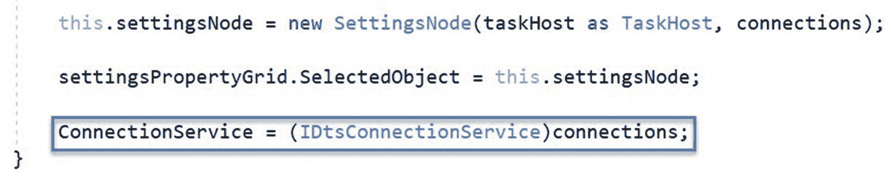
图 16-15
`ConnectionService` 已更新

`SettingsView.propertyGridSettings_PropertyValueChanged` 方法中有两个位置需要更新，使用代码清单 16-7 中所示的代码：

```csharp
newConnection = ConnectionService.CreateConnection("ADO.Net");
.
.
.
settingsNode.Connections = ConnectionService.GetConnectionsOfType("ADO.Net");
代码清单 16-7
更新 SettingsView.propertyGridSettings_PropertyValueChanged
```

更新后，代码如图 16-16 所示：

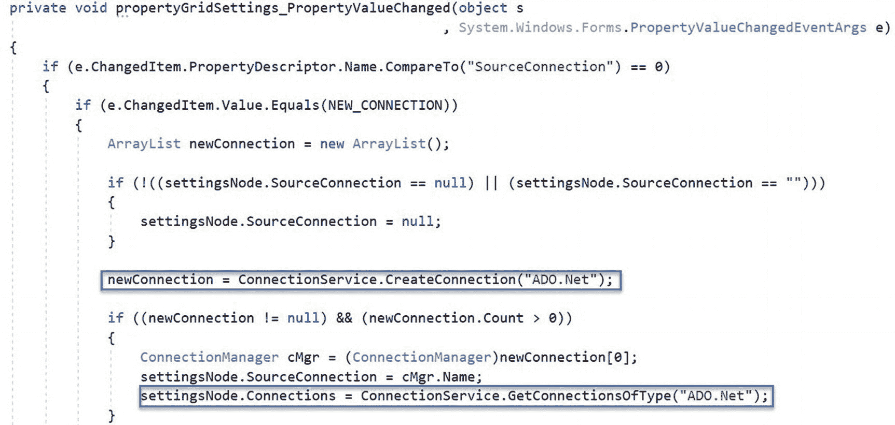
图 16-16
`SettingsView.propertyGridSettings_PropertyValueChanged` 已更新

继续更新 `SettingsView.propertyGridSettings_PropertyValueChanged` 方法，将代码清单 16-8 中的代码添加到 `if` 条件 `if ((newConnection != null) && (newConnection.Count > 0))` 中：

```csharp
theTask.ServerName = returnSelectedConnectionManagerDataSourceValue(settingsNode.SourceConnection);
theTask.ConnectionManagerName = settingsNode.SourceConnection;
theTask.ConnectionManagerId = theTask.GetConnectionID(theTask.Connections, theTask.ConnectionManagerName);
代码清单 16-8
更新 SettingsView.propertyGridSettings_PropertyValueChanged 方法的新连接代码
```

添加后，代码如图 16-17 所示：

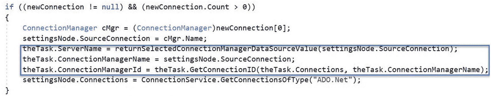
图 16-17
`SettingsView.propertyGridSettings_PropertyValueChanged` 方法的新连接代码，已更新

重构 `SettingsView.propertyGridSettings_PropertyValueChanged` 方法，通过向 `if` 条件 `if (e.ChangedItem.Value.Equals(NEW_CONNECTION))` 添加一个 `else` 语句来添加代码清单 16-9 中的代码：

```csharp
else
{
theTask.ServerName = returnSelectedConnectionManagerDataSourceValue(settingsNode.SourceConnection);
theTask.ConnectionManagerName = settingsNode.SourceConnection;
theTask.ConnectionManagerId = theTask.GetConnectionID(theTask.Connections, theTask.ConnectionManagerName);
settingsNode.Connections = ConnectionService.GetConnectionsOfType("ADO.Net");
}
代码清单 16-9
添加 SettingsView.propertyGridSettings_PropertyValueChanged 方法的非新连接代码
```

添加后，代码如图 16-18 所示：

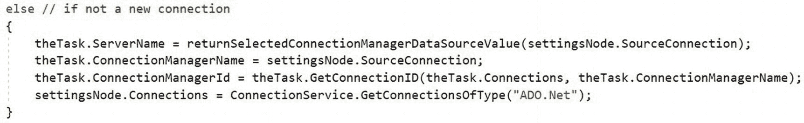
图 16-18
`SettingsView.propertyGridSettings_PropertyValueChanged` 方法的非新连接代码，已添加

下一步是重构我们在 `ExecuteCatalogPackageTask` 中识别目录、文件夹、项目和包的方式。

## 识别目录、文件夹、项目和包

“我们要解决的问题是什么？”这是我从一位导师那里学到的问题。这是一个好问题。我们要解决的问题是*更好*的连接管理。到目前为止，连接管理一直…*勉强够用*。当前设计中的连接管理忽略了至少两个有效的用例：

1.  连接到由 Azure SQL DB 托管的 Azure-SSIS 目录，该目录需要 SQL 登录名（用户名和密码）进行身份验证
2.  使用属性表达式覆盖 `ConnectionManagerName` 属性值

我们首先重新审视任务代码如何在 `ExecuteCatalogPackageTask.Execute()` 方法中分配 `catalogProject` 属性值。在 `ExecuteCatalogPackageTask.Execute()` 方法中，任务当前使用代码清单 16-10 中所示并如图 16-19 所示的代码来填充服务器 ➤ Integration Services ➤ SSIS 目录 ➤ 文件夹 ➤ 项目 ➤ 包层次结构：

```csharp
catalogServer = new Server(ServerName);
integrationServices = new IntegrationServices(catalogServer);
catalog = integrationServices.Catalogs[PackageCatalogName];
catalogFolder = catalog.Folders[PackageFolder];
catalogProject = catalogFolder.Projects[PackageProject];
代码清单 16-10
当前填充 服务器 ➤ Integration Services ➤ SSIS 目录 ➤ 文件夹 ➤ 项目 ➤ 包 层次结构
```

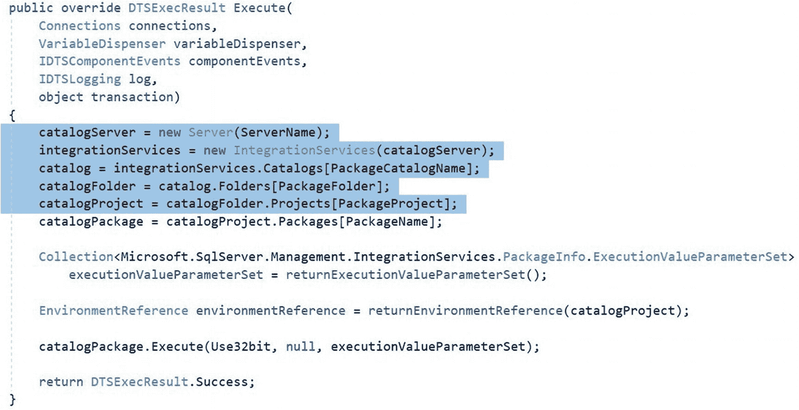
图 16-19
`Execute()` 方法

代码清单 16-10（如图 16-19 所示）根据从 `SettingsView` 中的 `SettingsNode` 配置的属性值来标识一个 SSIS 项目。在执行时，如果一个或多个 `SettingsNode` 属性配置不当，此代码容易出错。在服务器 ➤ Integration Services ➤ SSIS 目录 ➤ 文件夹 ➤ 项目 ➤ 包层次结构中，识别关键构件（如目录、文件夹、项目和包对象）非常重要。在本节中，用于识别目录、文件夹、项目和包的代码被收集并重构为更健壮且独立的方法。

让我们通过将此代码移动到 `ExecuteCatalogPackageTask` 类中一个名为 `returnCatalogProject` 的新函数来重构它。


## 添加 `returnCatalogProject` 方法

继续重构 `Execute()` 方法，使用清单 16-11 中的代码，通过将 `returnCatalogProject` 方法添加到 `ExecuteCatalogPackageTask` 中：

```csharp
public ProjectInfo returnCatalogProject(string ServerName
, string FolderName
, string ProjectName)
{
ProjectInfo catalogProject = null;
SqlConnection cn = (SqlConnection)Connections[ConnectionManagerId].AcquireConnection(null);
integrationServices = new IntegrationServices(cn);
if (integrationServices != null)
{
catalog = integrationServices.Catalogs[PackageCatalogName];
if (catalog != null)
{
catalogFolder = catalog.Folders[FolderName];
if (catalogFolder != null)
{
catalogProject = catalogFolder.Projects[ProjectName];
}
}
}
return catalogProject;
}
清单 16-11
添加 `ExecuteCatalogPackageTask.returnCatalogProject`
```

添加后，新函数的显示如图 16-20 所示：

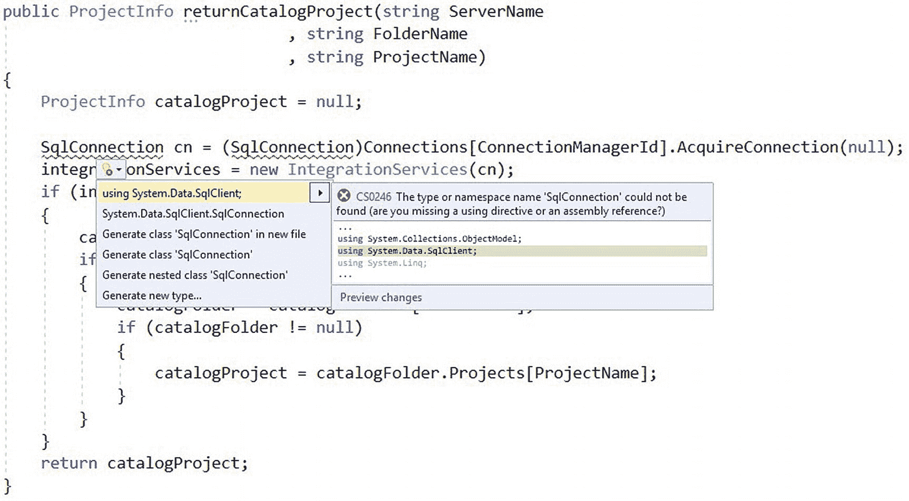

图 16-20

`returnCatalogProject` 函数

如果 `SqlConnection` 下方出现红色波浪线，请右键单击 `SqlConnection`，展开“快速操作”，然后单击 `using System.Data.SqlClient;` 以在 `ExecuteCatalogPackageTask.cs` 文件顶部附近添加 `using System.Data.SqlClient;` 指令。

添加 `using System.Data.SqlClient;` 指令后，代码显示如图 16-21 所示：

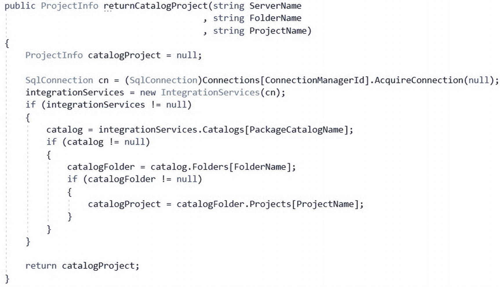

图 16-21

`returnCatalogProject` 函数

将 `returnCatalogProject` 函数声明为 `public` 允许从 `ExecuteCatalogPackageTaskComplexUI` 项目访问 `ExecuteCatalogPackageTask.returnCatalogProject` 函数。

其他额外的 “returnCatalog*” 方法与此类似，并展示了一种与 SSIS 连接管理器交互的非常有用的模式：`Connections.AcquireConnection` 方法返回一个 `SqlConnection` 类型的对象。通过调用 `Connections.AcquireConnection` 方法获取 `SqlConnection` 是一种——或许是唯一一种——从需要用户名和密码的连接管理器获取连接的方法。

在本书后面部分，我们将演示如何将 `ExecuteCatalogPackageTask` 连接到部署在 Azure SQL DB 实例上的 Azure-SSIS 目录。连接到 Azure SQL DB 实例的一种方法是使用带有用户名和密码的 SQL 登录名。

编辑 `Execute()` 方法中的代码，使用清单 16-12 所示的代码替换填充 Server ➤ Integration Services ➤ SSIS 目录 ➤ 文件夹 ➤ 项目层次结构的代码：

```csharp
catalogProject = returnCatalogProject(ServerName, PackageFolder, PackageProject);
清单 16-12
更新 `Execute()` 方法
```

更新后，新的 `Execute()` 方法显示如图 16-22 所示：

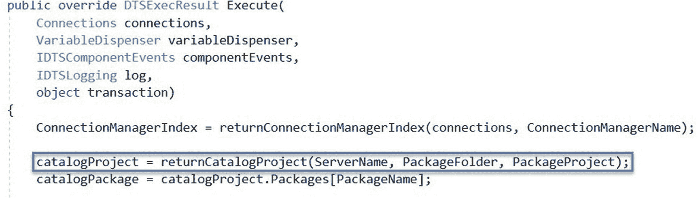

图 16-22

更新后 `Execute()` 方法的一部分

下一步是以类似的方式添加一个方法来返回目录包。

## 添加 `returnCatalogPackage` 方法

接下来，使用清单 16-13 中的代码添加 `returnCatalogPackage` 函数：

```csharp
public Microsoft.SqlServer.Management.IntegrationServices.PackageInfo returnCatalogPackage(
string ServerName
, string FolderName
, string ProjectName
, string PackageName)
{
Microsoft.SqlServer.Management.IntegrationServices.PackageInfo catalogPackage = null;
SqlConnection cn = (SqlConnection)Connections[ConnectionManagerId].AcquireConnection(null);
integrationServices = new IntegrationServices(cn);
if (integrationServices != null)
{
catalog = integrationServices.Catalogs[PackageCatalogName];
if (catalog != null)
{
catalogFolder = catalog.Folders[FolderName];
if (catalogFolder != null)
{
catalogProject = catalogFolder.Projects[ProjectName];
if (catalogProject != null)
{
catalogPackage = catalogProject.Packages[PackageName];
}
}
}
}
return catalogPackage;
}
清单 16-13
添加 `returnCatalogPackage` 函数
```

添加后，代码显示如图 16-23 所示：

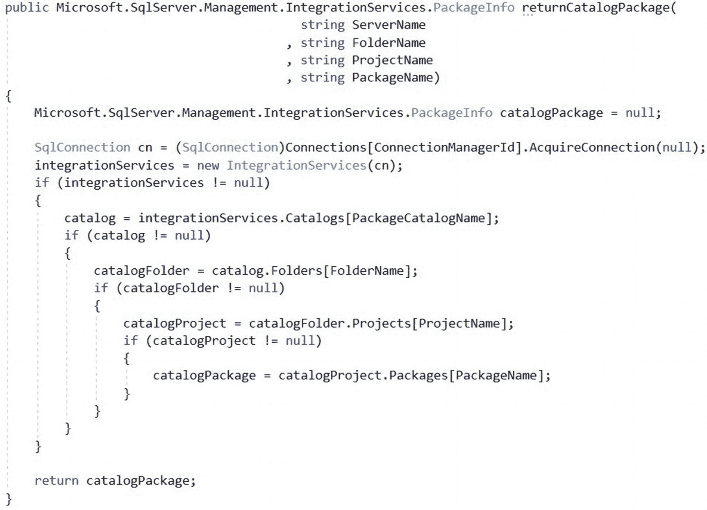

图 16-23

`returnCatalogPackage` 函数

编辑 `Execute()` 方法中的代码，使用清单 16-14 所示的代码替换填充 Server ➤ Integration Services ➤ SSIS 目录 ➤ 文件夹 ➤ 项目 ➤ 包层次结构的代码：

```csharp
catalogPackage = returnCatalogPackage(ServerName, PackageFolder, PackageProject, PackageName);
清单 16-14
更新 `Execute()` 方法
```

更新后，新的 `Execute()` 方法显示如图 16-24 所示：

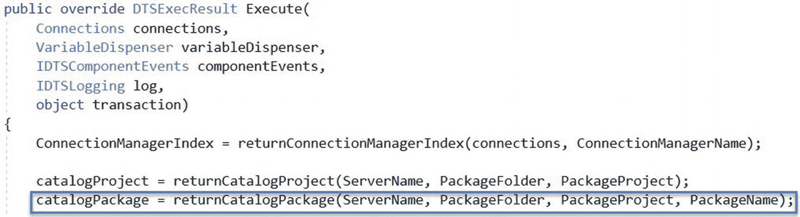

图 16-24

更新后 `Execute()` 方法的一部分

在 `ExecuteCatalogPackageTask` 开发的当前阶段，`returnCatalogProject` 和 `returnCatalogPackage` 方法就是我们所需要的全部了。不过，既然已经做了，我们不妨构建一下未来将需要的额外方法：`returnCatalog` 和 `returnCatalogFolder`。

## 添加 `returnCatalog` 方法

继续使用清单 16-15 中的代码将 `returnCatalog` 函数添加到 `ExecuteCatalogPackageTask` 代码中：

```csharp
public Catalog returnCatalog(string ServerName)
{
Catalog catalog = null;
SqlConnection cn = (SqlConnection)Connections[ConnectionManagerId].AcquireConnection(null);
integrationServices = new IntegrationServices(cn);
if (integrationServices != null)
{
catalog = integrationServices.Catalogs[PackageCatalogName];
}
return catalog;
}
清单 16-15
将 `returnCatalog` 函数添加到 `ExecuteCatalogPackageTask`
```

`returnCatalog` 函数是根据 `returnCatalogProject` 函数建模的。区别在于返回的是 `Catalog` 类型对象，而不是 `ProjectInfo` 类型对象。添加后，代码显示如图 16-25 所示：

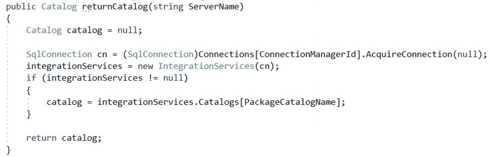

图 16-25

添加到 `ExecuteCatalogPackageTask` 的 `returnCatalog` 函数


### 添加 `returnCatalogFolder` 方法

下一步是使用代码清单 16-16 中的代码，将 `returnCatalogFolder` 函数添加到 `ExecuteCatalogPackageTask` 代码中：

```
public CatalogFolder returnCatalogFolder(string ServerName
, string FolderName)
{
CatalogFolder catalogFolder = null;
SqlConnection cn = (SqlConnection)Connections[ConnectionManagerId].AcquireConnection(null);
integrationServices = new IntegrationServices(cn);
if (integrationServices != null)
{
catalog = integrationServices.Catalogs[PackageCatalogName];
if (catalog != null)
{
catalogFolder = catalog.Folders[FolderName];
}
}
return catalogFolder;
}
代码清单 16-16
向 ExecuteCatalogPackageTask 添加 returnCatalogFolder 函数
```

`returnCatalogFolder` 函数完全仿照 `returnCatalogProject` 函数建模。区别在于它返回的是 `Catalog`，而不是 `ProjectInfo` 对象。添加完成后，代码如图 16-26 所示：

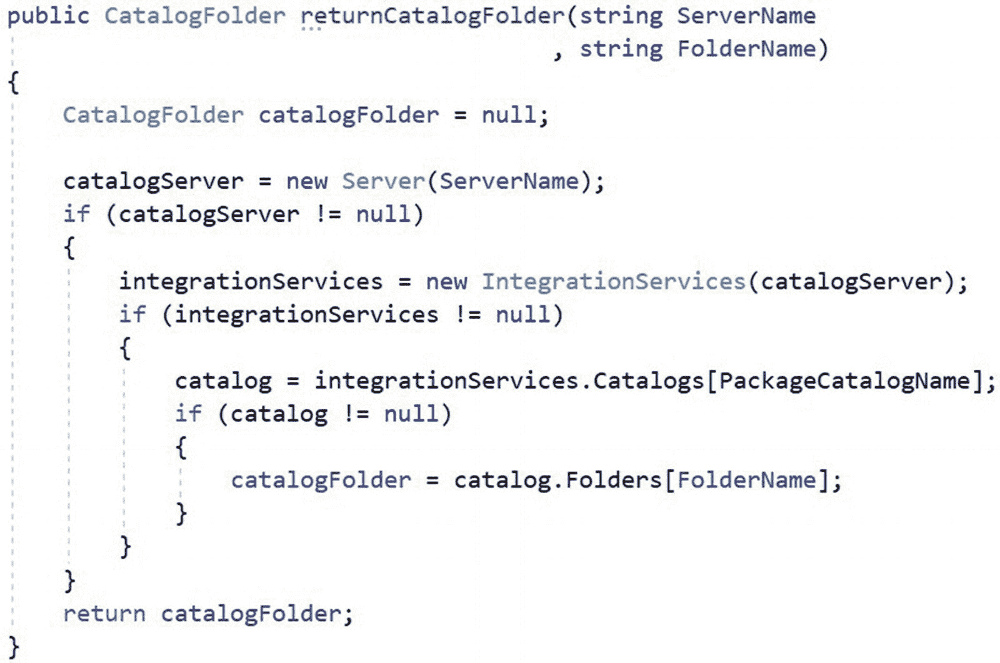

**图 16-26** `returnCatalogFolder` 函数已添加到 `ExecuteCatalogPackageTask`

`returnCatalog` 方法对我们设计的下一步很有帮助，即初始化 `SettingsNode` 的 `References` 集合。

### 让我们测试一下！

生成 `ExecuteCatalogPackageTask` 解决方案，然后打开一个测试 SSIS 项目。向控制流中添加一个 `执行目录包任务`，打开编辑器，并将任务配置为执行存储在 SSIS 目录中的 SSIS 包，如图 16-27 所示：

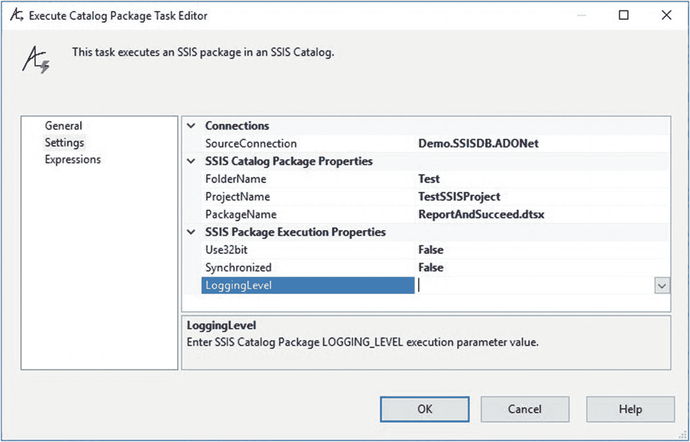

**图 16-27** 为测试执行配置 `执行目录包任务`

单击 `确定` 按钮关闭编辑器，然后在 SSIS 调试器中执行该包。如果一切按计划进行，测试调试执行将成功，如图 16-28 所示：


**图 16-28** 成功！

打开 SQL Server Management Studio 的 `对象资源管理器`。导航到 `Integration Services 目录` 节点并展开到 `SSISDB` 节点。右键单击 `SSISDB` 节点，将鼠标悬停在 `报表` 上，然后单击 `所有执行` 以查看测试 SSIS 包执行的结果，如图 16-29 所示：

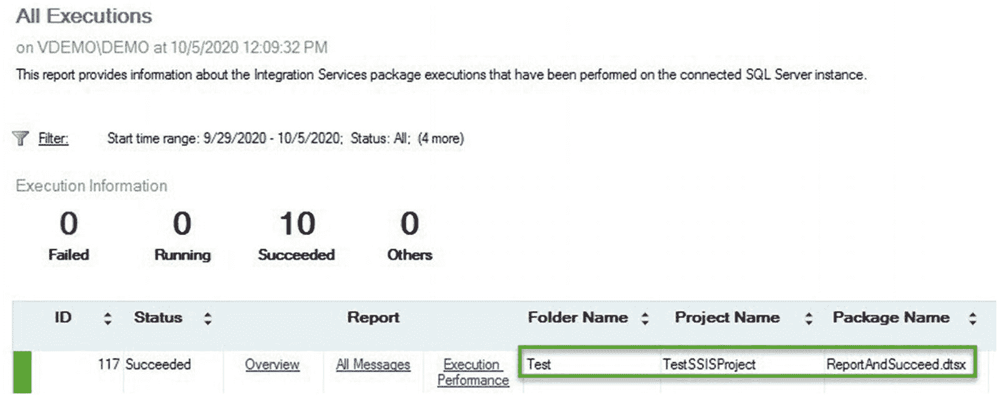

**图 16-29** 成功的测试执行，已验证

新的 SSIS 目录识别方法更清晰、更健壮。代码结构更适合添加额外的功能。

### 结论

在本章中，我们使连接管理更加健壮，并重构了 `ExecuteCatalogPackageTask` 的方法，以帮助识别服务器 ➤ Integration Services ➤ SSIS 目录 ➤ 文件夹 ➤ 项目 ➤ 包层次结构中的对象。其中两个方法——`returnCatalogProject` 和 `returnCatalogPackage`——在 `ExecuteCatalogPackageTask` 的 `Execute` 方法中使用。

现在是检入代码的绝佳时机。

