# 17. 重构 SSIS 包层次结构

本章的目标是重构 `ExecuteCatalogPackageTask` 的方法，为添加和测试 `Reference` 属性做准备。目标包括：

*   重构 `SettingsView` 的目录、文件夹、项目和包属性。
*   测试文件夹、项目和包属性表达式。

## 重构 SettingsView 目录、文件夹、项目和包属性

每次配置 `执行目录包任务` 的实例时，您是否厌倦了输入文件夹名称、项目名称和包名称？我厌倦了。让我们添加属性和功能，以便我们可以*选择*文件夹、项目和包。

在本节中，我们将 `object` 类型的成员添加到 `SettingsNode` 类中，以管理三个集合——文件夹、项目和包。为此，我们将对每个集合遵循以下模式：

*   声明 `SettingsNode` 对象类型成员（属性）以包含集合。
*   为文件夹 ➤ 项目 ➤ 包层次结构中的每一级添加一个新属性。
*   为每个集合添加一个隐藏（不可浏览）属性。
*   添加一个方法来填充每个对象集合的列表。
*   添加一个方法来更新每个对象集合。
*   集中调用以更新所有相关集合。
*   在 `propertyGridSettings_PropertyValueChanged` 中添加调用，以便在特定属性层次结构值更改时填充层次结构中*下一级*的属性集合。
*   在 `propertyGridSettings_PropertyValueChanged` 中添加调用，以便在特定属性层次结构值更改时清除层次结构中*更低级别*的属性。
*   隐藏原始属性。

我们首先使用代码清单 17-1 中的代码在 `SettingsNode` 类中声明 `_folders`、`_projects` 和 `_packages` 这三个对象：

```
private object _folders = null;
private object _projects = null;
private object _packages = null;
代码清单 17-1
向 SettingsNode 添加 _folders、_projects 和 _packages 集合对象
```

添加后，新对象如图 17-1 所示：

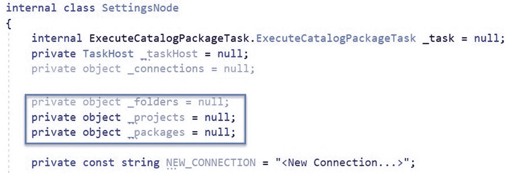

**图 17-1** 添加 `_folders`、`_projects` 和 `_packages` 集合对象

下一步是为每个集合添加隐藏（不可浏览）属性。


### 文件夹属性和文件夹集合

`Folder` 属性与 `Folders` 集合之间的关系，类似于 `SourceConnection` 属性与连接集合之间的关系。一个不同之处在于，连接集合是由承载“执行目录包任务”的 SSIS 包传递给任务的。我们的代码在 `ExecuteCatalogPackageTask.InitializeTask` 方法中设置了 `Connections` 属性的值（参见第 16 章中的图 16-10 和 [16-11](https://doi.org/10.1007/978-1-4842-6482-9_16Fig#11)）。SSIS 包并不知晓 SSIS 目录文件夹的集合。因此，我们必须在自己的代码中管理 SSIS 目录文件夹的集合。

## 添加文件夹属性

使用清单 17-2 中的代码向 `SettingsNode` 类添加一个新的 `Folder` 属性：

```
[
Category("SSIS Catalog Package Properties"),
Description("Select SSIS Catalog Package folder name."),
TypeConverter(typeof(Folders))
]
public string Folder {
get { return _task.PackageFolder; }
set {
if (value == null)
{
throw new ApplicationException("Folder name cannot be empty");
}
_task.PackageFolder = value;
}
}
清单 17-2
添加 SettingsNode.Folder 属性
```

添加后，代码显示如图 17-2 所示：


图 17-2
添加 `SettingsNode.Folder` 属性

请注意，`Folders` `TypeConverter` 下方有一条红色波浪线，指示一个错误情况。在此例中，`Folders` `TypeConverter` 尚不存在。

## 添加 Folders TypeConverter

使用清单 17-3 中的代码添加 `Folders` `TypeConverter` —— 以 `LoggingLevels` `TypeConverter` 为模型：

```
internal class Folders : StringConverter
{
private object GetSpecializedObject(object contextInstance)
{
DTSLocalizableTypeDescriptor typeDescr = contextInstance as DTSLocalizableTypeDescriptor;
if (typeDescr == null)
{
return contextInstance;
}
return typeDescr.SelectedObject;
}
public override StandardValuesCollection GetStandardValues(ITypeDescriptorContext context)
{
object retrievalObject = GetSpecializedObject(context.Instance) as object;
return new StandardValuesCollection(getFolders(retrievalObject));
}
public override bool GetStandardValuesExclusive(ITypeDescriptorContext context)
{
return true;
}
public override bool GetStandardValuesSupported(ITypeDescriptorContext context)
{
return true;
}
private ArrayList getFolders(object retrievalObject)
{
SettingsNode node = (SettingsNode)retrievalObject;
ArrayList list = new ArrayList();
ArrayList listFolders;
listFolders = (ArrayList)node.Folders;
if (listFolders == null)
{
listFolders = new ArrayList();
}
if (listFolders != null)
{
// adds each folder
foreach (string fld in listFolders)
{
list.Add(fld); // Folder name
}
// sorts the folder list
if ((list != null) && (list.Count > 0))
{
list.Sort();
}
}
return list;
}
}
清单 17-3
Folders TypeConverter
```

添加后，`Folders` `TypeConverter` 代码显示如图 17-3 所示：

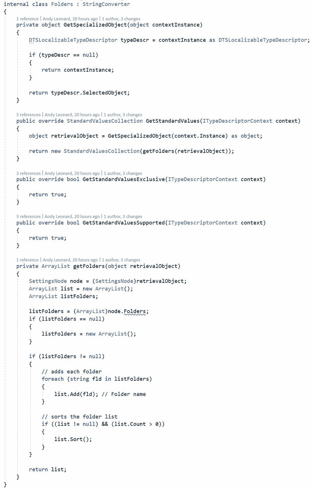

图 17-3
`Folders` `TypeConverter`

请注意，`getFolders` 方法显示一个错误 —— `node.Folders` 下方有红色波浪线。我们将在接下来的几页中，通过向 `SettingsNode` 类添加 `Folders` 属性来纠正此错误。

当添加了 `Folders` `TypeConverter` 后，`Folder` 属性声明中的错误得到解决，如图 17-4 所示（与图 17-2 对比）：

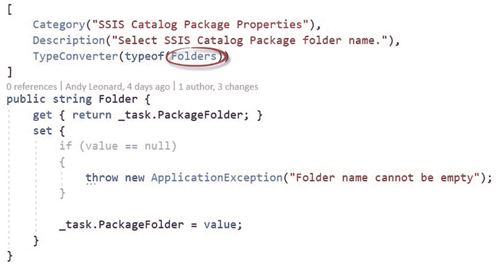

图 17-4
`Folders` `TypeConverter` 错误已清除

## 添加 Folders 属性

使用清单 17-4 中的代码添加 `Folders` 属性：

```
[
Category("SSIS Catalog Package Path Collections"),
Description("Enter SSIS Catalog Package folders collection."),
Browsable(false)
]
public object Folders {
get { return _folders; }
set { _folders = value; }
}
清单 17-4
添加 Folders 属性
```

添加后，`Folders` 属性显示如图 17-5 所示：

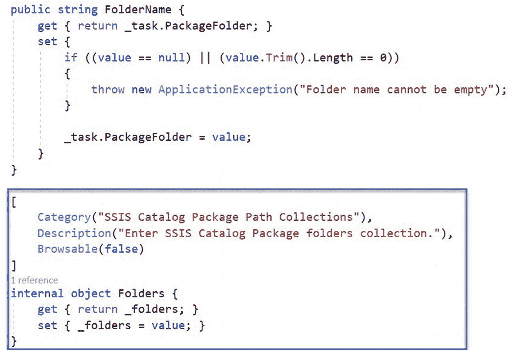

图 17-5
`Folders` 属性已添加

## 添加方法以填充文件夹集合

下一步是添加一个方法，使用清单 17-5 中的代码来填充文件夹列表：

```
internal ArrayList GetFoldersFromCatalog()
{
ArrayList foldersList = new ArrayList();
if ((_task.ServerName != null) && (_task.ServerName != ""))
{
Catalog catalog = _task.returnCatalog(_task.ServerName);
if (catalog != null)
{
foreach (CatalogFolder cf in catalog.Folders)
{
foldersList.Add(cf.Name);
}
}
}
return foldersList;
}
清单 17-5
填充 Folders 集合
```

添加后，代码显示如图 17-6 所示：

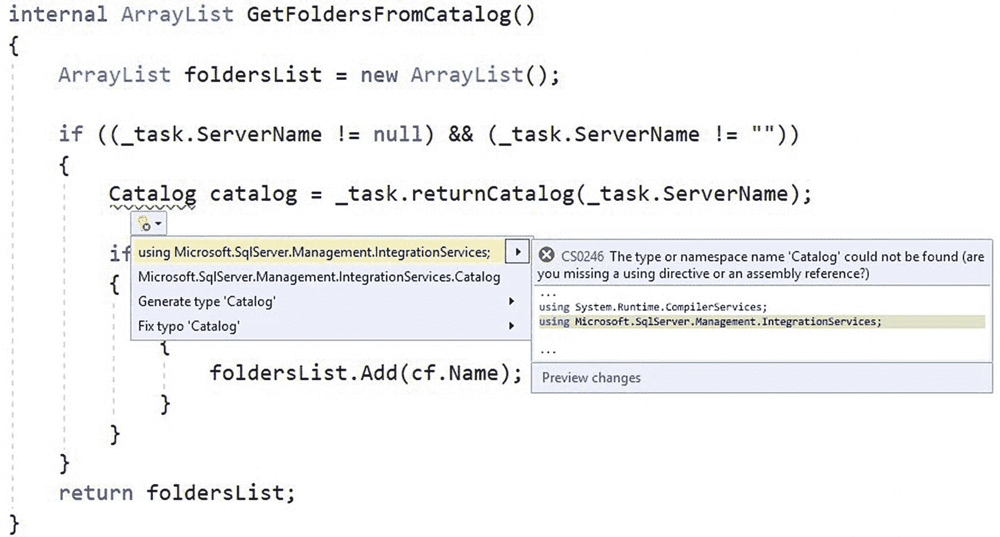

图 17-6
添加 `GetFoldersFromCatalog` 方法

`Catalog`（以及隐藏的 `CatalogFolder`）对象下方有红色波浪线。点击“快速操作”下拉菜单，然后点击 `using Microsoft.SqlServer.Management.IntegrationServices;` 以添加指令。添加指令后，代码显示如图 17-7 所示：

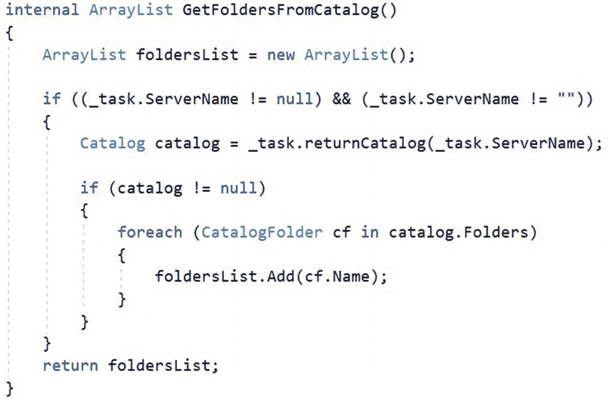

图 17-7
添加 using 指令后的 `GetFoldersFromCatalog` 方法

`GetFoldersFromCatalog` 方法构造并填充一个 `ArrayList` 类型的变量，该变量包含由 `SourceConnection` 属性所呈现的 SSIS 目录中托管的 SSIS 目录文件夹列表。

下一步是添加一个方法，用 `GetFoldersFromCatalog` 方法返回的内容填充 `Folders` 集合属性，然后刷新 `SettingsView` 属性网格。名为 `updateFolders` 的新方法的代码在清单 17-6 中：

```
private void updateFolders()
{
if (settingsNode.SourceConnection != "")
{
settingsNode.Folders = settingsNode.GetFoldersFromCatalog();
this.settingsPropertyGrid.Refresh();
}
}
清单 17-6
添加 updateFolders 方法
```

添加后，代码显示如图 17-8 所示：

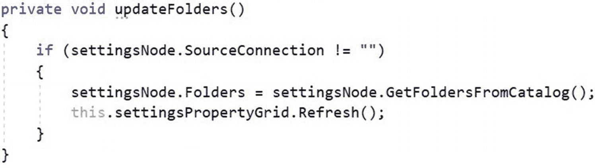

图 17-8
已添加的 `updateFolders` 方法

## 集中更新集合

下一步是开始集中调用以更新所有相关集合，使用清单 17-7 中的代码：

```
private void updateCollections()
{
Cursor = Cursors.WaitCursor;
updateFolders();
Cursor = Cursors.Default;
}
清单 17-7
集中调用以更新文件夹集合
```

添加后，代码显示如图 17-9 所示：

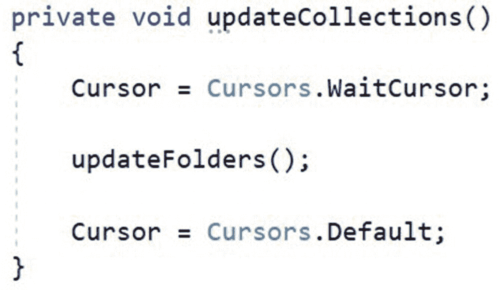

图 17-9
集中调用以更新文件夹集合

我们将 `updateCollections` 方法开始时的光标设置为等待光标，因为稍后当我们连接到 Azure-SSIS 目录时，填充文件夹集合将需要几秒钟时间。调用 `updateFolders` 方法后，光标会被重置为默认光标。


## 更新 `Folders` 集合与 `SourceConnection` 属性

当 `SourceConnection` 属性被初次选中或更新时，更新 `Folders` 集合才有意义。在 `SettingsView.propertyGridSettings_PropertyValueChanged` 方法的 `SourceConnection` 属性部分的底部，添加对 `updateCollections` 方法的调用，如图 17-10 所示：

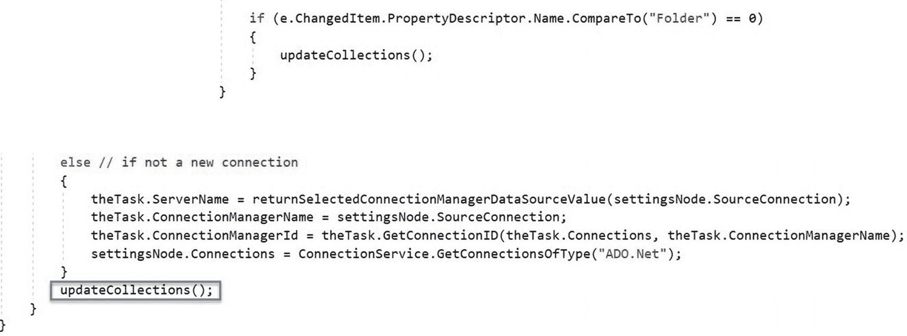
*图 17-10：向 SettingsView.propertyGridSettings_PropertyValueChanged 的 SourceConnection 部分添加 updateCollections 调用*

下一步是在 `propertyGridSettings_PropertyValueChanged` 方法中添加对 `updateCollections` 方法的调用，当 `Folder` 属性值更改时，此调用会填充文件夹属性集合。方法是向 `SettingsView.propertyGridSettings_PropertyValueChanged` 方法添加清单 17-8 中的代码：

```
if (e.ChangedItem.PropertyDescriptor.Name.CompareTo("Folder") == 0)
{
updateCollections();
}
Listing 17-8
Add code to respond to changes in the Folder property
```

添加后，代码如图 17-11 所示：

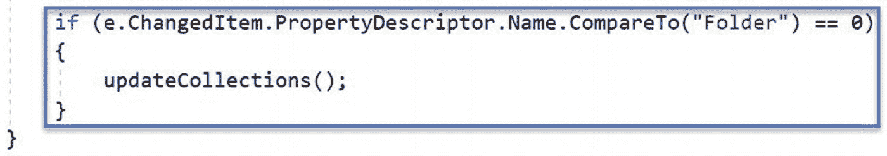
*图 17-11：添加代码以响应 Folder 属性的更改*

在 `SettingsView.OnInitialize` 方法的底部添加对 `updateCollections` 方法的调用，如图 17-12 所示：

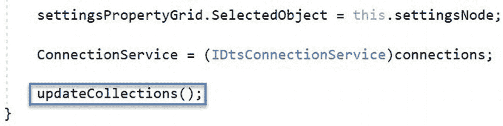
*图 17-12：向 SettingsView.OnInitialize 添加 updateCollections 调用*

要测试此功能，请生成 `ExecuteCatalogPackageTask` 解决方案，在测试 SSIS 项目中打开一个测试 SSIS 包，向控制流画布添加一个执行目录包任务，打开编辑器并配置 `SourceConnection`。配置 `SourceConnection` 后，`Folder` 属性应填充 SSIS 目录文件夹的名称，如图 17-13 所示：

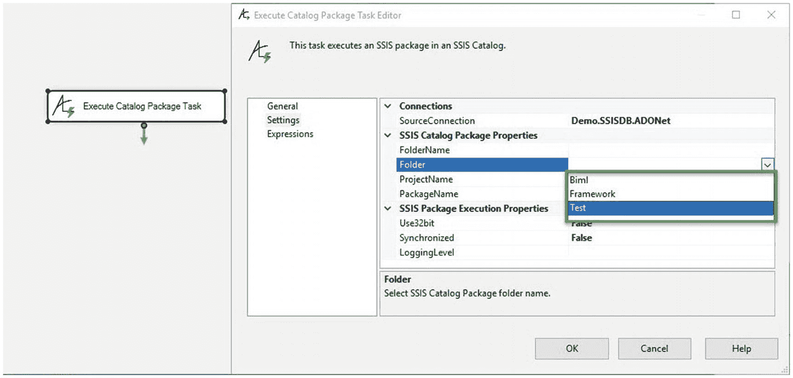
*图 17-13：Folders*

下一步是隐藏 `FolderName` 属性。要隐藏 `FolderName` 属性，只需注释掉 `FolderName` 属性声明：选中代码，按住 Ctrl 键，然后按 K 键，再按 C 键。所选代码将被注释掉，如图 17-14 所示：

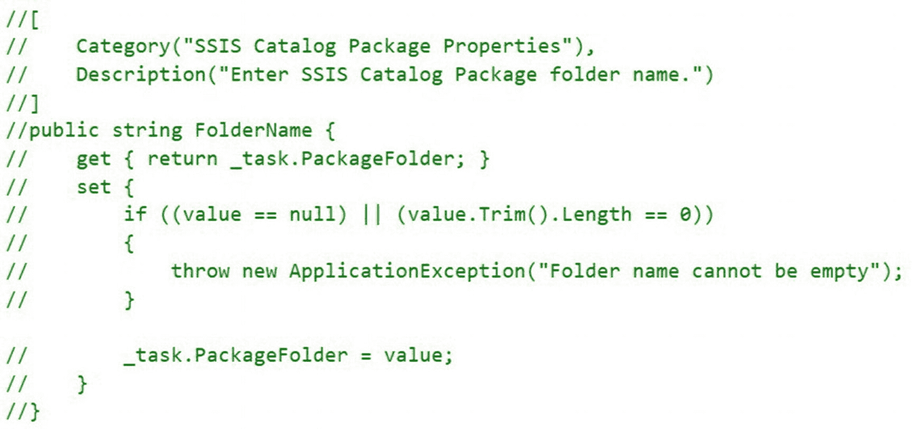
*图 17-14：FolderName 属性被注释掉*

下一步是更新 `SettingsView.OnCommit` 方法，将行 `theTask.PackageFolder = settingsNode.FolderName;` 更新为 `theTask.PackageFolder = settingsNode.Folder;`，如图 17-15 所示：

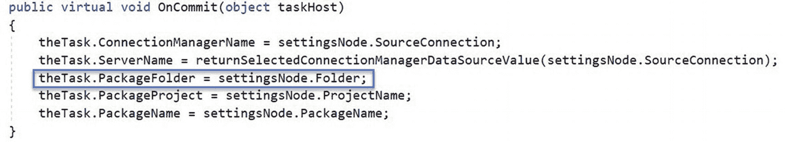
*图 17-15：更新 PackageFolder 属性赋值*

生成并测试 `ExecuteCatalogPackageTask` 解决方案。任务编辑器上的“设置”视图现在应如图 17-16 所示：

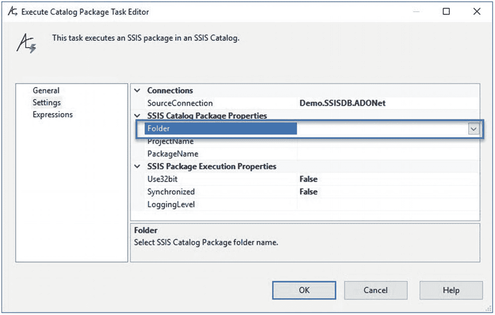
*图 17-16：The Folder 属性*

现在，`Folder` 和 `Folders` 集合属性已配置完毕。接下来的步骤是配置 `Project` 和 `Projects` 集合属性以及 `Package` 和 `Packages` 集合属性。

现在是签入代码的好时机。

## `Project` 属性与 `Projects` 集合

`Project` 属性与 `Projects` 集合之间的关系与 `Folder` 属性和 `Folders` 集合之间的关系相同。唯一的区别是对象本身。与 `Folders` 集合一样，我们必须在代码中管理 SSIS 目录项目的集合。

使用清单 17-9 中的代码向 `SettingsNode` 类添加一个新的 `Project` 属性：

```
[
Category("SSIS Catalog Package Properties"),
Description("Select SSIS Catalog Package project name."),
TypeConverter(typeof(Projects))
]
public string Project {
get { return _task.PackageProject; }
set {
if (value == null)
{
throw new ApplicationException("Project name cannot be empty");
}
_task. PackageProject = value;
}
}
Listing 17-9
Add the SettingsNode.Project property
```

添加后，代码如图 17-17 所示：

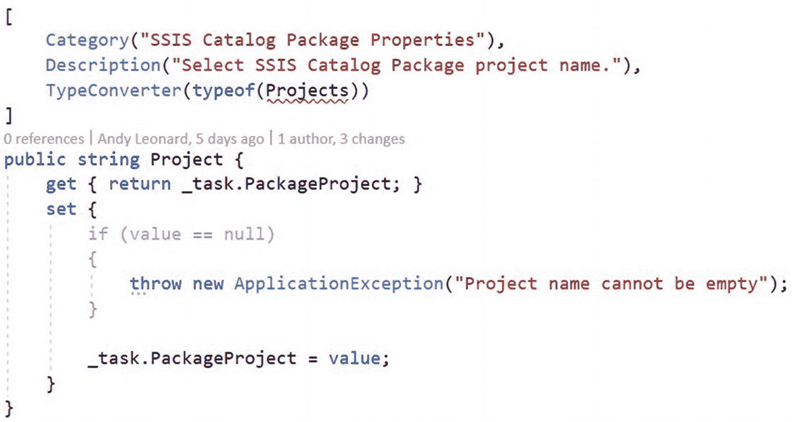
*图 17-17：添加 SettingsNode.Project 属性*

与之前的 `Folder` TypeConverter 一样，请注意 `Projects` TypeConverter 下方有一条红色波浪线，表示与之前相同的错误状况：`Projects` TypeConverter 尚不存在。使用清单 17-10 中的代码添加 `Projects` TypeConverter：

```
internal class Projects : StringConverter
{
private object GetSpecializedObject(object contextInstance)
{
DTSLocalizableTypeDescriptor typeDescr = contextInstance as DTSLocalizableTypeDescriptor;
if (typeDescr == null)
{
return contextInstance;
}
return typeDescr.SelectedObject;
}
public override StandardValuesCollection GetStandardValues(ITypeDescriptorContext context)
{
object retrievalObject = GetSpecializedObject(context.Instance) as object;
return new StandardValuesCollection(getProjects(retrievalObject));
}
public override bool GetStandardValuesExclusive(ITypeDescriptorContext context)
{
return true;
}
public override bool GetStandardValuesSupported(ITypeDescriptorContext context)
{
return true;
}
private ArrayList getProjects(object retrievalObject)
{
SettingsNode node = (SettingsNode)retrievalObject;
ArrayList list = new ArrayList();
ArrayList listProjects;
listProjects = (ArrayList)node.Projects;
if (listProjects == null)
{
listProjects = new ArrayList();
}
if (listProjects!= null)
{
// adds each project
foreach (string fld in listProjects)
{
list.Add(fld); // Project name
}
// sorts the project list
if ((list != null) && (list.Count > 0))
{
list.Sort();
}
}
return list;
}
}
Listing 17-10
The Projects TypeConverter
```

添加后，`Projects` TypeConverter 代码如图 17-18 所示：

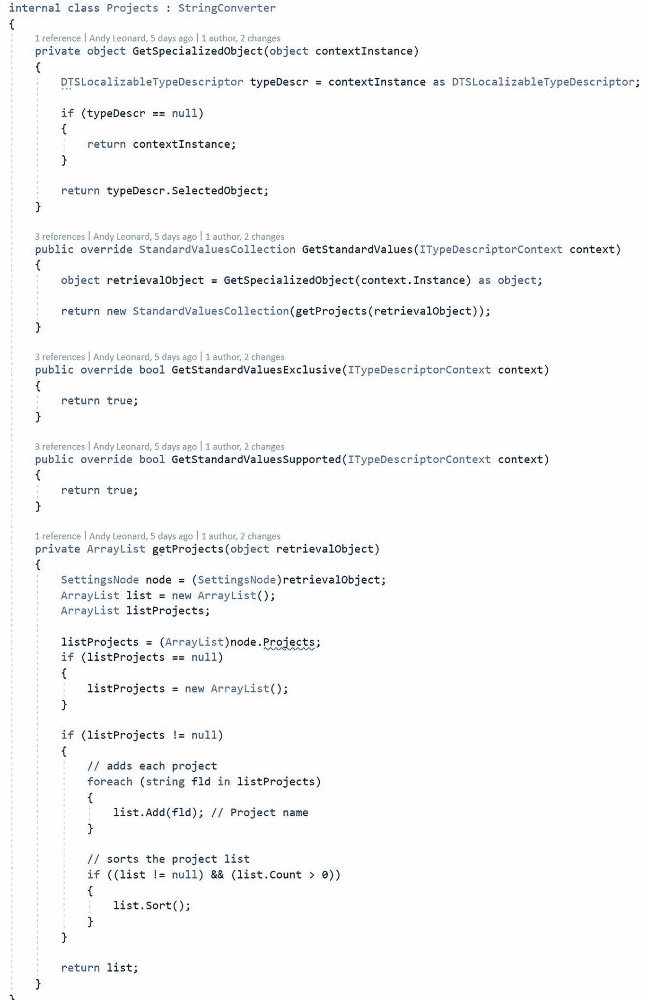
*图 17-18：The Projects TypeConverter*

请注意，`getProjects` 方法显示错误——`node.Projects` 下方有一条红色波浪线。我们将在接下来的页面中通过向 `SettingsNode` 类添加 `Projects` 属性来纠正该错误。

当添加 `Projects` TypeConverter 后，`Project` 属性声明中的错误被解决，如图 17-19 所示（与图 17-17 比较）：

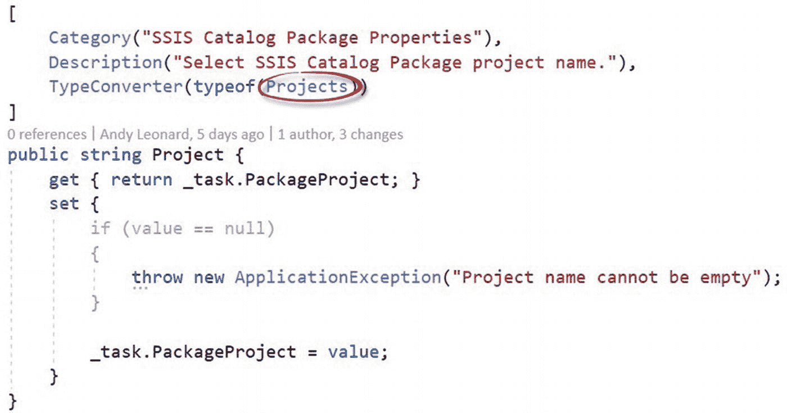
*图 17-19：Projects TypeConverter 错误已清除*

使用清单 17-11 中的代码添加 `Projects` 属性：

```
[
Category("SSIS Catalog Package Path Collections"),
Description("Enter SSIS Catalog Package projects collection."),
Browsable(false)
]
public object Projects {
get { return _projects; }
set { _projects = value; }
}
Listing 17-11
Adding the Projects property
```


添加后，`Projects` 属性显示如图 17-20 所示：


图 17-20：已添加的 Projects 属性

下一步是添加一个方法，以使用清单 17-12 中的代码填充项目列表：

```csharp
internal ArrayList GetProjectsFromCatalog()
{
    ArrayList projectsList = new ArrayList();
    if (((_task.ServerName != null) && (_task.ServerName != ""))
        && ((_task.PackageFolder != null) && (_task.PackageFolder != "")))
    {
        CatalogFolder catalogFolder = _task.returnCatalogFolder(_task.ServerName, _task.PackageFolder);
        if (catalogFolder != null)
        {
            foreach (ProjectInfo pr in catalogFolder.Projects)
            {
                projectsList.Add(pr.Name);
            }
        }
    }
    return projectsList;
}
```
清单 17-12：填充 Projects 集合

添加后，代码显示如图 17-21 所示：


图 17-21：添加 `GetProjectsFromCatalog` 方法

`GetProjectsFromCatalog` 方法构造并填充一个 `ArrayList` 类型的变量，该变量包含先前配置的 SSIS 目录文件夹中托管的 SSIS 目录项目的列表。

下一步是添加一个方法，用 `GetProjectsFromCatalog` 方法返回的内容填充 `Projects` 集合属性，然后刷新 `SettingsView` 属性网格。名为 `updateProjects` 的新方法的代码如清单 17-13 所示：

```csharp
private void updateProjects()
{
    if ((settingsNode.SourceConnection != "")
        && (settingsNode.Folder != ""))
    {
        settingsNode.Projects = settingsNode.GetProjectsFromCatalog();
        this.settingsPropertyGrid.Refresh();
    }
}
```
清单 17-13：添加 `updateProjects` 方法

添加后，代码显示如图 17-22 所示：


图 17-22：已添加的 `updateProjects` 方法

下一步是使用清单 17-14 中的代码，在 `updateCollections` 方法中添加对 `updateProjects` 方法的调用：

```csharp
private void updateCollections()
{
    Cursor = Cursors.WaitCursor;
    updateFolders();
    updateProjects();
    Cursor = Cursors.Default;
}
```
清单 17-14：更新 `updateCollections` 方法

添加后，代码显示如图 17-23 所示：


图 17-23：集中调用以更新文件夹和项目集合

当 `Folder` 属性最初被选中或更新时，对 `Projects` 集合的更新才有意义。在上一节中，我们已在 `propertyGridSettings_PropertyValueChanged` 方法中添加了代码，以便在 `Folder` 属性值更改时调用 `updateCollections` 方法。下一步是通过将清单 17-15 中的代码添加到 `SettingsView.propertyGridSettings_PropertyValueChanged` 方法中，以便在 `Project` 属性值更改时，在该方法中添加对 `updateCollections` 方法的调用：

```csharp
if (e.ChangedItem.PropertyDescriptor.Name.CompareTo("Project") == 0)
{
    updateCollections();
}
```
清单 17-15：添加代码以响应 `Project` 属性的更改

添加后，代码显示如图 17-24 所示：


图 17-24：添加代码以响应 `Project` 属性的更改

要测试该功能，请生成 `ExecuteCatalogPackageTask` 解决方案，在测试 SSIS 项目中打开一个测试 SSIS 包，将 `Execute Catalog Package Task` 添加到控制流画布，打开任务编辑器，并配置 `SourceConnection` 和 SSIS 目录 `Folder`。配置 `SourceConnection` 和 SSIS 目录 `Folder` 后，`Project` 属性应填充 SSIS 目录项目的名称，如图 17-25 所示：


图 17-25：项目

下一步是隐藏 `ProjectName` 属性。要隐藏 `ProjectName` 属性，只需注释掉 `ProjectName` 属性声明：选中代码，按住 `Ctrl` 键，然后按 `K` 键，再按 `C` 键。所选代码将被注释掉，如图 17-26 所示：


图 17-26：已注释掉的 `ProjectName` 属性

下一步是更新 `SettingsView.OnCommit` 方法，将行 `theTask.PackageProject = settingsNode.ProjectName;` 更新为 `theTask.PackageProject = settingsNode.Project;`，如图 17-27 所示：


图 17-27：更新 `PackageProject` 属性赋值

生成并测试 `ExecuteCatalogPackageTask` 解决方案。任务编辑器上的 `Settings` 视图现在应如图 17-28 所示：


图 17-28：`Project` 属性

现在，`Project` 和 `Projects` 集合属性已配置完成。接下来的步骤是配置 `Package` 和 `Packages` 集合属性。

现在是一个签入代码的绝佳时机。


### 包属性与包集合

`Package` 属性与 `Packages` 集合之间的关系，与 `Project` 属性和 `Projects` 集合之间的关系完全相同。唯一的区别是对象本身。与 `Projects` 集合一样，我们必须在代码中管理 SSIS 目录包的集合。

使用清单 17-16 中的代码，为 `SettingsNode` 类添加一个新的 `Package` 属性：

```csharp
[
Category("SSIS Catalog Package Properties"),
Description("Select SSIS Catalog Package name."),
TypeConverter(typeof(Packages))
]
public string Package {
get { return _task.PackageName; }
set {
if (value == null)
{
throw new ApplicationException("Package name cannot be empty");
}
_task. PackageName = value;
}
}
// 清单 17-16
// 添加 SettingsNode.Package 属性
```

添加后，代码如图 17-29 所示：

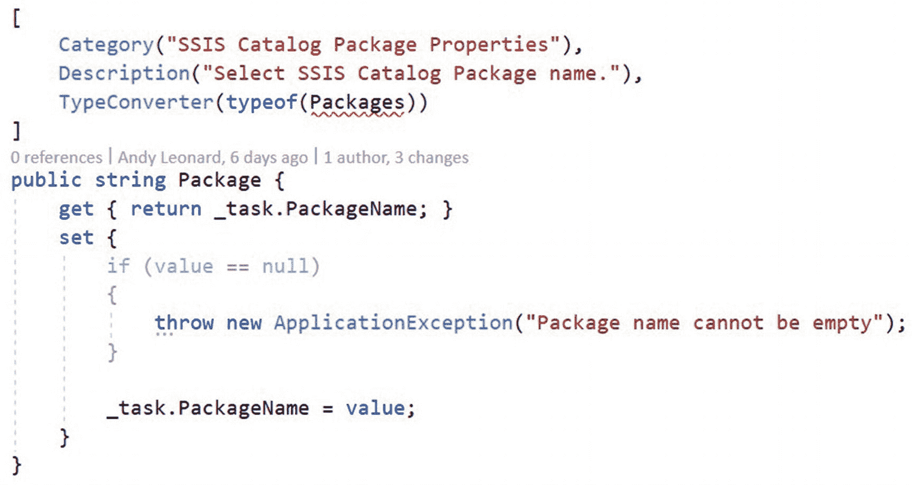

*图 17-29：添加 SettingsNode.Package 属性*

与之前处理 `Folder` 和 `Project` 的 `TypeConverter` 一样，请注意 `Packages` `TypeConverter` 下方有一条红色的波浪线，表示与之前相同的错误状况：`Packages` `TypeConverter` 尚不存在。使用清单 17-17 中的代码添加 `Packages` `TypeConverter`：

```csharp
internal class Packages : StringConverter
{
private object GetSpecializedObject(object contextInstance)
{
DTSLocalizableTypeDescriptor typeDescr = contextInstance as DTSLocalizableTypeDescriptor;
if (typeDescr == null)
{
return contextInstance;
}
return typeDescr.SelectedObject;
}
public override StandardValuesCollection GetStandardValues(ITypeDescriptorContext context)
{
object retrievalObject = GetSpecializedObject(context.Instance) as object;
return new StandardValuesCollection(getPackages(retrievalObject));
}
public override bool GetStandardValuesExclusive(ITypeDescriptorContext context)
{
return true;
}
public override bool GetStandardValuesSupported(ITypeDescriptorContext context)
{
return true;
}
private ArrayList getPackages(object retrievalObject)
{
SettingsNode node = (SettingsNode)retrievalObject;
ArrayList list = new ArrayList();
ArrayList listPackages;
listPackages = (ArrayList)node.Packages;
if (listPackages == null)
{
listPackages = new ArrayList();
}
if (listPackages != null)
{
// 添加每个包
foreach (string pkg in listPackages)
{
list.Add(pkg); // 包名称
}
// 对包列表进行排序
if ((list != null) && (list.Count > 0))
{
list.Sort();
}
}
return list;
}
}
// 清单 17-17
// Packages 类型转换器
```

添加后，`Projects` `TypeConverter` 代码如图 17-30 所示：

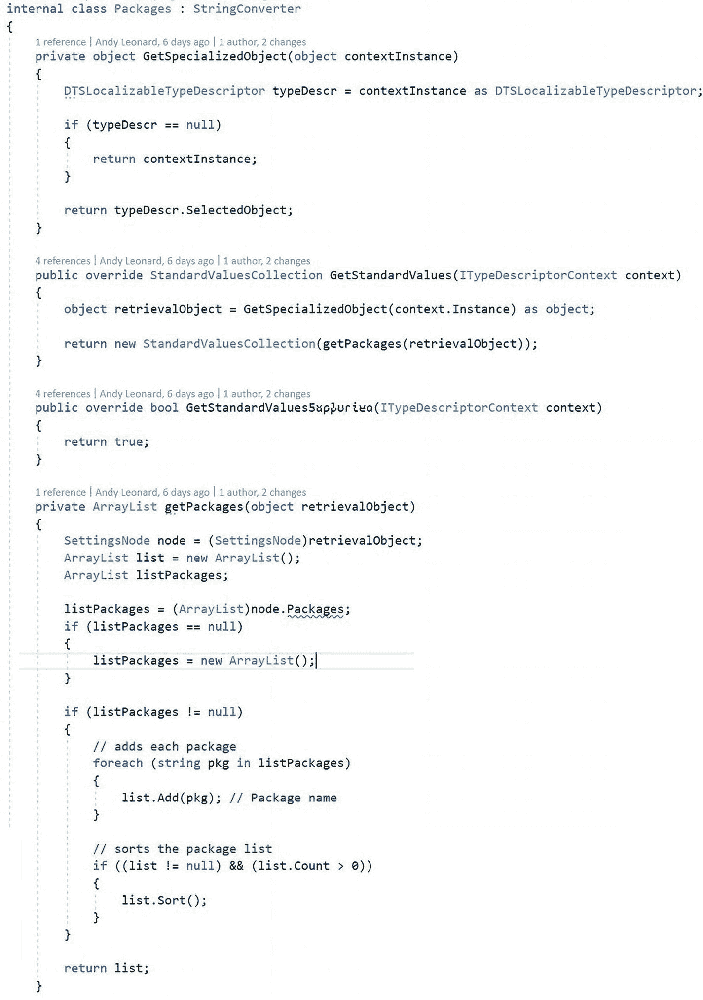

*图 17-30：Packages 类型转换器*

请注意 `getPackages` 方法显示错误——`node.Packages` 下方有红色波浪线。我们将在后续页面中通过向 `SettingsNode` 类添加 `Packages` 属性来纠正此错误。

当添加了 `Packages` `TypeConverter` 后，`Package` 属性声明中的错误便解决了，如图 17-31 所示（与图 17-29 对比）：

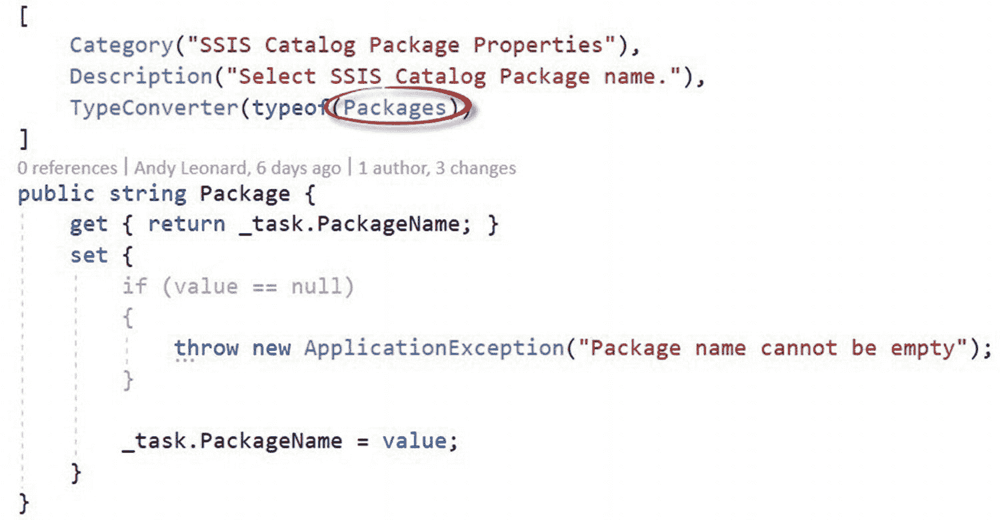

*图 17-31：Packages 类型转换器错误已清除*

使用清单 17-18 中的代码添加 `Packages` 属性：

```csharp
[
Category("SSIS Catalog Package Path Collections"),
Description("Enter SSIS Catalog Packages collection."),
Browsable(false)
]
public object Packages {
get { return _packages; }
set { _packages = value; }
}
// 清单 17-18
// 添加 Packages 属性
```

添加后，`Packages` 属性如图 17-32 所示：

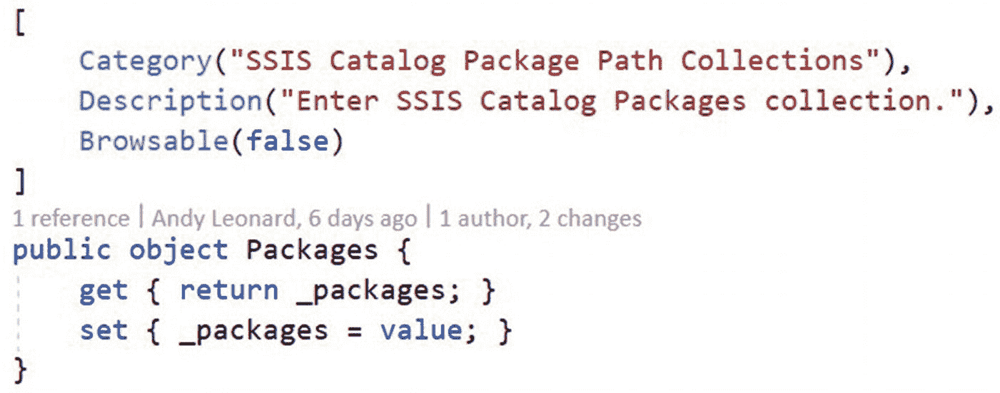

*图 17-32：Packages 属性已添加*

下一步是使用清单 17-19 中的代码添加一个方法，用于填充包列表：

```csharp
internal ArrayList GetPackagesFromCatalog()
{
ArrayList packagesList = new ArrayList();
if (((_task.ServerName != null) && (_task.ServerName != ""))
&& ((_task.PackageFolder != null) && (_task.PackageFolder != ""))
&& ((_task.PackageProject != null) && (_task.PackageProject != "")))
{
ProjectInfo catalogProject = _task.returnCatalogProject(_task.ServerName
, _task.PackageFolder
, _task.PackageProject);
if (catalogProject != null)
{
foreach (Microsoft.SqlServer.Management.IntegrationServices.PackageInfo
pkg in catalogProject.Packages)
{
packagesList.Add(pkg.Name);
}
}
}
return packagesList;
}
// 清单 17-19
// 填充 Packages 集合
```

添加后，代码如图 17-33 所示：

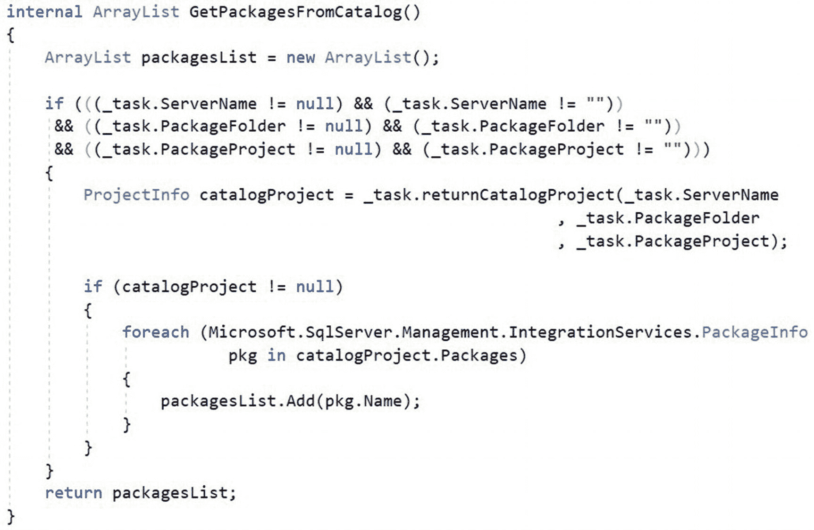

*图 17-33：添加 GetPackagesFromCatalog 方法*

`GetPackagesFromCatalog` 方法构造并填充一个 `ArrayList` 类型的变量，该变量包含先前配置的 SSIS 目录项目中托管的 SSIS 目录包列表。

下一步是添加一个方法，用 `GetPackagesFromCatalog` 方法返回的内容填充 `Packages` 集合属性，然后刷新 `SettingsView` 属性网格。名为 `updatePackages` 的新方法的代码在清单 17-20 中：

```csharp
private void updatePackages()
{
if ((settingsNode.SourceConnection != "")
&& (settingsNode.Folder != "")
&& (settingsNode.Project != ""))
{
settingsNode.Packages = settingsNode.GetPackagesFromCatalog();
this.settingsPropertyGrid.Refresh();
}
}
// 清单 17-20
// 添加 updatePackages 方法
```

添加后，代码如图 17-34 所示：

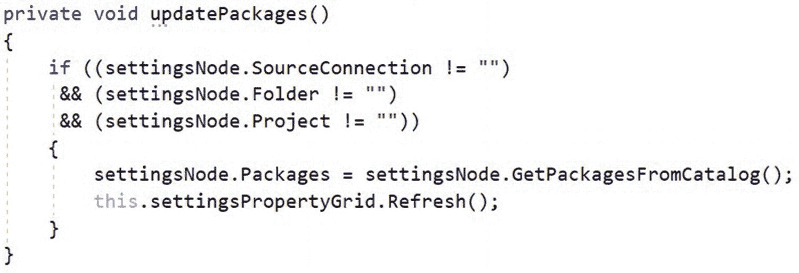

*图 17-34：updatePackages 方法已添加*

下一步是使用清单 17-21 中的代码，在 `updateCollections` 方法中添加对 `updatePackages` 方法的调用：

```csharp
private void updateCollections()
{
Cursor = Cursors.WaitCursor;
updateFolders();
updateProjects();
updatePackages();
Cursor = Cursors.Default;
}
// 清单 17-21
// 更新 updateCollections 方法
```

添加后，代码如图 17-35 所示：

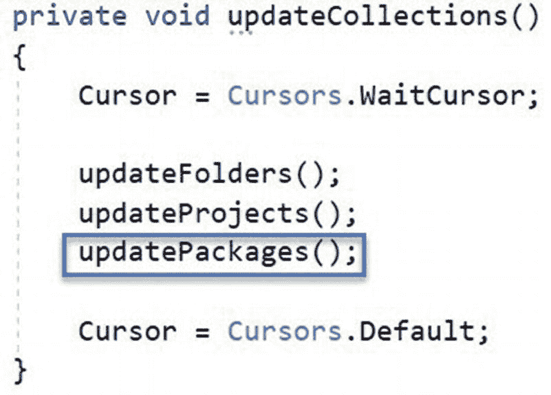

*图 17-35：集中调用以更新文件夹、项目和包集合*

对 `Packages` 集合的更新在最初选择或更新 `Project` 属性时才有意义。在前面的章节中，我们在 `propertyGridSettings_PropertyValueChanged` 方法中添加了代码，以便在 `Folder` 或 `Project` 属性值更改时调用 `updateCollections` 方法。下一步是通过将清单 17-22 中的代码添加到 `SettingsView.propertyGridSettings_PropertyValueChanged` 方法中，在 `Package` 属性值更改时，在 `propertyGridSettings_PropertyValueChanged` 方法中添加对 `updateCollections` 方法的调用：

```csharp
if (e.ChangedItem.PropertyDescriptor.Name.CompareTo("Package") == 0)
{
updateCollections();
}
// 清单 17-22
// 添加代码以响应 Package 属性的更改
```

添加后，代码如图 17-36 所示：

## 响应属性变化与重置集合

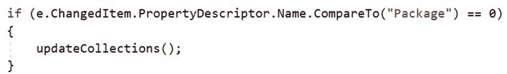

图 17-36

添加代码以响应`Package`属性的更改

要测试此功能，请构建`ExecuteCatalogPackageTask`解决方案，在测试 SSIS 项目中打开一个测试 SSIS 包，向控制流画布添加一个执行目录包任务（Execute Catalog Package Task），打开任务编辑器，并配置`SourceConnection`、文件夹和项目。配置好`SourceConnection`、文件夹和项目后，`Package`属性应填充有 SSIS 目录包的名称，如图 17-37 所示：

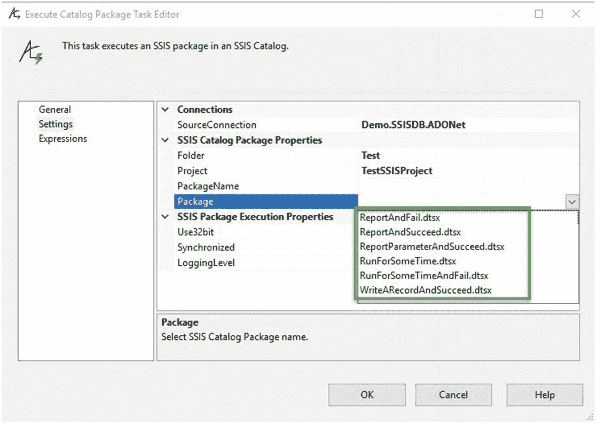

图 17-37

包列表

下一步是隐藏`PackageName`属性。要隐藏`PackageName`属性，只需注释掉`PackageName`属性声明，方法是选择代码，按住`Ctrl`键，然后按`K`键，再按`C`键。所选代码将被注释掉，如图 17-38 所示：

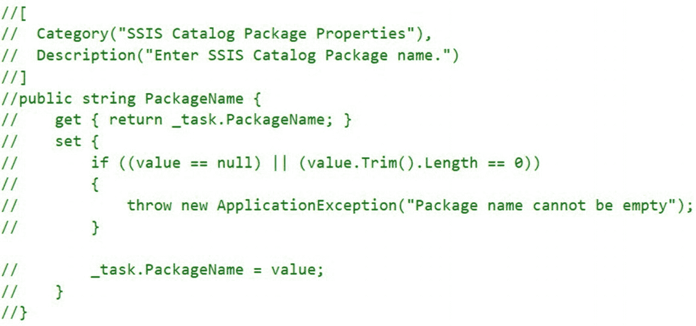

图 17-38

被注释掉的`PackageName`属性

下一步是更新`SettingsView.OnCommit`方法，将代码行`theTask.PackageName = settingsNode.PackageName;`更新为`theTask.PackageName = settingsNode.Package;`，如图 17-39 所示：

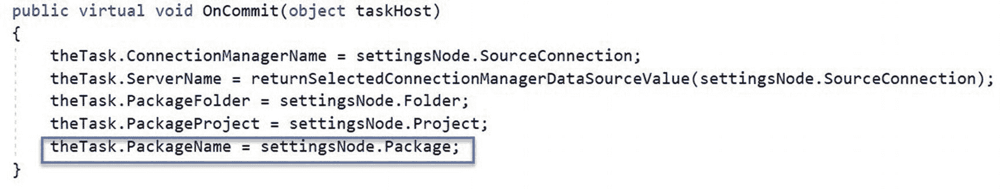

图 17-39

更新`PackageName`属性赋值

构建并测试`ExecuteCatalogPackageTask`解决方案。任务编辑器上的“设置”视图现在应如图 17-40 所示：

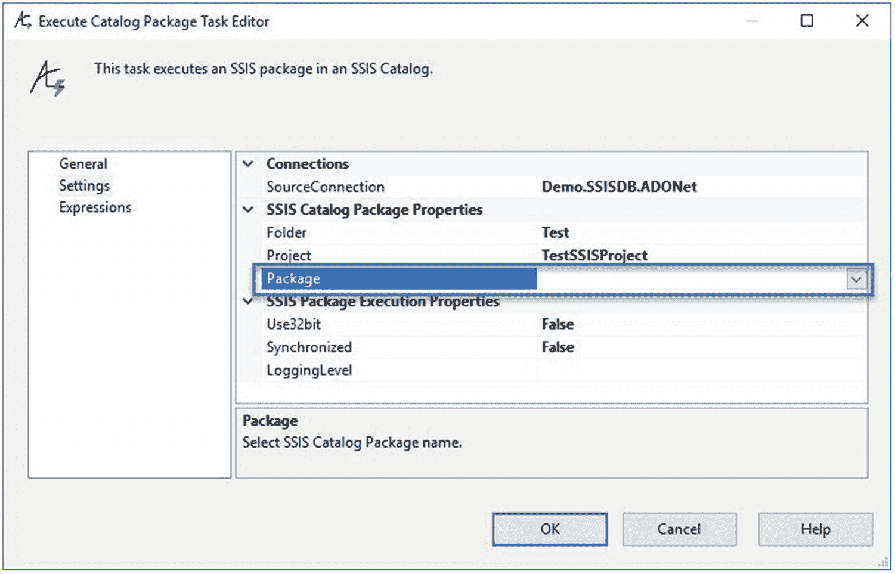

图 17-40

`Package`属性

现在，`Package`和`Packages`集合属性已配置完毕。

现在是签入代码的绝佳时机。

### 重置集合

重置集合很重要，因为它使得在编辑时，`SourceConnection` -> `Folder` -> `Project` -> `Package`的层次结构更易于管理。使用清单 17-23 中的代码在`SettingsView`类中实现`resetCollections`方法：

```csharp
private void resetCollections(string collectionName)
{
    Cursor = Cursors.WaitCursor;
    switch (collectionName)
    {
        default:
            break;
        case "Connections":
            settingsNode.Folder = "";
            settingsNode.Project = "";
            settingsNode.Package = "";
            break;
        case "Folders":
            settingsNode.Project = "";
            settingsNode.Package = "";
            break;
        case "Projects":
            settingsNode.Package = "";
            break;
    }
    Cursor = Cursors.Default;
}
```
清单 17-23
添加`SettingsView.resetCollections`方法

添加后，代码如图 17-41 所示：

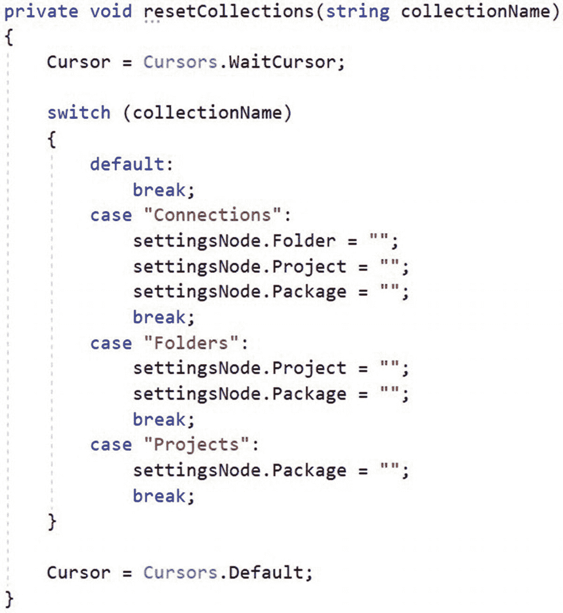

图 17-41

添加`SettingsView.resetCollections`方法

`resetCollections`方法是如何工作的？一个名为`collectionName`的`string`类型参数被传递给`resetCollections`方法。在`resetCollections`方法内部，光标首先被设置为`WaitCursor`，而在方法退出前，光标被重置为`Default`光标。

一个由`collectionName`参数值驱动的`switch`语句被夹在这两次光标“设置”之间。层次结构是`SourceConnection` -> `Folder` -> `Project` -> `Package`。`switch`语句包含对应于“Connections”、“Folders”和“Projects”的情况（case）。

“Connections”情况将`settingsNode.Folder`、`settingsNode.Project`和`settingsNode.Package`属性值重置为空字符串。“Folders”情况将`settingsNode.Project`和`settingsNode.Package`属性值重置为空字符串。“Projects”情况将`settingsNode.Package`属性值重置为空字符串。

下一步是将调用`resetCollections`方法的代码添加到`SettingsView.propertyGridSettings_PropertyValueChanged`方法的响应代码中，用于`SourceConnection`、`Folder`和`Project`属性，如图 17-42 所示：

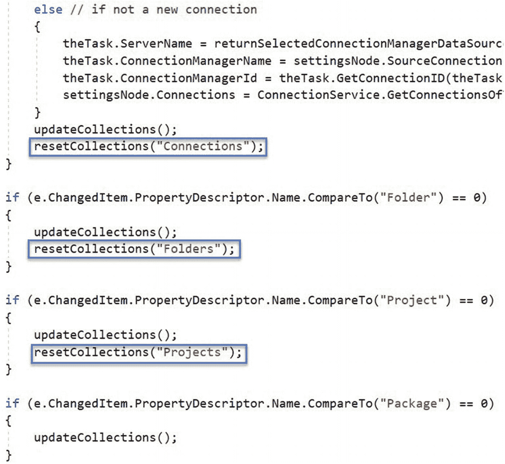

图 17-42

添加对`resetCollections`方法的调用

通过构建`ExecuteCatalogPackageTask`，打开一个测试 SSIS 包，然后向控制流 surface 添加一个执行目录包任务来测试`resetCollections`方法。打开执行目录包任务编辑器并配置一个 SSIS 包执行，如图 17-43 所示：

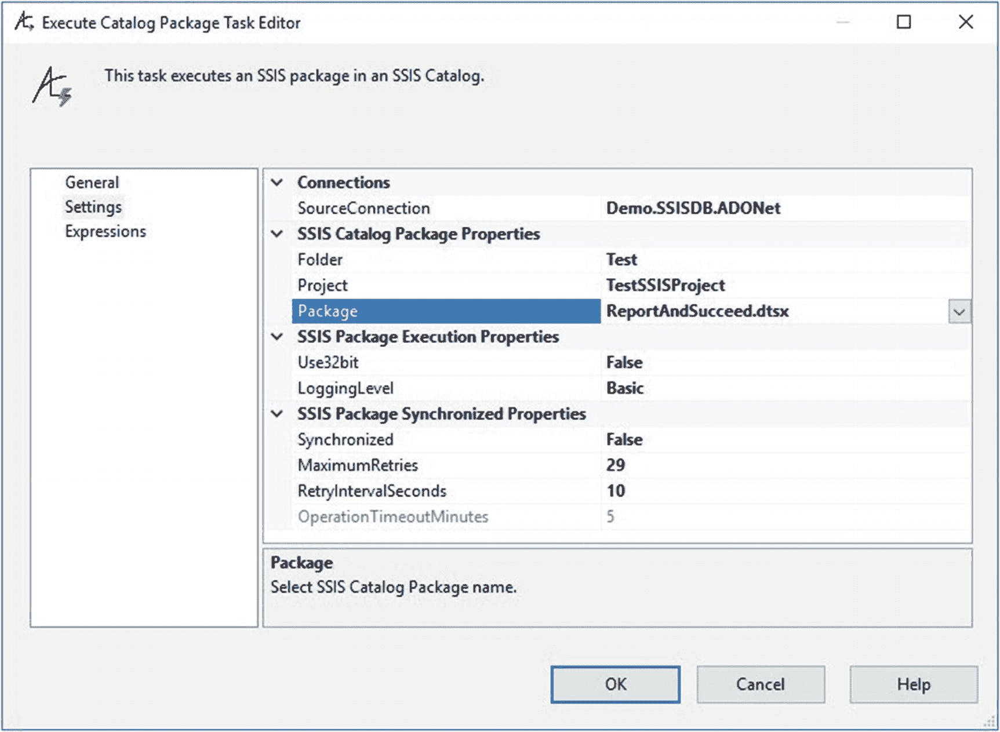

图 17-43

配置好的 SSIS 包执行

通过从下拉列表中选择一个不同的`Project`来测试`resetCollections`方法对`Project`的响应，如图 17-44 所示：

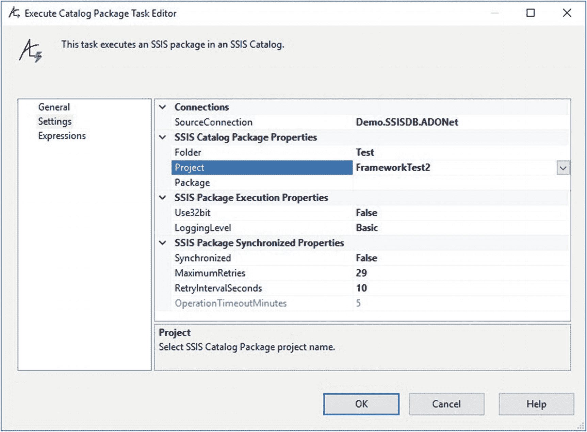

图 17-44

`Project`属性值更改时`Package`属性重置

通过从下拉列表中选择一个不同的`Folder`来测试`resetCollections`方法对`Folder`的响应，如图 17-45 所示：

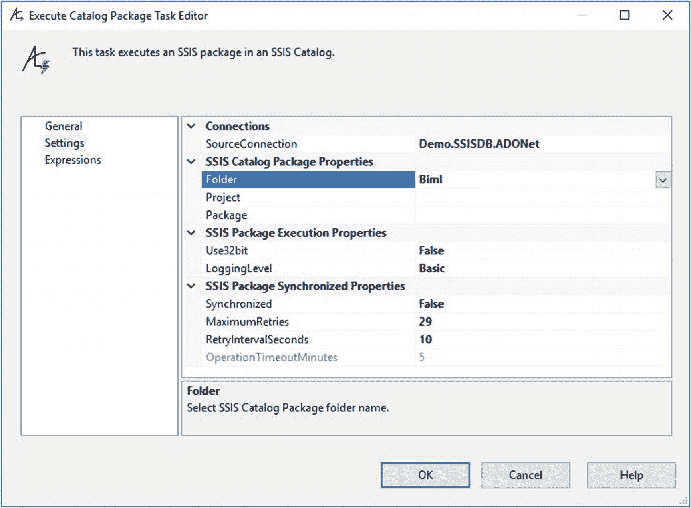

图 17-45

`Folder`属性值更改时`Project`属性重置

通过从下拉列表中选择一个不同的`SourceConnection`来测试`resetCollections`方法对`SourceConnection`的响应，如图 17-46 所示：

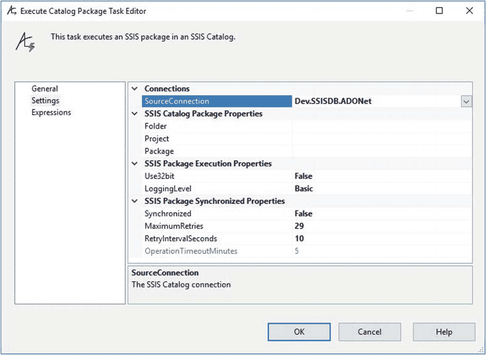

图 17-46

`SourceConnection`属性值更改时`Folder`属性重置

`resetCollections`方法按设计工作。


## 让我们测试表达式！

目前，该代码尚无法在 `Azure-SSIS` 集成运行时中执行 `执行目录包任务`。不过，我们可以使用**表达式**。

要测试表达式，请向你的测试 `SSIS` 包中添加三个 `String` 数据类型的变量，分别命名为 `Folder`、`Project` 和 `Package`，如图 17-47 所示：

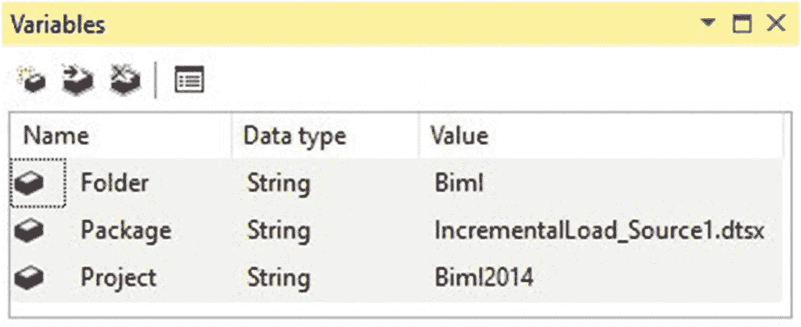
图 17-47

添加 `Folder`、`Project` 和 `Package` `SSIS` 变量

配置每个变量的值，以匹配你的 `SSIS` 目录中的一个 `Folder` ➤ `Project` ➤ `Package` 路径。你的值将与此处显示的不同。

在你的测试 `SSIS` 包中配置一个 `执行目录包任务`，以执行部署到 `SSIS` 目录的包，如图 17-48 所示：

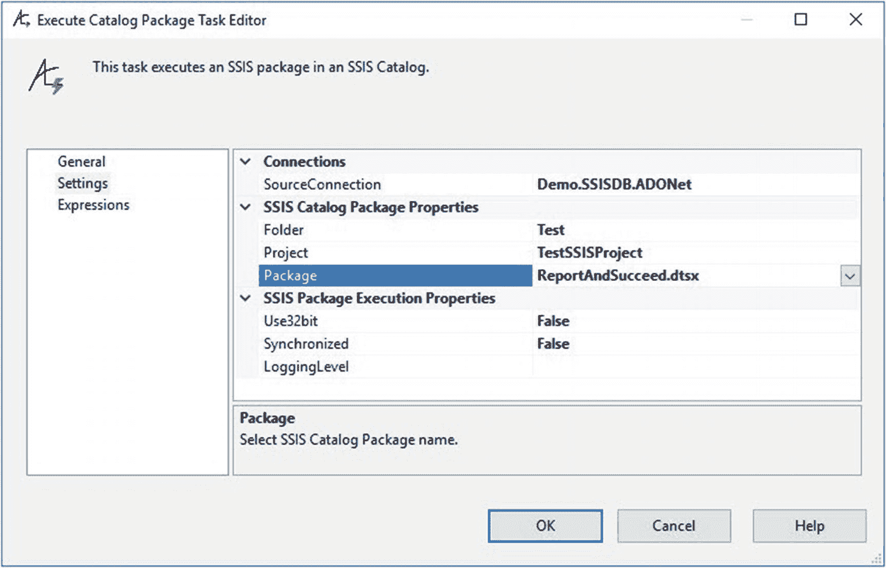
图 17-48

一个已配置的 `执行目录包任务`

下一步是点击左侧列表中的 `表达式` 以打开 `表达式` 视图，如图 17-49 所示：

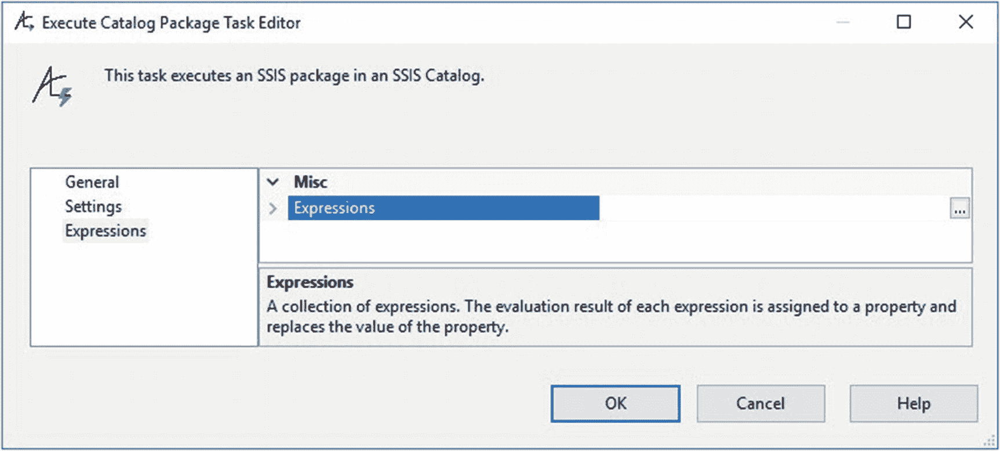
图 17-49

`表达式` 视图

点击 `表达式` 属性（集合）值右侧的省略号，以打开 `属性表达式编辑器` 对话框，如图 17-50 所示：

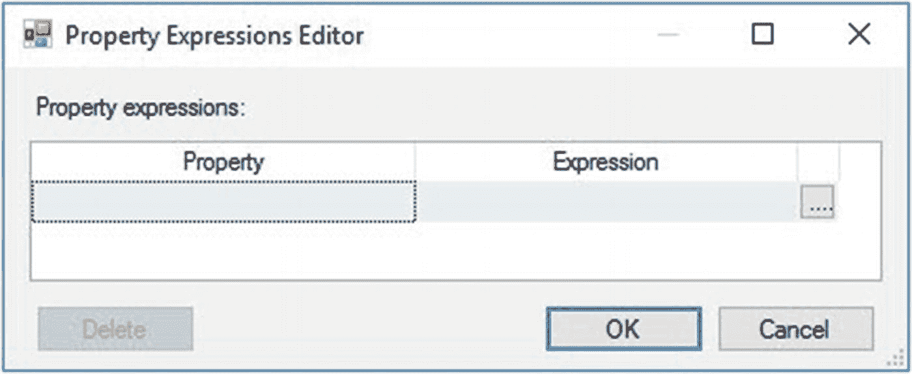
图 17-50

`属性表达式编辑器`

点击 `属性` 下拉菜单并选择 `PackageFolder`，如图 17-51 所示：

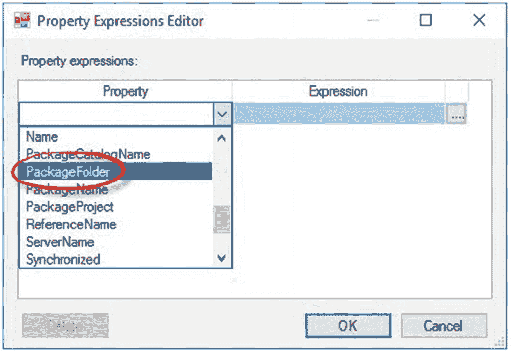
图 17-51

选择 `PackageFolder` 属性

配置 `PackageFolder` 属性表达式的下一步是点击 `表达式` 值文本框旁边的省略号，如图 17-52 所示：

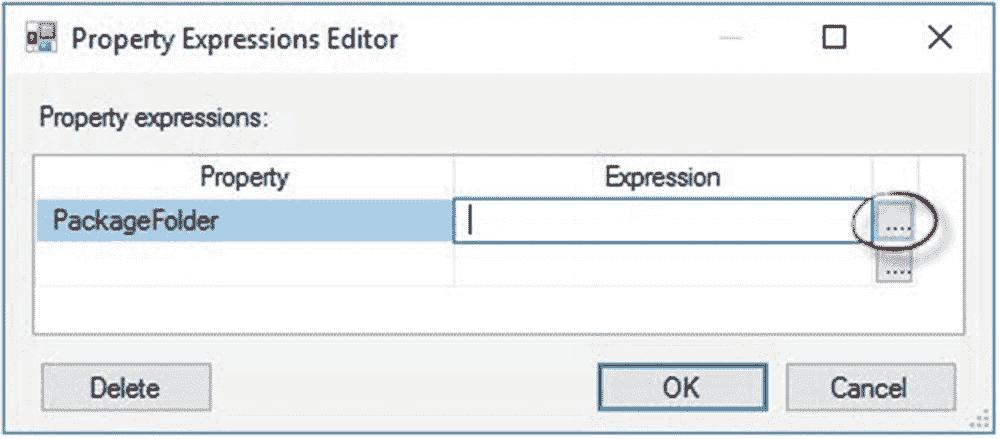
图 17-52

为 `PackageFolder` 属性配置表达式

点击 `表达式` 值文本框旁边的省略号将打开 `表达式生成器` 对话框。展开 `变量和参数` 虚拟文件夹并选择 `User::Folder` `SSIS` 变量，如图 17-53 所示：

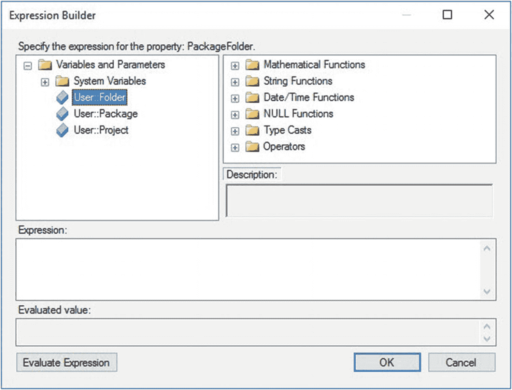
图 17-53

选择 `User::Folder` `SSIS` 变量

将 `User::Folder` `SSIS` 变量拖拽到 `表达式` 文本框中。点击 `计算表达式` 按钮，并在 `计算值` 文本框中观察 `User::Folder` `SSIS` 变量的默认值，如图 17-54 所示：

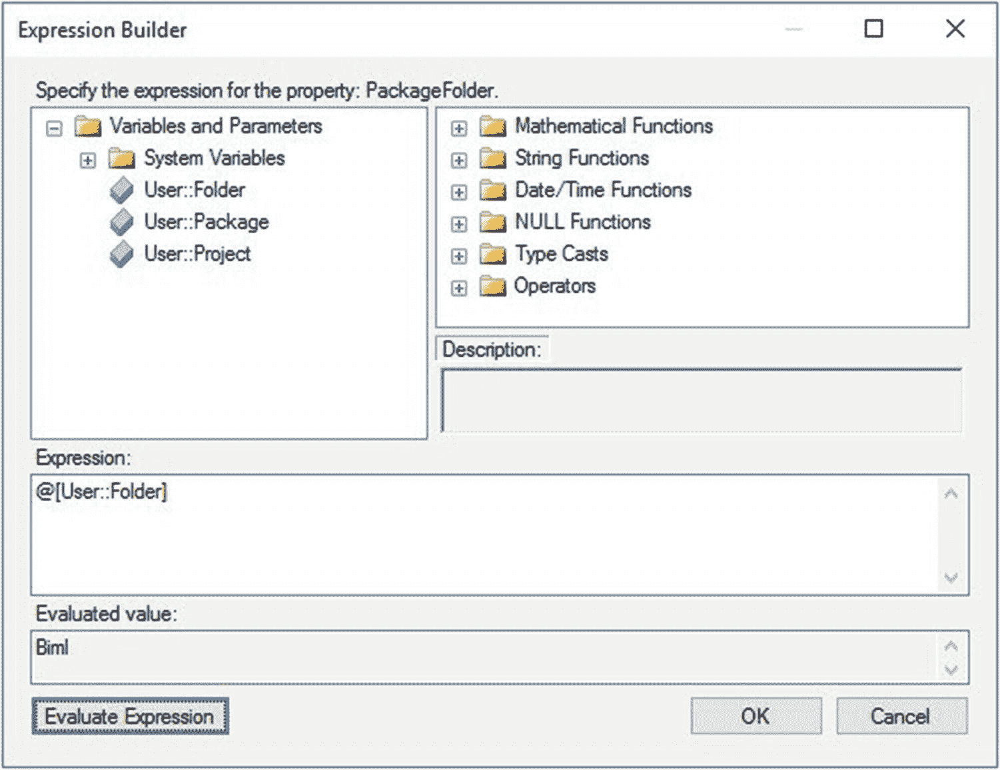
图 17-54

已选择并计算 `User::Folder` `SSIS` 变量

点击 `确定` 按钮关闭 `表达式生成器` 对话框。请注意，`PackageFolder` 属性的属性表达式值现在已配置为 `User::Folder` `SSIS` 变量，如图 17-55 所示：

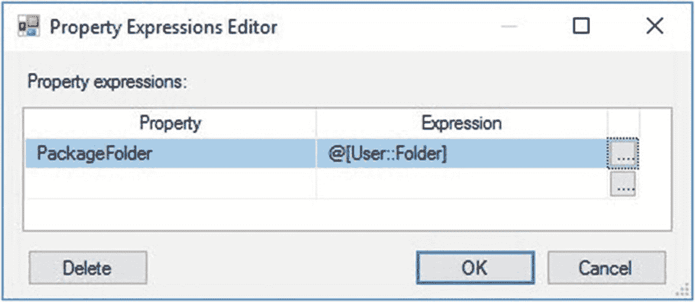
图 17-55

`User::Folder` `SSIS` 变量已分配给 `PackageFolder` 属性

在执行时，`User::Folder` `SSIS` 变量中的值将覆盖 `PackageFolder` 属性。

重复此过程，将 `PackageProject` 属性分配给 `User::Project` `SSIS` 变量值，并将 `PackageName` 属性分配给 `User::Package` `SSIS` 变量值，如图 17-56 所示：

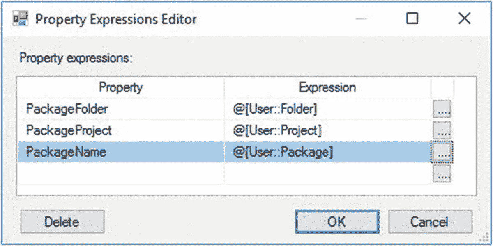
图 17-56

`PackageProject` 和 `PackageName` 属性分别分配给 `User::Project` 和 `User::Package` `SSIS` 变量

执行测试 `SSIS` 包。如果一切按计划进行，测试执行将成功，如图 17-57 所示：


图 17-57

一次成功的测试执行

检查 `所有执行` 报告，以验证 `Folder` ➤ `Project` ➤ `Package` 路径与你测试 `SSIS` 包的变量中配置的值相匹配，如图 17-58 所示：

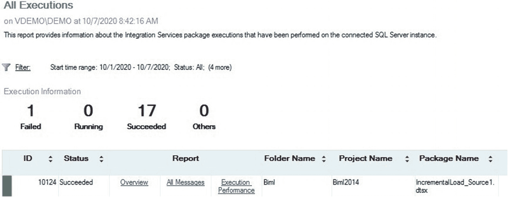
图 17-58

表达式测试成功

`SSIS` 表达式驱动的属性覆盖是一种强大的机制，可用于重用一个 `SSIS` 包来执行多个企业数据集成操作。

### 结论

在本章中，我们通过提供预先填充的文件夹、项目和包列表，使包路径管理更加健壮。我们使用表达式测试了重构后的属性，它们工作正常！

现在是一个签入代码的好时机。

