# 18. 插桩与验证

*插桩* 是工程学的一个子学科，最初指从工业过程中收集物理数据。在软件工程中，插桩指的是展现软件设置、状态和性能关键指标的艺术与科学。

*验证* 是检查值以确保这些值处于可用状态的过程。在 `执行目录包任务` 的上下文中，某些属性*必须*使用非空且非默认值进行配置。

在本章中，我们将为 `执行目录包任务` 添加插桩和验证功能。

### 插桩

最基本的形式下，插桩是代码与开发者和操作员“对话”的方式——它向开发者和操作员通报操作的状态。就 `执行目录包任务` 而言，期望该任务能告知开发者和操作员 `SSIS` 目录包是否成功执行。


## 添加插桩

在 `ExecuteCatalogPackageTask` 解决方案的 `ExecuteCatalogPackageTask` 项目中，打开 `ExecuteCatalogPackageTask.cs` 文件，并使用清单 18-1 中的代码，在 `ExecuteCatalogPackageTask` 类中创建一个名为 `logMessage` 的新函数：

```csharp
private void logMessage(
IDTSComponentEvents componentEvents
, string messageType
, int messageCode
, string subComponent
, string message)
{
bool fireAgain = true;
switch(messageType)
{
default:
break;
case "Information":
componentEvents.FireInformation(messageCode, subComponent, message, "", 0, ref fireAgain);
break;
case "Warning":
componentEvents.FireWarning(messageCode, subComponent, message, "", 0);
break;
case "Error":
componentEvents.FireError(messageCode, subComponent, message, "", 0);
break;
}
}
```

*清单 18-1 添加 logMessage*

添加后，代码如图 18-1 所示：

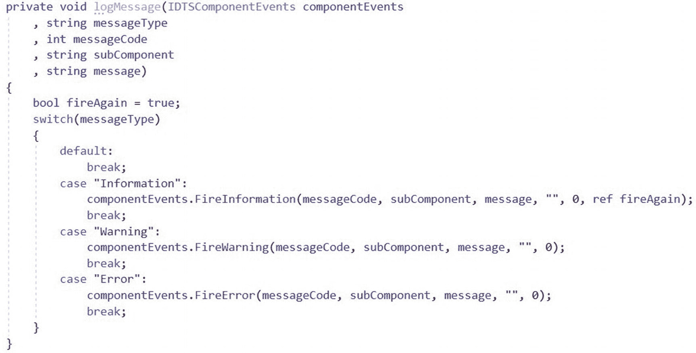

*图 18-1 logMessage 函数*

## 添加“已启动”和“已完成”消息

使用清单 18-2 中的代码，向 `Execute` 方法添加一个进程“已启动”信息消息：

```csharp
string packagePath = "\\SSISDB\\" + PackageFolder + "\\"
+ PackageProject + "\\"
+ PackageName;
string msg = "Starting " + packagePath + " on " + ServerName;
logMessage(componentEvents, "Information", 1001, TaskName, msg);
```

*清单 18-2 添加一个进程“已启动”消息*

添加后，代码如图 18-2 所示：

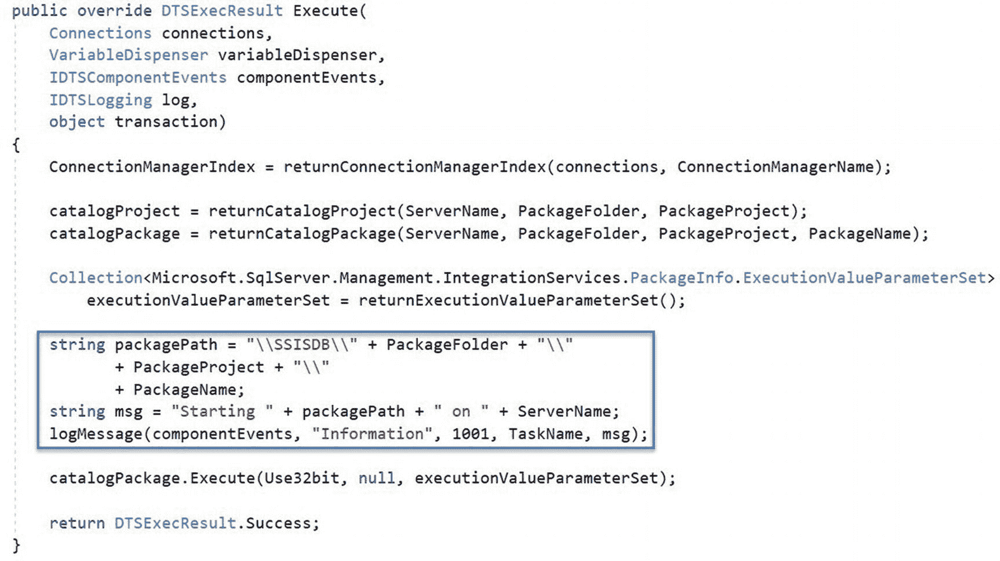

*图 18-2 添加“已启动”消息*

使用清单 18-3 中的代码添加一个“已完成”消息：

```csharp
msg = packagePath + " on " + ServerName + " completed";
logMessage(componentEvents, "Information", 1002, TaskName, msg);
```

*清单 18-3 添加一个“已完成”消息*

添加后，代码如图 18-3 所示：

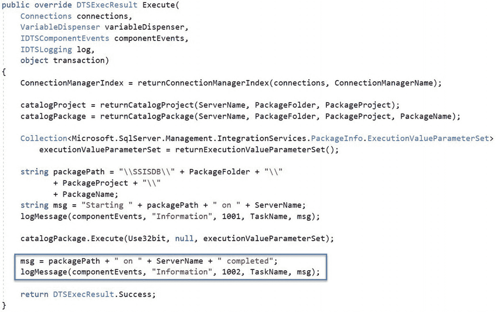

*图 18-3 添加“已完成”消息*

## 根据执行模式进行优化

构建并测试“执行目录包任务”，观察“执行结果”选项卡，如图 18-4 所示：

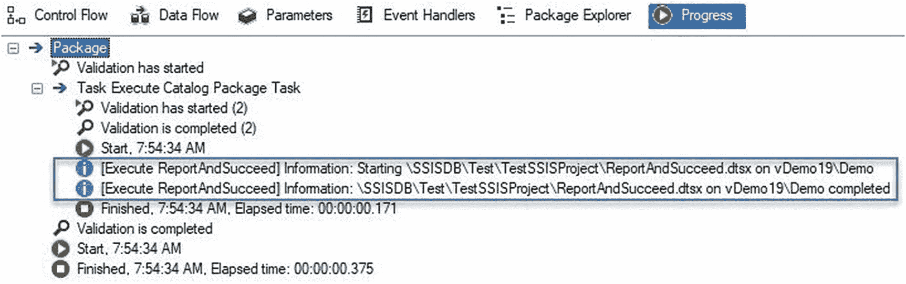

*图 18-4 观察消息*

代码按设计执行并报告，但报告代码设计不准确。当“执行目录包任务”在 SSIS 目录中执行 SSIS 包时，`Synchronized` 执行参数控制 `package.Execute()` 方法的行为。如果 `Synchronized` 为 false（默认值），SSIS 目录会查找该包，然后从执行中返回。如果 `Synchronized` 为 true，SSIS 目录会 *在进程中* 执行该包，仅当 SSIS 包在 SSIS 目录中执行完成后才从执行中返回。这个消息应该突出显示，因此将 `logMessage` 方法中的 `messageType` 参数从 “Information” 更改为 “Warning”。

当前的“已完成”消息不准确。使用清单 18-4 中的代码更新“已完成”消息逻辑：

```csharp
msg = packagePath + " on " + ServerName
+ (Synchronized ? " completed." : " started. Check SSIS Catalog Reports for package execution results.");
logMessage(componentEvents, "Warning", 1002, TaskName, msg);
```

*清单 18-4 更新“已完成”消息*

添加后，代码如图 18-5 所示：

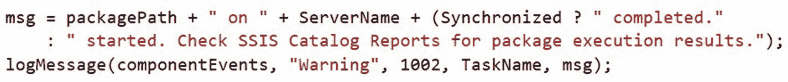

*图 18-5 更新后的“已完成”消息和消息类型*

构建 `ExecuteCatalogPackageTask` 解决方案，并将“执行目录包任务”添加到测试 SSIS 项目中，配置为执行 `Synchronized` 属性设置为 False 的包。执行完成后，查看“执行结果/进度”选项卡以找到新更新的（且更准确的）“已完成”消息，如图 18-6 所示：

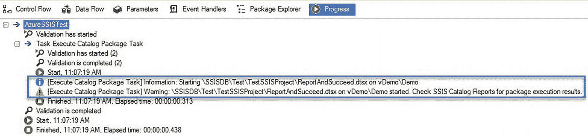

*图 18-6 新的“已完成”消息*

## 添加执行时间插桩

“已完成”消息还应包含执行时间插桩，并且可以通过实现清单 18-5 中的代码将消息标记为警告而非信息：

```csharp
Stopwatch sw = new Stopwatch();
sw.Start();
.
.
.
sw.Stop();
string swMsg = String.Empty;
if(Synchronized)
{
swMsg = " Package Execution Time: " + sw.Elapsed.ToString();
}
msg = packagePath + " on " + ServerName + (Synchronized ?
(" completed." + swMsg.Substring(0, (swMsg.Length - 4))) :
(" started. Check SSIS Catalog Reports for package execution results."));
logMessage(componentEvents, (Synchronized ? "Information" : "Warning"), 1002, TaskName, msg);
```

*清单 18-5 添加执行时间和警告*

添加后，代码如图 18-7 所示：

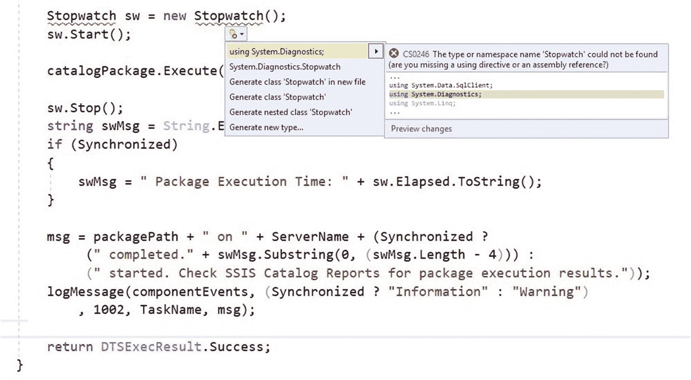

*图 18-7 再次更新“已完成”消息*

如前所述，缺少一个指令，但 Visual Studio 知道我们需要的是 `using System.Diagnostics;` 指令。使用快速操作添加 `using System.Diagnostics;` 指令。添加后，代码如图 18-8 所示：

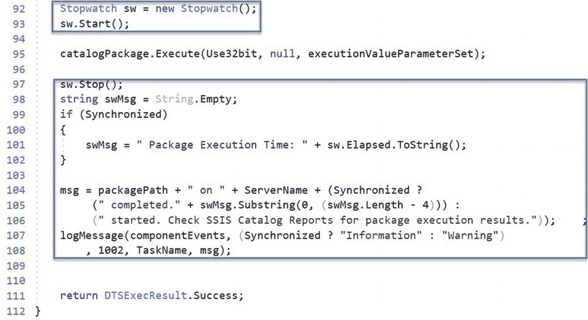

*图 18-8 添加 using System.Diagnostics; 指令后的更新消息代码*

`Stopwatch` 是 `System.Diagnostics` .Net Framework 程序集的一个成员，它允许开发人员测量两个事件之间经过的时间。名为 `sw` 的 `Stopwatch` 类型变量在第 92 行声明并初始化。`sw` `Stopwatch` 变量在第 93 行启动，就在第 95 行调用名为 `catalogPackage` 的 `PackageInfo` 变量的 `Execute` 方法之前。

`Execute` 方法返回后，`Stopwatch` 在第 97 行停止。名为 `swMsg` 的字符串变量在第 98 行声明并初始化为空字符串。如果包是以 `Synchronized` 属性设置为 true 执行的（第 99 行），则 `swMsg` `string` 变量会填充一条消息，以告知开发人员和操作员由名为 `sw` 的 `Stopwatch` 变量捕获的包执行所用时间。

名为 `msg` 的 `string` 变量在第 104-106 行被填充，以 `packagePath` 字符串变量与字面字符串值 `" on "` 连接开始，后跟 `ServerName` 属性的值。

如果 `Synchronized` 属性设置为 true——意味着代码 *等待* 直到 SSIS 包执行完成后才到达此行代码——`" completed."` 和 `swMsg` `string` 变量的值会连接到 `msg` 变量的值。如果 `Synchronized` 属性设置为 false——意味着代码找到 SSIS 包并继续执行（也称为“发射后不管”）——则 `" started. Check SSIS Catalog Reports for package execution results."` 会连接到 `msg` 变量的值。


if-then-else 功能由三元条件运算符控制：`<表达式> ? <为真时> : <为假时>`。该表达式的求值结果必须为 `true` 或 `false`。表达式部分就是 `Synchronized` 属性，这是一个布尔值。三元运算的“为真时”操作是 `(" completed." + swMsg.Substring(0, (swMsg.Length - 4)))`，它构建了一条消息，用于告知开发人员和操作员程序包执行已用的时间。`swMsg.Length – 4` 这段代码截断了毫秒级的已用时间。三元运算的“为假时”操作是 `(" started. Check SSIS Catalog Reports for package execution results."))`，它构建了一条消息，告知开发人员和操作员程序包已开始异步执行，他们应该去其他地方查看程序包执行结果。

在第 107 行可以找到另一个不同的三元条件操作，它检查 `Synchronized` 属性的值以确定是返回 `Information` 还是 `Warning` messageType。

### 让我们测试一下！

要进行测试，请构建任务解决方案，并配置一个 Execute Catalog Package Task，将其 `Synchronized` 属性设置为 `False`。执行完成后，查看 Execution Results/Progress 选项卡，可以找到新近再次更新的“ended”消息，如图 18-9 所示：

`../images/449652_2_En_18_Chapter/449652_2_En_18_Fig9_HTML.jpg`
图 18-9
新的、新的“ended”消息

Execute Catalog Package Task 的插桩现在会输出“start”和“ended”消息。

将 Execute Catalog Package Task 的 `Synchronized` 属性设置为 `true`，如图 18-10 所示：

`../images/449652_2_En_18_Chapter/449652_2_En_18_Fig10_HTML.jpg`
图 18-10
将 Execute Catalog Package Task 的 Synchronized 属性设置为 true

执行测试 SSIS 程序包并查看 Progress/Execution Results 选项卡，如图 18-11 所示：

`../images/449652_2_En_18_Chapter/449652_2_En_18_Fig11_HTML.jpg`
图 18-11
同步执行插桩

插桩是降低总拥有成本的一种好方法。向开发人员和操作员提供准确及时的反馈，可以减少确定故障或失败根本原因所需的时间。

## 验证

验证对于防止尝试执行配置不当的代码尤为重要。验证是主动进行的，并且应遵循属性层次结构。让我们从 `SourceConnection` ➤ `Folder` ➤ `Project` ➤ `Package` 层次结构的顶部开始，通过验证 `SourceConnection` 属性入手。

### 验证 SourceConnection 属性

我们首先测试 `SourceConnection` 属性中是否存在值，如果不存在则引发异常。回顾一下，`SettingsNode.SourceConnection` 属性设置 `ExecuteCatalogPackageTask.ConnectionManagerName` 属性，如清单 18-6 中的代码所示（另见清单 13-23）：

```
[
Category("Connections"),
Description("The SSIS Catalog connection"),
TypeConverter(typeof(ADONetConnections))
]
public string SourceConnection {
get { return _task.ConnectionManagerName; }
set { _task.ConnectionManagerName = value; }
}
清单 18-6
SettingsNode 的 SourceConnection 属性
```

当 `SourceConnection` 属性更改时，`SettingsView.propertyGridSettings_PropertyValueChanged` 中的代码使用清单 18-7 中的代码更新 `ExecuteCatalogPackageTask.ConnectionManagerName` 属性（另见清单 13-27）：

```
theTask.ServerName = returnSelectedConnectionManagerDataSourceValue(settingsNode.SourceConnection);
清单 18-7
更新 ExecuteCatalogPackageTask 的 ServerName 属性
```

`ExecuteCatalogPackageTask` 的 `ConnectionManagerName` 和 `ServerName` 属性初始化为 `String.Empty`，如清单 18-8 所示：

```
public string ConnectionManagerName { get; set; } = String.Empty;
.
.
.
public string ServerName { get; set; } = String.Empty;
清单 18-8
与 SourceConnection 相关的属性初始化为 String.Empty
```

`ExecuteCatalogPackageTask` 的 `Validate` 方法由 SSIS 执行引擎调用。因此，我们的验证代码应放在 `ExecuteCatalogPackageTask` 的 `Validate` 方法中。

通过使用清单 18-9 中的代码测试 `ConnectionManagerName` 和 `ServerName` 属性值是否为非空字符串，开始验证 `SourceConnection` 属性：

```
// test for SourceConnection (ConnectionManagerName and ServerName) existence
if((ConnectionManagerName == "") || (ServerName == ""))
{
throw new Exception("Source Connection property is not configured.");
}
清单 18-9
开始验证 SourceConnection
```

添加后，`Validate()` 如图 18-12 所示：

`../images/449652_2_En_18_Chapter/449652_2_En_18_Fig12_HTML.jpg`
图 18-12
已更新的 Validate 方法

构建 `Execute Catalog Package Task` 解决方案，并通过将 `Execute Catalog Package Task` 添加到测试 SSIS 程序包来测试更新后的任务版本，如图 18-13 所示：

`../images/449652_2_En_18_Chapter/449652_2_En_18_Fig13_HTML.jpg`
图 18-13
测试最新版本的 Execute Catalog Package Task

有两个值得注意的变更：

1.  `Execute Catalog Package Task` 现在指示一个错误状态。
2.  错误列表指示两个错误。“根源”错误列在错误列表窗口的第二位，内容为：Validation error. Execute Catalog Package Task: The Validate method on the task failed, and returned error code 0x80131500 (Source Connection property is not configured.). The Validate method must succeed and indicate the result using an “out” parameter.

`../images/449652_2_En_18_Chapter/449652_2_En_18_Fig14_HTML.jpg`
图 18-14
清理验证错误

错误检查——以及验证——代码应该*永不*失败。`Try-catch` 功能可以优雅地处理代码执行中的失败。我们不应该在逻辑中抛出异常，而应该利用最近添加的插桩功能来告知开发人员验证问题。

使用清单 18-10 中的代码重构 `Validate` 方法：


```
public override DTSExecResult Validate(
Connections connections,
VariableDispenser variableDispenser,
IDTSComponentEvents componentEvents,
IDTSLogging log)
{
// 初始化 validateResult
DTSExecResult validateResult = DTSExecResult.Success;
// 测试 SourceConnection (ConnectionManagerName 和 ServerName) 是否存在
try
{
if ((ConnectionManagerName == "") || (ServerName == ""))
{
logMessage(componentEvents
, "Error"
, -1001
, TaskName
, "源连接属性未配置。");
validateResult = DTSExecResult.Failure;
}
}
catch(Exception ex)
{
if(componentEvents != null)
{
// 触发一个包含异常详情的通用错误
logMessage(componentEvents
, "Error"
, -1001
, TaskName
, ex.Message);
}
// 管理 validateResult 状态
validateResult = DTSExecResult.Failure;
}
return validateResult;
}
```
**代码清单 18-10**
重构后的 Validate

一旦重构完成，`Validate()` 方法如图 18-15 所示：

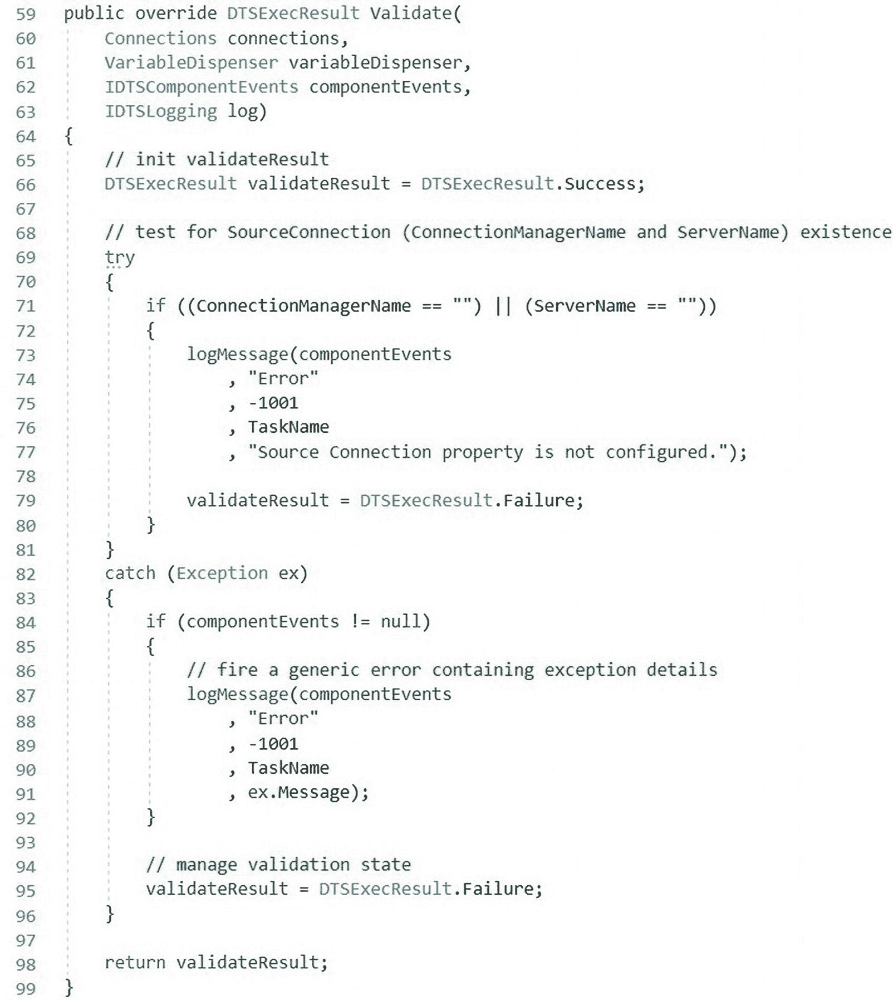

**图 18-15**
Validate，已重构

重构后的 `Validate()` 方法在第 66 行声明并初始化了一个名为 `validateResult` 的 `DTSExecResult` 类型变量。`validateResult` 变量在整个 `Validate()` 方法中管理验证状态——参见第 79 行和第 95 行——并在第 98 行从 `Validate()` 方法返回。

第 69 行启动了一个 `try` 代码块，涵盖了第 71-81 行的代码。

第 71 行的代码测试 `ConnectionManagerName` 和 `ServerName` 属性是否为非空字符串值。如果在 `ConnectionManagerName` 和 `ServerName` 属性中检测到非空字符串值，则代码调用 `logMessage` 函数，该函数在 SSIS 包中触发一个错误事件。

`catch` 代码块从第 82 行开始，涵盖了第 83-96 行的代码。

第 84 行的代码检查传递给 `Validate()` 方法的 `componentEvents` 参数是否不为 null。如果不为 null，则调用 `logMessage` 函数来引发一个错误事件，该事件包含由 `try` 代码块中的代码引发的任何*其他*错误的详细信息。

综合来看，这种验证设计模式检查一个特定条件，回答“SourceConnection 属性是否配置了值？”这个问题。如果 SourceConnection 属性*未*配置值，则会在 SSIS 包中引发错误。如果在检查 SourceConnection 属性是否配置值时发生任何其他错误，`catch` 代码块会引发一个配置为报告错误消息的错误事件。如果 SourceConnection 属性*已*配置值，并且在检查过程中未发生其他错误，则 `Validate()` 方法返回一个 `Success DTSExecResult` 值。

和之前一样，构建解决方案，并使用测试 SSIS 包测试更新后的 ExecuteCatalogPackageTask 功能。

一旦 SourceConnection 属性配置完成，`Validate()` 方法将不显示错误，如图 18-16 所示：

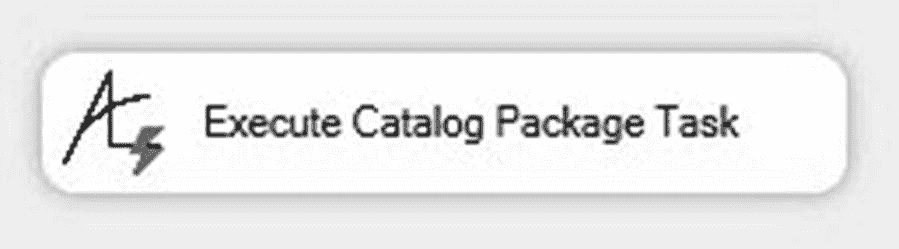

**图 18-16**
已验证的 SourceConnection 属性

`ConnectionManagerName` 和 `ServerName` 属性值的验证逻辑按设计工作。

### 构建连接验证辅助函数

下一步是确保 Execute Catalog Package Task 能够连接到由 `ConnectionManagerName` 和 `ServerName` 属性值配置的 SSIS 目录。验证连接将需要几个*辅助*函数。添加代码清单 18-11 中的 `returnConnection` 和 `attemptConnection` 辅助函数：

```
private SqlConnection returnConnection()
{
return (SqlConnection)Connections[ConnectionManagerId].AcquireConnection(null);
}
private bool attemptConnection(Connections connections
, int connectionManagerIndex)
{
bool ret = false;
try
{
using (System.Data.SqlClient.SqlConnection con = returnConnection())
{
if (con.State != System.Data.ConnectionState.Open)
{
con.Open();
}
ret = true;
}
}
catch (Exception ex)
{
ret = false;
}
return ret;
}
```
**代码清单 18-11**
连接验证辅助函数：returnConnection 和 attemptConnection

为了支持连接管理器连接字符串覆盖，`returnConnection` 返回一个通过调用 `Connections` 集合对象的 `AcquireConnection` 方法获得的 `SqlConnection`，该集合对象使用 `ConnectionManagerId` 值定义。如果连接管理器连接到 Azure SQL Database 实例——这可能需要用户名和密码（SQL 登录）——将 `AcquireConnection` 方法返回值转换为 `SqlConnection` 可能是获取此连接的唯一方法。

`returnConnection` 方法用于设置在调用 `attemptConnection` 方法时 Execute Catalog Package Task 所使用的连接。`attemptConnection` 在任务属性 `Validate` 过程的早期被调用。

添加后，`returnConnection` 和 `attemptConnection` 辅助函数如图 18-17 所示：

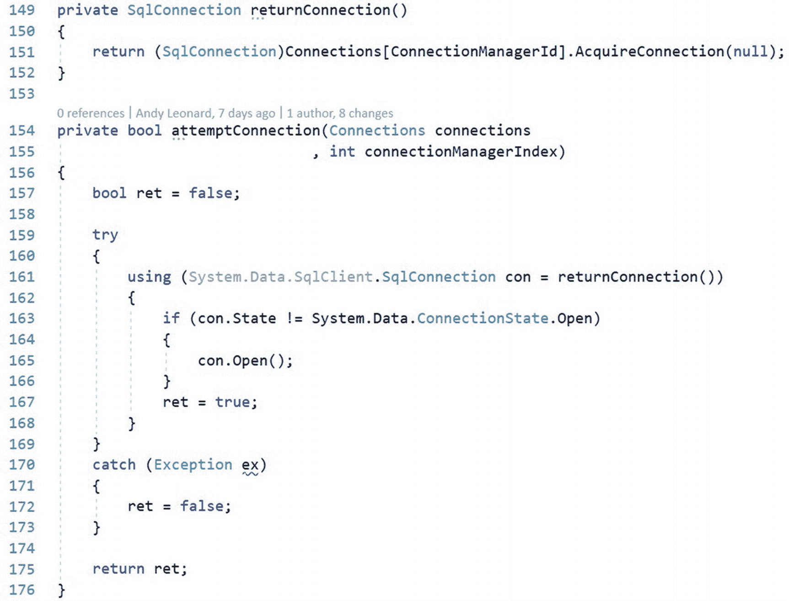

**图 18-17**
attemptConnection 辅助函数

`returnConnection` 方法的返回值是一个 `SqlConnection`。`returnConnection` 方法中的代码只有一行，但那一行代码*很繁忙*。让我们来解析一下这行代码。

SSIS 连接管理器的 `AcquireConnection` 方法返回一个 `SqlConnection` 类型值。可以连接到托管在 Azure SQL DB 中的 SSIS 目录。本书后面，我们将更详细地介绍使用 Execute Catalog Package Task 来执行部署到 Azure 数据工厂 (ADF) SSIS 集成运行时 (IR)（通常称为“Azure-SSIS”）的 SSIS 包。虽然托管在本地的 SSIS 目录需要 Windows 身份验证才能进行交互（部署、执行），但可以使用 SQL 登录与托管在 Azure SQL DB 上的 SSIS 目录进行交互。连接管理器*从不*公开密码。使用登录名建立到 Azure SQL DB 的连接的一种方法——也许是唯一的方法——是调用连接管理器的 `AcquireConnection` 方法。

第 151 行的代码返回连接管理器的 `AcquireConnection` 方法，并向其传递 `txn`（事务）`object` 参数的 `null` 值。连接管理器由 `ConnectionManagerId` 标识——这是一个在之前响应 `SourceConnection` 属性值更改时填充的唯一标识符，该更改在 `SettingsView propertyGridSettings_PropertyValueChanged` 方法中被检测到。设置 `ExecuteCatalogPackageTask ConnectionManagerId` 属性有两个调用——一个用于创建新连接时，另一个用于选择现有连接管理器时。设置 `ConnectionManagerId` 的代码行对于两种用例是相同的：`theTask.ConnectionManagerId = theTask.GetConnectionID(theTask.Connections, theTask.ConnectionManagerName);`。`GetConnectionID` 方法内置于 `Microsoft.SqlServer.Dts.Runtime.Task` .NET Framework 程序集中。

`returnConnection` 方法返回一个 `SqlConnection` 类型值，而不管使用何种身份验证方法。

`attemptConnection` 方法的返回值是一个名为 `ret` 的布尔（`bool`）类型变量。`ret` 变量在第 157 行声明并初始化为 `false`。如果在代码能够在第 165 行打开连接——或者在第 163 行发现连接已经打开，则在第 167 行将 `ret` 设置为 `true`。一个 try-catch 块捕获异常，如果发生错误，则在第 172 行将 `ret` 设置为 `false`。`ret` 在第 175 行从函数返回。


## 在 Validate 方法中调用 attemptConnection

下一步是向 Validate 方法中添加逻辑，通过调用 `attemptConnection` 辅助函数（使用清单 18-12 中的代码）来测试 `SourceConnection` 属性与 SSIS 目录的连接性：

```
// attempt to connect
bool connectionAttempt = attemptConnection(connections
, ConnectionManagerIndex);
if (!connectionAttempt)
{
logMessage(componentEvents
, "Error"
, -1002
, TaskName
, "SQL Server Instance Connection attempt failed.");
validateResult = DTSExecResult.Failure;
}
Listing 18-12
调用 attemptConnection
```

添加完成后，代码如图 18-18 所示：

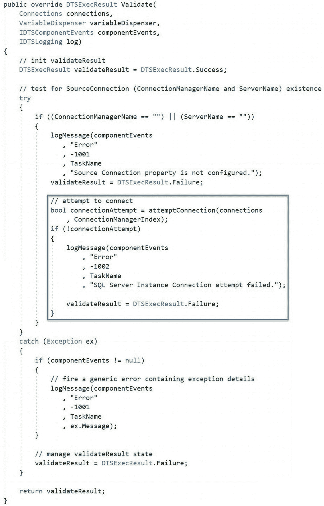

**图 18-18**
调用 `attemptConnection` 辅助函数

## 我如何测试 attemptConnection 验证

要测试 `attemptConnection` 辅助函数，请生成 `ExecuteCatalogPackageTask` 解决方案。我在一台名为 `vDemo19` 的虚拟机上配置了一个名为 “HadACatalog” 的新 SQL Server 实例。我在 `HadACatalog` 实例上创建了一个 SSIS 目录，如图 18-19 所示：

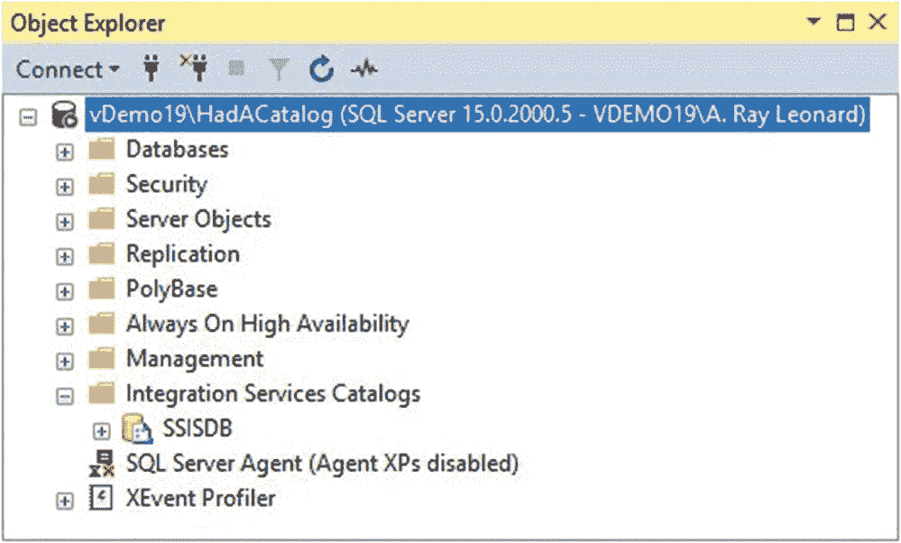

**图 18-19**
`vDemo19\HadACatalog` 上的 SSIS 目录

接着，我在一个测试 SSIS 包中配置了 `Execute Catalog Package Task` 的一个实例，以连接到 `HadACatalog` SQL Server 实例上的 SSIS 目录，保存了测试 SSIS 包，然后关闭了解决方案，如图 18-20 所示：

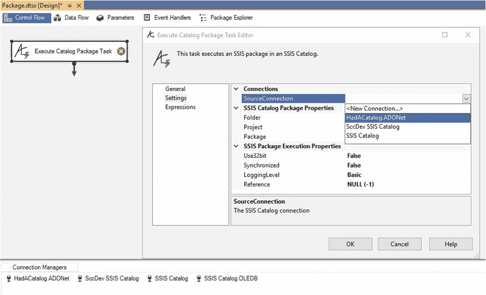

**图 18-20**
配置为使用 `HadACatalog` 实例的 `Execute Catalog Package Task`

接下来，我删除了 `HadACatalog` SQL Server 实例上的 SSIS 目录，如图 18-21 所示：

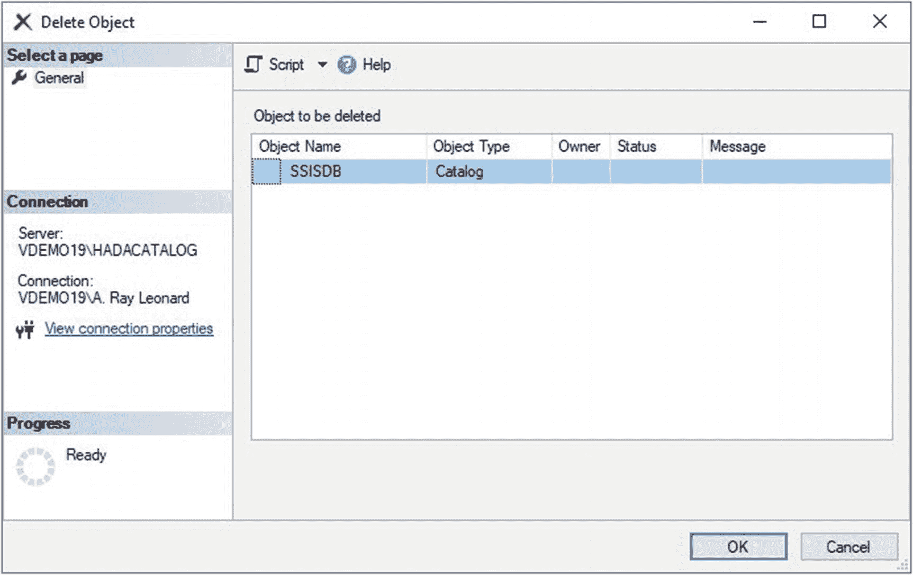

**图 18-21**
正在删除 `HadACatalog` SQL Server 实例上的 SSIS 目录

当我重新打开测试 SSIS 包（并等待连接测试完成后），验证错误消息显示为“SQL Server 实例连接尝试失败”，如图 18-22 所示：

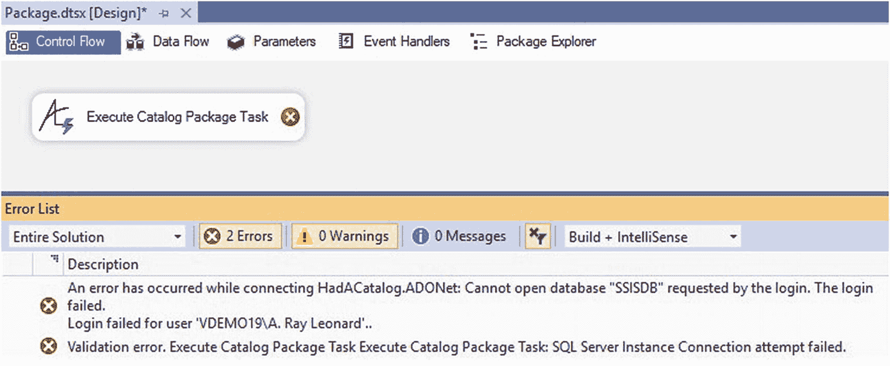

**图 18-22**
`attemptConnection` 验证错误

使用 `attemptConnection` 方法对 `SourceConnection` 属性的验证代码已完成。

下一步是验证必需的 `Folder`、`Project` 和 `Package` 属性。

## 验证 Folder、Project 和 Package 属性

`SourceConnection` 的验证代表了一种为 `Execute Catalog Package Task` 属性（`Folder`、`Project` 和 `Package`）实现验证的良好设计模式。

通过添加清单 18-13 中的代码开始 `Folder` 属性验证：

```
// test for Folder property existence
try
{
if (PackageFolder == "")
{
logMessage(componentEvents
, "Error"
, -1003
, TaskName
, "Folder property is not configured.");
validateResult = DTSExecResult.Failure;
}
// attempt to retrieve folder
CatalogFolder validateFolder = returnCatalogFolder(
ServerName
, PackageFolder);
if (validateFolder == null)
{
logMessage(componentEvents
, "Error"
, -1003
, TaskName
, "Failed to retrieve Catalog Folder.");
validateResult = DTSExecResult.Failure;
}
}
catch (Exception exf)
{
if (componentEvents != null)
{
// fire a generic error containing exception details
logMessage(componentEvents
, "Error"
, -1003
, TaskName
, exf.Message);
}
// manage validateResult state
validateResult = DTSExecResult.Failure;
}
Listing 18-13
添加文件夹验证
```

添加完成后，文件夹验证代码如图 18-23 所示：

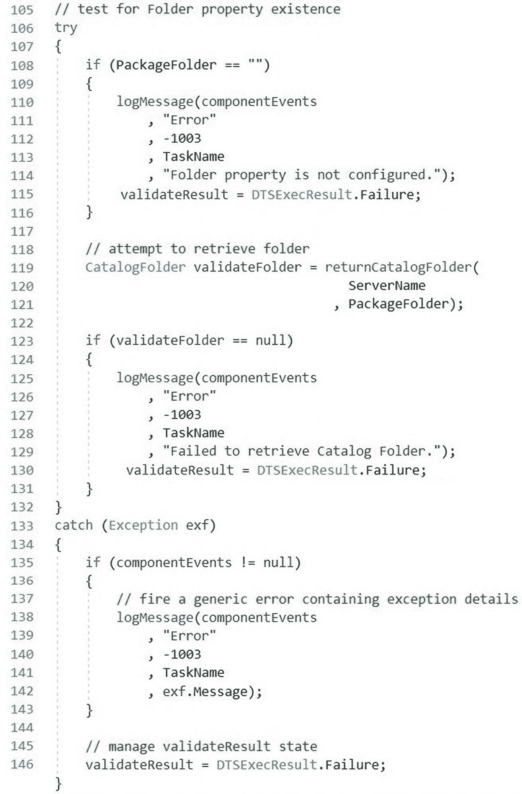

**图 18-23**
`Folder` 验证代码

该代码在第 108 行检查 `PackageFolder` 属性中是否存在值。如果 `PackageFolder` 值是空字符串，则代码引发错误事件。在第 119-121 行，代码尝试使用为 `ServerName` 和 `PackageFolder` 配置的值来配置一个名为 `validateFolder` 的 `CatalogFolder` 对象变量。如果无法配置 `validateFolder` 变量，则其值将为 null。第 123 行的代码测试 `validateFolder` 变量值是否为 null，如果为 null，则引发错误事件。第 133-147 行捕获其他错误条件，如果发生其他错误，则引发错误事件。

`Project` 和 `Package` 属性的验证遵循相同的模式。

使用清单 18-14 中的代码实现 `Project` 验证：

```
// test for Project property existence
try
{
if (PackageProject == "")
{
logMessage(componentEvents
, "Error"
, -1004
, TaskName
, "Project property is not configured.");
validateResult = DTSExecResult.Failure;
}
// attempt to retrieve project
ProjectInfo validateProject = returnCatalogProject(
ServerName
, PackageFolder
, PackageProject);
if (validateProject == null)
{
logMessage(componentEvents
, "Error"
, -1004
, TaskName
, "Failed to retrieve Catalog Project.");
validateResult = DTSExecResult.Failure;
}
}
catch (Exception expr)
{
if (componentEvents != null)
{
// fire a generic error containing exception details
logMessage(componentEvents
, "Error"
, -1004
, TaskName
, expr.Message);
}
// manage validateResult state
validateResult = DTSExecResult.Failure;
}
Listing 18-14
Project 属性验证
```

添加完成后，项目验证代码如图 18-24 所示：

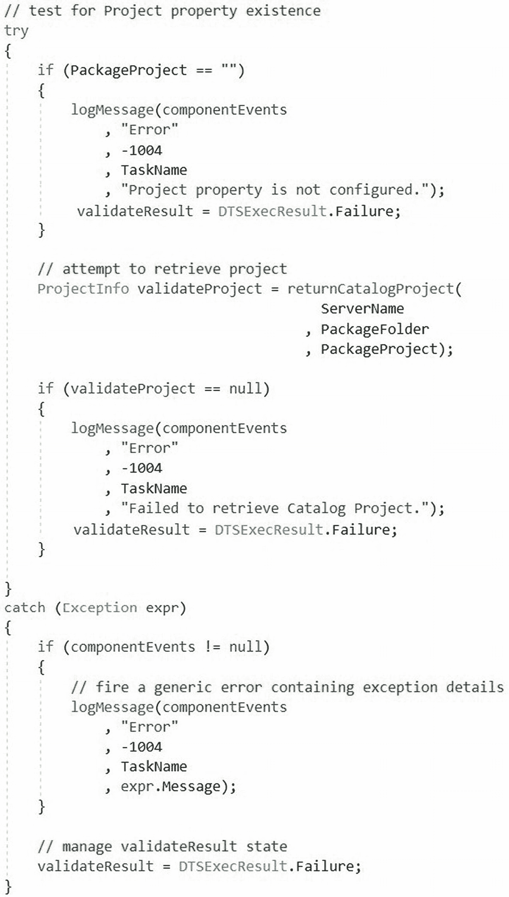

**图 18-24**
`Project` 验证代码

使用清单 18-15 中的代码实现 `Package` 验证：


### 第 18 章 添加验证

```
// 测试 Package 属性是否存在
try
{
    if (PackageName == "")
    {
        logMessage(componentEvents
            , "Error"
            , -1005
            , TaskName
            , "Package property is not configured.");
        validateResult = DTSExecResult.Failure;
    }
    // 尝试检索包
    Microsoft.SqlServer.Management.IntegrationServices.PackageInfo
    validatePackage = returnCatalogPackage(
        ServerName
        , PackageFolder
        , PackageProject
        , PackageName);
    if (validatePackage == null)
    {
        logMessage(componentEvents
            , "Error"
            , -1005
            , TaskName
            , "Failed to retrieve Catalog Package.");
        validateResult = DTSExecResult.Failure;
    }
}
catch (Exception expkg)
{
    if (componentEvents != null)
    {
        // 触发包含异常详情的通用错误
        logMessage(componentEvents
            , "Error"
            , -1005
            , TaskName
            , expkg.Message);
    }
    // 管理 validateResult 状态
    validateResult = DTSExecResult.Failure;
}
```
*列表 18-15. Package 属性验证*

添加后，包验证代码如图 18-25 所示：

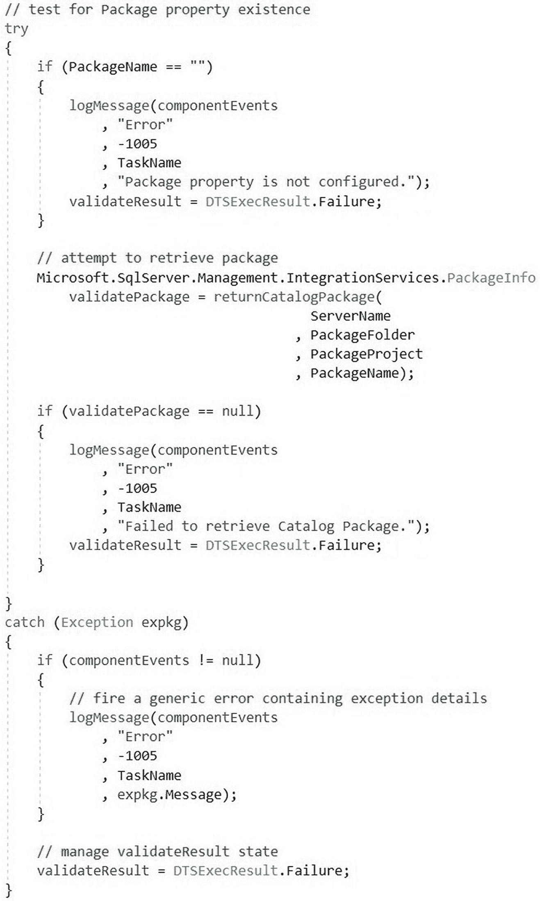
*图 18-25. 包验证代码*

文件夹、项目和包属性的验证代码现已完成。构建`ExecuteCatalogPackageTask`解决方案，然后将“Execute Catalog Package Task”添加到一个测试 SSIS 包中。根据当前编写的验证逻辑，向测试 SSIS 包中添加“Execute Catalog Package Task”比之前耗时更长。验证通过后，该任务会引发多个错误，如图 18-26 所示：

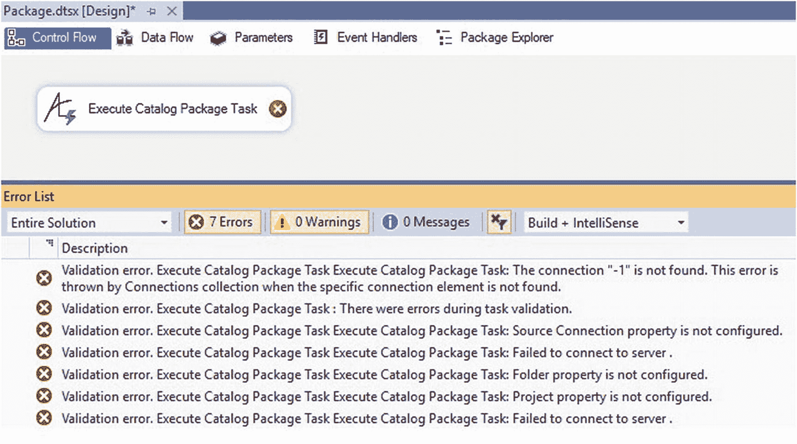
*图 18-26. 添加 Execute Catalog Package Task 时引发的错误*

由于被验证的属性具有层级关系（SourceConnection ➤ 文件夹 ➤ 项目 ➤ 包），如果层级中*较高*的属性无效，则尝试验证*较低*层级的属性是没有意义的。纠正验证行为的一种方法是：在验证后续属性之前，检查`validateResult DTSExecResult`变量的值，方法是在文件夹、项目和包验证代码之前添加列表 18-16 中的条件语句：

```
if (validateResult != DTSExecResult.Failure)
{
    .
    .
    .
}
```
*列表 18-16. 检查 validateResult DTSExecResult 变量的值*

应用到文件夹属性验证后，代码如图 18-27 所示：

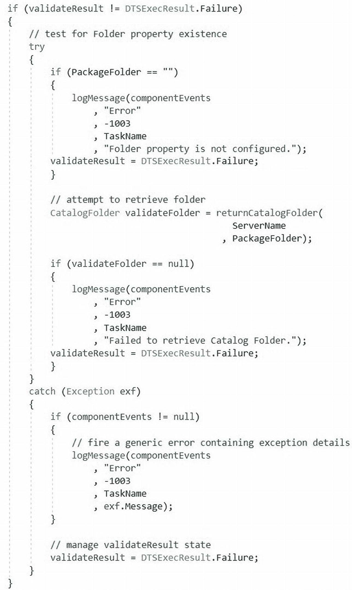
*图 18-27. 将 validateResult 条件应用于文件夹属性*

检查`validateResult`变量的值是有效的，因为每个属性验证都会在属性无效时将`validateResult`设置为`DTSExecResult.Failure`。

构建`ExecuteCatalogPackageTask`解决方案，然后将“Execute Catalog Package Task”添加到一个测试 SSIS 包中。验证完成得更快，并且只测试了`SourceConnection`，如图 18-28 所示：

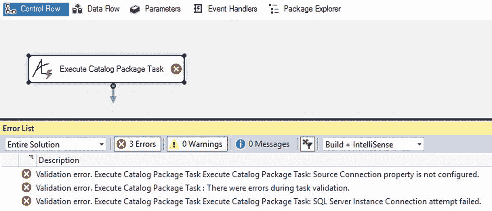
*图 18-28. 更快、更好的验证*

验证代码已完成。

### 结论

在本章中，我们为`ExecuteCatalogPackageTask`解决方案添加了检测和验证功能。

在下一章中，我们将识别并修复两个严重的错误。

现在正是检入（check in）你代码的好时机。

