# 第 19 章 消灭 Bug

Execute Catalog Package Task 的代码中仍存在两个严重的错误：

1.  即使 SSIS 包执行失败，Execute Catalog Package Task 也会报告成功。
2.  如果 SSIS 包执行时间超过 30 秒，`ExecuteCatalogPackageTask.Execute`会返回一条错误消息，内容为：“任务上的 Execute 方法返回错误代码 0x80131904（执行超时。在操作完成或服务器未响应之前超时期限已过。）。Execute 方法必须成功，并使用‘out’参数指示结果。”

两个错误的根本原因都在于`Execute`方法，因此解决方案是结合的。让我们从第二个错误“执行超时”开始。

## 执行超时

为什么`ExecuteCatalogPackageTask.Execute`方法会在 30 秒时超时？我不知道。仅仅因为我不知道或不理解某些功能为什么以这种方式编码，*并不*意味着该功能的编码是错误的。我只是不知道为什么`ExecuteCatalogPackageTask.Execute`方法会在 30 秒时超时。然而，我*确实*需要绕过这个限制。

我找到的解决方案使用了`WaitHandle.WaitAny`方法。


## 线程处理，简而言之

`WaitHandle.WaitAny` 方法是一个线程处理主题，属于 `System.Threading` .NET Framework 命名空间。编写大多数 .NET 应用程序并不需要你精通线程处理，但懂得越多越好。线程管理是一个数据专业人士能够理解的主题。可以想想数据库*事务*。

数据库事务不会允许一个联名银行账户的两个账户持有人仅仅因为他们在完全相同的时间执行取款请求，就将银行账户中的所有资金全部取出。数据库事务会*阻塞*一个取款请求，直到另一个取款请求完成，使第二个取款请求*等待*直到第一个取款请求完成。当第一个取款请求完成其事务时，数据库引擎会通知——或*发出信号*——第二个取款请求，阻塞过程已完成。第二个取款请求随即执行并失败，因为账户已空——第一个取款请求在阻塞第二个取款请求的同时，已将资金从账户中移除。

上一段中强调的术语既涉及数据事务，也涉及线程安全。

如果一个应用程序包含了与数据库事务类似的状态管理功能，则该应用程序被认为是*线程安全*的。一个线程安全的应用程序管理线程安全，就像数据库事务维护原子性一样，以此作为一种保护代码执行并交付准确结果的机制。

线程安全的应用程序通过允许某些代码仅序列化执行，同时管理等待线程的队列来实现原子性。等待线程在轮到它们执行时会收到信号。线程安全的应用程序是多线程功能的核心。更多内容请访问 `docs.microsoft.com/en-us/dotnet/api/system.threading?view=netframework-4.7.2`。

多线程应用程序共享*资源*——这些功能块被编码为*独占*访问，例如银行应用程序中的 `WithdrawFunds()` 方法。一个多线程应用程序通常需要管理多个独占资源来完成执行。`WaitHandle` 管理在相关操作中执行的一组资源，而 `WaitAny` 方法则等待 `WaitHandle` 中*任何*成员发出信号。更多关于 `WaitHandle.WaitAny` 方法的信息请访问 `docs.microsoft.com/en-us/dotnet/api/system.threading.waithandle.waitany?view=netframework-4.7.2`。

`ManualResetEvent` 对象派生自 `WaitHandle` 对象。`ManualResetEvent` 对象的状态是一个布尔值：false 或 true；此状态通过调用 `ManualResetEvent.Set()` 和 `ManualResetEvent.Reset()` 方法来管理。`ManualResetEvent.Reset()` 方法*重置*（将布尔状态设为 *false*），*手动* 阻止任何新出现的线程使用共享资源，让这些线程知道它们必须等待轮到自己执行。`ManualResetEvent.Set()` 方法则向等待的线程*发出信号*（将布尔状态设为 *true*），*手动* 让等待线程知道它们现在可以执行了。

前两句话很重要。在我们接下来处理示例时，你可能需要回头参考本节内容。别灰心。线程处理很难。线程安全更难。

## ExecuteCatalogPackageTask.Execute

SSIS 目录的 `Synchronized` 执行参数 —— 一个布尔值 —— 控制 `ExecuteCatalogPackageTask.Execute` 方法如何从执行中返回。默认的 `Synchronized` 执行参数值为 false，这意味着 `ExecuteCatalogPackageTask.Execute` 方法的功能是“启动并忘记”。如果你在 `Synchronized` 执行参数值设为 false 的情况下启动一个 SSIS 包，该包开始执行，并且 `ExecuteCatalogPackageTask.Execute` 方法几乎立即返回“成功”。由于 `ExecuteCatalogPackageTask.Execute` 方法表现为“启动并忘记”并几乎立即返回“成功”，其默认的 30 秒超时设置不会影响 `Synchronized` 执行参数值设为 false 时执行的 SSIS 包。

`ExecuteCatalogPackageTask.Execute` 方法的 30 秒超时设置仅在使用 `Synchronized` 执行参数值设为 true 执行 SSIS 包时才会成为问题。

因此，基于 `WaitHandle.WaitAny` 的解决方案的实现，仅适用于 `Synchronized` 执行参数值设为 true 时的 SSIS 包执行情况。


## 设计测试用的 SSIS 包

为了测试 `ExecuteCatalogPackageTask.Execute` 方法的 30 秒超时错误，请向一个测试用的 SSIS 项目中添加一个名为 `RunForSomeTime.dtsx` 的新测试 SSIS 包，如图 19-1 所示：

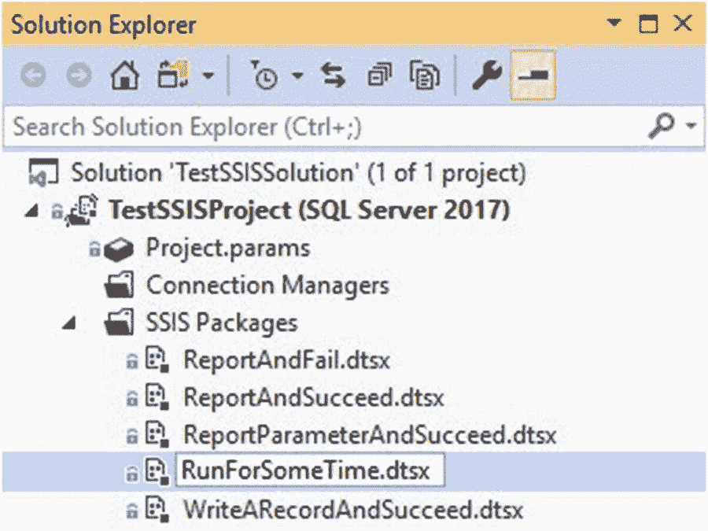

图 19-1：添加 `RunForSomeTime.dtsx` 测试 SSIS 包

添加一个名为 `DelayString`、数据类型为 `String` 的包参数，如图 19-2 所示：

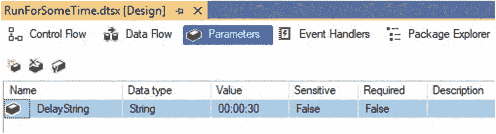

图 19-2：添加 `DelayString` 包参数

添加一个名为 `WaitForQuery`、数据类型为 `String` 的 SSIS 变量。使用清单 19-1 中所示的 T-SQL 语句设置 `WaitForQuery` 的值：

```
WaitFor Delay '00:00:30'
```

清单 19-1：添加 `WaitForQuery` SSIS 变量值

将 T-SQL 语句添加到变量值后，`WaitForQuery` 变量显示如图 19-3 所示：

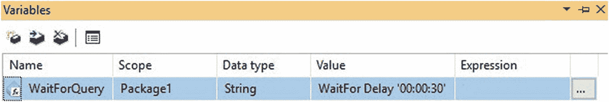

图 19-3：添加 `WaitForQuery` SSIS 变量

单击 `Expression` 文本框旁边的省略号以打开 `Expression Builder` 对话框，然后在 `Expression` 文本框中输入清单 19-2 中的 SSIS 表达式语言语句：

```
"WaitFor Delay '" + @[$Package::DelayString]  + "'"
```

清单 19-2：`WaitForQuery` SSIS 变量表达式

添加后，`WaitForQuery` SSIS 变量表达式显示如图 19-4 所示：

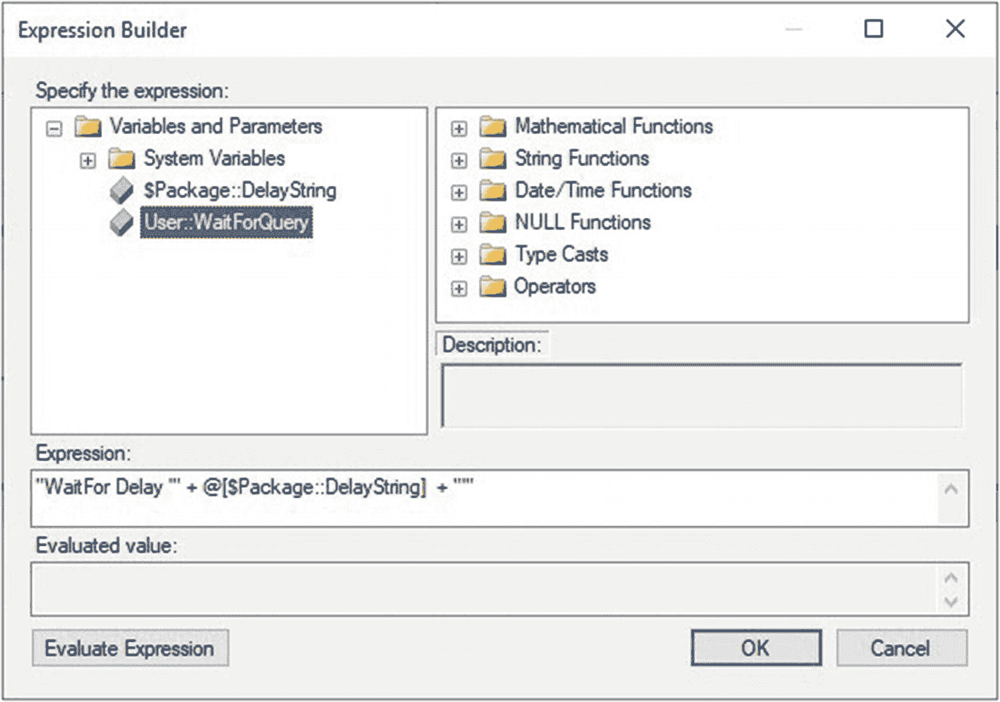

图 19-4：`WaitForQuery` SSIS 变量表达式

单击 `OK` 按钮关闭 `Expression Builder` 对话框。

向 `RunForSomeTime.dtsx` 添加一个 `Execute SQL Task`，并将执行 SQL 任务重命名为“SQL Run for some time”，如图 19-5 所示：

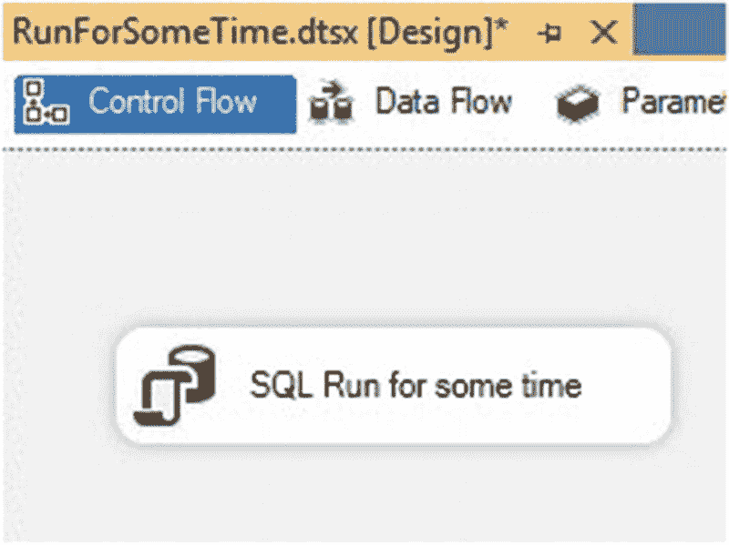

图 19-5：添加 SQL Run for some time `Execute SQL Task`

打开 SQL Run for some time 执行 SQL 任务编辑器，并将 `ConnectionType` 设置为 `ADO.NET`。单击 `Connection` 下拉菜单，然后单击“<New connection…>”。配置一个 `ADO.Net` 连接管理器到*任何*数据库——此包将不会使用配置的连接，但 `Execute SQL Task` 需要配置一个连接管理器。

将 `SQLSourceType` 属性设置为“Variable”。将 `SourceVariable` 属性设置为 `User::WaitForQery` SSIS 变量，如图 19-6 所示：

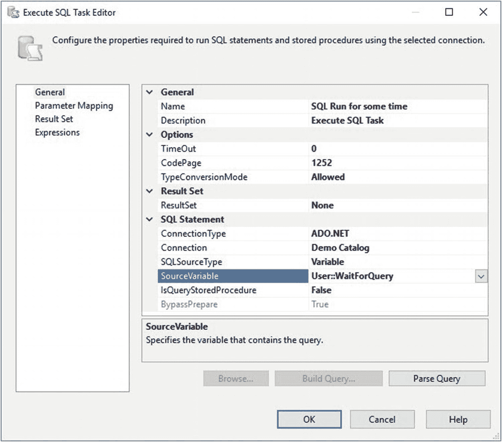

图 19-6：配置 SQL Run for some time 执行 SQL 任务

单击 `OK` 按钮关闭执行 SQL 任务编辑器，然后将 SSIS 项目部署到 SSIS 目录。

接下来，打开 `SSMS` 并连接到您部署了 SSIS 项目的 SSIS 目录。在 `SSMS` 对象资源管理器的 `Integration Services Catalogs` 节点中导航到该 SSIS 项目，右键单击该项目，然后单击 `Configure`，如图 19-7 所示：

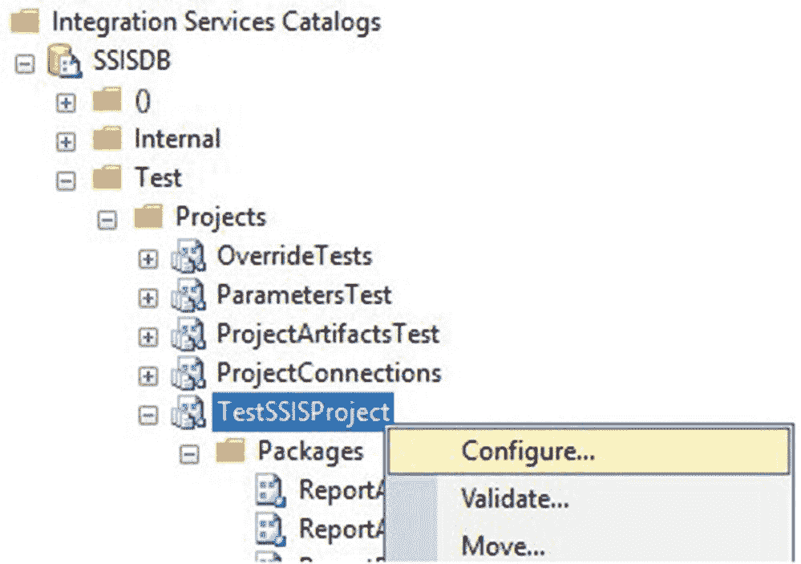

图 19-7：配置 SSIS 项目

当 `Configure` 对话框显示时，单击 `RunForSomeTime.dtsx` SSIS 包的 `DelayString` 参数值旁边的省略号，如图 19-8 所示：

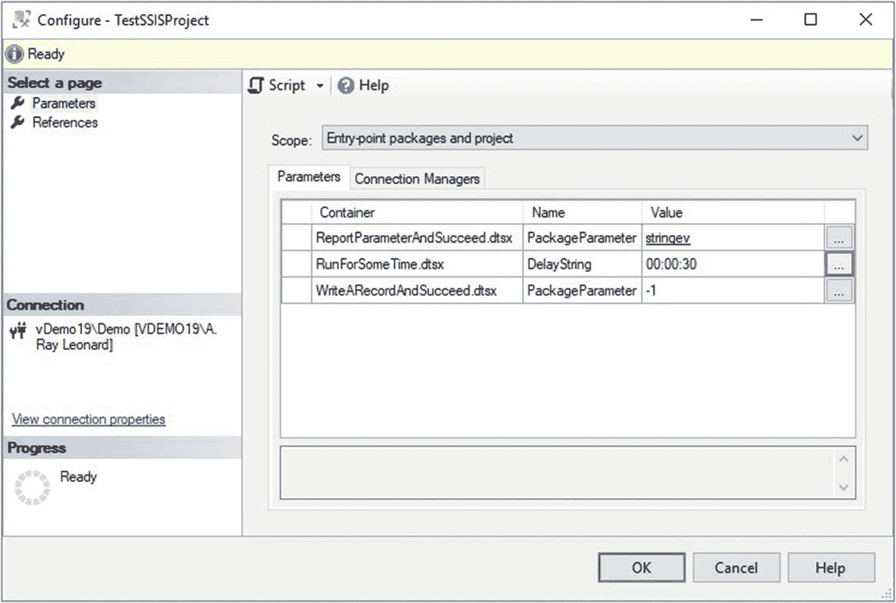

图 19-8：准备覆盖 `RunForSomeTime.dtsx` SSIS 包的 `DelayString` 参数

通过单击“Edit value”选项并在字面量覆盖文本框中输入“00:00:45”来配置 `RunForSomeTime.dtsx` SSIS 包 `DelayString` 参数的字面量覆盖，如图 19-9 所示：

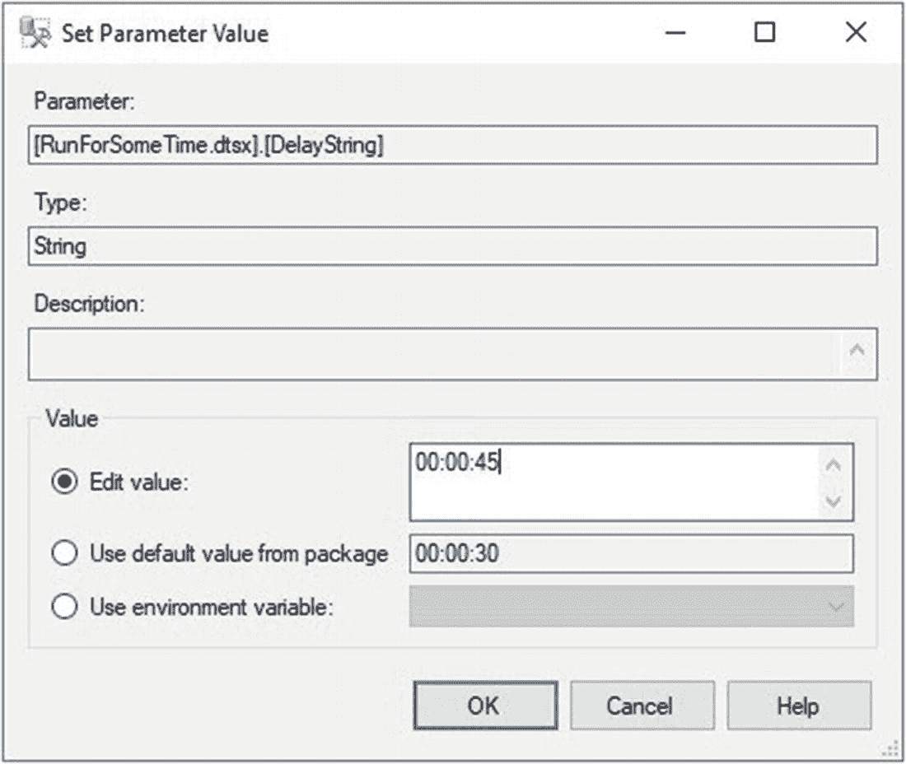

图 19-9：配置 `RunForSomeTime.dtsx` SSIS 包 `DelayString` 参数的字面量覆盖

单击 `OK` 按钮保存字面量覆盖。

打开一个测试用的 SSIS 包，添加一个 `Execute Catalog Package Task`，并配置 `Execute Catalog Package Task` 以执行 `RunForSomeTime.dtsx` SSIS 包。请确保将 `Synchronized` 属性设置为 `false`，如图 19-10 所示：

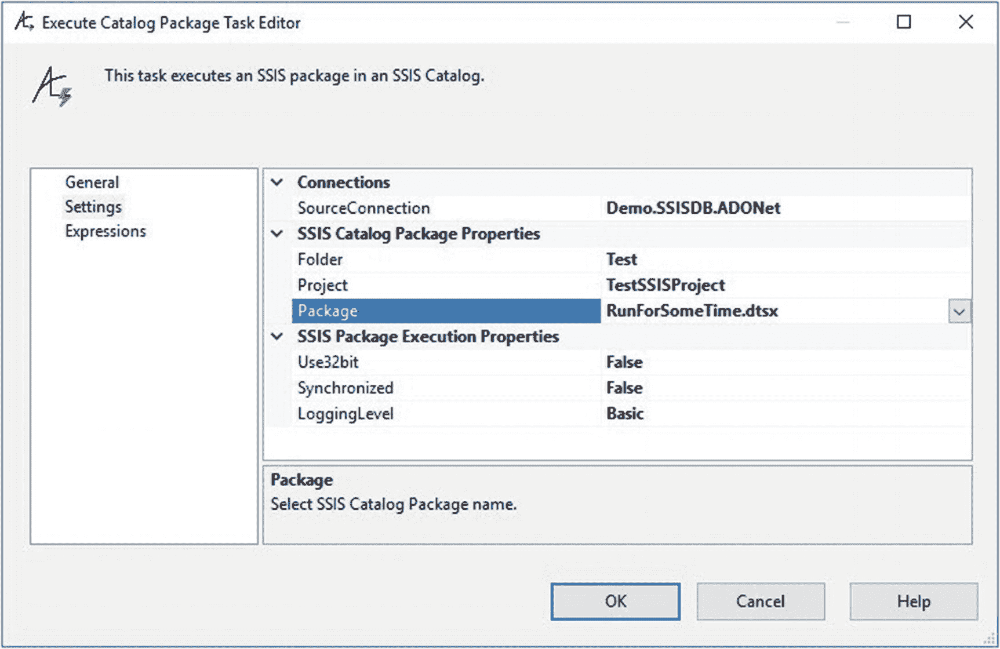

图 19-10：执行 `RunForSomeTime.dtsx` SSIS 包

执行测试用的 SSIS 包，并在执行完成后（如果一切按计划进行，则执行成功）查看 `Progress` 选项卡，如图 19-11 所示：

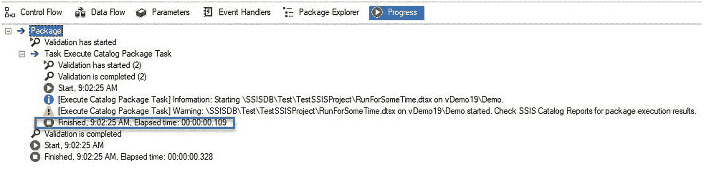

图 19-11：查看 `Progress` 选项卡

请注意，`Execute Catalog Package Task` 报告在不到一秒内完成。

在 `SSMS` 中打开 SSIS 目录报告 `All Executions` 报告，如图 19-12 所示：

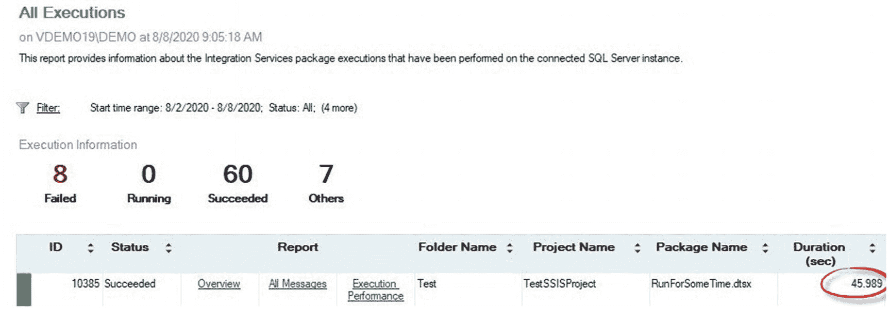

图 19-12：查看 All Executions SSIS 目录报告

请注意，`RunForSomeTime.dtsx` SSIS 包仅执行了 45 秒多一点，这正是之前配置的方式。

返回测试用 SSIS 包的 `Execute Catalog Package Task` 编辑器，并将 `Synchronized` 属性设置为 `True`，如图 19-13 所示：


图 19-13：将 `Synchronized` 属性设置为 true

执行测试用的 SSIS 包。30 秒后，请注意测试 SSIS 包执行失败，错误消息为“The Execute method on the task returned error code 0x80131904 (Execution Timeout Expired. The timeout period elapsed prior to completion of the operation or the server is not responding.)”，如图 19-14 所示：

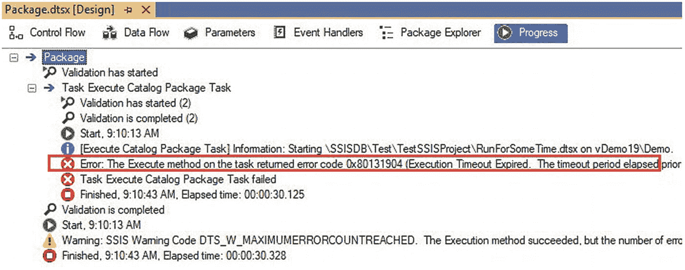

图 19-14：在 30 秒时执行超时

这就是我们希望克服的行为。现在可以使用 `RunForSomeTime.dtsx` SSIS 包来测试基于 `WaitHandle.WaitAny` 的解决方案的实现了。


### 实现 WaitHandle.WaitAny 方法

基于 `WaitHandle.WaitAny` 的解决方案，其核心在于异步执行执行时间超过 30 秒且 `Synchronized` 属性设置为 `true` 的 SSIS 包。异步执行 SSIS 包，就如同将 `Synchronized` 属性设置为 `false`。因此，仅当 `Synchronized` 属性设置为 `true` 时，才会调用此执行方法。

## 编辑方法与参数

首先，通过编辑 `ExecuteCatalogPackageTask` 类中的 `returnExecutionValueParameterSet` 方法来开始实现。在编辑时，使用清单 19-3 中的代码添加用于设置 `CALLER_INFO` 执行参数的代码：

```csharp
private Collection returnExecutionValueParameterSet()
{
    // 初始化参数集合
    Collection executionValueParameterSet = new Collection();
    // 设置 SYNCHRONIZED 执行参数
    executionValueParameterSet.Add(new Microsoft.SqlServer.Management.IntegrationServices.PackageInfo.ExecutionValueParameterSet
    {
        ObjectType = 50,
        ParameterName = "SYNCHRONIZED",
        ParameterValue = false // 始终以 Synchronized 属性为 false 执行
    });
    // 设置 LOGGING_LEVEL 执行参数
    int LoggingLevelValue = decodeLoggingLevel(LoggingLevel);
    executionValueParameterSet.Add(new Microsoft.SqlServer.Management.IntegrationServices.PackageInfo.ExecutionValueParameterSet
    {
        ObjectType = 50,
        ParameterName = "LOGGING_LEVEL",
        ParameterValue = LoggingLevelValue
    });
    // 设置 CALLER_INFO 执行参数
    string machineName = Environment.MachineName.Replace('"', '\'').Replace("\\", "//");
    string userName = Environment.UserName;
    executionValueParameterSet.Add(new Microsoft.SqlServer.Management.IntegrationServices.PackageInfo.ExecutionValueParameterSet
    {
        ObjectType = 50,
        ParameterName = "CALLER_INFO",
        ParameterValue = machineName + "\\" + userName
    });
    return executionValueParameterSet;
}
```

清单 19-3 编辑 `ExecuteCatalogPackageTask` 中的 `returnExecutionValueParameterSet` 方法

编辑完成后，`returnExecutionValueParameterSet` 方法如图 19-15 所示。

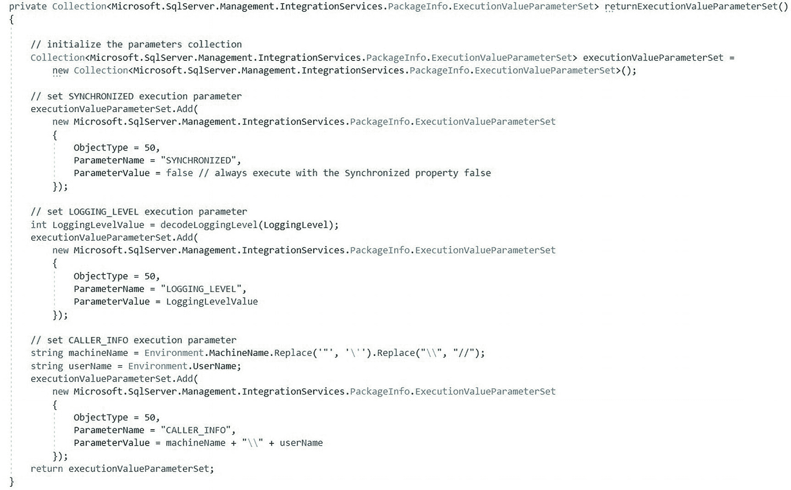

图 19-15 编辑 `returnExecutionValueParameterSet` 方法

## 修改执行调用

继续实现，编辑 `ExecuteCatalogPackageTask.Execute` 方法中的 `catalogPackage.Execute` 调用，添加清单 19-4 中的代码：

```csharp
long executionId = catalogPackage.Execute(Use32bit
, null
, executionValueParameterSet);
if (Synchronized)
{
    ManualResetEvent manualResetState = new ManualResetEvent(false);
}
```

清单 19-4 检查是否配置为同步执行

添加后，代码如图 19-16 所示。

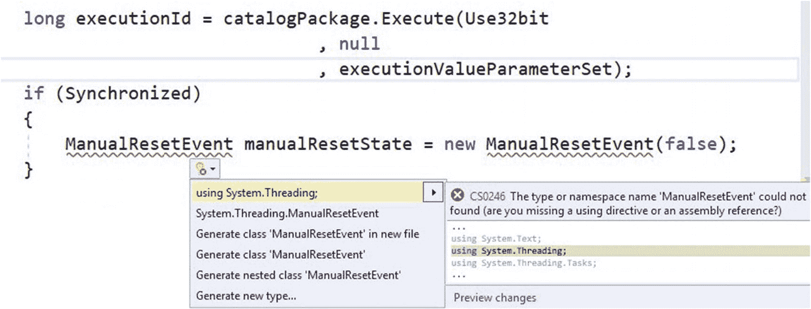

图 19-16 实现基于 `WaitHandle.WaitAny` 的解决方案

## 添加引用与处理错误

使用 Visual Studio 快速操作添加 `using System.Threading;` 指令：将鼠标悬停在 `ManualResetEvent` 类型声明上，单击快速操作下拉菜单，然后单击 `using System.Threading;` 指令。添加指令后，代码如图 19-17 所示。

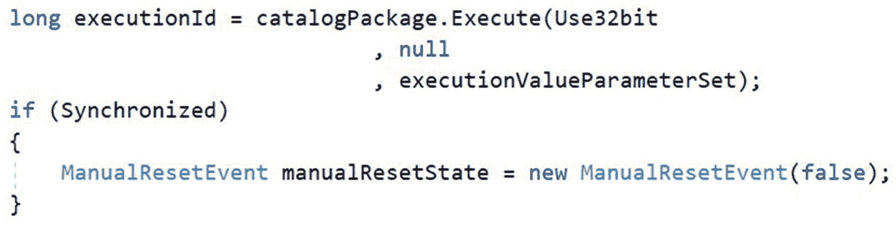

图 19-17 添加指令后错误清除

如果包执行未配置为同步执行，则代码将按之前的方式执行包。如果包执行配置为同步执行，则会声明一个名为 `manualResetState` 的 `ManualResetEvent`，并将其状态初始化为 `false`。请记住，设置为 `false` 的 `ManualResetEvent` 会开始等待（阻塞）任何试图使用分配给该 `ManualResetEvent` 的共享资源的其他线程。

## 配置计时器与状态类

下一步是配置 `Timer`，该计时器根据间隔配置进行“滴答”计时。当计时器滴答时，它将调用 `CheckWaitState` 类中名为 `CheckStatus` 的方法。使用清单 19-5 中的代码将 `CheckWaitState` 类添加到 `ExecuteCatalogPackageTask.cs` 文件并声明私有成员：

```csharp
class CheckWaitState
{
    private long executionId;
    private int invokeCount;
    private ManualResetEvent manualResetState;
    private int maximumCount;
    private string catalogName;
    private SqlConnection connection;
    private ExecuteCatalogPackageTask task;
    public Operation.ServerOperationStatus OperationStatus { get; set; }
}
```

清单 19-5 在 `ExecuteCatalogPackageTask.cs` 文件中实现 `CheckWaitState`

添加后，代码如图 19-18 所示。

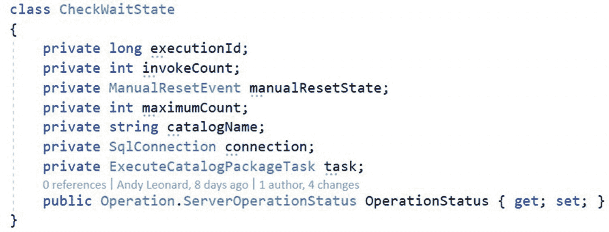

图 19-18 实现 `CheckWaitState` 类

## 实现构造函数

使用清单 19-6 中的代码实现 `CheckWaitState` 构造函数：

```csharp
public CheckWaitState(long executionId
, int maxCount
, SqlConnection connection
, string catalogName
, ExecuteCatalogPackageTask task)
{
    this.executionId = executionId;
    this.invokeCount = 0;
    this.maximumCount = maxCount;
    this.connection = connection;
    this.catalogName = catalogName;
    this.task = task;
}
```

清单 19-6 实现 `CheckWaitState` 构造函数

构造函数实现后，`CheckWaitState` 类如图 19-19 所示。

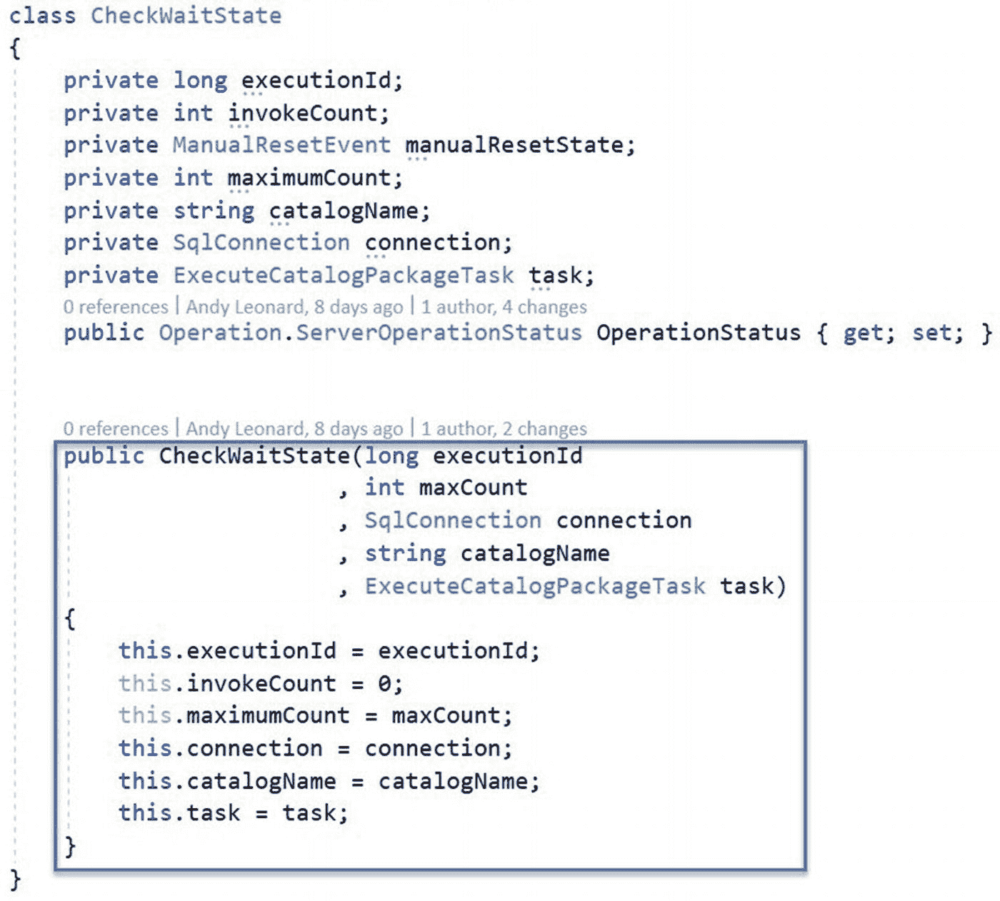

图 19-19 已实现构造函数的 `CheckWaitState` 类

## 实现计时器状态类

使用清单 19-7 中的代码实现 `TimerCheckerState` 类：

```csharp
class TimerCheckerState
{
    public ManualResetEvent manualResetState { get; private set; }
    public TimerCheckerState(ManualResetEvent manualResetState)
    {
        this.manualResetState = manualResetState;
    }
}
```

清单 19-7 实现 `TimerCheckerState` 类

添加后，代码如图 19-20 所示。

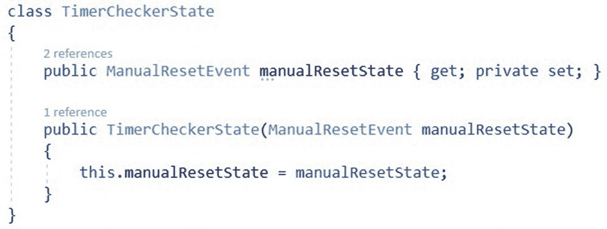

图 19-20 `TimerCheckerState` 类

## 实现辅助函数

下一步，使用清单 19-8 中的代码在 `CheckWaitState` 类中实现名为 `returnOperationStatus` 的辅助函数：

```csharp
public Operation.ServerOperationStatus returnOperationStatus()
{
    CatalogCollection catalogCollection = new IntegrationServices(connection).Catalogs;
    Catalog catalog = catalogCollection[catalogName];
    OperationCollection operationCollection = catalog.Operations;
    Operation operation = operationCollection[executionId];
    Operation.ServerOperationStatus operationStatus = operation.Status;
    return operationStatus;
}
```

清单 19-8 编写 `CheckWaitState.returnOperationStatus` 辅助函数

添加到 `CheckWaitState` 类后，`returnOperationStatus` 辅助函数如图 19-21 所示。

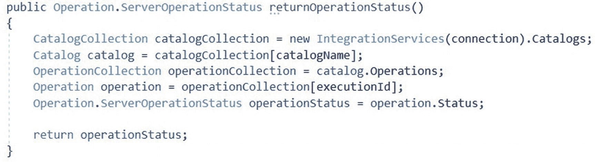

图 19-21 `CheckWaitState.returnOperationStatus` 辅助函数


### 实现 SSIS 包执行状态监控与事件日志重构

`returnOperationStatus` 方法首先连接到名为 `catalogCollection` 的 `CatalogCollection` 类型。一个名为 `catalog` 的 `Catalog` 类型通过 `catalogName` 属性（默认值为 “SSISDB”）从 `catalogCollection` 中派生出来。

一个名为 `operationCollection` 的 `OperationCollection` 类型从 `catalog.Operations` 类型集合中赋值。一个名为 `operation` 的 `Operation` 类型从 `operationCollection[executionId]` 中读取。`operationStatus` 变量，一个 `Operation.ServerOperationStatus` 类型的变量，从 `operation.Status` 属性中读取。

下一步是在 CheckWaitState 类中编写 `checkOperationStatus` 方法，以响应 SSIS 包执行的 `ServerOperationStatus`，使用代码清单 19-9 中的代码：

```csharp
public void checkOperationStatus(Operation.ServerOperationStatus operationStatus)
{
// check for package execution "finished" states
if (
(operationStatus == Operation.ServerOperationStatus.Canceled)
|| (operationStatus == Operation.ServerOperationStatus.Completion)
|| (operationStatus == Operation.ServerOperationStatus.Failed)
|| (operationStatus == Operation.ServerOperationStatus.Stopping)
|| (operationStatus == Operation.ServerOperationStatus.Success)
|| (operationStatus == Operation.ServerOperationStatus.UnexpectTerminated)
)
{
// reset counter
invokeCount = 0;
// signal thread
manualResetState.Set();
}
}
```
**代码清单 19-9** 添加 `CheckWaitState.CheckOperationStatus` 方法

添加后，代码如图 19-22 所示：

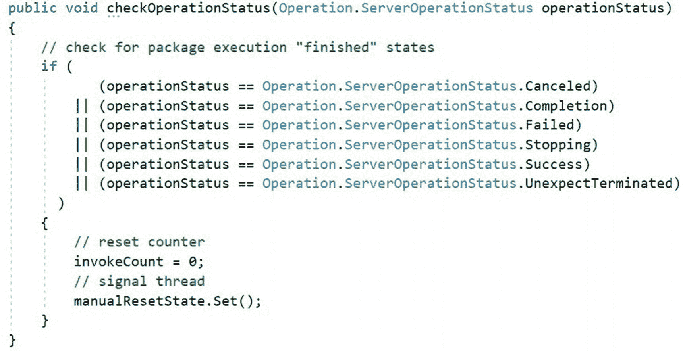

*图 19-22* 添加 `CheckWaitState.CheckOperationStatus` 方法

`checkOperationStatus` 方法接收一个名为 `operationStatus` 的 `Operation.ServerOperationStatus` 类型参数。一个 `if` 条件检查 `operationStatus` 参数值是否处于“已完成”操作状态。“已完成”操作状态包括：
*   `Canceled`（已取消）
*   `Completion`（已完成）
*   `Failed`（已失败）
*   `Stopping`（正在停止）
*   `Success`（成功）
*   `UnexpectTerminated`（意外终止）

如果 `operationStatus` 参数值处于“已完成”操作状态，则名为 `invokeCount` 的定时器滴答计数器重置为 0，并且名为 `manualResetState` 的 `ManualResetEvent` 类型属性被 `Set()`。如前所述：`ManualResetEvent.Set()` 方法 `发出信号`（将布尔状态设置为 `true`），`手动`通知等待的线程现在可以执行。

### 将 logMessage 重构为 raiseEvent

回到 `ExecuteCatalogPackageTask` 类并重构 `logMessage` 方法，首先从方法名称开始。`logMessage` 方法实际上并不记录消息。相反，`logMessage` 方法引发一个事件。通过将 `logMessage` 方法重命名为 `raiseEvent` 并使用代码清单 19-10 中的代码替换它来重构该方法：

```csharp
public void raiseEvent(string messageType
, int messageCode
, string subComponent
, string message)
{
bool fireAgain = true;
switch (messageType)
{
default:
break;
case "Information":
componentEvents.FireInformation(messageCode, subComponent, message, "", 0, ref fireAgain);
break;
case "Warning":
componentEvents.FireWarning(messageCode, subComponent, message, "", 0);
break;
case "Error":
componentEvents.FireError(messageCode, subComponent, message, "", 0);
break;
}
}
```
**代码清单 19-10** 将 `logMessage` 方法重构为 `raiseEvent` 方法

替换后，代码如图 19-23 所示：

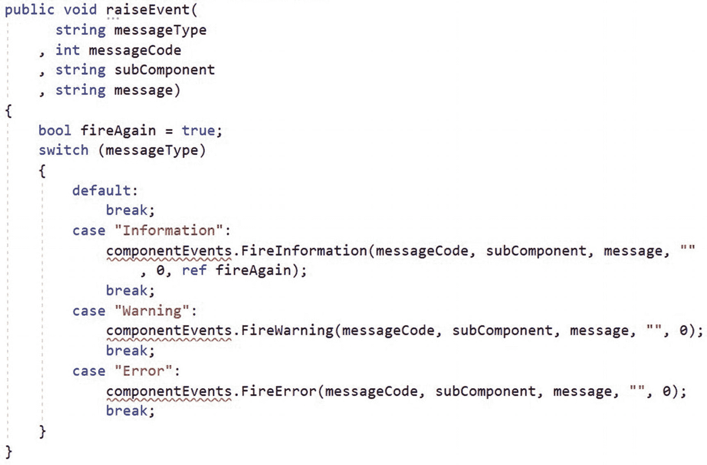

*图 19-23* 用 `raiseEvent` 方法替换 `logMessage` 方法

`componentEvents` 属性引入了一个错误，由属性名称下方的红色波浪线表示。在 `logMessage` 方法中，`componentEvents` 是作为参数传递的。长话短说：到目前为止，我们调用 `logMessage` 方法的每个方法都能访问 `componentEvents`，这是由 `Task` 对象传递给这些方法的。

在下一节中，我们希望从 *`Task` 对象外部*的方法引发事件消息，这些方法不属于 `ExecuteCatalogPackageTask Task` 对象类的一部分；我们希望从 `CheckWaitState` 类引发事件消息。

将 `logMessage` 方法重命名为 `raiseEvent` 触发了一项重构工作，而这项重构工作显得顺序不当。重构工作看起来顺序不当的原因是因为它 *实际上* 就是顺序不当。重构并不总是井然有序的。欢迎来到软件开发。

`logMessage` 方法与 `raiseEvent` 方法的一个主要区别是参数的数量。`logMessage` 方法有五个参数：`componentEvents`、`messageType`、`messageCode`、`subComponent` 和 `message`。`raiseEvent` 方法有四个参数：`messageType`、`messageCode`、`subComponent` 和 `message`。这四个共享参数在两种方法中的类型相同。`logMessage` 方法中的 `componentEvents` 参数在 `raiseEvent` 方法中缺失了。

我们重构的第一步是处理 `componentEvents` 参数，我们通过使用代码清单 19-11 中的代码向 `ExecuteCatalogPackageTask` 类添加一个 `componentEvents` 属性来实现：

```csharp
private IDTSComponentEvents componentEvents { get; set; } = null;
```
**代码清单 19-11** 向 `ExecuteCatalogPackageTask` 类添加 `componentEvents` 属性

添加后，新的 `componentEvents` 属性如图 19-24 所示：


*图 19-24* 添加 `ExecuteCatalogPackageTask.componentEvents` 属性

一旦 `componentEvents` 属性被添加到 `ExecuteCatalogPackageTask` 类中，`raiseEvent` 方法中的早期错误就被清除了，如图 19-25 所示（与图 19-23 对比）：

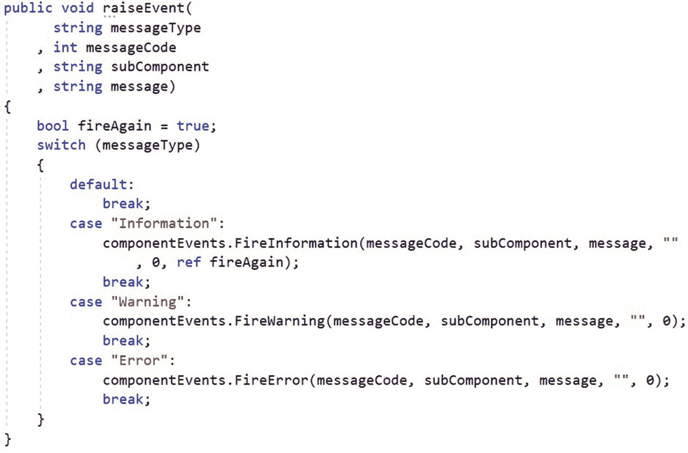

*图 19-25* 错误已清除

使用代码清单 19-12 中的代码在 `ExecuteCatalogPackageTask.Validate` 方法中初始化 `componentEvents` 属性：


```
// initialize componentEvents
this.componentEvents = componentEvents;
```
代码清单 19-12
在 `ExecuteCatalogPackageTask.Validate` 方法中初始化 `componentEvents` 属性

添加后，代码将如图 19-26 所示：

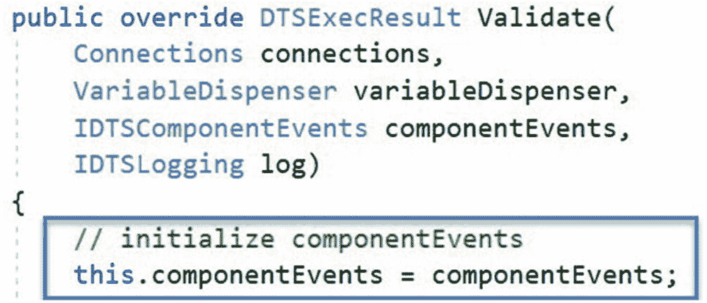

图 19-26
在 `ExecuteCatalogPackageTask.Validate` 方法中初始化 `componentEvents` 属性值

根据错误列表（至少在我的项目中），还剩下 19 个错误。大多数错误显示相同的消息：“名称 `logMessage` 在当前上下文中不存在”，如图 19-27 所示：

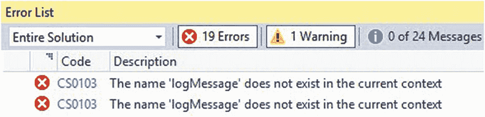

图 19-27
19 个错误

下一步是更新对 `raiseEvent` 方法的每次调用，在 `ExecuteCatalogPackageTask.Validate` 方法中有几处这样的调用。编辑 `logMessage` 方法调用，将名称 `logMessage` 替换为 `raiseEvent`，如图 19-28 所示：

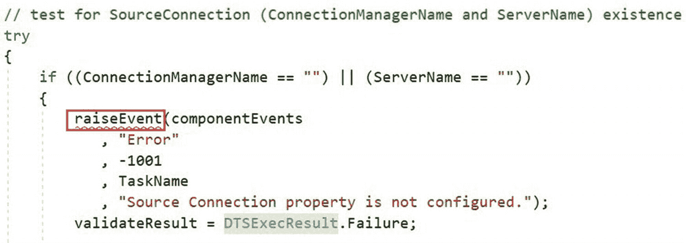

图 19-28
将 `logMessage` 替换为 `raiseEvent`

接下来，删除第一个参数 (`componentEvents`) 和第一个逗号，如图 19-29 所示：

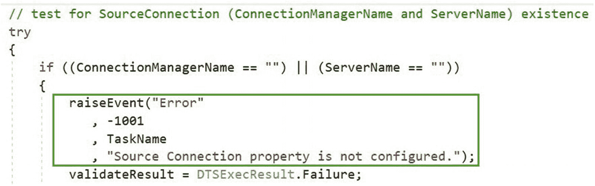

图 19-29
删除第一个参数

根据错误列表，只剩下 18 个错误待解决（你的错误数量可能有所不同）—— 如图 19-30 所示：

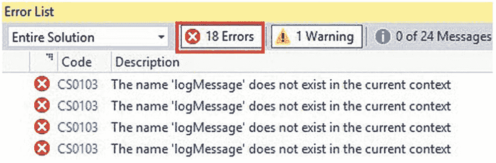

图 19-30
剩余 18 个错误

对剩余 18 处（你的错误数量可能有所不同）显示错误消息“名称 `logMessage` 在当前上下文中不存在”的调用，重复将 `logMessage` 重命名为 `raiseEvent` 以及删除第一个参数的操作。

下一步是实现 `CheckWaitState.CheckStatus` 方法，该方法是在计时器触发时（即将实现）调用的方法，使用的是代码清单 19-13 中的代码：

```
public void CheckStatus(object state)
{
    TimerCheckerState localState = ((TimerCheckerState)state);
    this.manualResetState = localState.manualResetState;
    // increment the counter
    invokeCount++;
    // log this tick
    string msg = "Asynchronous Execution Retry Count: " + invokeCount.ToString() + " (Maximum Retry Count: " + maximumCount.ToString() + ")";
    this.task.raiseEvent("Information"
        , 101
        , this.task.TaskName + ".CheckStatus"
        , msg);
    // check for package execution reached max count
    if (invokeCount == maximumCount)
    {
        // log maximumCount reached
        msg = "Asynchronous Execution Maximum Retry Count ("
            + maximumCount.ToString() + ") reached.";
        this.task.raiseEvent("Information"
            , 101
            , this.task.TaskName + ".CheckStatus"
            , msg);
        // set OperationStatus
        OperationStatus = Operation.ServerOperationStatus.Canceled;
        // reset counter
        invokeCount = 0;
        // signal thread
        manualResetState.Set();
    }
    else
    {
        OperationStatus = returnOperationStatus();
        checkOperationStatus(OperationStatus);
    }
}
```
代码清单 19-13
实现 `CheckWaitState.CheckStatus` 方法

添加后，代码将如图 19-31 所示：

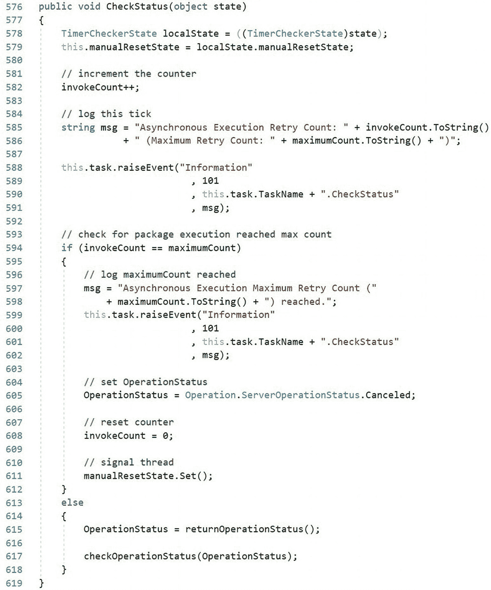

图 19-31
已实现的 `CheckWaitState.CheckStatus` 方法

随着计时器的每次滴答（计时器代码接下来将实现），`CheckWaitState.CheckStatus` 方法会被调用。这段代码最重要的部分或许在第 578–579 行。在第 578 行，声明并初始化了一个 `TimerCheckerState` 类的变量 `localState`，其值是 `state` 对象参数转换为 `TimerCheckerState` 类型后的值。接下来，在第 579 行，将 `CheckWaitState.manualResetState` 变量（`ManualResetEvent` 类型）的值设置为 `localState.manualResetState`。在第 582 行，一个名为 `invokeCount` 的变量被递增，该变量用于跟踪计时器调用 `CheckWaitState.CheckStatus` 方法的次数。

在第 584–591 行，生成了一条消息并引发了一个事件。消息变量——名为 `msg`——在第 585–586 行包含了 `invokeCount` 和 `maximumCount` 变量的值。调用 `ExecuteCatalogPackageTask.raiseEvent` 方法，传入 `msg` 变量，以在 SSIS 包中引发事件消息。

在第 594–618 行，检查 `invokeCount` 变量的值，看其是否已达到 `maximumCount` 变量的值。如果 `invokeCount` 已达到 `maximumCount` 变量的值，则在第 597–598 行配置 `msg` 变量值以发送一条指示已达到 `maximumCount` 变量值的消息，在第 599–602 行引发一个事件，并在第 605 行将 `CheckWaitState.OperationStatus` 属性值设置为 `Operation.ServerOperationStatus.Canceled`。在第 608 行将 `invokeCount` 变量值重置为 0，并在第 611 行调用 `manualResetState` 的 `Set()` 方法。第 611 行的 `manualResetState.Set()` 调用通知等待的线程，告知它们当前线程已完成其独占操作，这使得下一个等待线程知道现在可以执行了。

如果 `invokeCount` 尚未达到 `maximumCount` 变量的值，则通过调用 `CheckWaitState.returnOperationStatus` 方法（参见代码清单 19-8 和图 19-21）来设置 `CheckWaitState.OperationStatus` 属性值。接下来在第 617 行调用 `CheckWaitState.checkOperationStatus` 方法（参见代码清单 19-9 和图 19-22）以确定当前操作状态是否已达到“已完成”状态。如前所述，如果 `CheckWaitState.checkOperationStatus` 方法确定 SSIS 包执行已达到“已完成”状态，则停止执行。


## 重构 Execute 方法

回到 `ExecuteCatalogPackageTask.Execute` 方法，代码看起来……有点繁忙了。是时候进行更多重构了。首先，按照清单 19-14 的代码，将清单 19-4 中的 `ManualResetEvent` 声明和初始化代码迁移到一个名为 `executeSynchronous` 的新辅助函数中：

```csharp
private Operation.ServerOperationStatus executeSynchronous(long executionId
, SqlConnection connection)
{
Operation.ServerOperationStatus ret = Operation.ServerOperationStatus.UnexpectTerminated;
ManualResetEvent manualResetState = new ManualResetEvent(false);
return ret;
}
```

*清单 19-14*
在 `ExecuteCatalogPackageTask` 中编写 `executeSynchronous` 辅助函数

添加后，`ExecuteCatalogPackageTask.executeSynchronous` 辅助函数如图 19-32 所示：

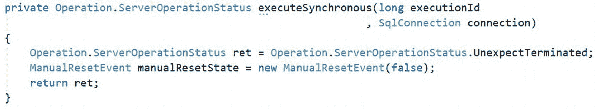

*图 19-32*
`ExecuteCatalogPackageTask.executeSynchronous` 辅助函数

`ExecuteCatalogPackageTask.executeSynchronous` 辅助函数中的代码首先声明并初始化一个名为 `ret` 的 `Operation.ServerOperationStatus` 类型变量，其初始值为 `Operation.ServerOperationStatus.UnexpectTerminated`。声明一个名为 `manualResetState` 的 `ManualResetEvent` 类型变量，并将其初始化为一个新的、设置为 `false` 的 `ManualResetEvent`。

`ExecuteCatalogPackageTask.executeSynchronous` 辅助函数被声明为返回一个 `Operation.ServerOperationStatus` 类型的值，并且返回 `ret` 变量以满足该声明。

接下来完善 `ExecuteCatalogPackageTask.executeSynchronous` 辅助函数，在 `ManualResetEvent` 声明之后和 `return ret;` 语句之前，添加清单 19-15 中的代码：

```csharp
int maximumRetries = 20;
int retryIntervalSeconds = 10;
int operationTimeoutMinutes = 10;
CheckWaitState statusChecker = new CheckWaitState(executionId
, maximumRetries
, connection
, PackageCatalogName
, this);
TimeSpan dueTime = new TimeSpan(0, 0, 0);
TimeSpan period = new TimeSpan(0, 0, retryIntervalSeconds);
object timerState = new TimerCheckerState(manualResetState);
TimerCallback timerCallback = statusChecker.CheckStatus;
Timer timer = new Timer(timerCallback, timerState, dueTime, period);
WaitHandle[] manualResetStateWaitHandleCollection = new WaitHandle[]
{ manualResetState };
int timeoutMillseconds = (int)new TimeSpan(0, operationTimeoutMinutes
, 0).TotalMilliseconds;
bool exitContext = false;
// 请在此处等待
WaitHandle.WaitAny(manualResetStateWaitHandleCollection
, timeoutMillseconds
, exitContext);
ret = statusChecker.OperationStatus;
manualResetState.Dispose();
timer.Dispose();
```

*清单 19-15*
完成 `ExecuteCatalogPackageTask.executeSynchronous`

添加后，`ExecuteCatalogPackageTask.executeSynchronous` 辅助函数如图 19-33 所示：

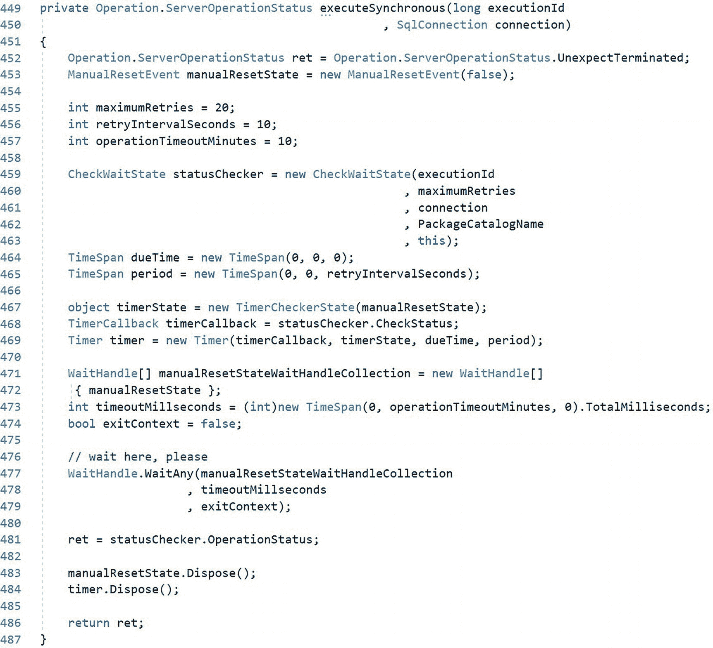

*图 19-33*
`ExecuteCatalogPackageTask.executeSynchronous` 辅助函数，代码完成

实现这个基于 `WaitHandle.WaitAny` 的解决方案需要一个 `ManualResetEvent` 来检查正在执行的包的状态。每次 `Timer` 计时触发时（在第 469 行配置），`Timer` 调用 `CheckWaitState` 类（见清单 19-13 和图 19-31）中名为 `CheckStatus` 的方法——该方法在第 468 行被配置为名为 `timerCallback` 的 `TimerCallback` 类型变量——该方法会检查 SSIS 包执行的状态。`Timer` 计时触发还配置为传递另外三个变量：

*   `timerState`：一个 `TimerCheckerState` 变量，在第 467 行用 `manualResetState`（`ManualResetEvent` 类型）变量初始化。
*   `dueTime`：一个 `TimeSpan` 变量，在第 464 行初始化为“立即开始”（`TimeSpan(0, 0, 0);`）。
*   `period`：一个 `TimeSpan` 变量，在第 465 行初始化为 `retryIntervalSeconds` int 变量（在第 456 行初始化为 10 秒）所表示的秒数。

一个名为 `manualResetStateWaitHandleCollection` 的 `WaitHandle` 集合在第 471-472 行被声明并初始化为 `manualResetState` 变量中的 `WaitHandle` 集合。一个名为 `timeoutMilliseconds` 的 `int` 类型变量在第 473 行被声明并初始化为 `operationTimeoutMinutes` int 类型变量（在第 457 行声明并初始化）所表示的毫秒数。一个名为 `exitContext` 的 `bool` 类型变量在第 474 行被声明并初始化为 `false`。

在第 477-479 行，调用了 `WaitHandle.WaitAny`，传入 `manualResetStateWaitHandleCollection`、`timeoutMilliseconds` 和 `exitContext` 变量的值。正是在这里，包执行线程开始*等待*（阻塞）对 `ExecuteCatalogPackageTask.executeSynchronous` 辅助函数的任何额外调用。

在*同步*执行中，`CheckWaitState.CheckStatus` 方法会在每次计时器触发时被调用，直到名为 `manualResetState` 的 `ManualResetEvent` 变量被手动重置。手动重置发生在满足以下两个条件之一时：

1.  `CheckWaitState.CheckStatus` 方法中的 `operationStatus` 变量指示 SSIS 包执行处于“完成”状态。
2.  重试次数（由 `CheckWaitState.CheckStatus` 方法中的 `invokeCount` 变量捕获）达到 `maximumRetries` 变量值。

第一种情况发生在 `CheckWaitState.CheckStatus` 方法指示重试次数 (`invokeCount`) *尚未*达到 `maximumRetries` 变量值，并且对 `CheckWaitState.returnOperationStatus` 方法的调用返回了 SSIS 包执行 `OperationStatus` 为“完成”状态。SSIS 包执行 `OperationStatus` 由 `CheckWaitState.checkOperationStatus` 方法评估。如果发现 SSIS 包执行 `OperationStatus` 处于“完成”状态，则通过将 `CheckWaitState.manualResetState` 变量值设置为 true 来停止执行。

第二种情况发生在 `CheckWaitState.CheckStatus` 方法指示重试次数 (`invokeCount`) *已*达到 `maximumRetries` 变量值。

在*异步* SSIS 包执行中，不会调用 `CheckWaitState.CheckStatus` 方法。我们接下来构建的 `ExecuteCatalogPackageTask.evaluateStatus` 方法同时支持同步和异步的 SSIS 包执行。

下一步是通过使用清单 19-16 中的代码构建 `evaluateStatus` 辅助方法来重构 SSIS 包执行，以检查 `CheckWaitState.CheckStatus` 方法中的 `operationStatus` 变量是否为“完成”状态：


## 添加 `ExecuteCatalogPackageTask.evaluateStatus` 辅助方法

```
private DTSExecResult evaluateStatus(Operation.ServerOperationStatus os
, string packagePath
, string elapsed)
{
DTSExecResult ret = DTSExecResult.Success;
string msg = String.Empty;
string swMsg = String.Empty;
if (Synchronized)
{
swMsg = " Package Execution Time: " + elapsed;
}
switch (os)
{
default:
break;
case Operation.ServerOperationStatus.Success:
msg = packagePath + " on " + ServerName + (Synchronized ?
(" succeeded." + swMsg.Substring(0, (swMsg.Length - 4))) :
(" started. Check SSIS Catalog Reports for package execution results."));
raiseEvent((Synchronized ? "Information" : "Warning")
, 1099, TaskName, msg);
ret = DTSExecResult.Success;
break;
case Operation.ServerOperationStatus.Created:
case Operation.ServerOperationStatus.Pending:
case Operation.ServerOperationStatus.Running:
msg = packagePath + " on " + ServerName + (Synchronized ?
(" " + os.ToString().ToLower() + "." + swMsg.Substring(0, (swMsg.Length - 4))) :
(" started. Check SSIS Catalog Reports for package execution results."));
raiseEvent((Synchronized ? "Information" : "Warning")
, 1099, TaskName, msg);
ret = DTSExecResult.Success;
break;
case Operation.ServerOperationStatus.Failed:
msg = packagePath + " on " + ServerName + (Synchronized ?
(" failed." + swMsg.Substring(0, (swMsg.Length - 4))) :
(" started. Check SSIS Catalog Reports for package execution results."));
raiseEvent("Error", -1099, TaskName, msg);
ret = DTSExecResult.Failure;
break;
case Operation.ServerOperationStatus.UnexpectTerminated:
msg = packagePath + " on " + ServerName + (Synchronized ?
(" terminated unexpectedly." + swMsg.Substring(0, (swMsg.Length - 4))) :
(" started. Check SSIS Catalog Reports for package execution results."));
raiseEvent("Error", -1099, TaskName, msg);
ret = DTSExecResult.Failure;
break;
case Operation.ServerOperationStatus.Canceled:
msg = packagePath + " on " + ServerName + (Synchronized ?
(" was canceled." + swMsg.Substring(0, (swMsg.Length - 4))) :
(" started. Check SSIS Catalog Reports for package execution results."));
raiseEvent("Error", -1099, TaskName, msg);
ret = DTSExecResult.Failure;
break;
}
return ret;
}
```
列表 19-16
添加 `ExecuteCatalogPackageTask.evaluateStatus` 辅助方法

一旦添加，`ExecuteCatalogPackageTask.evaluateStatus`方法将如图 19-34 所示：

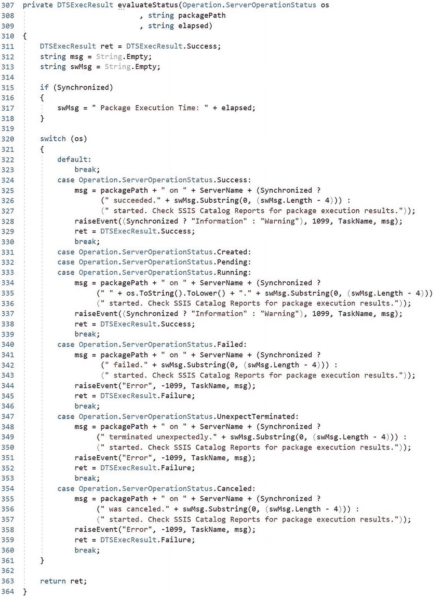
图 19-34
`ExecuteCatalogPackageTask.evaluateStatus` 方法

`ExecuteCatalogPackageTask.evaluateStatus`方法接收三个参数：
*   `os`：一个`Operation.ServerOperationStatus`类型参数，包含正在执行的 SSIS 包的当前操作状态
*   `packagePath`：一个`string`类型参数，包含正在执行的 SSIS 包的 SSIS 目录路径
*   `elapsed`：一个`string`类型参数，表示 SSIS 包的执行时间

`evaluateStatus`方法在第 311 行开始，声明并初始化名为`ret`的`DTSExecResult`变量，该变量初始化为`DTSExecResult.Success`。在第 312 行声明并初始化名为`msg`的`string`变量为`String.Empty`，在第 313 行声明并初始化另一个名为`swMsg`的`string`变量为`String.Empty`。

如果在 315 行检查到`ExecuteCatalogPackageTask.Synchronized`属性设置为 true，则`swMsg`被设置为`" Package Execution Time: " + elapsed;`。

一个基于`os`参数值的`switch`语句跨越第 320–361 行。针对多个`Operation.ServerOperationStatus`值的 case 用于决定`msg`变量值、调用`raiseEvent`方法并设置`ret`变量值。`ret`变量值从`evaluateStatus`方法返回。

如果 SSIS 包正在同步执行，并且`CheckWaitState`重试计数（`invokeCount`）达到`maximumCount`值，则`CheckWaitState.OperationStatus`属性被设置为`Operation.ServerOperationStatus.Canceled`（参见列表 19-13 和图 19-31）。设置`CheckWaitState.OperationStatus`属性的值对 SSIS 包的执行没有影响。我们的代码必须响应设置为`Operation.ServerOperationStatus.Canceled`的`CheckWaitState.OperationStatus`属性值。

下一步是使用列表 19-17 中的代码实现一个辅助函数来停止包执行：

## 添加 `ExecuteCatalogPackageTask.stopExecution` 辅助函数

```
private void stopExecution(long executionId
, SqlConnection connection)
{
CatalogCollection catalogCollection = new IntegrationServices(connection).Catalogs;
Catalog catalog = catalogCollection[PackageCatalogName];
ExecutionOperationCollection executionCollection = catalog.Executions;
ExecutionOperation executionOperation = executionCollection[executionId];
executionOperation.Stop();
}
```
列表 19-17
添加 `ExecuteCatalogPackageTask.stopExecution` 辅助函数

一旦添加，代码将如图 19-35 所示：

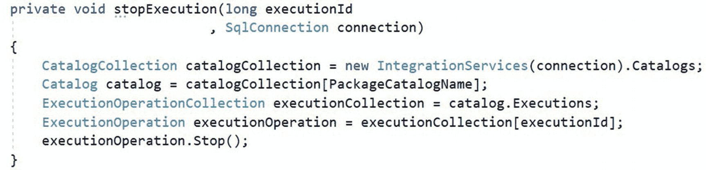
图 19-35
添加 `ExecuteCatalogPackageTask.stopExecution` 辅助函数

## 添加 `ExecuteCatalogPackageTask.returnOperationStatus` 方法

一旦我们重构了`ExecuteCatalogPackageTask.Execute`方法，我们将需要确定异步 SSIS 包执行的操作状态。要确定异步 SSIS 包执行的操作状态，请使用列表 19-18 中的代码为`ExecuteCatalogPackageTask`类构建一个稍有不同的`returnOperationStatus`方法版本：

```
private Operation.ServerOperationStatus returnOperationStatus(
SqlConnection connection
, long executionId)
{
CatalogCollection catalogCollection = new IntegrationServices(connection).Catalogs;
Catalog catalog = catalogCollection[PackageCatalogName];
OperationCollection operationCollection = catalog.Operations;
Operation operation = operationCollection[executionId];
Operation.ServerOperationStatus operationStatus = (Operation.ServerOperationStatus)operation.Status;
return operationStatus;
}
```
列表 19-18
`ExecuteCatalogPackageTask.returnOperationStatus` 方法

一旦添加，代码将如图 19-36 所示：

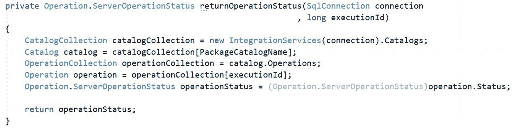
图 19-36
在 `ExecuteCatalogPackageTask` 类中实现的 `CheckWaitState.returnOperationStatus` 辅助方法副本

`CheckWaitState.returnOperationStatus`方法仅在 SSIS 包同步执行时被调用。当包异步执行时，需要`ExecuteCatalogPackageTask.returnOperationStatus`方法来确定正在执行的 SSIS 包的操作状态。

继续重构`ExecuteCatalogPackageTask.Execute`，使用列表 19-19 中的代码构建`ExecuteCatalogPackage`辅助函数：

## 代码实现与解释

```
private DTSExecResult ExecuteCatalogPackage()
{
DTSExecResult executionResult;
ConnectionManagerIndex = returnConnectionManagerIndex(Connections
, ConnectionManagerName);
catalogProject = returnCatalogProject(ServerName
, PackageFolder
, PackageProject);
catalogPackage = returnCatalogPackage(ServerName
, PackageFolder
, PackageProject
, PackageName);
Collection
executionValueParameterSet = returnExecutionValueParameterSet();
string packagePath = "\\SSISDB\\" + PackageFolder + "\\"
+ PackageProject + "\\"
+ PackageName;
string msg = "Starting " + packagePath + " on " + ServerName + ".";
raiseEvent("Information", 1001, TaskName, msg);
Stopwatch sw = new Stopwatch();
sw.Start();
long executionId = catalogPackage.Execute(Use32bit
, null
, executionValueParameterSet);
SqlConnection connection = returnConnection();
Operation.ServerOperationStatus operationStatus;
if (Synchronized)
{
operationStatus = executeSynchronous(executionId
, connection);
if (operationStatus == Operation.ServerOperationStatus.Canceled)
{
stopExecution(executionId
, connection);
}
sw.Stop();
}
else
{
sw.Stop();
operationStatus = returnOperationStatus(connection
, executionId);
}
executionResult = evaluateStatus(operationStatus
, packagePath
, sw.Elapsed.ToString());
return executionResult;
}
清单 19-19
编写 ExecuteCatalogPackage 辅助函数
```

添加后，`ExecuteCatalogPackage` 辅助函数的代码如图 19-37 所示：

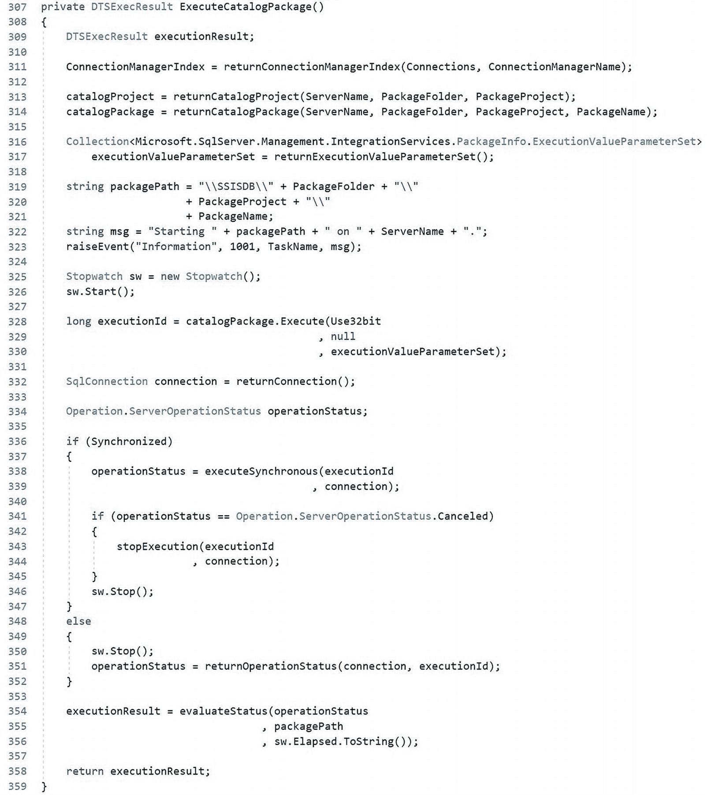
图 19-37
ExecuteCatalogPackage 辅助函数

`ExecuteCatalogPackage` 辅助函数本质上是之前位于 `ExecuteCatalogPackageTask.Execute` 方法中的代码。该函数返回一个 `DTSExecResult` 类型，并在第 309 行声明了 `DTSExecResult` 类型的变量 `executionResult`。`ExecuteCatalogPackageTask.ConnectionManagerIndex` 属性值通过在第 311 行调用 `returnConnectionManagerIndex` 函数来设置。两个 `ExecuteCatalogPackageTask` 内部属性——`catalogProject` 和 `catalogPackage`——的值分别在第 313–314 行通过调用 `returnCatalogProject` 和 `returnCatalogPackage` 来设置。

在第 316–317 行，`executionValueParameterSet` 变量（类型为 `Collection<Microsoft.SqlServer.Management.IntegrationServices.PackageInfo.ExecutionValueParameterSet>`）通过调用名为 `returnExecutionValueParameterSet` 的辅助函数来填充。

在第 319–321 行，声明了 `packagePath` (`string`) 变量并将其初始化为 SSIS 目录包路径值，格式为 `\SSISDB\<*Catalog Folder*>\<*SSIS Project*>\<*SSIS Package*>`。然后，`packagePath` 变量用于第 322 行的 `msg` (`string`) 变量，而 `msg` 变量用于在第 323 行调用 `raiseEvent` 方法时引发 SSIS 包事件。

一个新的 `Stopwatch` 类型变量——命名为 `sw`——在第 325 行声明并初始化，然后在第 326 行启动。

SSIS 包执行在第 328–330 行开始。调用 `catalogPackage.Execute` 的结果由一个名为 `executionId` 的 `long` 类型变量捕获。

在第 332 行，一个名为 `connection` 的 `SqlConnection` 变量被声明并通过 `returnConnection` 辅助函数初始化。`operationStatus` 变量，类型为 `Operation.ServerOperationStatus`，在第 334 行声明。

如果在第 336 行 `Synchronized` 属性设置为 `true`，则在第 338–339 行调用 `executeSynchronous` 辅助函数，结果由 `operationStatus` 变量捕获。如果在第 341 行 `operationStatus` 变量值为 `Operation.ServerOperationStatus.Canceled`，则在第 343–344 行调用 `stopExecution` 方法并传递 `executionId` 和 `connection` 参数。`Stopwatch sw` 在第 346 行停止。

如果在第 336 行 `Synchronized` 属性设置为 `false`，则 `Stopwatch sw` 在第 350 行停止，并且 `operationStatus` 变量的值通过调用 `ExecuteCatalogPackageTask.returnOperationStatus` 方法来设置。

在第 354–356 行，`executionResult` 变量的值通过调用 `evaluateStatus` 方法来设置，`ExecuteCatalogPackage` 辅助函数在第 358 行将 `evaluateStatus` 辅助函数的值返回给调用函数。

一旦编码完成，`ExecuteCatalogPackage` 辅助函数将通过 `ExecuteCatalogPackageTask.Execute` 方法使用清单 19-20 中的代码调用：

```
public override DTSExecResult Execute(
Connections connections,
VariableDispenser variableDispenser,
IDTSComponentEvents componentEvents,
IDTSLogging log,
object transaction)
{
return ExecuteCatalogPackage();
}
清单 19-20
重构后的 ExecuteCatalogPackageTask.Execute 方法
```

编辑后，`ExecuteCatalogPackageTask.Execute` 方法如图 19-38 所示：

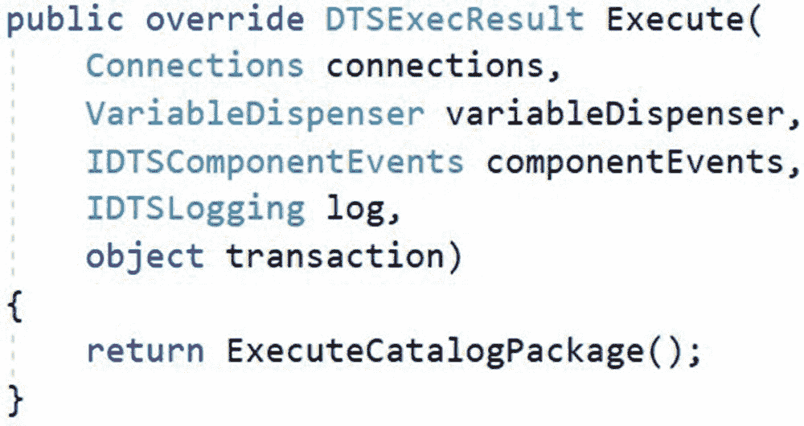
图 19-38
重构后的 ExecuteCatalogPackageTask.Execute 方法

构建 ExecuteCatalogPackageTask 解决方案。下一步是测试代码。


## 让我们来测试它！

打开一个测试 SSIS 包，并在控制流中添加一个“执行目录包任务”。打开“执行目录包任务”编辑器，配置任务以执行 `RunForSomeTime.dtsx` SSIS 包。将 `Synchronized` 属性配置为 `True`，如图 19-39 所示：

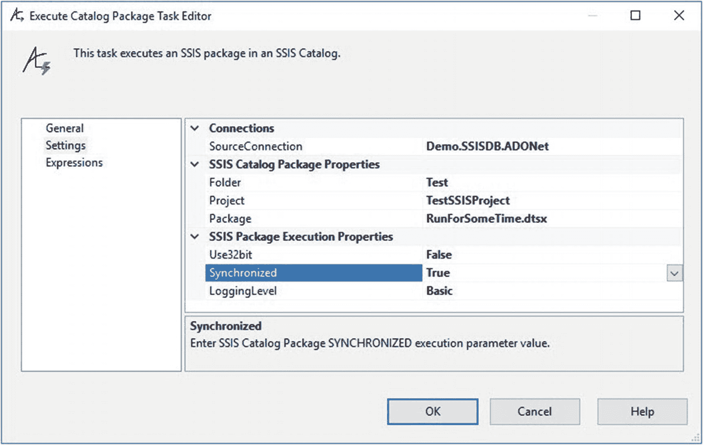
图 19-39
配置“执行目录包任务”以执行 `RunForSomeTime.dtsx` SSIS 包

在调试器中执行测试 SSIS 包。如果一切顺利，测试 SSIS 包执行应成功，如图 19-40 所示：


图 19-40
成功的测试

单击“进度”选项卡以确保已引发所需的事件消息，如图 19-41 所示：

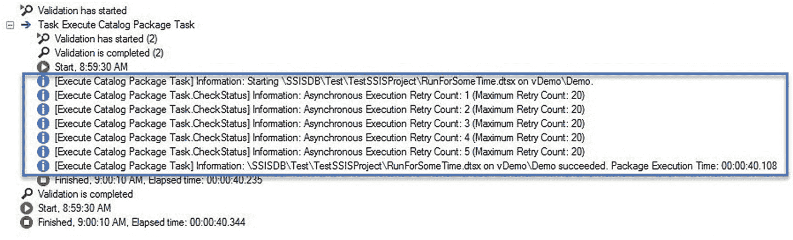
图 19-41
检查进度

代码已检测以返回开始消息、每个“滴答”的消息和结束消息。在下一章中，我们将为同步执行属性添加更多灵活性。

这解决了本章开头提到的第一个严重错误。要测试第二个严重错误（“即使 SSIS 包执行失败，执行目录包任务也报告成功”），请配置一个测试 SSIS 包使其在执行时始终失败，方法是向测试 SSIS 项目添加一个名为 `ReportAndFail.dtsx` 的测试 SSIS 包。向控制流添加一个“脚本任务”，将 `System::PackageName` 和 `System::TaskName` 变量添加到脚本任务的 `ReadOnlyVariables` 属性中，然后使用清单 19-21 中的代码编辑 `Main()` 方法：

```
public void Main()
{
string packageName = Dts.Variables["System::PackageName"].Value.ToString();
string taskName = Dts.Variables["System::TaskName"].Value.ToString();
string subComponent = packageName + "." + taskName;
int informationCode = 1001;
bool fireAgain = true;
string msg = "I am " + packageName;
Dts.Events.FireInformation(informationCode, subComponent, msg, "", 0, ref fireAgain);
msg = "The package is intended to fail for test purposes.";
Dts.Events.FireError(informationCode, subComponent, msg, "", 0);
Dts.TaskResult = (int)ScriptResults.Success;
}
```
清单 19-21
`ReportAndFail.dtsx` 脚本任务 `Main()` 方法代码

添加后，脚本任务的 `Main()` 方法代码如图 19-42 所示：

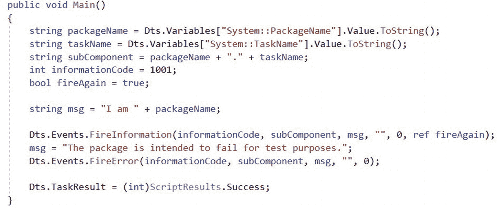
图 19-42
`ReportAndFail.dtsx` SSIS 包脚本任务 `Main()` 方法代码

脚本中的 `Main()` 方法引发两个事件：一个信息事件和一个错误事件。信息事件提供消息“**我是 ReportAndFail**”。引发错误事件会使 SSIS 包执行失败，并显示消息“**该包旨在为测试目的而失败**”。

将 `ReportAndFail.dtsx` 包部署到测试 SSIS 目录实例。打开一个测试 SSIS 包，并添加一个配置为执行刚刚部署的 `ReportAndFail.dtsx` SSIS 包的“执行目录包任务”，如图 19-43 所示：

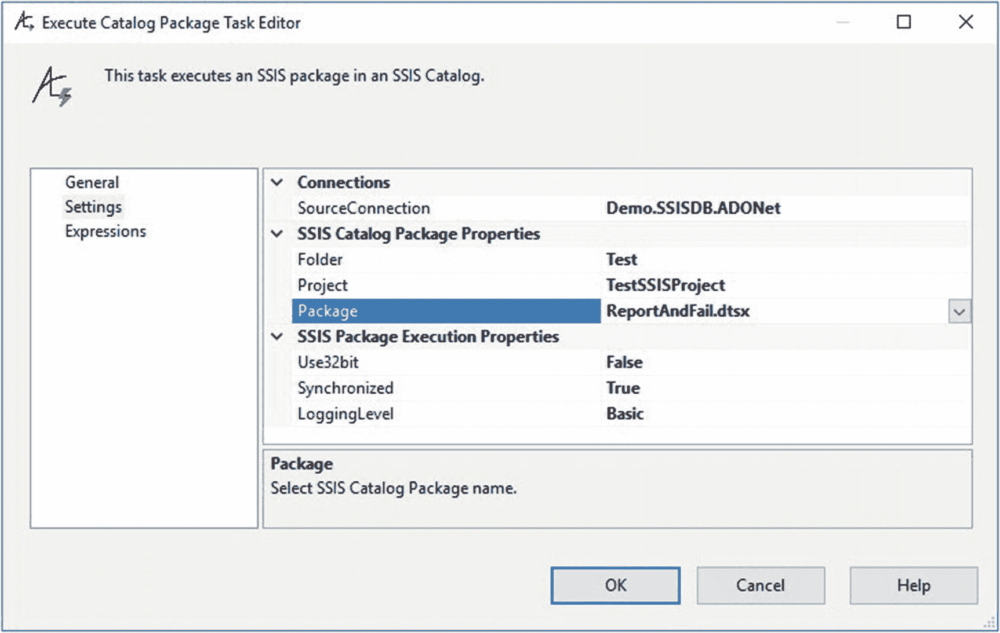
图 19-43
配置为执行 `ReportAndFail.dtsx`

确保将 `Synchronized` 属性设置为 `True`，否则 `ReportAndFail.dtsx` SSIS 包执行将在 SSIS 目录中启动，然后返回“成功”给测试 SSIS 包。

当 `ReportAndFail.dtsx` 执行完成时，“执行目录包任务”应在控制流上报告失败，如图 19-44 所示：

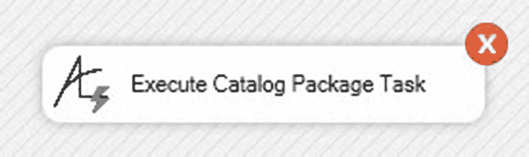
图 19-44
失败的执行，成功的测试

“进度”选项卡应指示 `ReportAndFail.dtsx` SSIS 包执行失败，如图 19-45 所示：

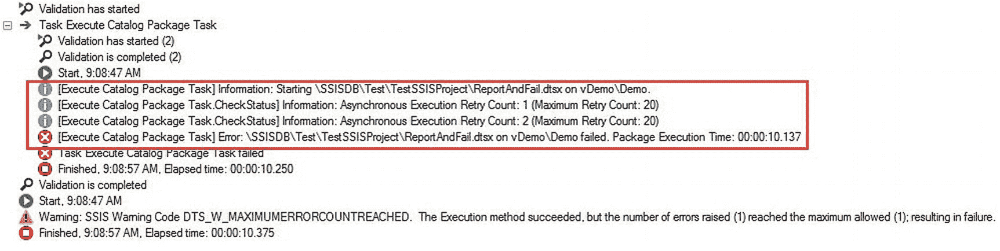
图 19-45
执行目录包任务失败，已记录

测试表明，代码不再存在本章开头提到的两个严重错误。

### 2. 结论

在本章中，我们识别并纠正了“执行目录包任务”中的两个错误。解决方案很复杂，涉及向执行过程添加大量代码。然而，解决方案尚未完成。我们将在下一章中公开驱动同步执行的三个属性。

现在是签入代码的绝佳时机。

