# 20. 添加同步执行属性

第 19 章包含对两个严重错误的解决方案：

1.  如果 SSIS 包执行时间超过 30 秒，`PackageInfo Execute()` 会返回一条错误消息：“任务执行方法返回错误代码 0x80131904（执行超时。在操作完成或服务器未响应之前超时时间段已过）。执行方法必须成功，并使用“out”参数指示结果。”

2.  即使 SSIS 包执行失败，“执行目录包任务”也报告成功。

第一个错误的解决方案涉及异步执行。`WaitHandle.WaitAny` 解决方案需要的三个设置是：

*   `maximumRetries`：一个 `int` 变量，设置在终止 SSIS 目录包执行操作之前允许计时器“滴答”的次数。

*   `retryIntervalSeconds`：一个 `int` 变量，设置计时器“滴答”或重试之间的秒数。

*   `operationTimeoutMinutes`：一个 `int` 变量，设置在终止 SSIS 目录包执行操作之前允许的分钟数。

在开发的这个阶段，`maximumRetries`、`retryIntervalSeconds` 和 `operationTimeoutMinutes` 变量及其值被硬编码到 `ExecuteCatalogPackageTask` 类的 `executeSynchronous` 辅助函数中。`maximumRetries`、`retryIntervalSeconds` 和 `operationTimeoutMinutes` 变量应该真正是 `ExecuteCatalogPackageTask` 类的属性，以便 SSIS 开发人员可以在同步 SSIS 包执行超过 30 秒时配置这些值。

此外，属性值是相关的，`maximumRetries` * `retryIntervalSeconds` 应小于 `operationTimeoutMinutes` / 60 的值，以避免执行超时。


## 呈现新属性

新属性应在视觉上与 `SettingsNode` 中的 `Synchronized` 属性设置相关联，并且 `Synchronized` 属性应与 `SettingsNode` 中的 “SSIS Package Execution Properties” 类别分开。首先，通过编辑 `SettingsNode` 中的 `Synchronized` 属性，将其放入名为 “SSIS Package Synchronized Properties” 的独立类别中，使用清单 20-1 中的代码：

```
[
Category("SSIS Package Synchronized Properties"),
Description("输入 SSIS 目录包 SYNCHRONIZED 执行参数值。")
]
public bool Synchronized {
get { return _task.Synchronized; }
set { _task.Synchronized = value; }
}
清单 20-1
编辑 Synchronized 属性类别
```

编辑后，代码如图 20-1 所示：

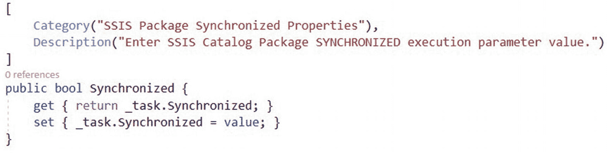

图 20-1：`Synchronized` 属性现在位于 SSIS Package Synchronized Properties 类别中。

构建 `ExecuteCatalogPackageTask` 解决方案，然后将执行目录包任务添加到测试 SSIS 包中。打开执行目录包任务编辑器，并注意 `Synchronized` 属性的新位置，如图 20-2 所示：

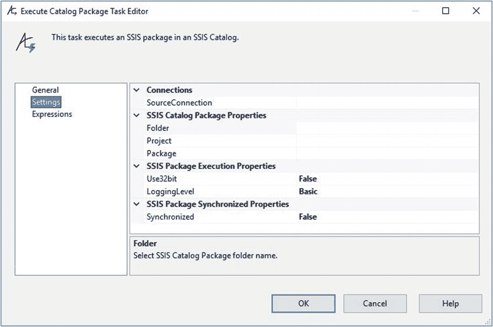

图 20-2：编辑后的 `Synchronized` 属性。

`Synchronized` 属性现在拥有其独立的属性类别，名为 “SSIS Package Synchronized Properties”。

下一步是添加属性以管理 `maximumRetries`、`retryIntervalSeconds` 和 `operationTimeoutMinutes` 值。

### 添加 MaximumRetries、RetryIntervalSeconds 和 OperationTimeoutMinutes

使用清单 20-2 中的代码为 `ExecuteCatalogPackageTask` 对象添加新属性：

```
public int MaximumRetries { get; set; } = 29;
public int RetryIntervalSeconds { get; set; } = 10;
public int OperationTimeoutMinutes { get; set; } = 5;
清单 20-2
向 ExecuteCatalogPackageTask 类添加 MaximumRetries、RetryIntervalSeconds 和 OperationTimeoutMinutes 属性
```

添加后，代码如图 20-3 所示：

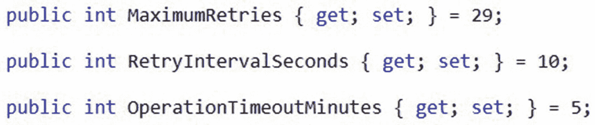

图 20-3：添加到 `ExecuteCatalogPackageTask` 类的 `MaximumRetries`、`RetryIntervalSeconds` 和 `OperationTimeoutMinutes` 属性。

请注意，`MaximumRetries` 的默认值 (29) 乘以 `RetryIntervalSeconds` 的默认值 (10) 等于 290。当应用于 SSIS 包执行过程时，计时器将在“超时”之前，每 10 秒“滴答”一次，共“滴答”29 次。`OperationTimeoutMinutes` 的默认值为 5，即 300 秒。计时器操作超时时间大于 `MaximumRetries * RetryIntervalSeconds`，这是一个不错的起点。

接下来，通过将清单 20-3 中的代码添加到 `SettingsView.cs` 文件，将 `MaximumRetries`、`RetryIntervalSeconds` 和 `OperationTimeoutMinutes` 属性呈现在 `SettingsNode` 上：

```
[
Category("SSIS Package Synchronized Properties"),
Description("输入 SSIS 目录包最大重试次数，" +
"当 SYNCHRONIZED 为 true 时，用于计时器“滴答”。")
]
public int MaximumRetries {
get { return _task.MaximumRetries; }
set { _task.MaximumRetries = value; }
}
[
Category("SSIS Package Synchronized Properties"),
Description("输入 SSIS 目录包重试间隔秒数，" +
"当 SYNCHRONIZED 为 true 时，在计时器“滴答”重试之间等待。")
]
public int RetryIntervalSeconds {
get { return _task.RetryIntervalSeconds; }
set { _task.RetryIntervalSeconds = value; }
}
[
Category("SSIS Package Synchronized Properties"),
Description("SSIS 目录包操作超时分钟数 - " +
"当 SYNCHRONIZED 为 true 时，由 RetryIntervalSeconds 和 MaximumRetries 管理。"),
ReadOnly(true)
]
public int OperationTimeoutMinutes {
get { return _task.OperationTimeoutMinutes; }
set { _task.OperationTimeoutMinutes = value; }
}
清单 20-3
呈现 MaximumRetries、RetryIntervalSeconds 和 OperationTimeoutMinutes 属性
```

添加后，代码如图 20-4 所示：

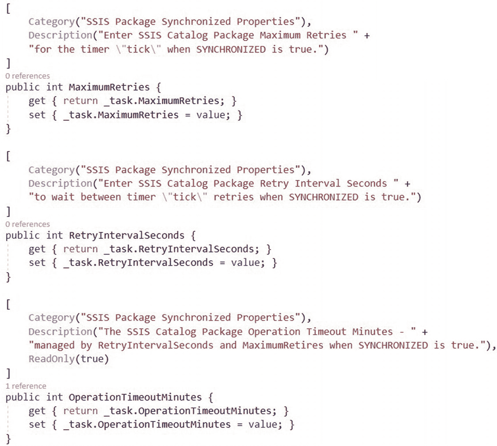

图 20-4：呈现 `MaximumRetries`、`RetryIntervalSeconds` 和 `OperationTimeoutMinutes` 属性。

注意 `OperationTimeoutMinutes` 属性的 `ReadOnly` 特性为 `true`，这意味着该值会显示在执行目录包任务编辑器中，但不可编辑。`OperationTimeoutMinutes` 属性是通过数学方式管理的，仅供查看。

通过构建 `ExecuteCatalogPackageTask` 解决方案、打开测试 SSIS 包、添加执行目录包任务，并在设置页面上配置新的 `MaximumRetries`、`RetryIntervalSeconds` 和 `OperationTimeoutMinutes` 属性来测试新属性，如图 20-5 所示：

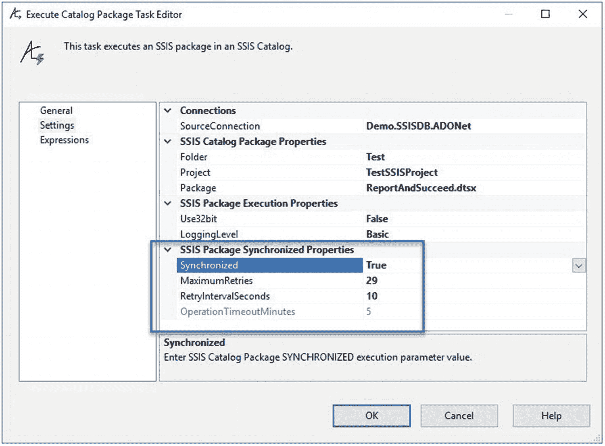

图 20-5：测试新的 `MaximumRetries`、`RetryIntervalSeconds` 和 `OperationTimeoutMinutes` 属性。


### 配置任务与实现属性联动

配置“执行目录包任务”以执行一个短时间运行（少于 5 分钟）的 SSIS 包。将 `Synchronized` 属性设置为 `True`（因为新的 `MaximumRetries`、`RetryIntervalSeconds` 和 `OperationTimeoutMinutes` 属性只有在 `Synchronized` 属性设置为 `True` 时才会被使用），然后关闭编辑器。执行测试 SSIS 包。如果一切按计划进行，测试 SSIS 包在调试器中执行时应成功，如图 20-6 所示：


图 20-6

执行成功

下一步是使用 `MaximumRetries` 和 `RetryIntervalSeconds` 属性的值来管理 `OperationTimeoutMinutes` 属性。`OperationTimeoutMinutes` 属性值的设置方法是：将 `maximumRetries` * `retryIntervalSeconds` 相乘来计算预计执行秒数，然后将计算出的秒数值存储在一个名为 `retriesTimesIntervalSeconds` 的变量中。`OperationTimeoutMinutes` 的值是通过将 `retriesTimesIntervalSeconds` 变量的值除以 60，将结果转换为 `int` 值，然后再加 1 来确保充裕的。配置 `propertyGridSettings_PropertyValueChanged` 方法，以响应 `MaximumRetires` 或 `RetryIntervalSeconds` 属性中的任一变更，并使用清单 20-4 中的代码触发 `OperationTimeoutMinutes` 属性值的重新计算：

```
if ((e.ChangedItem.PropertyDescriptor.Name.CompareTo("MaximumRetries") == 0)
|| (e.ChangedItem.PropertyDescriptor.Name.CompareTo("RetryIntervalSeconds") == 0))
{
int retriesTimesIntervalSeconds = settingsNode.MaximumRetries
* settingsNode.RetryIntervalSeconds;
int operationTimeoutSeconds = settingsNode.OperationTimeoutMinutes * 60;
settingsNode.OperationTimeoutMinutes = (int)((retriesTimesIntervalSeconds / 60) + 1);
this.settingsPropertyGrid.Refresh();
}
```

清单 20-4

通过重置 `OperationTimeoutMinutes` 属性值来响应 `MaximumRetries` 和 `RetryIntervalSeconds` 属性值的变更

将代码添加到 `propertyGridSettings_PropertyValueChanged` 方法后，代码如图 20-7 所示：

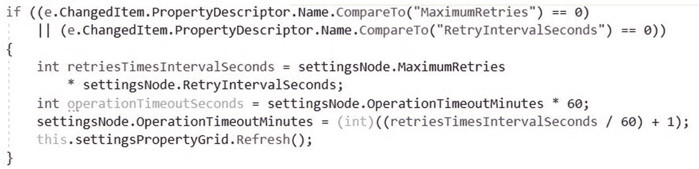

图 20-7

自动重置 `OperationTimeoutMinutes` 属性值

同样，也可以将 `MaximumRetries` 属性设置为只读，并通过使用 `RetryIntervalSeconds` 和 `OperationTimeoutMinutes` 属性的值来计算 `MaximumRetries` 属性值。目标是一样的：我们希望在“执行目录包任务”编辑器中公开与等待相关的属性，以便使用该任务的 SSIS 开发者能够配置这些属性，以便在 SSIS 包未在指定时间内完成执行时停止执行。

### 清理过时的异步执行

下一步是清理 `executeSynchronous` 方法中（现已）过时的局部变量 `maximumRetries`、`retryIntervalSeconds` 和 `operationTimeoutMinutes`。删除图 20-8 中高亮显示的代码：

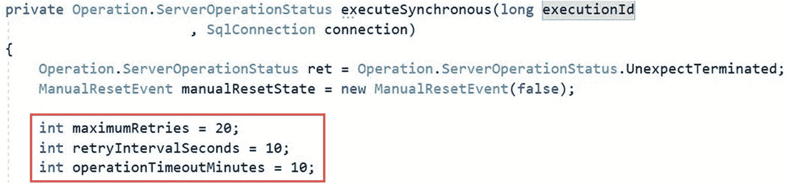

图 20-8

删除局部变量

一旦删除了局部异步相关变量，`executeSynchronous` 方法如图 20-9 所示：

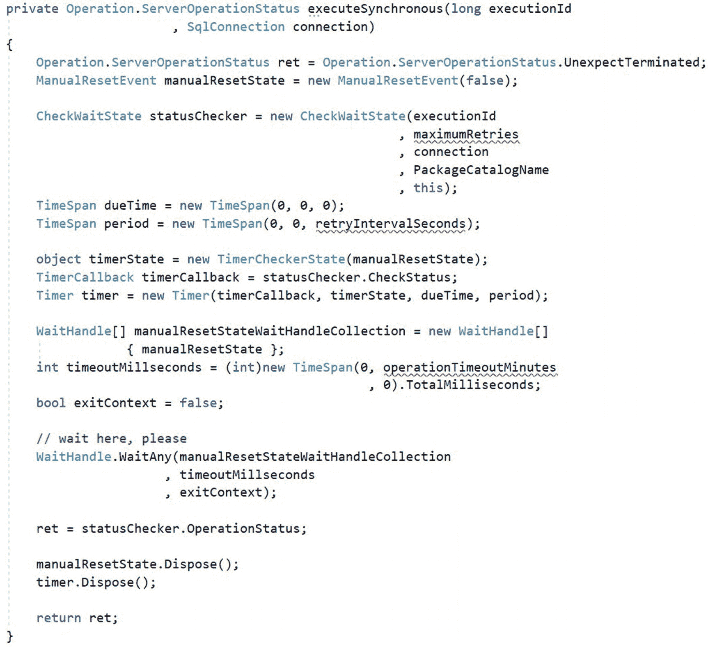

图 20-9

删除变量后的 `executeSynchronous` 方法

在 `executeSynchronous` 方法中，使用清单 20-5 中的代码，将 `maximumRetries` 替换为 `MaximumRetries`，将 `retryIntervalSeconds` 替换为 `RetryIntervalSeconds`，将 `operationTimeoutMinutes` 替换为 `OperationTimeoutMinutes`：

```
private Operation.ServerOperationStatus executeSynchronous(long executionId
, SqlConnection connection)
{
Operation.ServerOperationStatus ret = Operation.ServerOperationStatus.UnexpectTerminated;
ManualResetEvent manualResetState = new ManualResetEvent(false);
CheckWaitState statusChecker = new CheckWaitState(executionId
, MaximumRetries
, connection
, PackageCatalogName
, this);
TimeSpan dueTime = new TimeSpan(0, 0, 0);
TimeSpan period = new TimeSpan(0, 0, RetryIntervalSeconds);
object timerState = new TimerCheckerState(manualResetState);
TimerCallback timerCallback = statusChecker.CheckStatus;
Timer timer = new Timer(timerCallback, timerState, dueTime, period);
WaitHandle[] manualResetStateWaitHandleCollection = new WaitHandle[]
{ manualResetState };
int timeoutMillseconds = (int)new TimeSpan(0, OperationTimeoutMinutes
, 0).TotalMilliseconds;
bool exitContext = false;
// wait here, please
WaitHandle.WaitAny(manualResetStateWaitHandleCollection
, timeoutMillseconds
, exitContext);
ret = statusChecker.OperationStatus;
manualResetState.Dispose();
timer.Dispose();
return ret;
}
```

清单 20-5

使用新属性更新局部变量

更新后，代码如图 20-10 所示：

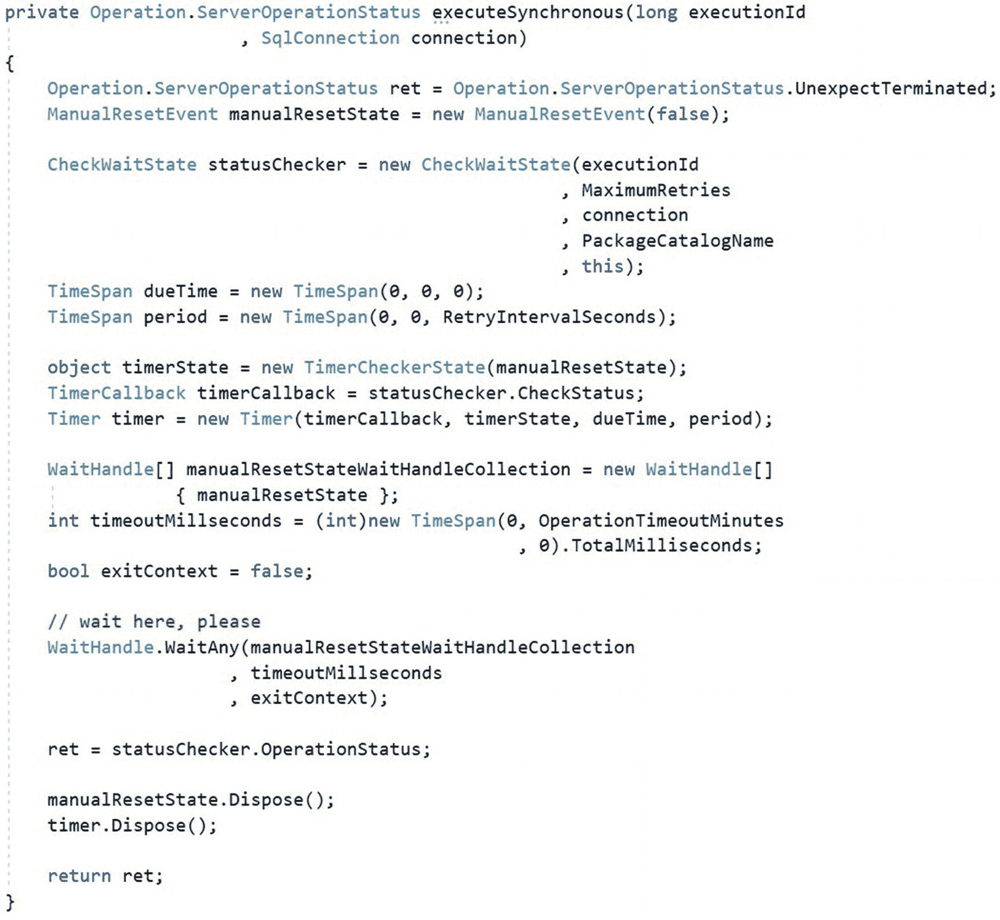

图 20-10

更新后的 `executeSynchronous` 方法

## 测试一下！

构建 `ExecuteCatalogPackageTask` 解决方案，打开一个测试 SSIS 项目和包，然后在控制流中添加一个新的“执行目录包任务”。配置该任务以执行一个需要运行一段时间的 SSIS 包，例如 `RunForSomeTime.dtsx` 包，并将 `Synchronized` 属性设置为 `True`，`MaximumRetries` 属性设置为 50，`RetryIntervalSeconds` 属性设置为 2，如图 20-11 所示：

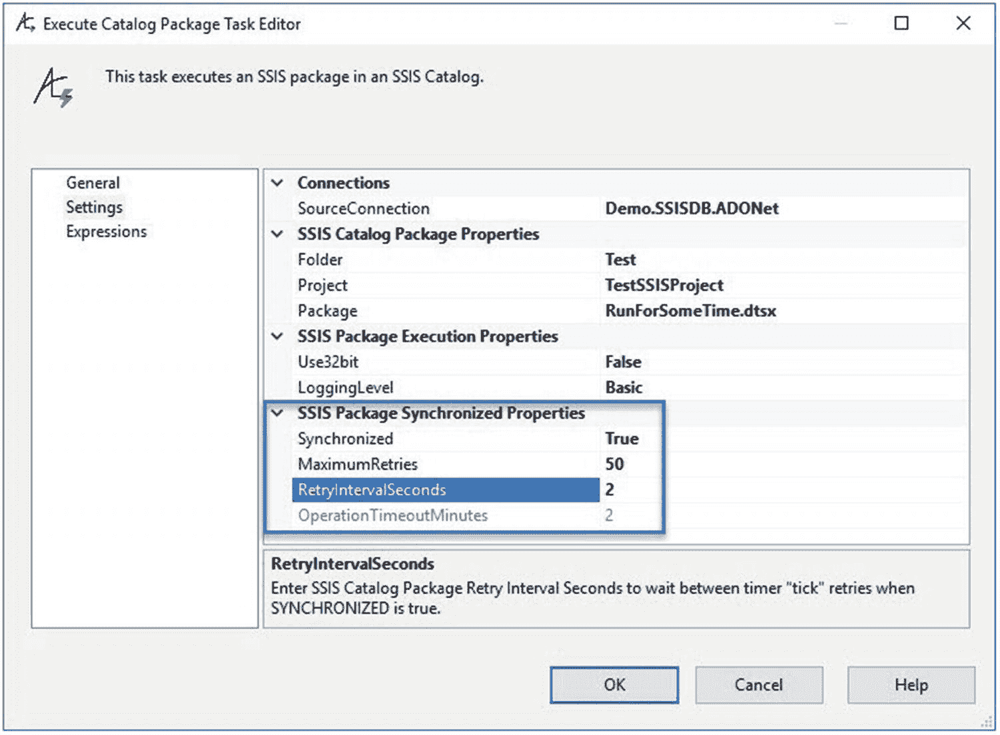

图 20-11

为计时器检测测试配置“执行目录包任务”

执行测试 SSIS 包并查看“进度”选项卡。计时器“滴答”检测消息应类似于图 20-12 所示：

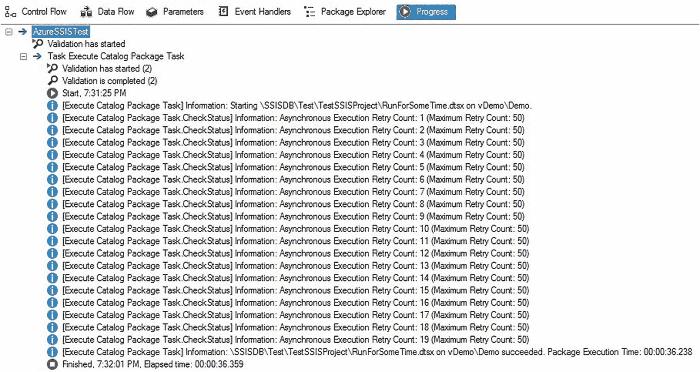

图 20-12

计时器“滴答”检测消息

计时器检测代码已完成。

## 总结

在本章中，我们将三个硬编码的变量 `maximumRetries`、`retryIntervalSeconds` 和 `operationTimeoutMinutes` 转换为 `ExecuteCatalogPackageTask` 类的属性，然后向 `SettingsView` 和 `SettingsNode` 类添加代码，以便向 SSIS 开发者公开这些新属性。

在下一章中，我们将测试“执行目录包任务”的功能。

现在是一个签入代码的好时机。

