# 21. 测试任务

在前面的章节中，我们为本书第二版构建的“执行目录包任务”版本编写了功能代码。现在是时候测试“执行目录包任务”了。

## 手动测试用例

虽然存在能够自动化测试生成、执行和报告中重复工作的测试框架，但如果你的工作是日复一日地开发软件，你迟早会接触到测试框架。你偶尔会遇到某个测试需求，而所选测试框架对此要么无能为力，要么显得“笨拙”。在这种情况下，你将需要构建一个手动测试。

所有良好的测试都由一系列场景、预期答案或结果（断言）以及对实际结果的测量组成。场景与断言的组合被称为一个 `用例`。一个用例可能包含多个断言。当我们执行测试时，我们会逐一处理每个用例，测量结果并记录测量值。

我有一个格言：“所有软件都经过测试。有些是刻意的。” 我偶尔会在社交媒体上发布这句格言，如图 21-1 所示：

图 21-1

Andy 的软件测试格言

软件测试是一项细致且要求高的工作。在本章中，我们只测试部分（而非全部）用例。如果我们测试所有用例，本章将长达 150 页，而我的编辑（理所当然地）会指出这是一章内容，而非一份测试计划。

## 用例

在本节中，我们将探讨针对“执行目录包任务”的以下用例：

1.  `任务存在性`
2.  `任务验证`
3.  `任务编辑器` – `常规`

前几个用例涉及目视检查——简单地查看 `执行目录包任务` 是否出现在 `SSIS 工具箱` 中，如果是，则在 `SSIS 工具箱` 中选择 `执行目录包任务` 并验证工具箱描述。

这些测试使用手动测试文档格式进行记录。作者见过类似的手动测试文档以 Excel 电子表格形式呈现，但更倾向于使用 Word 文档来记录手动测试。

### 测试任务存在性

场景：构建 `ExecuteCatalogPackageTask` 解决方案，打开一个测试用 `SSIS` 项目，然后打开一个测试用 `SSIS` 包。`执行目录包任务` 应出现在 `SSIS 工具箱` 中，如图 21-2 所示：

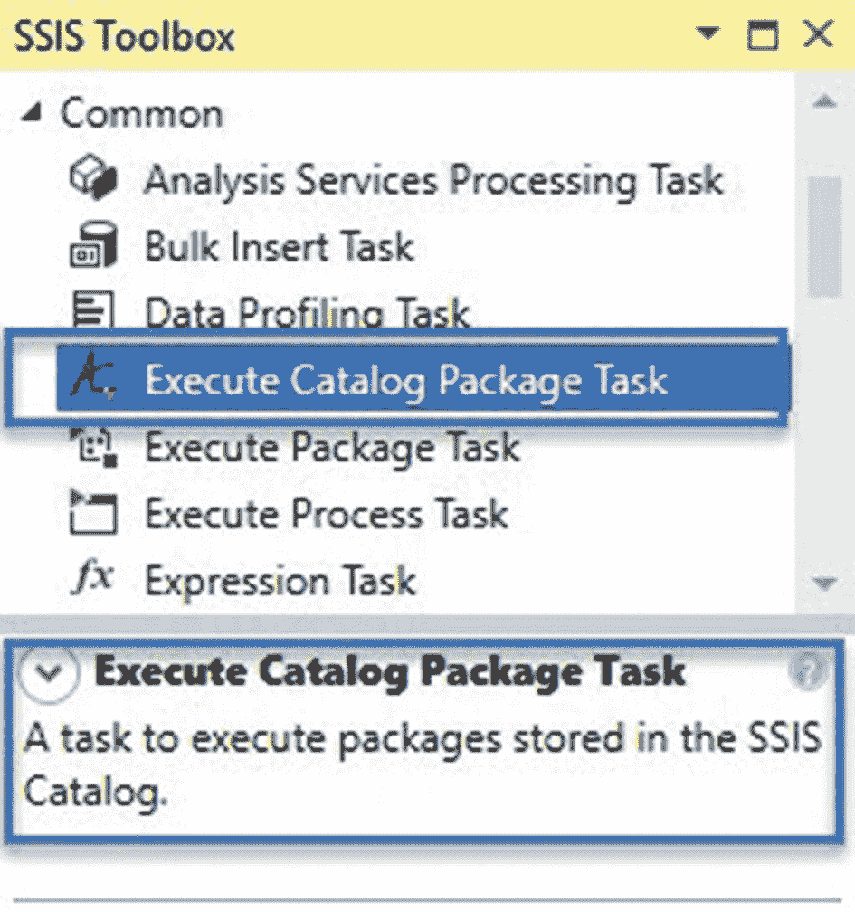

图 21-2

`执行目录包任务` 是否出现在 `SSIS 工具箱` 中？

断言：`执行目录包任务` 出现在 `SSIS 工具箱` 中。

测量结果：`True`。

断言：当在 `SSIS 工具箱` 中选择 `执行目录包任务` 时，`执行目录包任务` 的描述会显示在 `SSIS 工具箱` 的“信息”部分。

测量结果：`True`。

### 测试任务验证

场景：将一个 `执行目录包任务` 拖到测试 `SSIS` 包的 `控制流画布` 上。检查 `错误列表` 对话框，如图 21-3 所示：

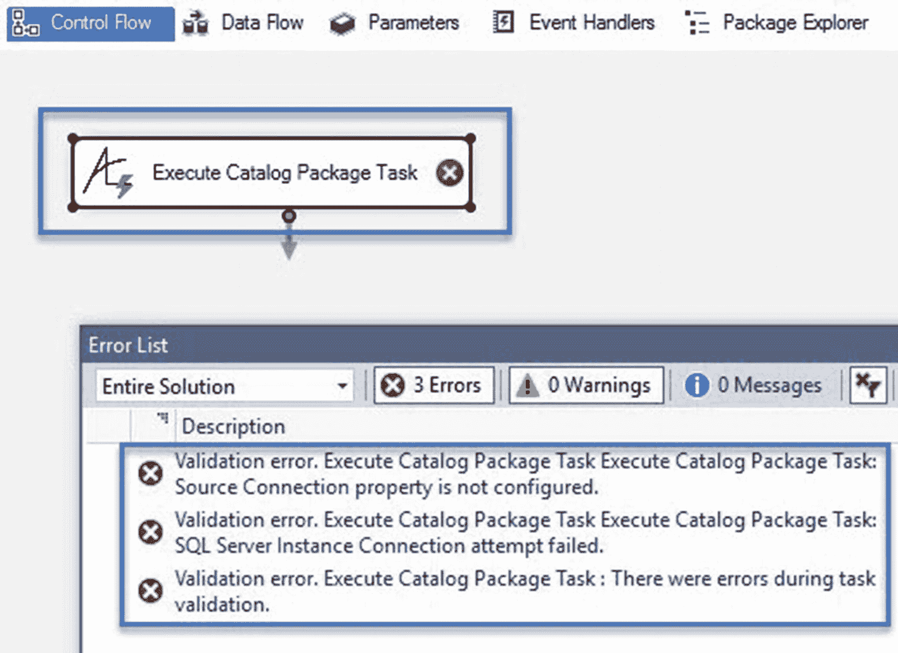

图 21-3

`执行目录包任务` 是否以错误形式出现在 `控制流画布` 上？

断言：可以将 `执行目录包任务` 添加到测试 `SSIS` 包的 `控制流画布`。

测量结果：`True`。

断言：新添加的 `执行目录包任务` 会引发验证错误。

测量结果：`True`。

断言：新添加的 `执行目录包任务` 所引发的验证错误是：

*   `源连接` 属性未正确配置。
*   `SQL Server 实例` 连接尝试失败。

测量结果：`True`。

断言：新添加的 `执行目录包任务` 所引发的上述验证错误会触发一个 `SSIS` 验证错误：

*   任务验证期间出现错误。

测量结果：`True`。

### 测试任务编辑器

在以下测试部分中，我们将操作 `执行目录包任务编辑器`。测试内容包括外观和功能。

场景：打开 `执行目录包任务编辑器`，如图 21-4 所示：

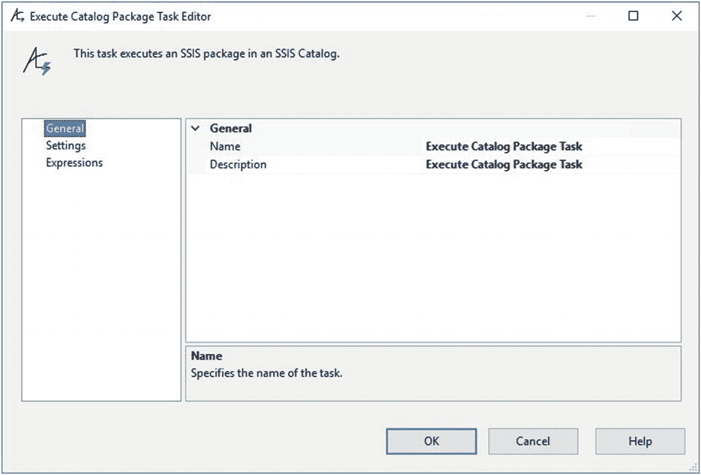

图 21-4

`执行目录包任务编辑器` 是否能无错误显示？

有时解决方案构建成功，但 `ExecuteCatalogPackageTask` 和 `ExecuteCatalogPackageTaskComplexUI` 类之间有一个（或多个）值未对齐。当发生这种未对齐时，编辑器将无法显示，而是显示错误。

断言：`执行目录包任务编辑器` 能无错误打开。

测量结果：`True`，`执行目录包任务编辑器` 能无错误打开。

断言：`执行目录包任务编辑器` 提供三个视图：

1.  `常规`
2.  `设置`
3.  `表达式`

测量结果：`True`。

断言：首次打开 `执行目录包任务编辑器` 时，显示的是 `常规` 视图。

测量结果：`True`。

断言：`常规` 视图显示 `执行目录包任务` 的 `名称` 和 `描述` 属性，且属性值可编辑。

测量结果：`True`。

场景：单击 `设置` 视图，如图 21-5 所示：

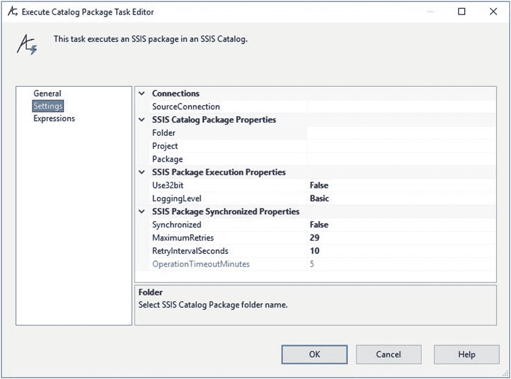

图 21-5

`执行目录包任务编辑器` 的 `设置视图` 是否能无错误显示？

断言：选择 `设置` 时，`设置` 视图能无错误显示。

测量结果：`True`。

断言：选择 `设置` 时，`设置` 视图显示以下类别和属性：

*   `连接`
    *   `SourceConnection`
*   `SSIS 目录包属性`
    *   `文件夹`
    *   `项目`
    *   `包`
*   `SSIS 包执行属性`
    *   `使用 32 位`
    *   `日志记录级别`
*   `SSIS 包同步属性`
    *   `同步`
    *   `最大重试次数`
    *   `重试间隔秒`
    *   `操作超时分钟`

测量结果：`True`

场景：单击 `SourceConnection` 属性下拉列表，如图 21-6 所示：

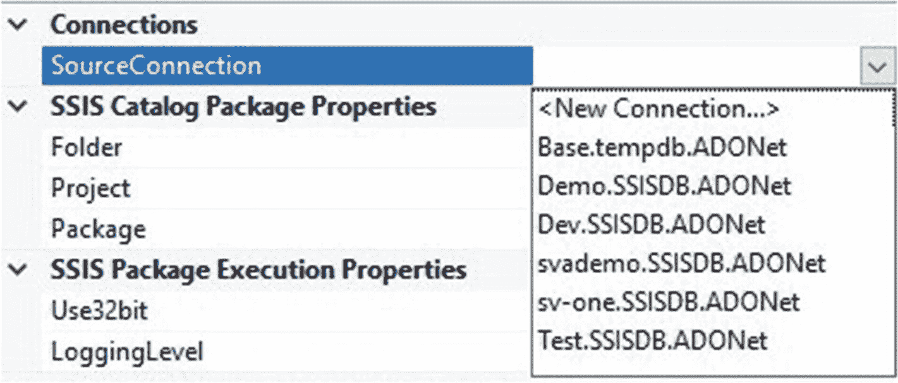

图 21-6

`SourceConnection` 下拉列表是否能无错误地显示所有可用的 `ADO.Net` 连接管理器？

断言：`SourceConnection` 下拉列表能无错误地显示所有可用的 `ADO.Net` 连接管理器。

测量结果：`True`。

场景：从 `SourceConnection` 属性下拉列表中配置 `SourceConnection` 属性值，如图 21-7 所示：

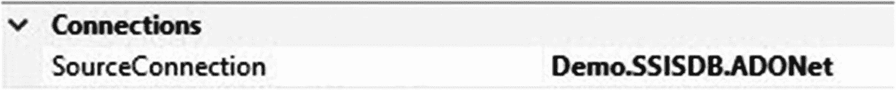

图 21-7

为 `SourceConnection` 属性选择值

场景：关闭 `执行目录包任务编辑器`，如图 21-8 所示：

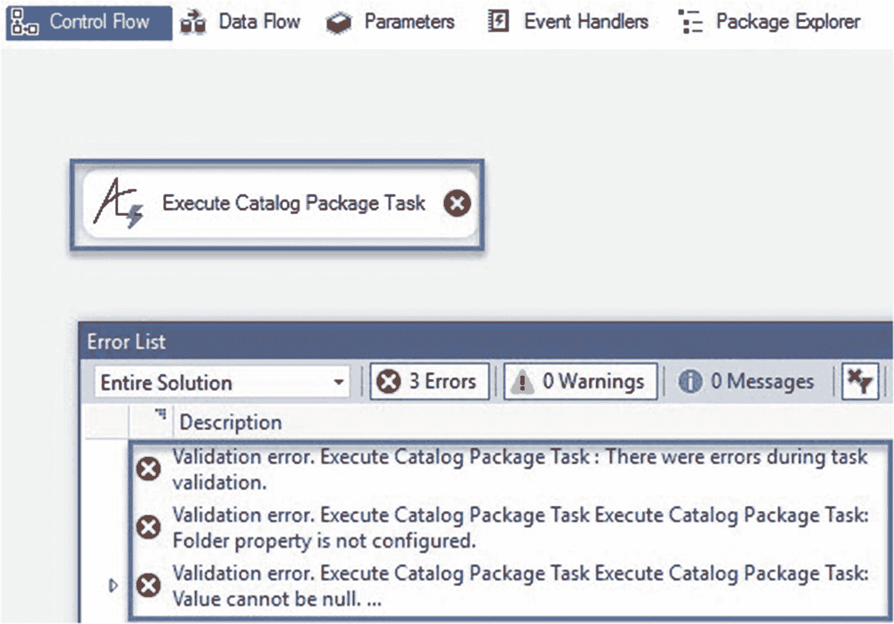

图 21-8

`执行目录包任务` 是否以错误形式出现在 `控制流画布` 上？

断言：当前配置的 `执行目录包任务` 所引发的验证错误是：

*   任务验证期间出现错误。
*   `文件夹` 属性未正确配置。
*   值不能为 null。

测量结果：`True`。

场景：打开 `执行目录包任务` 并导航到 `设置` 视图。单击 `文件夹` 属性下拉列表，如图 21-9 所示：

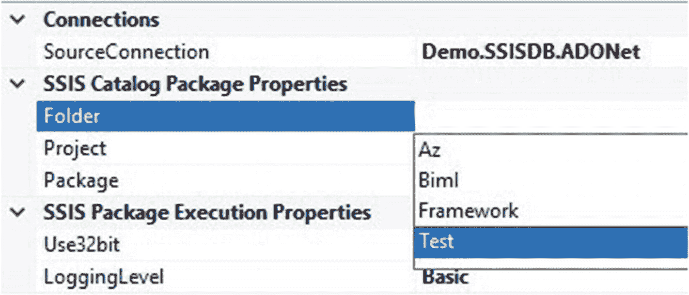

图 21-9

`文件夹` 下拉列表是否能无错误地显示在 `SourceConnection` 中配置的 `SSIS 目录` 中所有可用的文件夹？

## 执行目录包任务验证步骤

**场景：** 打开执行目录包任务编辑器，并点击`SourceConnection`属性下拉菜单，如图 21-10 所示：
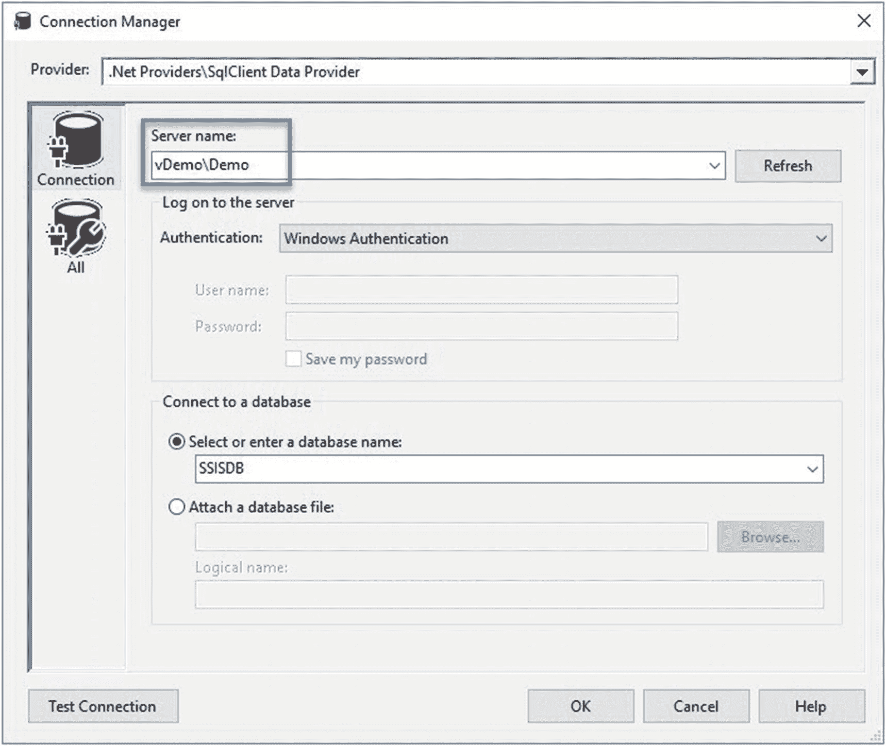
*图 21-10 从`SourceConnection`连接管理器获取 SQL Server 实例*

**断言：** `Folder`下拉列表显示了在`SourceConnection`属性中配置的 SSIS 目录中的所有可用文件夹，且没有错误。要验证这一点，请关闭执行目录包任务编辑器，然后编辑在`SourceConnection`属性中选择的 SSIS 包连接管理器，如图 21-10 所示。

使用`SQL Server Management Studio (SSMS)`连接到`SourceConnection` SQL Server 实例。打开 SSMS 对象资源管理器并展开“Integration Services 目录”。展开`SSISDB`节点并观察 SSIS 目录文件夹，如图 21-11 所示：
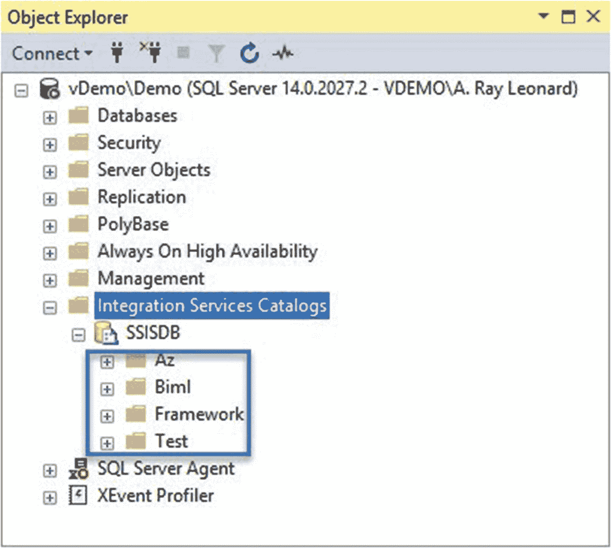
*图 21-11 观察 SSIS 目录文件夹*

图 21-11 中显示的 SSIS 目录文件夹与图 21-9 中显示的 SSIS 目录文件夹列表相匹配。

**度量：** 真。

**场景：** 从`Folder`属性下拉列表中配置`Folder`属性值，如图 21-12 所示：
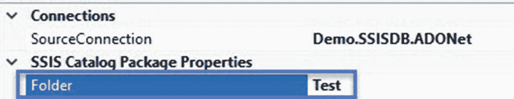
*图 21-12 为`Folder`属性选择一个值*

**场景：** 关闭执行目录包任务编辑器，如图 21-13 所示：
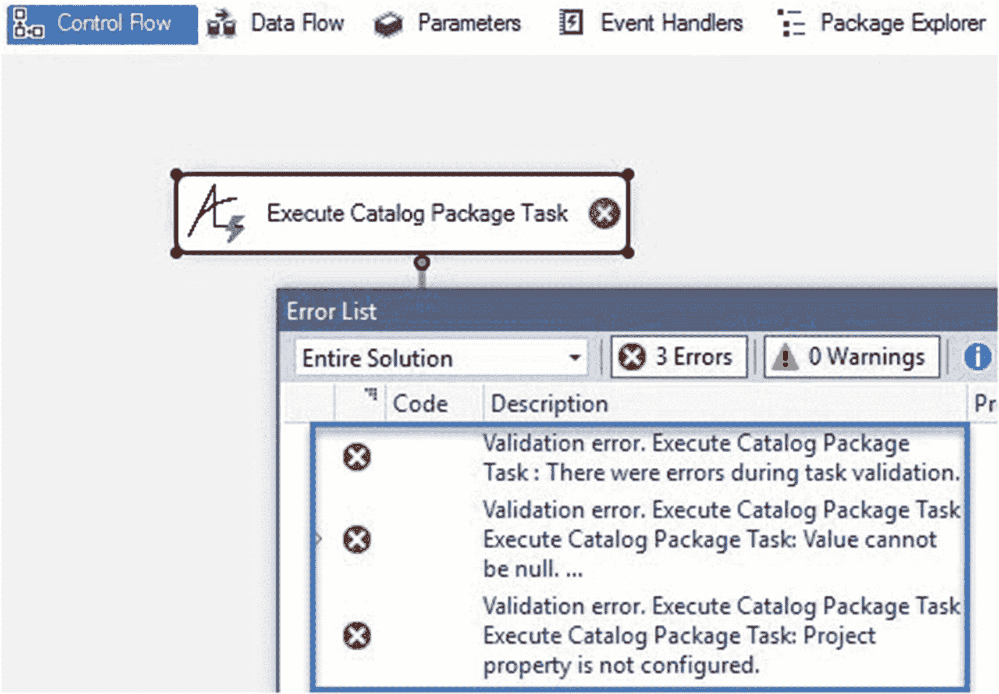
*图 21-13 关闭编辑器*

执行目录包任务是否**出错**地显示在控制流画布上？

**断言：** 当前配置的执行目录包任务引发的验证错误是：
*   `There were errors during the task validation.`
*   `Value cannot be null.`
*   `Project`属性未正确配置。

**度量：** 真。

**场景：** 打开执行目录包任务并导航到“设置”视图。单击`Project`属性下拉菜单，如图 21-14 所示：
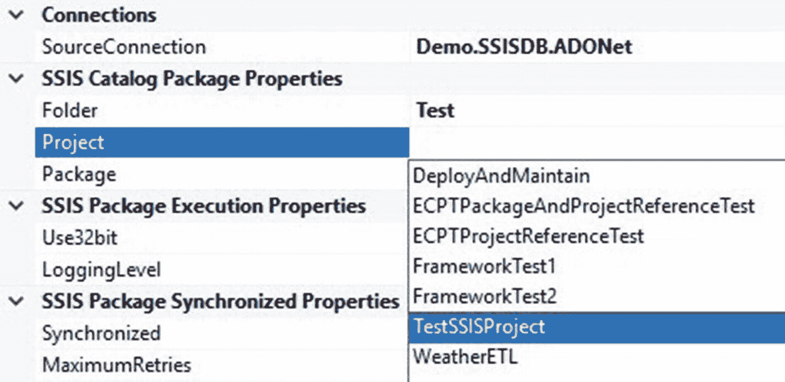
*图 21-14 点击`Project`属性下拉菜单*

`Project`下拉列表是否显示了在`Folder`属性中配置的 SSIS 目录文件夹中的所有可用项目，且没有错误？

**断言：** `Project`下拉列表显示了在`Folder`属性中配置的 SSIS 目录文件夹中的所有可用项目，且没有错误。要验证这一点，请使用`SQL Server Management Studio (SSMS)`连接到`SourceConnection` SQL Server 实例。打开 SSMS 对象资源管理器并展开“Integration Services 目录”。展开`SSISDB`节点，然后展开在执行目录包任务`Folder`属性中配置的 SSIS 目录文件夹，如图 21-15 所示：
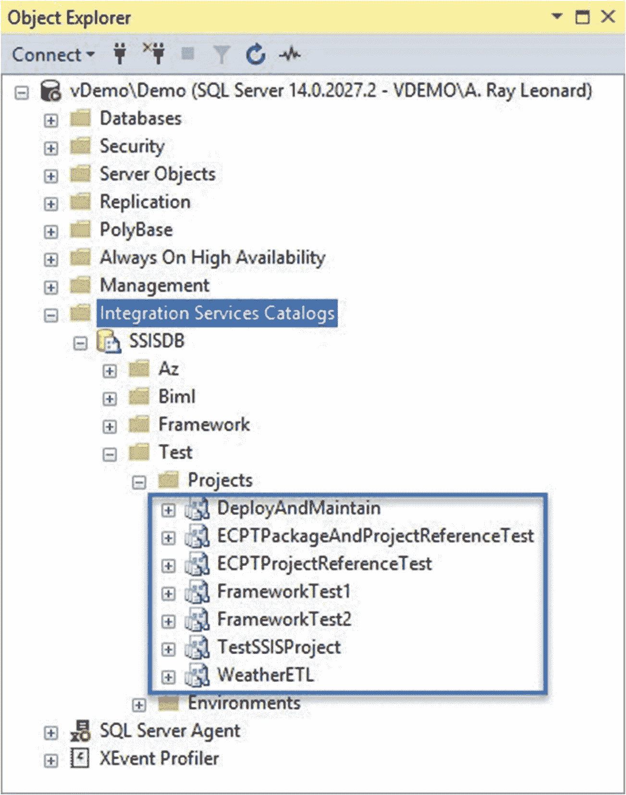
*图 21-15 观察已配置 SSIS 文件夹中的 SSIS 目录项目*

图 21-15 中显示的 SSIS 目录项目与图 21-14 中显示的 SSIS 目录项目列表相匹配。

**度量：** 真。

**场景：** 从`Project`属性下拉列表中配置`Project`属性值，如图 21-16 所示：
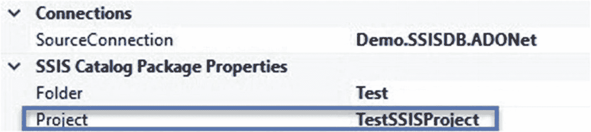
*图 21-16 为`Project`属性选择一个值*

**场景：** 关闭执行目录包任务编辑器，如图 21-17 所示：
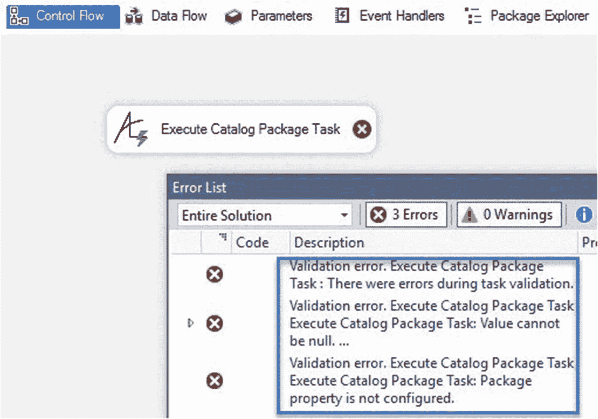
*图 21-17 关闭编辑器*

执行目录包任务是否**出错**地显示在控制流画布上？

**断言：** 当前配置的执行目录包任务引发的验证错误是：
*   `There were errors during the task validation.`
*   `Value cannot be null.`
*   `Package`属性未正确配置。

**度量：** 真。

**场景：** 打开执行目录包任务并导航到“设置”视图。单击`Package`属性下拉菜单，如图 21-18 所示：
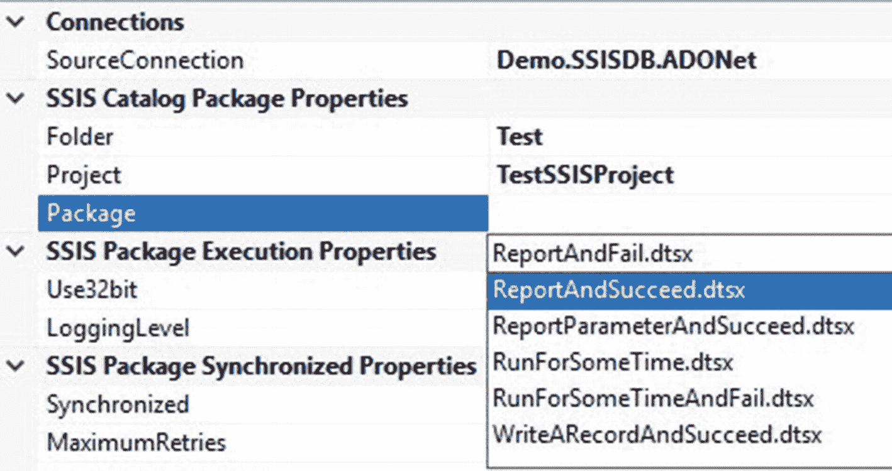
*图 21-18 点击`Package`属性下拉菜单*

`Package`下拉列表是否显示了在`Project`属性中配置的 SSIS 目录项目中的所有可用包，且没有错误？

**断言：** `Package`下拉列表显示了在`Project`属性中配置的 SSIS 目录项目中的所有可用包，且没有错误。要验证这一点，请使用`SQL Server Management Studio (SSMS)`连接到`SourceConnection` SQL Server 实例。打开 SSMS 对象资源管理器并展开“Integration Services 目录”。展开`SSISDB`节点，展开在执行目录包任务`Folder`属性中配置的 SSIS 目录文件夹，然后展开在执行目录包任务`Project`属性中配置的 SSIS 目录项目，如图 21-19 所示：
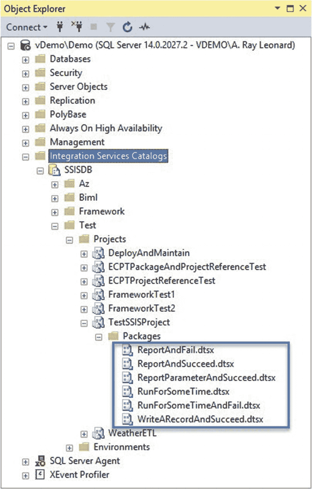
*图 21-19 观察已配置 SSIS 项目中的 SSIS 目录包*

图 21-19 中显示的 SSIS 目录包与图 21-18 中显示的 SSIS 目录项目列表相匹配。

**度量：** 真。

**场景：** 关闭执行目录包任务编辑器，并在 SSIS 测试包控制流上查看执行目录包任务，如图 21-20 所示：
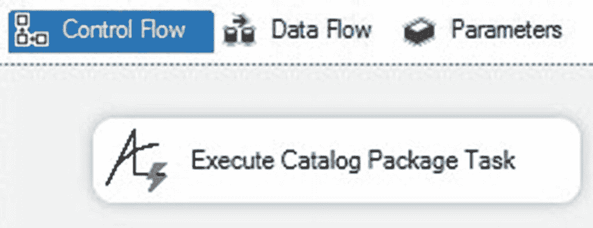
*图 21-20 为通过验证而进行最小化配置的执行目录包任务*

**断言：** 当前配置的执行目录包任务未引发任何验证错误。

**度量：** 真。

### 测试执行

在测试流程的这个节点，我们切换一下工作模式。虽然我非常热衷于手动软件测试，并喜欢用“测试术语”记录测试结果以便后人查阅，但并非所有人都像我一样对此充满热情。从这里开始，我们将切换到**散文体**表述。

目前，`执行目录包任务`的配置如图 21-21 所示：

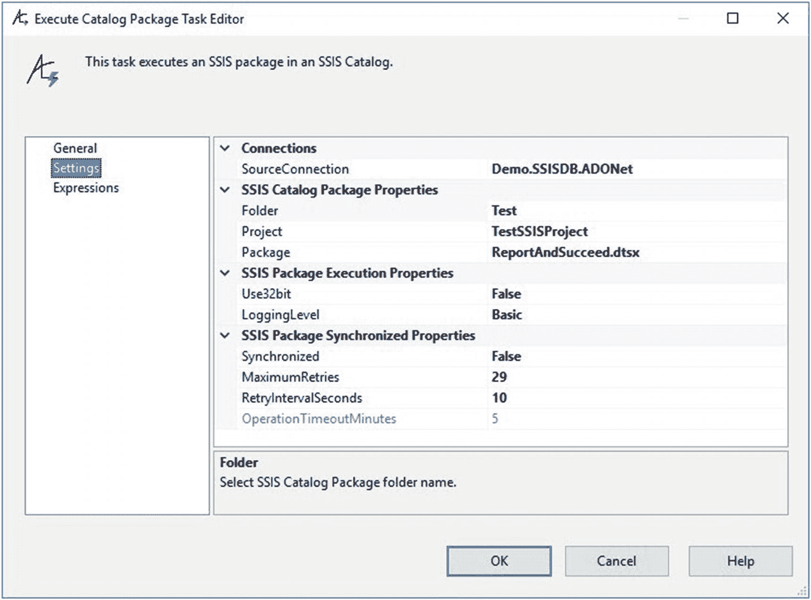

图 21-21：配置完成的`执行目录包任务`

当前配置用于测试异步 SSIS 包执行，因为`同步化`属性（映射到 SSIS 目录执行参数）被设置为`false`，这是其默认值。

执行测试 SSIS 包。如果一切按计划进行，包含`执行目录包任务`的测试 SSIS 包将成功执行，如图 21-22 所示：

图 21-22：成功的测试执行

观察`进度/执行结果`选项卡，验证作为事件引发的插桩消息，如图 21-23 所示：

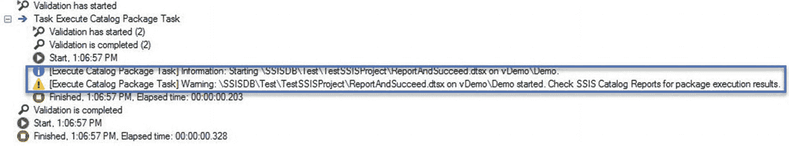

图 21-23：验证事件

要测试同步 SSIS 包执行，请打开`执行目录包任务`编辑器，并将`同步化`属性更新为`True`，如图 21-24 所示：

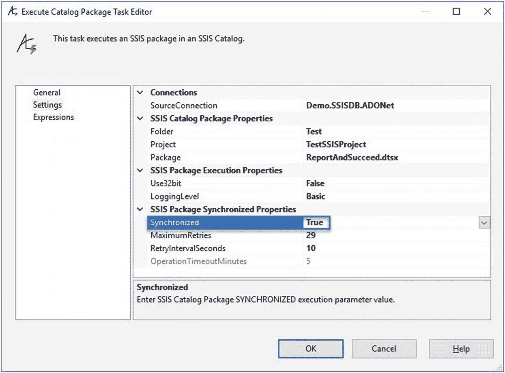

图 21-24：准备测试同步化执行

单击确定按钮关闭`执行目录包任务`编辑器，并在调试器中执行测试 SSIS 包。如果一切按计划进行，包含`执行目录包任务`的测试 SSIS 包将成功执行，如图 21-25 所示：

图 21-25：又一次成功的测试执行

查看`进度/执行结果`选项卡，验证是否存在异步执行事件消息，如图 21-26 所示：

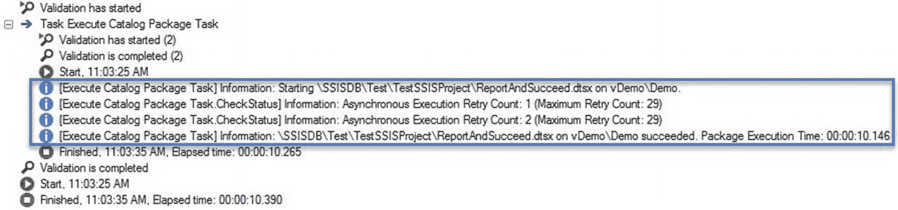

图 21-26：异步执行事件消息：确认无误

将`执行目录包任务`配置为同步执行一个设计为失败的 SSIS 包，如图 21-27 所示：

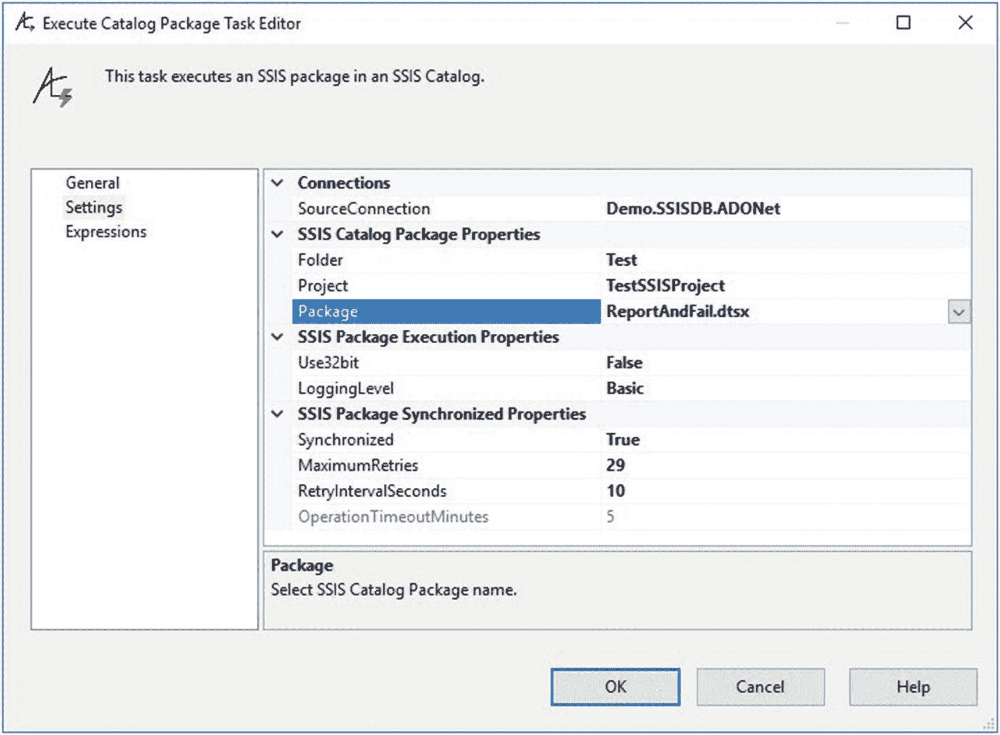

图 21-27：准备测试同步执行一个构建为失败的 SSIS 包

如预期所料，SSIS 包和`执行目录包任务`失败，如图 21-28 所示：

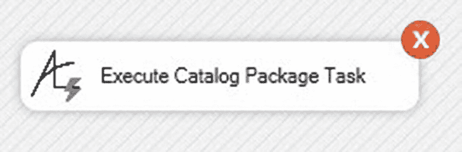

图 21-28：如预期，执行失败

观察`进度/执行结果`选项卡，如图 21-29 所示：

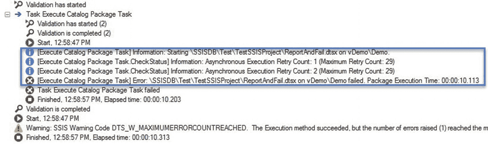

图 21-29：同步执行事件消息，确认无误

将`执行目录包任务`配置为`异步`执行同一个设计为失败的 SSIS 包，如图 21-30 所示：

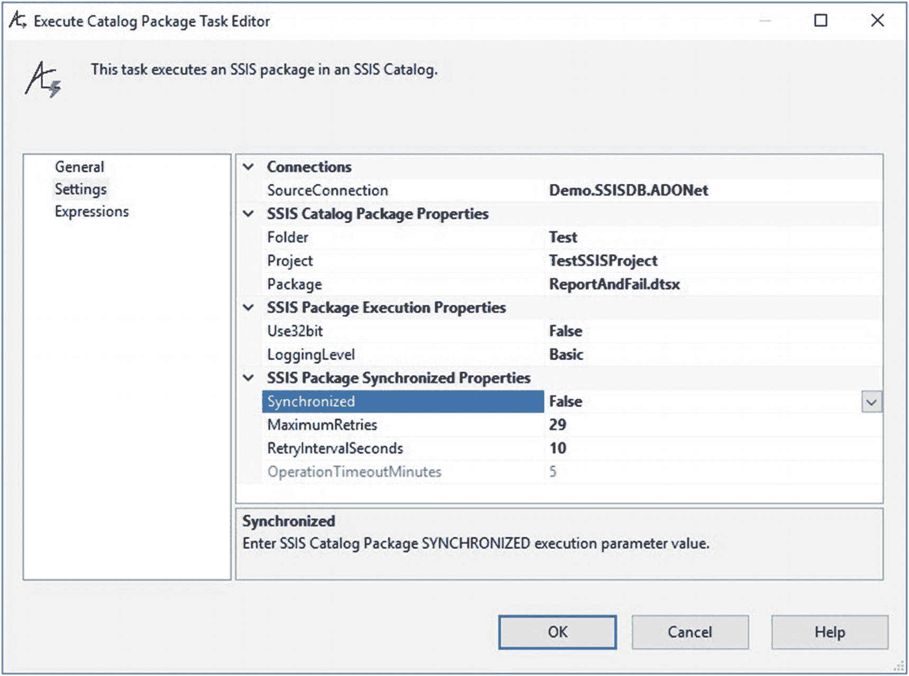

图 21-30：准备测试非同步执行一个构建为失败的 SSIS 包

如预期所料，SSIS 包和`执行目录包任务``成功`，如图 21-31 所示：

图 21-31：一个包的成功执行，还是说并非如此？

验证在`进度/执行结果`选项卡上找到的插桩消息是否与异步执行相符，如图 21-32 所示：

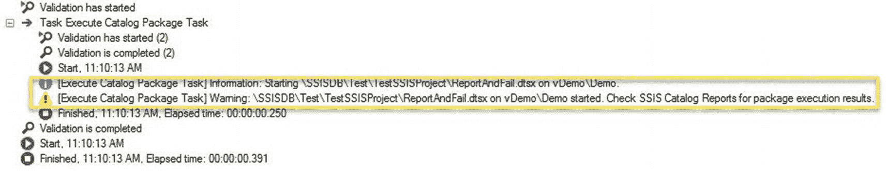

图 21-32：异步执行插桩事件

检查 SSIS 目录的“所有执行”报告。

配置一个运行时间较长（超过 30 秒）且设计为成功的 SSIS 包。将该 SSIS 包配置为同步执行，如图 21-33 所示：

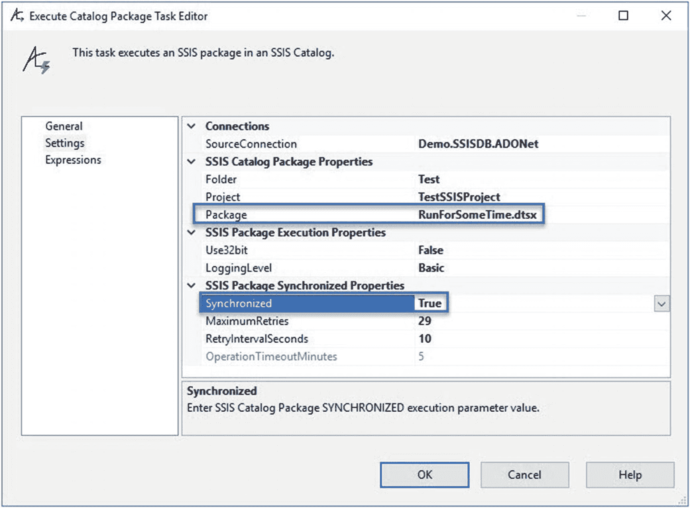

图 21-33：配置一个运行时间较长的同步 SSIS 包执行

如果一切按计划进行，SSIS 包和`执行目录包任务`将成功执行，如图 21-34 所示：

图 21-34：又一次成功的执行

观察`进度/执行结果`，验证插桩消息是否准确反映了执行进度，如图 21-35 所示：

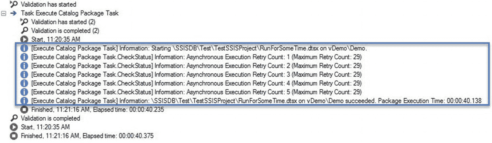

图 21-35：运行时间较长的同步执行事件消息

配置一个运行时间较长（超过 30 秒）且设计为失败的 SSIS 包。将该 SSIS 包配置为同步执行，如图 21-36 所示：

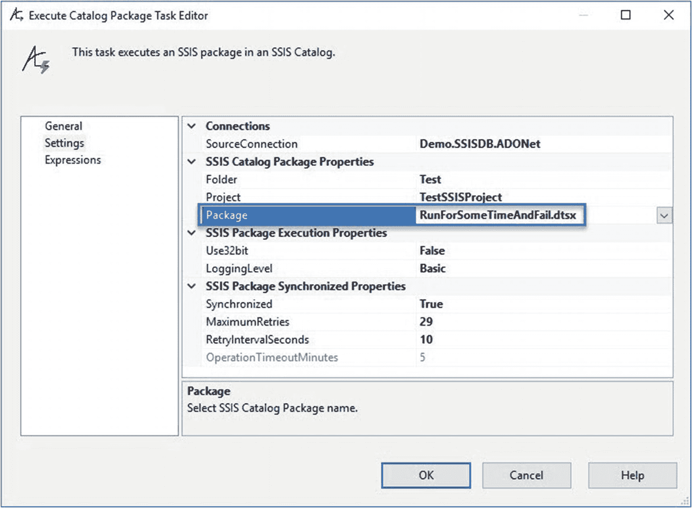

图 21-36：配置一个构建为失败的长时同步 SSIS 包

如果一切按计划进行，SSIS 包和`执行目录包任务`将失败，如图 21-37 所示：

图 21-37：如预期，执行失败

验证在`进度/执行结果`选项卡上找到的插桩消息是否与同步执行相符，如图 21-38 所示：

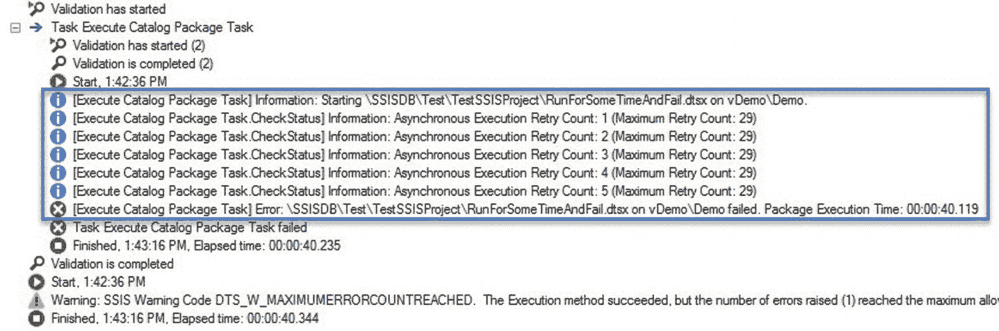

图 21-38：同步失败执行插桩事件

将`执行目录包任务`配置为`异步`执行同一个设计为失败的 SSIS 包，如图 21-39 所示：

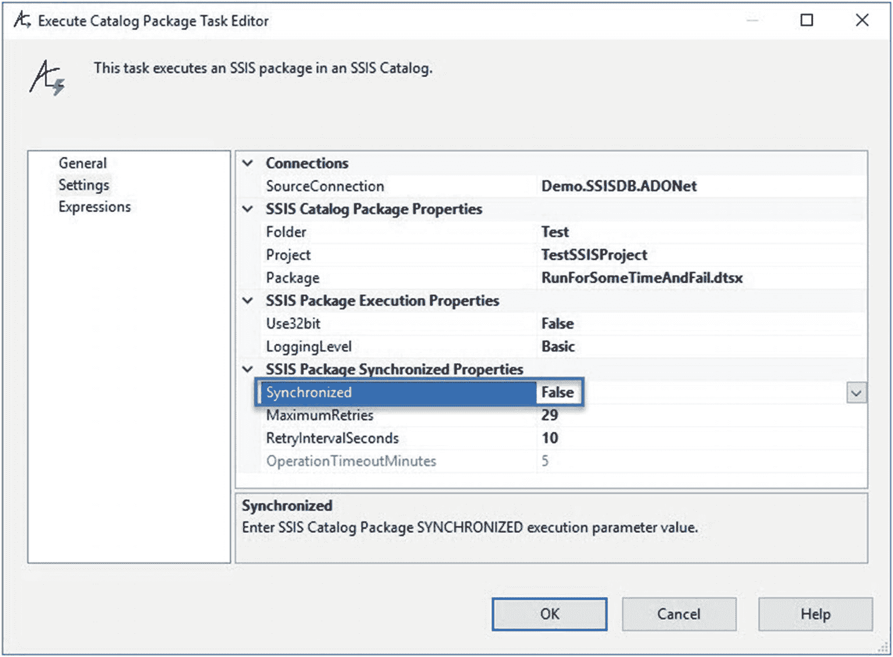

图 21-39：准备测试非同步执行同一个构建为失败的 SSIS 包

如预期所料，SSIS 包和`执行目录包任务`将成功执行，如图 21-40 所示：

图 21-40：成功的执行

## 测试超时功能

通过配置一个设计为成功的长运行 SSIS 包来测试超时功能。将 `Synchronized` 属性设置为 `True`，然后配置 `MaximumRetries` 和 `RetryIntervalSeconds` 属性，使得 SSIS 包执行的 `MaximumRetries` 值*在* SSIS 包执行完成*之前*达到，如图 21-41 所示：

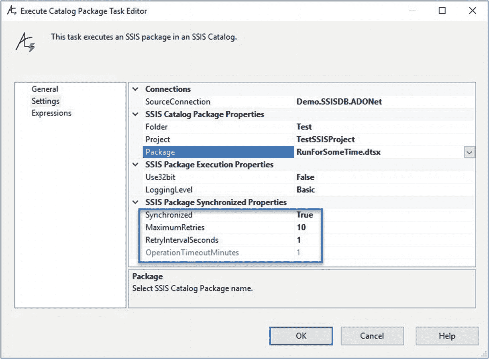

图 21-41

测试 `MaximumRetries`

如果一切按计划进行，SSIS 包和执行目录包任务将失败，如图 21-42 所示：

图 21-42

预期的失败执行

检查“进度/执行结果”选项卡，以验证是否显示了正确的事件消息——即指示 SSIS 包执行被取消的事件消息，如图 21-43 所示：

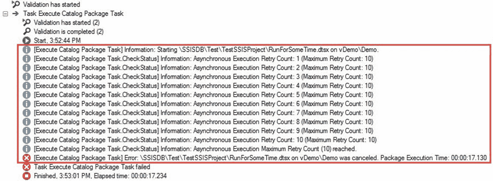

图 21-43

SSIS 包执行已取消

下一步是验证 SSIS 目录中 SSIS 包的执行是否已被取消。打开 `SSMS` 并连接到承载 SSIS 目录的 `SQL Server` 实例。打开“所有执行”报告以查看 SSIS 包执行的状态，如图 21-44 所示：

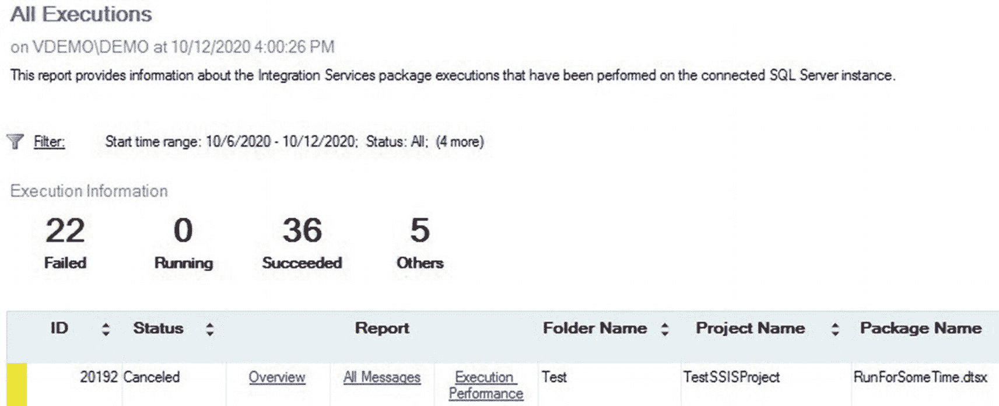

图 21-44

SSIS 目录中的 SSIS 包执行状态

如果一切按计划进行，`SSMS` 中的“所有执行”SSIS 目录报告应指示 SSIS 包执行已取消。

### 结论

在本章中，我们应用了一种手动测试技术进行测试验证，然后测试了执行目录包任务的执行功能。

下一步是构建一个安装程序文件，以便于在企业中分发执行目录包任务。

现在是一个签入代码的好时机。

