# 22. 构建安装项目

安装项目允许开发人员管理代码在企业中的分发以及与其他企业共享代码。`SSIS` 长期以来一直促进着第三方任务和组件开发人员的健康发展。在本章中，我们将一个安装项目添加到 `ExecuteCatalogPackageTask` 解决方案中，并配置该项目，以便在其他服务器上安装执行目录包任务，步骤如下：

*   添加 `ExecuteCatalogPackageTaskSetup` 项目。
*   添加引用。
*   配置产品标签。
    *   配置包标签。
    *   配置安装路径属性标签。
    *   配置 `MajorUpgrade` 和 `MediaTemplate` 标签。
    *   初始化 `UIRef` 和许可证文件标签。
    *   配置安装功能和图标。
*   配置文件夹和文件夹结构。
    *   配置 `ExecuteCatalogPackageTask` 的 `GAC` 注册。
    *   配置 `ExecuteCatalogPackageTask Tasks` 部署文件夹。
    *   配置 `ExecuteCatalogPackageTaskComplexUI` 的 `GAC` 注册。
    *   配置 `ExecuteCatalogPackageTaskComplexUI Tasks` 部署文件夹。

安装项目会创建一个名为 `setup.exe` 或 `<*项目名称*>.msi` 的文件。一个名为 `MsiExec.exe` 的 `Windows` 应用程序执行 `msi` 文件来安装所需软件。`Visual Studio` 支持可显示安装项目的扩展。其中一个扩展是 `Windows Installer XML` (`WiX`)。请访问 `WiX` 工具集页面 (`wixtoolset.org`) 下载并安装我们将用于构建 `ExecuteCatalogPackageTask.msi` 文件的 `Visual Studio` 项目模板。

要遵循本章中的演示和示例，读者*必须*访问 `wixtoolset.org`，下载最新版本的软件，并按照 `wixtoolset.org` 上的 `WiX` 工具集安装说明进行操作。

本章仅列出了为执行目录包任务配置 `msi` 安装程序文件所需的 `XML`，未提供太多解释。鼓励读者在 `wixtoolset.org` 了解更多关于使用 `WiX` 工具集的信息，在那里可以找到深入的文档和示例：`wixtoolset.org/documentation`。

### 添加 ExecuteCatalogPackageTaskSetup 项目

要将安装项目添加到 `ExecuteCatalogPackageTask` 解决方案，请在解决方案资源管理器中右键单击解决方案，将鼠标悬停在“添加”上，然后单击“新建项目”，如图 22-1 所示：

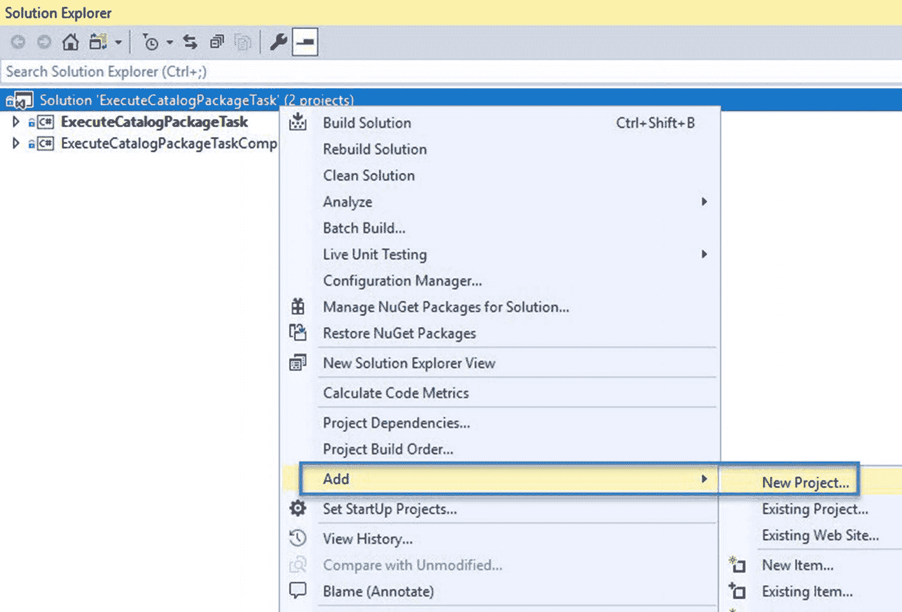

图 22-1

添加新的安装项目

当“添加新项目”对话框显示时，导航到 `WiX` 工具集模板类别并选择最新版本。在可用模板列表中选择 `WiX` 的安装项目，然后将新项目命名为 `ExecuteCatalogPackageTaskSetup`，如图 22-2 所示：

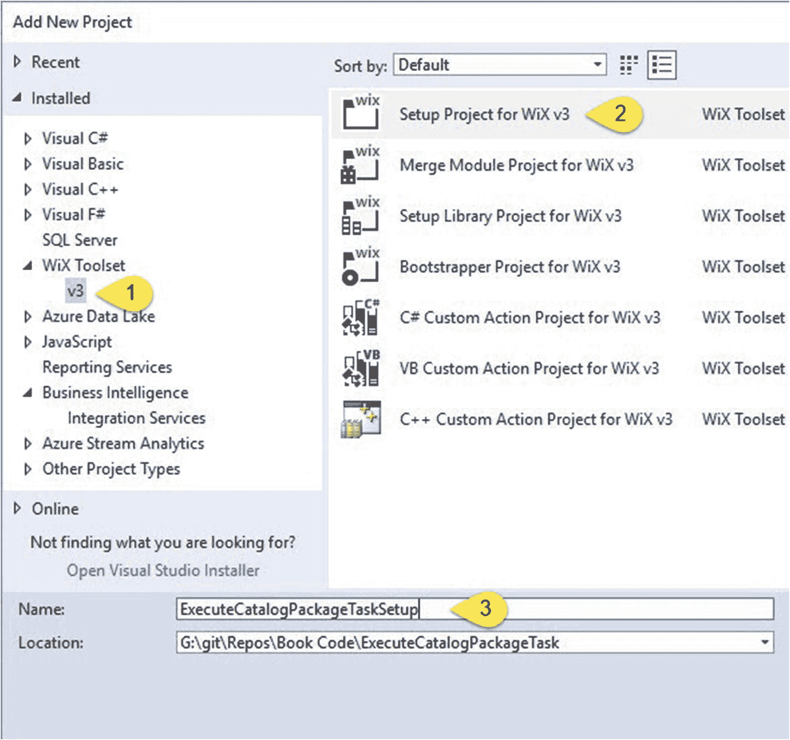

图 22-2

添加 `ExecuteCatalogPackageTaskSetup` 项目

将新项目添加到 `ExecuteCatalogPackageTask` 解决方案后，解决方案资源管理器如图 22-3 所示：

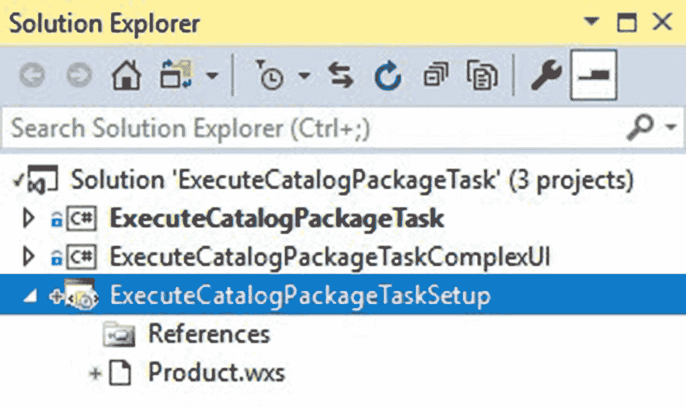

图 22-3

`ExecuteCatalogPackageTaskSetup` 项目

将 `ExecuteCatalogPackageTask.wxs` 文件重命名为 `ExecuteCatalogPackageTask.wxs`，如图 22-4 所示：

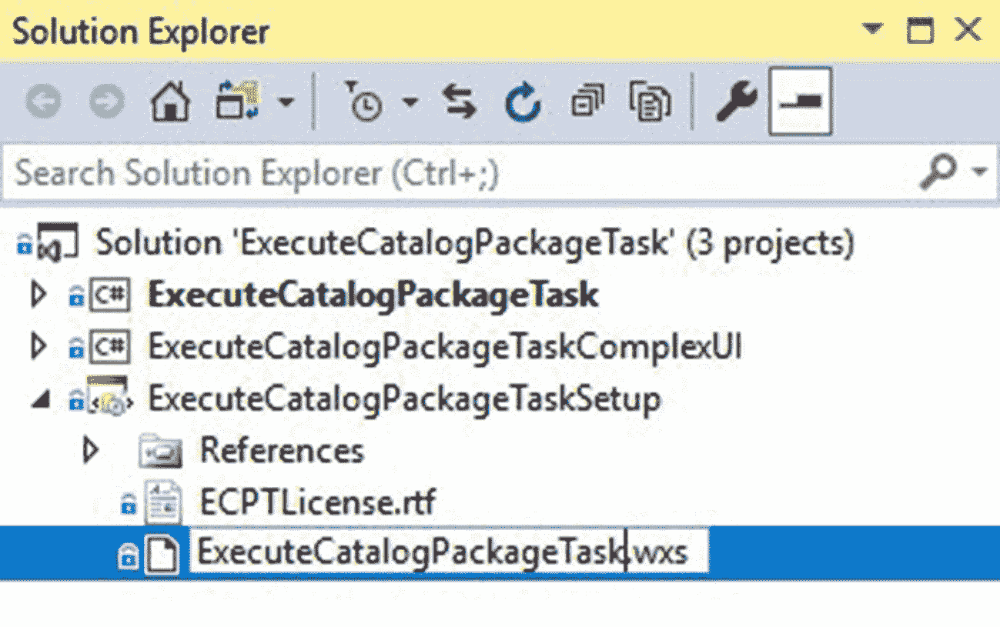

图 22-4

将 `ExecuteCatalogPackageTask.wxs` 文件重命名为 `ExecuteCatalogPackageTask.wxs`

下一步是添加引用。

### 配置标签

在本节中，我们配置 `WiX` 标签以构建安装项目，用于在运行 `SQL Server 2017` 的 `Windows Server 2016` 上安装执行目录包任务。


## 配置 Product 标签

在解决方案资源管理器中，双击 `ExecuteCatalogPackageTask.wxs` 文件以在 Visual Studio 编辑器中打开它，如图 22-9 所示：

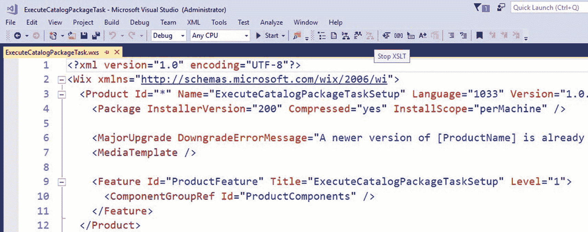
图 22-9
`ExecuteCatalogPackageTask.wxs` 文件

WiX 工具集的流程使用 `ExecuteCatalogPackageTask.wxs` 文件中的设置来配置 msi 安装程序项目，并默认包含一个有用的模板。下一步是根据需要编辑此模板，以安装 Execute Catalog Package Task。

`ExecuteCatalogPackageTask.wxs` 文件以一个 XML 声明开始，如图 22-10 所示：

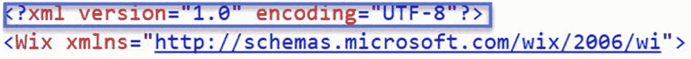
图 22-10
xml 标签

下一个标签，即 `Wix` 标签，封装了 `ExecuteCatalogPackageTask.wxs` 文件的其余部分，如图 22-11 所示：

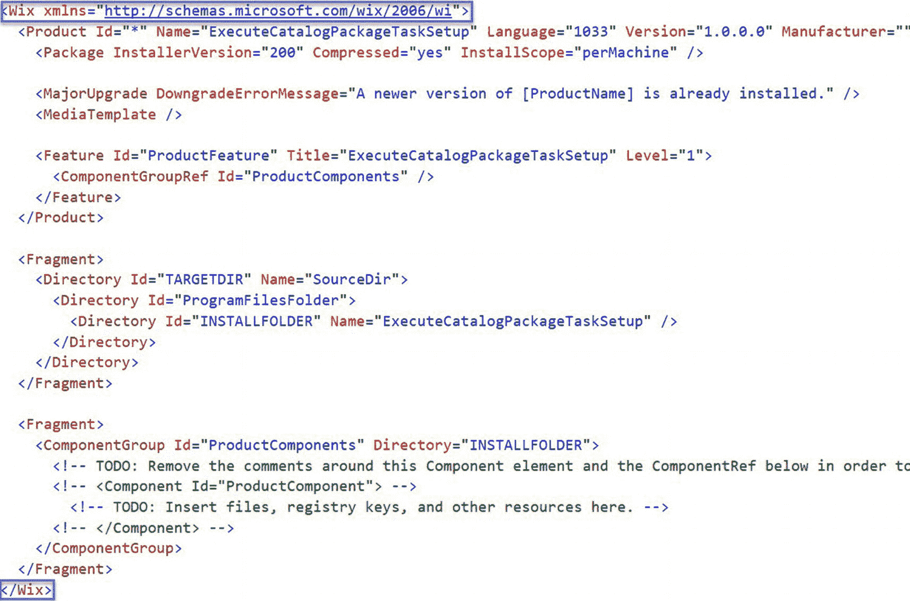
图 22-11
Wix 标签

下一步是配置 `Product` 标签。首先将 `Product` 标签的属性放在不同的行上。`Product Id` 值被配置为 "`*`"，这表示该值将自动生成。根据需要，将 `Product Name` 属性值更新为 "Execute Catalog Package Task"，同时更新 `Product Version` 和 `Product Manufacturer` 属性值。我建议将 `Product Language` 和 `UpgradeCode` 属性值保留为其默认值。由于 XML 会忽略空白字符，因此可以随意在 `ExecuteCatalogPackageTask.wxs` 文件中添加空格，如图 22-12 所示：

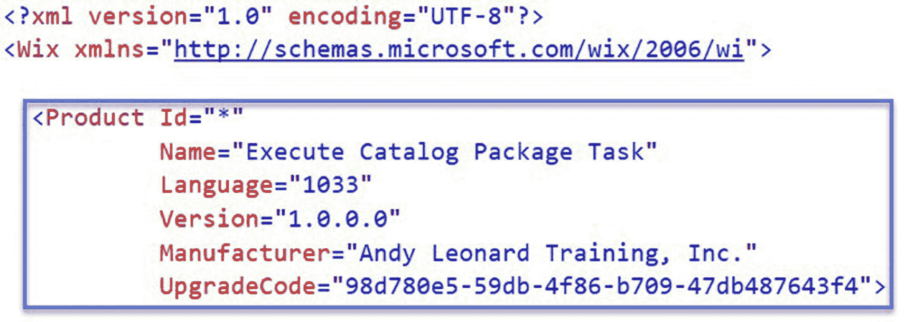
图 22-12
更新 Product 标签

## 配置 Package 标签

安装过程需要管理员权限以搜索注册表、安装到 Program Files (x86) 路径，并在目标服务器的全局程序集缓存 (GAC) 中注册程序集。通过添加两个属性——`InstallPrivileges` 和 `AdminImage`——来配置 `Package` 标签，以允许以管理员身份进行安装，使用清单 22-1 中的 XML：

```
InstallPrivileges="elevated"
AdminImage="yes"
```
清单 22-1
允许管理员安装

添加后，XML 如图 22-13 所示：

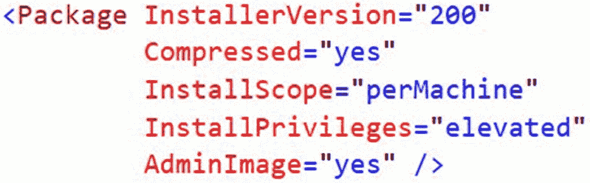
图 22-13
已编辑 Package 标签以允许管理员安装权限

## 配置安装路径属性标签

SSIS 任务程序集安装在 `<驱动器>:\ Program Files (x86)\Microsoft SQL Server\<版本>\DTS\Tasks` 文件夹中，以供开发时使用。SSIS 任务程序集在全局程序集缓存 (GAC) 中注册，以供执行时使用。

下一步是使用清单 22-2 中的 XML 添加一个用于 SSIS 任务安装文件夹的属性：

```
```
清单 22-2
添加 SSIS 任务安装文件夹属性

添加后，XML 如图 22-14 所示：


图 22-14
添加 SSIS 任务安装文件夹属性

下一步是使用清单 22-3 中的 XML 添加 SSIS 文件夹属性：

```
```
清单 22-3
添加 SSIS 文件夹属性

添加后，XML 如图 22-15 所示：

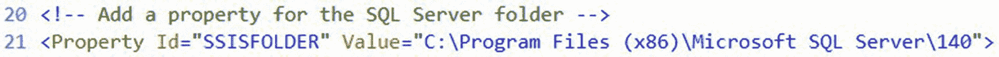
图 22-15
添加 SSIS 文件夹属性

在第 21 行，通过设置 Id 属性值并提供默认的 Value 属性值来配置该属性。

下一步是添加 SSIS 文件夹属性。此步骤在配置安装项目时挑战性最高，因为它依赖于 Windows 注册表，并且不同 Windows 操作系统和不同版本的 SQL Server 的注册表会将值存储在不同的位置。如何以及在哪里定位注册表值——甚至你找到的值是否**准确**——可能都需要反复试验。

对于运行在 Windows Server 2016 上的 SQL Server 2017，使用清单 22-4 中的 XML 配置注册表搜索 XML：

```
```
清单 22-4
添加 RegistrySearch XML

添加后，XML 如图 22-16 所示：

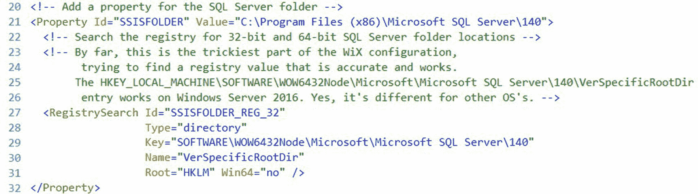
图 22-16
添加 RegistrySearch XML

在第 27-31 行，读取 `HKEY_LOCAL_MACHINE\SOFTWARE\WOW6432Node\Microsoft\Microsoft SQL Server\140\VerSpecificRootDir` 注册表项，并用该键值设置属性的 Value 属性，如图 22-17 所示：

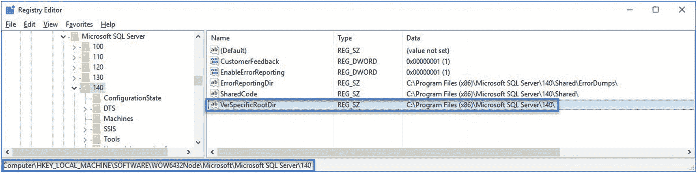
图 22-17
读取 `HKEY_LOCAL_MACHINE\SOFTWARE\WOW6432Node\Microsoft\Microsoft SQL Server\140\VerSpecificRootDir` 注册表项值

请注意，第 27 行的 Root 属性值是 "`HKLM.`"。`HKLM` 是 `HKEY_LOCAL_MACHINE` 的缩写。

下一步是通过组合前面的属性来设置 SSIS 安装目录，以完成 `SSISINSTALLFOLDER` 属性值的值配置，使用清单 22-5 中的 XML：

```
```
清单 22-5
完成 `SSISINSTALLFOLDER` 值配置

添加后，XML 如图 22-18 所示：

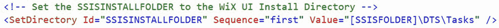
图 22-18
完成 `SSISINSTALLFOLDER` 值配置

`SSISINSTALLFOLDER` 值现已配置完成。

## 配置 MajorUpgrade 和 MediaTemplate 标签

下一步是使用清单 22-6 中的 XML 配置 `MajorUpgrade` 和 `MediaTemplate` 标签：

```
```
清单 22-6
配置 `MajorUpgrade` 和 `MediaTemplate` 标签

`MajorUpgrade` 标签包含一条消息（位于 `DowngradeErrorMessage` 属性中），当已安装更新版本的 Execute Catalog Package Task 时显示。`MediaTemplate` 标签的属性是 `EmbedCab` 和 `CompressionLevel`。`EmbedCab` 控制包含 Execute Catalog Package Task 安装代码的*CAB 文件*是否嵌入到产品 (msi) 文件中。`CompressionLevel` 设置 cab 文件的压缩级别。

添加后，XML 如图 22-19 所示：

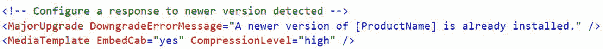
图 22-19
配置 `MajorUpgrade` 和 `MediaTemplate` 标签

下一步是：初始化 `UIRef` 和 `License` 文件标签。


### 初始化 UIRef 和许可证文件标签

使用清单 22-7 中的 XML 初始化 `UIRef` 和 `License` 文件标签：
```
清单 22-7
初始化 UIRef 和 License 标签
```

添加后，XML 将如图 22-20 所示：
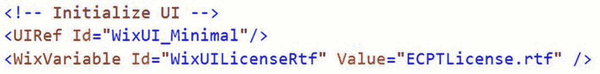
**图 22-20**
添加并初始化 UIRef 和 WixUILicenseRtf WixVariable

软件授权超出了我的职责范围，因此我使用了 creativecommons.org 上可用的工具，如图 22-21 所示：
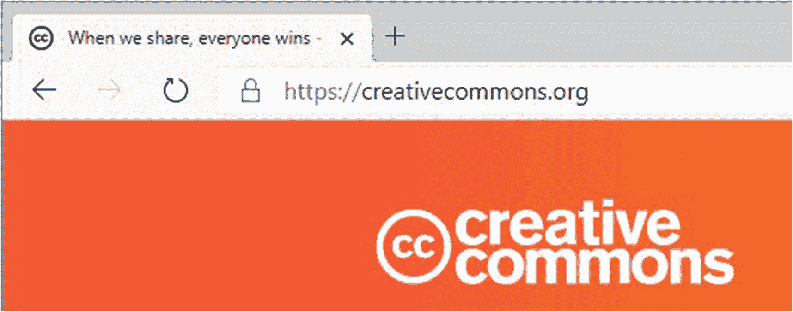
**图 22-21**
Creativecommons.org

在撰写本文时，Creative Commons 网站提供了一个名为 Chooser 的基于步骤的页面（目前在 chooser-beta.creativecommons.org 处于测试阶段），用户回答问题后，Chooser 会推荐一个许可证，如图 22-22 所示：
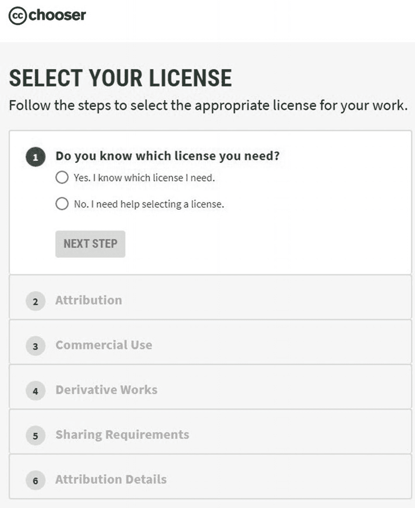
**图 22-22**
Chooser

问题完成后，从网站上复制富文本格式文档，如图 22-23 所示：
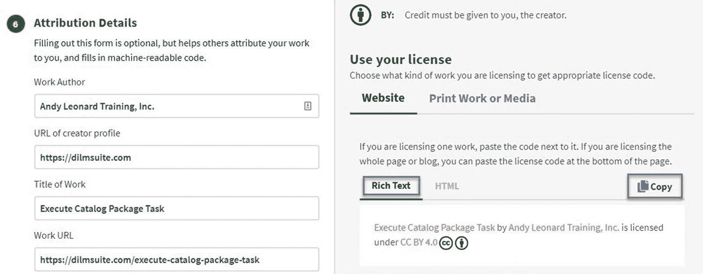
**图 22-23**
复制许可证富文本格式

复制后，打开 WordPad（或其他富文本格式编辑器）并粘贴剪贴板内容，如图 22-24 所示：
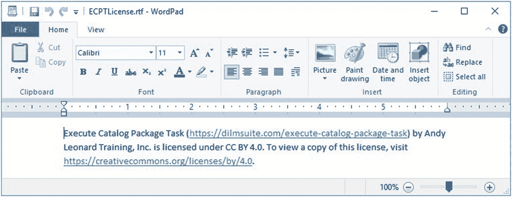
**图 22-24**
许可证 RTF

保存许可证 RTF 文件，然后将其添加到安装项目中：右键单击 `ExecuteCatalogPackageTaskSetup` 项目，悬停在“添加”上，然后单击“现有项”，如图 22-25 所示：
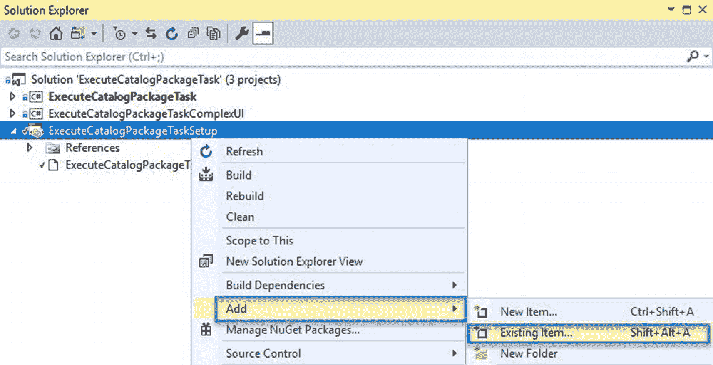
**图 22-25**
将许可证文件添加到安装项目

导航并选择许可证 RTF 文件，如图 22-26 所示：
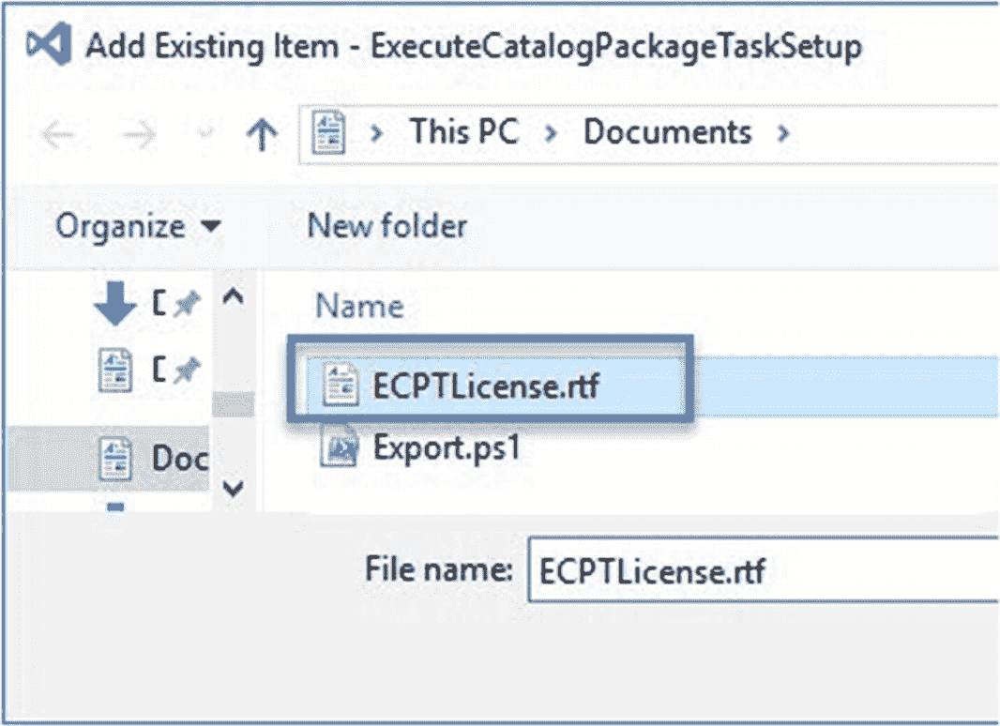
**图 22-26**
选择许可证 RTF 文件

单击“添加”按钮将许可证 RTF 文件添加到 `ExecuteCatalogPackageTaskSetup` 项目中，如图 22-27 所示：
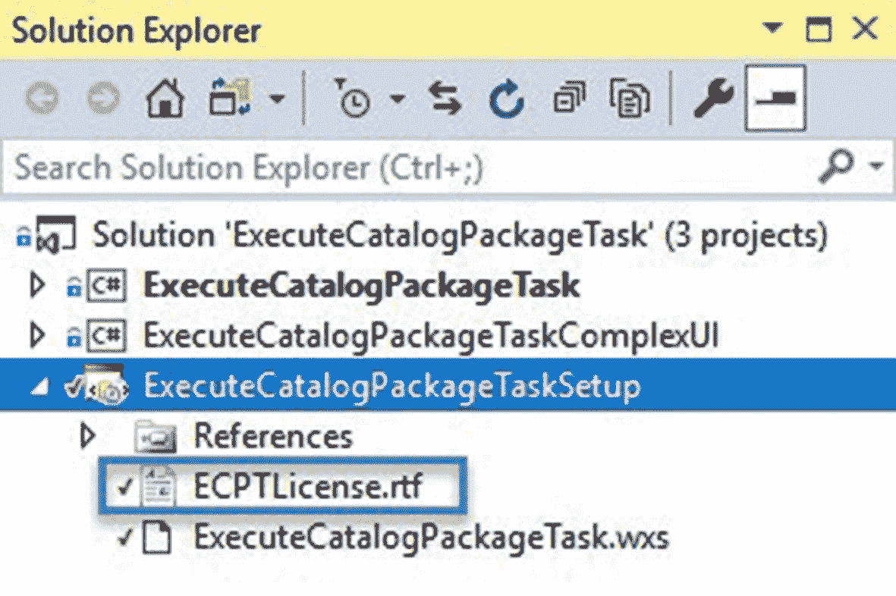
**图 22-27**
将许可证 RTF 文件添加到 ExecuteCatalogPackageTaskSetup 项目

下一步是配置安装功能和图标。

### 配置安装功能和图标

`Feature` 标签通过 `Title` 属性将 `ExecuteCatalogPackageTask` 标识为“安装单元”。

图标无需导入到 WiX 项目中，因为 `SourceFile` 标签指定了图标文件的路径。`ARPPRODUCTICON` 属性用于设置安装文件的图标。如果你想使用 `ALStrike.ico`，可以使用，它是 `ExecuteCatalogPackageTask` Visual Studio 项目的一部分。

使用清单 22-8 中的 XML 配置安装 `Feature` 和 `Icon`：
```
清单 22-8
配置安装功能和图标
```

添加后，XML 将如图 22-28 所示：
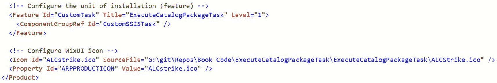
**图 22-28**
配置安装功能和图标

## 配置文件夹和文件夹结构

在 `ExecuteCatalogPackageTask.wxs` 安装文件配置的这一部分，我们为每个程序集配置两个路径：
*   `Tasks` 文件夹
*   全局程序集缓存，即 `GAC`

如前所述，Visual Studio 使用部署到 `Tasks` 文件夹的程序集来填充 SSIS 工具箱以进行开发。SSIS 执行引擎使用注册到 `GAC` 的程序集进行执行。

使用清单 22-9 中的 XML 配置文件夹和文件夹结构片段：
```
清单 22-9
配置文件夹和文件夹结构片段
```

添加后，XML 将如图 22-29 所示：
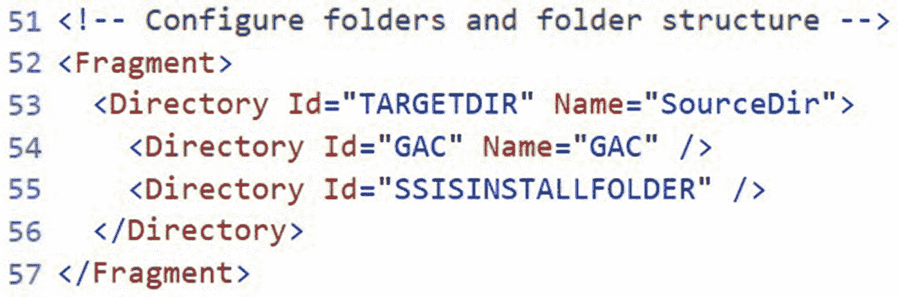
**图 22-29**
配置文件夹和文件夹结构片段

在图 22-29 中，`Fragment` 标签跨越第 51-57 行。最外层的 `Directory` 标签在第 53 行打开，在第 56 行关闭。最外层 `Directory` 标签的 `Id` 属性值为 `TARGETDIR`，其 `Name` 属性值为 `SourceDir`。第 54 行的 `Directory` 标签将 `Id` 和 `Name` 属性设置为 `GAC`，这是一个自闭合的 `Directory` 标签，因为安装程序识别 `GAC` 的值。在第 55 行，`SSISINSTALLFOLDER` 属性 `Id` 在一个 `Directory` 标签中指定，该标签定义了之前配置的、指向 SSIS Tasks 文件夹的 `SSISINSTALLFOLDER` 注册表路径。在我运行 Windows Server 2016 操作系统的虚拟机上，SQL Server 2017 安装在 E: 盘上，我的 `SSISINSTALLFOLDER` 路径解析为 `E:\Program Files (x86)\Microsoft SQL Server\140\DTS\Tasks`。安装到我的虚拟机后，`ExecuteCatalogPackageTask` 和 `ExecuteCatalogPackageTaskComplexUI` 程序集将部署到 `E:\Program Files (x86)\Microsoft SQL Server\140\DTS\Tasks`，如图 22-30 所示：
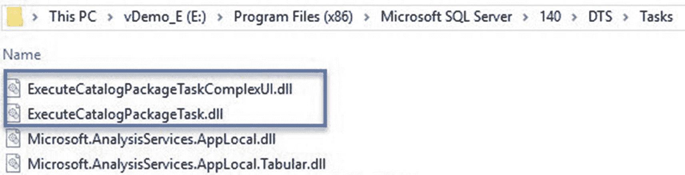
**图 22-30**
SSIS 2017 开发中使用的任务程序集

### ComponentGroup、文件夹和文件夹结构片段

下一个 `Fragment` 标签涵盖了 WiX 配置的剩余部分。

使用清单 22-10 中的 XML 配置 `ComponentGroup` 和文件夹及文件夹结构 `Fragment` 的开始标签：
```
清单 22-10
打开 ComponentGroup 片段标签
```

添加后，XML 将如图 22-31 所示：

**图 22-31**
打开 ComponentGroup 片段标签


### 配置 ExecuteCatalogPackageTask 的 GAC 注册

`ExecuteCatalogPackageTask.wxs` 文件中的最后一个 `Fragment` 标签配置了开发文件夹和全局程序集缓存 (GAC) 中每个程序集（`ExecuteCatalogPackageTask` 和 `ExecuteCatalogPackageTaskComplexUI`）的部署。该 `Fragment` 通过包含 `File` 和 `RemoveFile` 子标签的 `Component` 标签详细说明了每个部署目标。所有 `Component` 标签都是 `ComponentGroup` 标签的子标签，该标签已在之前定义。

使用清单 22-11 中的 XML 配置 `ExecuteCatalogPackageTask` GAC 注册的 `Component` 标签：
```
清单 22-11
配置 ExecuteCatalogPackageTask 的 GAC 注册
```
添加后，XML 如图 22-32 所示：

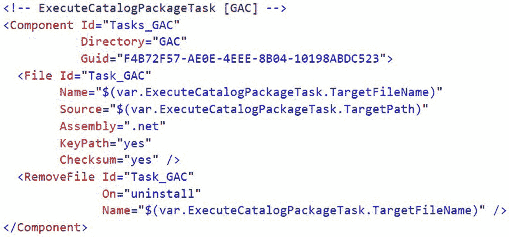

**图 22-32**：配置 `ExecuteCatalogPackageTask` 的 GAC 注册

下一步是配置用于将 `ExecuteCatalogPackageTask` 程序集安装到开发文件夹的 `Component` 标签。

### 配置 ExecuteCatalogPackageTask 的任务部署文件夹

使用清单 22-12 中的 `Component` 标签 XML 配置 `ExecuteCatalogPackageTask` 程序集的部署文件夹：
```
清单 22-12
配置 ExecuteCatalogPackageTask 的部署文件夹
```
添加后，XML 如图 22-33 所示：

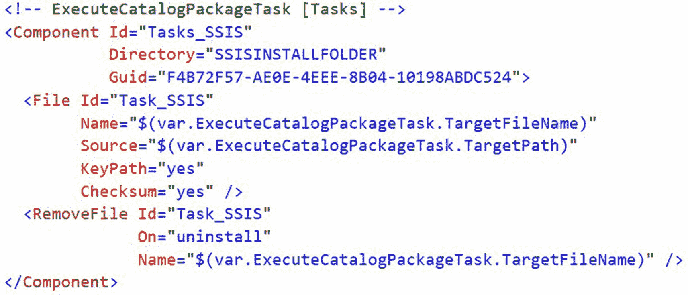

**图 22-33**：配置 `ExecuteCatalogPackageTask` 的部署文件夹

接下来的步骤将重复配置 `ExecuteCatalogPackageTaskComplexUI` 程序集在目标目录中的安装位置。

### 配置 ExecuteCatalogPackageTaskComplexUI 的 GAC 注册

使用清单 22-13 中的 XML 配置 `ExecuteCatalogPackageTaskComplexUI` 的 GAC 注册片段：
```
清单 22-13
配置 ExecuteCatalogPackageTaskComplexUI 的 GAC 注册
```
添加后，XML 如图 22-34 所示：

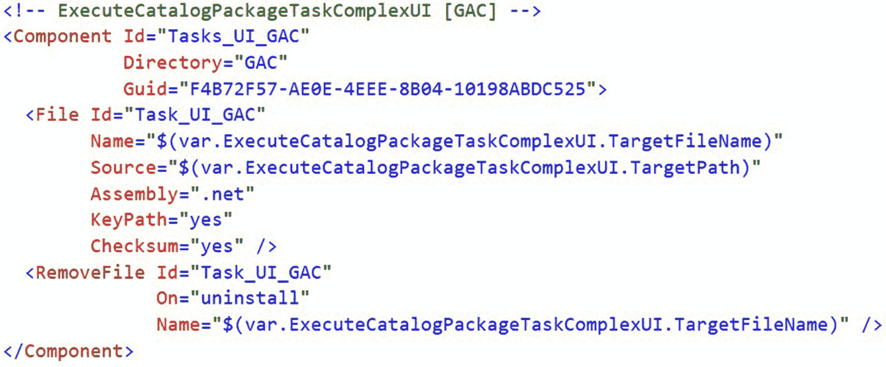

**图 22-34**：配置 `ExecuteCatalogPackageTaskComplexUI` 的 GAC 注册

下一步是配置 `ExecuteCatalogPackageTaskComplexUI` 程序集的部署文件夹。

### 配置 ExecuteCatalogPackageTaskComplexUI 的任务部署文件夹

使用清单 22-14 中的 XML 配置 `ExecuteCatalogPackageTaskComplexUI` 任务的部署文件夹：
```
清单 22-14
配置 ExecuteCatalogPackageTaskComplexUI 的部署文件夹
```
添加后，XML 如图 22-35 所示：

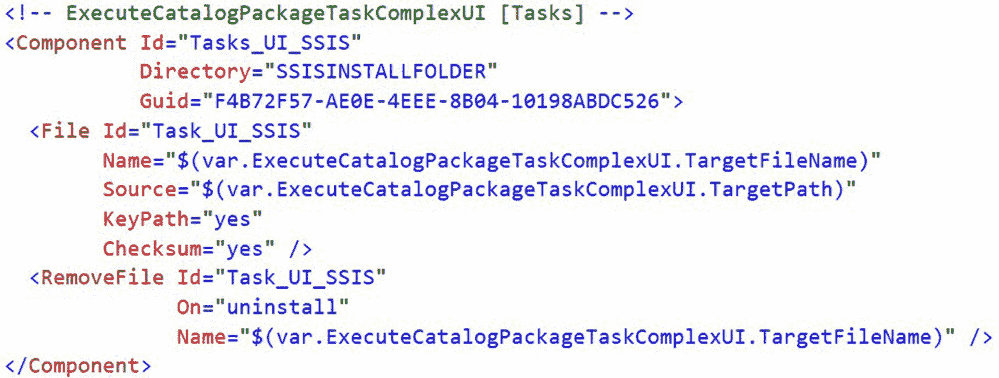

**图 22-35**：配置 `ExecuteCatalogPackageTaskComplexUI` 的部署文件夹

至此，将 `ExecuteCatalogPackageTask` 和 `ExecuteCatalogPackageTaskComplexUI` 程序集安装到开发目录和全局程序集缓存 (GAC) 的部署目录配置已完成。

### 关闭 ComponentGroup 以及 Folders 和 Folder Structure Fragment

使用清单 22-15 中的 XML 配置 `ComponentGroup` 以及 folders 和 folder structure `Fragment` 的闭合标签：
```
清单 22-15
关闭 ComponentGroup 片段标签
```
添加后，XML 如图 22-36 所示：


**图 22-36**：关闭 `ComponentGroup` 和片段标签

文件夹和文件夹结构配置现已完成并关闭。

### 重命名输出

在本节结束之前，在解决方案资源管理器中右键单击 `ExecuteCatalogPackageTaskSetup` 项目，然后单击“属性”。当 `ExecuteCatalogPackageTaskSetup` 的属性显示时，单击“安装程序”选项卡，然后将“输出文件名”属性更改为“`ExecuteCatalogPackageTask`”，如图 22-37 所示：

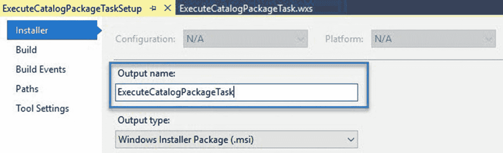

**图 22-37**：重命名输出文件

## 构建与安装

WiX 标签配置完成后，当我们为 `ExecuteCatalogPackageTaskSetup` 项目执行生成时，就会产生 `msi` 文件。如果一切顺利，构建 `ExecuteCatalogPackageTaskSetup` 项目将生成 `ExecuteCatalogPackageTask.msi` 文件，我们可以用它在企业内其他服务器上安装 Execute Catalog Package Task。

在解决方案资源管理器中，右键单击 `ExecuteCatalogPackageTaskSetup` 项目，然后单击“生成”，如图 22-38 所示：

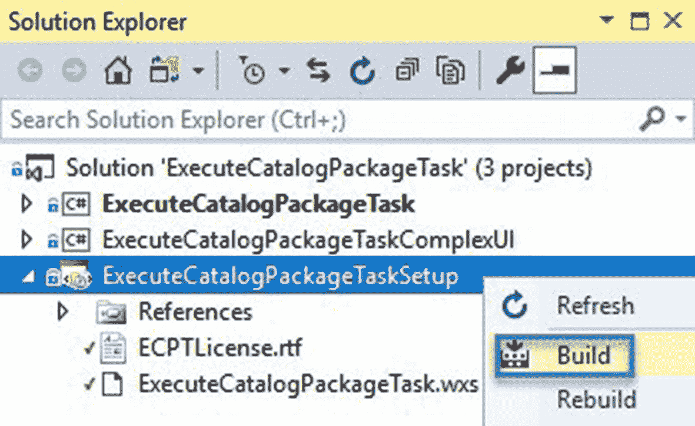

**图 22-38**：生成 `ExecuteCatalogPackageTaskSetup` 项目

导航到 `ExecuteCatalogPackageTaskSetup.msi` 文件所在的位置——它将位于您的 `ExecuteCatalogPackageTaskSetup` Visual Studio 项目文件夹中——进入 `bin` 文件夹，然后进入 `Debug` 文件夹，如图 22-39 所示：

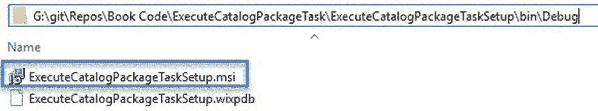

**图 22-39**：查找您的 `ExecuteCatalogPackageTaskSetup.msi` 文件

请注意，您的测试服务器上已安装的 Execute Catalog Package Task 的状态会影响执行 `ExecuteCatalogPackageTaskSetup.msi` 文件的结果。


### 清理

为确保我们从相同的起点开始，请使用清单 22-16 中的命令，从 GAC 中注销 `ExecuteCatalogPackageTask` 和 `ExecuteCatalogPackageTaskComplexUI` 程序集：

```
"C:\Program Files (x86)\Microsoft SDKs\Windows\v10.0A\bin\NETFX 4.7.2 Tools\gacutil.exe" -u ExecuteCatalogPackageTask
"C:\Program Files (x86)\Microsoft SDKs\Windows\v10.0A\bin\NETFX 4.7.2 Tools\gacutil.exe" -u ExecuteCatalogPackageTaskComplexUI
```
清单 22-16 从 GAC 注销 `ExecuteCatalogPackageTask` 和 `ExecuteCatalogPackageTaskComplexUI`

请确保以管理员身份打开命令提示符来执行 GAC 注销命令，如图 22-40 所示：

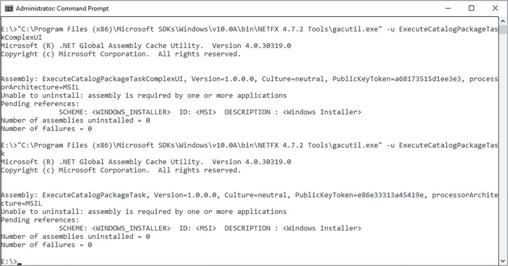
图 22-40 从 GAC 注销 `ExecuteCatalogPackageTask` 和 `ExecuteCatalogPackageTaskComplexUI`

在图 22-40 中，我的服务器显示“已卸载程序集数量 = 0”，这表示程序集已经卸载。你的情况可能不同。

请仔细检查 GAC 路径并删除可能在该位置发现的残留文件，如图 22-41 所示：

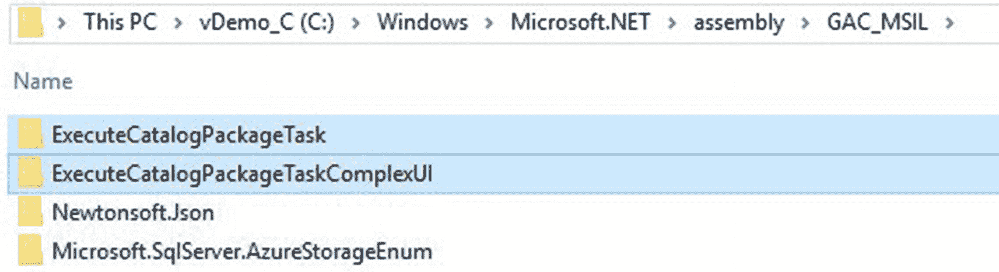
图 22-41 清理 GAC

在我的虚拟机上，GAC 文件的位置是 `C:\Windows\Microsoft.NET\assembly\GAC_MSIL`。你的 GAC 位置路径可能不同。

接下来，通过在解决方案资源管理器中右键单击项目名称，然后单击“属性”，打开 `ExecuteCatalogPackageTask` Visual Studio 项目的属性。在“生成”页面上，将“输出路径”属性更改为 `bin\Debug\`，如图 22-42 所示：

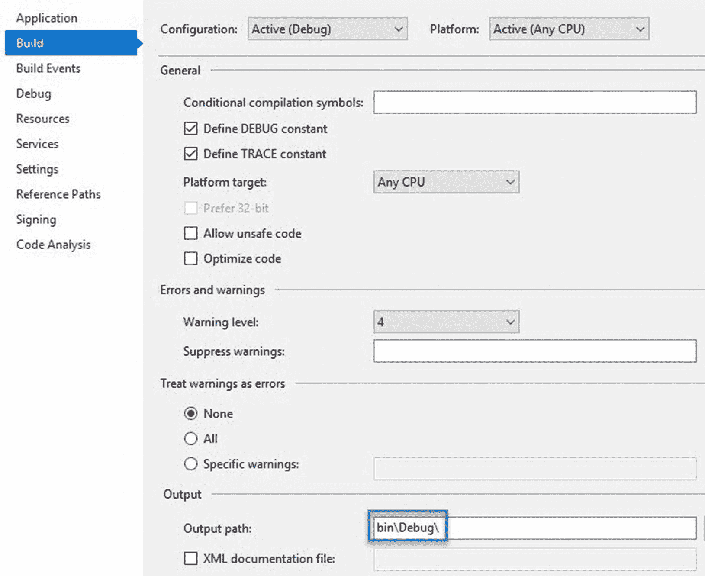
图 22-42 编辑“输出路径”属性

单击“生成事件”页面，并清空“生成前事件命令行”和“生成后事件命令行”文本框中的所有文本，如图 22-43 所示：

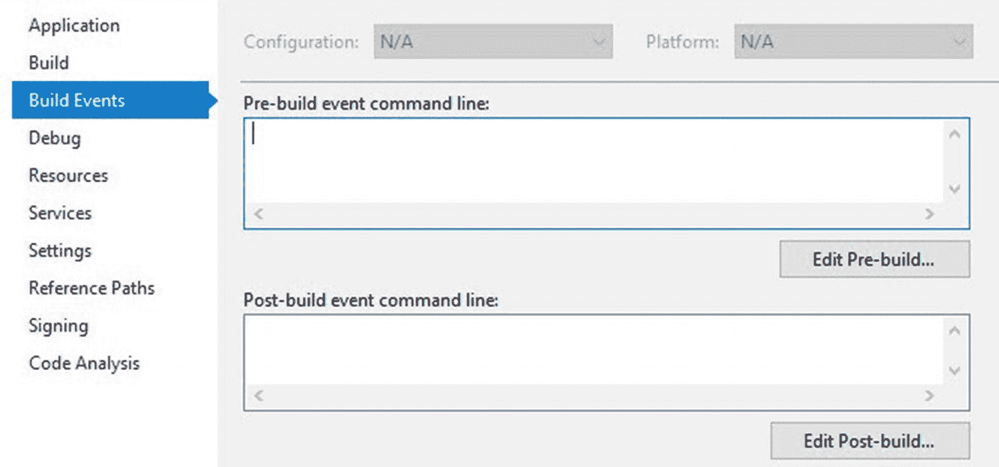
图 22-43 清空生成前和生成后命令行

*对 `ExecuteCatalogPackageTaskUI` Visual Studio 项目重复前两个步骤。*

### 执行安装

双击你的 `ExecuteCatalogPackageTaskSetup.msi` 文件开始测试安装，将从许可页面启动安装。勾选“我接受许可协议中的条款”复选框以继续，如图 22-44 所示：

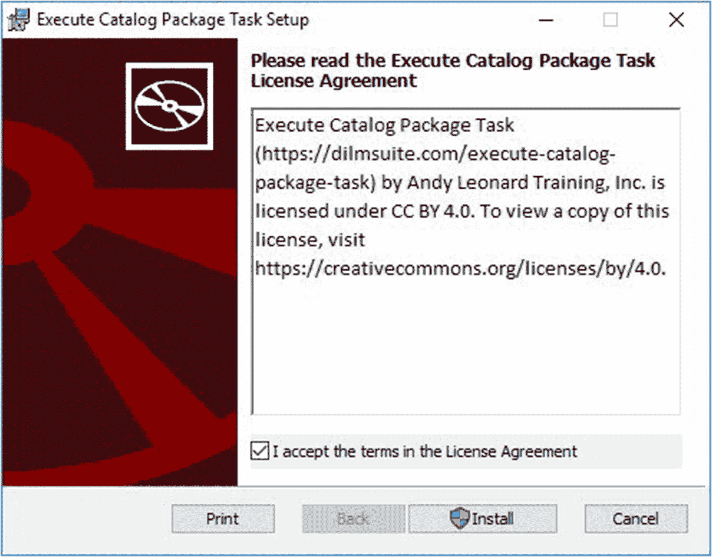
图 22-44 在许可协议页开始“Execute Catalog Package Task Setup”

下一步是响应“用户账户控制”通知，如图 22-45 所示：

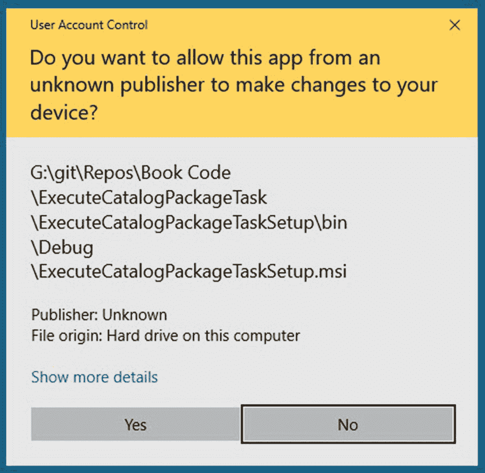
图 22-45 响应用户账户控制通知

如果单击“是”按钮，“Execute Catalog Package Task Setup”过程将完成，如图 22-46 所示：

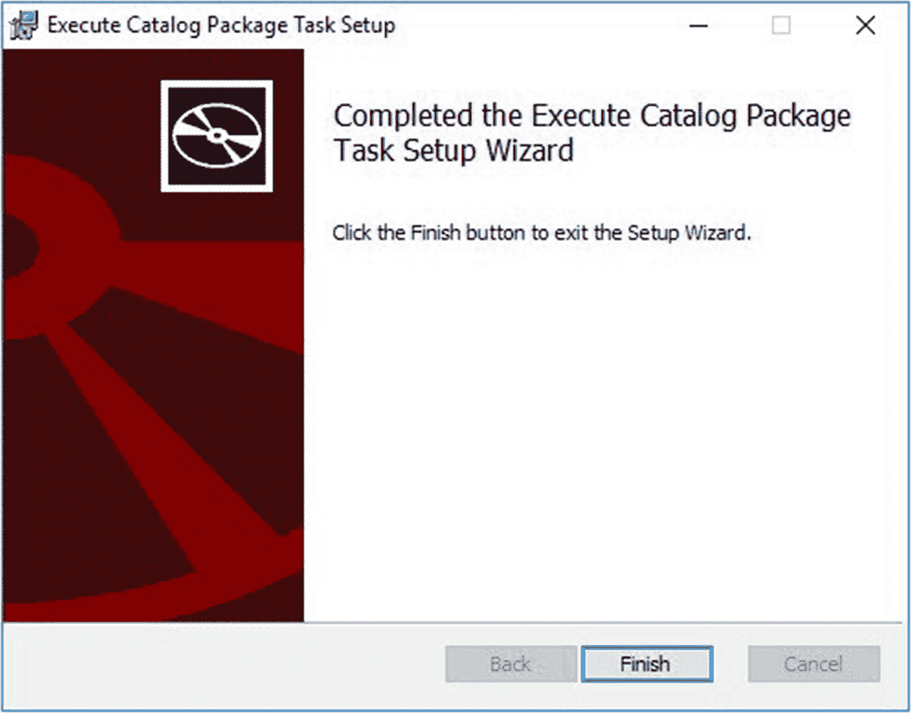
图 22-46 完成“Execute Catalog Package Task Setup”过程

重新执行 `ExecuteCatalogPackageTaskSetup.msi` 文件会显示“修复”和“删除”按钮，其功能不言自明，如图 22-47 所示：

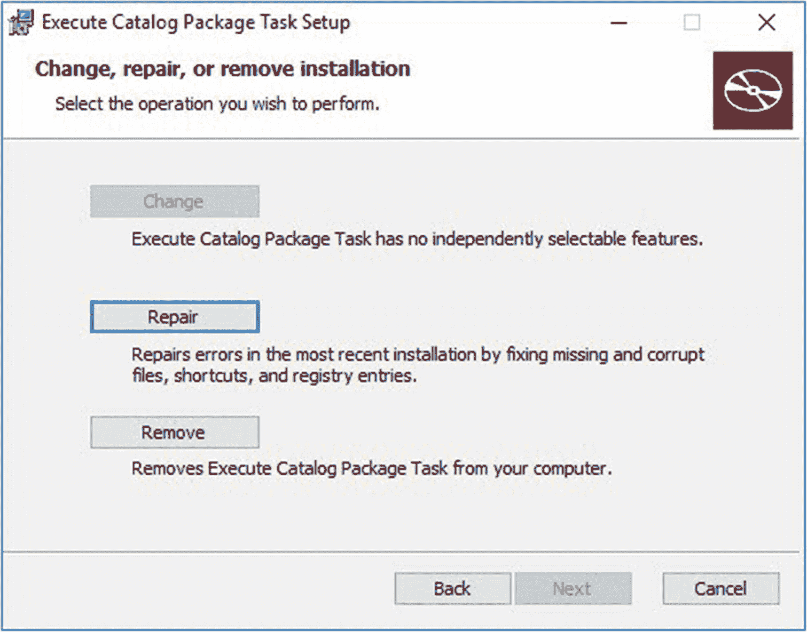
图 22-47 重新执行 `ExecuteCatalogPackageTaskSetup.msi` 文件

验证安装文件是否已将 `ExecuteCatalogPackageTask` 和 `ExecuteCatalogPackageTaskComplexUI` 程序集（DLL 文件）部署到 SSIS Tasks（或开发）文件夹，如图 22-48 所示：

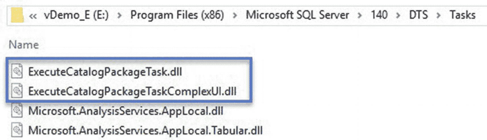
图 22-48 验证安装到 SSIS Tasks 文件夹

在我的虚拟机上，SSIS Tasks（或开发）文件夹的路径是 `E:\Program Files\Microsoft SQL Server\140\DTS\Tasks`。

验证安装文件是否已将 `ExecuteCatalogPackageTask` 和 `ExecuteCatalogPackageTaskComplexUI` 程序集部署到 GAC，如图 22-49 所示：

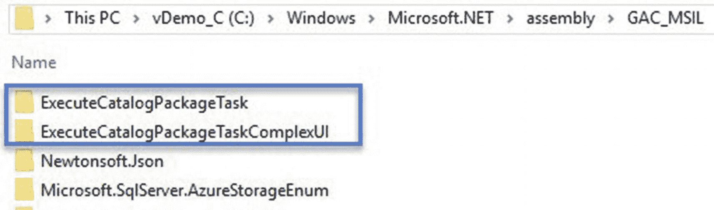
图 22-49 验证安装到 GAC

如前所述，在我的虚拟机上，GAC 文件的位置是 `C:\Windows\Microsoft.NET\assembly\GAC_MSIL`。

### 让我们来测试一下！

执行 `ExecuteCatalogPackageTaskSetup.msi` 安装程序文件后，打开一个测试 SSIS 项目和测试 SSIS 包。打开 SSIS 工具箱并检查“Execute Catalog Package Task”是否可用，如图 22-50 所示：

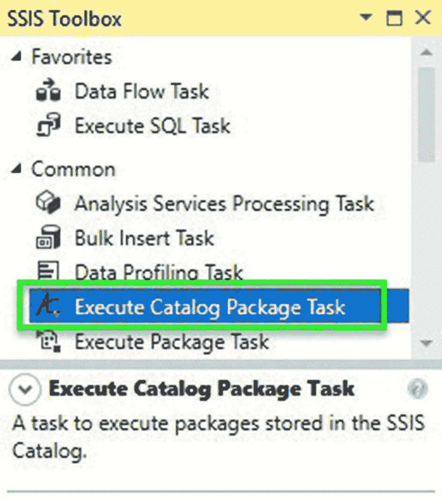
图 22-50 “Execute Catalog Package Task”检查

如果“Execute Catalog Package Task”在 SSIS 工具箱中可用，你应该能够在服务器上的 SSIS 中配置该任务。

## 故障排除安装

生成安装文件可能很棘手。本节提供三个有用的故障排除技巧。

重要的是要记住，在你的企业数据集成生命周期中的每个服务器上安装“Execute Catalog Package Task”。将 SSIS 包部署到未安装“Execute Catalog Package Task”的服务器将导致类似于以下错误：“`加载包时出错：无法从 XML 为任务 "Execute Catalog Package Task" 创建任务，类型 "ExecuteCatalogPackageTask.ExecuteCatalogPackageTask, ExecuteCatalogPackageTask, Version=1.0.0.0, Culture=neutral, PublicKeyToken=e86e33313a45419e"，原因是错误 0x80070057 "参数不正确。"`”。在未安装“Execute Catalog Package Task”的服务器上打开 SSIS 包时，SSIS 项目会抛出错误，并且“Execute Catalog Package Task”将显示如图 22-51 所示：

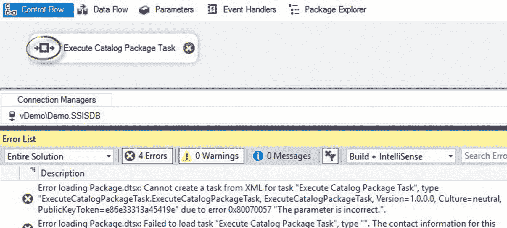
图 22-51 在未安装“Execute Catalog Package Task”的服务器上打开配置了“Execute Catalog Package Task”的 SSIS 包

请注意图 22-51 中的通用 SSIS 包任务徽标（圆圈）。

### 记录安装

你可以使用类似于清单 22-17 所示的命令来记录安装：

```
msiexec /i ExecuteCatalogPackageTask.msi /l*v ECPT_Installation_Log.txt
```
清单 22-17 记录 msi 文件执行

执行安装后，你可以查看日志文件的内容。


### 清理 MSI 文件

在每次构建 WiX 安装项目之前，请通过右键单击 WiX 安装项目，然后单击 `Clean` 来清理输出，如图 22-52 所示：

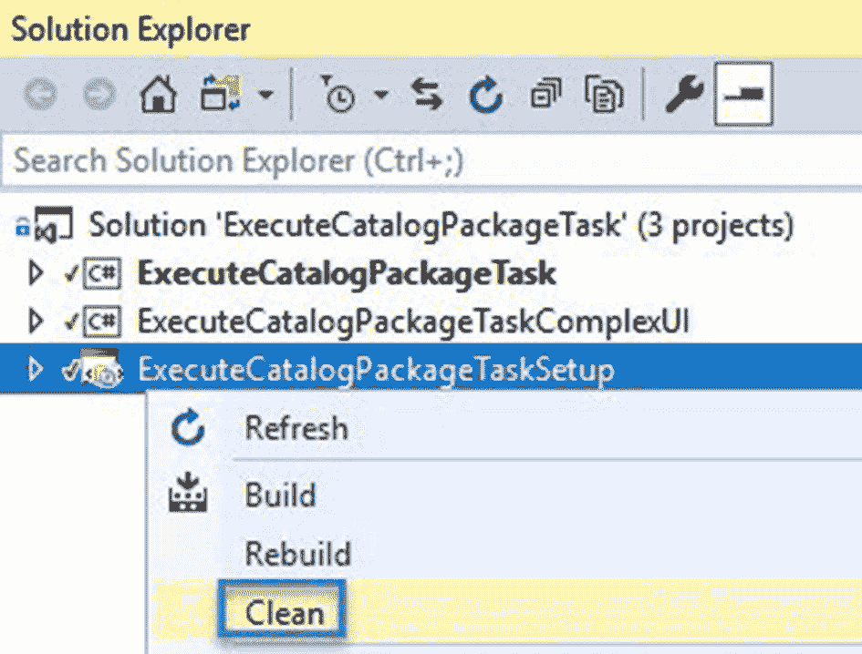

图 22-52：清理输出

通过浏览到输出文件夹来验证输出是否已清理，如图 22-53 所示：

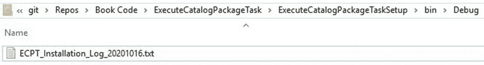

图 22-53：验证已清理的输出文件夹

执行 `Clean` 后，`ExecuteCatalogPackageTask.msi` 和 `ExecuteCatalogPackageTask.wixpdb` 文件应从 `ExecuteCatalogPackageTaskSetup bin\Debug` 目录中消失。

下一步是构建 WiX 安装项目，如图 22-54 所示：

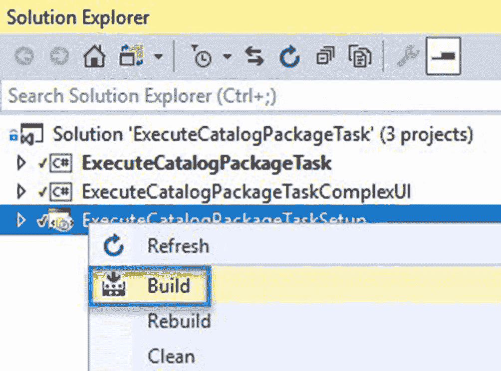

图 22-54：构建 WiX 安装项目

通过重新检查输出文件夹来验证构建是否成功，如图 22-55 所示：

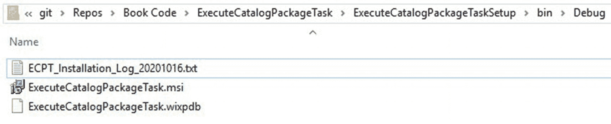

图 22-55：验证成功的构建

如果一切按计划进行，`ExecuteCatalogPackageTask.msi` 和 `ExecuteCatalogPackageTask.wixpdb` 文件应出现在输出文件夹中。

### 结论

鼓励读者在 `wixtoolset.org` 了解更多关于 WiX 工具集的使用信息，您可以在 `wixtoolset.org/documentation` 找到深入的文档和示例。

下一步是在企业数据工程框架解决方案中使用执行目录包任务。

现在正是签入您的代码的绝佳时机。

