# 23. 在 SSIS 框架中使用执行目录包任务

在 *SQL Server Data Automation Through Frameworks: Building Metadata-Driven Frameworks with T-SQL, SSIS, and Azure Data Factory* (`amazon.com/Server-Data-Automation-Through-Frameworks/dp/1484262123`) 一书中，Kent Bradshaw 和我描述并演示了执行存储过程和 SSIS 包的数据框架。Kent 分享了一个基于元数据驱动、以存储过程为基础的框架，该框架执行其他存储过程并记录执行报告数据。我则分享了一个 SSIS 框架，它执行存储在本地文件系统中的 SSIS 包，以及一个执行存储在 Azure 文件共享中的 SSIS 包的变体。与 Kent 的基于存储过程的框架类似，这两个 SSIS 框架都是元数据驱动的，并记录执行元数据。本地版 SSIS 框架使用一个 SSIS 包作为框架“引擎”。Azure-SSIS 版本则由两个 Azure Data Factory 管道驱动。

在本章中，我们将使用 `Execute Catalog Package Task` 来构建一个基于元数据、以 SSIS 目录为基础的 SSIS 框架。我们将构建的框架类似于 *SQL Server Data Automation Through Frameworks* 一书中 SSIS 框架的本地版，也类似于 SSIS Framework Community Edition (`dilmsuite.com/ssis-framework-community-edition`)——一个免费开源项目，是构成数据集成生命周期管理套件 (`dilmsuite.com`) 的实用工具集合的一部分。

然而，我们在本章构建的 SSIS 框架具有额外的功能：能够串行启动包执行*或*并行启动执行（嗯，*近乎*并行）。在其他框架版本中实现并行性也是可能的；您只需要构建一个（额外的）SSIS 包或 ADF 管道来管理并行执行的协调。`Execute Catalog Package Task` 公开了一个 `Synchronized` 属性，这意味着我们的框架可以将 `Synchronized` 属性的值存储在元数据中；无需额外的 SSIS 包。与所有工程一样，天下没有免费的午餐。前一句中的“启动”一词是精心选择的；期望的设计*可能*围绕着 SSIS 包并行执行的*完成*来展开。

我们首先考察一个围绕 SSIS 包并行执行完成情况而设计的 SSIS 包。


## 控制器 SSIS 设计模式

编排是数据工程中的一个复杂主题。工作流管理很容易被低估。在本章引言中，我们找到了一个这样的例子：`执行目录包任务` 支持 *近乎并行地启动* SSIS 包执行。前一句中的强调凸显了编排的挑战。

在设计并行性时，大多数 SSIS 开发人员更关注 *虚拟步骤*。虚拟步骤是一组作为一个块（或步骤）执行的操作。大多数情况下，下一步骤在前一步骤中的 *所有* 操作 *完成后* 才开始。思考这种工作流管理的另一种方式是：直到前一步骤的最后一个操作完成，下一步骤才开始。请注意，我们并没有考虑执行状态，这使任何元数据解决方案的复杂性成倍增加。

控制器 SSIS 设计模式是管理工作流的一种解决方案。

### 配置步骤

首先，向名为 `ECPTFramework` 的新 SSIS 项目添加一个新的 SSIS 包。将新 SSIS 包重命名为 `ECPTController.dtsx`，如图 23-1 所示：

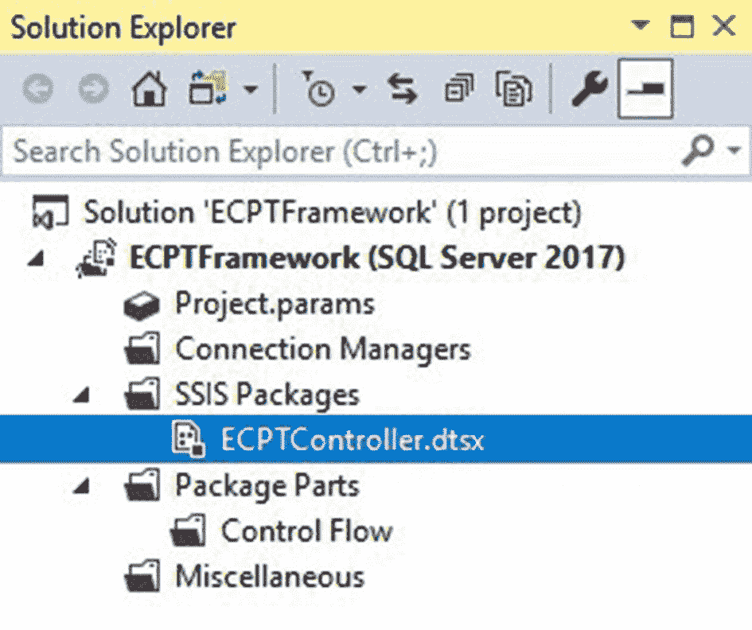

*图 23-1：添加 `ECPTController.dtsx` SSIS 包*

向控制流添加两个 `序列容器`。将第一个命名为 `SEQ 步骤 1`，第二个命名为 `SEQ 步骤 2`。向 `SEQ 步骤 1` 添加一个 `执行目录包任务`，并将其重命名为 `ECPT 执行 ReportAndSucceed`。配置 `ECPT 执行 ReportAndSucceed` 以同步执行 `ReportAndSucceed.dtsx` SSIS 包，如图 23-2 所示：

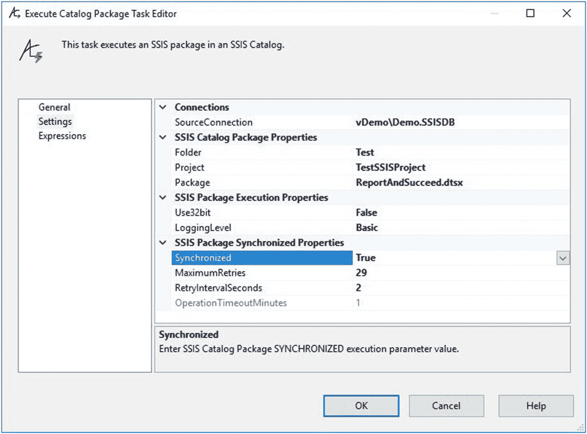

*图 23-2：配置 `ReportAndSucceed` 执行*

向 `SEQ 步骤 1` 添加另一个 `执行目录包任务` 并将其重命名为 `ECPT 执行 RunForSomeTime`。配置 `ECPT 执行 RunForSomeTime` 以同步执行 `ECPT 执行 RunForSomeTime.dtsx` SSIS 包，如图 23-3 所示：

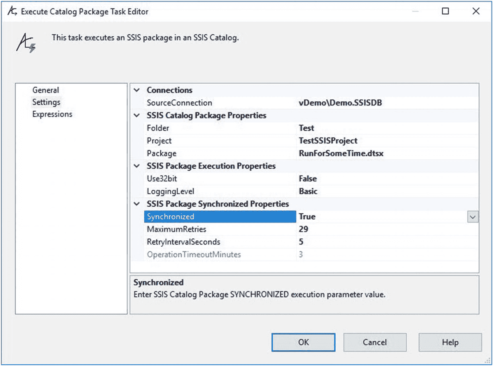

*图 23-3：配置 `RunForSomeTime` 执行*

向 `SEQ 步骤 2` 添加一个 `执行目录包任务` 并将其重命名为 `ECPT 执行 <*某个其他包*>`。配置 `ECPT 执行 <*某个其他包*>` 以异步执行任何 SSIS 包，如图 23-4 所示：

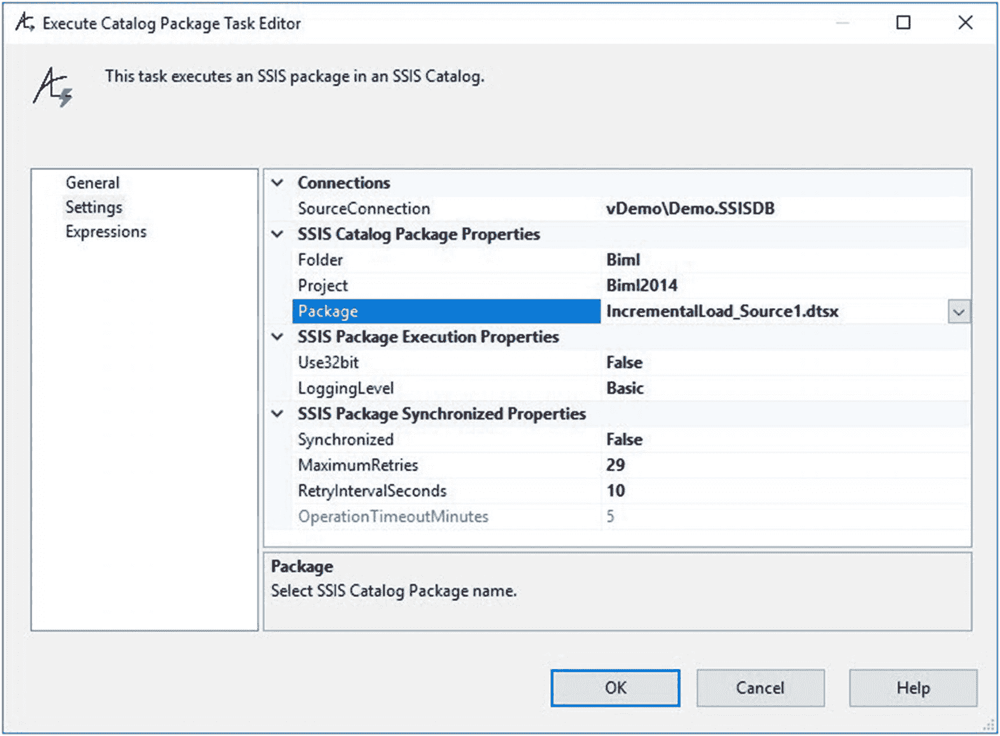

*图 23-4：配置任何其他 SSIS 包以供执行*

使用优先约束将 `SEQ 步骤 1` 连接到 `SEQ 步骤 2`，如图 23-5 所示：

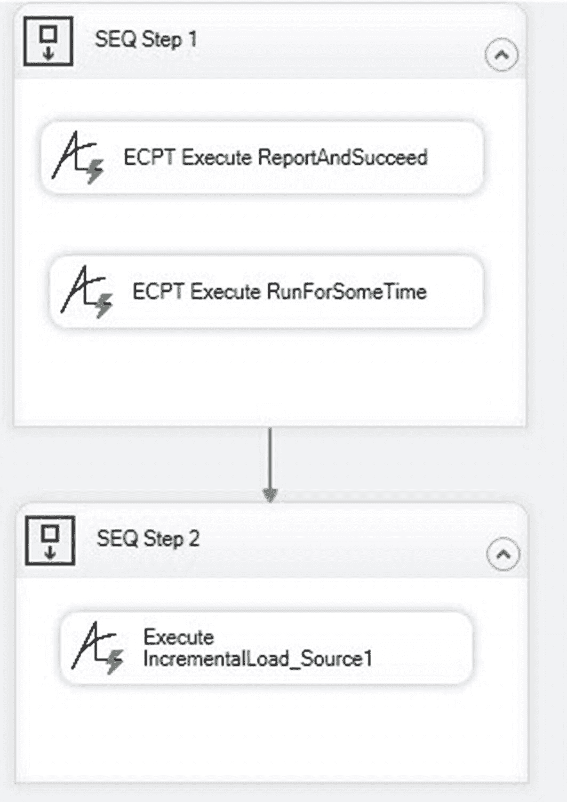

*图 23-5：已配置的控制器*

### 执行与观察

执行控制器 SSIS 包，并注意执行的（虚拟）步骤。第一步是 `ECPT 执行 ReportAndSucceed` 和 `ECPT 执行 RunForSomeTime` 在 `SEQ 步骤 1` 中并行开始，如图 23-6 所示：

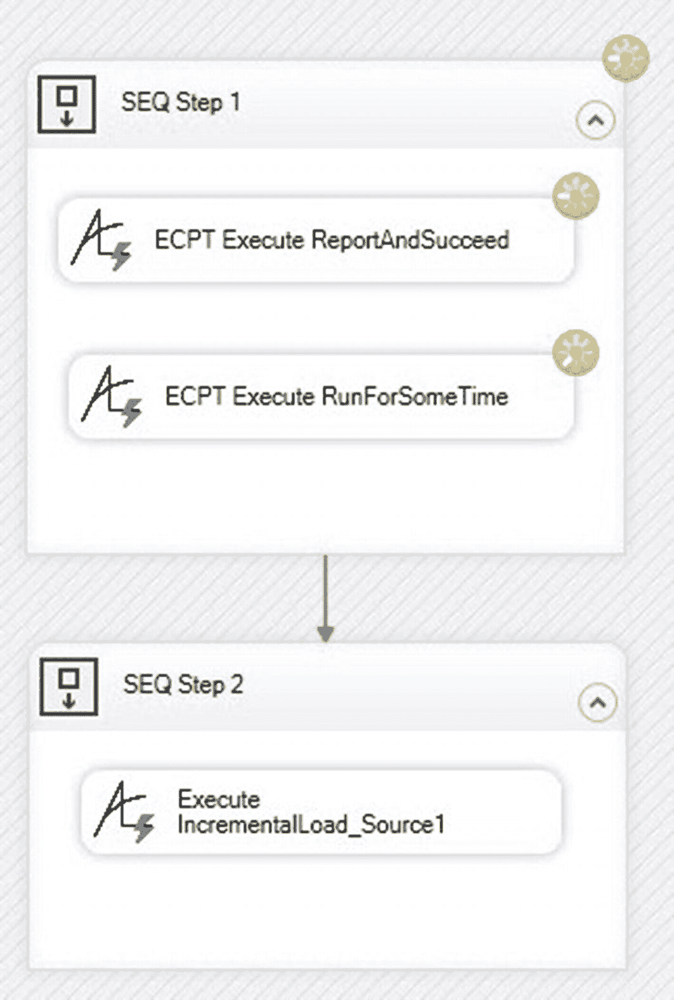

*图 23-6：虚拟步骤 1*

当 `ECPT 执行 ReportAndSucceed` 完成并成功时，`ECPT 执行 RunForSomeTime` 继续执行，如图 23-7 所示：

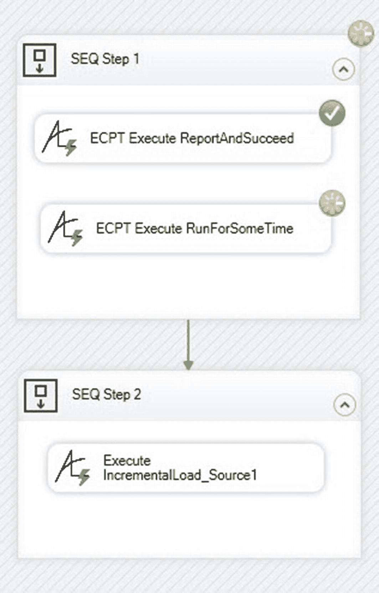

*图 23-7：虚拟步骤 2*

在我的示例中，嵌套在 `SEQ 步骤 2` 内的 `ECPT 执行 Child1 执行目录包任务` 的执行，直到 `SEQ 步骤 1` 中的所有任务都 *完成后* 才 *开始*，如图 23-8 所示：

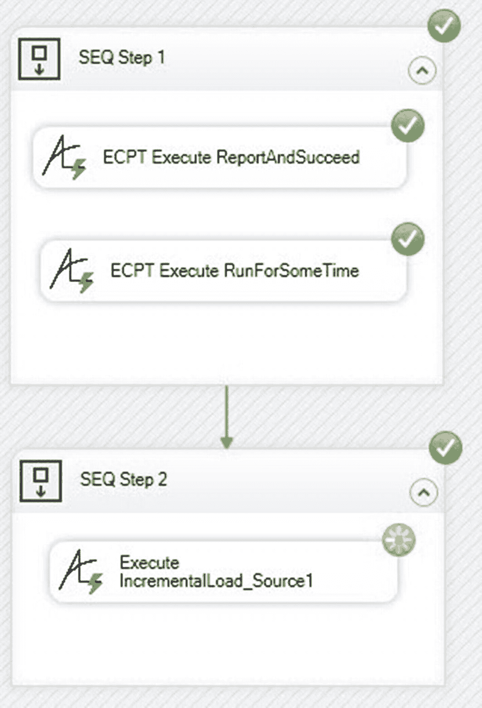

*图 23-8：控制器，执行完成*

当 SSIS 开发人员考虑并行执行 SSIS 包时，他们最常想象的就是控制器功能：在前一个虚拟步骤完成执行后，启动下一个虚拟步骤。

## 一个元数据驱动的 SSIS 执行框架

一个 SSIS 框架有三个功能：

1.  配置
2.  执行
3.  日志记录

根据此定义，SSIS 目录本身就是一个 SSIS 框架。

为什么要使用框架？正如 *通过框架实现 SQL Server 数据自动化* 一书中所述：

> “执行几十个 SSIS 包是不同的——真的非常不同——与管理数千个 SSIS 包的执行相比。不要只听我说，去问问任何管理着大型企业的数据工程师。”

如果你的企业只使用少数几个 SSIS 包，框架很可能就是不必要的开销。然而，如果你的企业每天执行数百或数千个 SSIS 包，那么一个 SSIS 框架就是 *必需品*。

此框架侧重于执行，但你可以使用 Kent 和我在 *通过框架实现 SQL Server 数据自动化：使用 T-SQL、SSIS 和 Azure 数据工厂构建元数据驱动框架*（amazon.com/Server-Data-Automation-Through-Frameworks/dp/1484262123）一书中描述的框架来添加日志记录。

我们首先将 *SSIS 应用程序* 定义为作为一个组执行的一组 SSIS 包。为了执行一组 SSIS 包，框架需要 SSIS 包位置元数据。应用程序与包之间的基数关系看起来很简单——一对一——直到我们考虑到诸如在数据加载后归档平面文件的包这样的用例。

在专为 SSIS 目录设计的 SSIS 项目中，开发人员可以使用 `执行包任务` 来调用额外的 SSIS 包，但有一个陷阱：`执行包任务` 调用的子包必须与 *调用* 该子包的（父）包位于同一个 SSIS 项目中。应用于旨在归档文件的包时，此约束意味着同一个 SSIS 包——例如 `ArchiveFile.dtsx`——必须被导入到每一个将要调用 `ArchiveFile.dtsx` 的 SSIS 项目中。一遍又一遍地复制相同的代码是不明智的。更好的解决方案是构建一个版本的 `ArchiveFile.dtsx` 包，将其部署到 SSIS 目录，然后在需要归档文件时从该单一位置执行 `ArchiveFile.dtsx`。如果 `ArchiveFile.dtsx` 有多个副本分散在企业（甚至是单个 SSIS 目录）中，开发人员如何添加功能？或者修复一个 bug？虽然可以做到，但这很混乱且效率极低。

因为存在像 `ArchiveFile.dtsx` 这样的 SSIS 包，所以 SSIS 应用程序与 SSIS 包之间的基数关系是多对多的。我们的框架解决方案是第三范式，因此需要一个桥接（或解析器）表。我们的桥接表就是 *应用程序包*。


### 添加元数据数据库对象

要开始构建此 SSIS 框架，请连接到已配置 SSIS 目录的 SQL Server 实例。使用清单 23-1 中的 T-SQL 向 `SSISDB` 数据库添加名为 `fw` 的架构：

```sql
Use SSISDB
Go
print 'Fw schema'
If Not Exists(Select s.[name]
From [sys].[schemas] s
Where s.[name] = N'fw')
begin
print ' - Create fw schema'
declare @sql varchar(30) = 'Create schema fw'
exec(@sql)
print ' - Fw schema created'
end
Else
begin
print ' - Fw schema already exists.'
end
go
```
**清单 23-1** 添加 fw 架构

首次执行时，“消息”选项卡显示如图 23-9 所示：


**图 23-9** 创建 fw 架构

该 T-SQL 是幂等的，意味着脚本可以多次执行并返回相同的结果。重新执行该 T-SQL，“消息”选项卡显示如图 23-10 所示：

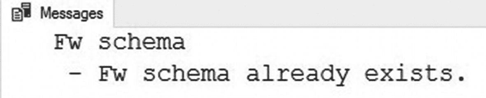

**图 23-10** 验证 fw 架构存在

本章中的许多 T-SQL 脚本都是幂等的。

接下来，使用清单 23-2 中的 T-SQL 在 `fw` 架构中构建 `Applications` 表：

```sql
Use SSISDB
go
print 'Fw.Applications table'
If Not Exists(Select s.[name] + '.' + t.[name]
From [sys].[tables] t
Join [sys].[schemas] s
On s.[schema_id] = t.[schema_id]
Where s.[name] = N'fw'
And t.[name] = N'Applications')
begin
print ' - Create fw.Applications table'
Create Table fw.Applications
(ApplicationId int identity(1, 1)
Constraint PK_Applications Primary Key
,ApplicationName nvarchar(130) Not NULL)
print ' - Fw.Applications table created'
end
Else
begin
print ' - Fw.Applications table already exists.'
end
go
```
**清单 23-2** 添加 fw.Applications 表

首次执行时，“消息”选项卡显示如图 23-11 所示：

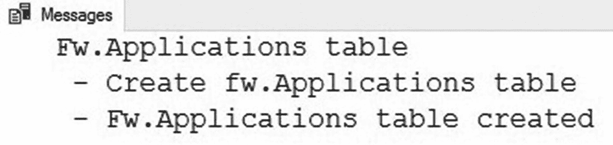

**图 23-11** 创建 fw.Applications 表

使用清单 23-3 中的 T-SQL 添加 `Packages` 表：

```sql
Use SSISDB
go
print 'Fw.Packages table'
If Not Exists(Select s.[name] + '.' + t.[name]
From [sys].[tables] t
Join [sys].[schemas] s
On s.[schema_id] = t.[schema_id]
Where s.[name] = N'fw'
And t.[name] = N'Packages')
begin
print ' - Create fw.Packages table'
Create Table fw.Packages
(PackageId int identity(1, 1)
Constraint PK_Packages Primary Key
,FolderName nvarchar(130) Not NULL
,ProjectName nvarchar(130) Not NULL
,PackageName nvarchar(260) Not NULL)
print ' - Fw.Packages table created'
end
Else
begin
print ' - Fw.Packages table already exists.'
end
go
```
**清单 23-3** 添加 Packages 表

首次执行时，“消息”选项卡显示如图 23-12 所示：

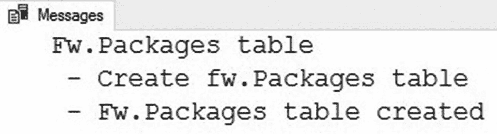

**图 23-12** 创建 fw.Packages 表

通过使用清单 23-4 中的 T-SQL 添加 `ApplicationPackages` 表，来解决 `Applications` 和 `Packages` 之间的多对多基数关系：

```sql
Use SSISDB
go
print 'Fw.ApplicationPackages table'
If Not Exists(Select s.[name] + '.' + t.[name]
From [sys].[tables] t
Join [sys].[schemas] s
On s.[schema_id] = t.[schema_id]
Where s.[name] = N'fw'
And t.[name] = N'ApplicationPackages')
begin
print ' - Create fw.ApplicationPackages table'
Create Table fw.ApplicationPackages
(ApplicationPackageId int identity(1, 1)
Constraint PK_ApplicationPackages Primary Key
,ApplicationId int Not NULL
Constraint FK_ApplicationPackages_Applications
Foreign Key References fw.Applications(ApplicationId)
,PackageId int Not NULL
Constraint FK_ApplicationPackages_Packages
Foreign Key References fw.Packages(PackageId)
,ExecutionOrder int Not NULL
Constraint DF_ApplicationPackages_ExecutionOrder
Default(10)
,Synchronized bit Not NULL
Constraint DF_ApplicationPackages_Synchronized
Default(1)
,MaximumRetries int Not NULL
Constraint DF_ApplicationPackages_MaximumRetries
Default(100)
,RetryIntervalSeconds int Not NULL
Constraint DF_ApplicationPackages_RetryIntervalSeconds
Default(10)
,Use32bit int Not NULL
Constraint DF_ApplicationPackages_Use32bit
Default(0)
,LoggingLevel nvarchar(25) Not NULL
Constraint DF_ApplicationPackages_LoggingLevel
Default('Basic')
)
print ' - Fw.ApplicationPackages table created'
end
Else
begin
print ' - Fw.ApplicationPackages table already exists.'
end
go
```
**清单 23-4** 添加 ApplicationPackages 表

首次执行时，“消息”选项卡显示如图 23-13 所示：

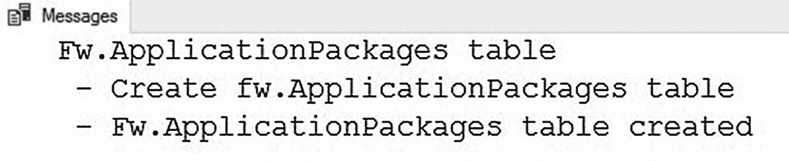

**图 23-13** 创建 fw.ApplicationPackages 表

`ApplicationPackages` 表包含在“执行目录包任务”中可用的多个 SSIS 包执行设置。为什么不将这些属性添加到 `Packages` 表中呢？回想一下，同一个包可能在多个应用程序中使用。例如，我们可能希望在一个应用程序中同步执行 `ArchiveFile.dtsx`，而在另一个应用程序中异步执行它。其他属性也是如此。


### 添加执行引擎

我们框架的执行引擎是一个 SSIS 包，它使用了我们的 `Execute Catalog Package Task`。点击 `参数` 选项卡，添加一个新的名为 `ApplicationName` 的 `String` 类型包参数，如图 23-14 所示：

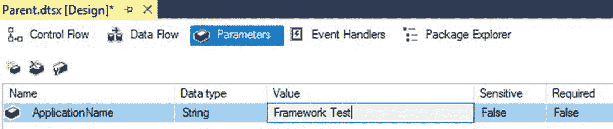
*图 23-14：添加 ApplicationName 包参数*

向 `Parent.dtsx` SSIS 包添加一个新的 SSIS 包作用域的 `ADO.Net 连接管理器`，命名为 `Framework SSIS Catalog`，并连接到承载框架 SSIS 目录的 SQL Server 实例，如图 23-15 所示：

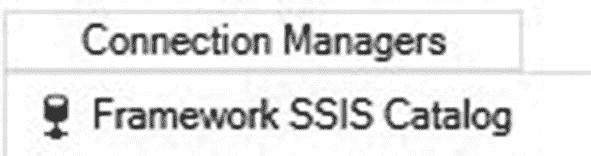
*图 23-15：添加 Framework SSIS Catalog 连接管理器*

向 `ECPTFramework` SSIS 项目添加一个新的名为 `Parent.dtsx` 的 SSIS 包。向 `Parent.dtsx` 控制流添加一个 `执行 SQL 任务`，并将该 `执行 SQL 任务` 重命名为 `SQL Get Application Packages`，如图 23-16 所示：

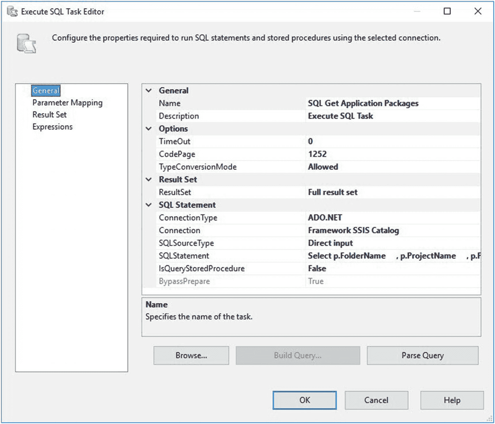
*图 23-16：SQL Get Application Packages 常规视图*

将 `ConnectionType` 属性设置为 `ADO.NET`，并将 `Connection` 属性设置为 `Framework SSIS Catalog` 连接管理器。在 `SQLStatement` 属性中，输入清单 23-5 中的 T-SQL：

```sql
Select p.FolderName
, p.ProjectName
, p.PackageName
, ap.Synchronized
, ap.MaximumRetries
, ap.RetryIntervalSeconds
, ap.Use32bit
, ap.LoggingLevel
From fw.ApplicationPackages ap
Join fw.Applications a
On a.ApplicationId = ap.ApplicationId
Join fw.Packages p
On p.PackageId = ap.PackageId
Where a.ApplicationName = @ApplicationName
Order By ap.ExecutionOrder
```
*清单 23-5：用于获取应用程序包的 T-SQL*

一旦添加到 `SQLStatement` 属性中，T-SQL 将如图 23-17 所示：

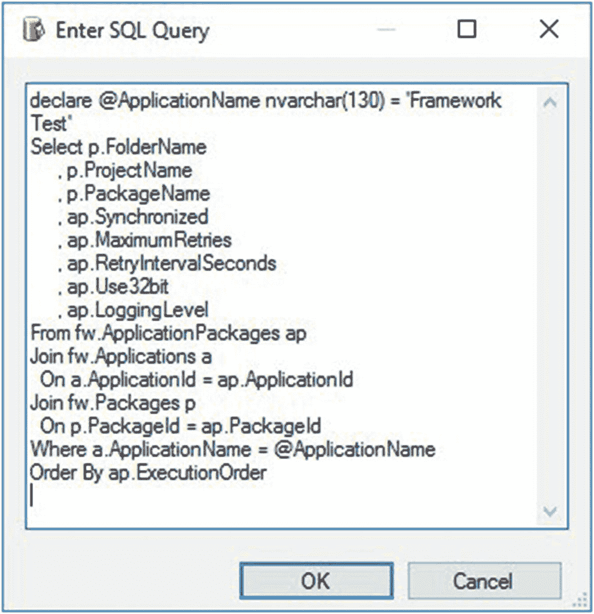
*图 23-17：用于 SQL Statement 属性的 T-SQL*

将 `ResultSet` 属性配置为 `完整结果集`。点击 `参数映射` 页面，然后点击 `添加` 按钮。将 `变量名` 设置为 `$Package::ApplicationName`，`数据类型` 设置为 `String`，并将 `参数名` 设置为 `ApplicationName`，如图 23-18 所示：

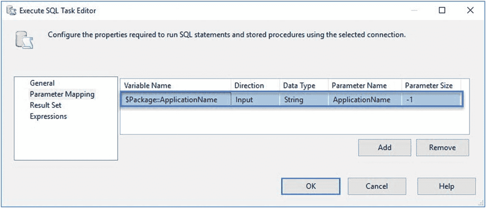
*图 23-18：配置参数映射*

在 `结果集` 页面上，点击 `添加` 按钮，并将 `结果名称` 重命名为 `0`。点击 `变量名` 下拉菜单并选择 `<新变量…>`，如图 23-19 所示：

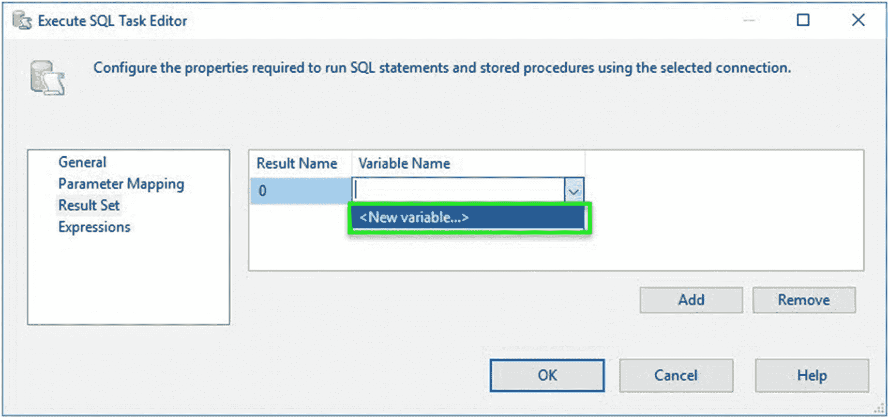
*图 23-19：为结果集创建新变量*

使用以下设置配置新变量属性：
- 容器：`Parent`
- 名称：`ApplicationPackages`
- 命名空间：`User`
- 值类型：`Object`

配置完成后，`User::ApplicationPackages Object` 类型的变量将如图 23-20 所示：

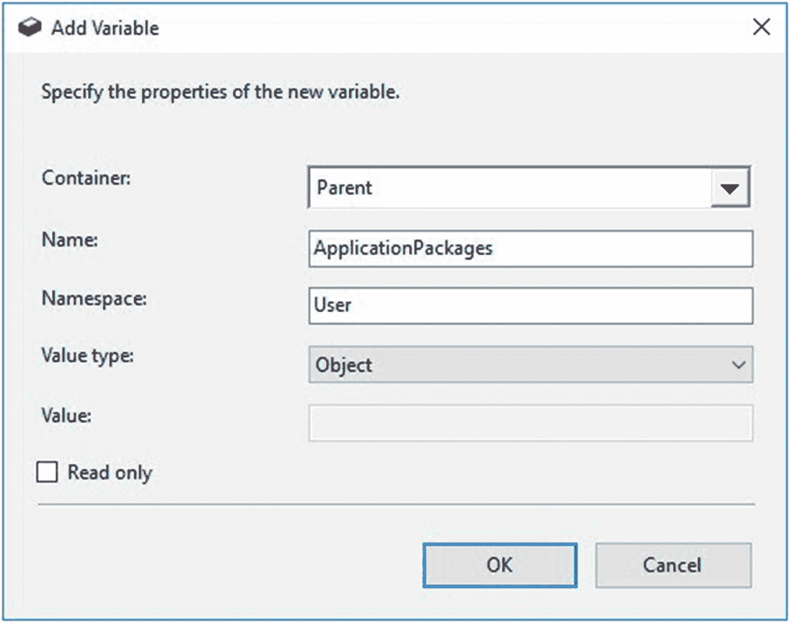
*图 23-20：User::ApplicationPackages 对象类型变量*

点击 `确定` 按钮关闭 `添加变量` 对话框。`结果集` 页面将如图 23-21 所示：

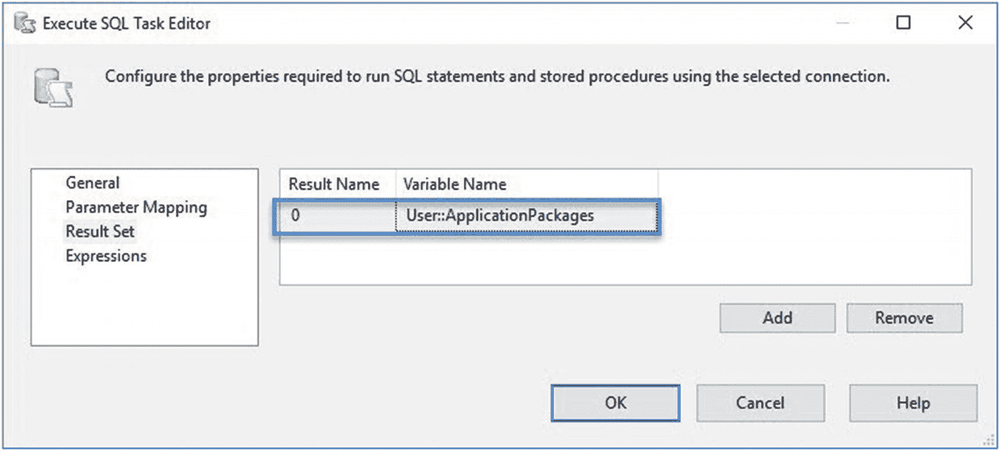
*图 23-21：配置结果集*


配置 SQL 获取应用程序包任务

点击 **确定** 按钮关闭 **执行 SQL 任务编辑器**。`Parent.dtsx` 控制流出现，如图 23-22 所示：

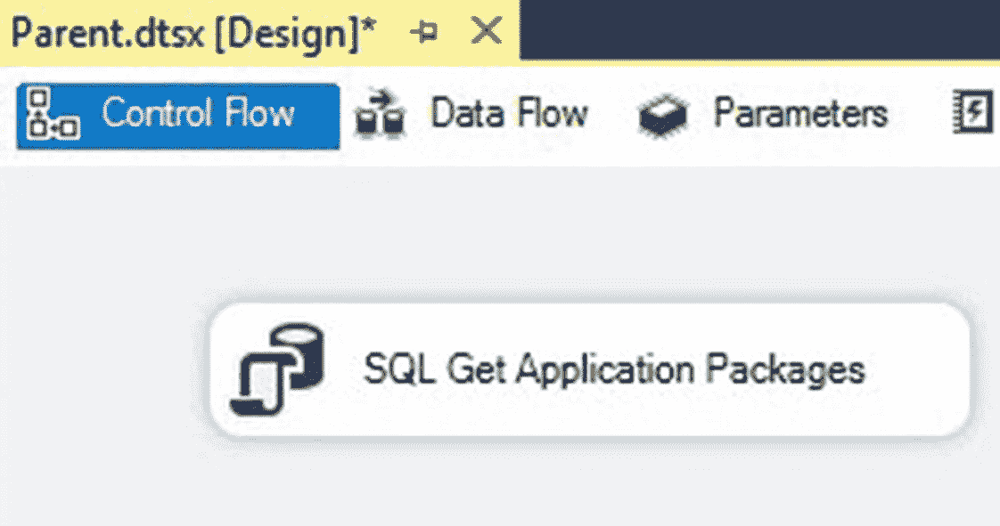
*图 23-22 SQL 获取应用程序包已配置*

将 **Foreach 循环容器** 拖放到 `Parent.dtsx` 控制流上，并将 **Foreach 循环容器** 重命名为 “Foreach Application Package”，如图 23-23 所示：

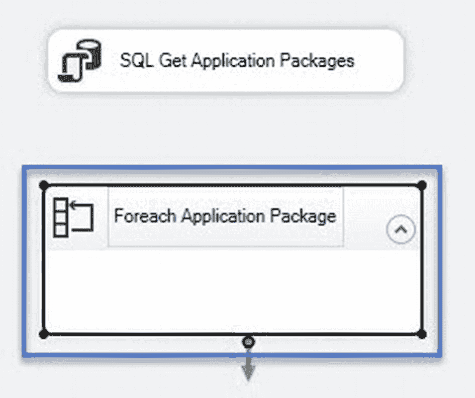
*图 23-23 添加 “Foreach Application Packages” Foreach 循环容器*

从 **SQL Get Application Packages** 到 **Foreach Application Packages** 连接一个 **成功** 优先级约束。打开 **Foreach Application Packages Editor**，点击 **集合** 页面，然后将 `Enumerator` 属性设置为 “`Foreach ADO Enumerator`”。通过点击下拉菜单并选择 `User::ApplicationPackages` 来配置 “ADO 对象源变量”，如图 23-24 所示：

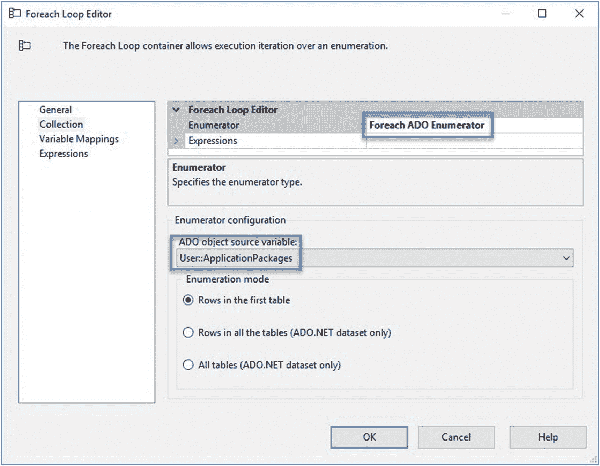
*图 23-24 配置 Foreach ADO 枚举器*

点击 **变量映射** 页面。点击 **变量** 下拉菜单并选择 “<新建变量…>”，如图 23-25 所示：

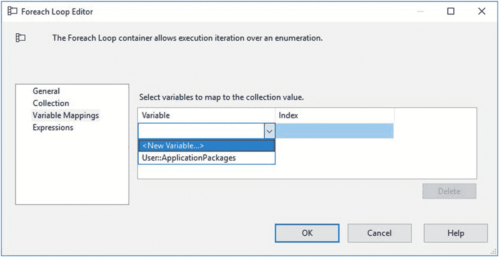
*图 23-25 创建新的变量映射*

使用以下设置配置新变量属性：

*   `Container`: `Parent`
*   `Name`: `Folder`
*   `Namespace`: `User`
*   `Value type`: `String`
*   `Value`: <*插入一个 SSIS 目录文件夹的名称*>

配置完成后，`User::Folder String` 类型变量出现，如图 23-26 所示：

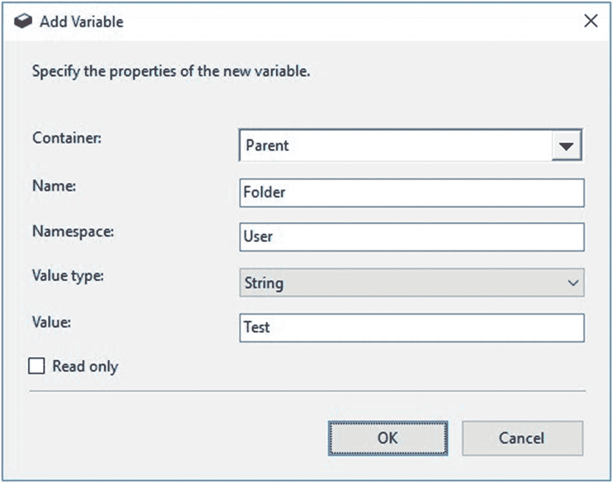
*图 23-26 创建 User::Folder 变量*

创建另一个新变量并使用以下设置配置属性：

*   `Container`: `Parent`
*   `Name`: `Project`
*   `Namespace`: `User`
*   `Value type`: `String`
*   `Value`: <*插入一个 SSIS 目录项目的名称*>

配置完成后，`User::Project String` 类型变量出现，如图 23-27 所示：

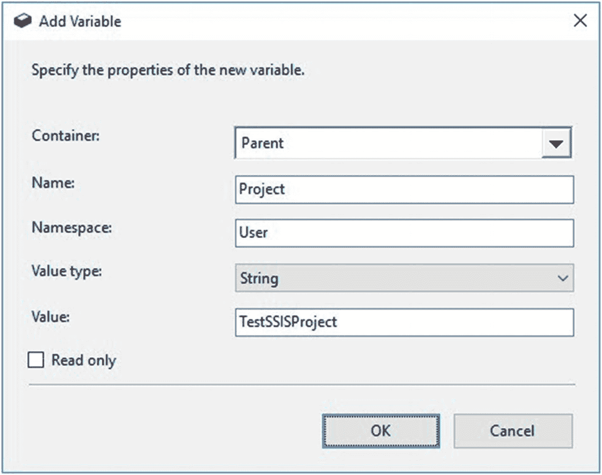
*图 23-27 创建 User::Project 变量*

创建另一个新变量并使用以下设置配置属性：

*   `Container`: `Parent`
*   `Name`: `Package`
*   `Namespace`: `User`
*   `Value type`: `String`
*   `Value`: <*插入一个 SSIS 目录包的名称*>

配置完成后，`User::Package String` 类型变量出现，如图 23-28 所示：

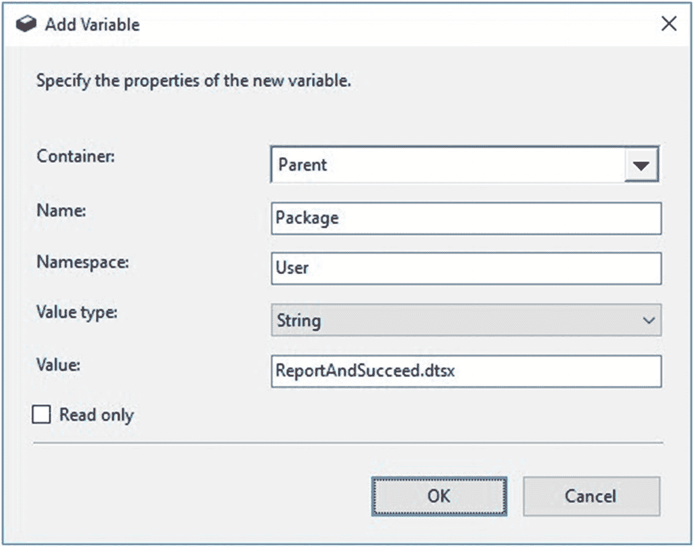
*图 23-28 创建 User::Package 变量*

创建又一个新变量并使用以下设置配置属性：

*   `Container`: `Parent`
*   `Name`: `Synchronized`
*   `Namespace`: `User`
*   `Value type`: `Boolean`
*   `Value`: `true`

配置完成后，`User::Synchronized Boolean` 类型变量出现，如图 23-29 所示：

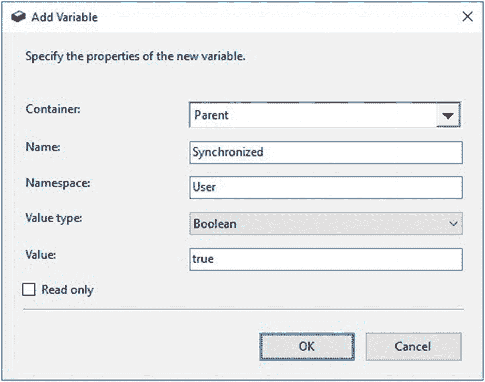
*图 23-29 创建 User::Synchronized 变量*

创建又一个新变量并使用以下设置配置属性：

*   `Container`: `Parent`
*   `Name`: `MaximumRetries`
*   `Namespace`: `User`
*   `Value type`: `Int32`
*   `Value`: `29`


## 配置变量

配置后，`User::MaximumRetries Int32` 类型变量如图 23-30 所示：

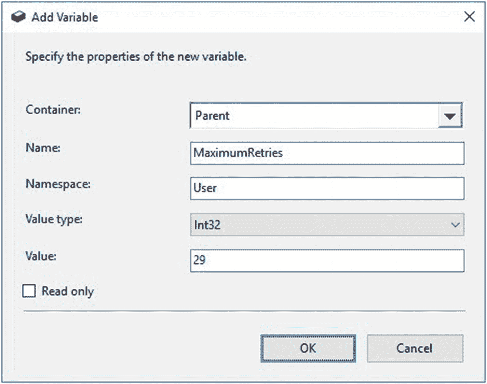

图 23-30：创建 `User::MaximumRetries` 变量

创建一个新变量并配置属性，设置如下：

*   容器：`Parent`
*   名称：`RetryIntervalSeconds`
*   命名空间：`User`
*   值类型：`Int32`
*   值：`10`

配置后，`User::RetryIntervalSeconds Int32` 类型变量如图 23-31 所示：

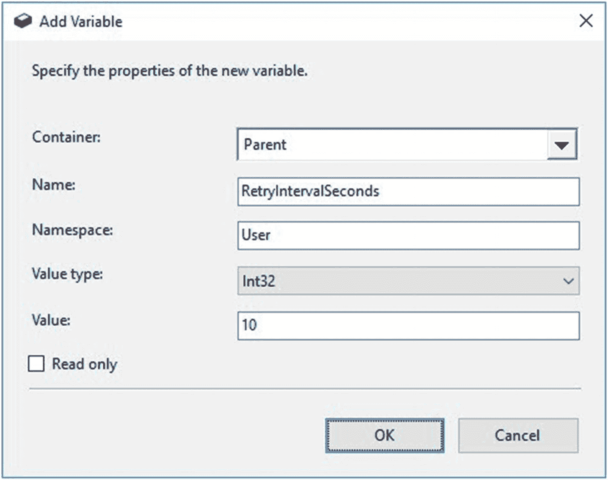

图 23-31：创建 `User::RetryIntervalSeconds` 变量

创建一个新变量并配置属性，设置如下：

*   容器：`Parent`
*   名称：`Use32bit`
*   命名空间：`User`
*   值类型：`Boolean`
*   值：`false`

配置后，`User::Use32bit Boolean` 类型变量如图 23-32 所示：

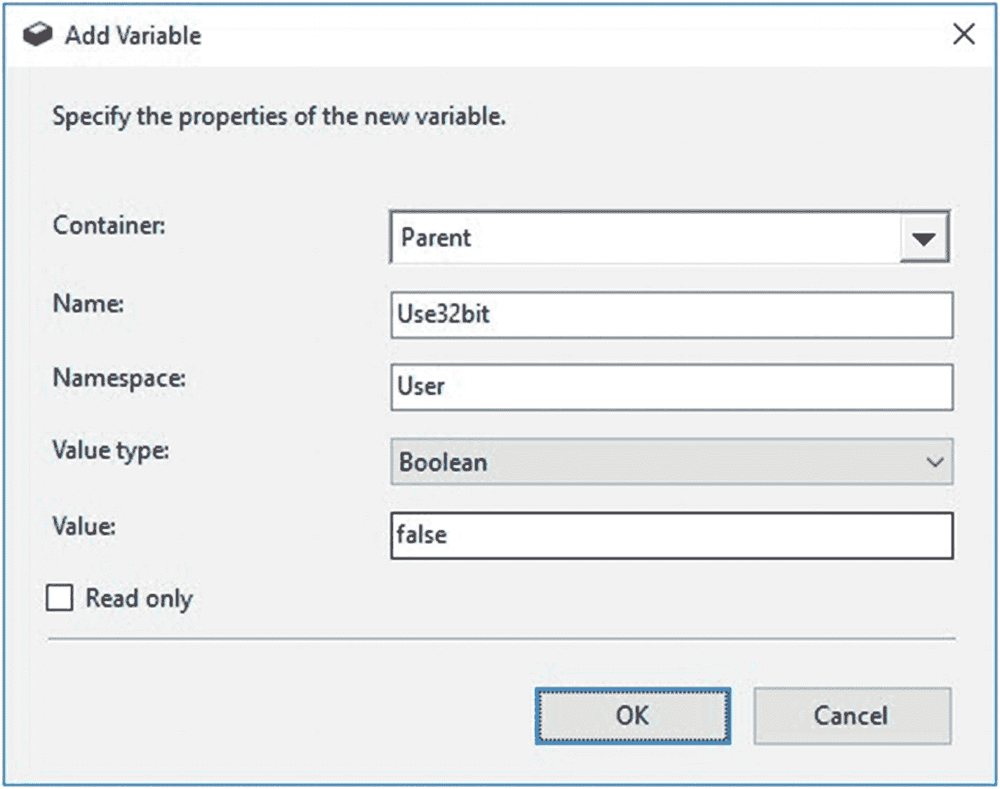

图 23-32：创建 `User::Use32bit` 变量

创建最后一个 `Foreach Application Packages` 变量并配置属性，设置如下：

*   容器：`Parent`
*   名称：`LoggingLevel`
*   命名空间：`User`
*   值类型：`String`
*   值：`Basic`

配置后，`User::LoggingLevel Int32` 类型变量如图 23-33 所示：

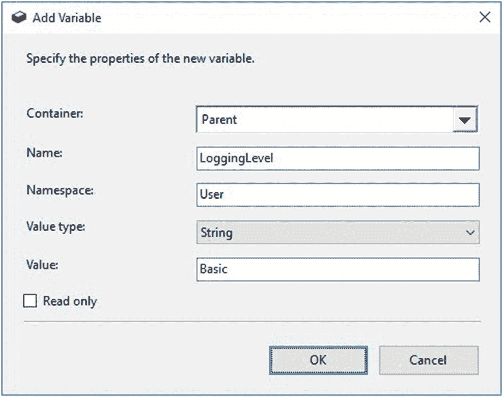

图 23-33：创建 `User::LoggingLevel` 变量

## 配置变量映射页面

创建并映射这些变量后，`Foreach Application Packages Variable Mappings` 页面如图 23-34 所示：

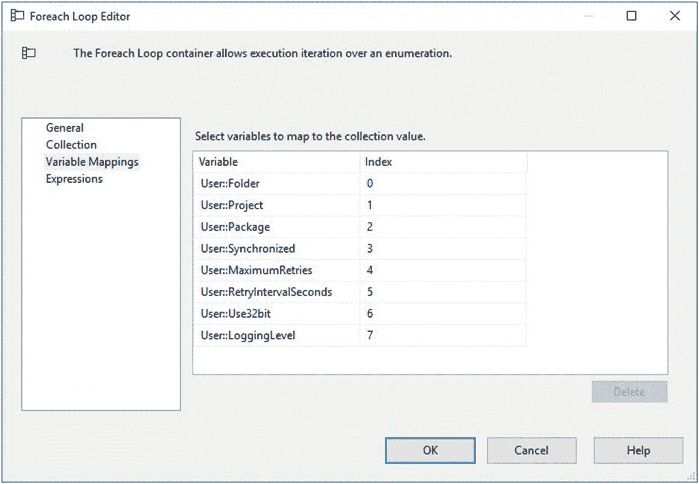

图 23-34：配置完成的 `Foreach Application Packages Variable Mappings` 页面

点击 `OK` 按钮关闭 `Foreach Application Packages Foreach` 循环容器编辑器。

## 添加并配置执行任务

下一步是向 `Foreach Application Packages Foreach` 循环容器添加一个 `Execute Catalog Package Task`，如图 23-35 所示：

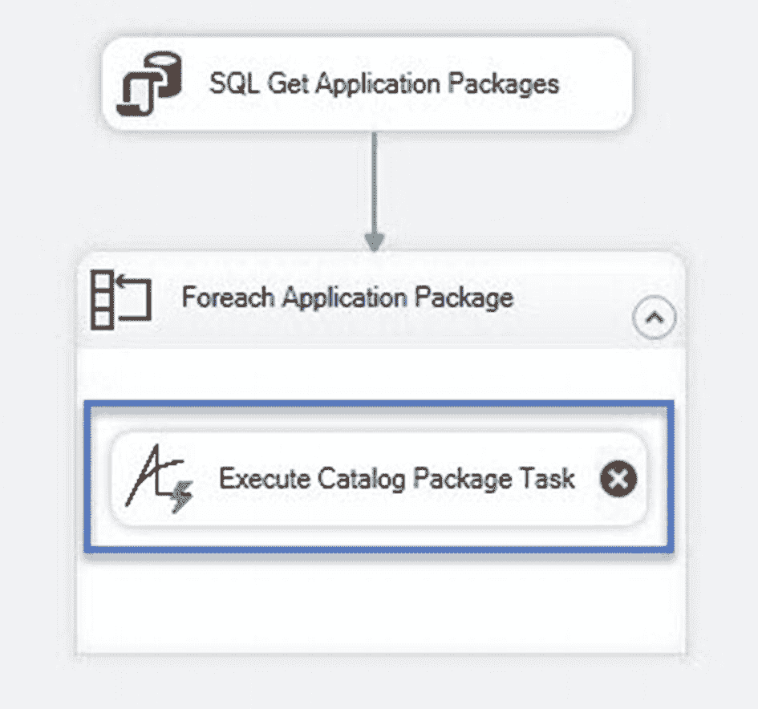

图 23-35：向 `Foreach Application Packages` 添加 `Execute Catalog Package Task`

添加一个新的名为 `"Execution SSIS Catalog"` 的 `ADO.Net` 连接管理器，如图 23-36 所示：


图 23-36：`Execution SSIS Catalog` 连接管理器

打开 `Execute Catalog Package Task Editor`，在 `General` 页面上将其重命名为 `"Execute Application Package"`。在 `Settings` 页面，点击 `SourceConnection` 下拉菜单并选择 `"Execute SSIS Catalog"`，如图 23-37 所示：

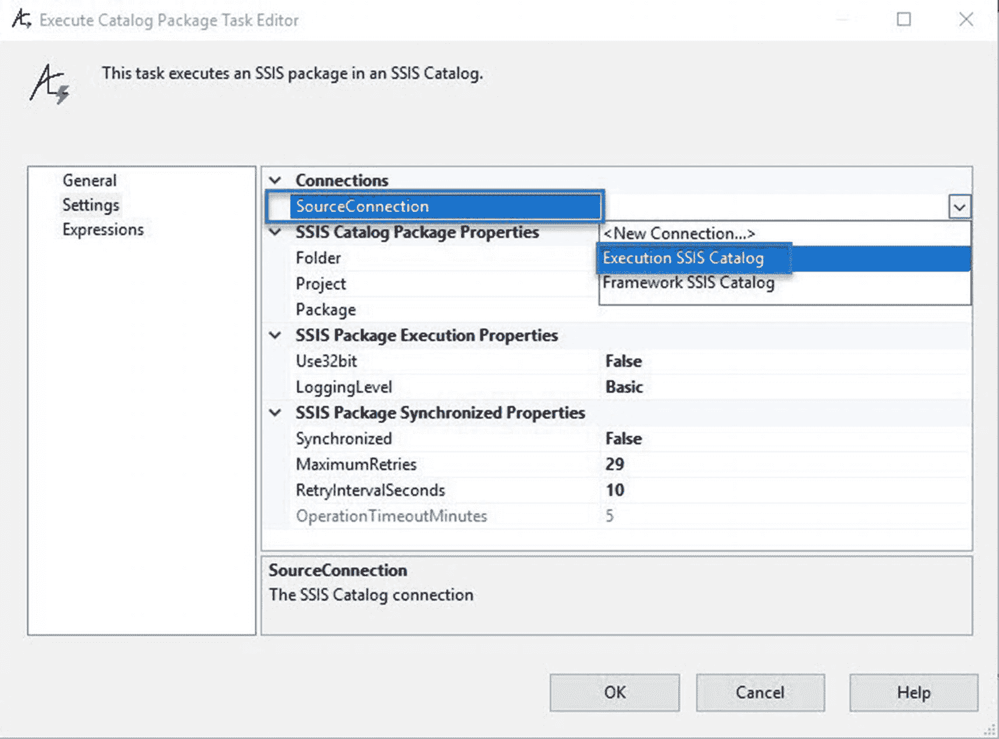

图 23-37：设置 `SourceConnection`

通过选择一个文件夹继续配置 `Execute Catalog Package Task`，如图 23-38 所示：

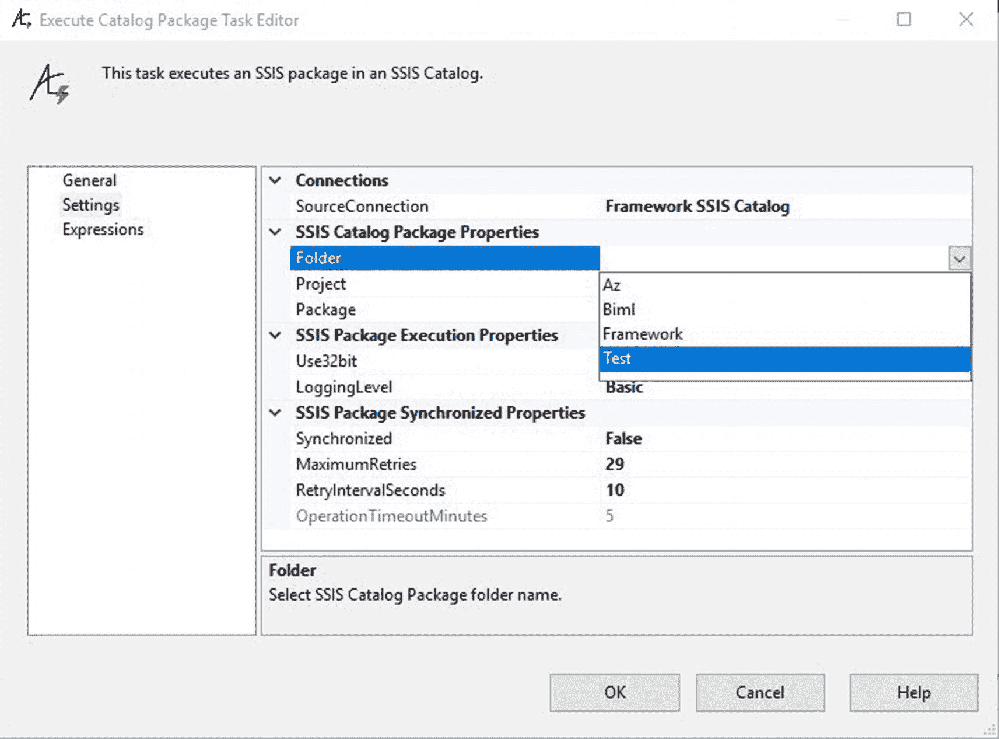

图 23-38：配置 `folder` 属性

通过选择一个项目继续配置 `Execute Catalog Package Task`，如图 23-39 所示：

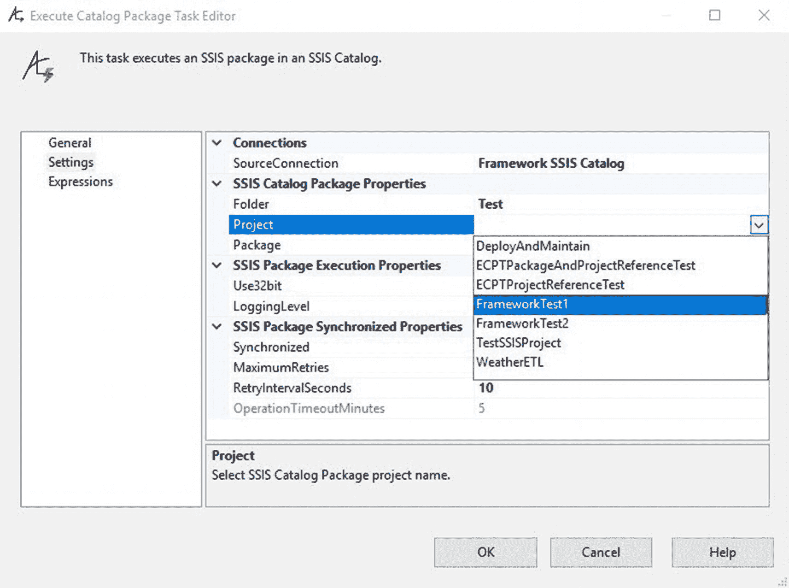

图 23-39：配置 `project` 属性

通过选择一个包继续配置 `Execute Catalog Package Task`，如图 23-40 所示：

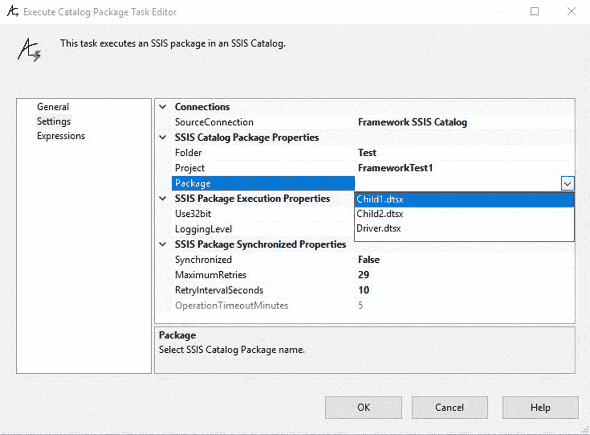

图 23-40：配置 `package` 属性

配置完成后，`Execute Catalog Package Task` 设置应如图 23-41 所示：

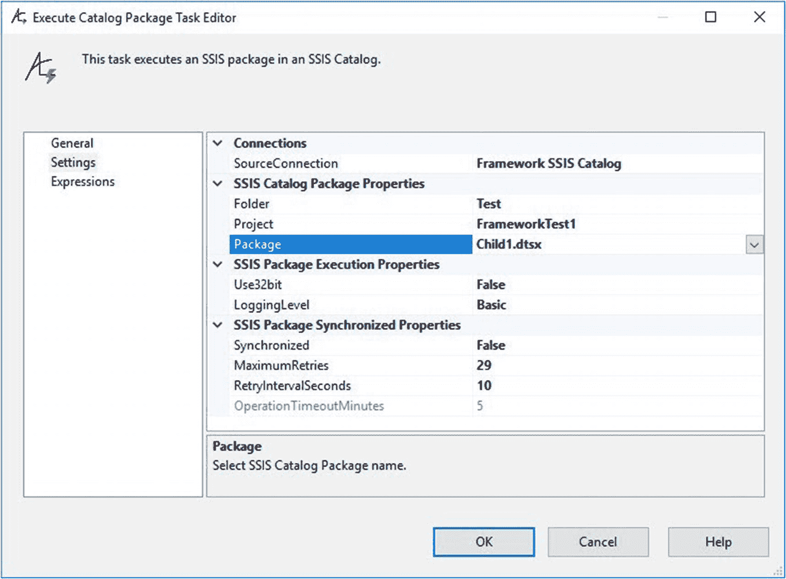

图 23-41：配置完成的 `Execute Catalog Package Task`

## 配置属性表达式

为这个版本的 SSIS 框架构建执行引擎的最后一步是配置 `Execute Catalog Package Task` 的属性表达式。点击 `Expressions` 页面，点击省略号，并将 `Execute Catalog Package Task` 属性映射到我们在配置 `Foreach Application Packages Variable Mappings` 页面时创建的变量。在本章前面，我们已经配置过 `Execute Catalog Package Task` 表达式（甚至配置过两次）。

将 `Execute Catalog Package Task` 的 `PackageFolder` 属性映射到 `User::Folder` 变量。首先在 `Property Expressions Editor` 中选择 `PackageFolder` 属性，如图 23-42 所示：

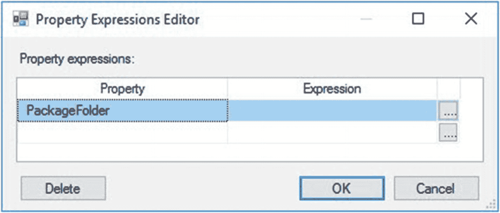

图 23-42：准备覆盖 `PackageFolder` 属性

点击 `Expression` 文本框旁的省略号以打开 `Expression Builder`。展开 `Variables and Parameters` 节点，然后将 `User::Folder` 拖放到 `Expression` 文本框中。点击 `Evaluate Expression` 按钮以查看 `Evaluated value` 文本框中的值，如图 23-43 所示：

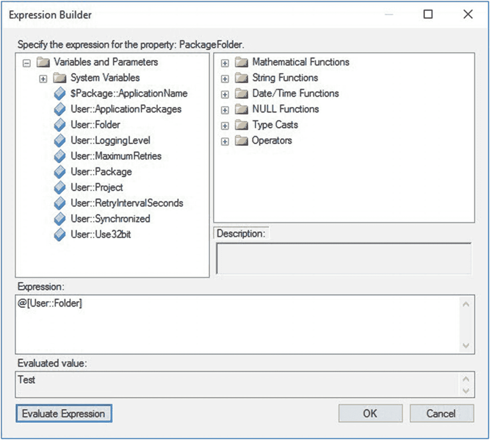

图 23-43：将 `User::Folder` 变量映射到 `PackageFolder` 属性

重复上述过程映射以下属性：

*   `PackageFolder`: `User::Folder`
*   `PackageProject`: `User::Project`
*   `PackageName`: `User::Package`
*   `Synchronized`: `User::Synchronized`
*   `MaximumRetries`: `User::MaximumRetries`
*   `RetryIntervalSeconds`: `User::RetryIntervalSeconds`
*   `Use32bit`: `User::Use32bit`
*   `LoggingLevel`: `User::LoggingLevel`

完成后，`Property Expressions Editor` 如图 23-44 所示：

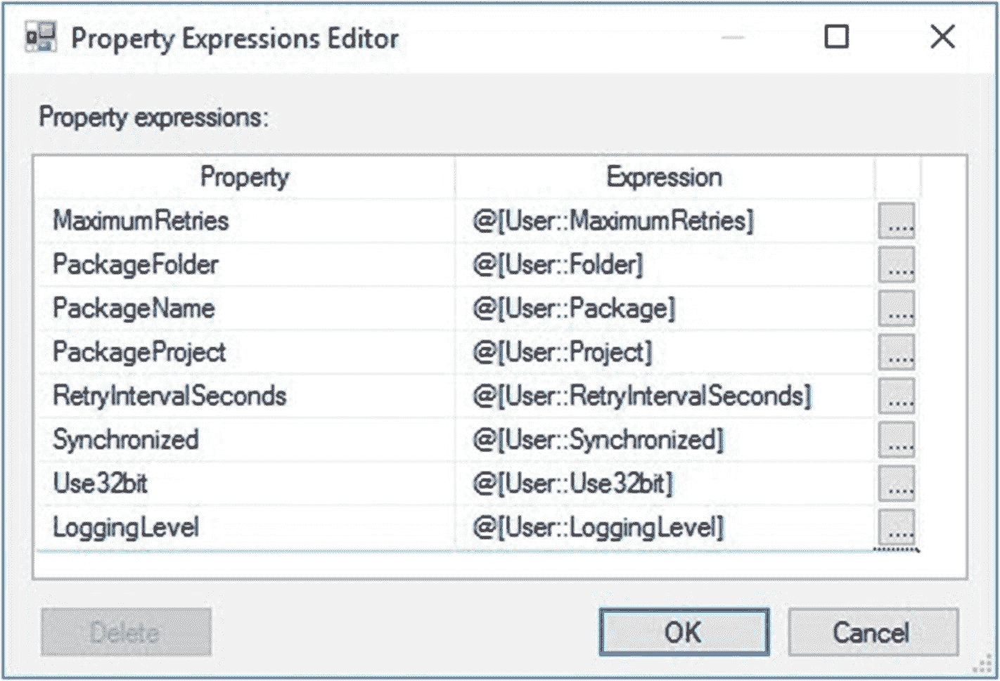

图 23-44：映射完成的 `Property Expressions`

点击 `Property Expressions Editor` 的 `OK` 按钮，然后点击 `Execute Catalog Package Task` 的 `OK` 按钮。


### 添加元数据

下一步是向框架表中添加应用程序、包和应用程序包元数据。使用清单 23-6 中的 T-SQL 添加应用程序元数据：

```
Insert Into fw.Applications
(ApplicationName)
Values('Framework Test')
go
Select * From fw.Applications
go
Listing 23-6
添加应用程序元数据
```

执行后，T-SQL 结果如图 23-45 所示：

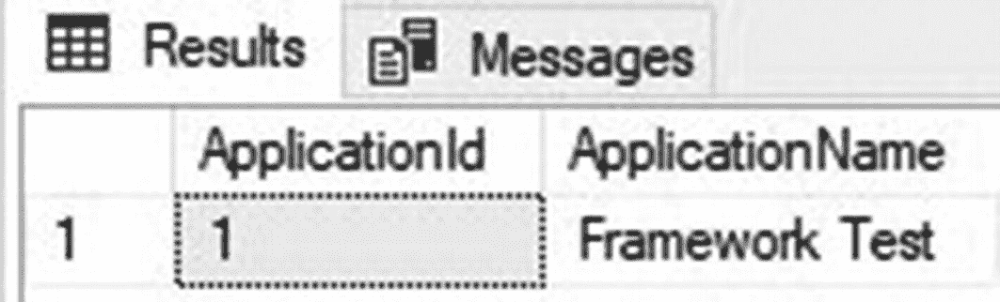

图 23-45

添加 SSIS 框架应用程序

使用清单 23-7 中的 T-SQL 添加包元数据：

```
Insert Into fw.Packages
(FolderName, ProjectName, PackageName)
Values
('Test', 'TestSSISProject', 'ReportAndSucceed.dtsx')
, ('Test', 'TestSSISProject', 'ReportParameterAndSucceed.dtsx')
, ('Test', 'TestSSISProject', 'RunForSomeTime.dtsx')
go
Select * From fw.Packages
go
Listing 23-7
添加包元数据
```

执行后，T-SQL 结果如图 23-46 所示：

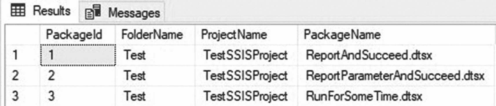

图 23-46

添加 SSIS 框架包

使用清单 23-8 中的 T-SQL 添加应用程序包元数据：

```
Insert Into fw.ApplicationPackages
(ApplicationId, PackageId, ExecutionOrder
, Synchronized, MaximumRetries
, RetryIntervalSeconds, Use32bit, LoggingLevel)
Values
(1, 1, 10, 1, 10, 2, 0, 'Basic')
, (1, 2, 20, 0, 10, 2, 1, 'Performance')
, (1, 3, 30, 1, 30, 2, 1, 'Verbose')
go
Select * From fw.ApplicationPackages
go
Listing 23-8
添加应用程序包元数据
```

请确保 `ApplicationId` 和 `PackageId` 值分别与 `fw.Applications` 和 `fw.Packages` 表中由标识值自动生成的相应值匹配。

执行后，T-SQL 结果如图 23-47 所示：

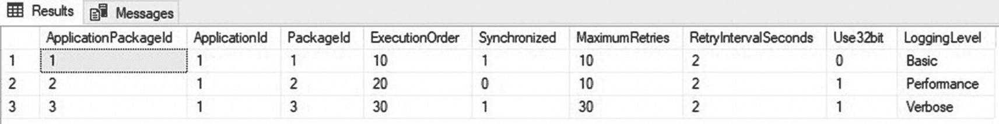

图 23-47

添加 SSIS 框架应用程序包

## 来测试一下吧！

如果一切按计划进行，`Parent.dtsx` SSIS 包执行的测试将成功运行。如图 23-48 所示：

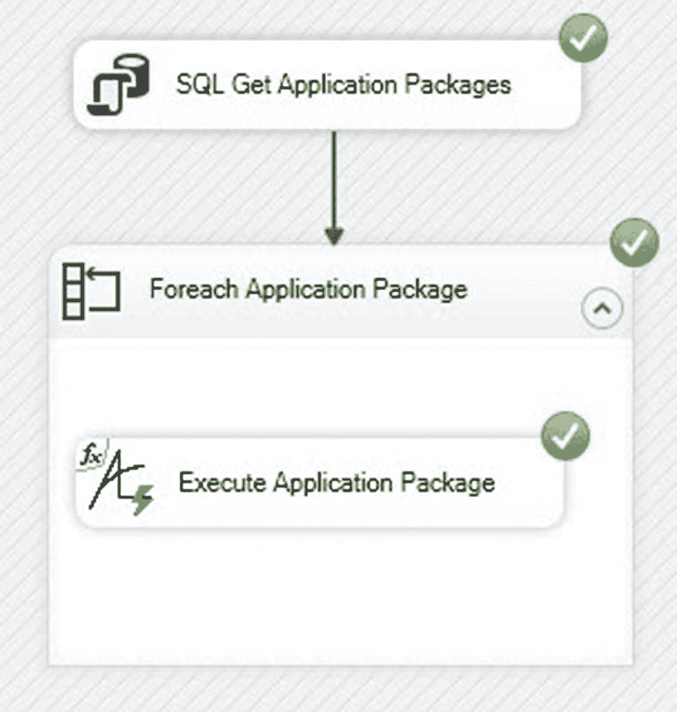

图 23-48

成功的测试执行

进度/执行结果选项卡如图 23-49 所示：

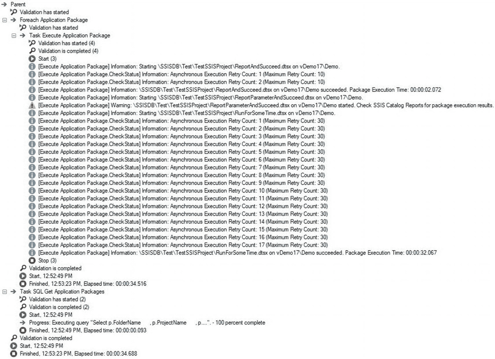

图 23-49

由 `Parent.dtsx` 执行的三个包

使用 `SQL Server Management Studio (SSMS)` 连接到在 `Parent.dtsx` 包的“执行 SSIS 目录”连接管理器中配置的 SQL Server 实例，并查看 SSIS 目录“所有执行”报告，如图 23-50 所示：

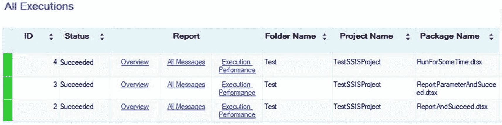

图 23-50

查看“所有执行”报告

“所有执行”报告显示了根据我们配置的元数据执行的三个 SSIS 包。

## 注意事项

本章中的演示基于许多假设，因此存在许多注意事项。可以这么说，作者意识到了其中许多（但非全部）假设和注意事项，并且很感兴趣地想看看读者们将如何调整、改变和改进本文中提出的想法。

### 结论

在本章中，我们利用“执行目录包任务”构建了一个基于 SSIS 目录的元数据驱动 SSIS 框架。这个元数据驱动的框架与《SQL Server Data Automation Through Frameworks》一书中的 SSIS 框架本地版本以及 SSIS Framework Community Edition ([dilmsuite.com/ssis-framework-community-edition](https://dilmsuite.com/ssis-framework-community-edition)) 相似——这是一个免费开源项目，是构成 Data Integration Lifecycle Management Suite ([dilmsuite.com](https://dilmsuite.com)) 的实用工具集的一部分。

本章的框架并未穷尽“执行目录包任务”的所有功能。您可以配置“表达式”视图来覆盖*任何*属性表达式，如图 23-51 所示：

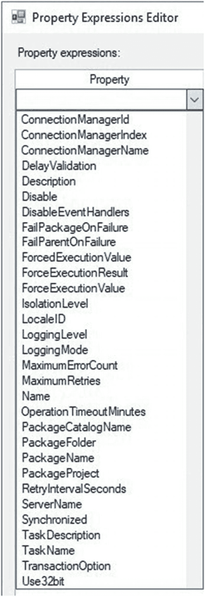

图 23-51

执行目录包任务属性表达式

现在是签入代码的绝佳时机。

