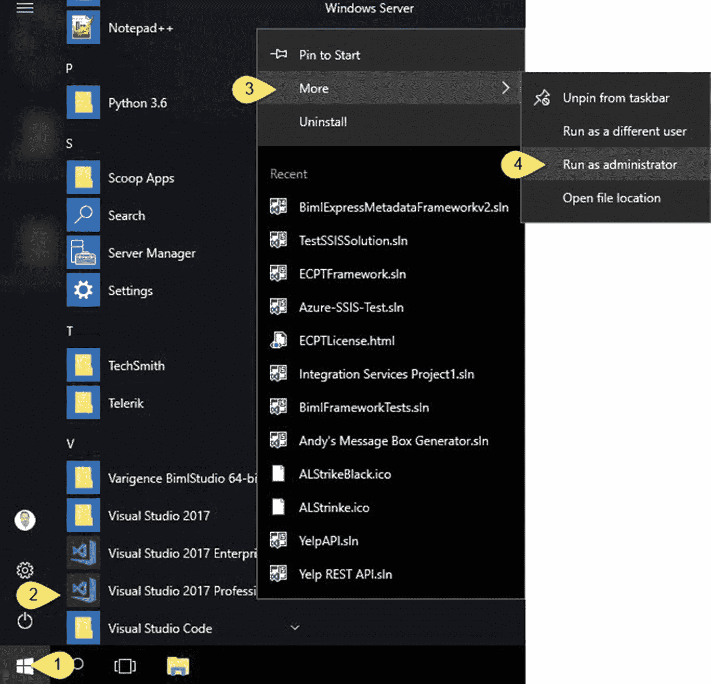
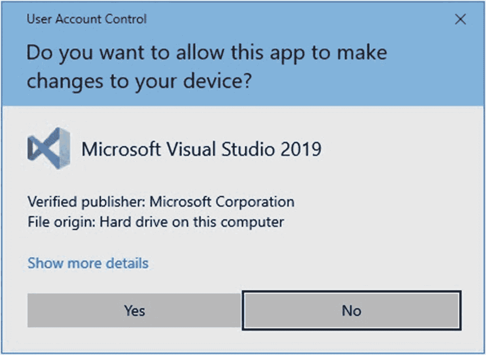
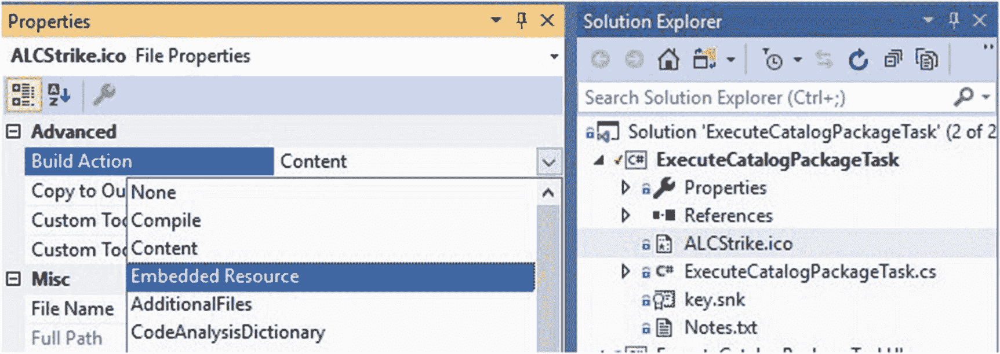

# 26. 来自我的经验笔记

在学习构建自定义 SSIS 任务的过程中，我遇到了一些基础错误，我相信有经验的 .Net 开发者会避免这些错误。当我搜索解决方案时，我发现能得到的帮助非常少。原因是什么？我相信我遇到的问题对于开发针对全局程序集缓存（GAC）的解决方案的开发者来说并不典型。当一个人开始在控件空间进行开发时，通常被认为应该*已经知道* .Net 开发的某些事情。

我当时并不知道其中一些事情。

我遇到了哪些问题，以及我学到了哪些应该遵循的最佳实践？以下部分重点介绍了一些我的心得。


## 以管理员身份启动 Visual Studio

你希望能够构建到系统文件夹。要构建到系统文件夹，需要以管理员身份启动 Visual Studio。当你打开 Visual Studio 时，右键单击 Visual Studio 磁贴，然后单击“**以管理员身份运行**”，如图 26-1 所示：



图 26-1: 以管理员身份运行 Visual Studio

当你点击“以管理员身份运行 Visual Studio”时，系统会提示你确认是否希望以管理员身份运行 Visual Studio，如图 26-2 所示：



图 26-2: 确认你确实想以管理员身份运行 Visual Studio

以管理员身份运行 Visual Studio 的原因是为了省去将 DLL 程序集从 `bin\Debug` 文件夹复制到 `…DTS\Tasks` 文件夹的额外步骤。你需要将这些 DLL 放在 `Tasks` 文件夹中，以便 SQL Server Data Tools 能够为 SSIS 开发定位（并加载）它们。你还需要将这些 DLL 放在全局程序集缓存 (GAC) 中，以便 SSIS 可以在运行时使用它们。

## 学习如何恢复

备份无用，恢复无价。从制定恢复策略开始。问问自己：“我呀，如果发生了什么不幸，我该如何回到起点？” 尽早回答这个问题。你会庆幸自己这么做了。

### 创建笔记文件

在构建 Visual Basic 或 C# 应用程序时，你可以在 Visual Studio 社区版中配置生成后事件。不过，构建一个笔记文件帮助我们熟悉了这些工具。我很高兴我们采取了这种方法。我的笔记文件包含在 GAC 中注销和注册我的 DLL 的命令，以及使用强名称工具生成公钥/私钥对的密钥生成命令。截至本项目结束时，我的笔记文件如清单 26-1 所示：

```
-- key generation
"C:\Program Files (x86)\Microsoft SDKs\Windows\v10.0A\bin\NETFX 4.8 Tools\sn.exe" -k key.snk
"C:\Program Files (x86)\Microsoft SDKs\Windows\v10.0A\bin\NETFX 4.8 Tools\sn.exe" -p key.snk public.out
"C:\Program Files (x86)\Microsoft SDKs\Windows\v10.0A\bin\NETFX 4.8 Tools\sn.exe" -t public.out
-- register
"C:\Program Files (x86)\Microsoft SDKs\Windows\v10.0A\bin\NETFX 4.8 Tools\gacutil.exe" -if "E:\Program Files (x86)\Microsoft SQL Server\150\DTS\Tasks\ExecuteCatalogPackageTask.dll"
"C:\Program Files (x86)\Microsoft SDKs\Windows\v10.0A\bin\NETFX 4.8 Tools\gacutil.exe" -if "E:\Program Files (x86)\Microsoft SQL Server\150\DTS\Tasks\ExecuteCatalogPackageTaskUI.dll"
-- unregister
"C:\Program Files (x86)\Microsoft SDKs\Windows\v10.0A\bin\NETFX 4.8 Tools\gacutil.exe" -u ExecuteCatalogPackageTask
"C:\Program Files (x86)\Microsoft SDKs\Windows\v10.0A\bin\NETFX 4.8 Tools\gacutil.exe" -u ExecuteCatalogPackageTaskUI
清单 26-1: 笔记
```

### 清理解决方案

清理解决方案是我概述的四步恢复流程中的另一个步骤。当出现问题时：

1.  从 GAC 中注销程序集。
2.  清理解决方案。
3.  在代码中更正问题并生成解决方案。
4.  在 GAC 中注册程序集。

我们将程序集的生成属性配置为将 DLL 输出到 `DTS\Tasks` 系统文件夹。我们在项目属性中配置了生成事件，以管理在 GAC 中注销和注册我们的生成输出文件。我们之所以能够完成所有这些工作，是因为我们选择了 C# 而不是 Visual Basic 作为开发语言。

## 更改图标文件的生成操作属性

这个特定问题困扰了我 ____（我很尴尬要说多久，但花了 `太` 久）。你需要将图标文件的生成操作属性更改为 `嵌入的资源`。只有在此更新之后，你的任务图标才会在 SSIS 工具箱中显示。

默认情况下，文件的生成操作属性为 `内容`。将其更改为 `嵌入的资源`，如图 26-3 所示：



图 26-3: 更改图标文件的生成操作

这很重要。如果你不将图标文件的生成操作属性从 `内容` 更改为 `嵌入的资源`，图标将 `不会` 显示在你的任务上。

## 解决 PackageInfo.Execute 超时问题

在 `ExecuteCatalogPackageTask` 开发接近尾声时，我遇到了 `Microsoft.SqlServer.Management.IntegrationServices.PackageInfo` 的 `Execute` 方法的一个“特性”：它在 30 秒后超时。在撰写本文时，我仍然不确定为什么存在这个超时。我怀疑可能有一个很好的理由，而（再次）我对此并不了解。

本书有一章专门介绍了如何使用为构建线程安全多线程应用程序而开发的线程功能来解决超时逻辑。

## 解决 Azure SQL DB 中缺少 xp_msver 的问题

在为 `ExecuteCatalogPackageTask` 开发构建最后一个编码章节的最后一个演示时，我发现：

1.  `xp_msver` 在 Azure SQL DB 中缺失。
2.  `xp_msver` 在包执行完成后由 `Microsoft.SqlServer.Management.IntegrationServices.PackageInfo` 的 `Execute` 方法调用。

请在第 25 章找到解决方案。

## 阅读 Azure-SSIS 自定义任务安装日志

了解自定义任务安装状态的最佳方法是阅读安装日志文件，尤其是你提供给 `main.cmd` 文件的路径。这在第 24 章中有介绍，但我承认直到我浪费了数天时间试图弄清楚为什么 `ExecuteCatalogPackageTask` 的 msi 未能正确安装后，我才理解这个文件的重要性。

你想要阅读的行在底部附近。它很长，你希望最后一句显示：“安装成功或错误状态：0。”

在第 24 章了解更多。

## 代码中存在错误

我们已尽一切努力确保发现并解决所有错误，这些努力大多取得了成功。请将错误报告发送至 andy.leonard@entdna.com。

## Azure 将会发生变化

在本书编写过程中，Azure-SSIS 发生了变化，其中一些变化影响了 `Execute Catalog Package Task` 的代码。

Azure-SSIS 将继续变化。

其中一些变化会影响本书代码的有效性。根据我个人多年的经验，我可以向你保证，Azure 永远不会变回去。相反，`你` 将必须更改你编写的任何针对 Azure 运行的代码。

## 获取源代码

本书的源代码可以通过访问 `Apress.com` 并跟随该网站上本书目录页面的链接获取。你也可以在 GitHub 站点 `github.com/aleonard763/ExecuteCatalogPackageTask` 找到示例代码。

## 最后的思考

如本书开头所讨论的，我并不是一名 C# 开发人员。我确信许多坚持读到这里的读者已经看过代码并认为，“有更好方法来编写那个。” 我的初衷并非引发不适。我的初衷是分享一种使用 C# 构建自定义 SSIS 任务的方法，而我的目标受众是 SSIS 开发人员。

我欢迎反馈和建议。你可以通过 `andy.leonard@EntDNA.com` 联系我。


