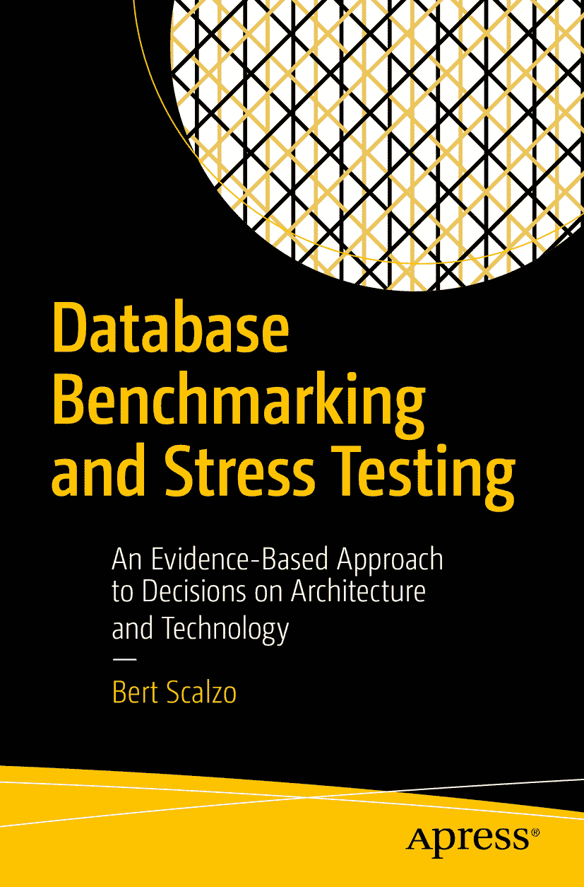

ISBN 978-1-4842-4007-6 电子书 ISBN `978-1-4842-4008-3` [`doi.org/10.1007/978-1-4842-4008-3`](https://doi.org/10.1007/978-1-4842-4008-3) 美国国会图书馆控制号：2018960192 © Bert Scalzo 2018
本作品受版权保护。出版者保留所有权利，无论涉及材料的全部或部分，特别是翻译、转载、插图再利用、朗诵、广播、微缩胶片复制或任何其他物理方式的复制，以及信息存储与检索、电子改编、计算机软件，或任何目前已知或未来开发的类似或不同方法的传播权利。
本书中可能出现商标名称、标识和图像。我们并非在每次出现商标名称、标识和图像时都使用商标符号，而仅以编辑方式并为商标所有者利益使用这些名称、标识和图像，并无商标侵权之意。本书中对商品名称、商标、服务标志及类似术语的使用，即使未特别标识，也不应被视为表达意见认为它们是否受专有权利约束。
虽然本书中的建议和信息在出版时被认为是真实和准确的，但作者、编辑和出版商均不对可能存在的任何错误或遗漏承担任何法律责任。出版商对本出版物所含材料不作任何明示或暗示的保证。
本书由 Springer Science+Business Media New York 全球发行至图书贸易市场，地址：233 Spring Street, 6th Floor, New York, NY 10013。电话 1-800-SPRINGER，传真 (201) 348-4505，电子邮件 orders-ny@springer-sbm.com，或访问 www.springeronline.com。Apress Media, LLC 是一家位于加利福尼亚州的有限责任公司，其唯一成员（所有者）是 Springer Science + Business Media Finance Inc (SSBM Finance Inc)。SSBM Finance Inc 是一家特拉华州的公司。

`献给我的妻子苏珊，她容忍了我三十多年，以及我们这些年来四条腿的孩子们：Ziggy、Max 和 Dexter。`

