# 2. 行业标准基准测试

在第 1 章中，我们区分了数据库基准测试、数据库压力测试和工作负载捕获/回放。通过理解这些不同的方法，我们为共同的理解和术语奠定了基础。另外，我们还了解了为什么这些不同的技术是有用的，以及何时最好地利用它们。回顾一下，我们的基本定义是：

*   数据库压力测试本质上是不确定且有限的、人工的工作负载，旨在基本施压数据库的底层性能（即，让数据库“出汗”）。
*   数据库基准测试是一个定义明确且被普遍接受的、行业标准的数据库压力测试，具有明确的性能指标，用于在给定的数据库大小和并发用户工作负载下衡量和比较结果。
*   工作负载捕获是实际数据库应用程序活动的一个定义明确且有限的快照，被记录下来以创建一个具有非人工工作负载的数据库基准测试，用于回放以比较前后性能。

在本章中，我们将回顾所有重要的行业标准数据库基准测试。此外，我们将它们分为两大类：当前流行的和现已不受欢迎的。这些数据库基准测试大多由事务处理委员会（[`www.tpc.org`](http://www.tpc.org)）开发，少数起源于大学。了解当前流行和不再受欢迎的行业标准数据库基准测试都很重要，因为前者往往植根于后者。最后请注意，每个行业标准数据库基准测试往往专注于特定类型的工作负载；因此，了解所有这些基准测试将使您能够为您的需求选择合适的一个。事实上，您很可能会发现，为了最好地近似您想要测试的工作负载，您需要混合使用多种基准测试。所以，再次强调，掌握所有这些基准测试的知识对于您进行测试至关重要。

## 最流行的基准测试

现在让我们讨论最流行的基准测试。

### TPC-C

TPC-C 可能是认知度最高、理解度最低，且经常被错误引用的数据库基准测试。它也是大多数数据库基准测试工具所提供的，但这些工具可能由于程序默认设置或超出规范的、用户可定义的选项，并未遵守基准测试规范的本意。此外，这些数据库基准测试工具可能会要求用户提供定义测试性质的运行时参数，但除非用户阅读过数据库基准测试规范，否则他们不知道如何正确提供这些参数。再者，大多数数据库基准测试工具不以一致的方式报告其结果，或者因其默认设置（可能符合也可能不符合规范）而获得截然不同的结果。最后，大多数人只是孤立地关注测试结果的一部分，例如每秒事务数（`TPS`），而没有适当的上下文进行任何有意义的解释。因此，TPC-C 因各种错误的原因而声名狼藉。

让我们从查看 [`tpc.org`](http://tpc.org) 网站和 TPC-C 规范中的数据库定义开始：

*   网站：TPC-C 是一个 OLTP 基准测试。由于它包含多种事务类型、更复杂的数据库和整体执行结构，因此它比之前的 OLTP 基准测试（如 TPC-A）更复杂。
*   TPC-C 规范：TPC-C 是一种 OLTP 工作负载。它是只读和更新密集型数据库事务的混合，模拟了一个复杂 OLTP 应用程序的活动。

这两个定义除了说明它是基于 OLTP 的之外，并没有真正提供关于应用程序负载性质的任何有意义的见解。这里是一个更彻底、因此更有用的定义：

> *TPC-C 于 1992 年获批，是最初的 OLTP 基准测试*，*其包含五种事务（新订单、支付、订单状态、发货和库存水平）的工作负载，试图模拟一个批发分销商，其拥有相当少的仓库来服务相对大量的零售地点。性能以每分钟新订单数来衡量。*

请注意，TPC-C 现在已经超过 25 年的历史了。它不能充分模拟当今现实世界的数据库工作负载，也不能正确施压当今硬件和数据库引擎的能力。因此，TPC-C 正迅速失宠。TPC-C 现在被认为非常“`老派`”，并已被 TPC-E 所取代，这是一个更新且复杂得多的 OLTP 数据库基准测试，本章后面将介绍。尽管如此，TPC-C 仍然是使用最广泛、被引用最多的基准测试，这就是为什么详细涵盖 TPC-C 数据库基准测试至关重要。让我们通过查看图 2-1 所示的 TPC-C 数据模型来继续我们的研究。

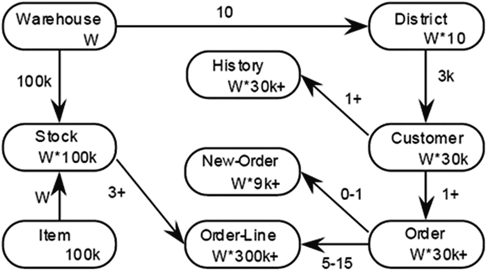

图 2-1 TPC-C 数据模型


### TPC-C 与 TPC-E 基准测试对比分析

首先需要注意的是，按照当今典型数据库应用的标准，这个数据模型相当简单且规模极小，仅有九个表。事实上，它被认为如此简单和微小，以至于几乎没有价值，这也是为什么更新的 TPC-E 数据库基准被创建出来的原因。其次，观察其设计，它从左上角的`WAREHOUSE`表开始，该表与`DISTRICT`表存在 10 对 1 的父子关系。关键思想是每个`WAREHOUSE`拥有 10 个终端，这相当于可能的并发用户会话数。这一点至关重要，因为规范明确要求数据库规模或缩放因子为每 10 个并发数据库用户会话对应 1 个仓库。如果你试图用超出规范的低`WAREHOUSE`数量（例如 100 个用户，缩放因子为 1）来运行高用户负载，那么你的基准测试结果很可能会失真，并且你很可能会遇到数据库争用或锁定问题。然而，大多数数据库基准测试工具允许用户这样做，即请求运行 1,000 个并发数据库会话，而缩放因子远低于规范要求的 100。

## TPC-C 的数据库设计与问题

为了更好地理解这一点，我们将检查规范要求的逻辑数据库设计，你会发现`DISTRICT`表存在一个固有的低效率。查看图 2-2 所示的`DISTRICT`表所需定义。

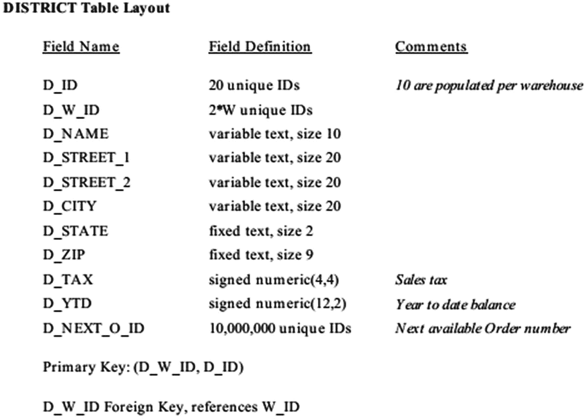

图 2-2：DISTRICT 表布局

注意，`D_NEXT_O_ID`列保存下一个可用的订单号，因此一个会话必须锁定该行以获取当前值，然后将其递增。这是在自动递增列或与序列号生成器绑定的表触发器出现之前，实现此概念的旧方式。之所以这样做，是因为并非所有数据库都提供这些高级功能。这就是为什么对于给定的缩放因子运行错误的用户负载（例如，1,000 个用户，缩放因子为 1）会导致严重的数据库争用和锁定问题，因为所有会话都必须争夺有限数量的`DISTRICT`表行上的锁。然而，我几乎普遍看到那些没有阅读基准规范的人犯这个错误，他们只是抱怨数据库基准测试工具很差劲（即，不会报告他们期望看到的极高数值）。

## TPC-C 允许的高级特性

数据库设计的另一个方面是，哪些高级物理数据库选项或模式对象定义修改是允许的？TPC-C 规范对此相当明确。以下是允许的：

*   用于主键约束的唯一索引
*   水平表分区
*   垂直表分区
*   表复制

一项不允许的高级数据库功能是物理表数据行聚类；然而，你会发现许多已发布的基准测试结果使用了此功能，因此是非官方的。幸运的是，大多数数据库基准测试工具通常默认或作为选项都不提供表聚类。不过，有些工具确实提供了水平分区表的功能。但分区方案往往相当通用，通常可以通过数据库管理员手动定义分区方案以最好地利用其硬件和数据库优化器来超越。最后请注意，由于 TPC-C 是一个较旧的数据库基准，来自数据库功能少得多的时代，它不推荐也不要求引用完整性（即外键约束）或其上的索引。然而，由于这是现代最佳实践，大多数数据库基准测试工具将创建外键以及在这些外键列上的索引。虽然从技术讲这“*不符合规范*”，但如果一致使用，这似乎是一个公平的改进。而且，当使用关系数据库时，它只是“*感觉对了*”。

## TPC-E 基准概述

TPC-E 是一个旨在取代 TPC-C 的现代 OLTP 测试。TPC-E 试图解决 TPC-C 所有已知的缺点。自 2007 年左右首次亮相以来，它的知名度要低得多，除了一些硬件和数据库供应商外，尚未那么流行。虽然数据库管理员可能听说过 TPC-E，但几乎没有人运行过这个数据库基准。此外，很少有数据库基准测试工具实现了 TPC-E；事实上目前只有两个，这将在第 3 章我们回顾当前可用的流行数据库基准测试软件时介绍。

和之前一样，让我们首先从[tpc.org](http://tpc.org)网站和 TPC-E 规范来看 TPC-E 数据库基准的定义：

*   网站：TPC-E 比以前的 OLTP 基准（如 TPC-C）更复杂，因为它具有多样化的事务类型、更复杂的数据库和整体执行结构。TPC-E 涉及 12 种不同类型和复杂度的并发事务的混合。
*   TPC-E 规范：TPC-E 是一种混合了只读和更新密集型事务的 OLTP 工作负载，模拟了在现代、复杂的 OLTP 应用环境中发现的活动。

同样，这两个定义都没有真正提供任何关于应用程序工作负载性质的深刻见解，只是说它是一个更复杂、更现代的 OLTP 基准。这里是一个更全面、因此更有用的定义：

> TPC-E 基准模拟了一家经纪公司的 OLTP 工作负载。该基准的重点是执行与公司客户账户相关事务的中央数据库。尽管 TPC-E 的底层业务模型是一家经纪公司，但其数据库模式、数据填充、事务和实现规则被设计为广泛代表现代 OLTP 系统。

TPC-E 的设计确实看起来、表现起来和感觉起来都像一个基于互联网的经纪公司可能实施的真实数据库应用。最有趣的是，TPC-E 包含了消费者对企业（C2B）以及企业对企业（B2B）类型的事务。此外，规范中促使其高度真实性的四个特点是：

*   同时执行跨越广泛复杂度的多种事务类型
*   磁盘输入/输出和处理器使用的平衡混合
*   通过主键和辅助键进行均匀和非均匀数据访问的混合
*   由大量具有各种大小、属性和关系的表组成的数据库，内容真实

和之前一样，让我们通过检查图 2-3 所示的 TPC-E 数据模型来继续我们的研究。

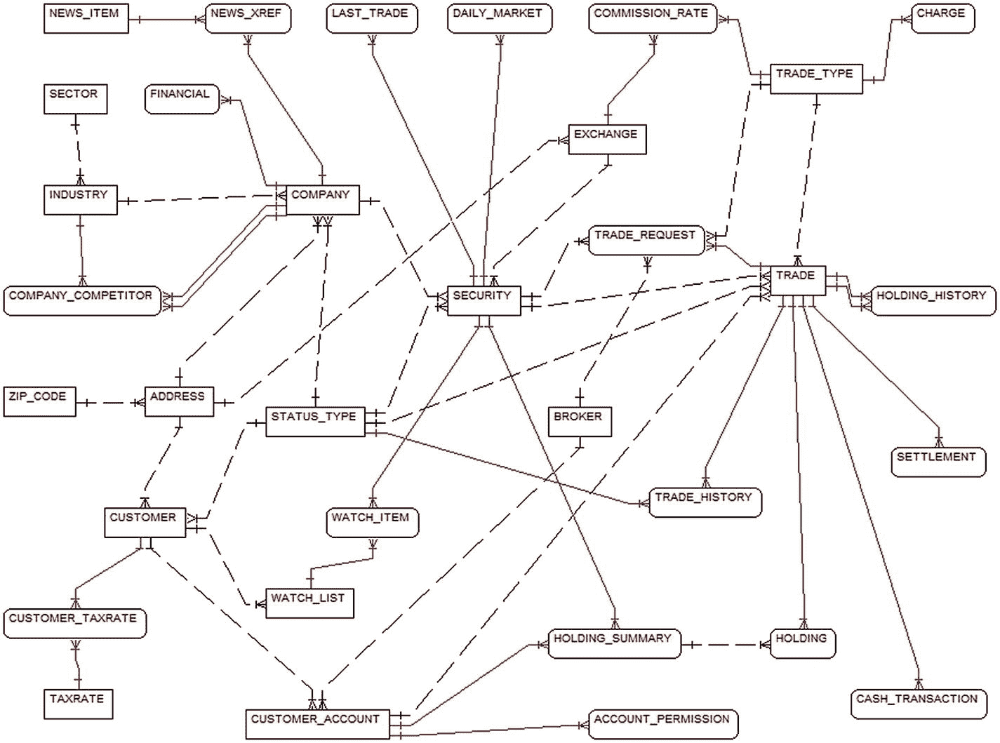

图 2-3：TPC-E 数据模型

详细检查图 2-3 中的每个表并不重要。重要的是要注意，它看起来更像一个真实世界的数据模型，而不仅仅是某个学术练习的模型。与表很少且关系是简单父子性质的 TPC-C 不同，TPC-E 有很多表，关系也很复杂。事实上，如下面表 2-1 所示，这两个基准之间有几个重要的区别。

表 2-1：TPC-C 与 TPC-E 对比

| 特性 | TPC-C | TPC-E |
| --- | --- | --- |
| 业务类型 | 批发分销商 | 经纪公司 |
| 总表数 | 9 | 33 |
| 总列数 | 92 | 188 |
| 每表列数范围 | 3 – 21 | 2 - 24 |
| 平均每表列数 | 10.2 | 5.7 |
| 只读事务数 | 2 | 6 |
| 只读事务百分比 | 8% | 76.9% |
| 读写事务数 | 3 | 4 |
| 读写事务百分比 | 92% | 23.1% |
| 数据生成方式 | 随机 | 普查数据 |
| 检查约束数 | 0 | 22 |
| 引用完整性 | 否 | 是 |


### 数据库基准测试：TPC-E 与 TPC-H

#### TPC-E

从表 **2-1** 中可以注意到四个关键差异。首先，`TPC-E` 的表总数是 `TPC-C` 的 3.67 倍。因此它看起来更贴近现实。其次，读写比率更接近常规情况，即大多数活动是密集读取后伴随一些写入。第三，数据基于 2000 年的人口普查数据，而不是在定义范围内简单生成的随机值。第四也是最后一点，数据库设计强制实施了当今大多数 `OLTP` 应用程序默认会做的引用完整性（事实上，很少有关系数据库专业人员会构建一个不强制外键的 `OLTP` 数据库）。因此，虽然 `TPC-E` 可能更难理解，但它值得付出努力，因为它比旧的 `TPC-C` 基准更逼真。然而，`TPC-C` 仍然是最常被引用的。

数据库设计的另一个方面是，允许哪些高级物理数据库选项或模式对象定义修改？`TPC-E` 规范对可以做什么和不可以做什么有相当明确的规定。以下是允许的：

*   表数据行聚簇
*   用于主键约束的唯一索引
*   用于外键约束的非唯一索引
*   水平表分区
*   垂直表分区
*   表复制

请注意，`TPC-E` 允许两个 `TPC-C` 所没有的项目：表数据行聚簇和外键索引。这再次促成了数据库应用程序更逼真的普遍感觉。因此，当您正在寻找一个逼真的 `OLTP` 类型数据库基准时，`TPC-E` 是一个非常好的选择。虽然没有哪个基准是完美的，或者能 100% 准确地模仿您的 `OLTP` 应用程序，但 `TPC-E` 提供了一个非常合理的仿真版本。

#### TPC-H

`TPC-H` 是我最喜欢的数据库基准之一。事实上，我运行 `TPC-H` 基准的次数可能比任何其他基准都多。许多其他人也经常使用和引用这个数据库基准。虽然不如 `TPC-C` 那么流行，但它可能是第二常被引用的数据库基准。在过去的十年左右，随着数据仓库和商业智能（`BI`）话题的热度，`TPC-H` 蓬勃发展。而现在，随着数据挖掘和数据分析的兴起，`TPC-H` 仍然吸引了大量关注。

像往常一样，让我们首先从 [tpc.org](http://tpc.org) 网站和 `TPC-H` 规范中检查 `TPC-H` 数据库基准的定义：

*   网站：`TPC-H` 是一个决策支持基准，由一套面向业务的即席查询组成。它展示了决策支持系统，这些系统检查大量数据，执行高度复杂的查询，并回答关键的业务问题。
*   `TPC-H` 规范：`TPC-H` 由一组具有现实业务背景的查询组成，旨在以代表复杂业务分析应用程序的方式测试数据库系统功能。

这一次，网站和规范定义都提供了足够的信息来了解基准的基本要点。然而，这里有一个更全面、因此更有用的定义：

> *`TPC-H` 是一组 22 个非常复杂的 `SQL` 查询，典型于支持 `OLTP` 系统的报表数据库。这些查询旨在模仿最终用户通过商业智能工具提交的即席数据分析查询，以回答关键的业务问题。*

请注意它**没有**说明的是：`TPC-H` 不是一个星型模式设计的数据仓库（那是接下来要介绍的 `TPC-DS`）。当您检查图 **2-4** 中显示的 `TPC-H` 数据模型时，您会看到它实际上是另一个简单化的数据库设计，很像 `TPC-C`。

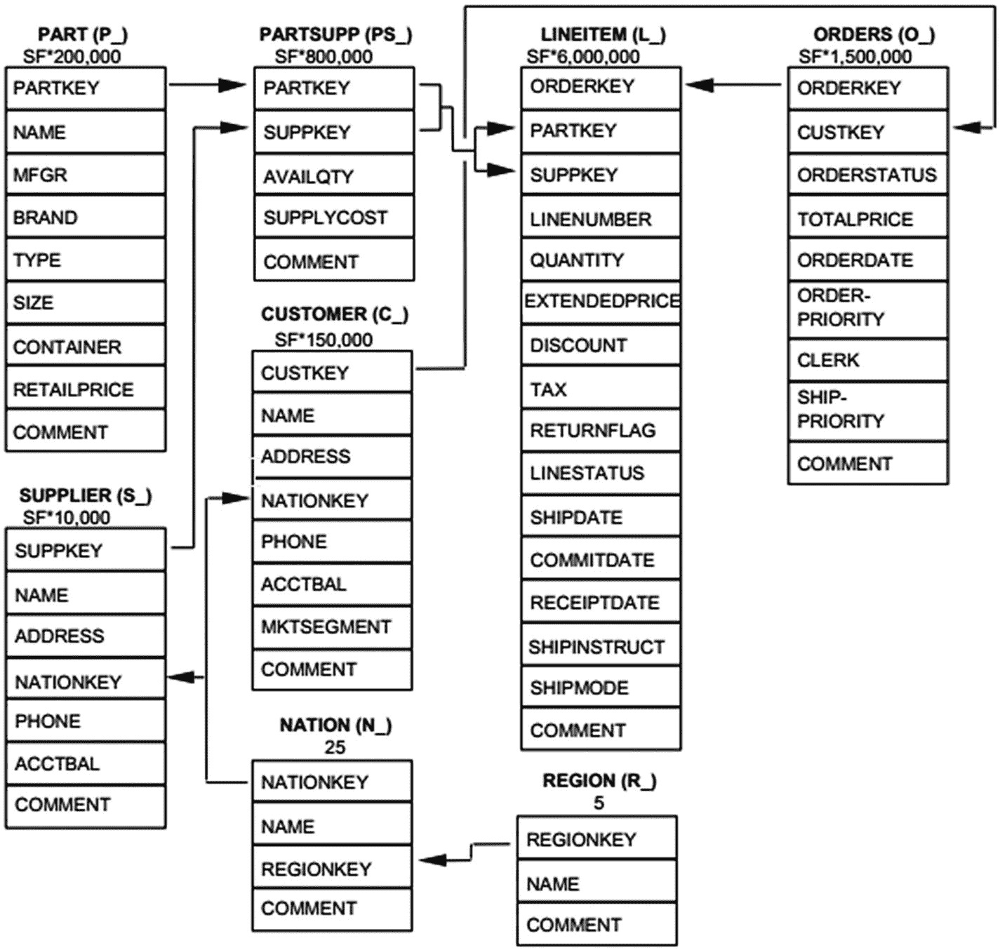

图 2-4 TPC-H 数据模型

如果您仔细观察图 **2-4**，您会看到每个表都有一定数量的行，这取决于比例因子。因此，`LINEITEM` 表每个比例因子有 600 万行。那么，当您运行 `TPC-H` 基准时，应该选择什么比例因子呢？规范并没有真正说明，也不应该说明，因为它旨在描述基准设计要求。然而，在那些经常运行 `TPC-H` 基准的人中，普遍共识是如下选择：小 = `300`；中 = `3,000`；大 = `30,000`；巨大 = `300,000`。虽然不完全准确，但您可以估算每个比例因子大约 `1GB`。因此，您可以指望的大致数据库大小估算是：小 = `300GB`；中 = `3TB`；大 = `300TB`；巨大 = `3PB`。请记住，根据定义，`TPC-H` 执行的是扫描大量数据的 22 个复杂查询，因此这个数据库基准高度依赖于 `IO` 子系统的性能。如果您想在传统的旋转磁盘上执行中等规模或更大的 `TPC-H`，那么您应该拥有超过 `100` 个磁盘轴。`TPC-H` 确实要求被扫描的数据存储在并分布在许多磁盘上。当然，新的 `IO` 技术，如固态硬盘（`SSD`）、全闪存磁盘阵列、`PCIe` 闪存磁盘和非易失性内存快速通道（`NVMe`），提供了更高的 `IO` 能力和更低的延迟，因此（目前）还没有关于如何最好地将大量 `TPC-H` 数据分布在它们之上的金科玉律。

数据库设计的另一个方面是，允许哪些高级物理数据库选项或模式对象定义修改？`TPC-H` 规范对可以做什么和不可以做什么有相当明确的规定。以下是允许的：

*   表数据行聚簇
*   用于主键约束的唯一索引
*   用于外键约束的非唯一索引


*   水平表分区（包括多级分区）
*   辅助数据结构（存在一些限制）

请注意，TPC-H 仅允许水平分区，不允许垂直分区。此外，TPC-H 也不允许数据复制。然而，允许使用辅助数据结构这一点是最独特且强大的特性。因此，常见的数据库管理员（DBA）查询优化技术，例如创建一个完全满足查询的索引，是被允许的。此外，像物化视图（即自动化的聚合表）这样的高级技术也被允许，并且可以显著提升性能。但请注意，目前没有数据库基准测试工具能自动或通过选项来利用这些特性。因此，需要由您作为 DBA 手动将它们添加到测试中。这种额外的努力通常是完全值得的。

最后，为了更全面地理解 TPC-H，您真的需要查阅其规范并仔细研究所有 22 个复杂的查询。它们都是为了刻意给数据库内部的 SQL 优化器和执行引擎的各个方面施加压力而设计的。列表 2-1 展示了 TPC-H 中一个最不复杂且易于阅读的查询，即潜在零件促销查询（Q20）。根据 TPC-H 规范，此查询用于识别特定国家/地区中，拥有可能是促销活动候选零件的供应商。

```
SELECT   s_name, s_address
FROM h_supplier, h_nation
WHERE s_suppkey IN (
SELECT ps_suppkey
FROM h_partsupp
WHERE ps_partkey IN (SELECT p_partkey
FROM h_part
WHERE p_name LIKE 'dark%')
AND ps_availqty >
(SELECT 0.5 * SUM (l_quantity)
FROM h_lineitem
WHERE l_partkey = ps_partkey
AND l_suppkey = ps_suppkey
AND l_shipdate >=
TO_DATE ('1997-01-01', 'YYYY-MM-DD')
AND l_shipdate <
ADD_MONTHS (TO_DATE ('1997-01-01',
'YYYY-MM-DD'
),

)))
AND s_nationkey = n_nationkey
AND n_name = 'MOROCCO'
ORDER BY s_name
```
列表 2-1
TPC-H 查询 #20

这 22 个 TPC-H 查询的复杂性在预期的使用方面产生了一个非常有趣的副作用。我发现这 22 个查询非常适合比较数据库在大版本发布或小补丁更新后的相对性能提升或下降。我也发现它们同样适用于比较一个数据库供应商的 SQL 优化器和引擎与另一个的差异。这就是为什么 TPC-H 是我经常使用的最喜欢的基准测试之一的真实原因。

##### TPC-DS

最新且较为流行的数据库基准测试是 TPC-DS，它只存在了两年多一点（2015 年 8 月）。与 TPC-E 类似，TPC-DS 往往更受硬件和数据库供应商的青睐。一个值得注意的例外是 Jim Czuprynski, Deiby Gomez 和 Bert Scalzo 最近出版的书《*Oracle Database 12c Release 2 Testing Tools and Techniques for Performance and Scalability*》（Mc-Graw Hill Education, 2017）。在那本书中，作者广泛使用 TPC-DS 基准测试来展示性能优化和数据库可扩展性的宝贵技术。事实上，这本书简直充满了来自 TPC-DS 的示例查询和工作负载，并附有修改建议以及优化前后的结果。这是因为，与 TPC-H 类似，TPC-DS 可用于比较数据库在大版本发布或小补丁更新后的相对性能提升或下降，也可用于比较一个数据库与另一个。

让我们再次从[tpc.org](http://tpc.org)网站和 TPC-DS 规范开始，了解 TPC-DS 数据库基准测试的定义：

*   网站：TPC-DS 是一个决策支持基准测试，它模拟了决策支持系统的多个通用方面，包括查询和数据维护。它为通用决策支持系统的性能提供了具有代表性的评估。
*   TPC-DS 规范：与网站定义相同。

和之前一样，这两种定义都没有真正提供任何关于应用工作负载本质的有意义的洞见，只是说它模拟了决策支持系统的某些方面。这里有一个更详尽、也因此更有用的定义：

> *TPC-DS 模式专门设计用于模拟一个零售产品供应商的复杂数据仓库应用工作负载，该供应商为其客户提供通过三个主要销售渠道生成商品订单的能力：邮购目录、实体店和网站。该模式包含七个事实表和十七个维度，涵盖了从三个销售渠道中的任何一个处理退货的功能，以及库存跟踪功能。*

TPC-E 的设计非常复杂，而且它是一个真正的星型模式设计的数据仓库。七个主要的星型结构如图 2-5 至 2-11 所示。

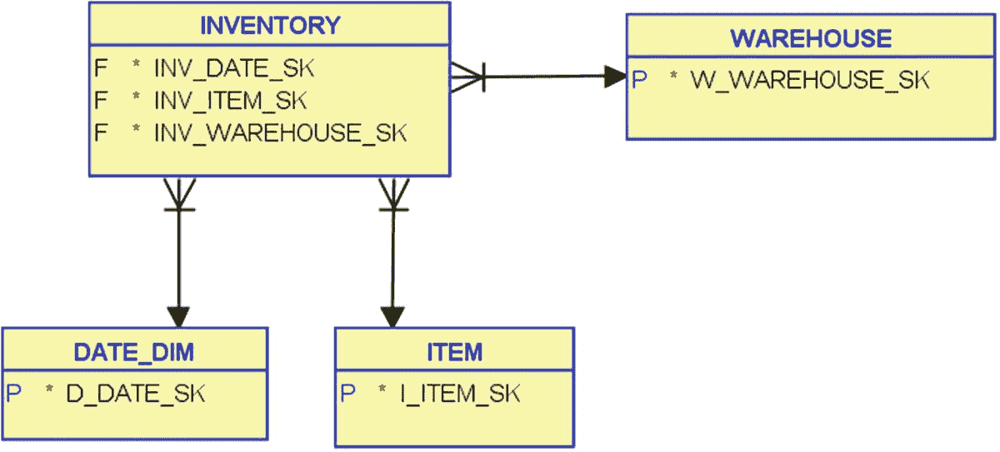

图 2-11

INVENTORY 的星型结构

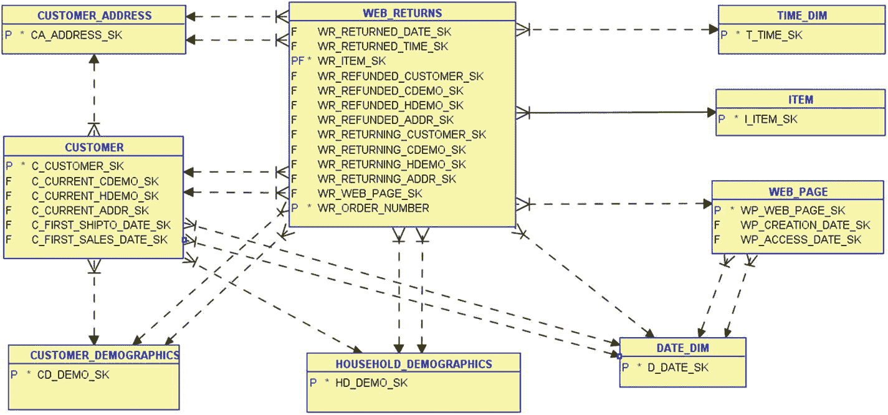

图 2-10

WEB_RETURNS 的星型结构

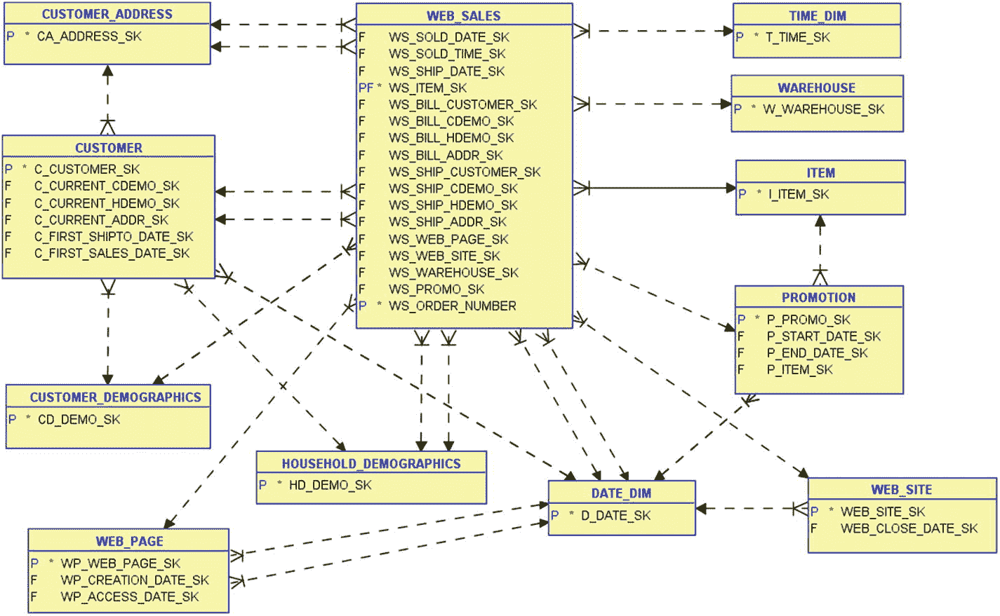

图 2-9

WEB_SALES 的星型结构

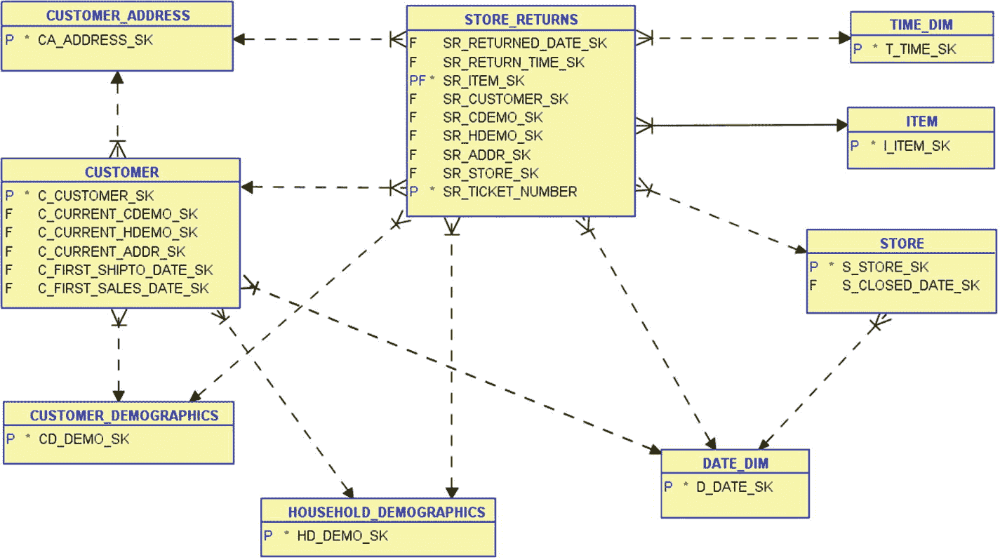

图 2-8

STORE_RETURNS 的星型结构

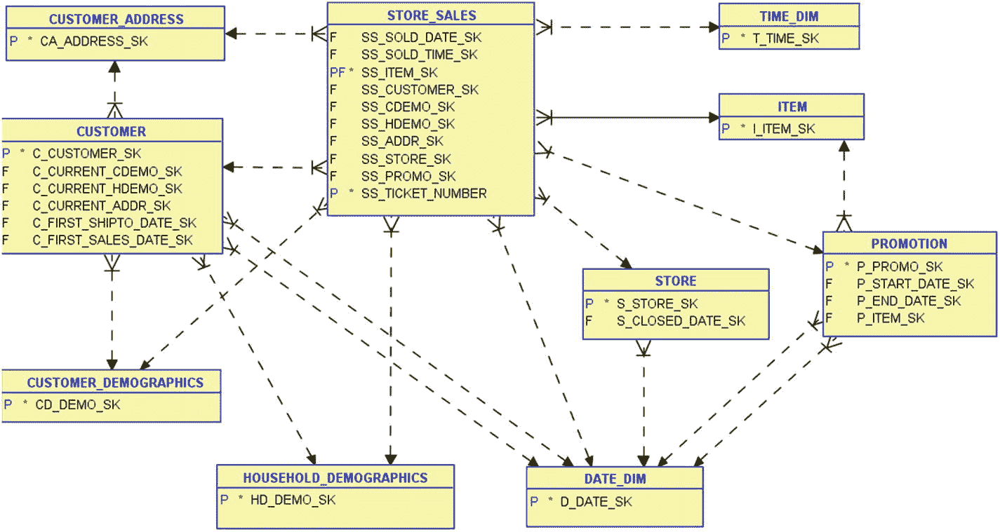

图 2-7

STORE_SALES 的星型结构

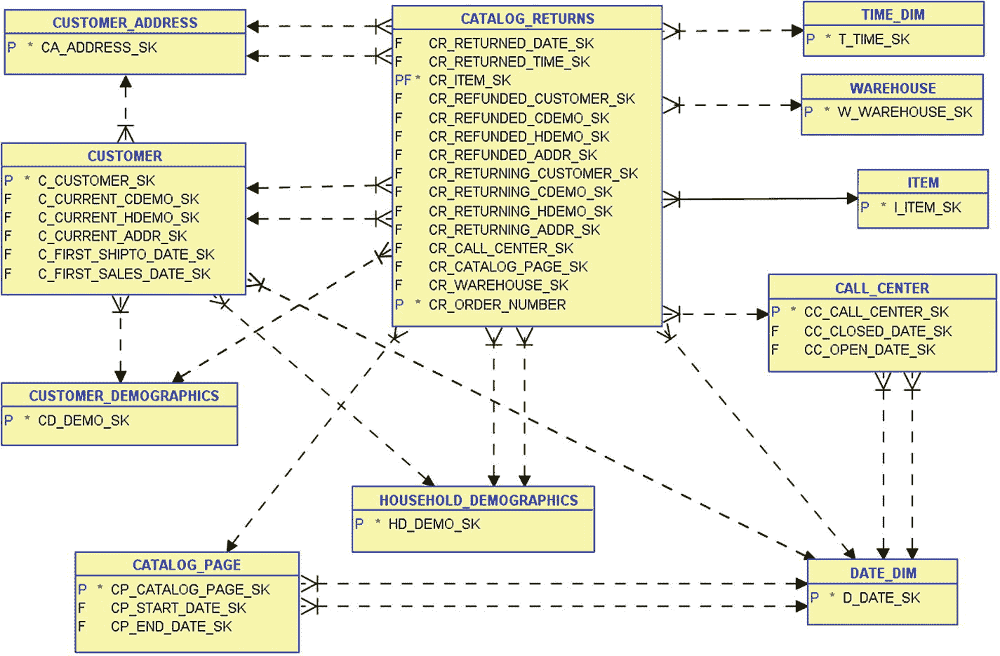

图 2-6

CATALOG_RETURNS 的星型结构

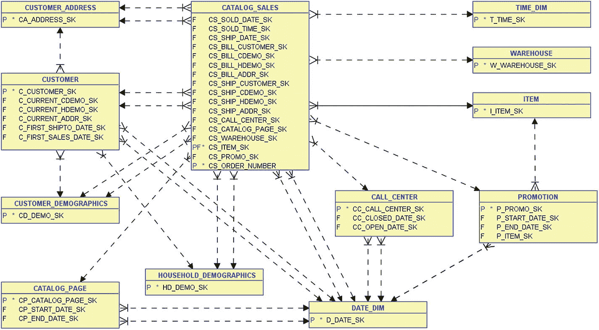

图 2-5

CATALOG_SALES 的星型结构

数据库设计的另一个方面是允许使用哪些高级物理数据库选项或模式对象定义修改？TPC-DS 规范对可以做什么和不可以做什么有相当明确的规定。以下是允许的：

*   表数据行聚簇
*   用于主键约束的唯一索引
*   用于外键约束的非唯一索引
*   水平表分区（包括多级分区）
*   垂直表分区
*   辅助数据结构（存在一些限制）
    *   显式创建——作为某个指令的直接结果而自动创建


*   **隐式** —— 并非因指令而创建。

请注意，`TPC-H` 仅允许水平分区，而不允许垂直分区。此外，`TPC-H` 也不允许数据复制。然而，其独特且强大的地方在于允许使用辅助数据结构。因此，常见的 `DBA` 查询优化技术（例如创建一个能完全满足查询需求的索引）是被允许的。此外，高级技术如物化视图（即自动化聚合表）也被允许使用，并能带来显著的性能提升。但请注意，目前没有任何数据库基准测试工具能自动或通过选项来利用这些功能。因此，需要由你作为 `DBA` 手动将这些添加到测试组合中。这种额外的努力通常是完全值得的。

为了更全面地理解 `TPC-DS`，你确实需要查阅其规范并研究所有 100 个复杂查询。`TPC-DS` 规范主要关注从可能海量的数据集中获取业务答案。从这个角度来看，`TPCDS` 基准测试最重要的部分是那近 100 个独立的查询，它们试图为这些特定的业务问题提供答案。每个 `TPC-DS` 查询都实现了不同程度的分析复杂性；有些查询会访问 10 个或更多的事实表和维度表，因此会根据为查询选择条件提供的值产生不同且复杂的执行计划。清单 2-2 展示了一个 `TPC-DS` 的查询，业务查询 6 (`Q6`)。根据 `TPC-DS` 规范，此查询列出了所有至少有 10 名客户的州，这些客户在给定月份购买了价格比同类商品平均价格至少高出 20% 的商品。

```
SELECT a.ca_state state, COUNT(*) cnt
FROM  tpcds.customer_address a ,
tpcds.customer c ,
tpcds.store_sales s ,
tpcds.date_dim d ,
tpcds.item i
WHERE a.ca_address_sk   = c.c_current_addr_sk
AND c.c_customer_sk   = s.ss_customer_sk
AND s.ss_sold_date_sk = d.d_date_sk
AND s.ss_item_sk      = i.i_item_sk
AND d.d_month_seq = (SELECT DISTINCT (d_month_seq)
FROM  tpcds.date_dim
WHERE d_year = 2001
AND d_moy    = 6)
AND i.i_current_price > 1.2 * (SELECT AVG(j.i_current_price)
FROM  tpcds.item j
WHERE j.i_category = i.i_category)
GROUP BY a.ca_state
HAVING COUNT(*) >= 10
ORDER BY cnt
```
清单 2-2
`TPC-DS` 查询 #6

请注意，目前只有一个数据库基准测试工具实现了 `TPC-DS` 基准测试。但鉴于当前市场对与数据分析相关的所有事物的热情，我预计其他工具在不久的将来也会跟进。然而，这个包含 7 个星型模式和 100 个复杂查询的基准测试在实现上提出了巨大的挑战。

### 注意

以下章节将对剩余的不太流行或已过时的数据库基准测试进行较简略的介绍。这并不一定意味着它们不够复杂或不值得，只是因为前述的数据库基准测试更为常见，因此读者更有可能会去执行它们。

## 较不流行的基准测试

### TPC-DI

回顾流行的数据库基准测试，我们有针对 `OLTP`、通用报表和星型模式数据仓库的测试。那么缺少的是什么？是通过批处理作业将数据加载到报表系统和数据仓库中！事实上，多年来，被加载和保留的数据量急剧增长。其规模之大，使得“提取、转换和加载” (`ETL`) 这一术语已被更全面的“数据集成” (`DI`) 所取代。因此，`TPC-DI` 基准测试应运而生，以满足这一特殊而重要的细分需求。`TPC-DI` 系统架构的概念模型如图 2-12 所示。


图 2-12
`TPC-DS` 系统概念模型

这个图应该不会让任何人感到意外，因为这是创建数据仓库时展示的典型架构图。有些人可能会跳过暂存区概念，直接加载到数据仓库中，这就是为什么暂存区用虚线框表示（即可选）。目标数据仓库设计是一个传统的维度模型，通常称为星型模式。这种方法在 2002 年 Ralph Kimball 的著作《`The Data Warehouse Toolkit`》（Wiley）中得到了最佳描述。然而，Ralph 实际上在早年 `Redbrick`（一家早期进入数据仓库数据库供应商领域的公司）时就首次提出了这样的设计。我实际上在 1995 年左右见过 Ralph，当时他正在做现场研讨会。他教了我星型模式，我教了他数据建模（我当时在 `Erwin` 数据建模工具的制造商 `Logic Works` 工作）。基于我在 1995 年学到并在之后八年多实践中运用的知识，我也在 2003 年写了一本书，名为《`Oracle DBA Guide to Data Warehousing and Star Schemas`》（Prentice Hall）。尽管那本书距今已有 15 年，但其所倡导的技术至今仍然适用。

`TPC-DI` 数据仓库的基本概念数据模型如图 2-13 所示。


图 2-13
`TPC-DS` 概念数据模型

对于数据仓库的新手，这里出现了两个不同的术语。维度表是较小的、反规范化的表，包含最终用户查询的业务描述性列。这些表通常会被完全索引以最好地支持即席查询。事实表是非常大的表，其主键由所有相关维度表的外键列连接而成，并包含可用于最终用户查询期间计算的、可数字加总的非关键列。

### TPC-VMS

随着过去十年虚拟化的热潮，数据库——即使是大型、任务关键的数据库——最终在 `Hypervisor`（例如 `VMware`）上作为虚拟机 (`VM`) 运行已成必然趋势。`SQL Server` 数据库管理员和开源数据库的用户欣然接受了这一转变。在 `Oracle` 等一些数据库平台上，数据库管理员起初是抗拒的，后来也缓慢地全面采用。然而，随着时间的推移以及现在数据库上云，几乎没有数据库管理员会对将其数据库放在 `VM` 上有任何保留意见。这导致了对一种可靠的、用于虚拟机环境的数据库基准测试的需求。请记住，服务器上的一个 `Hypervisor` 可能同时运行许多 `VM`，因此还必须处理数据库整合不同类型数据库的特殊考虑。

`TPC-VMS` 于 2012 年推出，旨在满足这一特殊需求。`TPC-VM` 基准测试利用了前一节中流行的基准测试（即 `TPC-C`、`TPC-E`、`TPC-H` 和 `TPC-DS`）。然而，`TPC-VM` 认为其每个测试的版本都是独特的，因此它们彼此之间不可比较，与它们所派生的基准测试也不可比较。当你实例化一个 `TPC-VM` 基准测试时，你会选择上述四个基准测试中的一个，然后运行三个 `VM`，每个 `VM` 都运行所选基准测试下相同规模的数据库。结果的计算方式也有所不同。但由于它并不非常流行，我们将省略这些细节。它们在规范中有完整定义。

我唯一的缺点是，我宁愿让 `TPC-VMS` 运行四个基准测试中的三个甚至全部四个，以便可以测试不同的工作负载。也许这将在未来的规范更新中得到解决，或者甚至可能出现一个全新的基准测试（因为评分方式可能不得不有所不同）。


### 威斯康星基准

威斯康星基准测试是业界最古老的数据库基准测试之一。它大约诞生于 1981 年，正值基于 SQL 的新关系数据库兴起之际。我将威斯康星基准纳入本书，是因为它具有重大的历史相关性。它源于一个计算机性能孱弱、磁盘空间成本高昂、关系数据库刚刚崭露头角的时代。因此，威斯康星基准的模式仅有三张表：一张仅含 1,000 行，另外两张各含 10,000 行。整个数据库的大小仅为 5 兆字节。此外，它总共包含 32 条 SQL 命令（26 次插入、2 次更新、2 次删除和 2 次选择）。在 SQL 数据库新技术初现、计算机资源有限的早期，这个测试或许相当合理。但以今天的计算标准来看，它作为测试基准实在太薄弱了，无法用于任何有意义的评估。然而，作为最早的数据库基准测试之一，也是后来那些基准的前身，它至少值得我们了解。

### AS³AP 基准

ANSI SQL 标准可扩展且可移植基准是另一项相当古老的业界标准数据库基准。它大约诞生于 1984 年，在很多方面都是威斯康星基准的扩展。我将其纳入本书，是因为你仍然能找到对它的引用，并且其中一款数据库基准测试工具仍然提供它。AS³AP 的模式仅有五张表：一张有 1 列 1 行，另外四张表的行数根据缩放因子从 10,000 行到十亿行不等。因此，其总数据库大小从 4 兆字节到 400 千兆字节不等（再次强调，以今天的标准看非常小）。你需要选择能在 12 小时或更短时间内完成基准测试的最大缩放因子（目标是尽可能接近 12 小时）。该基准包括单用户和多用户工作负载，并包含了创建、加载和索引数据库的所有时间。此基准要求的唯一度量指标是在 12 小时窗口限制内的总查询耗时。

## 已过时的基准测试

### TPC-A 基准

TPC-A 基准是源自[tpc.org](http://tpc.org)工作的第一个官方基准。它是第一代联机事务处理数据库基准，力求模拟典型银行的交易工作负载，并侧重于更新（由于工作负载存在偏向且被人为地保持简单，TPC-A 并不代表一个真正的 OLTP 基准）。TPC-A 仅有四张表：账户、分行、出纳员和历史，如图 2-14 所示。每个分行有 10 个出纳员、10 个终端和 100,000 个账户。它起源于 1989 年，并在 1995 年被视为已过时。

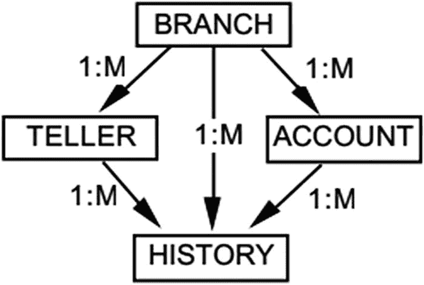

图 2-14: TPC-A 数据模型

### TPC-B 基准

TPC-B 基准实际上是一个数据库压力测试（这些术语的区别在第 1 章中已阐述）。它专门设计用于对数据库系统的核心部分（如 IO 带宽和处理时间）进行压力测试。它本质上就是 TPC-A，拥有与图 2-14 所示相同的简单表结构，但采用了截然不同且人为设计的工作负载。TPC-B 使用单一、简单、更新密集型的交易来对数据库施加压力。它通过产生大量的小型读写任务来对内存和磁盘 I/O 子系统进行压力测试。它起源于 1990 年，并在 1995 年被视为已过时。

### TPC-D 基准

TPC-D 基准是第一个面向数据仓库类工作负载的基准。在许多方面，它是 TPC-H 基准的前身（甚至拥有相同的数据库设计——请回顾图 2-4）。主要区别在于它只有 17 个查询，而不是 22 个。它起源于 1989 年，并在 1999 年被视为已过时。

### TPC-R 基准

TPC-R 基准是 TPC-H 基准的一个无限制版本（相同的 22 个查询和相同的数据库设计——请回顾图 2-4）。主要区别在于它允许无限制的索引和分区，以便让人们能更充分地利用数据库功能。它起源于 1999 年，并在 2005 年被视为已过时。

### TPC-W 基准

可以说，TPC-W 基准甚至算不上一个真正的数据库基准，而是一个包含数据库的 Web 应用程序基准。事实上，该规范甚至允许将数据库替换为你喜欢的任何数据存储，甚至包括文件系统解决方案。其工作负载本质是一个模拟面向商业的交易型 Web 服务器活动的互联网商务环境。它起源于 2003 年，并在 2005 年被视为已过时。如图 2-15 所示，在此提及它仅为了完整性。

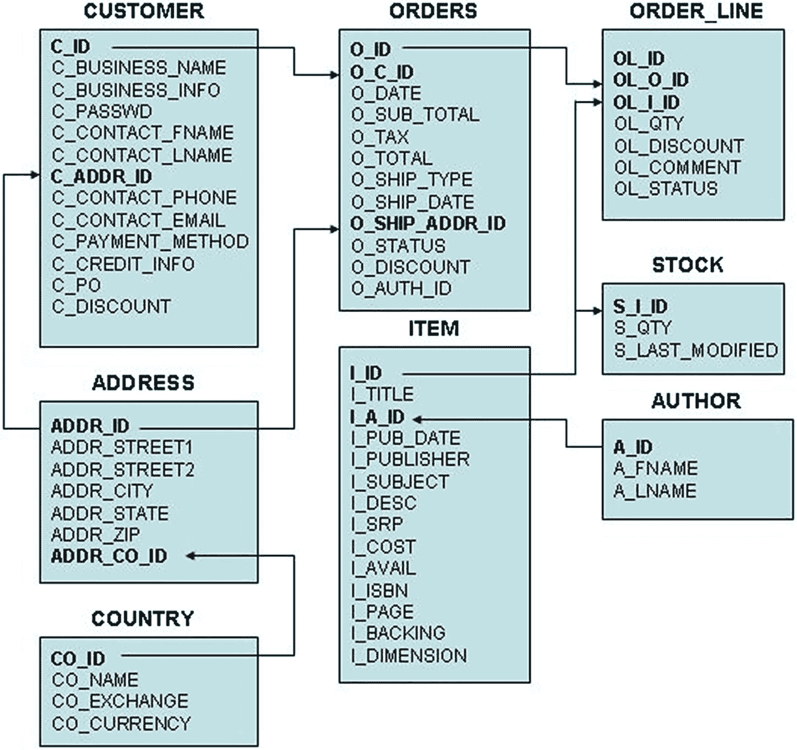

图 2-15: TPC-W 数据模型

