# 3. 基准测试工具

在第 1 章中，我们区分了数据库基准测试、数据库压力测试以及工作负载捕获/重放。接着在第 2 章，我们涵盖了所有相关的数据库基准测试，包括当前和过去的（即已淘汰的）。这很像一个青少年学习驾驶汽车，你现在已经学习了交通规则并通过了笔试，获得了学习驾驶许可证。现在是时候运用这些知识，进行一些实际驾驶了（远在参加最终路考之前）。为此，这位既紧张又兴奋的青少年需要一辆车和一位坐在副驾驶的合法驾驶员（注意还有其他限制，例如不能载其他青少年，不能在夜间驾驶）。类似地，对于数据库基准测试，你需要一些工具，在获得足够经验之前，你需要在限制条件下进行一些测试驾驶，然后才能真刀真枪地干。因此，在第 3 章，我们将介绍一些可用的数据库基准测试工具以及如何最好地使用它们。此外，我们还将介绍一些你可能认为是基准测试工具，但更符合数据库压力测试或工作负载捕获/重放工具类别的其他工具。

汽车驾驶的例子也适用于描述各种数据库基准测试工具的实际使用复杂程度。有些车是自动挡，而另一些是手动挡。大多数人会同意自动挡更容易驾驶，但由一个经验丰富的司机驾驶手动挡应该能获得更好的油耗。同样，我们基本上都偏爱有动力转向和刹车的汽车，因为这些功能确实让驾驶变得轻松得多。当前的数据库基准测试工具也是如此；有些自动化程度高，因此易于使用，而另一些则更困难，但可能提供更大的灵活性。因此，需要根据要使用的工具类型进行适当的准备。此外，就像汽车一样，你应该能够使用任何一种类型到达你的目的地。当然，你的油耗和经验可能会有所不同。

最后，请注意，虽然本章旨在为你提供所有必备的基础知识以及一些有用的技巧和窍门，但合乎逻辑的是，要成为一名能够合理测试高级场景以获得可靠且**可重复**结果的专家，需要时间和毅力。请注意，`可重复`是最难也是最重要的目标。一辆车能跑一次 125 英里/小时，并不意味着它能轻易重复这一壮举。在此过程中有许多变量在起作用。结果必须与所有变量相关联，并且条件必须能在某个合理的接近范围内重复。否则，就只是一个非常幸运的`一次性`结果，几乎没有价值。

## 存储基准测试

在研究数据库基准测试工具之前，我们必须首先认识到那些即使非常流行但也不被归类为真正数据库基准测试工具的工具。有时，数据库管理员（通常与存储管理员合作）会专注于每秒的 IO 速率或 IOPS。他们对磁盘驱动器读写数据的速度比数据库引擎本身更感兴趣。因此，他们不关心实际的数据库事务，而是关心原始的 IO 速率。例如，仅通过了解发动机的 RPM（每分钟转速）你无法真正知道一辆车能跑多快。同样，仅通过了解磁盘的 IOPS，你也无法了解实际的数据库性能特征。是的，磁盘的 IOPS 越快，数据库可能也越快，但仅凭 IOPS 你确实只能**猜测**数据库性能。虽然这是一个影响因素，但它不是唯一的因素，甚至在很多情况下不是最重要的因素。就像汽车一样，我们需要知道除 RPM 之外的其他因素，例如变速箱齿轮比和轮胎尺寸。尽管如此，即使这些工具只能提供真实数据库性能的最基本概念，它们仍然非常受欢迎。

### WINSAT

如果你的数据库运行在 Microsoft Windows 机器上，那么一个非常简单的内置 IO 测试工具是 `WINSAT` 命令。在我的 Windows 机器上，数据库数据文件位于 `D:` 盘，这是一个三星 SATA-III SSD；因此命令将是 `winsat disk –drive D`（注意：驱动器字母后不要加冒号）。图 3-1 显示了输出示例。

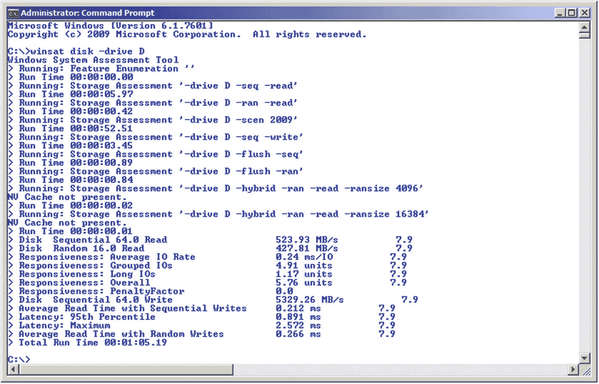

图 3-1

Windows `WINSAT` 实用程序

### HDPARM

如果你的数据库运行在 Linux 机器上，那么一个非常简单的内置 IO 测试工具是 `hdparm` 命令。在我的 Linux 机器上，数据库数据文件位于 `/disk2` 盘，这是一个三星的传统 SATA-III 磁盘；因此命令将是 `hdparm –x /dev/sdb1`。图 3-2 显示了输出示例。

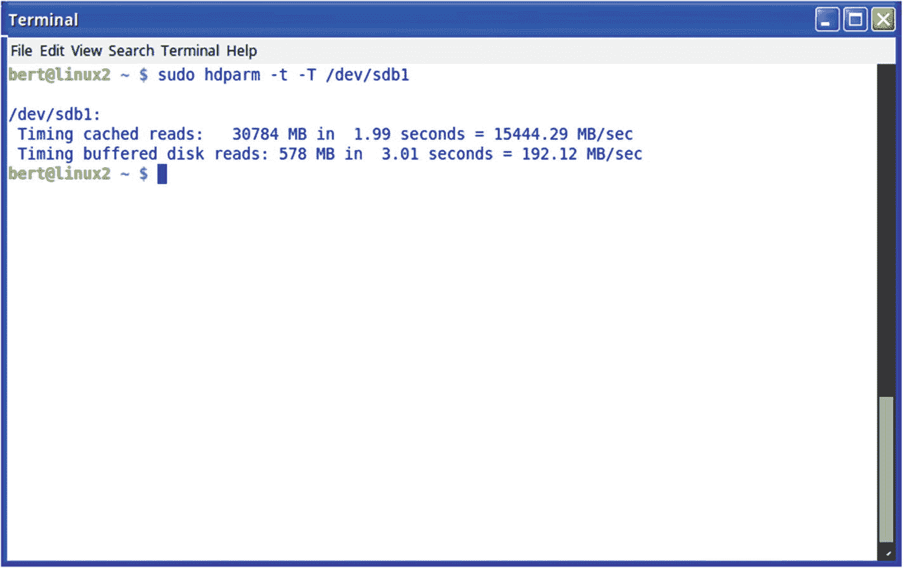

图 3-2

Linux `HDPARM` 实用程序

### SQLIO

如果你的数据库运行在 Microsoft Windows 机器上，那么一个已过时但仍流行的 IO 测试工具是 `SQLIO` 实用程序。虽然它已不再在 Microsoft 网站上提供，但许多免费软件网站仍然可以找到它。在我的 Windows 机器上，数据库数据文件位于 `D:` 盘，这是一个三星 SATA-III SSD；因此命令将是 `sqlio –dD`（注意：驱动器字母后不要加冒号）。图 3-3 显示了输出示例。

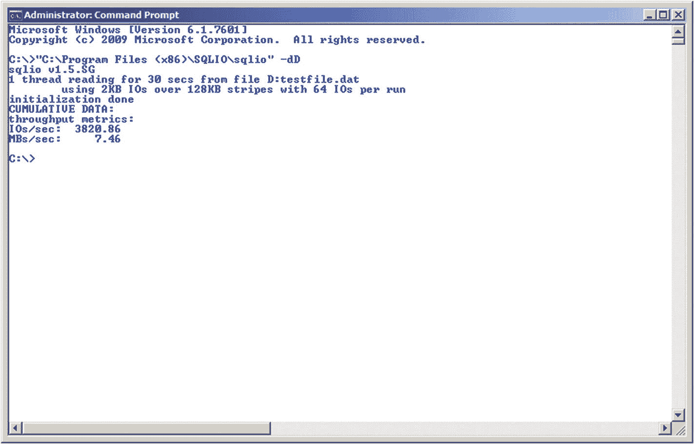

图 3-3

Microsoft `SQLIO` 实用程序

### DISKSPD

如果你的数据库运行在 Microsoft Windows 机器上，那么当前流行的 IO 测试工具是 `DISKSPD` 实用程序。你可以从 Microsoft 网站 [`https://aka.ms/diskspd`](https://aka.ms/diskspd) 获取它。在我的 Windows 机器上，数据库数据文件位于 `D:` 盘，这是一个三星 SATA-III SSD；因此命令将是 `diskspd d:`。图 3-4 显示了输出示例。

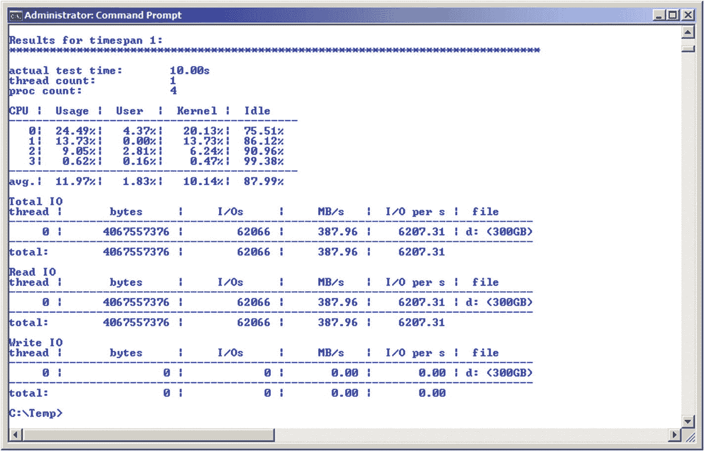

图 3-4

Microsoft `DISKSPD` 实用程序

## 数据库模拟

数据库模拟的概念相当简单；数据库供应商知道其数据库引擎通常会产生什么样的 IO 模式，因此他们可以提供工具来模拟这些 IO 模式进行测试，而无需实际创建和基准测试数据库。虽然这类产品不是真正的基准测试工具，但对于一些想要在 IO 层面（通常是着眼于 IOPS）检查更低层性能的数据库管理员来说，它们仍然提供了有价值的见解。

### SQLIOSTRESS

如果你的数据库是 Microsoft SQL Server，那么一个已过时但仍被铭记的数据库模拟工具是 `SQLIOSTRESS` 实用程序。它已不再在 Microsoft 网站上提供，我也无法在任何免费软件网站上找到它。我在这里提及它只是为了完整性，因为它已被 `SQLIOSIM` 取代。


### SQLIOSIM

如果您的数据库是 Microsoft SQL Server，那么当前的数据库模拟工具是 SQLIOSIM 实用程序。您可以通过网络搜索获取 Microsoft 网站 URL 以下载当前版本。还需注意，SQLIOSIM 甚至不需要安装 SQL Server，因为它完全模拟了 SQL Server 会向 I/O 子系统请求的 I/O 命令。SQLIOSIM 是一个非常强大的工具，但其选项过多，无法在此详述。对于最简单的部署，只需将下载的文件解压缩到一个目录中。同时，也解压缩包含在该主 zip 文件中的配置文件。然后将默认配置文件 `sqliosim.default.cfg.ini` 复制为 `sqliosim.cfg.ini`。最后，编辑该复制的文件，在接近底部的位置取消注释两个 FILE 部分，以指定要模拟的设备上的 SQL Server 数据和日志文件。现在，您已准备好开始。您可以通过运行 `sqliosim.com` 在命令行中运行此实用程序，并通过运行 `sqliosim.exe` 在图形模式下运行，如图 3-5 所示。此实用程序运行需要相当长的时间（除非您减少配置文件中的 `TestCycleDuration` 值），日志文件包含有关结果的详细 HTML 报告。

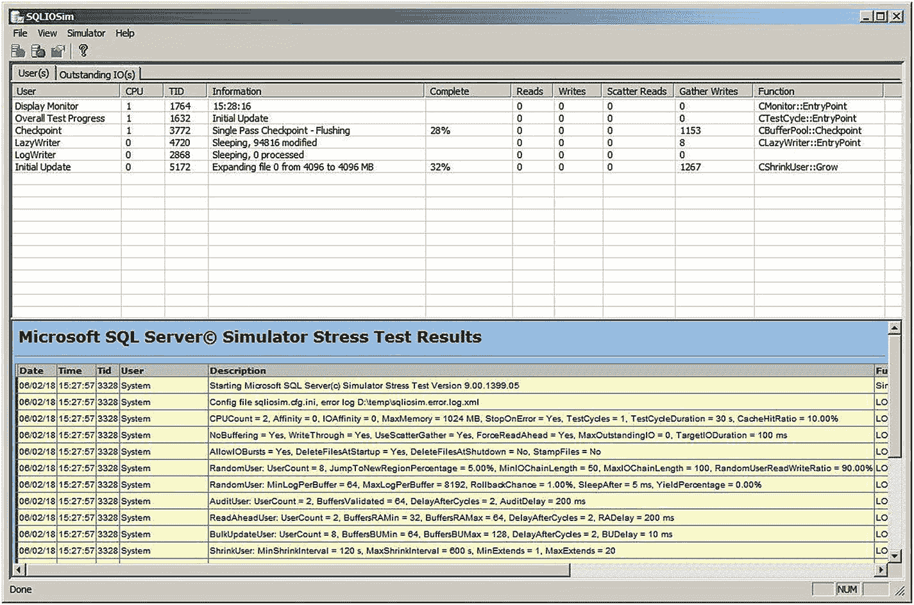

图 3-5

在图形模式下运行 SQLIOSIM

### Orion

如果您的数据库是 Oracle，那么一个众所周知的数据库模拟工具是 ORION 实用程序（ORION 代表 ORacle IO Numbers）。它位于数据库和/或网格的 `$ORACLE_HOME/bin` 目录中。虽然它位于 Oracle 安装目录中，但它实际上并不需要 Oracle 数据库的存在。Orion 是一个非常强大且功能齐全的工具，因此建议在进行任何详细测试之前阅读 Orion 手册，但对于本书，我们可以看一个简单的例子。在我的 Windows 机器上，我的数据库数据文件位于 D: 盘上，这是一个三星 SATA-III SSD；因此命令将是 `$ORACLE_HOME\orion -run normal -testname d_drive`，其中测试名参数指定了带有 `.lun` 后缀的文本文件，该文件只是要测试的 LUN 或磁盘驱动器的列表。在 Linux 上，文件内容形式为 `/dev/sdb1`，而在 Windows 上则为 `\\.\D:`。图 3-6 显示了输出的示例。注意达到的两个关键值：514 MBS 和 10,472 IOPS。

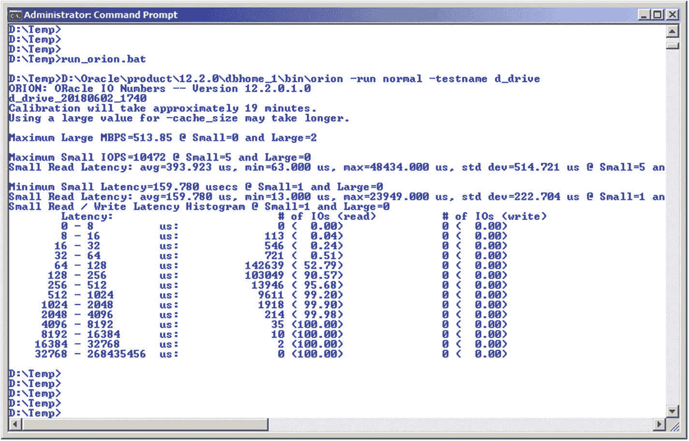

图 3-6

运行 Oracle ORION

Orion 还将创建一系列文本 `.TXT` 和电子表格 `.CSV` 文件，您可以使用后者来绘制详细的结果数据。文件名将采用以下形式：

*   `test_name_date_time_summary.txt`
*   `test_name_date_time_iops.csv`
*   `test_name_date_time_mbps.csv`
*   `test_name_date_time_lat.csv`
*   `test_name_date_time_trace.txt`
*   `test_name_date_time_hist.txt`

### 注意

Orion 输出的 CSV 文件可以非常容易地导入 Microsoft Excel 电子表格中作为图表。

### Calibrate IO

如果您的数据库是 Oracle，那么一个非常流行的数据库模拟工具是 `CALIBRATE_IO` 实用程序。根据 Oracle 数据库性能调整指南：“此过程向数据库文件发出 I/O 密集型只读工作负载（由 1 MB 的随机 I/O 组成），以确定存储子系统可以维持的最大 IOPS 和 MBPS。”调用此实用程序的代码非常简单，如下所示。

*调用 Oracle 的 Calibrate IO 实用程序*

```sql
SET SERVEROUTPUT ON
DECLARE
lat  INTEGER;
iops INTEGER;
mbps INTEGER;
BEGIN
-- DBMS_RESOURCE_MANAGER.CALIBRATE_IO (physical disks,
max latency, iops, mbps, lat);
DBMS_RESOURCE_MANAGER.CALIBRATE_IO (1, 10,
iops, mbps, lat);
DBMS_OUTPUT.PUT_LINE ('max_iops = ' || iops);
DBMS_OUTPUT.PUT_LINE ('latency  = ' || lat);
dbms_output.put_line('max_mbps = ' || mbps);
end;
/
```

在我的 Windows 机器上，我的数据库数据文件位于 D: 盘上，这是一个三星 SATA-III SSD；因此我调用 `CALIBRATE_IO` 实用程序时，第一个参数设置为一个磁盘，第二个参数设置为最大延迟 10 毫秒。显然，您的数据库服务器可能拥有更多的磁盘驱动器，并且随着 NVMe 闪存盘等新技术的出现，您的延迟也可能设置得更低。因此，您必须根据您的环境进行实验。我在笔记本电脑上运行了 `CALIBRATE_IO`，得到了如图 3-7 所示的结果。注意报告的数值：528 MBS 和 54,767 IOPS。

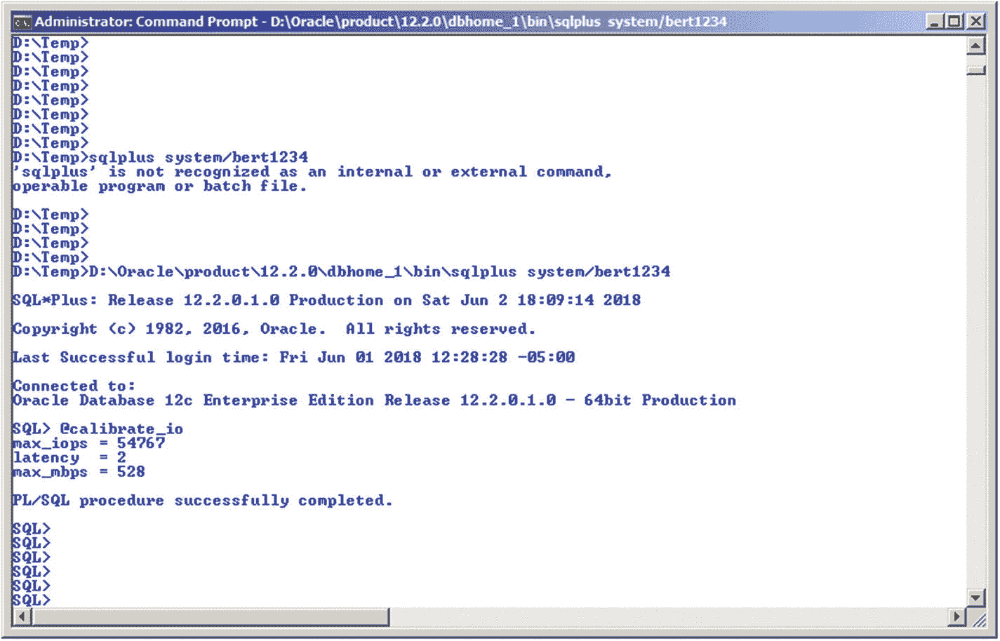

图 3-7

运行 Oracle CALIBRATE_IO

现在，我不想阻止任何人使用 `CALIBRATE_IO`（如果它适合您的特定情况）。但您会发现许多作者和博主都会列出此实用程序方法的诸多缺点。以下是我从网上找到的关于此实用程序的一些转述示例（我完全同意）：

*   `CALIBRATE_IO` 也许更好地被描述为集成在数据库内部的 Oracle ORION 工具的简化版本
*   `CALIBRATE_IO` 的最大 IOPS、最大 MBPS 和观察到的延迟值的结果并不总是准确的
*   `CALIBRATE_IO` 的结果既不可靠也不可重复
*   `CALIBRATE_IO` 执行使用异步 I/O 调用缓冲在进程堆中的单块随机读取，这与绝大多数被称为 `db file sequential read` 的单块随机 I/O（在 SGA 中缓冲且是同步 I/O）毫无共同之处
*   `CALIBRATE_IO` 和 Orion 都不访问从存储中读取的数据，它们真正做的只是执行 I/O 并让缓冲区中的数据保持不变

尽管如此，您会发现许多 DBA 依赖并引用此实用程序，仿佛这些数字在某种程度上是福音。因此，即使这个工具易于使用且输出简单，也不要陷入过度依赖像 `CALIBRATE_IO` 这样单一、用途有限的工具的陷阱。请记住，简单往往不等同于好。

## 数据库基准测试


### HammerDB

#### 简介与资源

在众多适用于多种数据库平台的知名且广受欢迎的数据库基准测试工具中，HammerDB 当属其一。它的前身是 HammerORA，当时还只是一个 Oracle 专属工具。多年来我一直使用这款工具，并认为对于那些希望快速执行并获取行业标准数据库基准测试结果的人来说，尤其是在那些仅偶尔进行此类测试、并非数据库基准测试专家的人看来，它堪称最优秀的数据库基准测试工具之一。尽管 HammerDB 的图形用户界面（GUI）需要一点时间来适应，但其工作流程足够简单，大多数人无需阅读文档即可完成。

HammerDB 是一款开源的数据库基准测试工具，支持 Oracle、SQL Server、DB2、TimesTen、MySQL、MariaDB、PostgreSQL、Greenplum、Postgres Plus Advanced Server、Redis、Amazon Aurora 和 Redshift，以及 Hadoop 上的 Trafodion SQL。你可以在以下网址分别找到 HammerDB 的网页、SourceForge 项目以及 Git 源代码版本控制仓库。

*   `http://www.hammerdb.com`
*   `https://sourceforge.net/projects/hammerora`
*   `https://sourceforge.net/p/hammerora/code/ci/master/tree/`

#### 安装与启动

HammerDB 提供适用于 32 位和 64 位平台的 Windows 和 Linux 版本。当前的 2.23 版本发布于 2017 年 6 月，按其历史上每年发布一到两次的惯例来看，是时候更新了。在 Windows 上运行安装程序时，它会将软件安装在 `C:\Program Files` 或 `C:\program Files (x86)` 目录下（具体取决于所安装版本的位数），这符合预期。然后要运行软件，只需双击 `hammerdb.bat` 文件。在 Linux 上运行安装程序时，它会安装在 `~/` 或 `$HOME` 目录下。然后要运行软件，只需双击 `hammerdb.tcl` 文件。当 HammerDB 软件启动时，它会显示如图 3-8 所示的屏幕。

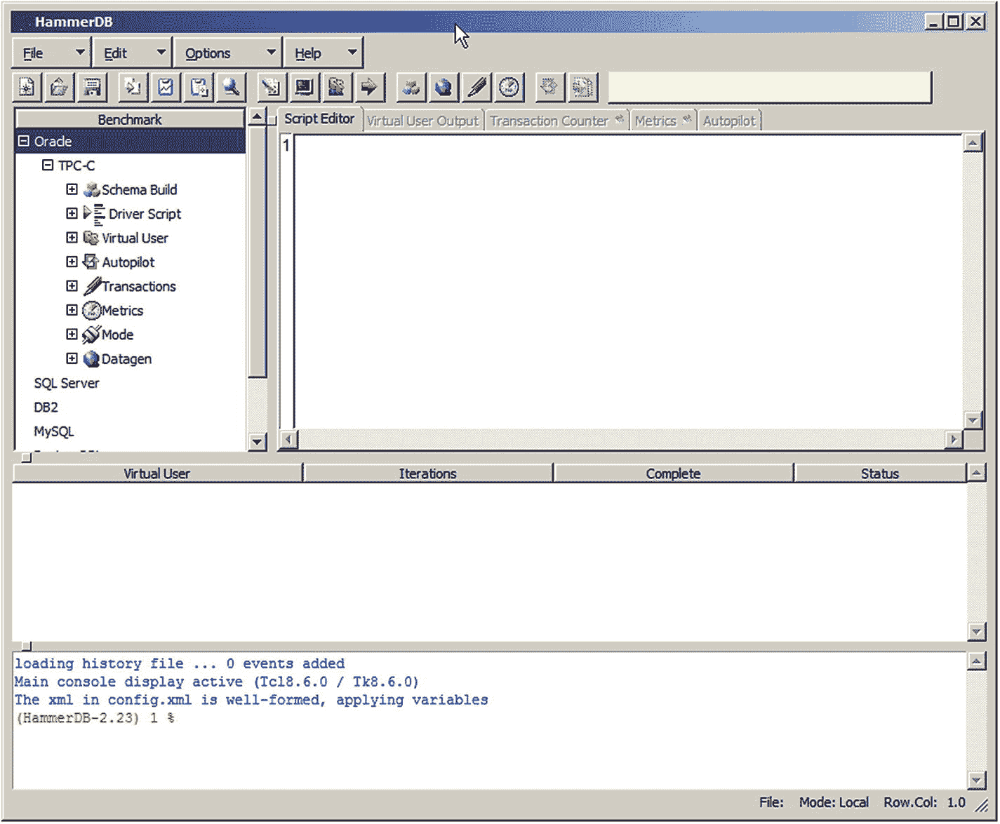
*图 3-8 HammerDB 程序启动*

默认情况下，HammerDB 假定你想针对 Oracle 数据库执行 TPC-C 基准测试。这些默认设置包含在 HammerDB 基础安装目录下一个名为 `config.xml` 的 XML 文件中。我们稍后会再讨论如何修改此配置文件，先让我们更好地了解可用的各种选项和设置。现在假设我们只是想改为对 SQL Server 数据库执行 TPC-H 基准测试。为此，我们只需选择主菜单 ➤ 选项，以打开如图 3-9 所示的弹出窗口。然后，我们只需选择 SQL Server 作为数据库，TPC-H 作为基准测试。还需注意，虽然 HammerDB 支持许多数据库平台，但它目前仅提供两种行业标准数据库基准测试：TPC-C 和 TPC-H。然而，其网站常见问题解答（FAQ）指出，TPC-E 已在其路线图上，并计划在未来版本中推出。

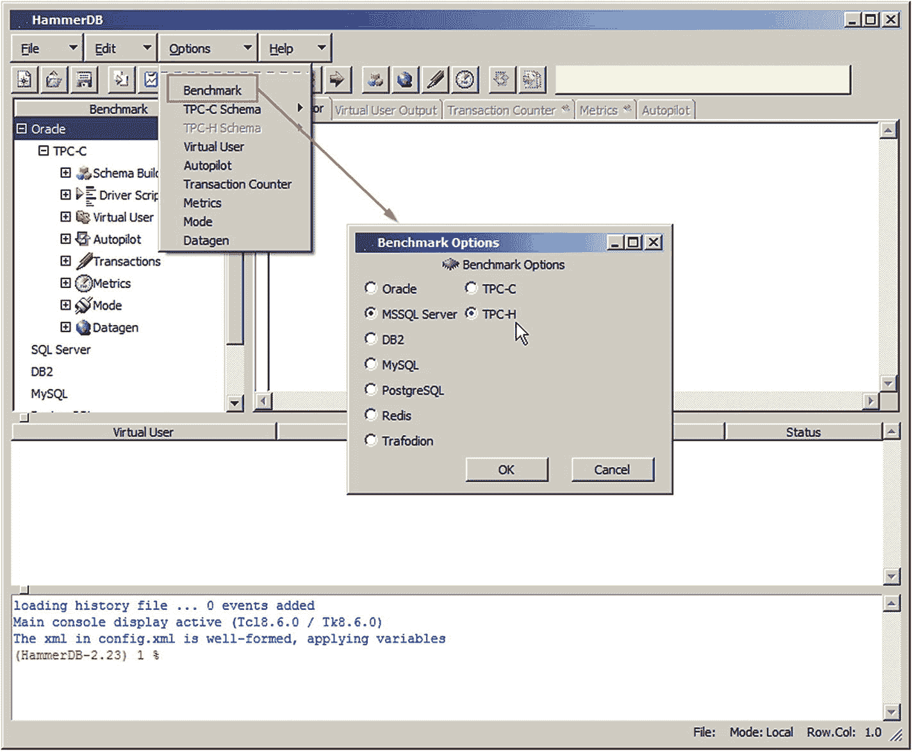
*图 3-9 HammerDB 选择数据库和基准测试*

#### 执行基准测试的流程

既然我们已经选择了数据库平台和基准测试，是时候深入了解使用 HammerDB 成功运行数据库基准测试的四个步骤了：

1.  构建数据库模式对象并加载数据。
2.  加载驱动脚本，其代码实现了所选的数据库基准测试。
3.  创建所有将运行所选数据库基准测试工作负载的并发虚拟用户会话。
4.  启动所有并发虚拟用户会话，开始运行所选数据库基准测试的工作负载。

##### 步骤一：构建数据库对象

因此，我们首先展开“模式构建”树形视图节点，然后双击“选项”节点，这将启动基准测试模式构建选项，如图 3-10 所示。

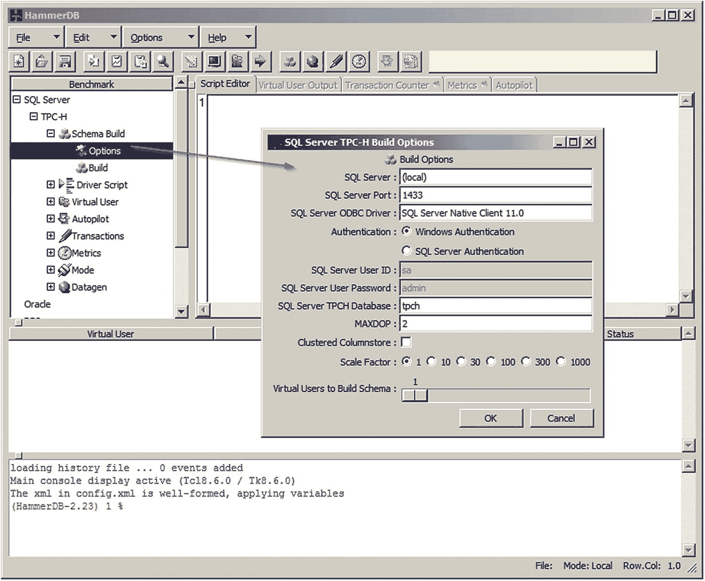
*图 3-10 HammerDB 模式构建选项*

在这里，我们只需定义数据库连接标准、在哪个数据库中创建对象、最大并行度（`MAXDOP`）以及数据库基准测试的比例因子（记住，第 2 章中解释过，对于 TPC-H，每个比例因子大约相当于 1 GB）。如果我们选择在 Oracle 上运行 TPC-H 数据库基准测试，那么此屏幕上显示的字段会略有不同，如图 3-11 所示。虽然此屏幕可能因数据库平台而异，但大多数数据库管理员会发现所有要求填写的信息都相当直观。

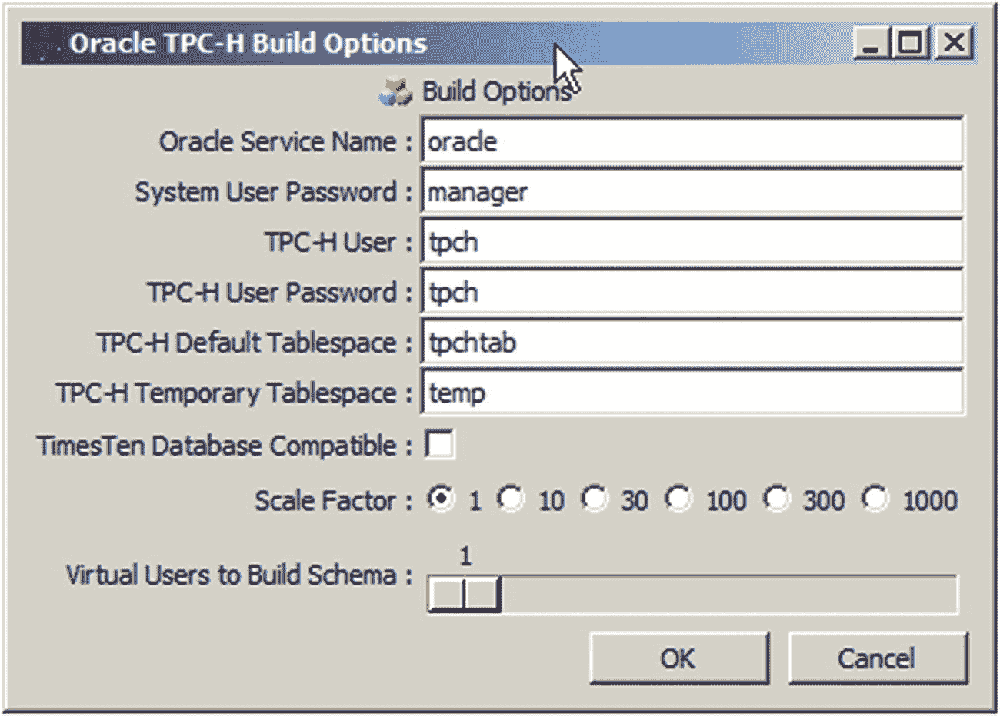
*图 3-11 HammerDB 用于 Oracle 的 Oracle 构建选项*

选定了模式构建选项后，就该启动由这些选定选项控制的构建过程了。为此，我们再次查看“模式构建”树形视图节点下方，但现在双击“构建”节点，这将启动基准测试模式的构建（和加载）执行，如图 3-12 所示。

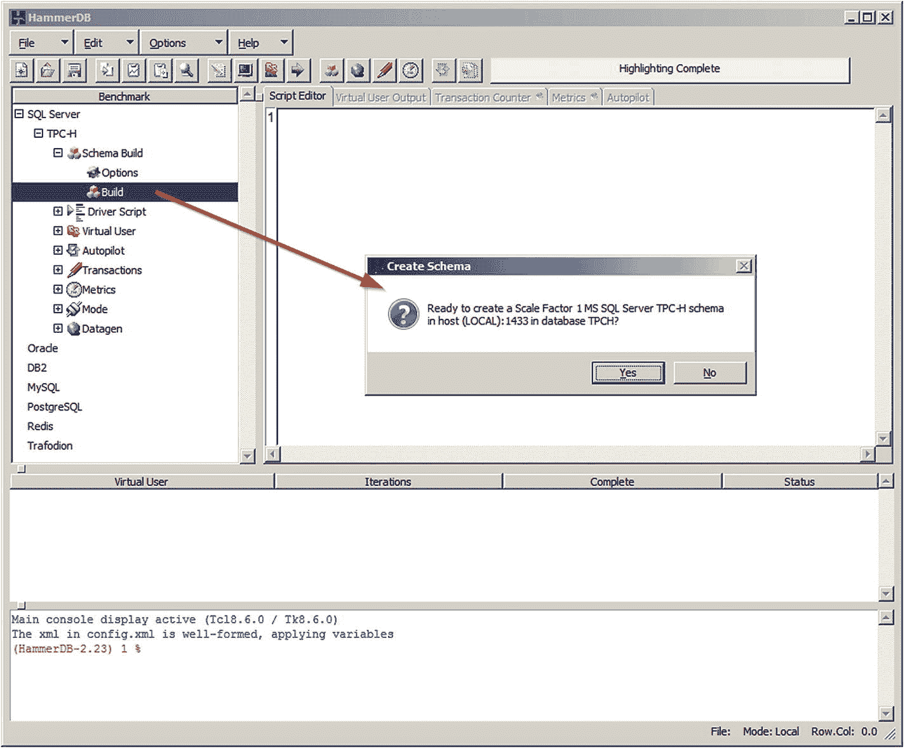
*图 3-12 启动数据库对象的构建与加载*

在选择“是”并实际创建和加载数据库基准测试对象之前，重新审视构建选项并重点关注屏幕底部附近突出显示的两个数字非常重要，如图 3-13 所示。这些是“比例因子”和“构建模式的虚拟用户数”设置。

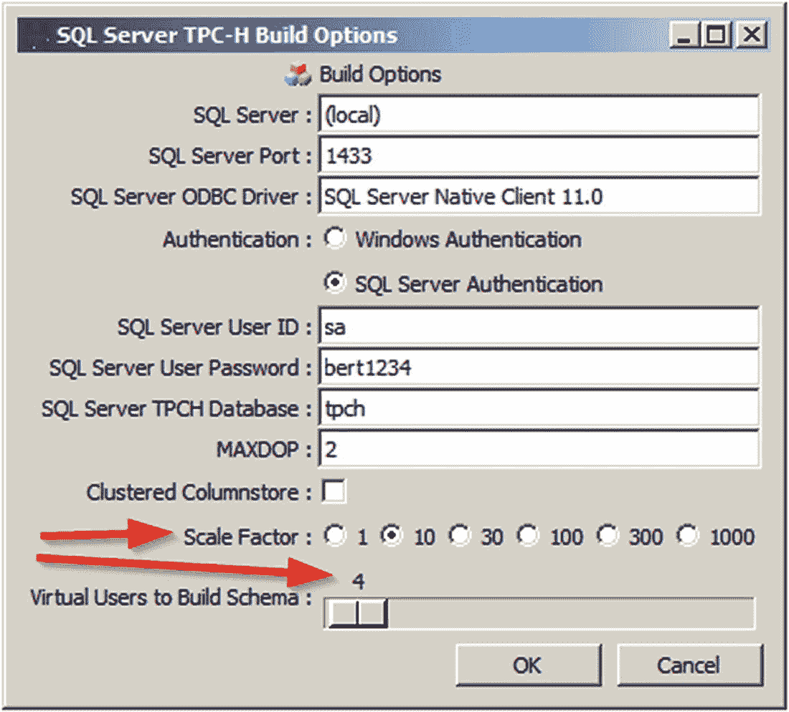
*图 3-13 关键的构建模式选项*

比例因子就是要创建的数据库的大小，对于 TPC-H，大约每个比例因子对应 1 GB。对于出于有限目的（如学习）在简单的笔记本电脑或台式机上进行测试，小的比例因子是可以的。然而，大多数数据库基准测试专家认为，只有至少 100 GB 的比例因子才值得关注。实际上，大多数已发布的测试结果都是针对 300 GB 或 1 TB 的。随着比例因子的增加，你肯定需要生成额外的并发会话来加载这些数据；因此，你至少要指定四个会话（当然这取决于你的数据库服务器及其 IO 带宽）。请注意，图 3-13 中比例因子设置为 10 GB，并使用 4 个并发会话来加载数据。第二个数字，即构建模式的并发会话数，将直接影响构建过程的运行时间及其在执行期间的显示方式。

现在我们已经重新审视了这两个关键的值设置，可以通过选择图 3-12 中的“是”来启动创建过程。这将导致显示构建日志窗口，如图 3-14 所示。这个窗口有点复杂，因此值得详细审视。

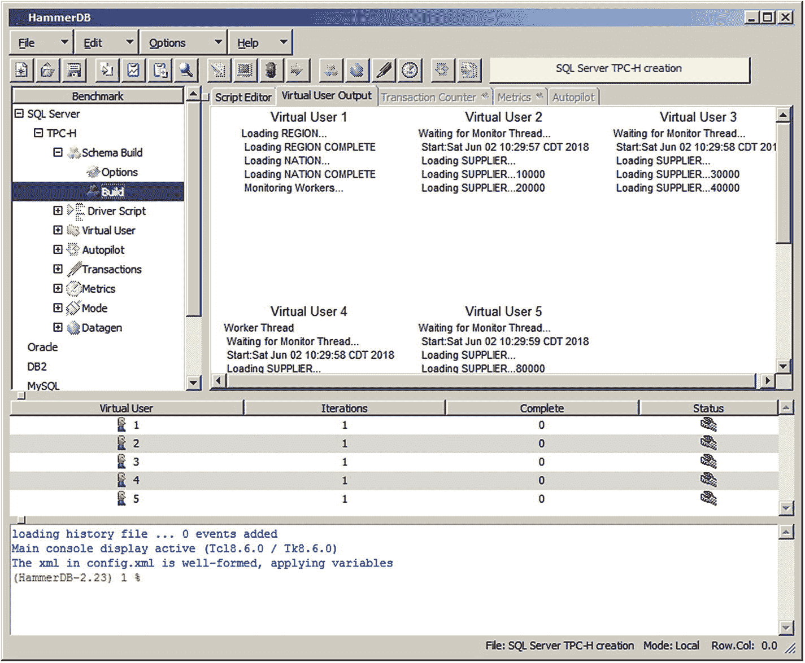
*图 3-14 关键的构建模式选项*


这个窗口有两大关注区域：右上角和中间部分。中间部分相当简单：它显示正在运行的虚拟用户、它们的状态以及是否已完成。第一个值得注意的点是，虽然我们选择了四个虚拟用户，但实际上有五个；为什么呢？答案很简单。当你请求多个虚拟用户时，会有一个协调器/监控用户会话，在本例中就是虚拟用户#1。你可以通过查看每个虚拟用户的第一行来辨别，用户#2 到#5 显示为等待工作线程，这意味着它们正在等待控制会话。

当构建过程最终完成 100%时，你会知道，其显示内容包含图 3-15 中突出显示的四个关键项目。第一，虚拟用户线程已全部完成。第二，每个虚拟用户的状态都显示一个绿色对勾。第三，每个子虚拟用户线程都以`TABLES COMPLETE`结束。第四，也是最后一点，主虚拟用户线程显示`CREATING INDEXES`、`UPDATING STATISTICS`和`SCHEMA COMPLETE`。缺少任何一点，你都需要删除数据库及其对象才能重复此步骤。请注意，可能出现问题的地方很多，所以如果你确实需要重复此步骤，也不要惊讶或沮丧。

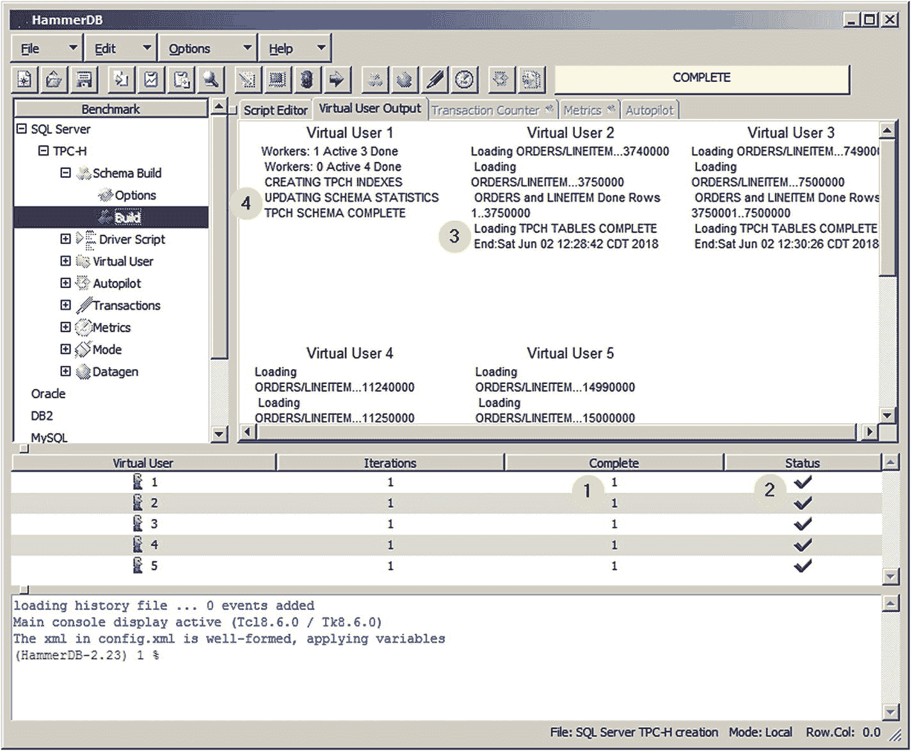

图 3-15

HammerDB 加载完成

#### 步骤 #2：加载驱动脚本

我们现在继续，展开 `Driver Script` 树视图节点，然后双击 `Options` 节点，这会启动基准测试脚本编码选项，如图 3-16 所示。请注意，步骤#2 整体上比前一步骤简单得多，因此也更短；所以本节内容相对简短是有意为之。

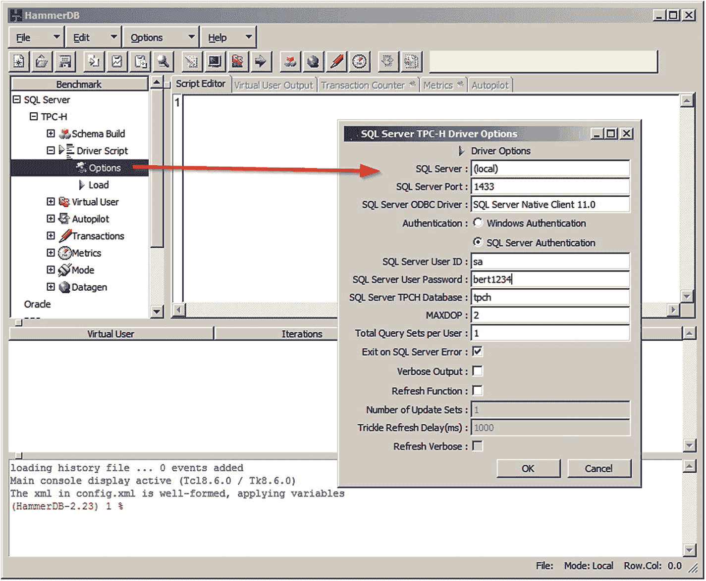

图 3-16

HammerDB 驱动脚本选项

我们再次简单地定义数据库连接标准，即哪个数据库包含这些对象、最大并行度(`MAXDOP`)，以及每个虚拟用户执行 22 个 TPC-H 查询的迭代次数。和之前一样，尽管此屏幕可能因数据库平台而异，但大多数数据库管理员会发现所有要求的信息都相当明显。

与之前的模式选项屏幕类似，驱动选项屏幕也会根据所设置的数据库基准测试略有不同，如图 3-17 所示。请注意，HammerDB 默认将`keying`和`thinking`时间设置为未选中（即零时间），即使规范要求设置这些。我怀疑这是因为产品名称中包含`hammer`一词，因此默认设置倾向于对数据库施加压力以获得尽可能高的 TPS。然而，其他数据库基准测试工具（例如，Benchmark Factory）没有提供启用或禁用这些设置的功能。我见过许多数据库管理员 wonder 为什么一个工具会产生截然不同的 TPS 和平均响应时间，正是因为他们忽略了这一个细节。他们通常只是假设 HammerDB 更优越，因为它获得了更高的 TPS。因此，如果你希望能够进行公平的比较，请务必注意不同工具中这类设置的差异。

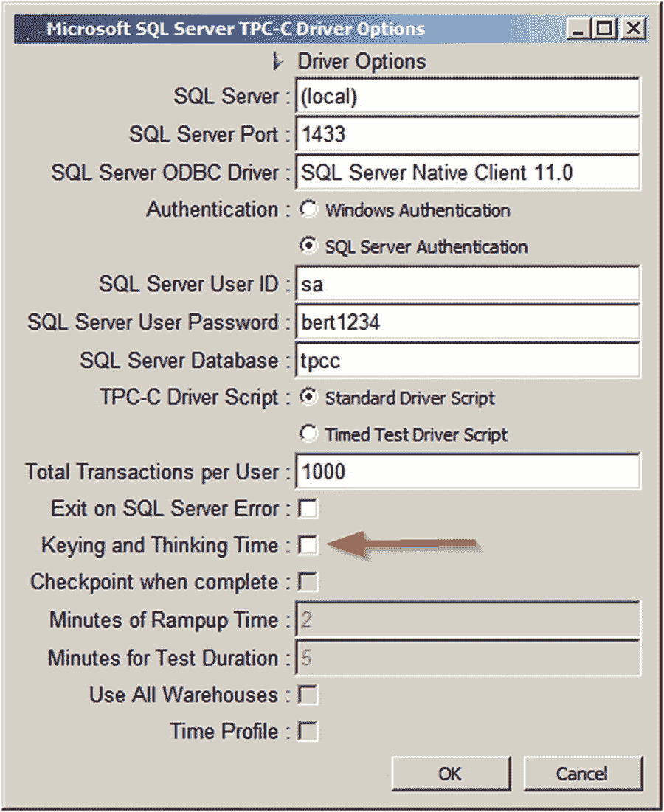

图 3-17

不同的 HammerDB 驱动选项

现在选择了驱动脚本选项，是时候简单地加载反映了这些值的基准测试脚本了。为此，我们再次查看 `Driver Script` 树视图节点下，但现在双击 `Load` 节点，这会将生成的基准测试执行脚本加载到脚本编辑器中，如图 3-18 所示。

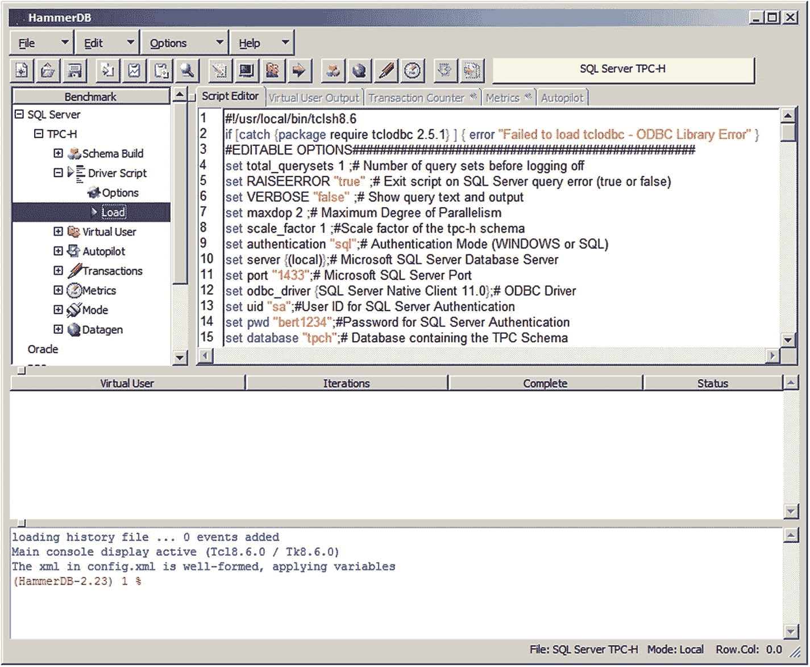

图 3-18

HammerDB 生成的驱动脚本

我想任何称职的 TCL 编程语言编码员都可以选择修改生成的脚本。然而，我发现这段 TCL 代码试图实现基准测试规范，因此相当复杂。所以我的建议是，只修改选项并重新加载新的结果脚本。不过我不再是程序员了，也许我只是感到害怕和懒惰。读者可以自行判断是否可能对生成的代码进行改进。请记住，务必保存你修改后的脚本，以便将来使用。


## 步骤 #3：创建虚拟用户

我们现在继续展开 `虚拟用户` 树状视图节点，然后双击 `选项` 节点，这将启动虚拟用户选项，如图 3-19 所示。请注意，步骤 #3 也是一个更简短、更简单的步骤；因此，与第 #2 节类似，本节内容特意较为简略。

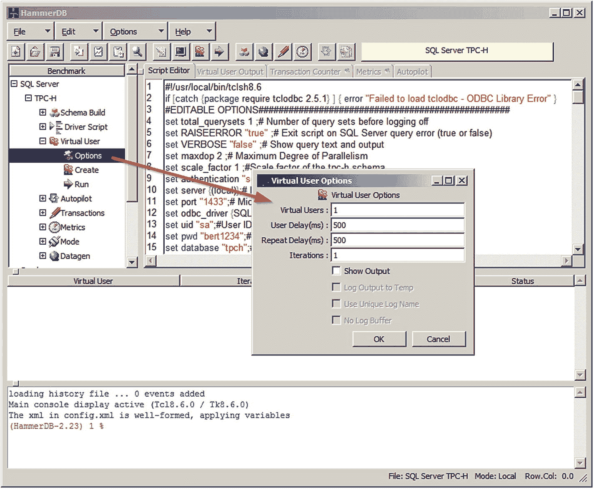

图 3-19：HammerDB 虚拟用户选项

在这里，我们必须指定所需的并发虚拟用户数量、虚拟用户延迟或 `思考时间` 的长度、处理延迟或 `滞后时间` 的长度，以及每个虚拟用户重复整个工作负载的迭代次数。请注意，尽管图 3-18 中的这个屏幕看起来相当直观和简单，但您需要在此屏幕上花些时间，因为这些值可能是由规范定义和/或强制要求的，并且在此屏幕上可能不会默认设置得当。不注意这一点很可能导致意外且不可重复的结果。

例如，假设我们当时进行的是 `TPC-C` 基准测试，并且在数据库对象创建和数据加载阶段请求了，比如说，`10 个仓库`。`TPC-C` 规范明确定义了每个仓库允许的最大用户数量为 `10`。然而，这个屏幕会允许我们请求 `200 个并发虚拟用户`，并且进一步地，不会警告这超出了规范范围。这可能会导致不必要的数据库行争用，并且由于没有足够的、独立的行供用户处理而导致结果不正确。您甚至可能会看到数据库死锁错误。无论如何，结果很可能不可靠且不可重复。

这里还有一个重要的注意事项值得提及。虽然 HammerDB 提供了定义虚拟用户开始处理之间以及迭代之间延迟的功能，但其他工具可能没有。再次强调，这样的设置可能使两个不同的数据库基准测试工具看起来产生了不同的结果。但严酷的事实是，种瓜得瓜，种豆得豆。因此，请注意这类细节。

现在选择了虚拟用户选项后，是时候生成那些处于空闲状态但已准备就绪的虚拟用户会话进程了。为此，我们再次查看 `虚拟用户` 树状视图节点下方，但现在双击 `创建` 节点，这将生成或分叉那些空闲的虚拟用户会话，如图 3-20 所示。

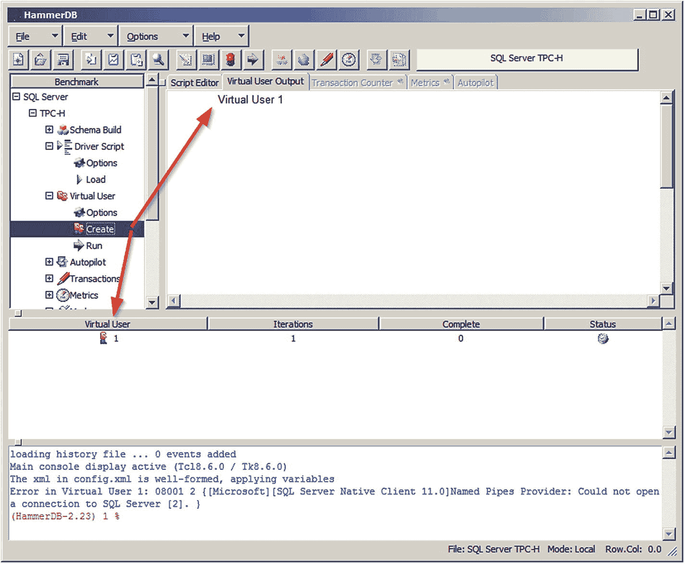

图 3-20：HammerDB 虚拟用户启动

图 3-20 中有几个值得注意的项目需要认识和理解。首先，生成的虚拟用户数量正好是请求数量，并且没有像数据库对象加载阶段那样的控制或监控附加项。其次，如果您请求了 `100 个虚拟用户`，那么请确保滚动浏览列表并验证您实际生成了请求数量的虚拟用户并已准备就绪。人们很容易忘记这一步，并且没有意识到结果不可重复的原因是虚拟用户数量由于某些不可预见的问题（如机器内存不足或数据库允许的并发连接数限制）而发生了变化。

## 步骤 #4：执行基准测试

我们终于到了最重要的阶段：实际运行数据库基准测试。为此，我们继续展开 `虚拟用户` 树状视图节点（假设虚拟用户已经生成），然后双击 `运行` 节点，这将简单地释放空闲的虚拟用户会话，让每个会话使用用户定义的脚本选项执行生成的脚本，如图 3-21 所示。

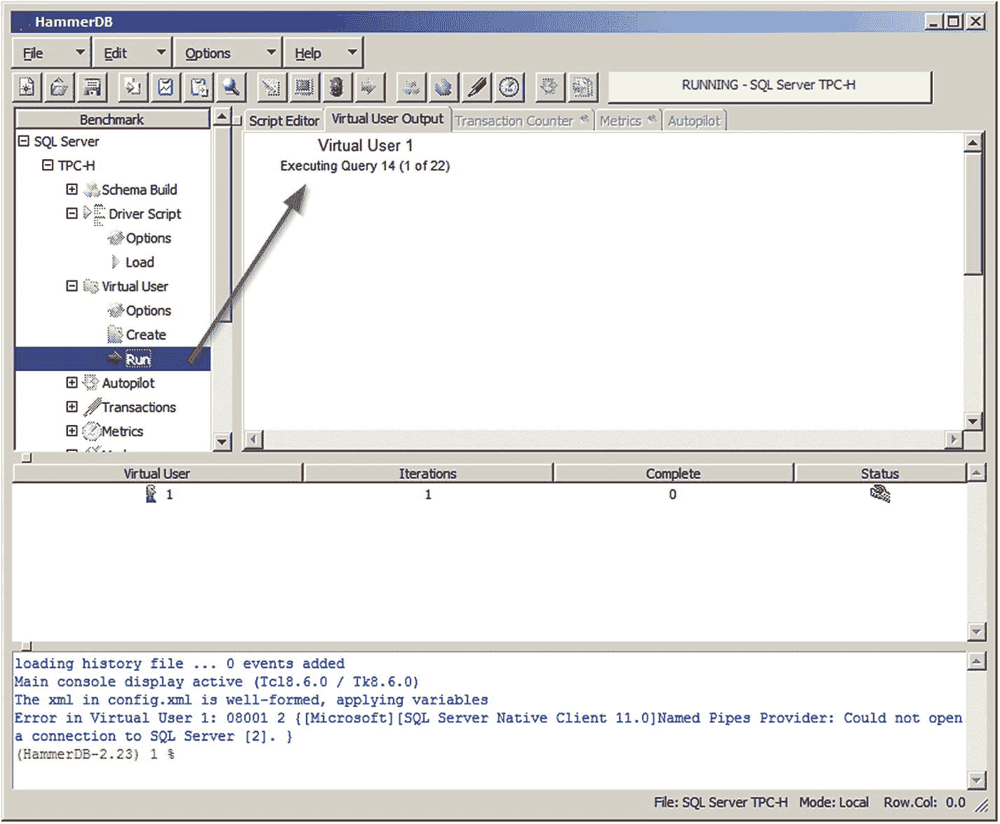

图 3-21：HammerDB 执行基准测试

请注意，输出显示正在运行的是规范中定义的 22 个查询中的第一个查询，即查询 #14。不要让这使您感到困惑或困扰，因为它将按要求运行所有查询。顺序只是被随机化了，这样并非所有并发会话都会在同一时间运行相同的查询。随机顺序将更接近地匹配真实用户大多在不同时间运行不同查询的情况。当您看到如图 3-22 所示的屏幕输出时，您就会知道基准测试已成功完成。请注意，虚拟用户显示其以绿色状态完成，并且运行 22 个查询花费了 `150 秒`。

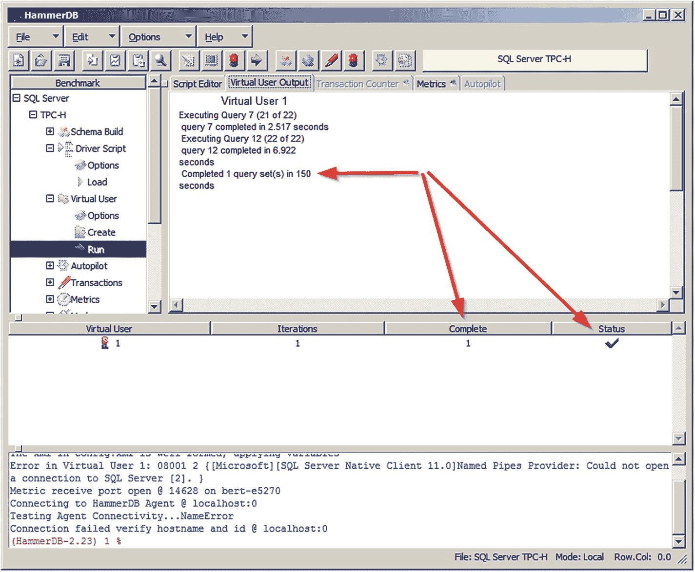

图 3-22：HammerDB 基准测试完成

#### 监控性能

请注意，仅仅知道运行基准测试花了多长时间通常不是最健壮和最有用的统计数据。对于 `TPC-H`，每小时查询数（`QpH`）可能更有用，而对于 `TPC-C`，则是每分钟事务数（`TpM`）。这两者都不是规范要求的为发布而计算的最终报告值，但对于大多数 DBA 来说通常已经足够好。那么，我们如何从 HammerDB 获取这样的信息呢？实际上相当简单；我们只需启动事务计数器。许多 DBA 只在基准测试的执行部分这样做，尽管如果您愿意，也可以监控创建和加载阶段。无论哪种方式，您所需要做的就是定义事务计数器的数据库连接信息，如图 3-23 所示。

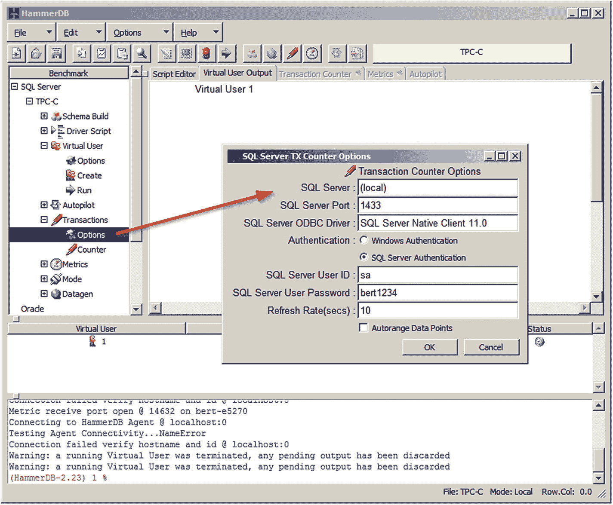

图 3-23：配置事务计数器

然后，您只需双击 `计数器` 树状视图节点来启动事务计数器数据收集，这将导致事务计数器屏幕进入等待状态，如图 3-24 所示。

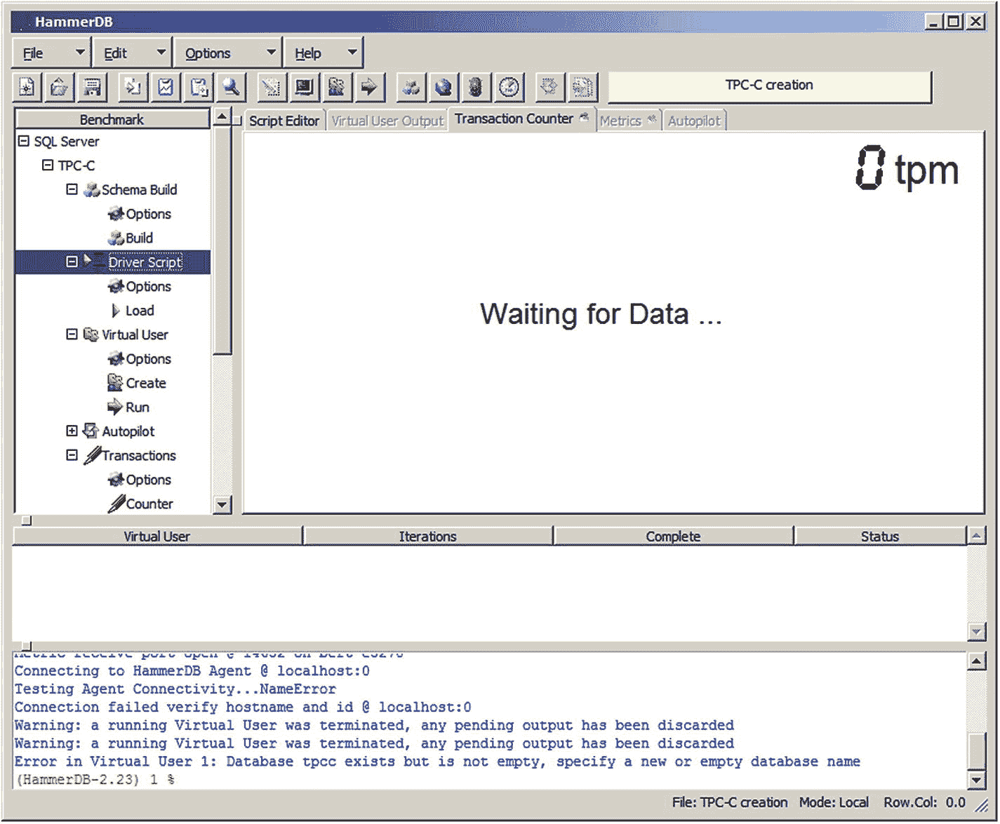

图 3-24：事务计数器等待中

现在，当您运行数据库基准测试时，您将看到事务计数器屏幕更新，如图 3-25 所示。

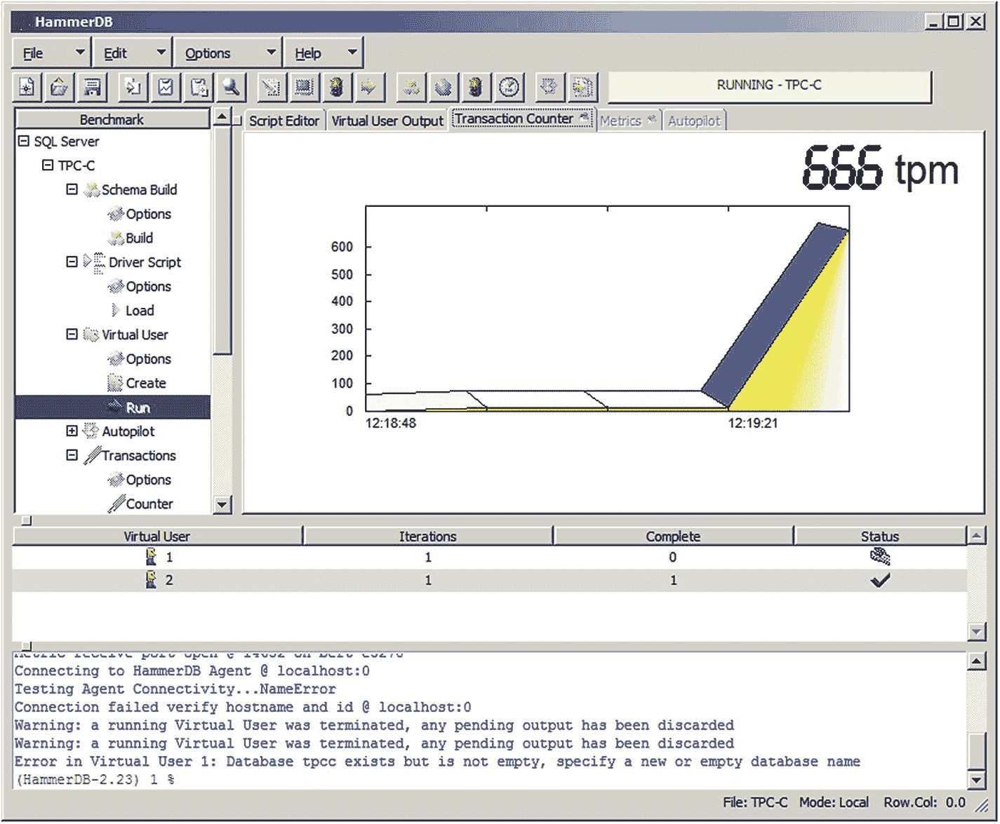

图 3-25：事务计数器工作中


#### 系列执行

使用 HammerDB 时，有一个最终的技巧需要学习：“我们如何运行一系列递增的虚拟用户数，以找出可能的最大值？” 事实上，你完全可以说所有的基准测试工作都应该以这种方式进行；因此，这是一个需要学习和掌握的关键方面。实际上这相当简单，在完成数据库对象和驱动加载步骤后，你只需启用 `Autopilot` 功能，指定每次迭代的运行时间和每次迭代的虚拟用户数，如图 3-26 所示。

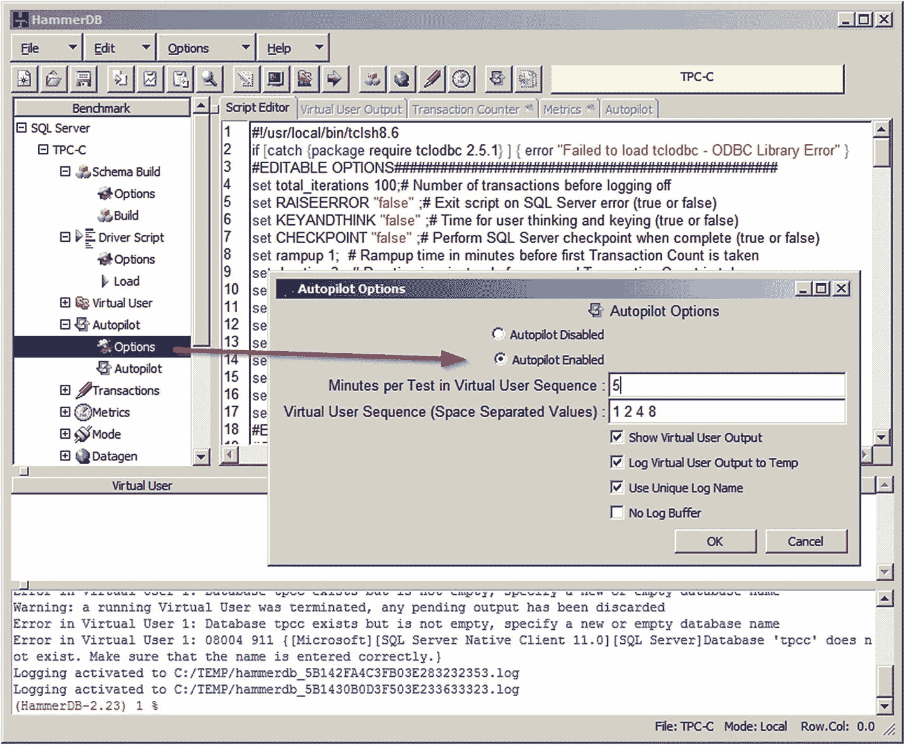
*图 3-26：使用 HammerDB 自动驾驶模式*

在图 3-26 中，我指定了 1、然后 2、然后 4，最后是 8 个虚拟用户场景。我无法要求更多，因为我知道我只创建了一个仓库，因此根据规格不能有超过 10 个虚拟用户。我还勾选了显示虚拟用户输出的复选框，并将每个用户的迭代记录到一个唯一命名的文件中。特别注意，我指定了五分钟的迭代周期。我是如何选择这个数字的呢？很简单，它是基于你在驱动脚本中为定时运行所指定的值，如图 3-27 所示。

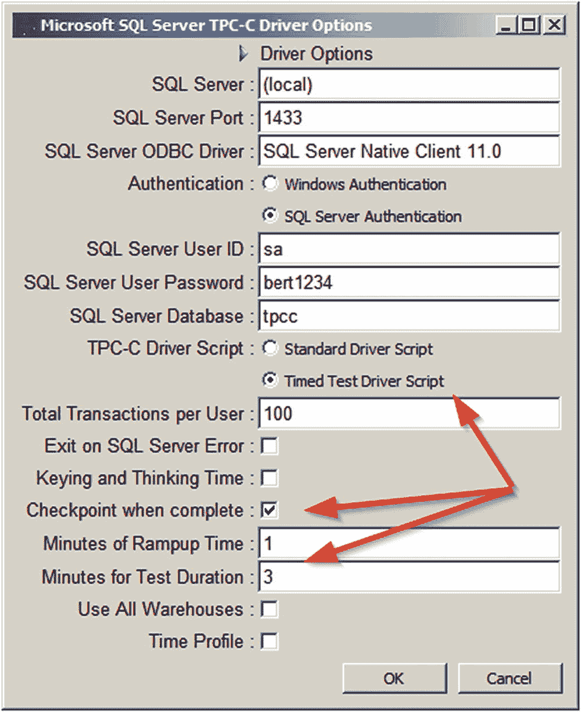
*图 3-27：自动驾驶模式的驱动设置*

首先，你必须选择定时驱动选项。其次，预热时间和测试持续时间的总和必须小于图 3-26 中为每个序列指定的分钟数。另外，强烈建议在每次迭代之间执行一个检查点，以确保数据库在每次迭代开始时处于一致状态。最后，请注意，此步骤必须被选中，以代替创建虚拟用户和运行基准测试（即本章前面的步骤 #3 和 #4），因为所有这些步骤现在将完全自动化。

现在我们只需要启动自动驾驶模式，如图 3-28 所示。请注意，这个过程大约需要运行 20 分钟，因为我指定了四次迭代，每次五分钟。你可能需要尝试找到合适的周期值，因为预热时间 + 测试时间 + 检查点时间并不总是完全精确。我的建议是选择一个比它们的总和至少多一到四分钟的值。

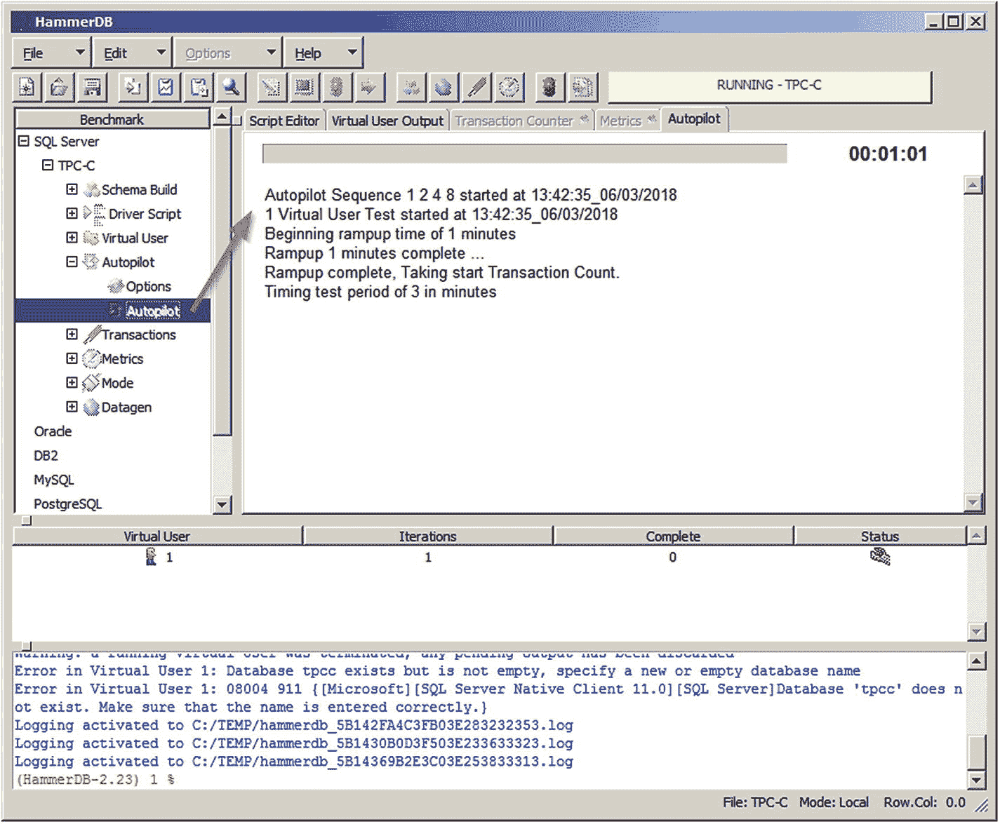
*图 3-28：HammerDB 自动驾驶模式运行中*

当整个测试运行完毕后，你就可以从图 3-28 的日志窗口中，或者从文本日志文件中获取每次迭代的 `TPM` 数值并绘图。

### Benchmark Factory

另一款支持多种数据库平台的流行数据库基准测试工具是 Quest Software 的 `Benchmark Factory for Databases`。虽然它是一款商业软件（当然需要花钱），但也有一个非常好的免费版本（限制 100 个并发数据库会话）。我使用这个工具多年，认为对于希望快速执行并获得行业标准数据库基准测试评分的人来说，它是一款非常出色的数据库基准测试工具。在这方面，它与 HammerDB 非常相似。然而，与 HammerDB 最初可能难以学习的用户界面不同，Benchmark Factory 提供了非常简单的向导来完成 HammerDB 中的所有步骤，将之前的 20 页内容简化为几个简单的步骤。因此，本节将比上一节短得多。

你可以在以下网址分别找到 Benchmark Factory 的网页、社区和免费软件下载。

*   [`www.quest.com/products/benchmark-factory`](https://www.quest.com/products/benchmark-factory)
*   [`community.toadworld.com/products/benchmark-factory`](https://community.toadworld.com/products/benchmark-factory)
*   [`www.toadworld.com/download/benchmark-factory-for-databases/freeware`](https://www.toadworld.com/download/benchmark-factory-for-databases/freeware)

`Benchmark Factory` 仅提供 Windows 版本，支持 32 位和 64 位。当前版本是 8.0。当你在 Windows 上运行安装程序时，它会按照你的预期（基于所安装版本的位数）将软件安装在 `C:\Program Files` 或 `C:\Program Files (x86)` 目录下。然后要运行软件，你只需双击 Benchmark Factory 的桌面或开始菜单图标。当 Benchmark Factory 软件启动时，它会显示如图 3-29 所示的屏幕。

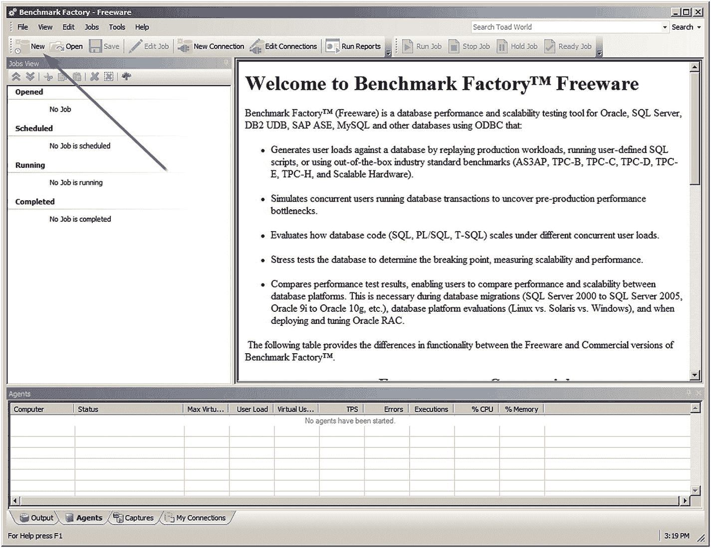
*图 3-29：Quest 的 Benchmark Factory*

为了定义和运行数据库基准测试，你只需按下图 3-29 中高亮显示的新建工具栏图标。你也可以通过文件菜单进入。向导的第一步将为运行基准测试定义一个数据库连接，如图 3-30 所示。

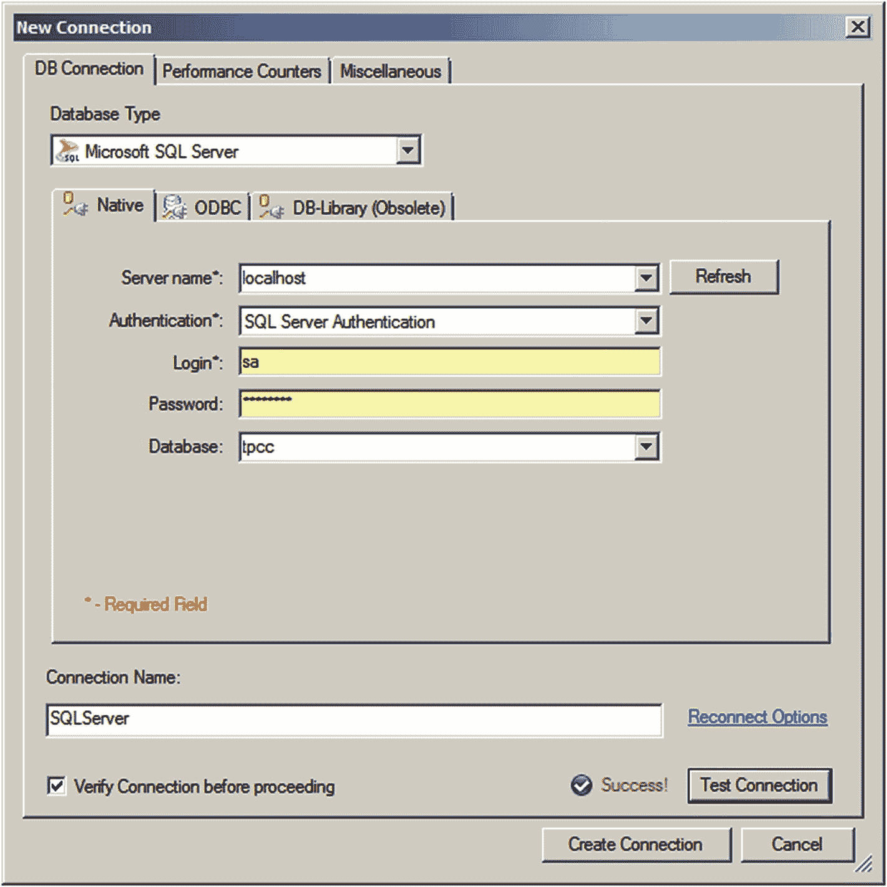
*图 3-30：定义数据库连接*

如果我们选择在 Oracle 上运行 TPC-C 数据库基准测试，那么此屏幕上显示的字段会略有不同。因此，尽管此屏幕可能因数据库平台而异，但大多数数据库管理员都会发现所有请求的信息都相当直观。

向导的第二步是选择要运行的数据库基准测试，如图 3-31 所示。请注意顶部附近的下拉框，它显示了行业标准基准测试。`Benchmark Factory` 还提供了其他几种测试，包括可扩展性测试、用户基于现有测试设计的自定义测试（例如，50% TPC-C 和 50% TPC-H），以及工作负载捕获/重放。

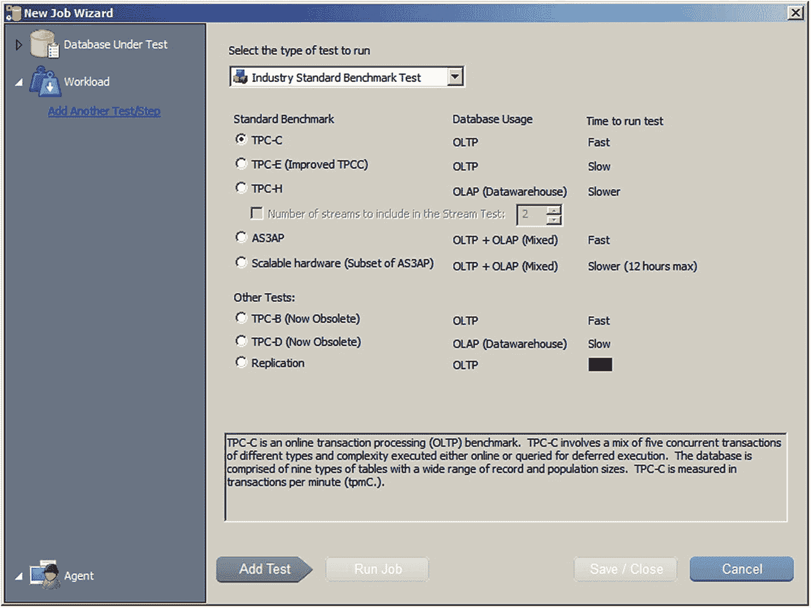
*图 3-31：选择数据库基准测试*

向导的第三步允许用户定义所有执行参数和选项，如图 3-32 所示。请注意，我选择运行比例因子为 2 的 TPC-C，这将消耗 162 MB 的空间，并且用户会话迭代次数为 1、2、4 和 8，就像之前使用 HammerDB 时所做的那样。剩下的就是按下运行作业按钮。

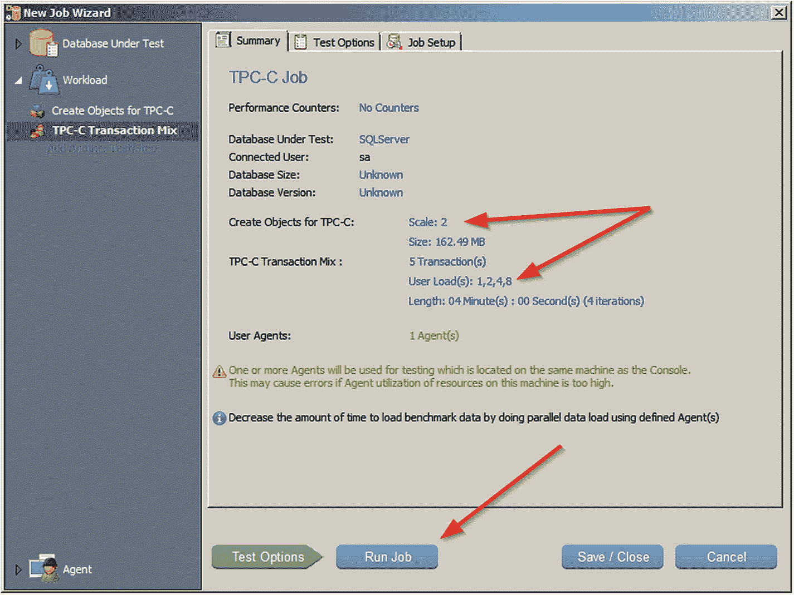
*图 3-32：选择数据库基准测试*


当作业开始运行时，它将首先创建并加载数据库对象，如图 3-34 所示。请注意，这包括创建所有必需的索引、键约束以及进行统计信息收集。此外，对于某些数据库平台（如 Oracle），还提供了一些额外的选项，例如在测试前后获取 `AWR` 或 `STATSPACK` 快照。

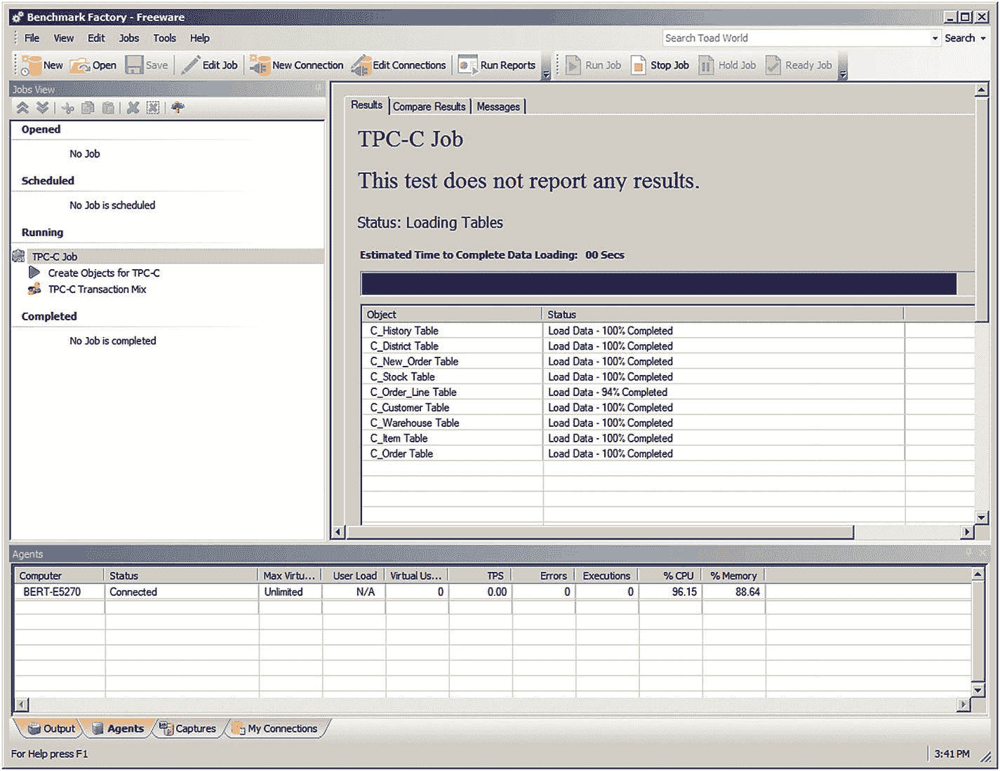

图 3-33

加载测试数据

数据加载完成后，基准测试开始运行，如图 3-34 所示。请注意它运行时提供的信息量比 HammerDB 多得多。对于待运行的迭代次数和当前执行的完成百分比，都有清晰的进度条。此外，还有一个每隔几秒更新一次的美观图表。最后，它还显示了当前的 `TPS`（每秒事务数）和平均响应时间值。因此，Benchmark Factory 的作业执行过程信息量很大，非常值得在运行时观察，以洞察遇到性能瓶颈的情况。

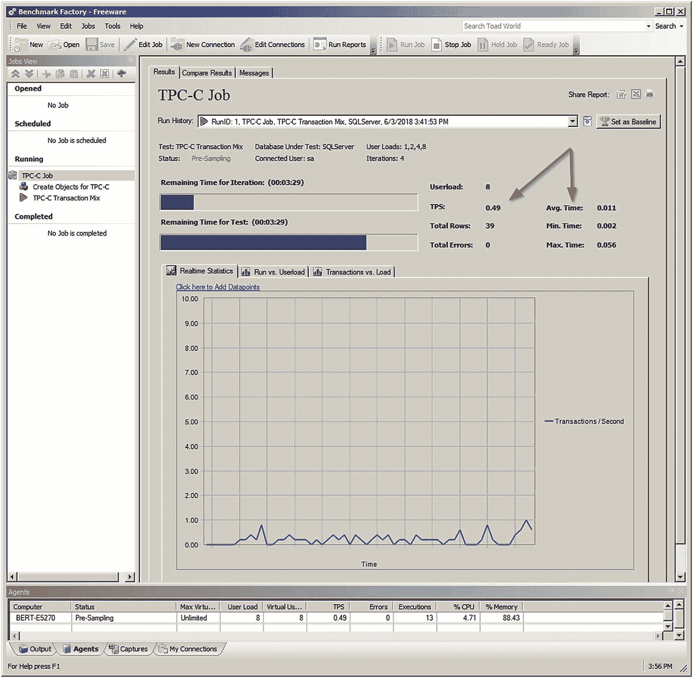

图 3-34

数据库基准测试运行中

最后，当基准测试作业运行完成时，Benchmark Factory 会呈现一个出色的汇总结果视图，如图 3-35 所示。而且，所有这些数据都可以轻松导出到 Excel 或 Word 文件。此外，您可以将任何测试运行设置为基线，然后与其他测试运行进行比较。事实上，其用户界面功能如此强大，以至于我很少需要因为任何原因导出数据。在这方面，Benchmark Factory 表现出色。

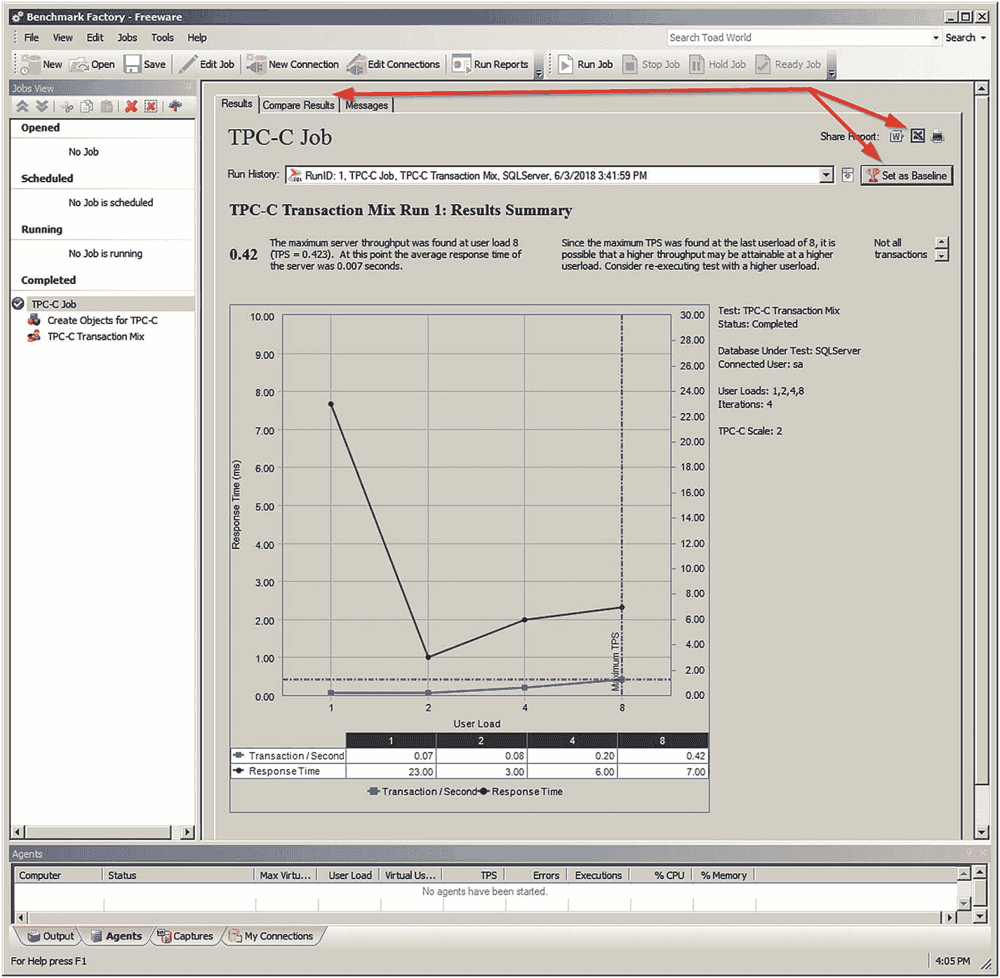

图 3-35

数据库基准测试结果

### Swingbench

另一款流行的、免费的负载生成器和数据库基准测试工具是 Swingbench，它仅适用于 Oracle 数据库。我喜欢这款工具的原因非常简单：它是迄今为止我找到的唯一提供较新的 `TPC-DS` 基准测试的工具。事实上，这个包含 100 个复杂查询的基准测试是我所知的最佳数据库性能工具之一（除了实际的工作负载）。我和我的合著者在我们 2017 年的 Oracle 书籍《*Oracle Database 12c Release 2 Testing Tools and Techniques for Performance and Scalability*》中使用了它。事实上，该工具的作者与我们合作才使这本书得以出版，我们对此深表感谢（谢谢，Dominic）。

您可以在以下网址分别找到 Swingbench 的网页和下载链接。

*   [`http://dominicgiles.com/swingbench.html`](http://dominicgiles.com/swingbench.html)

*   [`http://dominicgiles.com/downloads.html`](http://dominicgiles.com/downloads.html)

Swingbench 的下载文件是一个简单的 zip 文件，只需解压即可。它是一个纯粹的基于 `Java` 的工具，因此可以在大多数操作系统上运行；所以它要求您的机器上已加载 `Java`。需要注意有两种类型的可执行文件：大约十几个用于加载所需工作负载或基准测试的实用程序，以及实际运行这些测试的 Swingbench 引擎。这里我们只演示如何运行 `TPC-DS` 基准测试。但该工具提供的其他测试流程也大同小异。

运行 `TPC-DS` 创建向导会引导您完成创建数据库连接、是否删除或创建数据库对象，以及在如图 3-36 所示的屏幕上设置所需表和索引的所有者及表空间。

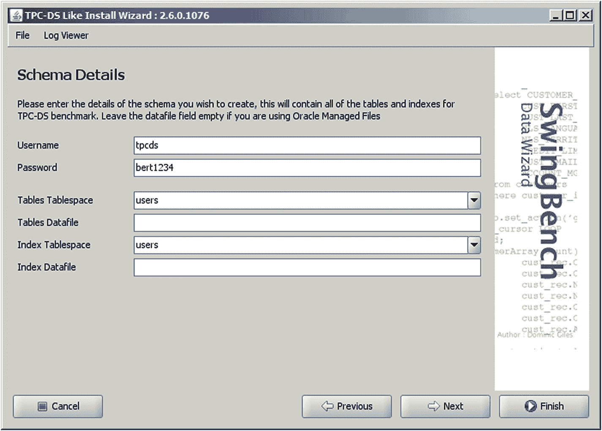

图 3-36

TPC-DS 创建向导

在此过程中，向导会询问数据库对象的大小，其中每个比例因子相当于 1 GB。然后，向导最后询问创建这些对象时要使用的并行度。接着它开始创建这些对象，如图 3-37 所示。请注意，我选择了 8 个并行线程（这是默认值），目前该工具已加载了我 13% 的数据。

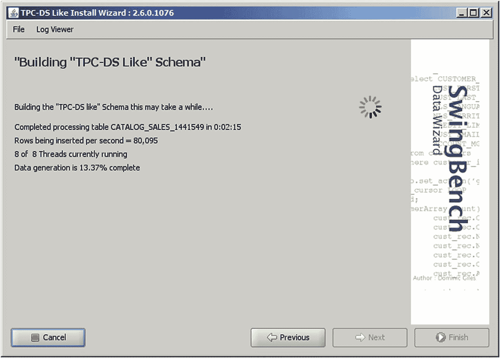

图 3-37

TPC-DS 创建运行中

在数据库对象成功创建并加载后，现在该运行 Swingbench 实用程序本身了。在启动时提示选择要运行的工作负载或数据库基准测试时，请选择 `TPCDS` 类测试。然后，只需在如图 3-38 所示的屏幕上输入数据库连接信息，再按开始执行工具栏按钮。请注意，主屏幕左下角的“Load”（负载）选项卡提供了几个非常重要的关键选项，包括事务间的最小/最大延迟、登录延迟时间、是否等待所有会话连接后才开始以及总运行时间。所有这些都可能影响您的结果，因此请务必参考相应的基准测试规范以获取设置这些参数的建议。

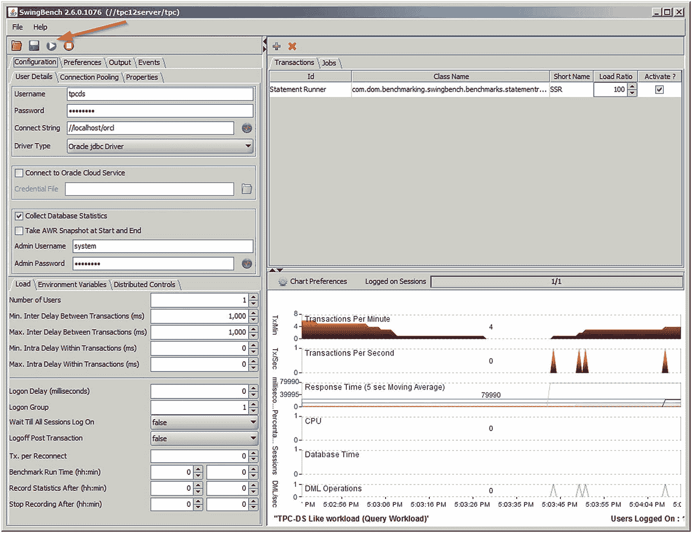

图 3-38

TPC-DS 启动执行

在测试运行时，您将看到所有正在处理的查询（记住有 100 个）以及一些关键性能指标，如图 3-39 所示。我个人认为 Swingbench 呈现的所有性能信息是所有数据库基准测试工具中最好的。请注意，Swingbench 显示了两个重要的图表：每秒事务数和响应时间。正如本书后面在解释如何解读结果时将要说明的，这是需要检查的两个最重要的指标——而且通常需要将它们作为一个整体来看，而不是孤立地看待。

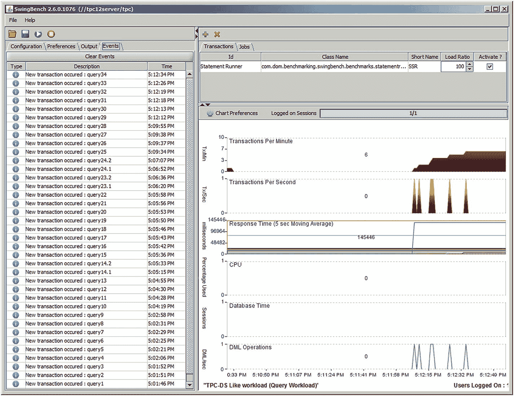

图 3-39

TPC-DS 日志记录与性能


### SLOB

Oracle DBA 最流行且广泛使用的工具之一是 **SLOB**，其全称是“小 Oracle 基准测试工具”（Silly Little Oracle Benchmark）。它是免费的，这进一步增加了其受欢迎程度。我称其为“高度使用”，是因为几乎每个 Oracle DBA 都知道并使用它。但这并不一定意味着他们理解了其真正的目的。引用该工具作者 Kevin Closson 的话：

> *SLOB 不是一个数据库基准测试工具。SLOB 是一个 Oracle I/O 工作负载生成工具包。我需要指出，由于习惯使然，许多 SLOB 用户会交替使用“基准测试”和“工作负载”等术语来指代 SLOB。SLOB 旨在填补 Orion 与 `CALIBRATE_IO` 以及全功能事务性基准测试之间的空白。*

因此，SLOB 实际上并不适合放在前面专门讨论存储基准测试的章节中，也不完全适合放在这里与数据库基准测试工具一起讨论。但正如我所说，大多数 Oracle DBA 都在使用它，甚至连该工具的作者也承认他们经常将其误解为数据库基准测试工具。所以，基于以上说明，我们将在本节末尾介绍它。

你可以在以下网址分别找到 SLOB 的网页和下载链接。

*   [`https://kevinclosson.net/slob/`](https://kevinclosson.net/slob/)
*   [`https://github.com/therealkevinc/SLOB_distribution`](https://github.com/therealkevinc/SLOB_distribution)

SLOB 是一系列 Linux shell 脚本和一些基于 C 语言的程序。要使用 SLOB，你需要了解两个脚本：`setup.sh` 和 `runit.sh`。还有一个名为 `slob.conf` 的文本文件，其中包含控制 SLOB 运行时行为的各种参数。你很可能需要根据你的环境编辑此文件。在我的案例中，我更改了 `SYSTEM` 密码并将快照机制改为 AWR。

第一个脚本 `setup.sh` 接受两个输入参数：用于创建其模式及其对象的表空间，以及要创建的模式数量。在我的案例中，我在笔记本电脑上运行一个 Linux 虚拟机，因此我希望最小化设置：使用现有的 `USERS` 表空间并仅加载一个模式。图 3-40 展示了使用这些值执行 `setup.sh` 的情况。

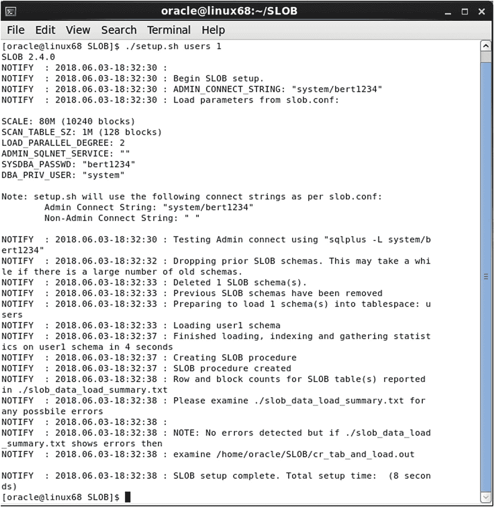

图 3-40

SLOB `setup.sh` 执行

一旦 `setup.sh` 无错误完成，就该执行第二个脚本 `runit.sh` 了，它只接受一个参数：要测试的模式数量（该值应与你为 `setup.sh` 提供的值相同或更少）。

任务执行完成后，运行 Oracle STATSPACK 或 AWR 报告，报告的开始和结束快照由 `runit.sh` 的输出列出。然后检查报告，重点关注负载配置文件部分中引用的物理 I/O。我的结果如图 3-41 所示。

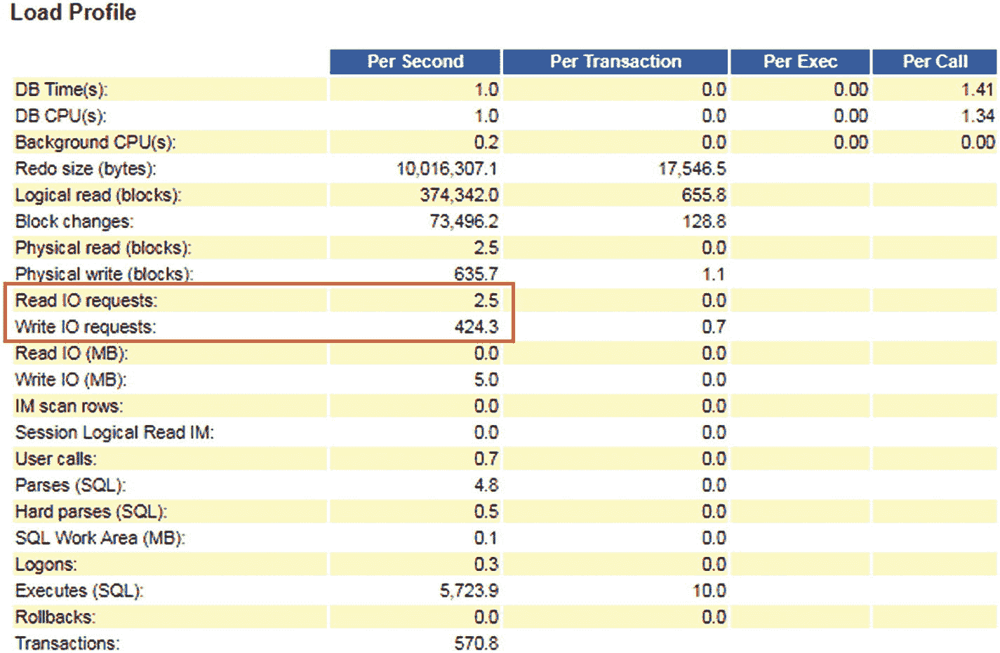

图 3-41

来自 AWR 负载配置文件的 IOPS

因此，根据大多数运行 SLOB 然后读取 AWR 报告的负载配置文件部分来计算 IOPs 的人的说法，我的笔记本电脑大约运行在 428 IOPS。然而，我认为这个数字并非 100% 准确。我更倾向于查看 AWR 报告中更靠下的部分，如图 3-42 所示，查看按文件类型汇总的 IOStat，其显示的总数更接近 990 IOPS。

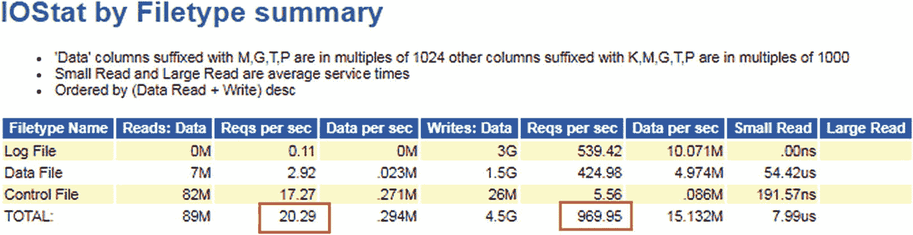

图 3-42

来自 AWR IOStat 汇总的 IOPS

