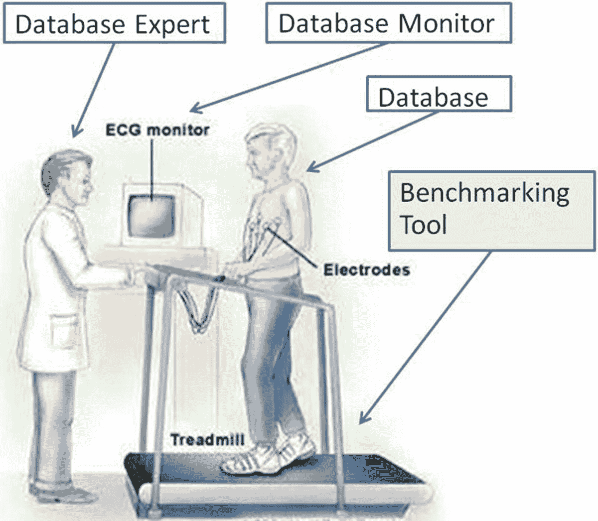
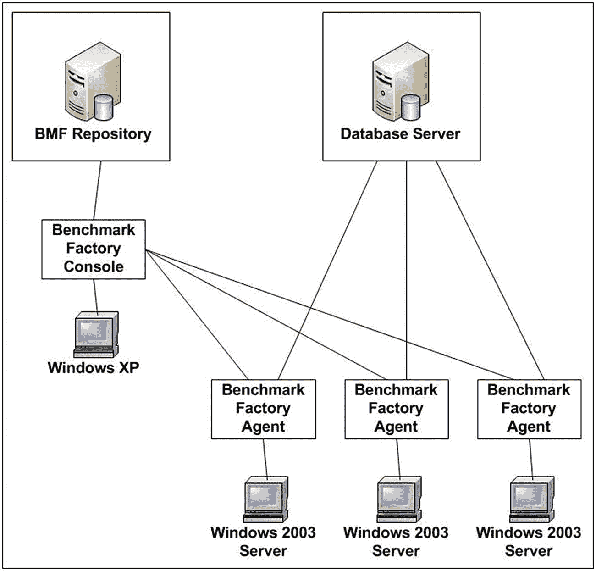
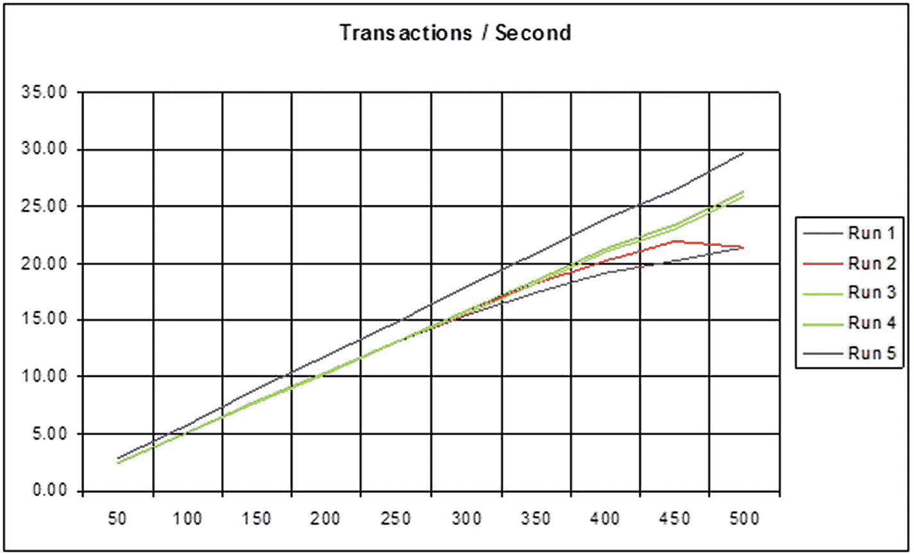
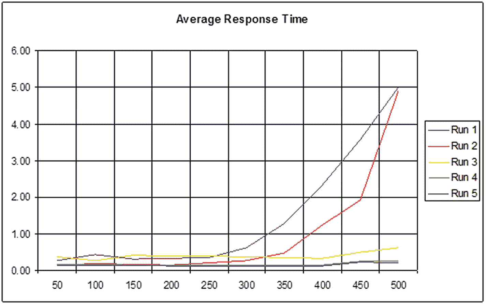

# 总结

尽管这一章篇幅相对简短，但它涵盖了成功进行数据库基准测试的最重要方面之一：准备。准备永远不嫌充分。你应该分配足够的时间和资源。你应该有一个计划并清楚自己的期望。数据库基准测试项目极其重要，通常时间紧迫，因此你不能毫无准备地即兴发挥。我的建议是效仿亚伯拉罕·林肯总统解决问题的方式，他说：“给我六个小时砍倒一棵树，我会用前四个小时磨斧头。”这就是准备。

正如前一章所强调的，充分的准备或准备不足，可以成就也可以毁掉一次数据库基准测试工作。例如，并非任何人都具备成功运行数据库基准测试所需的全部背景知识和技能。他们必须对数据库有深入了解，尤其是正确的配置、性能监控和调优技术。同样，你需要为这项工作安排充足的时间和其他资源。但即使你做到了所有这些，在数据库基准测试工作进行过程中，仍然可能出现许多问题。本章将重点介绍一些困扰许多数据库基准测试项目的主要和最常见的失误。

本章的关键要点应该是：即使你做了所有准备，事情仍然可能出错。记住那句老话：“老鼠和人类精心设计的计划常常落空。”我可以诚实地说，我参与过的数据库基准测试项目中，没有一个能 100%按计划进行而全程毫无波折。然而，知道了这一点，我只是建议你在工作中保持灵活性，避免固执己见的行为。此外，我建议记住罗伯特·舒勒的话：“问题不是停止标志；它们是指南针。”第一章提出的核心观点是，数据库基准测试的定义就是努力“让数据库汗流浃背”。因此，你应该合理预期会遇到边界条件，否则说明你对系统的压力测试还不够充分。

### 注意

[tpc.org](http://tpc.org) 网站目前似乎发布的完整披露报告远少于过去。事实上，现在某些数据库供应商的测试结果似乎完全不见了。

## 所有必备工具

在第 1 章中，我将数据库基准测试比作心脏压力测试。那是一个通常由心脏病专家执行的流程：医生将你连接到心脏监护仪上，让你在跑步机上快步走或跑步一段时间。医生的目标是 "*让你的心率上升*" 和 "*让你出汗*"。每当讨论成功执行数据库基准测试所需条件时，我都喜欢参考此处展示的图 5-1。

图 5-1：基准测试如同心脏压力测试

对于心脏压力测试，有医生、心电图监护仪、跑步机和病人。同样，数据库基准测试有数据库专家（通常是 DBA）、数据库监控工具、他们的数据库以及数据库基准测试软件。对于心脏压力测试，医生将决定跑步机的倾斜度、速度、持续时间、监测内容、诊断方法、治疗方案等等。同样，数据库专家将选择基准测试、其数据库大小、用户数量、持续时间等等。看起来很简单——对吧？

在我协助数据库基准测试项目时遇到的一个反复出现的主要问题是，数据库专家（或者如果没有指派专家，则是非专家）错误地假设基准测试工具将监控数据库、报告问题并提出建议。我必须提醒他们，基准测试工具只是跑步机。它唯一的工作就是给数据库施加压力让它“出汗”。至于他们为何期望数据库基准测试工具能完成所有工作，对我来说是个谜。我猜这只是一厢情愿的想法，但在我协助的项目中，大约有 25% 都存在这种情况。通常这是我加入项目后需要解决的第一个问题。最后请记住，大多数数据库监控工具只显示症状，它们不会提供纠正措施的建议。即使它们提供，这些建议通常也相当笼统，并非专门针对您的硬件和工作负载进行调优。

## 没有“大红简单”按钮

这最后一个问题——期望数据库基准测试工具完成一切——实际上只是我常称之为 "*寻找大红简单按钮*" 这种致命问题的一个症状。因此，我向人们展示图 5-2，试图解释：尽管办公用品商店 Staples 可能宣传他们让一切订购变得非常简单，展示着那个大红简单按钮，但在执行数据库基准测试时，实际上并没有这种东西。没有任何基准测试工具是一站式提供大红简单按钮体验的全能解决方案。令人惊讶的是，这似乎让大多数人感到震惊。无论你如何分析，数据库基准测试都是艰苦的工作。这个事实根本无法绕过。

图 5-2：Staples 办公用品商店的大红简单按钮

大多数数据库基准测试工具的工作方式相当类似，因此大多数数据库基准测试工作也以大致相同的方式进行。因此，让我们研究一下，无论使用何种数据库基准测试工具，任何成功的数据库基准测试工作为了达到预期结果，必须完整执行的基本步骤。理解这些步骤将有助于更好地解释 "*没有大红简单按钮*" 的含义！

1.  配置和优化独立的网段。
2.  配置和优化服务器硬件。
3.  安装和优化服务器操作系统。
4.  安装和优化数据库软件（例如 Oracle、SQL Server、PostgreSQL、MySQL 等）。
5.  创建和优化 "TEST" 数据库。
6.  创建用户或模式来拥有基准测试的数据库对象（即表和索引）。
7.  **创建并加载基准数据库对象至其初始、工作负载前的状态（显然要删除任何预先存在的数据库对象）。**
8.  **按照规范运行基准测试工作负载或事务（在大多数情况下会更改数据，因此如果再次运行需要重新加载）。**
9.  监控工作负载下的数据库性能，诊断问题，然后进行优化。
10. 重复步骤 7、8、9 和 10，直到满意为止（即结果接近或匹配预期）。

在这个过度简化的 10 步流程中，基准测试工具最多只能真正自动化步骤 7 和 8（上面已加粗标出）。同时请注意，这些步骤本质上效率低下，因为执行迭代（这是一种最佳实践且非常普遍）要求数据库基准测试工具每次都重新加载所有数据。对于一个 30TB 的 TPC-H 来说，这可能需要一周时间！所以一定有更好、更高效的方法。我建议用以下分解步骤替换步骤 6、7 和 8。

*   创建两个数据库模式：
    *   SCHEMA-1 用于保存由基准测试工具创建的 "*默认*" 数据库对象的静态副本，不允许进行任何结构性优化
    *   SCHEMA-2 用于保存为执行迭代准备的、经过结构优化的数据库对象副本
*   为所需规模的基准测试创建数据库基准测试工具的标准项目定义。
*   将标准基准测试工具项目分成两个不同的阶段：
    *   PHASE-1 用于创建数据库对象并将数据加载到 SCHEMA-1
    *   PHASE-2 将所有数据从 SCHEMA-1 复制到 SCHEMA-2，并运行下一次迭代的执行
*   运行 PHASE-1。
*   备份或导出 SCHEMA-1（以防任何意外故障）。
*   手动编写一个 SQL 脚本来创建优化后的数据库对象副本，并使用 "create table as select"（CTAS）进行加载（在数据库服务器上运行，因此速度非常快）。
*   手动将 CTAS SQL 脚本添加到 PHASE-2 中，用于从 SCHEMA-1 复制到 SCHEMA-2，然后运行测试。
*   运行 PHASE-2 以根据需要多次执行测试。

虽然这把简单的 10 步流程扩展到了 15 步，但它实际上使流程更易于理解（即分而治之），并且使重复测试执行的速度提高了几个数量级。另外，如果您想添加其他 SQL 脚本来收集统计信息和直方图，现在您有了适当的处理阶段划分和可以添加它们的位置。因此，正如您所看到的，“大红简单按钮”或简单基准测试的想法显然是错误的。数据库基准测试是艰苦的工作，需要注重细节以及手动工作来优化一个原本效率不高的过程。

## 正确的工具部署方式

虽然大多数数据库基准测试工具都易于下载、安装和运行，但它们通常还具备更为复杂的部署方式，却少有用户研究或使用。未能理解并利用这些部署模式可能会严重扭曲测试结果，甚至导致基准测试整体失败。假设你想运行一个拥有 10,000 个并发用户的 `TPC-C` 测试。你真的认为你的单台台式机或笔记本电脑能向数据库服务器发送如此大的流量吗？即便你认为可以，那网络带宽呢？一块千兆以太网卡能处理的流量是有限的。虽然测试可能无错误地运行至结束，但这真的代表了数据库服务器所能达到的真实性能吗？然而，许多人正是这么做的，然后纳闷为何结果无法复现或不如预期。

让我们来看一个典型的客户端/服务器类型部署模型，许多数据库基准测试工具都提供此模型以支持运行此类工作负载。在本演示中，我将使用 Quest Software 的 `Benchmark Factory (BMF)`。除了在单台计算机上安装和运行 `BMF` 之外，你还可以在其他服务器上部署 `BMF` 代理，以构建如图 5-3 所示的分布式架构。

图 5-3

Benchmark Factory 分布式架构

核心思想是，台式机或笔记本电脑仅运行中央控制台，而非实际向数据库服务器请求工作的数据库用户会话。这种分布式代理的方法有两个主要优点。首先，用户会话及其工作负载可以分布在许多服务器上，从而分布在多个 CPU 和内存上。其次，代理服务器可以位于机房内，与数据库服务器有高速网络连接，这样网络带宽和延迟就不会影响性能结果。我曾参与的基准测试项目中，一次测试运行最多使用了多达 120 个代理。这确实是运行此类大型测试唯一可靠的方式。请注意，虽然像 `BMF` 这样的工具提供了从控制台自动部署代理的机制，但其他工具则需要先安装软件，然后通过其网络 IP 地址手动进行链接。这可能为证明像 `BMF` 这样的商业工具的额外成本提供了充分理由。

## 意想不到的人为因素

我将保持本节非常简短，因为我不想听起来像个站在肥皂箱上的传教士。但尽管如此，你至少需要意识到，除了简单的数据库性能之外，其他因素有时可能才是进行基准测试的真正目的。了解这个目的有时可以将努力引导至最有利于达成必要结果的方向。

如果请求或执行数据库基准测试的人心里已经有了定论，那么基准测试本身很可能只是为了通向某个预设结论而需要勾掉的“*待办事项*”清单上的一项。这纯粹是人之常情。它既没有错，也难以避免。意识到这类人为因素有助于取得真正的成功。

### 验证我们的方向

假设你的管理层说：“我们要迁移到云端，因此你需要提供基准测试结果，表明性能相当或更好，以支持成本节约的论点。” 那么，为什么还要测试呢？所有云厂商都提供多种虚拟机配置（例如，通用型、内存密集型、CPU 密集型、IO 密集型等），并且为每种配置类型提供可扩展的 CPU 和内存资源分配。管理层真正想要的可能是，哪种规模合适的云虚拟机镜像能够交付所有必需的关键性能指标。这彻底改变了基准测试项目的范围，因为现在你既需要提供建议，也需要提供其性能数据。但这类澄清往往直到基准测试项目进行中才变得清晰起来。

### 自我应验的预言

现在，假设你的管理层说：“我们要用基于 Intel/Linux 的服务器替换现有的 Oracle SPARC/Solaris 服务器，因此你需要提供基准测试结果，表明性能相当或更好，以支持成本节约的论点。” 但这个简单的陈述中隐含着一个重大障碍/问题。如果许多目前在 SPARC/Solaris 上运行 Oracle 数据库的 DBA 对此次迁移感到不快，而他们最终将执行此次数据库基准测试，那该怎么办？别笑，这发生在我参与的一个主要基准测试项目中。根本无法说服那些 DBA，新的 Intel/Linux 服务器能够胜任。我不会说有蓄意破坏行为，但我可以说，本应轻松的努力却并非如此，并且花费的时间远超计划。再次强调，你很可能直到基准测试项目进行中才会发现这类问题。

## 十大数据库基准测试误解

我对数据库基准测试的科学及其所有实践者都怀有极大的敬意。然而，如果没有适当的准备和所有必要的工具，这门科学并不适合新手或无知的尝试。然而，每当我加入一个已经进行中并遇到问题的基准测试工作时，我总会发现一些常见的失误。以下是我经常遇到的前 10 大误解（其中一些在前面的章节中已经提到）。

### #1：我使用的是像 Quest 的 `Benchmark Factory` 这样的工具，所以这就是我所需要的一切

错误。我强烈建议任何进行基准测试的人，阅读他们将要执行的任何行业标准测试的规范。这是因为自动化这些测试的软件会提出问题或呈现选项，除非你理解这些选项背后的上下文（这在规范中有定义），否则你无法真正定义它们。

例如，非常流行的称为“`TPC-C Benchmark`” ([`http://tpc.org/tpcc/spec/tpcc_current.pdf`](http://tpc.org/tpcc/spec/tpcc_current.pdf)) 的“OLTP”测试，对“规模”因子定义如下：

> `第 4.2.1 节：` *WAREHOUSE 表用作基本的规模单位。所有其他表（ITEM 表除外）的基数都是已配置仓库数量（即 WAREHOUSE 表的基数）的函数。这个数量反过来决定了施加于被测系统 (SUT) 的负载，从而产生报告的吞吐量（见第 5.4 条）。*

> `第 4.2.2 节：` *对于数据库中的每个活动仓库，SUT 必须接受来自 10 个终端用户群体的事务请求。*

因此，当像 `Benchmark Factory` 这样的工具要求提供规模因子时，它指的不是并发用户的数量——而是仓库的数量。所以规模因子 300 意味着 300 个仓库，从而最多支持 3,000 个并发用户。

阅读规范的要求至关重要。它将是我下面提到的每一个剩余误解和问题的根本原因。

## 2：我拥有昂贵的 SAN，因此无需为 IO 配置任何特殊设置

错误。测试的规模、类型和性质可能要求截然不同的硬件设置，甚至一直深入到 SAN 的最底层。例如，像 TPC-H 这样的数据仓库测试，最适合使用将“预读取”和“数据缓存”设置偏向于读而非写的 SAN 来处理，而 OLTP TPC-C 则恰恰相反，受益于偏向于写的设置。依赖默认设置可能是一个非常大的错误。

同样，针对这些不同的用途，SAN 的条带深度和条带宽度硬件设置也应该有所不同。此外，当然文件系统和数据库的 IO 大小应是条带深度的倍数。事实上，一个常见的经验法则是：

`条带深度 >= 数据库块大小 X 数据库文件多块读取计数`

此外，选择最佳的硬件 RAID 级别通常也应考虑基准测试的性质。OLTP 可能选择 RAID-5，而数据仓库可能更适合 RAID-0+1。

最后，磁盘数量也可能至关重要。例如，TPC-H 测试起始规模约为 300 GB。因此，在此规模下，少于 100 个主轴（磁盘）通常是在浪费时间。随着规模扩大，800 个或更多驱动器成为推荐的最小配置是很常见的。关键在于，没有任何 SAN 缓存对于庞大数据仓库查询的工作负载来说是足够大的。

我曾见过因改变 SAN 设置和磁盘数量而导致`结果差异高达 500%`的情况。

## 3：我可以直接使用开箱即用的默认操作系统配置

错误。大多数数据库需要一些先决的操作系统调整，而且大多数基准测试还能从一些额外的调整中受益。例如，我见过通过仅调整一个简单的文件系统参数，Oracle 和 SQL Server 运行 TPC-C 基准测试的结果差异达到 50%到 150%。然而，该参数并非这两个数据库的安装或配置推荐的一部分。

现在你可能会争辩说，因为所有测试的机器设置都相同，所以这是“苹果对苹果”的比较，因此可以跳过此步骤。好的，但为什么要可能因此多等三倍的时间，却得到更差的结果呢？因为一个 300 GB 的 TPC-H 测试光是加载数据就可能需要数天时间，所以为了在时限内完成，效率往往是至关重要的。

## 4：我可以直接使用开箱即用的默认数据库设置/配置

错误。虽然像 SQL Server 这样的数据库在默认配置下可能“普遍适用”，但像 Oracle 这样的数据库则不然。例如，Oracle 的默认并发会话数是 50。因此，如果你尝试运行一个超过 50 个用户的 TPC-C 测试，你已经陷入麻烦了。

同样，基准测试的性质再次决定了应设置多少不同的数据库配置参数。例如，在 Oracle 上运行 TPC-C 测试，将`init.ora`参数设置为以下值可能非常有益：

*   `SGA_TARGET` & `SGA_MAX_SIZE` = 内存的 60%
*   `PGA_AGGREGATE_TARGET` = 内存的 20%
*   `CURSOR_SHARING` = SIMILAR
*   `OPTIMIZER_INDEX_CACHING` = 80
*   `OPTIMIZER_INDEX_COST_ADJ` = 20

我曾见过仅调整少数几个这样的参数，就带来了`高达 533%的数据库基准测试性能提升`，所以想象一下，仔细审查所有针对测试性质的数据库配置参数能带来什么！

## 5：像 Benchmark Factory 这样的工具会为我的硬件创建最优设计的数据库对象

错误。像 Benchmark Factory 这样的软件只是一个工具，用于自动化执行基准测试所必需的复杂而繁琐的过程。例如，TPC-H 只是 22 个非常长且复杂的`SELECT`语句的集合，它们针对一个非常简单的数据库设计（包含一些非常大的表）。它测试数据库优化器在处理复杂语句解释计划及其执行方面的效率。因此，最优的数据库结构设计可能在达到的性能中扮演重要角色。

然而，大多数数据库基准测试工具提供的简单`CREATE TABLE`语句是次优的。我请你回顾本章前面关于那个大的红色简易按钮以及执行数据库基准测试的 15 个推荐步骤的部分。为了获得最佳结果，你应该手动优化数据库对象的结构设计，即使像 Benchmark Factory 这样的工具提供了一些有限的优化能力，因为该工具无法知晓你的硬件配置。

## 6：像 Benchmark Factory 这样的工具会自动监控、调整和优化我的所有硬件、操作系统和数据库配置参数

错误。正如前文所述，数据库基准测试工具仅仅是设计用来让数据库“流汗”的跑步机——仅此而已。像 HammerDB 这样的工具运行查询和/或 DML，让数据库在特定场景下努力工作，以便了解瓶颈可能存在于何处——但不是为了查找或识别这些问题。

如果你想为了此类测试监控、诊断或调整/优化你的数据库，你将需要适当的工具，如 Quest Software 的 Spotlight for Oracle 或带有调优和诊断包的 Oracle Enterprise Manager。请记住，像 Benchmark Factory 这样的数据库基准测试工具只是一个`“负载生成器”`。

## 7：我不需要 DBA 来执行基准测试——任何技术人员都可以做

错误。再次查看上面所有问题——有时数据库开发人员或其他仅具备技术数据库知识的人可能没有意识到或无权做出此类决策。关键点再次在于，基准测试不仅仅需要有人来运行测试——它需要懂基准测试并且能够解决上述所有问题的人。否则，你得到的结果并不能真正反映你的硬件能力。而上面提到的 500%以上的性能差异不仅仅是无价值的背景噪音；你可能会基于这种错误信息做出错误的战略决策。

## 8：我可以在相同的硬件平台上非常容易地比较数据库供应商

可能可以。如果你有一个或多个 DBA 能够为每个不同的数据库平台解决上述所有问题，那么当然可以。否则，你无法仅仅通过为每个数据库安装并运行相同的测试来可靠地比较它们。依赖和变量太多，无法信任这种过于简单的方法。

## 9：每秒事务数（即 TPS）是基准测试中最关键的指标

很少。我认为 TPS 是最具误导性的数值之一——但每个人似乎首先关注它。让我解释一下。当你增加用户数或执行的任务数时，根据定义，你实际上是在增加 TPS。在某个时刻它可能会趋于平稳，但这能告诉你什么呢？下图 5-4 显示了在改变上述误区 4 中的各种 Oracle 配置参数时运行 TPC-C 基准测试的结果。仅看 TPS 数字，我们并没有看到被引用的 533%的提升。

图 5-4 TPC-C 每秒事务数结果

然而，当我们查看这些相同测试运行的平均响应时间时（如下图 5-5 所示），现在 533%的数字应该明显得多。使用默认数据库配置设置的测试运行#1 在 500 个并发用户下的平均响应时间为 5 秒，而测试运行#4 和#5 的平均响应时间约为五分之一秒。平均响应时间不仅在用户或 SLA 方面具有实际意义，而且更加明显和易于理解。

图 5-5 TPC-C 平均响应时间结果

